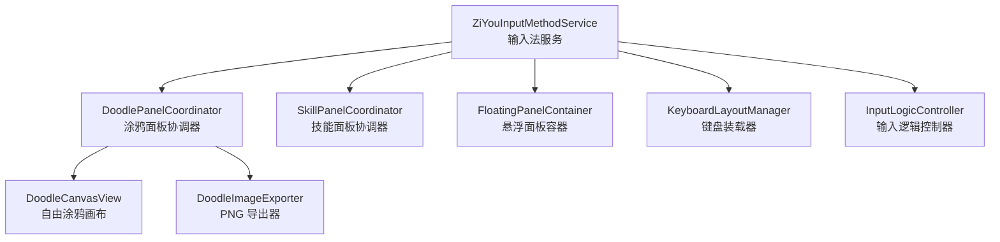
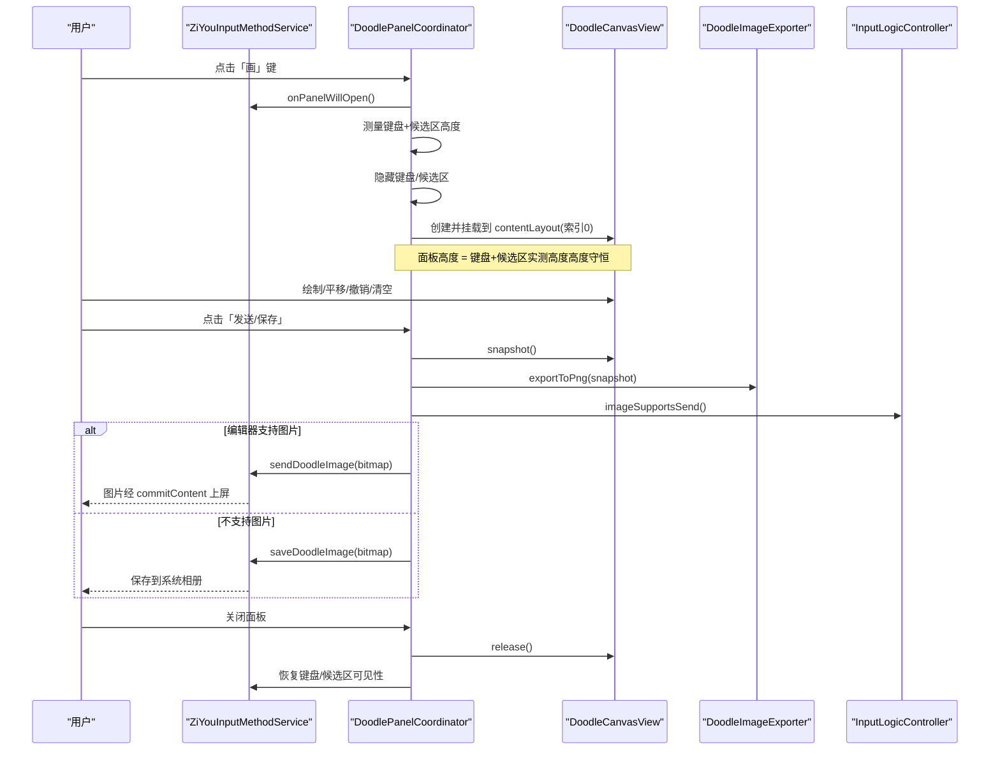
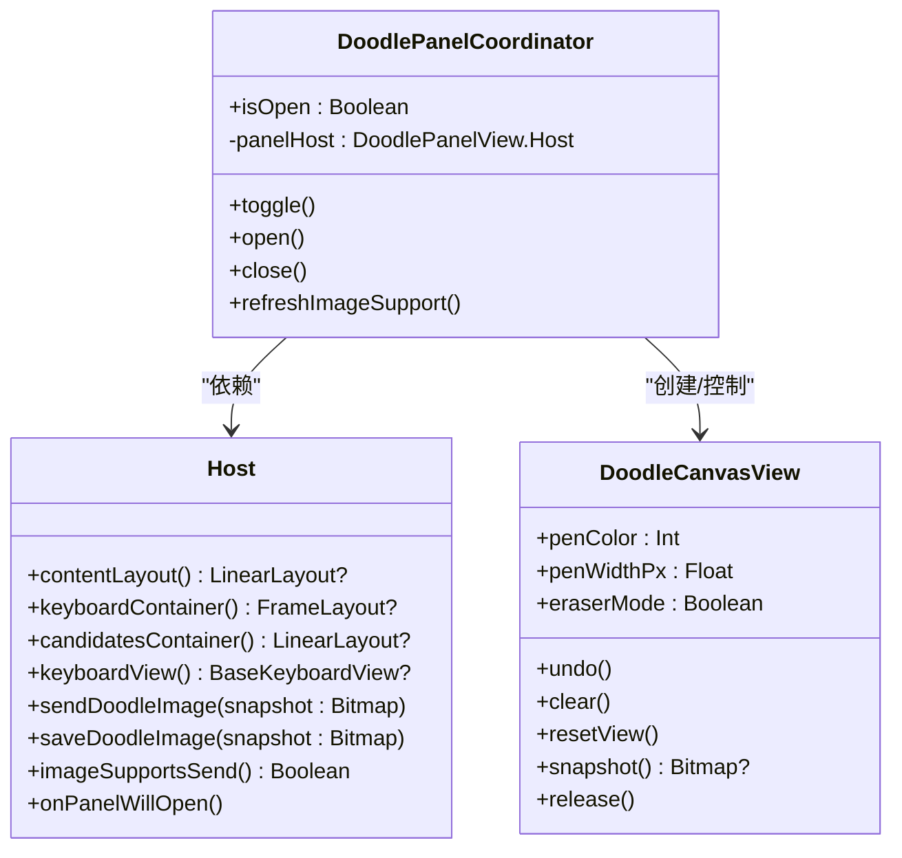
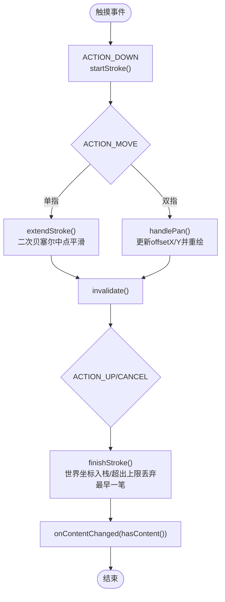
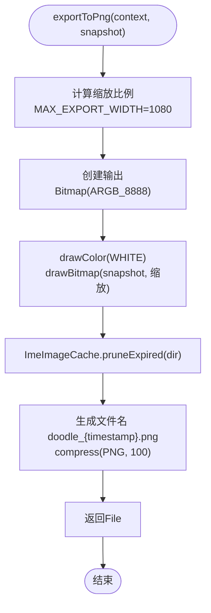
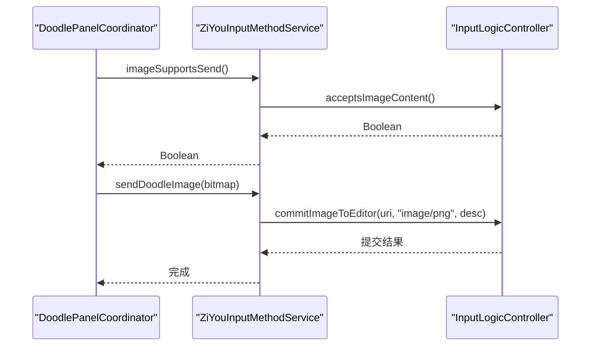
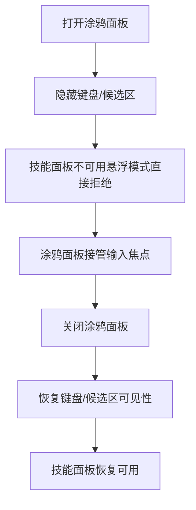
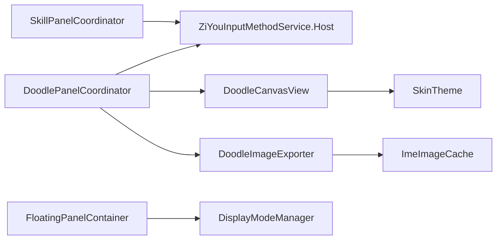

# 面板协调器

<cite>
**本文引用的文件**
- [DoodlePanelCoordinator.kt](file://app/src/main/java/com/ziyou/ime/ime/DoodlePanelCoordinator.kt)
- [DoodleCanvasView.kt](file://app/src/main/java/com/ziyou/ime/ime/DoodleCanvasView.kt)
- [DoodleImageExporter.kt](file://app/src/main/java/com/ziyou/ime/ime/DoodleImageExporter.kt)
- [ZiYouInputMethodService.kt](file://app/src/main/java/com/ziyou/ime/ime/ZiYouInputMethodService.kt)
- [SkillPanelCoordinator.kt](file://app/src/main/java/com/ziyou/ime/ime/SkillPanelCoordinator.kt)
- [FloatingPanelContainer.kt](file://app/src/main/java/com/ziyou/ime/ime/FloatingPanelContainer.kt)
- [KeyboardLayoutManager.kt](file://app/src/main/java/com/ziyou/ime/ime/KeyboardLayoutManager.kt)
- [InputLogicController.kt](file://app/src/main/java/com/ziyou/ime/ime/InputLogicController.kt)
</cite>

## 目录
1. [简介](#简介)
2. [项目结构](#项目结构)
3. [核心组件](#核心组件)
4. [架构总览](#架构总览)
5. [详细组件分析](#详细组件分析)
6. [依赖关系分析](#依赖关系分析)
7. [性能考量](#性能考量)
8. [故障排查指南](#故障排查指南)
9. [结论](#结论)
10. [附录：扩展与最佳实践](#附录扩展与最佳实践)

## 简介
本技术文档聚焦于“涂鸦面板协调器”（DoodlePanelCoordinator）及其相关子系统，系统性说明以下方面：
- 面板生命周期管理：创建、显示、隐藏、销毁的完整流程
- 与其他面板的互斥逻辑：打开涂鸦面板时键盘隐藏、技能面板不可用
- 布局调整机制：面板尺寸计算、位置定位、动画过渡效果
- 工具栏集成：画笔选择、颜色切换、撤销清空按钮的事件处理
- 输入法集成：图片插入编辑框、文本混合编辑、状态同步机制
- 面板状态持久化、用户偏好设置、主题适配
- 扩展点：如何扩展工具栏功能、自定义面板行为、处理面板间通信
- 用户体验优化建议与交互设计规范

## 项目结构
涂鸦面板系统由协调器、画布视图、导出器以及输入法服务共同组成。协调器负责生命周期与布局编排；画布视图负责绘制与手势；导出器负责将画布内容合成 PNG 并输出到可提交路径；输入法服务提供宿主能力（容器访问、上屏出口、输入路由切换）。

**图表来源**
- [ZiYouInputMethodService.kt:174-200](file://app/src/main/java/com/ziyou/ime/ime/ZiYouInputMethodService.kt#L174-L200)
- [DoodlePanelCoordinator.kt:25-135](file://app/src/main/java/com/ziyou/ime/ime/DoodlePanelCoordinator.kt#L25-L135)
- [DoodleCanvasView.kt:42-475](file://app/src/main/java/com/ziyou/ime/ime/DoodleCanvasView.kt#L42-L475)
- [DoodleImageExporter.kt:21-64](file://app/src/main/java/com/ziyou/ime/ime/DoodleImageExporter.kt#L21-L64)
- [SkillPanelCoordinator.kt:31-257](file://app/src/main/java/com/ziyou/ime/ime/SkillPanelCoordinator.kt#L31-L257)
- [FloatingPanelContainer.kt:40-251](file://app/src/main/java/com/ziyou/ime/ime/FloatingPanelContainer.kt#L40-L251)
- [KeyboardLayoutManager.kt:19-145](file://app/src/main/java/com/ziyou/ime/ime/KeyboardLayoutManager.kt#L19-L145)
- [InputLogicController.kt:43-200](file://app/src/main/java/com/ziyou/ime/ime/InputLogicController.kt#L43-L200)

**章节来源**
- [DoodlePanelCoordinator.kt:25-135](file://app/src/main/java/com/ziyou/ime/ime/DoodlePanelCoordinator.kt#L25-L135)
- [DoodleCanvasView.kt:42-475](file://app/src/main/java/com/ziyou/ime/ime/DoodleCanvasView.kt#L42-L475)
- [DoodleImageExporter.kt:21-64](file://app/src/main/java/com/ziyou/ime/ime/DoodleImageExporter.kt#L21-L64)
- [ZiYouInputMethodService.kt:174-200](file://app/src/main/java/com/ziyou/ime/ime/ZiYouInputMethodService.kt#L174-L200)
- [SkillPanelCoordinator.kt:31-257](file://app/src/main/java/com/ziyou/ime/ime/SkillPanelCoordinator.kt#L31-L257)
- [FloatingPanelContainer.kt:40-251](file://app/src/main/java/com/ziyou/ime/ime/FloatingPanelContainer.kt#L40-L251)
- [KeyboardLayoutManager.kt:19-145](file://app/src/main/java/com/ziyou/ime/ime/KeyboardLayoutManager.kt#L19-L145)
- [InputLogicController.kt:43-200](file://app/src/main/java/com/ziyou/ime/ime/InputLogicController.kt#L43-L200)

## 核心组件
- 涂鸦面板协调器（DoodlePanelCoordinator）
  - 职责：面板生命周期管理、键盘/候选区收放与高度守恒、与宿主的能力对接（容器访问、图片发送出口）、与画布视图的交互（撤销/清空/发送/保存）
  - 关键接口 Host：contentLayout、keyboardContainer、candidatesContainer、keyboardView、sendDoodleImage、saveDoodleImage、imageSupportsSend、onPanelWillOpen
- 自由涂鸦画布（DoodleCanvasView）
  - 职责：无限画布（世界坐标 + 视口平移）、双层渲染（离屏位图缓存 + 实时笔迹）、手势区分（单指绘制/双指平移）、编辑操作（撤销/清空/复位/快照）
- 图片导出器（DoodleImageExporter）
  - 职责：将透明底笔画层合成为白底 PNG，按宽度降采样，写入 FileProvider 暴露的缓存目录，供 commitContent 直接提交
- 输入法服务（ZiYouInputMethodService）
  - 职责：作为宿主实现 DoodlePanelCoordinator.Host，提供容器访问、图片发送/保存、编辑器是否支持图片、面板打开前清理编码等能力
- 技能面板协调器（SkillPanelCoordinator）
  - 职责：三态布局（键盘叠层/提升挂载/收缩态），与涂鸦面板互斥（打开涂鸦时不开放技能面板）
- 悬浮面板容器（FloatingPanelContainer）
  - 职责：悬浮形态下的面板几何计算、拖拽移动、触摸区域裁剪（insets）
- 键盘装载器（KeyboardLayoutManager）
  - 职责：键盘视图装配与回调绑定，为协调器提供键盘容器引用
- 输入逻辑控制器（InputLogicController）
  - 职责：按键处理、commitTarget 路由、富媒体提交（图片）入口，协调器通过它判断编辑器是否接受图片

**章节来源**
- [DoodlePanelCoordinator.kt:25-135](file://app/src/main/java/com/ziyou/ime/ime/DoodlePanelCoordinator.kt#L25-L135)
- [DoodleCanvasView.kt:42-475](file://app/src/main/java/com/ziyou/ime/ime/DoodleCanvasView.kt#L42-L475)
- [DoodleImageExporter.kt:21-64](file://app/src/main/java/com/ziyou/ime/ime/DoodleImageExporter.kt#L21-L64)
- [ZiYouInputMethodService.kt:174-200](file://app/src/main/java/com/ziyou/ime/ime/ZiYouInputMethodService.kt#L174-L200)
- [SkillPanelCoordinator.kt:31-257](file://app/src/main/java/com/ziyou/ime/ime/SkillPanelCoordinator.kt#L31-L257)
- [FloatingPanelContainer.kt:40-251](file://app/src/main/java/com/ziyou/ime/ime/FloatingPanelContainer.kt#L40-L251)
- [KeyboardLayoutManager.kt:19-145](file://app/src/main/java/com/ziyou/ime/ime/KeyboardLayoutManager.kt#L19-L145)
- [InputLogicController.kt:43-200](file://app/src/main/java/com/ziyou/ime/ime/InputLogicController.kt#L43-L200)

## 架构总览
涂鸦面板系统与输入法服务及其他面板协调器的协作关系如下：

**图表来源**
- [DoodlePanelCoordinator.kt:71-119](file://app/src/main/java/com/ziyou/ime/ime/DoodlePanelCoordinator.kt#L71-L119)
- [DoodleCanvasView.kt:438-475](file://app/src/main/java/com/ziyou/ime/ime/DoodleCanvasView.kt#L438-L475)
- [DoodleImageExporter.kt:32-64](file://app/src/main/java/com/ziyou/ime/ime/DoodleImageExporter.kt#L32-L64)
- [ZiYouInputMethodService.kt:180-200](file://app/src/main/java/com/ziyou/ime/ime/ZiYouInputMethodService.kt#L180-L200)
- [InputLogicController.kt:126-200](file://app/src/main/java/com/ziyou/ime/ime/InputLogicController.kt#L126-L200)

## 详细组件分析

### 涂鸦面板协调器（DoodlePanelCoordinator）
- 生命周期
  - open：获取容器引用，调用 onPanelWillOpen 清理活跃编码与候选展示；测量键盘+候选区高度（未测量回退固定 dp），隐藏二者；创建 DoodlePanelView（实际使用 DoodleCanvasView）并挂载到 contentLayout 索引 0，高度等于键盘+候选区之和；根据编辑器图片能力初始化按钮态
  - close：释放画布资源，恢复键盘/候选区可见性，从父容器移除
  - toggle：开关切换
  - refreshImageSupport：编辑器切换时刷新按钮态
- 互斥逻辑
  - 打开涂鸦面板时，键盘与候选区整体隐藏，技能面板在悬浮模式下被禁用（见 SkillPanelCoordinator 的悬浮模式检查）
- 布局调整
  - 高度守恒策略：IME 窗口总高不变，面板接管键盘+候选区空间
  - 位置定位：contentLayout 索引 0（最顶部），确保覆盖键盘/候选区区域
- 工具栏集成
  - 通过 DoodlePanelView.Host 回调实现撤销、清空、发送/保存、震动反馈
- 与输入法的集成
  - 不接管 commitTarget 输入路由，对 Rime 引擎与输入链路零侵入
  - 图片发送走 InputLogicController 的富媒体提交入口（commitContent）

**图表来源**
- [DoodlePanelCoordinator.kt:25-135](file://app/src/main/java/com/ziyou/ime/ime/DoodlePanelCoordinator.kt#L25-L135)
- [DoodleCanvasView.kt:42-475](file://app/src/main/java/com/ziyou/ime/ime/DoodleCanvasView.kt#L42-L475)

**章节来源**
- [DoodlePanelCoordinator.kt:71-119](file://app/src/main/java/com/ziyou/ime/ime/DoodlePanelCoordinator.kt#L71-L119)
- [ZiYouInputMethodService.kt:180-200](file://app/src/main/java/com/ziyou/ime/ime/ZiYouInputMethodService.kt#L180-L200)

### 自由涂鸦画布（DoodleCanvasView）
- 坐标系与渲染
  - 世界坐标存储笔画，offsetX/Y 描述视口左上角；屏幕坐标 = 世界坐标 − offset
  - 双层渲染：底层离屏位图缓存当前视口可见笔迹；顶层仅绘制活动笔迹与网格
- 手势区分
  - 单指绘制（含历史采样补点）；第二指落下进入平移态并回滚试探中的笔画
- 编辑与导出
  - 撤销：弹出末笔后重放位图
  - 橡皮：CLEAR 混合模式增量绘入离屏位图
  - 导出：渲染全部内容包围盒（非仅视口），带尺寸上限防 OOM
- 性能
  - 单笔绘制期间 offset 恒定，收笔 O(1) 烙入位图；平移时整体重放受 MAX_STROKES 约束

**图表来源**
- [DoodleCanvasView.kt:226-330](file://app/src/main/java/com/ziyou/ime/ime/DoodleCanvasView.kt#L226-L330)
- [DoodleCanvasView.kt:345-390](file://app/src/main/java/com/ziyou/ime/ime/DoodleCanvasView.kt#L345-L390)

**章节来源**
- [DoodleCanvasView.kt:142-170](file://app/src/main/java/com/ziyou/ime/ime/DoodleCanvasView.kt#L142-L170)
- [DoodleCanvasView.kt:226-330](file://app/src/main/java/com/ziyou/ime/ime/DoodleCanvasView.kt#L226-L330)
- [DoodleCanvasView.kt:345-390](file://app/src/main/java/com/ziyou/ime/ime/DoodleCanvasView.kt#L345-L390)
- [DoodleCanvasView.kt:438-475](file://app/src/main/java/com/ziyou/ime/ime/DoodleCanvasView.kt#L438-L475)

### 图片导出器（DoodleImageExporter）
- 功能：将透明底笔画层合成为白底 PNG，宽度超限时等比降采样，写入 FileProvider 已暴露的缓存子目录
- 线程模型：纯 CPU 绘制 + PNG 压缩，须在后台线程调用；传入的快照由调用方负责 recycle

**图表来源**
- [DoodleImageExporter.kt:32-64](file://app/src/main/java/com/ziyou/ime/ime/DoodleImageExporter.kt#L32-L64)

**章节来源**
- [DoodleImageExporter.kt:21-64](file://app/src/main/java/com/ziyou/ime/ime/DoodleImageExporter.kt#L21-L64)

### 输入法服务（ZiYouInputMethodService）与协调器协作
- 作为 DoodlePanelCoordinator.Host 的实现，提供：
  - 容器访问：contentLayout、keyboardContainer、candidatesContainer、keyboardView
  - 图片发送/保存：sendDoodleImage、saveDoodleImage
  - 编辑器能力检测：imageSupportsSend（基于 InputLogicController.acceptsImageContent）
  - 面板打开前清理：onPanelWillOpen（clearCompositionForPanel）
- 与 InputLogicController 的富媒体提交：commitImageToEditor（URI + MIME + description）

**图表来源**
- [ZiYouInputMethodService.kt:180-200](file://app/src/main/java/com/ziyou/ime/ime/ZiYouInputMethodService.kt#L180-L200)
- [InputLogicController.kt:126-200](file://app/src/main/java/com/ziyou/ime/ime/InputLogicController.kt#L126-L200)

**章节来源**
- [ZiYouInputMethodService.kt:174-200](file://app/src/main/java/com/ziyou/ime/ime/ZiYouInputMethodService.kt#L174-L200)
- [InputLogicController.kt:126-200](file://app/src/main/java/com/ziyou/ime/ime/InputLogicController.kt#L126-L200)

### 与其他面板的互斥逻辑
- 技能面板（SkillPanelCoordinator）
  - 悬浮模式下提示暂不支持技能面板，避免 WebView 不可用场景
  - 三态布局（键盘叠层/提升挂载/收缩态）与涂鸦面板互斥：打开涂鸦面板时，键盘/候选区隐藏，技能面板无法抢占焦点
- 悬浮面板容器（FloatingPanelContainer）
  - 通过 translationX/Y 位移实现拖动，零 relayout；onComputeInsets 裁剪触摸区域，避免穿透

**图表来源**
- [SkillPanelCoordinator.kt:93-106](file://app/src/main/java/com/ziyou/ime/ime/SkillPanelCoordinator.kt#L93-L106)
- [FloatingPanelContainer.kt:174-206](file://app/src/main/java/com/ziyou/ime/ime/FloatingPanelContainer.kt#L174-L206)

**章节来源**
- [SkillPanelCoordinator.kt:93-106](file://app/src/main/java/com/ziyou/ime/ime/SkillPanelCoordinator.kt#L93-L106)
- [FloatingPanelContainer.kt:174-206](file://app/src/main/java/com/ziyou/ime/ime/FloatingPanelContainer.kt#L174-L206)

## 依赖关系分析
- DoodlePanelCoordinator 依赖 ZiYouInputMethodService 提供的 Host 能力
- DoodleCanvasView 依赖 SkinTheme 进行主题适配（描边色、背景色）
- DoodleImageExporter 依赖 ImeImageCache 进行缓存目录管理与过期清理
- SkillPanelCoordinator 与 DoodlePanelCoordinator 通过 Service 的宿主能力间接互斥
- FloatingPanelContainer 依赖 DisplayModeManager 持久化位置与几何计算

**图表来源**
- [DoodlePanelCoordinator.kt:25-135](file://app/src/main/java/com/ziyou/ime/ime/DoodlePanelCoordinator.kt#L25-L135)
- [DoodleCanvasView.kt:42-475](file://app/src/main/java/com/ziyou/ime/ime/DoodleCanvasView.kt#L42-L475)
- [DoodleImageExporter.kt:21-64](file://app/src/main/java/com/ziyou/ime/ime/DoodleImageExporter.kt#L21-L64)
- [SkillPanelCoordinator.kt:31-257](file://app/src/main/java/com/ziyou/ime/ime/SkillPanelCoordinator.kt#L31-L257)
- [FloatingPanelContainer.kt:40-251](file://app/src/main/java/com/ziyou/ime/ime/FloatingPanelContainer.kt#L40-L251)

**章节来源**
- [DoodlePanelCoordinator.kt:25-135](file://app/src/main/java/com/ziyou/ime/ime/DoodlePanelCoordinator.kt#L25-L135)
- [DoodleCanvasView.kt:42-475](file://app/src/main/java/com/ziyou/ime/ime/DoodleCanvasView.kt#L42-L475)
- [DoodleImageExporter.kt:21-64](file://app/src/main/java/com/ziyou/ime/ime/DoodleImageExporter.kt#L21-L64)
- [SkillPanelCoordinator.kt:31-257](file://app/src/main/java/com/ziyou/ime/ime/SkillPanelCoordinator.kt#L31-L257)
- [FloatingPanelContainer.kt:40-251](file://app/src/main/java/com/ziyou/ime/ime/FloatingPanelContainer.kt#L40-L251)

## 性能考量
- 画布渲染
  - 双层渲染保证绘制热路径 O(1)，仅在平移或撤销时整体重放（受 MAX_STROKES 约束）
  - 离屏位图缓存减少重复绘制开销
- 导出性能
  - 导出器在后台线程执行，避免阻塞主线程；宽度超限时降采样防止 OOM
- 布局调整
  - 高度守恒策略避免频繁 relayout；translationX/Y 位移实现零 relayout 拖动
- 输入路径
  - InputLogicController 使用 Mutex 串行化输入事务，避免按键交错导致的错乱

[本节为通用性能指导，无需特定文件来源]

## 故障排查指南
- 面板无法打开
  - 检查 Host.contentLayout/keyboardContainer/candidatesContainer 是否为空
  - 确认 onPanelWillOpen 清理编码成功
- 图片发送失败
  - 检查 editorAcceptsImage/imageSupportsSend 返回值
  - 确认 FileProvider URI 生成与权限配置正确
- 画布卡顿
  - 检查 strokes 数量是否超过 MAX_STROKES，必要时降低笔宽或启用自动清理
  - 确认导出与重放不在主线程阻塞
- 悬浮面板触摸异常
  - 检查 getPanelRectInWindow 返回值与 insets 裁剪是否正确

**章节来源**
- [DoodlePanelCoordinator.kt:71-119](file://app/src/main/java/com/ziyou/ime/ime/DoodlePanelCoordinator.kt#L71-L119)
- [DoodleImageExporter.kt:32-64](file://app/src/main/java/com/ziyou/ime/ime/DoodleImageExporter.kt#L32-L64)
- [FloatingPanelContainer.kt:130-136](file://app/src/main/java/com/ziyou/ime/ime/FloatingPanelContainer.kt#L130-L136)

## 结论
涂鸦面板协调器通过清晰的生命周期管理、高度守恒的布局策略以及与输入法的解耦设计，实现了稳定高效的涂鸦输入体验。与技能面板的互斥逻辑确保了多面板场景下的稳定性。画布的双层渲染与导出器的降采样策略保障了性能与内存安全。通过 Host 抽象与 CommitTarget 路由，系统具备良好的扩展性与可测试性。

[本节为总结，无需特定文件来源]

## 附录：扩展与最佳实践
- 扩展工具栏功能
  - 在 DoodlePanelView.Host 中新增回调方法，并在协调器中转发到画布视图
  - 示例路径：[DoodlePanelCoordinator.kt:123-133](file://app/src/main/java/com/ziyou/ime/ime/DoodlePanelCoordinator.kt#L123-L133)
- 自定义面板行为
  - 继承 DoodleCanvasView 并重写手势处理或渲染逻辑
  - 示例路径：[DoodleCanvasView.kt:226-330](file://app/src/main/java/com/ziyou/ime/ime/DoodleCanvasView.kt#L226-L330)
- 处理面板间通信
  - 通过 InputLogicController.CommitTarget 实现文本路由，或通过 Service 的宿主能力传递图片
  - 示例路径：[InputLogicController.kt:95-112](file://app/src/main/java/com/ziyou/ime/ime/InputLogicController.kt#L95-L112)
- 用户体验优化建议
  - 保持面板打开时的键盘隐藏与候选区收起，避免视觉混乱
  - 提供即时撤销与清空反馈，增强用户掌控感
  - 深色主题下确保导出图白底可读
- 交互设计规范
  - 单指绘制、双指平移的手势区分明确，避免误触
  - 面板关闭时恢复键盘状态，确保输入连续性

**章节来源**
- [DoodlePanelCoordinator.kt:123-133](file://app/src/main/java/com/ziyou/ime/ime/DoodlePanelCoordinator.kt#L123-L133)
- [DoodleCanvasView.kt:226-330](file://app/src/main/java/com/ziyou/ime/ime/DoodleCanvasView.kt#L226-L330)
- [InputLogicController.kt:95-112](file://app/src/main/java/com/ziyou/ime/ime/InputLogicController.kt#L95-L112)