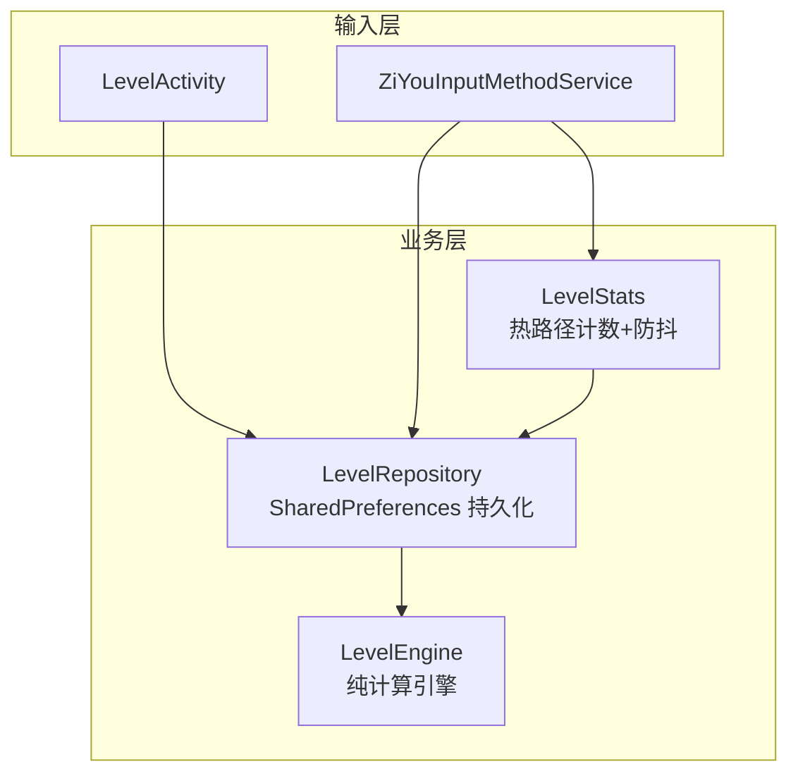
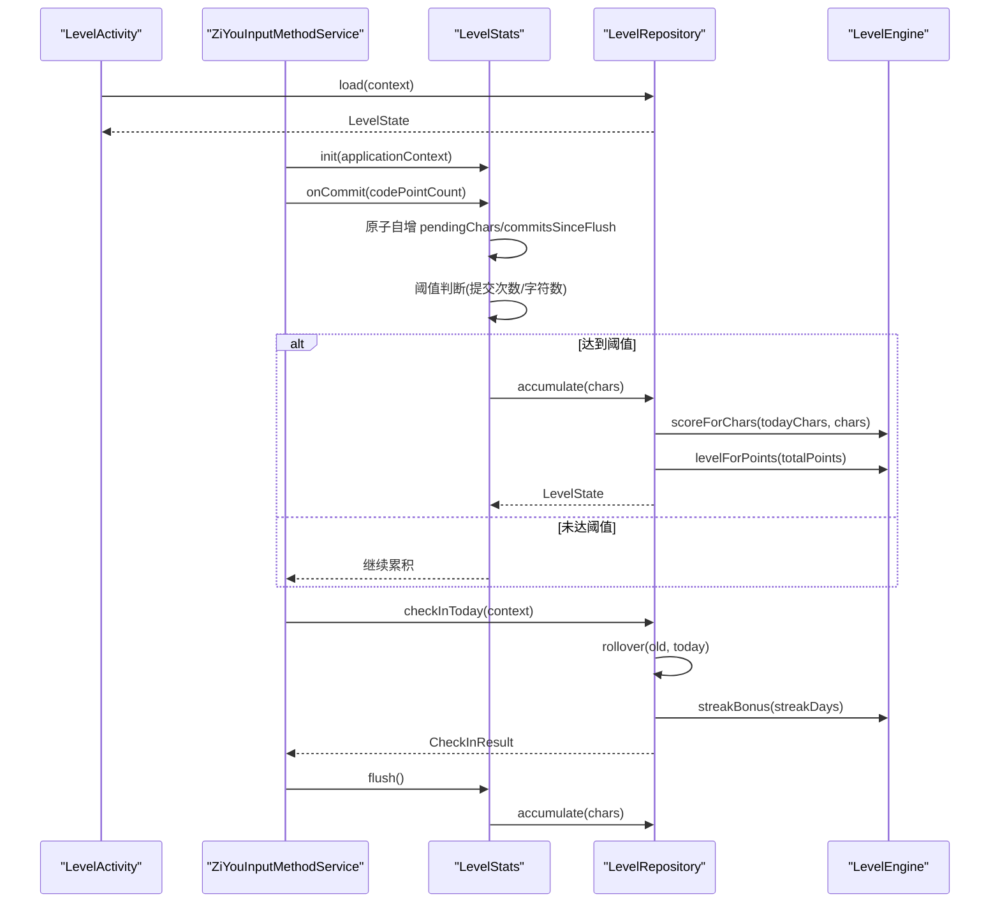
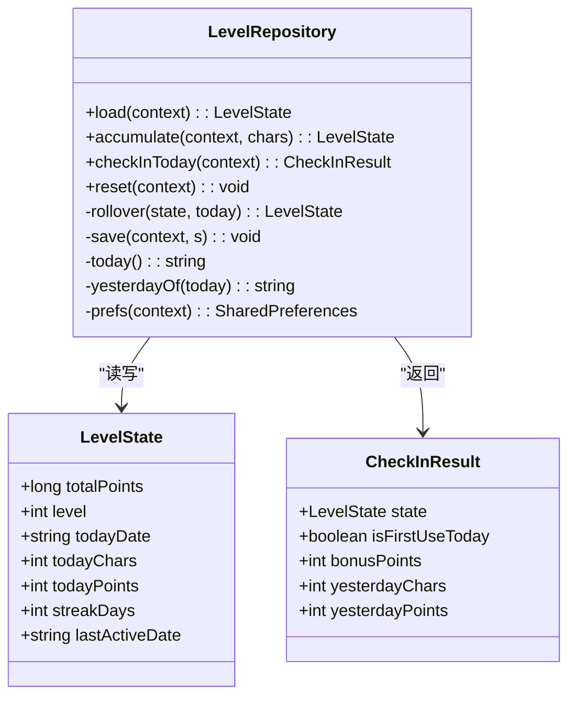
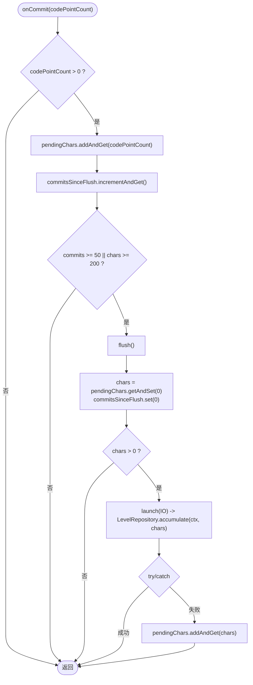
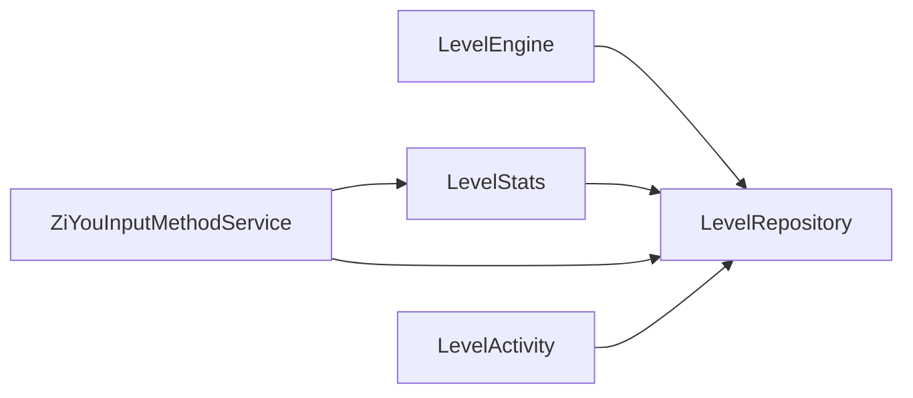

# 数据持久化

<cite>
**本文引用的文件**   
- [LevelRepository.kt](file://app/src/main/java/com/ziyou/ime/level/LevelRepository.kt)
- [LevelStats.kt](file://app/src/main/java/com/ziyou/ime/level/LevelStats.kt)
- [LevelEngine.kt](file://core-logic/src/main/java/com/ziyou/ime/core/level/LevelEngine.kt)
- [ZiYouInputMethodService.kt](file://app/src/main/java/com/ziyou/ime/ime/ZiYouInputMethodService.kt)
- [LevelActivity.kt](file://app/src/main/java/com/ziyou/ime/ui/LevelActivity.kt)
</cite>

## 目录
1. [简介](#简介)
2. [项目结构](#项目结构)
3. [核心组件](#核心组件)
4. [架构总览](#架构总览)
5. [详细组件分析](#详细组件分析)
6. [依赖关系分析](#依赖关系分析)
7. [性能考量](#性能考量)
8. [故障排查指南](#故障排查指南)
9. [结论](#结论)
10. [附录：使用示例与最佳实践](#附录使用示例与最佳实践)

## 简介
本文件聚焦 LevelRepository 数据持久化层，围绕 SharedPreferences 单一数据源设计，阐述 LevelState 数据模型、幂等签到逻辑、异步写入策略、数据一致性保证以及与热路径组件 LevelStats 的协作方式。文档同时给出初始化、查询等级状态、更新积分与签到记录的调用流程说明，并解释与 LevelEngine 纯计算引擎的职责边界。

## 项目结构
- 持久化仓库：LevelRepository（SharedPreferences 单点读写）
- 热路径计数：LevelStats（内存计数 + 防抖批量落盘）
- 纯计算引擎：LevelEngine（等级曲线、分段计分、连续天数奖励、权益解锁）
- IME 服务集成：ZiYouInputMethodService（生命周期节点触发签到与落盘）
- UI 展示：LevelActivity（读取并展示等级状态）

图表来源
- [LevelActivity.kt:39](file://app/src/main/java/com/ziyou/ime/ui/LevelActivity.kt#L39)
- [ZiYouInputMethodService.kt:361](file://app/src/main/java/com/ziyou/ime/ime/ZiYouInputMethodService.kt#L361)
- [ZiYouInputMethodService.kt:825](file://app/src/main/java/com/ziyou/ime/ime/ZiYouInputMethodService.kt#L825)
- [ZiYouInputMethodService.kt:857](file://app/src/main/java/com/ziyou/ime/ime/ZiYouInputMethodService.kt#L857)
- [ZiYouInputMethodService.kt:1540](file://app/src/main/java/com/ziyou/ime/ime/ZiYouInputMethodService.kt#L1540)
- [LevelStats.kt:52](file://app/src/main/java/com/ziyou/ime/level/LevelStats.kt#L52)
- [LevelStats.kt:65](file://app/src/main/java/com/ziyou/ime/level/LevelStats.kt#L65)
- [LevelRepository.kt:68](file://app/src/main/java/com/ziyou/ime/level/LevelRepository.kt#L68)
- [LevelRepository.kt:87](file://app/src/main/java/com/ziyou/ime/level/LevelRepository.kt#L87)
- [LevelRepository.kt:108](file://app/src/main/java/com/ziyou/ime/level/LevelRepository.kt#L108)
- [LevelEngine.kt:69](file://core-logic/src/main/java/com/ziyou/ime/core/level/LevelEngine.kt#L69)

章节来源
- [LevelRepository.kt:1-181](file://app/src/main/java/com/ziyou/ime/level/LevelRepository.kt#L1-L181)
- [LevelStats.kt:1-82](file://app/src/main/java/com/ziyou/ime/level/LevelStats.kt#L1-L82)
- [LevelEngine.kt:1-187](file://core-logic/src/main/java/com/ziyou/ime/core/level/LevelEngine.kt#L1-L187)
- [ZiYouInputMethodService.kt:350-549](file://app/src/main/java/com/ziyou/ime/ime/ZiYouInputMethodService.kt#L350-L549)
- [ZiYouInputMethodService.kt:820-870](file://app/src/main/java/com/ziyou/ime/ime/ZiYouInputMethodService.kt#L820-L870)
- [ZiYouInputMethodService.kt:1530-1556](file://app/src/main/java/com/ziyou/ime/ime/ZiYouInputMethodService.kt#L1530-L1556)
- [LevelActivity.kt:34-51](file://app/src/main/java/com/ziyou/ime/ui/LevelActivity.kt#L34-L51)

## 核心组件
- LevelRepository：以 SharedPreferences 为唯一数据源，提供加载、累计积分、每日签到、重置等方法；所有写操作加锁保证一致性。
- LevelStats：热路径计数器，仅做原子自增与阈值判断，达到提交次数或字符数阈值后在后台线程批量落盘至 LevelRepository。
- LevelEngine：纯函数计算引擎，负责分段计分、等级判定、连续天数奖励、权益解锁规则等，无 I/O。
- ZiYouInputMethodService：IME 服务，负责在生命周期节点触发签到与落盘，确保首用奖励与尾部数据不丢失。
- LevelActivity：UI 页面，读取并展示当前等级状态与统计信息。

章节来源
- [LevelRepository.kt:53-181](file://app/src/main/java/com/ziyou/ime/level/LevelRepository.kt#L53-L181)
- [LevelStats.kt:21-82](file://app/src/main/java/com/ziyou/ime/level/LevelStats.kt#L21-L82)
- [LevelEngine.kt:14-187](file://core-logic/src/main/java/com/ziyou/ime/core/level/LevelEngine.kt#L14-L187)
- [ZiYouInputMethodService.kt:356-406](file://app/src/main/java/com/ziyou/ime/ime/ZiYouInputMethodService.kt#L356-L406)
- [LevelActivity.kt:34-51](file://app/src/main/java/com/ziyou/ime/ui/LevelActivity.kt#L34-L51)

## 架构总览
LevelRepository 作为单一数据源，屏蔽了 SharedPreferences 的具体实现细节，对外暴露简洁的 API。LevelStats 将高频上屏事件聚合到内存中，避免频繁磁盘 IO；当达到阈值或在 IME 生命周期节点时，统一通过 LevelRepository 进行落盘。LevelEngine 提供纯计算能力，确保积分、等级、奖励等逻辑可测试且稳定。

图表来源
- [LevelActivity.kt:39](file://app/src/main/java/com/ziyou/ime/ui/LevelActivity.kt#L39)
- [ZiYouInputMethodService.kt:361](file://app/src/main/java/com/ziyou/ime/ime/ZiYouInputMethodService.kt#L361)
- [ZiYouInputMethodService.kt:825](file://app/src/main/java/com/ziyou/ime/ime/ZiYouInputMethodService.kt#L825)
- [ZiYouInputMethodService.kt:857](file://app/src/main/java/com/ziyou/ime/ime/ZiYouInputMethodService.kt#L857)
- [ZiYouInputMethodService.kt:1540](file://app/src/main/java/com/ziyou/ime/ime/ZiYouInputMethodService.kt#L1540)
- [LevelStats.kt:52](file://app/src/main/java/com/ziyou/ime/level/LevelStats.kt#L52)
- [LevelStats.kt:65](file://app/src/main/java/com/ziyou/ime/level/LevelStats.kt#L65)
- [LevelRepository.kt:87](file://app/src/main/java/com/ziyou/ime/level/LevelRepository.kt#L87)
- [LevelRepository.kt:108](file://app/src/main/java/com/ziyou/ime/level/LevelRepository.kt#L108)
- [LevelEngine.kt:69](file://core-logic/src/main/java/com/ziyou/ime/core/level/LevelEngine.kt#L69)

## 详细组件分析

### LevelRepository：SharedPreferences 单一数据源
- 数据模型 LevelState
  - totalPoints：累计积分（只增不减）
  - level：当前等级
  - todayDate：当日日期（yyyy-MM-dd），用于跨日重置
  - todayChars：当日已上屏字符数（用于分段计分档位判定）
  - todayPoints：当日已获得积分（用于每日简报）
  - streakDays：连续使用天数
  - lastActiveDate：上次活跃日期（yyyy-MM-dd）

- 关键方法
  - load(context)：从 SharedPreferences 读取 LevelState
  - accumulate(context, chars)：累计本次批量上屏字符并结算积分，返回最新状态
  - checkInToday(context)：标记当日活跃，发放每日首用与连续天数奖励（幂等）
  - reset(context)：清空全部等级数据（测试/重置用途）

- 内部机制
  - rollover(state, today)：若日期变更则重置当日计数（保留累计分与等级）
  - save(context, s)：将 LevelState 写入 SharedPreferences（apply 异步落盘）
  - today()/yesterdayOf(today)/prefs(context)：工具方法

- 一致性保障
  - 所有写方法 @Synchronized，防止并发写入导致的状态不一致
  - 跨日重置与奖励发放在同一同步块内完成，避免竞态

图表来源
- [LevelRepository.kt:15-30](file://app/src/main/java/com/ziyou/ime/level/LevelRepository.kt#L15-L30)
- [LevelRepository.kt:32-43](file://app/src/main/java/com/ziyou/ime/level/LevelRepository.kt#L32-L43)
- [LevelRepository.kt:68-181](file://app/src/main/java/com/ziyou/ime/level/LevelRepository.kt#L68-L181)

章节来源
- [LevelRepository.kt:15-30](file://app/src/main/java/com/ziyou/ime/level/LevelRepository.kt#L15-L30)
- [LevelRepository.kt:68-181](file://app/src/main/java/com/ziyou/ime/level/LevelRepository.kt#L68-L181)

### LevelStats：热路径计数与防抖落盘
- 设计约束
  - onCommit 处于输入热路径，仅做 O(1) 原子自增，绝不在此写磁盘
  - 达到提交次数或字符数阈值时才触发一次后台异步落盘
  - IME 生命周期节点主动调用 flush，避免尾部数据丢失

- 关键方法
  - init(context)：注入 applicationContext（不会造成泄漏）
  - onCommit(codePointCount)：原子自增 pendingChars 与 commitsSinceFlush，阈值判断后触发 flush
  - flush()：原子取出并清零待处理字符，在 IO 协程中调用 LevelRepository.accumulate

- 异常回滚
  - 落盘失败时记录日志并将字符数补回 pendingChars，等待下次落盘，避免丢分

图表来源
- [LevelStats.kt:52-59](file://app/src/main/java/com/ziyou/ime/level/LevelStats.kt#L52-L59)
- [LevelStats.kt:65-80](file://app/src/main/java/com/ziyou/ime/level/LevelStats.kt#L65-L80)

章节来源
- [LevelStats.kt:21-82](file://app/src/main/java/com/ziyou/ime/level/LevelStats.kt#L21-L82)

### LevelEngine：纯计算引擎
- 职责
  - 分段计分：前 2000 字每字 1 分，2000–6000 字每字 0.5 分，超出 6000 不再计分
  - 连续天数奖励：第 2 天起逐日 +5，单日封顶 +30；每满 7 天额外 +50
  - 等级判定：根据累计积分确定等级（1–10 级）
  - 权益解锁：皮肤与音效包的解锁规则

- 关键方法
  - scoreForChars(charsBeforeToday, addChars)：计算新增字符对应的积分
  - streakBonus(streakDays)：连续天数奖励
  - levelForPoints(totalPoints)：等级判定
  - progressInLevel(totalPoints)：当前等级进度
  - unlockedThemes/unlockedSoundPacks：权益解锁集合

章节来源
- [LevelEngine.kt:48-134](file://core-logic/src/main/java/com/ziyou/ime/core/level/LevelEngine.kt#L48-L134)
- [LevelEngine.kt:136-180](file://core-logic/src/main/java/com/ziyou/ime/core/level/LevelEngine.kt#L136-L180)

### ZiYouInputMethodService：IME 服务集成
- 初始化
  - onCreate 中调用 LevelStats.init(applicationContext)

- 每日签到
  - onStartInputView 中异步调用 LevelRepository.checkInToday，幂等发放首用奖励

- 落盘时机
  - onFinishInputView 与 onDestroy 中调用 LevelStats.flush，确保尾部数据不丢失

章节来源
- [ZiYouInputMethodService.kt:356-406](file://app/src/main/java/com/ziyou/ime/ime/ZiYouInputMethodService.kt#L356-L406)
- [ZiYouInputMethodService.kt:820-870](file://app/src/main/java/com/ziyou/ime/ime/ZiYouInputMethodService.kt#L820-L870)
- [ZiYouInputMethodService.kt:1530-1556](file://app/src/main/java/com/ziyou/ime/ime/ZiYouInputMethodService.kt#L1530-L1556)

### LevelActivity：UI 展示
- 数据来源
  - 通过 LevelRepository.load(this) 获取 LevelState，并在 Compose 界面展示

章节来源
- [LevelActivity.kt:34-51](file://app/src/main/java/com/ziyou/ime/ui/LevelActivity.kt#L34-L51)

## 依赖关系分析
- LevelRepository 依赖 SharedPreferences（Android 系统存储）与 LevelEngine（纯计算）
- LevelStats 依赖 LevelRepository 进行落盘
- ZiYouInputMethodService 依赖 LevelStats 与 LevelRepository
- LevelActivity 依赖 LevelRepository 读取状态

图表来源
- [LevelRepository.kt:87](file://app/src/main/java/com/ziyou/ime/level/LevelRepository.kt#L87)
- [LevelStats.kt:73](file://app/src/main/java/com/ziyou/ime/level/LevelStats.kt#L73)
- [ZiYouInputMethodService.kt:361](file://app/src/main/java/com/ziyou/ime/ime/ZiYouInputMethodService.kt#L361)
- [ZiYouInputMethodService.kt:825](file://app/src/main/java/com/ziyou/ime/ime/ZiYouInputMethodService.kt#L825)
- [LevelActivity.kt:39](file://app/src/main/java/com/ziyou/ime/ui/LevelActivity.kt#L39)

章节来源
- [LevelRepository.kt:87](file://app/src/main/java/com/ziyou/ime/level/LevelRepository.kt#L87)
- [LevelStats.kt:73](file://app/src/main/java/com/ziyou/ime/level/LevelStats.kt#L73)
- [ZiYouInputMethodService.kt:361](file://app/src/main/java/com/ziyou/ime/ime/ZiYouInputMethodService.kt#L361)
- [ZiYouInputMethodService.kt:825](file://app/src/main/java/com/ziyou/ime/ime/ZiYouInputMethodService.kt#L825)
- [LevelActivity.kt:39](file://app/src/main/java/com/ziyou/ime/ui/LevelActivity.kt#L39)

## 性能考量
- 热路径优化
  - LevelStats.onCommit 仅做原子自增，避免磁盘 IO
  - 阈值控制：提交次数≥50 或字符数≥200 才触发落盘，减少 I/O 频率
- 异步写入
  - LevelRepository.save 使用 apply 异步落盘，不阻塞主线程
  - LevelStats.flush 在 IO 协程中执行，避免阻塞输入视图
- 一致性保障
  - LevelRepository 写方法 @Synchronized，防止并发写入
  - LevelStats 异常回滚机制，确保不落盘时字符数不丢失

[本节为通用性能指导，不直接分析具体文件]

## 故障排查指南
- 常见问题
  - 签到重复发放：检查 lastActiveDate 是否等于今日日期，确保幂等逻辑生效
  - 积分未更新：确认 onCommit 与 flush 调用链路完整，检查阈值是否达到
  - 数据丢失：查看异常回滚逻辑，确认 pendingChars 是否正确补回

- 调试建议
  - 在 LevelStats.flush 中增加日志，观察落盘触发时机
  - 在 LevelRepository.accumulate/checkInToday 中增加日志，观察状态变化
  - 使用 reset(context) 清空数据后复现问题，验证初始状态正确性

章节来源
- [LevelStats.kt:73-79](file://app/src/main/java/com/ziyou/ime/level/LevelStats.kt#L73-L79)
- [LevelRepository.kt:108-141](file://app/src/main/java/com/ziyou/ime/level/LevelRepository.kt#L108-L141)

## 结论
LevelRepository 通过 SharedPreferences 单一数据源设计，结合 LevelStats 的热路径优化与 LevelEngine 的纯计算能力，实现了高效、一致、可测试的等级系统持久化方案。幂等签到逻辑确保用户每天只能获得一次首次使用奖励，异步写入策略与异常回滚机制保障了数据一致性。与 IME 服务的生命周期集成确保了首用奖励与尾部数据的正确处理。

[本节为总结性内容，不直接分析具体文件]

## 附录：使用示例与最佳实践

### 初始化仓库
- 在 IME 服务 onCreate 中调用 LevelStats.init(applicationContext)
- 在需要展示等级的 UI 页面调用 LevelRepository.load(context)

章节来源
- [ZiYouInputMethodService.kt:361](file://app/src/main/java/com/ziyou/ime/ime/ZiYouInputMethodService.kt#L361)
- [LevelActivity.kt:39](file://app/src/main/java/com/ziyou/ime/ui/LevelActivity.kt#L39)

### 查询等级状态
- 调用 LevelRepository.load(context) 获取 LevelState
- 在 UI 中展示当前等级、累计积分、今日统计等信息

章节来源
- [LevelRepository.kt:68-79](file://app/src/main/java/com/ziyou/ime/level/LevelRepository.kt#L68-L79)
- [LevelActivity.kt:39-51](file://app/src/main/java/com/ziyou/ime/ui/LevelActivity.kt#L39-L51)

### 更新积分与签到记录
- 在输入热路径调用 LevelStats.onCommit(codePointCount) 进行原子自增
- 在 IME 生命周期节点调用 LevelStats.flush() 触发落盘
- 在 onStartInputView 中调用 LevelRepository.checkInToday(context) 发放首用奖励

章节来源
- [LevelStats.kt:52-59](file://app/src/main/java/com/ziyou/ime/level/LevelStats.kt#L52-L59)
- [ZiYouInputMethodService.kt:825](file://app/src/main/java/com/ziyou/ime/ime/ZiYouInputMethodService.kt#L825)
- [ZiYouInputMethodService.kt:857](file://app/src/main/java/com/ziyou/ime/ime/ZiYouInputMethodService.kt#L857)
- [LevelRepository.kt:108-141](file://app/src/main/java/com/ziyou/ime/level/LevelRepository.kt#L108-L141)

### 与 LevelStats 热路径组件的协作关系
- LevelStats 负责热路径计数与防抖，LevelRepository 负责持久化
- 两者通过 accumulate 方法协作，确保数据一致性与性能
- IME 服务在生命周期节点协调两者的调用时机

章节来源
- [LevelStats.kt:65-80](file://app/src/main/java/com/ziyou/ime/level/LevelStats.kt#L65-L80)
- [LevelRepository.kt:87-102](file://app/src/main/java/com/ziyou/ime/level/LevelRepository.kt#L87-L102)
- [ZiYouInputMethodService.kt:820-870](file://app/src/main/java/com/ziyou/ime/ime/ZiYouInputMethodService.kt#L820-L870)