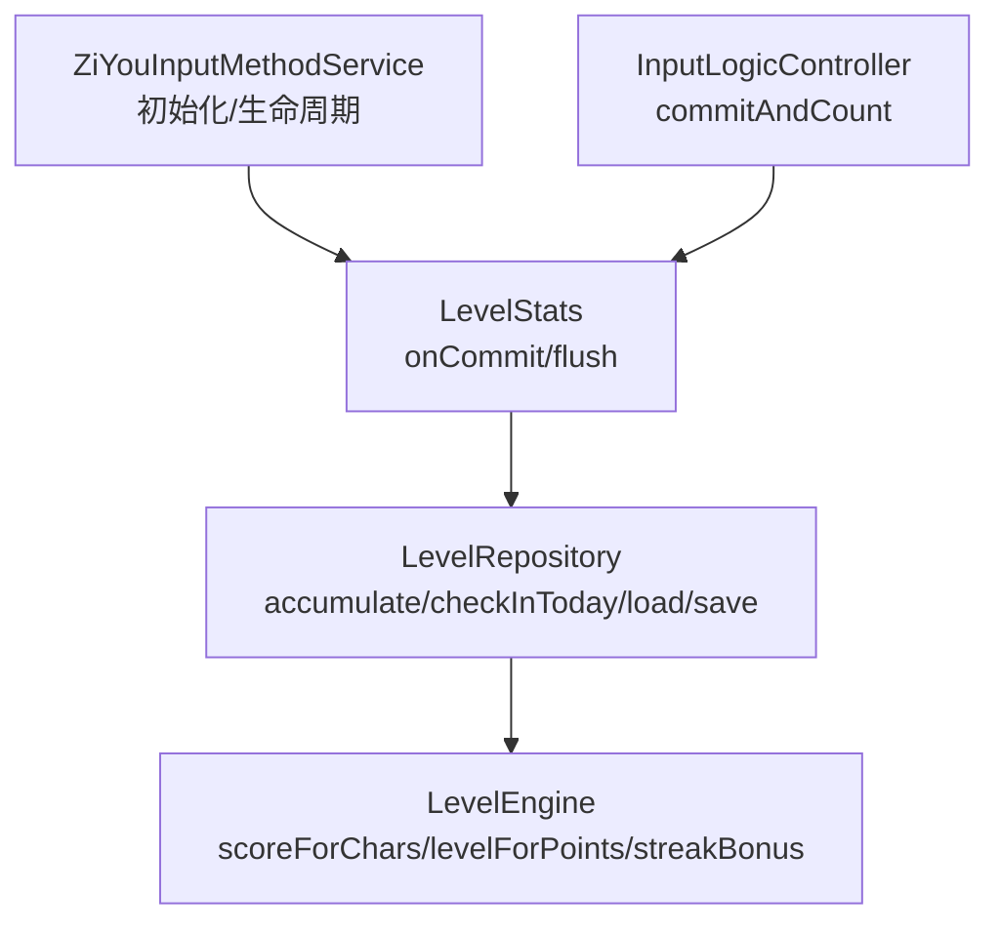
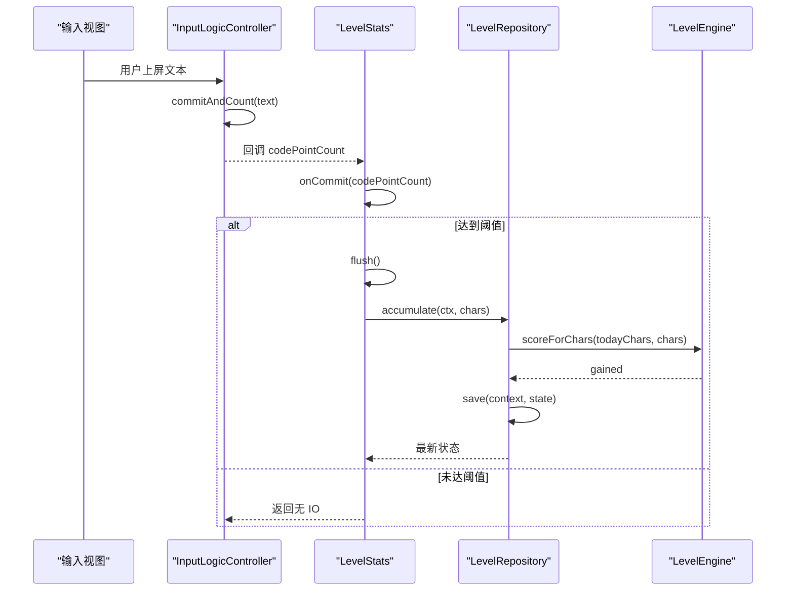
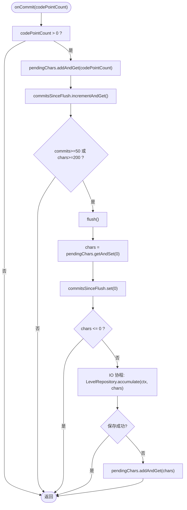
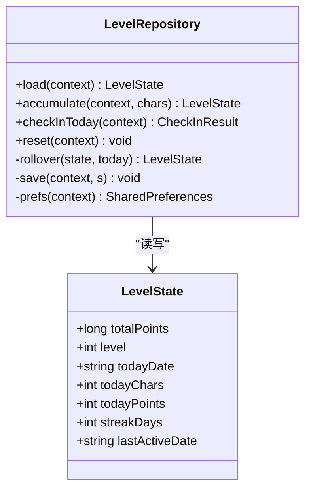
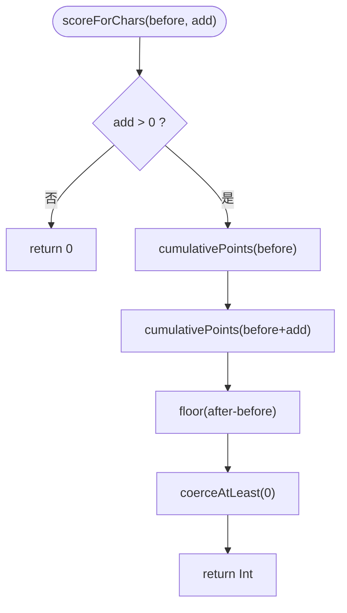
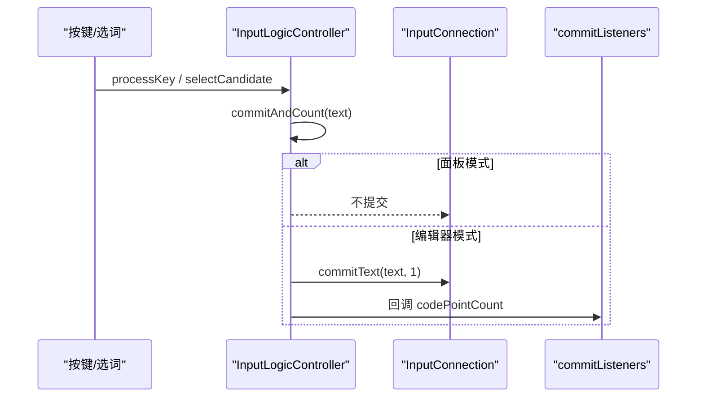
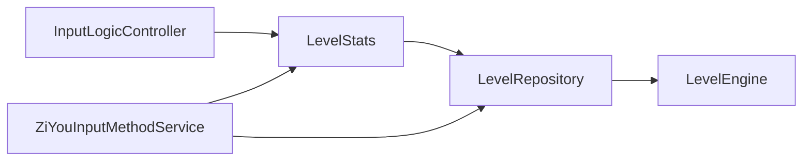

# 热路径优化

<cite>
**本文引用的文件**   
- [LevelStats.kt](file://app/src/main/java/com/ziyou/ime/level/LevelStats.kt)
- [LevelRepository.kt](file://app/src/main/java/com/ziyou/ime/level/LevelRepository.kt)
- [LevelEngine.kt](file://core-logic/src/main/java/com/ziyou/ime/core/level/LevelEngine.kt)
- [InputLogicController.kt](file://app/src/main/java/com/ziyou/ime/ime/InputLogicController.kt)
- [ZiYouInputMethodService.kt](file://app/src/main/java/com/ziyou/ime/ime/ZiYouInputMethodService.kt)
</cite>

## 目录
1. [引言](#引言)
2. [项目结构](#项目结构)
3. [核心组件](#核心组件)
4. [架构总览](#架构总览)
5. [详细组件分析](#详细组件分析)
6. [依赖关系分析](#依赖关系分析)
7. [性能考量](#性能考量)
8. [故障排查指南](#故障排查指南)
9. [结论](#结论)
10. [附录：调用示例与监控要点](#附录调用示例与监控要点)

## 引言
本文件聚焦 LevelStats 热路径优化，围绕以下目标展开：
- O(1) 原子自增实现与线程安全保证（AtomicInteger）
- 防抖落盘机制（提交次数或字符数阈值触发）
- 内存缓存策略（避免频繁磁盘 I/O）
- 数据同步机制（内存状态与持久化一致性）
- 输入提交流程中的高效调用方式
- 性能监控与调试方法

## 项目结构
与 LevelStats 热路径相关的代码分布在三个层次：
- 热路径入口与计数：LevelStats（内存计数、防抖、异步落盘）
- 持久化仓库：LevelRepository（SharedPreferences 读写、每日签到、累计结算）
- 纯计算引擎：LevelEngine（分段计分、等级判定、权益解锁）
- 输入控制器：InputLogicController（上屏出口 commitAndCount，回调码点数）
- IME 服务：ZiYouInputMethodService（初始化、生命周期节点 flush、每日签到）

**图表来源** 
- [ZiYouInputMethodService.kt:356-361](file://app/src/main/java/com/ziyou/ime/ime/ZiYouInputMethodService.kt#L356-L361)
- [LevelStats.kt:44-59](file://app/src/main/java/com/ziyou/ime/level/LevelStats.kt#L44-L59)
- [LevelRepository.kt:87-102](file://app/src/main/java/com/ziyou/ime/level/LevelRepository.kt#L87-L102)
- [LevelEngine.kt:69-74](file://core-logic/src/main/java/com/ziyou/ime/core/level/LevelEngine.kt#L69-L74)
- [InputLogicController.kt:493-504](file://app/src/main/java/com/ziyou/ime/ime/InputLogicController.kt#L493-L504)

**章节来源**
- [ZiYouInputMethodService.kt:356-361](file://app/src/main/java/com/ziyou/ime/ime/ZiYouInputMethodService.kt#L356-L361)
- [LevelStats.kt:21-81](file://app/src/main/java/com/ziyou/ime/level/LevelStats.kt#L21-L81)
- [LevelRepository.kt:53-102](file://app/src/main/java/com/ziyou/ime/level/LevelRepository.kt#L53-L102)
- [LevelEngine.kt:14-74](file://core-logic/src/main/java/com/ziyou/ime/core/level/LevelEngine.kt#L14-L74)
- [InputLogicController.kt:493-504](file://app/src/main/java/com/ziyou/ime/ime/InputLogicController.kt#L493-L504)

## 核心组件
- LevelStats：热路径入口，仅做 O(1) 原子自增；达到阈值后异步落盘；在 IME 生命周期节点主动 flush。
- LevelRepository：单一数据源，使用 SharedPreferences 持久化；所有写操作加锁保证一致性；提供 accumulate 与 checkInToday。
- LevelEngine：纯函数计算引擎，负责分段计分、等级判定、连续天数奖励等。
- InputLogicController：统一上屏出口 commitAndCount，向监听器传递脱敏的码点数。
- ZiYouInputMethodService：应用级初始化与生命周期管理，确保 flush 时机正确。

**章节来源**
- [LevelStats.kt:21-81](file://app/src/main/java/com/ziyou/ime/level/LevelStats.kt#L21-L81)
- [LevelRepository.kt:53-102](file://app/src/main/java/com/ziyou/ime/level/LevelRepository.kt#L53-L102)
- [LevelEngine.kt:14-74](file://core-logic/src/main/java/com/ziyou/ime/core/level/LevelEngine.kt#L14-L74)
- [InputLogicController.kt:493-504](file://app/src/main/java/com/ziyou/ime/ime/InputLogicController.kt#L493-L504)
- [ZiYouInputMethodService.kt:356-361](file://app/src/main/java/com/ziyou/ime/ime/ZiYouInputMethodService.kt#L356-L361)

## 架构总览
LevelStats 作为热路径唯一入口，将“高频计数”和“低频落盘”解耦：
- onCommit：O(1) 原子自增 pendingChars 与 commitsSinceFlush，不写磁盘
- 阈值判断：commits >= 50 或 chars >= 200 时触发 flush
- flush：原子取出并清零计数，IO 协程中调用 LevelRepository.accumulate
- LevelRepository：Synchronized 写入 SharedPreferences，结合 LevelEngine 计算积分与等级
- 输入流程：InputLogicController.commitAndCount 仅上报码点数，LevelStats.onCommit 接收

**图表来源** 
- [InputLogicController.kt:493-504](file://app/src/main/java/com/ziyou/ime/ime/InputLogicController.kt#L493-L504)
- [LevelStats.kt:52-79](file://app/src/main/java/com/ziyou/ime/level/LevelStats.kt#L52-L79)
- [LevelRepository.kt:87-102](file://app/src/main/java/com/ziyou/ime/level/LevelRepository.kt#L87-L102)
- [LevelEngine.kt:69-74](file://core-logic/src/main/java/com/ziyou/ime/core/level/LevelEngine.kt#L69-L74)

## 详细组件分析

### LevelStats：O(1) 原子自增与防抖落盘
- 数据结构
  - pendingChars：AtomicInteger，累计待落盘的字符数
  - commitsSinceFlush：AtomicInteger，自上次落盘以来的提交次数
- 关键方法
  - onCommit(codePointCount)：addAndGet/incrementAndGet，O(1) 原子更新；达到阈值则 flush
  - flush()：getAndSet(0) 原子取零，IO 协程调用 LevelRepository.accumulate；失败回滚 pendingChars
- 线程安全
  - AtomicInteger 保证并发自增与读取的原子性
  - @Volatile appContext 保证可见性
  - 异常回滚避免丢分

**图表来源** 
- [LevelStats.kt:52-79](file://app/src/main/java/com/ziyou/ime/level/LevelStats.kt#L52-L79)

**章节来源**
- [LevelStats.kt:21-81](file://app/src/main/java/com/ziyou/ime/level/LevelStats.kt#L21-L81)

### LevelRepository：持久化与一致性
- 数据模型：LevelState（totalPoints、level、todayDate、todayChars、todayPoints、streakDays、lastActiveDate）
- 关键方法
  - load(context)：从 SharedPreferences 读取
  - accumulate(context, chars)：@Synchronized 累加积分与等级，按日 rollover，save 持久化
  - checkInToday(context)：每日首次签到发放奖励，幂等
  - reset(context)：测试/重置用途
- 一致性保障
  - 所有写方法 @Synchronized，避免热路径异步落盘与设置页读取竞争
  - save 使用 apply 异步写入，但受 @Synchronized 保护

**图表来源** 
- [LevelRepository.kt:15-30](file://app/src/main/java/com/ziyou/ime/level/LevelRepository.kt#L15-L30)
- [LevelRepository.kt:68-102](file://app/src/main/java/com/ziyou/ime/level/LevelRepository.kt#L68-L102)
- [LevelRepository.kt:108-141](file://app/src/main/java/com/ziyou/ime/level/LevelRepository.kt#L108-L141)

**章节来源**
- [LevelRepository.kt:53-102](file://app/src/main/java/com/ziyou/ime/level/LevelRepository.kt#L53-L102)
- [LevelRepository.kt:108-141](file://app/src/main/java/com/ziyou/ime/level/LevelRepository.kt#L108-L141)

### LevelEngine：纯计算引擎
- 分段计分：前 2000 字每字 1 分，2000–6000 字每字 0.5 分，超过 6000 不再计分
- 等级判定：基于 LEVEL_THRESHOLDS 数组，线性扫描
- 连续天数奖励：逐日 +5，封顶 +30，每满 7 天额外 +50
- 权益解锁：皮肤与音效包按等级解锁

**图表来源** 
- [LevelEngine.kt:69-74](file://core-logic/src/main/java/com/ziyou/ime/core/level/LevelEngine.kt#L69-L74)
- [LevelEngine.kt:57-62](file://core-logic/src/main/java/com/ziyou/ime/core/level/LevelEngine.kt#L57-L62)

**章节来源**
- [LevelEngine.kt:14-74](file://core-logic/src/main/java/com/ziyou/ime/core/level/LevelEngine.kt#L14-L74)

### InputLogicController：输入提交流程与计分回调
- commitAndCount：统一上屏出口，若走宿主编辑器则计算 codePointCount 并回调 commitListeners
- processKey/selectCandidate：均通过 commitAndCount 触发计分回调
- commitTarget：面板路由时不触发计分回调（文本未真正发送给应用）

**图表来源** 
- [InputLogicController.kt:493-504](file://app/src/main/java/com/ziyou/ime/ime/InputLogicController.kt#L493-L504)
- [InputLogicController.kt:126-185](file://app/src/main/java/com/ziyou/ime/ime/InputLogicController.kt#L126-L185)
- [InputLogicController.kt:195-227](file://app/src/main/java/com/ziyou/ime/ime/InputLogicController.kt#L195-L227)

**章节来源**
- [InputLogicController.kt:493-504](file://app/src/main/java/com/ziyou/ime/ime/InputLogicController.kt#L493-L504)

### ZiYouInputMethodService：初始化与生命周期 flush
- onCreate：LevelStats.init(applicationContext)
- onStartInputView：LevelRepository.checkInToday 每日签到
- onFinishInputView：LevelStats.flush() 防止尾部数据丢失
- onDestroy：LevelStats.flush() 服务销毁前落盘

**章节来源**
- [ZiYouInputMethodService.kt:356-361](file://app/src/main/java/com/ziyou/ime/ime/ZiYouInputMethodService.kt#L356-L361)
- [ZiYouInputMethodService.kt:820-835](file://app/src/main/java/com/ziyou/ime/ime/ZiYouInputMethodService.kt#L820-L835)
- [ZiYouInputMethodService.kt:841-857](file://app/src/main/java/com/ziyou/ime/ime/ZiYouInputMethodService.kt#L841-L857)
- [ZiYouInputMethodService.kt:1535-1541](file://app/src/main/java/com/ziyou/ime/ime/ZiYouInputMethodService.kt#L1535-L1541)

## 依赖关系分析
- LevelStats 依赖 LevelRepository 进行持久化
- LevelRepository 依赖 LevelEngine 进行纯计算
- InputLogicController 通过 commitListeners 间接依赖 LevelStats
- ZiYouInputMethodService 负责初始化与生命周期管理

**图表来源** 
- [InputLogicController.kt:493-504](file://app/src/main/java/com/ziyou/ime/ime/InputLogicController.kt#L493-L504)
- [LevelStats.kt:71-79](file://app/src/main/java/com/ziyou/ime/level/LevelStats.kt#L71-L79)
- [LevelRepository.kt:87-102](file://app/src/main/java/com/ziyou/ime/level/LevelRepository.kt#L87-L102)
- [ZiYouInputMethodService.kt:356-361](file://app/src/main/java/com/ziyou/ime/ime/ZiYouInputMethodService.kt#L356-L361)

**章节来源**
- [LevelStats.kt:71-79](file://app/src/main/java/com/ziyou/ime/level/LevelStats.kt#L71-L79)
- [LevelRepository.kt:87-102](file://app/src/main/java/com/ziyou/ime/level/LevelRepository.kt#L87-L102)

## 性能考量
- 热路径 O(1)：onCommit 仅两次原子操作，无 I/O
- 防抖阈值：50 次提交或 200 字符任一满足即落盘，降低 I/O 频率
- 内存缓存：pendingChars 与 commitsSinceFlush 全内存计数
- 异步落盘：Dispatchers.IO 协程执行，避免阻塞主线程
- 一致性：@Synchronized 写操作，避免并发竞争
- 异常回滚：落盘失败回滚 pendingChars，避免丢分

[本节为通用指导，无需特定文件引用]

## 故障排查指南
- 日志定位
  - LevelStats：落盘失败会记录警告并回滚
  - InputLogicController：慢按键告警（>100ms）便于发现退化
- 常见问题
  - 尾部数据丢失：确认 onFinishInputView 与 onDestroy 是否调用 flush
  - 重复计分：检查 onCommit 是否被多次调用（面板模式不应触发）
  - 积分不更新：查看 LevelRepository.accumulate 是否被调用，SharedPreferences 是否可写
- 调试建议
  - 临时调低阈值验证落盘逻辑
  - 使用单元测试覆盖 commitAndCount 与 onCommit 路径

**章节来源**
- [LevelStats.kt:71-79](file://app/src/main/java/com/ziyou/ime/level/LevelStats.kt#L71-L79)
- [InputLogicController.kt:126-185](file://app/src/main/java/com/ziyou/ime/ime/InputLogicController.kt#L126-L185)

## 结论
LevelStats 通过 O(1) 原子自增与防抖落盘，实现了高吞吐、低延迟的热路径设计；配合 LevelRepository 的一致性写入与 LevelEngine 的纯计算，整体架构清晰、可扩展性强。IME 生命周期节点的 flush 保证了数据最终一致性，适合输入法高频输入场景。

[本节为总结，无需特定文件引用]

## 附录：调用示例与监控要点
- 调用示例（概念说明）
  - 在 InputLogicController.commitAndCount 中，对非空文本计算 codePointCount 并回调 commitListeners
  - LevelStats.onCommit 接收码点数，原子自增，达到阈值触发 flush
  - LevelRepository.accumulate 在 IO 协程中执行，调用 LevelEngine.scoreForChars 计算积分并持久化
- 监控要点
  - 慢按键告警：processKeyBulk 耗时超过阈值打 Log.w
  - 落盘失败：LevelStats 捕获异常并回滚 pendingChars
  - 每日签到：checkInToday 结果用于简报展示

**章节来源**
- [InputLogicController.kt:493-504](file://app/src/main/java/com/ziyou/ime/ime/InputLogicController.kt#L493-L504)
- [LevelStats.kt:52-79](file://app/src/main/java/com/ziyou/ime/level/LevelStats.kt#L52-L79)
- [LevelRepository.kt:87-102](file://app/src/main/java/com/ziyou/ime/level/LevelRepository.kt#L87-L102)
- [ZiYouInputMethodService.kt:820-835](file://app/src/main/java/com/ziyou/ime/ime/ZiYouInputMethodService.kt#L820-L835)