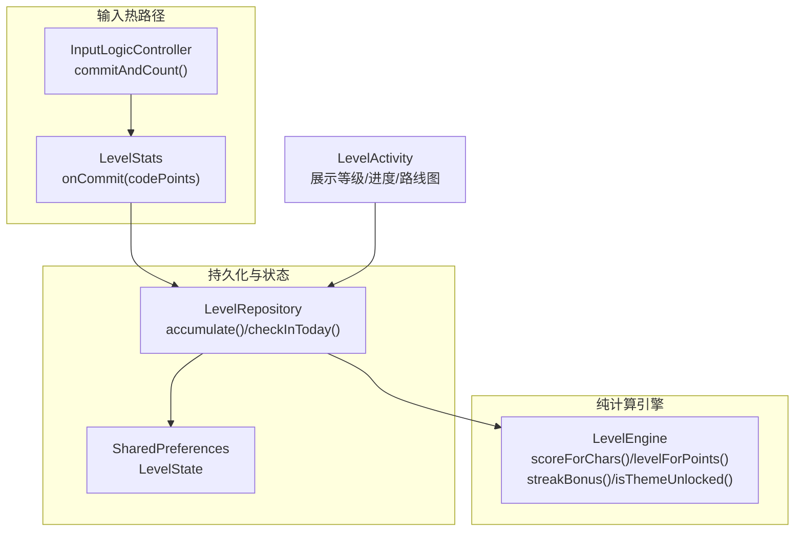
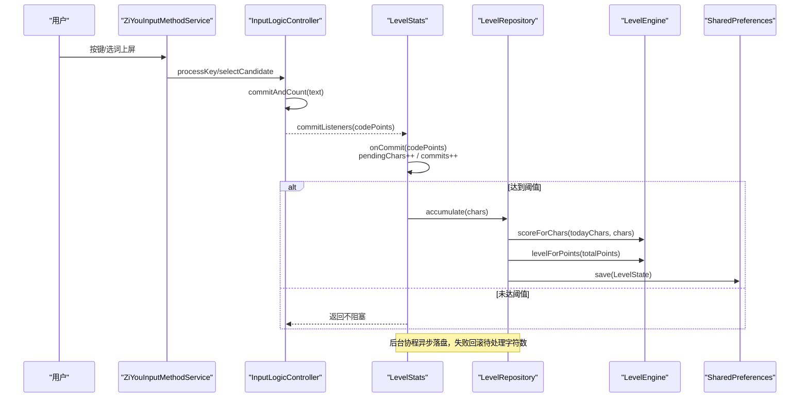
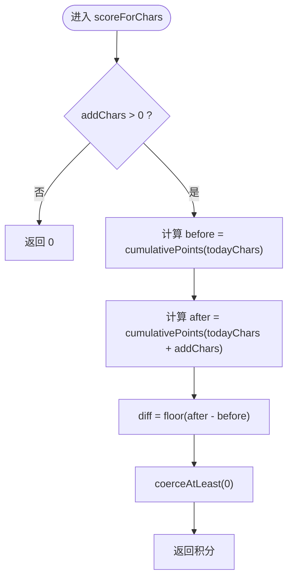
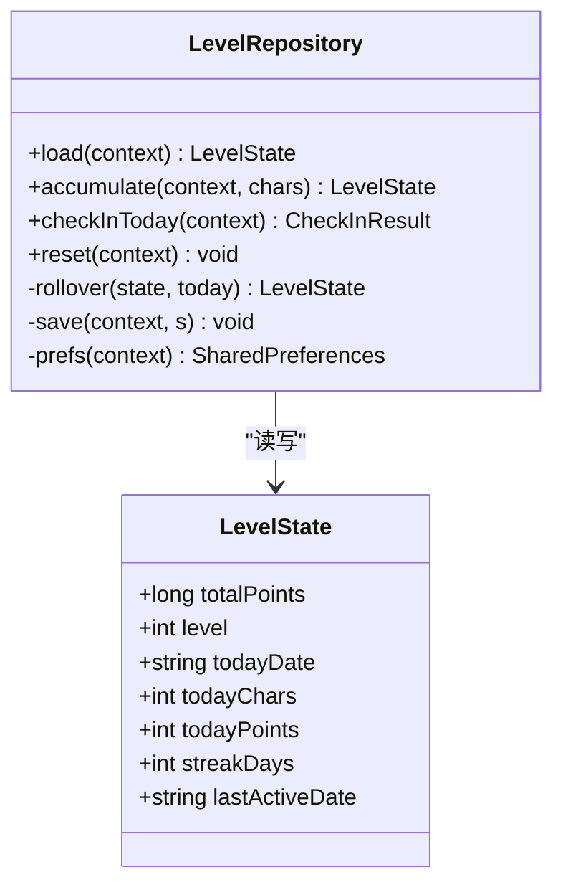
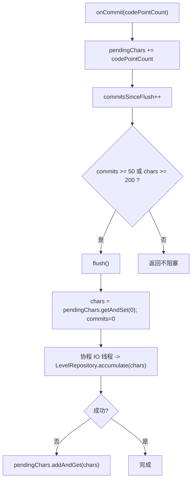
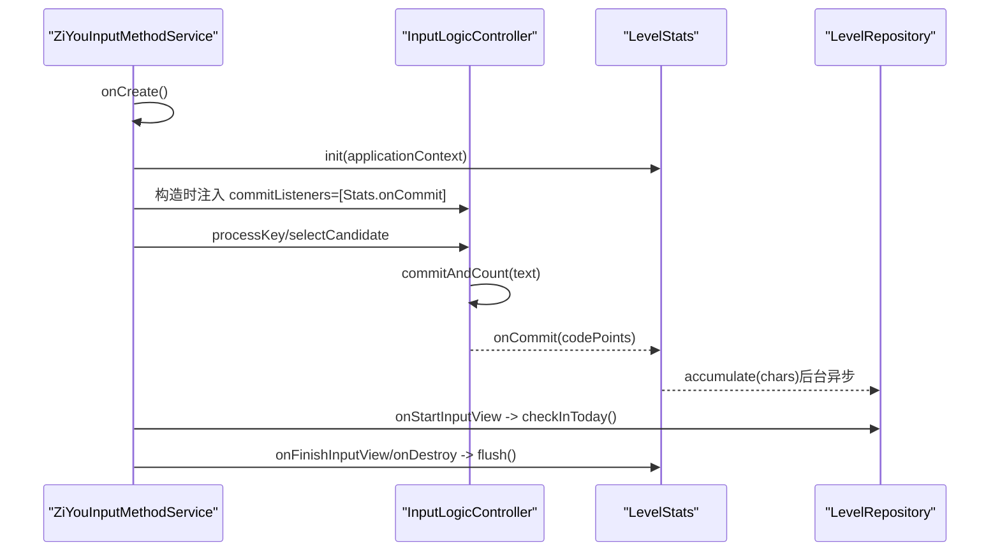
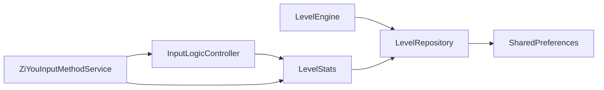

# 等级体系

<cite>
**本文引用的文件**   
- [LevelEngine.kt](file://core-logic/src/main/java/com/ziyou/ime/core/level/LevelEngine.kt)
- [LevelRepository.kt](file://app/src/main/java/com/ziyou/ime/level/LevelRepository.kt)
- [LevelStats.kt](file://app/src/main/java/com/ziyou/ime/level/LevelStats.kt)
- [InputLogicController.kt](file://app/src/main/java/com/ziyou/ime/ime/InputLogicController.kt)
- [ZiYouInputMethodService.kt](file://app/src/main/java/com/ziyou/ime/ime/ZiYouInputMethodService.kt)
- [LevelActivity.kt](file://app/src/main/java/com/ziyou/ime/ui/LevelActivity.kt)
</cite>

## 目录
1. [引言](#引言)
2. [项目结构](#项目结构)
3. [核心组件](#核心组件)
4. [架构总览](#架构总览)
5. [详细组件分析](#详细组件分析)
6. [依赖关系分析](#依赖关系分析)
7. [性能考量](#性能考量)
8. [故障排查指南](#故障排查指南)
9. [结论](#结论)
10. [附录：集成示例与最佳实践](#附录集成示例与最佳实践)

## 引言
本技术文档围绕输入法“等级体系”的实现进行系统化说明，覆盖纯函数计分引擎、持久化仓库、热路径统计、签到机制与权益解锁等关键模块。目标是帮助开发者快速理解并正确集成等级计分到输入提交流程中，同时保证高吞吐下的低延迟与数据一致性。

## 项目结构
等级体系由三层组成：
- 计算层（纯函数）：LevelEngine，负责分段计分、等级判定、权益解锁规则。
- 持久化层（单一数据源）：LevelRepository + LevelState，基于 SharedPreferences 的幂等签到与状态管理。
- 热路径层（内存计数+防抖落盘）：LevelStats，O(1) 原子自增，达到阈值异步批量落盘。

图表来源
- [InputLogicController.kt:493-504](file://app/src/main/java/com/ziyou/ime/ime/InputLogicController.kt#L493-L504)
- [LevelStats.kt:52-59](file://app/src/main/java/com/ziyou/ime/level/LevelStats.kt#L52-L59)
- [LevelRepository.kt:87-102](file://app/src/main/java/com/ziyou/ime/level/LevelRepository.kt#L87-L102)
- [LevelEngine.kt:69-74](file://core-logic/src/main/java/com/ziyou/ime/core/level/LevelEngine.kt#L69-L74)
- [LevelActivity.kt:39-50](file://app/src/main/java/com/ziyou/ime/ui/LevelActivity.kt#L39-L50)

章节来源
- [LevelEngine.kt:1-187](file://core-logic/src/main/java/com/ziyou/ime/core/level/LevelEngine.kt#L1-L187)
- [LevelRepository.kt:1-181](file://app/src/main/java/com/ziyou/ime/level/LevelRepository.kt#L1-L181)
- [LevelStats.kt:1-82](file://app/src/main/java/com/ziyou/ime/level/LevelStats.kt#L1-L82)
- [InputLogicController.kt:493-504](file://app/src/main/java/com/ziyou/ime/ime/InputLogicController.kt#L493-L504)
- [ZiYouInputMethodService.kt:356-362](file://app/src/main/java/com/ziyou/ime/ime/ZiYouInputMethodService.kt#L356-L362)
- [LevelActivity.kt:39-50](file://app/src/main/java/com/ziyou/ime/ui/LevelActivity.kt#L39-L50)

## 核心组件
- LevelEngine：纯函数计分引擎，提供分段计分、等级门槛、连续天数奖励、权益解锁判断等能力。
- LevelRepository：等级状态单一数据源，封装 SharedPreferences 读写，提供 accumulate 与 checkInToday 两个写入口。
- LevelStats：热路径计数器，维护 pendingChars 与 commitsSinceFlush 两个原子变量，按提交次数或字符数阈值触发 flush。
- InputLogicController：输入逻辑控制器，在 commitAndCount 中通过 commitListeners 回调上报码点数，实现与等级系统的解耦接入。
- ZiYouInputMethodService：IME 服务，初始化 LevelStats，并在生命周期节点调用签到与落盘。
- LevelActivity：等级详情页面，读取 LevelState 并通过 LevelEngine 计算进度与权益。

章节来源
- [LevelEngine.kt:14-180](file://core-logic/src/main/java/com/ziyou/ime/core/level/LevelEngine.kt#L14-L180)
- [LevelRepository.kt:53-141](file://app/src/main/java/com/ziyou/ime/level/LevelRepository.kt#L53-L141)
- [LevelStats.kt:21-81](file://app/src/main/java/com/ziyou/ime/level/LevelStats.kt#L21-L81)
- [InputLogicController.kt:493-504](file://app/src/main/java/com/ziyou/ime/ime/InputLogicController.kt#L493-L504)
- [ZiYouInputMethodService.kt:356-362](file://app/src/main/java/com/ziyou/ime/ime/ZiYouInputMethodService.kt#L356-L362)
- [LevelActivity.kt:78-162](file://app/src/main/java/com/ziyou/ime/ui/LevelActivity.kt#L78-L162)

## 架构总览
等级体系采用“计算-持久化-热路径”分层设计，确保：
- 计算无副作用、可测试；
- 持久化线程安全、幂等；
- 热路径 O(1) 原子自增，避免 IO 阻塞。

图表来源
- [InputLogicController.kt:493-504](file://app/src/main/java/com/ziyou/ime/ime/InputLogicController.kt#L493-L504)
- [LevelStats.kt:52-79](file://app/src/main/java/com/ziyou/ime/level/LevelStats.kt#L52-L79)
- [LevelRepository.kt:87-102](file://app/src/main/java/com/ziyou/ime/level/LevelRepository.kt#L87-L102)
- [LevelEngine.kt:69-74](file://core-logic/src/main/java/com/ziyou/ime/core/level/LevelEngine.kt#L69-L74)

## 详细组件分析

### LevelEngine 纯函数计分引擎
- 分段计分算法
  - 前 2000 字每字 1 分；2000–6000 字每字 0.5 分；超过 6000 字不再计分。
  - 使用累计积分差值计算本次新增积分，向下取整且只增不减。
- 等级门槛
  - 指数递增：0/100/300/700/1400/2500/4200/6800/10500/16000。
  - 提供 levelForPoints、thresholdForLevel、nextLevelThreshold、progressInLevel 等方法。
- 连续签到奖励
  - 每日首用固定奖励；连续天数额外奖励逐日 +5，封顶 +30；每满 7 天额外 +50。
- 权益解锁
  - 主题：默认皮肤 Lv.1 可用；云雾拟态 Lv.2；Material Lv.7。
  - 音效包：default 始终可用；basic 于 Lv.5 解锁。

图表来源
- [LevelEngine.kt:69-74](file://core-logic/src/main/java/com/ziyou/ime/core/level/LevelEngine.kt#L69-L74)
- [LevelEngine.kt:57-62](file://core-logic/src/main/java/com/ziyou/ime/core/level/LevelEngine.kt#L57-L62)

章节来源
- [LevelEngine.kt:14-180](file://core-logic/src/main/java/com/ziyou/ime/core/level/LevelEngine.kt#L14-L180)

### LevelRepository 持久化与幂等签到
- 单一数据源 LevelState
  - totalPoints、level、todayDate、todayChars、todayPoints、streakDays、lastActiveDate。
- 写入接口
  - accumulate(context, chars)：合并当日日期、分段计分、更新等级并保存。
  - checkInToday(context)：幂等签到，仅首次发放首用奖励与连续天数奖励。
- 跨日重置
  - rollover：若 todayDate 变化则重置 todayChars/todayPoints，保留累计分与等级。
- 存储
  - 使用 SharedPreferences 键值对持久化，所有写方法加 @Synchronized。

图表来源
- [LevelRepository.kt:15-30](file://app/src/main/java/com/ziyou/ime/level/LevelRepository.kt#L15-L30)
- [LevelRepository.kt:68-102](file://app/src/main/java/com/ziyou/ime/level/LevelRepository.kt#L68-L102)
- [LevelRepository.kt:108-141](file://app/src/main/java/com/ziyou/ime/level/LevelRepository.kt#L108-L141)
- [LevelRepository.kt:152-167](file://app/src/main/java/com/ziyou/ime/level/LevelRepository.kt#L152-L167)

章节来源
- [LevelRepository.kt:1-181](file://app/src/main/java/com/ziyou/ime/level/LevelRepository.kt#L1-L181)

### LevelStats 热路径优化
- 设计要点
  - onCommit 仅做 O(1) 原子自增（pendingChars、commitsSinceFlush），绝不写磁盘。
  - 达到提交次数阈值（50次）或字符数阈值（200字）时触发 flush。
  - flush 在后台协程中调用 LevelRepository.accumulate，异常时回滚待处理字符数。
- 生命周期
  - init(applicationContext) 在 IME 服务 onCreate 调用一次。
  - onFinishInputView/onDestroy 应主动调用 flush，避免尾部数据丢失。

图表来源
- [LevelStats.kt:52-79](file://app/src/main/java/com/ziyou/ime/level/LevelStats.kt#L52-L79)

章节来源
- [LevelStats.kt:1-82](file://app/src/main/java/com/ziyou/ime/level/LevelStats.kt#L1-L82)

### 等级权益解锁系统
- 主题解锁
  - 悬浮立体（默认）Lv.1；云雾拟态 Lv.2；Material Lv.7。
  - isThemeUnlocked(themeName, level)、themeUnlockLevel(themeName)、unlockedThemes(level)。
- 音效包解锁
  - default 始终可用；basic Lv.5 解锁。
  - isSoundPackUnlocked(packId, level)、unlockedSoundPacks(level)。

章节来源
- [LevelEngine.kt:136-180](file://core-logic/src/main/java/com/ziyou/ime/core/level/LevelEngine.kt#L136-L180)

### 输入提交流程中的集成点
- 入口
  - InputLogicController.commitAndCount 在文本上屏后通过 commitListeners 上报码点数。
  - ZiYouInputMethodService 在 onCreate 中初始化 LevelStats，并将 LevelStats.onCommit 注入 commitListeners。
- 签到时机
  - LevelRepository.checkInToday 建议在 onStartInputView 时调用，实现每日首次使用奖励与连续天数奖励。
- 落盘时机
  - LevelStats.flush 应在 onFinishInputView/onDestroy 等生命周期节点调用，确保尾部数据不丢失。

图表来源
- [ZiYouInputMethodService.kt:356-362](file://app/src/main/java/com/ziyou/ime/ime/ZiYouInputMethodService.kt#L356-L362)
- [InputLogicController.kt:493-504](file://app/src/main/java/com/ziyou/ime/ime/InputLogicController.kt#L493-L504)
- [LevelStats.kt:52-79](file://app/src/main/java/com/ziyou/ime/level/LevelStats.kt#L52-L79)
- [LevelRepository.kt:108-141](file://app/src/main/java/com/ziyou/ime/level/LevelRepository.kt#L108-L141)

章节来源
- [InputLogicController.kt:493-504](file://app/src/main/java/com/ziyou/ime/ime/InputLogicController.kt#L493-L504)
- [ZiYouInputMethodService.kt:356-362](file://app/src/main/java/com/ziyou/ime/ime/ZiYouInputMethodService.kt#L356-L362)

## 依赖关系分析
- LevelEngine 无外部依赖，纯函数，便于单元测试。
- LevelRepository 依赖 LevelEngine 与 SharedPreferences。
- LevelStats 依赖 LevelRepository 与协程 IO 调度器。
- InputLogicController 通过 commitListeners 与 LevelStats 解耦。
- ZiYouInputMethodService 作为装配层，连接 LevelStats 与 InputLogicController。

图表来源
- [LevelEngine.kt:14-180](file://core-logic/src/main/java/com/ziyou/ime/core/level/LevelEngine.kt#L14-L180)
- [LevelRepository.kt:53-141](file://app/src/main/java/com/ziyou/ime/level/LevelRepository.kt#L53-L141)
- [LevelStats.kt:21-81](file://app/src/main/java/com/ziyou/ime/level/LevelStats.kt#L21-L81)
- [InputLogicController.kt:493-504](file://app/src/main/java/com/ziyou/ime/ime/InputLogicController.kt#L493-L504)
- [ZiYouInputMethodService.kt:356-362](file://app/src/main/java/com/ziyou/ime/ime/ZiYouInputMethodService.kt#L356-L362)

章节来源
- [LevelEngine.kt:14-180](file://core-logic/src/main/java/com/ziyou/ime/core/level/LevelEngine.kt#L14-L180)
- [LevelRepository.kt:53-141](file://app/src/main/java/com/ziyou/ime/level/LevelRepository.kt#L53-L141)
- [LevelStats.kt:21-81](file://app/src/main/java/com/ziyou/ime/level/LevelStats.kt#L21-L81)
- [InputLogicController.kt:493-504](file://app/src/main/java/com/ziyou/ime/ime/InputLogicController.kt#L493-L504)
- [ZiYouInputMethodService.kt:356-362](file://app/src/main/java/com/ziyou/ime/ime/ZiYouInputMethodService.kt#L356-L362)

## 性能考量
- 热路径 O(1) 原子自增：pendingChars 与 commitsSinceFlush 使用 AtomicInteger，避免锁竞争。
- 防抖落盘：50 次提交或 200 字阈值触发一次 IO，降低 SharedPreferences 写入频率。
- 异步落盘：协程 IO 线程执行，避免阻塞主线程与输入热路径。
- 幂等签到：lastActiveDate 控制每日仅发放一次首用奖励，避免重复加分。
- 错误恢复：落盘失败回滚待处理字符数，确保不丢分。

[本节为通用性能建议，无需特定文件引用]

## 故障排查指南
- 积分未增加
  - 检查 LevelStats.init 是否调用；确认 commitListeners 已注入；验证 onCommit 是否被触发。
  - 查看日志：LevelStats 落盘失败会记录警告并回滚待处理字符数。
- 签到重复发放
  - 确认 checkInToday 仅在首次使用时调用；检查 lastActiveDate 是否正确更新。
- 跨日未重置
  - 检查 rollover 逻辑；确认 todayDate 更新与 todayChars/todayPoints 清零。
- 界面显示异常
  - LevelActivity 读取 LevelState 后通过 LevelEngine 计算进度与名称，确认 thresholdForLevel/progressInLevel 返回值。

章节来源
- [LevelStats.kt:72-79](file://app/src/main/java/com/ziyou/ime/level/LevelStats.kt#L72-L79)
- [LevelRepository.kt:108-141](file://app/src/main/java/com/ziyou/ime/level/LevelRepository.kt#L108-L141)
- [LevelRepository.kt:152-155](file://app/src/main/java/com/ziyou/ime/level/LevelRepository.kt#L152-L155)
- [LevelActivity.kt:98-101](file://app/src/main/java/com/ziyou/ime/ui/LevelActivity.kt#L98-L101)

## 结论
等级体系通过纯函数引擎、幂等持久化与热路径优化，实现了高吞吐、低延迟、数据一致性的计分与升级体验。开发者在集成时应遵循“热路径仅自增、阈值触发落盘、生命周期节点强制 flush、幂等签到”的原则，确保用户体验与系统稳定性。

[本节为总结性内容，无需特定文件引用]

## 附录：集成示例与最佳实践
- 在 IME 服务 onCreate 中初始化等级统计
  - 参考：ZiYouInputMethodService.onCreate 中调用 LevelStats.init(applicationContext)。
- 将等级计分接入输入提交流程
  - 在 InputLogicController 构造时注入 commitListeners=[LevelStats.onCommit]，commitAndCount 自动上报码点数。
- 每日签到
  - 在 onStartInputView 调用 LevelRepository.checkInToday(context)，获取 CheckInResult 用于简报展示。
- 生命周期落盘
  - 在 onFinishInputView/onDestroy 调用 LevelStats.flush()，确保尾部数据不丢失。
- 展示等级与进度
  - LevelActivity 读取 LevelState，使用 LevelEngine.progressInLevel/thresholdForLevel/nextLevelThreshold 计算进度与剩余分数。

章节来源
- [ZiYouInputMethodService.kt:356-362](file://app/src/main/java/com/ziyou/ime/ime/ZiYouInputMethodService.kt#L356-L362)
- [InputLogicController.kt:493-504](file://app/src/main/java/com/ziyou/ime/ime/InputLogicController.kt#L493-L504)
- [LevelRepository.kt:108-141](file://app/src/main/java/com/ziyou/ime/level/LevelRepository.kt#L108-L141)
- [LevelStats.kt:65-79](file://app/src/main/java/com/ziyou/ime/level/LevelStats.kt#L65-L79)
- [LevelActivity.kt:98-101](file://app/src/main/java/com/ziyou/ime/ui/LevelActivity.kt#L98-L101)