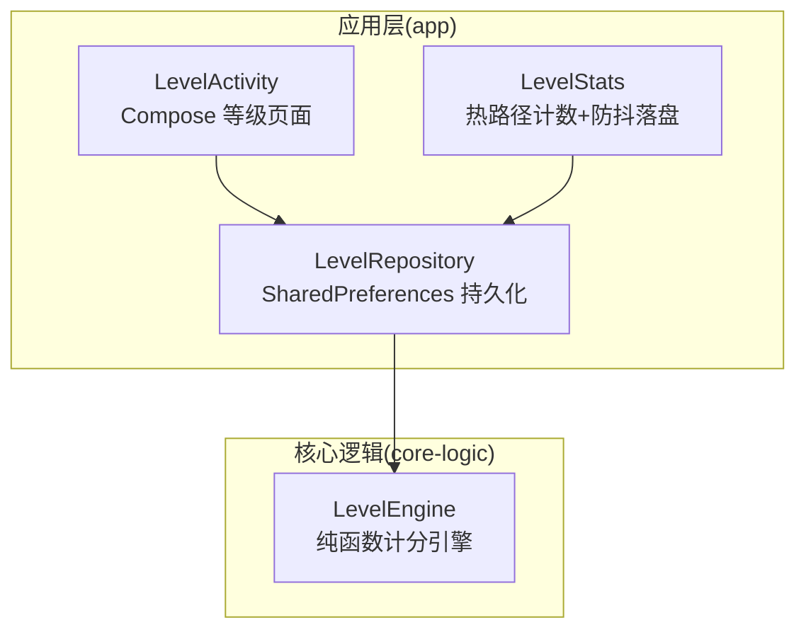
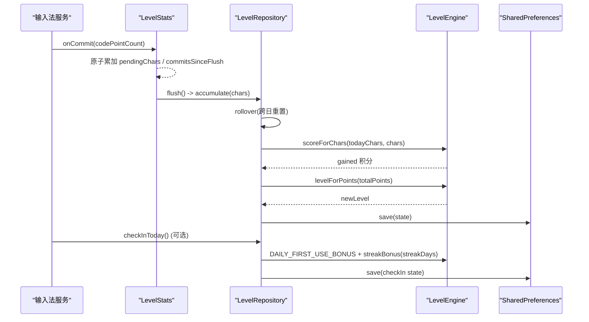
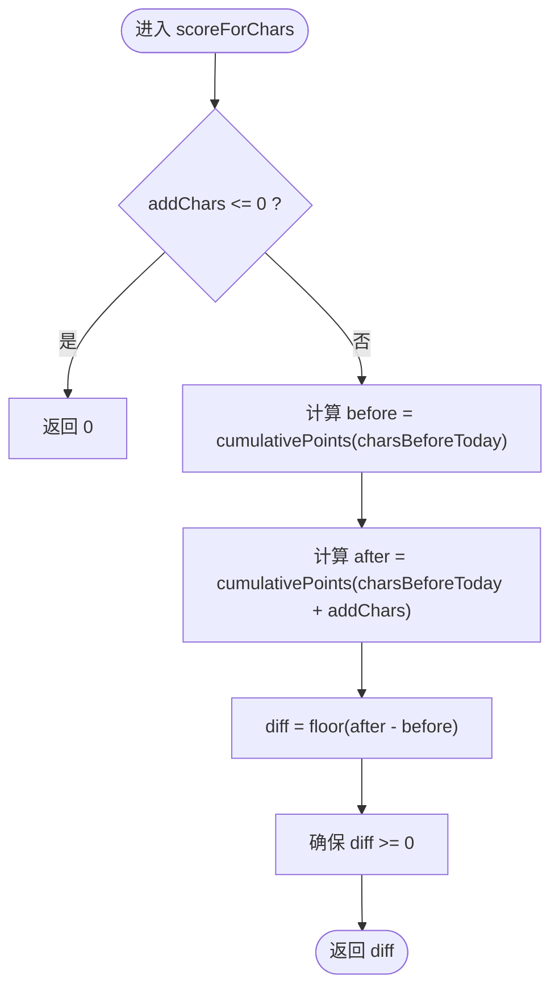
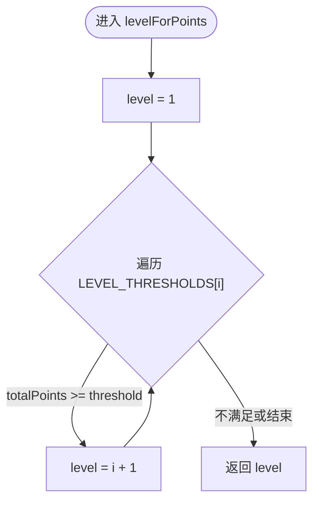
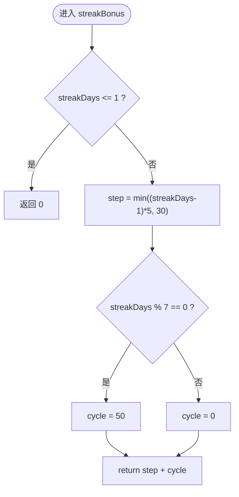
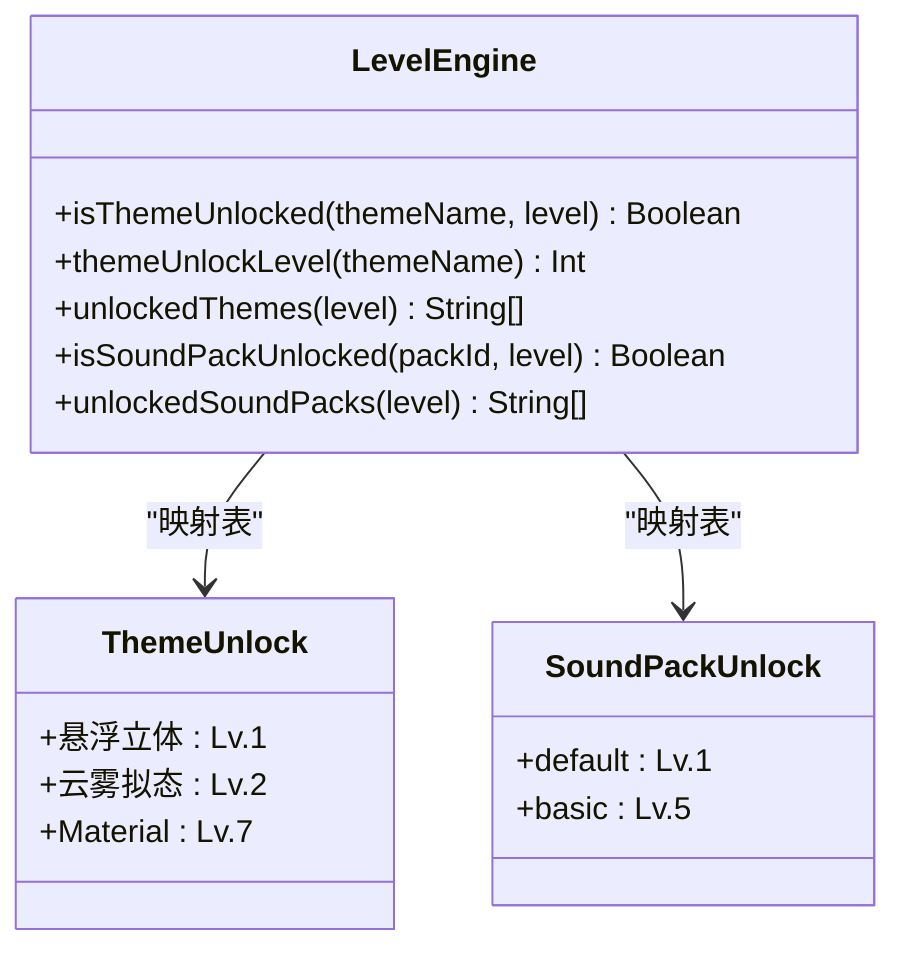
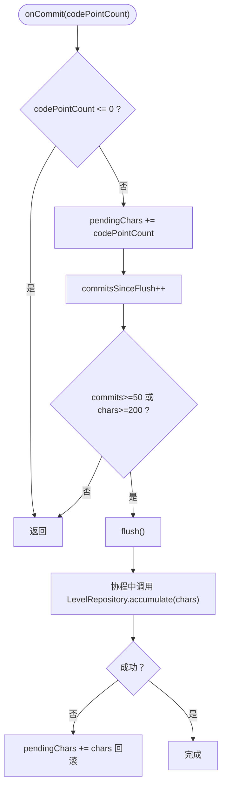
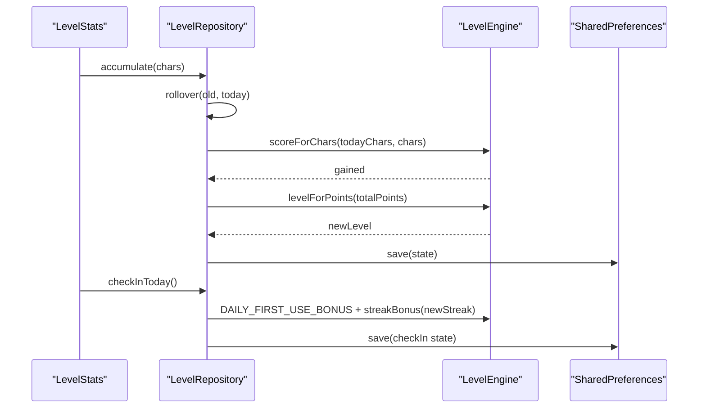
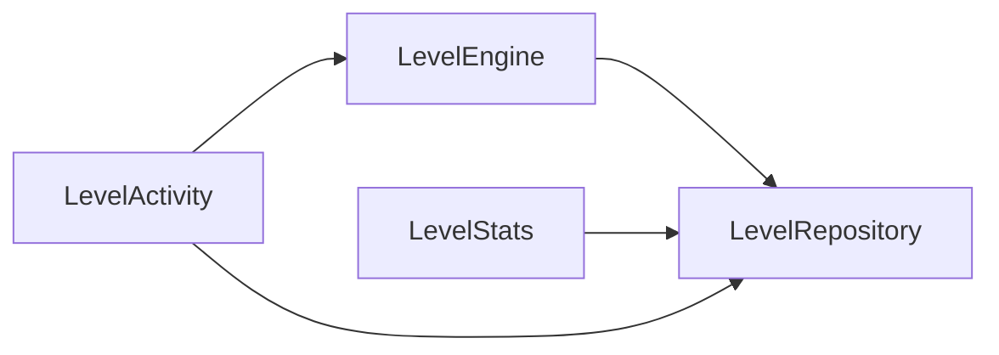

# 计分引擎

<cite>
**本文引用的文件**   
- [LevelEngine.kt](file://core-logic/src/main/java/com/ziyou/ime/core/level/LevelEngine.kt)
- [LevelEngineTest.kt](file://core-logic/src/test/java/com/ziyou/ime/core/level/LevelEngineTest.kt)
- [LevelRepository.kt](file://app/src/main/java/com/ziyou/ime/level/LevelRepository.kt)
- [LevelStats.kt](file://app/src/main/java/com/ziyou/ime/level/LevelStats.kt)
- [LevelActivity.kt](file://app/src/main/java/com/ziyou/ime/ui/LevelActivity.kt)
</cite>

## 目录
1. [简介](#简介)
2. [项目结构](#项目结构)
3. [核心组件](#核心组件)
4. [架构总览](#架构总览)
5. [详细组件分析](#详细组件分析)
6. [依赖关系分析](#依赖关系分析)
7. [性能考量](#性能考量)
8. [故障排查指南](#故障排查指南)
9. [结论](#结论)
10. [附录：使用示例与最佳实践](#附录使用示例与最佳实践)

## 简介
本技术文档聚焦 LevelEngine 纯函数计分引擎，围绕以下目标展开：
- 分段计分算法：前 2000 字每字 1 分、2000–6000 字每字 0.5 分、超过 6000 字不再计分。
- 等级门槛指数递增规则（0/100/300/700/1400/2500/4200/6800/10500/16000）与等级判定算法。
- 连续签到奖励机制：每日首次固定奖励 10 分；连续天数额外奖励第 2 天 +5，逐日 +5，单日封顶 +30；每满 7 天额外 +50。
- 权益解锁系统：主题（云雾拟态 Lv.2、悬浮立体 Lv.1、Material Lv.7）与音效包解锁规则。
- 提供 scoreForChars、streakBonus、levelForPoints 等核心方法的调用方式说明与路径引用。

## 项目结构
LevelEngine 位于 core-logic 模块，作为无状态纯计算引擎；应用层通过 LevelRepository 负责持久化，LevelStats 负责热路径计数与防抖落盘；UI 层 LevelActivity 展示等级进度与路线图。

图表来源
- [LevelEngine.kt:1-187](file://core-logic/src/main/java/com/ziyou/ime/core/level/LevelEngine.kt#L1-L187)
- [LevelRepository.kt:1-181](file://app/src/main/java/com/ziyou/ime/level/LevelRepository.kt#L1-L181)
- [LevelStats.kt:1-82](file://app/src/main/java/com/ziyou/ime/level/LevelStats.kt#L1-L82)
- [LevelActivity.kt:1-333](file://app/src/main/java/com/ziyou/ime/ui/LevelActivity.kt#L1-L333)

章节来源
- [LevelEngine.kt:1-187](file://core-logic/src/main/java/com/ziyou/ime/core/level/LevelEngine.kt#L1-L187)
- [LevelRepository.kt:1-181](file://app/src/main/java/com/ziyou/ime/level/LevelRepository.kt#L1-L181)
- [LevelStats.kt:1-82](file://app/src/main/java/com/ziyou/ime/level/LevelStats.kt#L1-L82)
- [LevelActivity.kt:1-333](file://app/src/main/java/com/ziyou/ime/ui/LevelActivity.kt#L1-L333)

## 核心组件
- LevelEngine：纯函数计分引擎，包含分段计分、等级判定、连续签到奖励、权益解锁等能力。
- LevelRepository：等级状态持久化仓库，封装 SharedPreferences 读写，处理跨日重置、累计积分更新、等级重算。
- LevelStats：输入热路径计数器，原子自增并防抖批量落盘，避免频繁 I/O。
- LevelActivity：等级详情页面，展示当前等级、进度条、统计信息与路线图。

章节来源
- [LevelEngine.kt:1-187](file://core-logic/src/main/java/com/ziyou/ime/core/level/LevelEngine.kt#L1-L187)
- [LevelRepository.kt:1-181](file://app/src/main/java/com/ziyou/ime/level/LevelRepository.kt#L1-L181)
- [LevelStats.kt:1-82](file://app/src/main/java/com/ziyou/ime/level/LevelStats.kt#L1-L82)
- [LevelActivity.kt:1-333](file://app/src/main/java/com/ziyou/ime/ui/LevelActivity.kt#L1-L333)

## 架构总览
整体数据流从输入上屏开始，经 LevelStats 聚合计数，触发 LevelRepository 的 accumulate 方法，内部调用 LevelEngine 的分段计分与等级判定，最终持久化到 SharedPreferences。UI 层读取 LevelState 并通过 LevelEngine 计算进度与名称。

图表来源
- [LevelStats.kt:44-82](file://app/src/main/java/com/ziyou/ime/level/LevelStats.kt#L44-L82)
- [LevelRepository.kt:87-141](file://app/src/main/java/com/ziyou/ime/level/LevelRepository.kt#L87-L141)
- [LevelEngine.kt:69-101](file://core-logic/src/main/java/com/ziyou/ime/core/level/LevelEngine.kt#L69-L101)

## 详细组件分析

### 分段计分算法（scoreForChars）
- 规则：
  - 当日累计字符数 ≤ 2000：每字 1 分。
  - 2000 < 累计字符数 ≤ 6000：超出部分每字 0.5 分。
  - 累计字符数 > 6000：不再计分。
- 实现要点：
  - cumulativePoints 计算累计积分，按区间分段求和。
  - scoreForChars 通过“前后差值”计算本次新增积分，向下取整且保证非负。
- 复杂度：O(1)。

图表来源
- [LevelEngine.kt:57-74](file://core-logic/src/main/java/com/ziyou/ime/core/level/LevelEngine.kt#L57-L74)

章节来源
- [LevelEngine.kt:57-74](file://core-logic/src/main/java/com/ziyou/ime/core/level/LevelEngine.kt#L57-L74)
- [LevelEngineTest.kt:18-42](file://core-logic/src/test/java/com/ziyou/ime/core/level/LevelEngineTest.kt#L18-L42)

### 等级门槛与等级判定（levelForPoints、thresholdForLevel、nextLevelThreshold、progressInLevel）
- 等级门槛数组（索引=等级-1）：0/100/300/700/1400/2500/4200/6800/10500/16000。
- levelForPoints：线性扫描门槛数组，找到最大满足条件的等级。
- thresholdForLevel：根据等级返回对应门槛。
- nextLevelThreshold：返回下一级门槛；已满级时回退为当前级门槛。
- progressInLevel：计算当前等级内进度 [0f, 1f]；满级恒为 1f。
- 复杂度：levelForPoints O(N)，N=10 常数级。

图表来源
- [LevelEngine.kt:29-40](file://core-logic/src/main/java/com/ziyou/ime/core/level/LevelEngine.kt#L29-L40)
- [LevelEngine.kt:95-101](file://core-logic/src/main/java/com/ziyou/ime/core/level/LevelEngine.kt#L95-L101)

章节来源
- [LevelEngine.kt:29-40](file://core-logic/src/main/java/com/ziyou/ime/core/level/LevelEngine.kt#L29-L40)
- [LevelEngine.kt:95-134](file://core-logic/src/main/java/com/ziyou/ime/core/level/LevelEngine.kt#L95-L134)
- [LevelEngineTest.kt:57-88](file://core-logic/src/test/java/com/ziyou/ime/core/level/LevelEngineTest.kt#L57-L88)

### 连续签到奖励（streakBonus）
- 每日首次固定奖励：DAILY_FIRST_USE_BONUS = 10。
- 连续天数额外奖励：
  - 第 2 天 +5，逐日 +5，单日封顶 +30。
  - 每满 7 天额外 +50。
- 公式：step = min((streakDays - 1) * 5, 30)；cycle = (streakDays % 7 == 0) ? 50 : 0；bonus = step + cycle。
- 注意：第 1 天额外奖励为 0。

图表来源
- [LevelEngine.kt:85-90](file://core-logic/src/main/java/com/ziyou/ime/core/level/LevelEngine.kt#L85-L90)

章节来源
- [LevelEngine.kt:78-90](file://core-logic/src/main/java/com/ziyou/ime/core/level/LevelEngine.kt#L78-L90)
- [LevelEngineTest.kt:44-53](file://core-logic/src/test/java/com/ziyou/ime/core/level/LevelEngineTest.kt#L44-L53)

### 权益解锁系统（主题与音效包）
- 主题解锁所需等级：
  - 悬浮立体：Lv.1（默认皮肤）。
  - 云雾拟态：Lv.2。
  - Material：Lv.7。
- 音效包解锁所需等级：
  - default：Lv.1（始终可用）。
  - basic：Lv.5。
- 接口：
  - isThemeUnlocked(themeName, level)：判断是否已解锁。
  - themeUnlockLevel(themeName)：返回解锁所需等级。
  - unlockedThemes(level)：返回当前等级下已解锁的主题集合。
  - isSoundPackUnlocked(packId, level)：判断音效包是否已解锁。
  - unlockedSoundPacks(level)：返回当前等级下已解锁的音效包集合。

图表来源
- [LevelEngine.kt:143-179](file://core-logic/src/main/java/com/ziyou/ime/core/level/LevelEngine.kt#L143-L179)

章节来源
- [LevelEngine.kt:143-179](file://core-logic/src/main/java/com/ziyou/ime/core/level/LevelEngine.kt#L143-L179)
- [LevelEngineTest.kt:92-109](file://core-logic/src/test/java/com/ziyou/ime/core/level/LevelEngineTest.kt#L92-L109)

### 热路径计数与落盘（LevelStats）
- 设计约束：
  - onCommit 仅做 O(1) 原子自增，绝不写磁盘。
  - 达到提交次数阈值（≥50）或字符数阈值（≥200）时触发一次后台异步落盘。
  - 在 onFinishInputView / onDestroy 等生命周期节点主动调用 flush，避免尾部数据丢失。
- 失败保护：落盘异常时将待处理字符数补回，等待下次落盘，避免丢分。

图表来源
- [LevelStats.kt:52-82](file://app/src/main/java/com/ziyou/ime/level/LevelStats.kt#L52-L82)

章节来源
- [LevelStats.kt:1-82](file://app/src/main/java/com/ziyou/ime/level/LevelStats.kt#L1-L82)

### 持久化与结算（LevelRepository）
- 主要职责：
  - 加载/保存 LevelState（累计积分、等级、日期、当日字数/积分、连续天数、上次活跃日期）。
  - accumulate：累计字符数并结算积分，重算等级，保存状态。
  - checkInToday：标记当日活跃，发放首用奖励与连续天数奖励，幂等控制。
  - rollover：跨日重置当日计数（保留累计分与等级）。
- 线程安全：写方法 @Synchronized，保证一致性。

图表来源
- [LevelRepository.kt:87-141](file://app/src/main/java/com/ziyou/ime/level/LevelRepository.kt#L87-L141)
- [LevelEngine.kt:69-101](file://core-logic/src/main/java/com/ziyou/ime/core/level/LevelEngine.kt#L69-L101)

章节来源
- [LevelRepository.kt:1-181](file://app/src/main/java/com/ziyou/ime/level/LevelRepository.kt#L1-L181)

### UI 展示（LevelActivity）
- 展示内容：
  - 当前等级徽章与升级进度条（Lv.X 名称 cur/next）。
  - 今日/累计统计（脱敏聚合计数）。
  - 1–10 级等级路线图与各等级解锁权益。
- 数据来源：LevelRepository.load(this) 获取 LevelState。
- 进度计算：LevelEngine.progressInLevel(totalPoints)、thresholdForLevel、nextLevelThreshold。

章节来源
- [LevelActivity.kt:34-333](file://app/src/main/java/com/ziyou/ime/ui/LevelActivity.kt#L34-L333)

## 依赖关系分析
- LevelEngine 无外部依赖，纯函数，便于单元测试。
- LevelRepository 依赖 LevelEngine 进行计算，依赖 SharedPreferences 进行持久化。
- LevelStats 依赖 LevelRepository 进行落盘，使用协程 IO 线程执行。
- LevelActivity 依赖 LevelRepository 与 LevelEngine 进行展示与计算。

图表来源
- [LevelEngine.kt:1-187](file://core-logic/src/main/java/com/ziyou/ime/core/level/LevelEngine.kt#L1-L187)
- [LevelRepository.kt:1-181](file://app/src/main/java/com/ziyou/ime/level/LevelRepository.kt#L1-L181)
- [LevelStats.kt:1-82](file://app/src/main/java/com/ziyou/ime/level/LevelStats.kt#L1-L82)
- [LevelActivity.kt:1-333](file://app/src/main/java/com/ziyou/ime/ui/LevelActivity.kt#L1-L333)

章节来源
- [LevelEngine.kt:1-187](file://core-logic/src/main/java/com/ziyou/ime/core/level/LevelEngine.kt#L1-L187)
- [LevelRepository.kt:1-181](file://app/src/main/java/com/ziyou/ime/level/LevelRepository.kt#L1-L181)
- [LevelStats.kt:1-82](file://app/src/main/java/com/ziyou/ime/level/LevelStats.kt#L1-L82)
- [LevelActivity.kt:1-333](file://app/src/main/java/com/ziyou/ime/ui/LevelActivity.kt#L1-L333)

## 性能考量
- 热路径优化：LevelStats.onCommit 仅做原子自增，避免 I/O；达到阈值才批量落盘。
- 防抖策略：提交次数阈值 50 与字符数阈值 200 双重触发，兼顾短文本高频与长文本快速落盘。
- 失败保护：落盘异常时回滚待处理字符数，避免丢分。
- 等级判定复杂度：N=10 常数级，对 UI 渲染影响可忽略。

[本节为通用指导，无需特定文件来源]

## 故障排查指南
- 积分未增加：
  - 检查 onCommit 是否被调用，pendingChars 与 commitsSinceFlush 是否正确累加。
  - 检查阈值是否达到，必要时手动调用 flush。
  - 查看日志中的落盘失败回滚信息。
- 连续签到奖励异常：
  - 确认 lastActiveDate 与 today 比较逻辑，避免重复发放。
  - 检查 streakDays 跨日重置逻辑是否正确。
- 等级显示不正确：
  - 检查 totalPoints 是否更新，levelForPoints 是否重新计算。
  - 确认 thresholdForLevel 与 nextLevelThreshold 返回值是否符合预期。

章节来源
- [LevelStats.kt:65-82](file://app/src/main/java/com/ziyou/ime/level/LevelStats.kt#L65-L82)
- [LevelRepository.kt:108-141](file://app/src/main/java/com/ziyou/ime/level/LevelRepository.kt#L108-L141)

## 结论
LevelEngine 以纯函数形式实现了稳定可靠的计分与等级体系，结合 LevelRepository 与 LevelStats 形成高性能、易测试、可扩展的架构。分段计分、等级门槛、连续签到奖励与权益解锁规则清晰明确，便于维护与扩展。

[本节为总结性内容，无需特定文件来源]

## 附录：使用示例与最佳实践
- 分段计分示例：
  - 调用 scoreForChars(charsBeforeToday, addChars) 计算本次新增积分。
  - 参考测试用例验证边界条件与封顶逻辑。
- 连续签到奖励示例：
  - 调用 streakBonus(streakDays) 计算连续天数额外奖励。
  - 结合 DAILY_FIRST_USE_BONUS 发放每日首用奖励。
- 等级判定示例：
  - 调用 levelForPoints(totalPoints) 获取当前等级。
  - 使用 progressInLevel(totalPoints) 计算等级内进度。
- 权益解锁示例：
  - 调用 isThemeUnlocked(themeName, level) 判断主题是否解锁。
  - 调用 isSoundPackUnlocked(packId, level) 判断音效包是否解锁。

章节来源
- [LevelEngineTest.kt:18-109](file://core-logic/src/test/java/com/ziyou/ime/core/level/LevelEngineTest.kt#L18-L109)
- [LevelEngine.kt:69-179](file://core-logic/src/main/java/com/ziyou/ime/core/level/LevelEngine.kt#L69-L179)