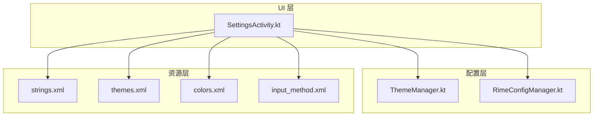
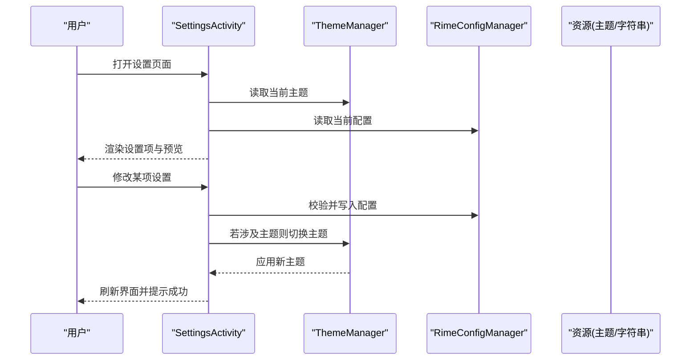
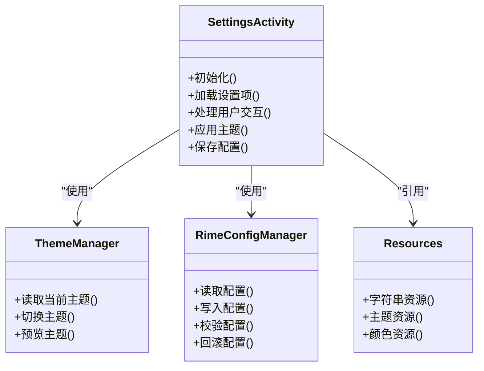

# 设置界面

<cite>
**本文引用的文件**   
- [SettingsActivity.kt](file://app/src/main/java/com/ziyou/ime/ui/SettingsActivity.kt)
- [ThemeManager.kt](file://app/src/main/java/com/ziyou/ime/config/ThemeManager.kt)
- [RimeConfigManager.kt](file://app/src/main/java/com/ziyou/ime/config/RimeConfigManager.kt)
- [strings.xml](file://app/src/main/res/values/strings.xml)
- [themes.xml](file://app/src/main/res/values/themes.xml)
- [colors.xml](file://app/src/main/res/values/colors.xml)
- [input_method.xml](file://app/src/main/res/xml/input_method.xml)
</cite>

## 目录
1. [简介](#简介)
2. [项目结构](#项目结构)
3. [核心组件](#核心组件)
4. [架构总览](#架构总览)
5. [详细组件分析](#详细组件分析)
6. [依赖关系分析](#依赖关系分析)
7. [性能考虑](#性能考虑)
8. [故障排查指南](#故障排查指南)
9. [结论](#结论)
10. [附录](#附录)

## 简介
本文件面向输入法应用的“设置界面”模块，围绕 SettingsActivity 的界面布局、交互逻辑、设置项分类与数据绑定、用户偏好保存与加载、主题选择与预览、多语言支持与本地化资源管理、设置项验证与错误提示、响应式设计与屏幕适配，以及自定义设置页面的开发指南与最佳实践进行系统化说明。目标是帮助开发者快速理解并扩展设置能力，保证一致的用户体验与可维护性。

## 项目结构
设置界面位于应用主模块的 UI 层，相关配置与主题管理位于配置层，资源文件（字符串、主题、颜色）位于资源目录，输入法清单定义在 XML 中。整体采用分层组织：UI 层负责展示与交互，配置层负责持久化与运行时切换，资源层提供多语言与主题支持。

图表来源
- [SettingsActivity.kt](file://app/src/main/java/com/ziyou/ime/ui/SettingsActivity.kt)
- [ThemeManager.kt](file://app/src/main/java/com/ziyou/ime/config/ThemeManager.kt)
- [RimeConfigManager.kt](file://app/src/main/java/com/ziyou/ime/config/RimeConfigManager.kt)
- [strings.xml](file://app/src/main/res/values/strings.xml)
- [themes.xml](file://app/src/main/res/values/themes.xml)
- [colors.xml](file://app/src/main/res/values/colors.xml)
- [input_method.xml](file://app/src/main/res/xml/input_method.xml)

章节来源
- [SettingsActivity.kt](file://app/src/main/java/com/ziyou/ime/ui/SettingsActivity.kt)
- [ThemeManager.kt](file://app/src/main/java/com/ziyou/ime/config/ThemeManager.kt)
- [RimeConfigManager.kt](file://app/src/main/java/com/ziyou/ime/config/RimeConfigManager.kt)
- [strings.xml](file://app/src/main/res/values/strings.xml)
- [themes.xml](file://app/src/main/res/values/themes.xml)
- [colors.xml](file://app/src/main/res/values/colors.xml)
- [input_method.xml](file://app/src/main/res/xml/input_method.xml)

## 核心组件
- SettingsActivity：设置界面的入口与控制器，负责加载布局、初始化设置项、处理用户交互、触发主题切换与配置更新。
- ThemeManager：主题管理器，负责主题的读取、切换与预览，以及与系统主题或应用主题资源的联动。
- RimeConfigManager：Rime 配置管理器，负责读写 Rime 配置文件、同步设置项到引擎配置、处理配置校验与回滚。
- 资源文件：strings.xml 提供多语言文本；themes.xml 与 colors.xml 提供主题与配色；input_method.xml 声明输入法服务与基本属性。

章节来源
- [SettingsActivity.kt](file://app/src/main/java/com/ziyou/ime/ui/SettingsActivity.kt)
- [ThemeManager.kt](file://app/src/main/java/com/ziyou/ime/config/ThemeManager.kt)
- [RimeConfigManager.kt](file://app/src/main/java/com/ziyou/ime/config/RimeConfigManager.kt)
- [strings.xml](file://app/src/main/res/values/strings.xml)
- [themes.xml](file://app/src/main/res/values/themes.xml)
- [colors.xml](file://app/src/main/res/values/colors.xml)
- [input_method.xml](file://app/src/main/res/xml/input_method.xml)

## 架构总览
设置界面采用“视图-控制器-配置”的分层模式：
- 视图层：由 Activity 承载布局，使用列表或分组展示设置项。
- 控制层：Activity 监听用户操作，调用配置管理器执行读写与校验。
- 配置层：ThemeManager 与 RimeConfigManager 分别管理主题与 Rime 配置，确保一致性。

图表来源
- [SettingsActivity.kt](file://app/src/main/java/com/ziyou/ime/ui/SettingsActivity.kt)
- [ThemeManager.kt](file://app/src/main/java/com/ziyou/ime/config/ThemeManager.kt)
- [RimeConfigManager.kt](file://app/src/main/java/com/ziyou/ime/config/RimeConfigManager.kt)
- [strings.xml](file://app/src/main/res/values/strings.xml)
- [themes.xml](file://app/src/main/res/values/themes.xml)
- [colors.xml](file://app/src/main/res/values/colors.xml)

## 详细组件分析

### SettingsActivity：界面布局与交互逻辑
- 界面布局
  - 采用分组方式组织设置项，如“外观与主题”、“输入行为”、“高级选项”等。
  - 每个设置项包含标题、描述、开关或选择器控件，便于用户直观操作。
- 交互逻辑
  - 进入页面时加载当前主题与配置，动态生成或绑定设置项。
  - 用户修改设置后，先进行本地校验，再调用配置管理器持久化。
  - 主题变更即时预览，必要时提示重启生效。
- 数据绑定机制
  - 通过 ViewModel 或本地状态对象将设置项与 UI 控件双向绑定。
  - 对复杂设置项（如字体大小、候选词数量）提供范围限制与默认值回退。
- 错误提示机制
  - 校验失败时显示 Toast 或行内提示，阻止无效配置写入。
  - 对不可恢复的错误（如权限不足）给出明确指引。

章节来源
- [SettingsActivity.kt](file://app/src/main/java/com/ziyou/ime/ui/SettingsActivity.kt)

### ThemeManager：主题选择与预览
- 功能职责
  - 读取与切换应用主题，支持浅色/深色主题与自定义主题。
  - 提供主题预览接口，允许用户在设置页实时查看效果。
- 实现要点
  - 主题标识与资源映射集中管理，避免硬编码。
  - 切换主题时统一刷新 UI，必要时重建 Activity 以应用完整样式。
- 与资源联动
  - 通过 themes.xml 与 colors.xml 定义主题与配色。
  - 结合 strings.xml 的多语言文案，确保主题切换不影响文本可读性。

章节来源
- [ThemeManager.kt](file://app/src/main/java/com/ziyou/ime/config/ThemeManager.kt)
- [themes.xml](file://app/src/main/res/values/themes.xml)
- [colors.xml](file://app/src/main/res/values/colors.xml)
- [strings.xml](file://app/src/main/res/values/strings.xml)

### RimeConfigManager：设置项持久化与校验
- 功能职责
  - 读写 Rime 配置文件，将设置项映射为配置键值。
  - 提供配置校验、回滚与增量更新能力。
- 实现要点
  - 配置项按类别分组，便于管理与迁移。
  - 写入前进行格式与范围校验，失败时返回错误信息供 UI 提示。
  - 支持热更新与冷启动两种策略，关键配置建议重启生效。
- 与 UI 协作
  - 暴露统一的读写接口，屏蔽底层存储细节。
  - 提供事件回调，通知 UI 配置变更结果。

章节来源
- [RimeConfigManager.kt](file://app/src/main/java/com/ziyou/ime/config/RimeConfigManager.kt)

### 多语言支持与本地化资源管理
- 资源组织
  - 所有用户可见文案集中在 strings.xml，按语言目录拆分（如 values-zh、values-en）。
  - 主题与颜色资源独立管理，避免与文案耦合。
- 运行时切换
  - 根据系统语言或用户选择动态加载对应资源。
  - 切换语言后刷新设置页，确保文案与单位显示正确。
- 最佳实践
  - 避免在代码中拼接文案，全部走资源引用。
  - 对复数、日期、数字格式化使用资源占位符。

章节来源
- [strings.xml](file://app/src/main/res/values/strings.xml)

### 输入法配置与入口声明
- input_method.xml 用于声明输入法服务的元数据与基本属性，设置页可通过该配置获取输入法能力边界。
- 设置项应与输入法能力对齐，避免暴露不可用选项。

章节来源
- [input_method.xml](file://app/src/main/res/xml/input_method.xml)

## 依赖关系分析
- SettingsActivity 依赖 ThemeManager 与 RimeConfigManager 完成主题与配置的读写。
- ThemeManager 依赖主题与颜色资源，可能依赖系统 API 进行主题切换。
- RimeConfigManager 依赖文件系统或配置库进行持久化，并提供校验与回滚。
- 资源文件被 UI 层直接引用，确保多语言与主题的一致性。

图表来源
- [SettingsActivity.kt](file://app/src/main/java/com/ziyou/ime/ui/SettingsActivity.kt)
- [ThemeManager.kt](file://app/src/main/java/com/ziyou/ime/config/ThemeManager.kt)
- [RimeConfigManager.kt](file://app/src/main/java/com/ziyou/ime/config/RimeConfigManager.kt)
- [strings.xml](file://app/src/main/res/values/strings.xml)
- [themes.xml](file://app/src/main/res/values/themes.xml)
- [colors.xml](file://app/src/main/res/values/colors.xml)

章节来源
- [SettingsActivity.kt](file://app/src/main/java/com/ziyou/ime/ui/SettingsActivity.kt)
- [ThemeManager.kt](file://app/src/main/java/com/ziyou/ime/config/ThemeManager.kt)
- [RimeConfigManager.kt](file://app/src/main/java/com/ziyou/ime/config/RimeConfigManager.kt)
- [strings.xml](file://app/src/main/res/values/strings.xml)
- [themes.xml](file://app/src/main/res/values/themes.xml)
- [colors.xml](file://app/src/main/res/values/colors.xml)

## 性能考虑
- 延迟加载：仅在需要时加载大型配置或主题资源，减少首屏时间。
- 批量写入：对多项设置合并写入，降低 I/O 次数。
- 预览优化：主题预览使用轻量级快照，避免频繁重建视图。
- 缓存策略：对常用配置项进行内存缓存，提高读取效率。

[本节为通用指导，不直接分析具体文件]

## 故障排查指南
- 主题切换无效
  - 检查主题资源是否完整，确认切换流程是否触发 UI 刷新。
  - 查看 ThemeManager 日志，确认资源映射是否正确。
- 配置写入失败
  - 检查权限与路径，确认 RimeConfigManager 的写入逻辑。
  - 校验配置格式，定位非法字段或越界值。
- 多语言文案缺失
  - 确认 strings.xml 的语言目录是否存在对应文案。
  - 检查运行时语言切换是否生效。

章节来源
- [ThemeManager.kt](file://app/src/main/java/com/ziyou/ime/config/ThemeManager.kt)
- [RimeConfigManager.kt](file://app/src/main/java/com/ziyou/ime/config/RimeConfigManager.kt)
- [strings.xml](file://app/src/main/res/values/strings.xml)

## 结论
设置界面通过清晰的层次结构与模块化设计，实现了主题与配置的统一管理、多语言支持与良好的用户体验。遵循本文档的最佳实践，可高效扩展新的设置项与页面，同时保持稳定性与可维护性。

[本节为总结，不直接分析具体文件]

## 附录

### 设置项分类与数据绑定建议
- 分类建议
  - 外观与主题：主题、配色、字体大小、候选词数量。
  - 输入行为：自动纠错、联想开关、快捷键映射。
  - 高级选项：引擎参数、调试开关、备份与恢复。
- 数据绑定
  - 使用统一的数据模型封装设置项，提供默认值与校验规则。
  - UI 控件与数据模型双向绑定，变更即触发校验与持久化。

[本节为概念性内容，不直接分析具体文件]

### 响应式设计与屏幕适配方案
- 布局适配
  - 使用 ConstraintLayout 与百分比布局，适配不同屏幕尺寸。
  - 针对平板与大屏提供分栏布局，提升信息密度。
- 交互优化
  - 在大屏上提供侧边导航与主内容区分离。
  - 在小屏上简化设置项，优先展示高频选项。

[本节为概念性内容，不直接分析具体文件]

### 自定义设置页面的开发指南与最佳实践
- 步骤
  - 新增设置项数据模型与校验规则。
  - 在 SettingsActivity 中注册新设置项与交互逻辑。
  - 在 RimeConfigManager 中实现读写与校验。
  - 在资源文件中添加多语言文案与主题资源。
- 最佳实践
  - 保持设置项命名与分类一致，避免重复与冲突。
  - 对破坏性变更提供回滚与提示，保障用户数据安全。
  - 单元测试覆盖校验与持久化逻辑，确保稳定性。

[本节为概念性内容，不直接分析具体文件]