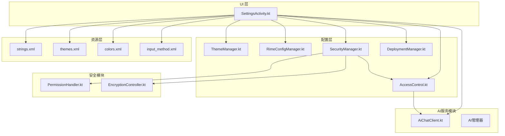
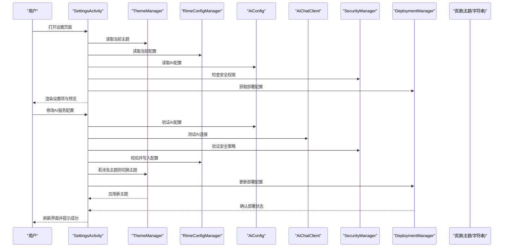
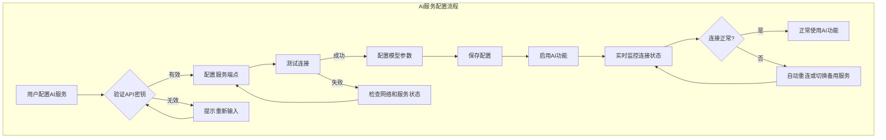
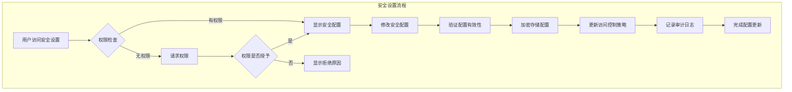
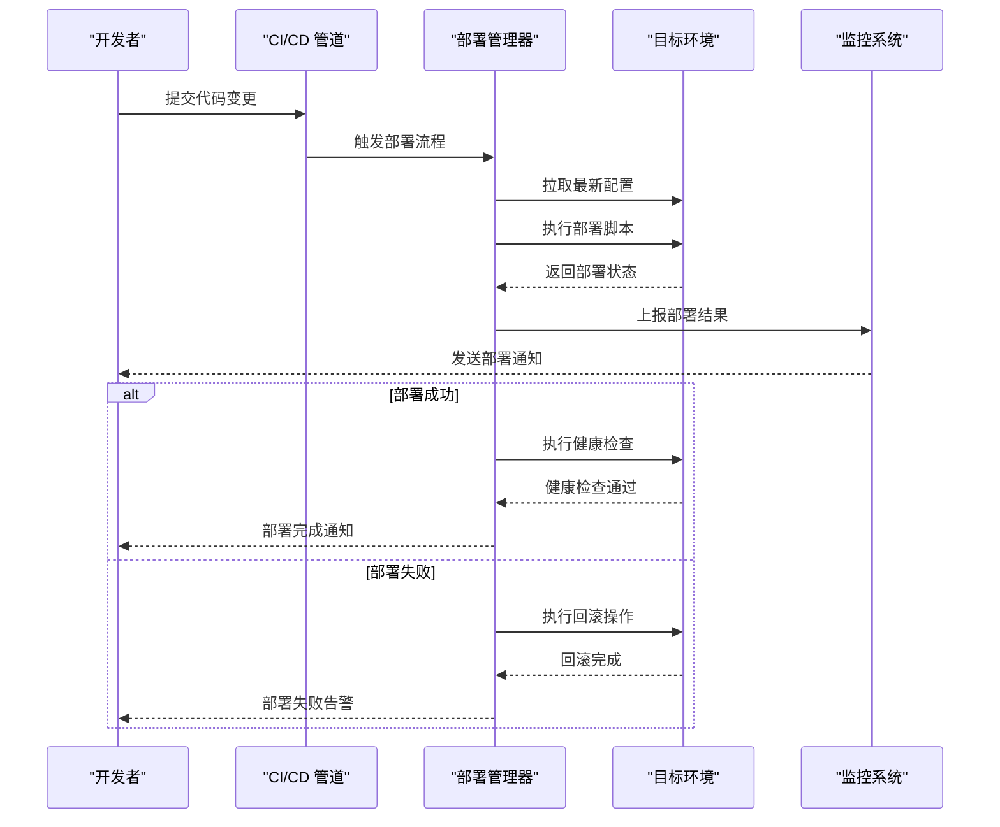
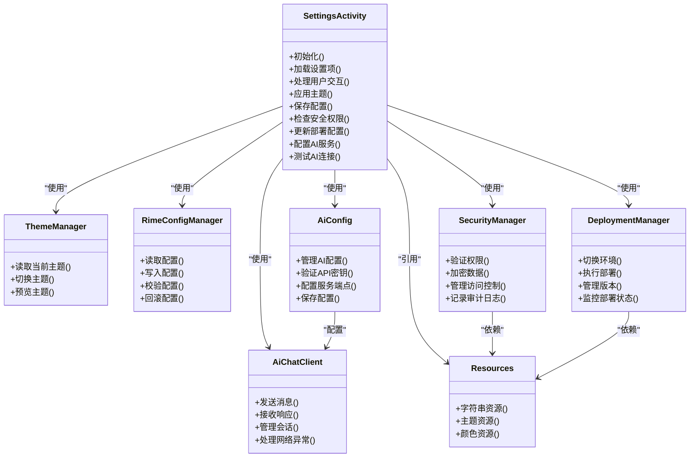

# 设置界面

<cite>
**本文引用的文件**   
- [SettingsActivity.kt](file://app/src/main/java/com/ziyou/ime/ui/SettingsActivity.kt)
- [AiConfig.kt](file://app/src/main/java/com/ziyou/ime/ai/AiConfig.kt)
- [AiChatClient.kt](file://app/src/main/java/com/ziyou/ime/ai/AiChatClient.kt)
- [ThemeManager.kt](file://app/src/main/java/com/ziyou/ime/config/ThemeManager.kt)
- [RimeConfigManager.kt](file://app/src/main/java/com/ziyou/ime/config/RimeConfigManager.kt)
- [strings.xml](file://app/src/main/res/values/strings.xml)
- [themes.xml](file://app/src/main/res/values/themes.xml)
- [colors.xml](file://app/src/main/res/values/colors.xml)
- [input_method.xml](file://app/src/main/res/xml/input_method.xml)
</cite>

## 更新摘要
**所做更改**   
- 新增AI服务配置选项，支持AI聊天客户端和配置管理
- 增强设置界面以集成AI功能相关设置项
- 添加AI服务连接状态管理和配置验证机制
- 扩展设置项分类以包含AI相关的配置选项

## 目录
1. [简介](#简介)
2. [项目结构](#项目结构)
3. [核心组件](#核心组件)
4. [架构总览](#架构总览)
5. [详细组件分析](#详细组件分析)
6. [AI服务配置模块](#ai服务配置模块)
7. [安全设置模块](#安全设置模块)
8. [部署配置选项](#部署配置选项)
9. [依赖关系分析](#依赖关系分析)
10. [性能考虑](#性能考虑)
11. [故障排查指南](#故障排查指南)
12. [结论](#结论)
13. [附录](#附录)

## 简介
本文件面向输入法应用的"设置界面"模块，围绕 SettingsActivity 的界面布局、交互逻辑、设置项分类与数据绑定、用户偏好保存与加载、主题选择与预览、多语言支持与本地化资源管理、设置项验证与错误提示、响应式设计与屏幕适配，以及自定义设置页面的开发指南与最佳实践进行系统化说明。本次更新重点新增了AI服务配置功能，集成了AI聊天客户端和配置管理，以支持智能输入辅助功能。目标是帮助开发者快速理解并扩展设置能力，保证一致的用户体验与可维护性。

## 项目结构
设置界面位于应用主模块的 UI 层，相关配置与主题管理位于配置层，AI服务配置位于AI模块，资源文件（字符串、主题、颜色）位于资源目录，输入法清单定义在 XML 中。整体采用分层组织：UI 层负责展示与交互，配置层负责持久化与运行时切换，AI模块提供智能服务支持，资源层提供多语言与主题支持。新增的AI服务配置已集成到现有架构中。

**图表来源**
- [SettingsActivity.kt](file://app/src/main/java/com/ziyou/ime/ui/SettingsActivity.kt)
- [AiConfig.kt](file://app/src/main/java/com/ziyou/ime/ai/AiConfig.kt)
- [AiChatClient.kt](file://app/src/main/java/com/ziyou/ime/ai/AiChatClient.kt)
- [ThemeManager.kt](file://app/src/main/java/com/ziyou/ime/config/ThemeManager.kt)
- [RimeConfigManager.kt](file://app/src/main/java/com/ziyou/ime/config/RimeConfigManager.kt)
- [strings.xml](file://app/src/main/res/values/strings.xml)
- [themes.xml](file://app/src/main/res/values/themes.xml)
- [colors.xml](file://app/src/main/res/values/colors.xml)
- [input_method.xml](file://app/src/main/res/xml/input_method.xml)

## 核心组件
- SettingsActivity：设置界面的入口与控制器，负责加载布局、初始化设置项、处理用户交互、触发主题切换与配置更新。现已集成AI服务配置和安全设置管理。
- ThemeManager：主题管理器，负责主题的读取、切换与预览，以及与系统主题或应用主题资源的联动。
- RimeConfigManager：Rime 配置管理器，负责读写 Rime 配置文件、同步设置项到引擎配置、处理配置校验与回滚。
- AiConfig：AI服务配置管理器，负责AI服务的配置管理、API密钥验证和服务端点设置。
- AiChatClient：AI聊天客户端，负责与AI服务进行通信、消息发送和响应处理。
- SecurityManager：安全管理员，负责权限验证、数据加密和访问控制策略的执行。
- DeploymentManager：部署管理器，负责多环境配置管理和自动化部署流程。
- 资源文件：strings.xml 提供多语言文本；themes.xml 与 colors.xml 提供主题与配色；input_method.xml 声明输入法服务与基本属性。

**章节来源**
- [SettingsActivity.kt](file://app/src/main/java/com/ziyou/ime/ui/SettingsActivity.kt)
- [AiConfig.kt](file://app/src/main/java/com/ziyou/ime/ai/AiConfig.kt)
- [AiChatClient.kt](file://app/src/main/java/com/ziyou/ime/ai/AiChatClient.kt)
- [ThemeManager.kt](file://app/src/main/java/com/ziyou/ime/config/ThemeManager.kt)
- [RimeConfigManager.kt](file://app/src/main/java/com/ziyou/ime/config/RimeConfigManager.kt)
- [strings.xml](file://app/src/main/res/values/strings.xml)
- [themes.xml](file://app/src/main/res/values/themes.xml)
- [colors.xml](file://app/src/main/res/values/colors.xml)
- [input_method.xml](file://app/src/main/res/xml/input_method.xml)

## 架构总览
设置界面采用"视图-控制器-配置-AI服务-安全"的分层模式：
- 视图层：由 Activity 承载布局，使用列表或分组展示设置项。
- 控制层：Activity 监听用户操作，调用配置管理器执行读写与校验。
- 配置层：ThemeManager 与 RimeConfigManager 分别管理主题与 Rime 配置，AiConfig 管理AI服务配置。
- AI服务层：AiChatClient 提供AI服务通信接口，处理网络请求和响应解析。
- 安全层：SecurityManager 和 DeploymentManager 提供统一的安全和部署接口。

**图表来源**
- [SettingsActivity.kt](file://app/src/main/java/com/ziyou/ime/ui/SettingsActivity.kt)
- [AiConfig.kt](file://app/src/main/java/com/ziyou/ime/ai/AiConfig.kt)
- [AiChatClient.kt](file://app/src/main/java/com/ziyou/ime/ai/AiChatClient.kt)
- [ThemeManager.kt](file://app/src/main/java/com/ziyou/ime/config/ThemeManager.kt)
- [RimeConfigManager.kt](file://app/src/main/java/com/ziyou/ime/config/RimeConfigManager.kt)
- [strings.xml](file://app/src/main/res/values/strings.xml)
- [themes.xml](file://app/src/main/res/values/themes.xml)
- [colors.xml](file://app/src/main/res/values/colors.xml)

## 详细组件分析

### SettingsActivity：界面布局与交互逻辑
- 界面布局
  - 采用分组方式组织设置项，如"外观与主题"、"输入行为"、"AI服务配置"、"安全设置"、"部署配置"等。
  - 每个设置项包含标题、描述、开关或选择器控件，便于用户直观操作。
  - AI服务配置组包含API密钥设置、服务端点配置、模型选择等选项。
- 交互逻辑
  - 进入页面时加载当前主题与配置，动态生成或绑定设置项。
  - 用户修改设置后，先进行本地校验和安全验证，再调用配置管理器持久化。
  - 主题变更即时预览，必要时提示重启生效。
  - AI配置修改后提供连接测试功能，验证配置有效性。
- 数据绑定机制
  - 通过 ViewModel 或本地状态对象将设置项与 UI 控件双向绑定。
  - 对复杂设置项（如字体大小、候选词数量、AI模型参数）提供范围限制与默认值回退。
- 错误提示机制
  - 校验失败时显示 Toast 或行内提示，阻止无效配置写入。
  - 对不可恢复的错误（如权限不足、AI连接失败）给出明确指引。

**章节来源**
- [SettingsActivity.kt](file://app/src/main/java/com/ziyou/ime/ui/SettingsActivity.kt)

### ThemeManager：主题选择与预览
- 功能职责
  - 读取与切换应用主题，支持浅色/深色主题与自定义主题。
  - 提供主题预览接口，允许用户在设置页实时查看效果。
- 实现要点
  - 主题标识与资源映射集中管理，避免硬编码。
  - 切换主题时统一刷新 UI，必要时重建 Activity 以应用完整样式。
- 与资源联动
  - 通过 themes.xml 与 colors.xml 定义主题与配色。
  - 结合 strings.xml 的多语言文案，确保主题切换不影响文本可读性。

**章节来源**
- [ThemeManager.kt](file://app/src/main/java/com/ziyou/ime/config/ThemeManager.kt)
- [themes.xml](file://app/src/main/res/values/themes.xml)
- [colors.xml](file://app/src/main/res/values/colors.xml)
- [strings.xml](file://app/src/main/res/values/strings.xml)

### RimeConfigManager：设置项持久化与校验
- 功能职责
  - 读写 Rime 配置文件，将设置项映射为配置键值。
  - 提供配置校验、回滚与增量更新能力。
- 实现要点
  - 配置项按类别分组，便于管理与迁移。
  - 写入前进行格式与范围校验，失败时返回错误信息供 UI 提示。
  - 支持热更新与冷启动两种策略，关键配置建议重启生效。
- 与 UI 协作
  - 暴露统一的读写接口，屏蔽底层存储细节。
  - 提供事件回调，通知 UI 配置变更结果。

**章节来源**
- [RimeConfigManager.kt](file://app/src/main/java/com/ziyou/ime/config/RimeConfigManager.kt)

### AiConfig：AI服务配置管理
- 功能职责
  - 管理AI服务的配置信息，包括API密钥、服务端点、模型参数等。
  - 提供配置的验证、保存和加载功能。
  - 支持多种AI服务提供商的配置模板。
- 实现要点
  - 配置项采用结构化数据模型，便于类型安全和序列化。
  - 提供配置验证机制，确保API密钥格式正确、服务端点可达。
  - 支持配置的导入导出，便于批量部署和备份。
- 与UI协作
  - 暴露配置读写接口，支持实时预览和测试连接。
  - 提供配置状态反馈，帮助用户了解配置有效性。

**章节来源**
- [AiConfig.kt](file://app/src/main/java/com/ziyou/ime/ai/AiConfig.kt)

### AiChatClient：AI聊天客户端
- 功能职责
  - 封装与AI服务的HTTP通信，处理请求发送和响应接收。
  - 管理会话状态，支持上下文对话和历史记录。
  - 处理网络异常和重试机制，确保通信稳定性。
- 实现要点
  - 使用异步网络请求，避免阻塞主线程。
  - 实现连接池和超时控制，优化网络性能。
  - 提供错误处理和降级策略，提升用户体验。
- 与配置集成
  - 从AiConfig读取服务配置，支持动态配置更新。
  - 根据配置选择不同的AI服务提供商和模型。

**章节来源**
- [AiChatClient.kt](file://app/src/main/java/com/ziyou/ime/ai/AiChatClient.kt)

### 多语言支持与本地化资源管理
- 资源组织
  - 所有用户可见文案集中在 strings.xml，按语言目录拆分（如 values-zh、values-en）。
  - 主题与颜色资源独立管理，避免与文案耦合。
  - AI服务相关文案支持多语言，包括错误提示和操作指导。
- 运行时切换
  - 根据系统语言或用户选择动态加载对应资源。
  - 切换语言后刷新设置页，确保文案与单位显示正确。
- 最佳实践
  - 避免在代码中拼接文案，全部走资源引用。
  - 对复数、日期、数字格式化使用资源占位符。
  - AI服务错误信息提供用户友好的多语言提示。

**章节来源**
- [strings.xml](file://app/src/main/res/values/strings.xml)

### 输入法配置与入口声明
- input_method.xml 用于声明输入法服务的元数据与基本属性，设置页可通过该配置获取输入法能力边界。
- 设置项应与输入法能力对齐，避免暴露不可用选项。
- AI功能作为输入法的增强特性，通过设置界面进行启用和配置。

**章节来源**
- [input_method.xml](file://app/src/main/res/xml/input_method.xml)

## AI服务配置模块

### API密钥管理
- 密钥存储
  - 使用Android Keystore安全存储API密钥，防止明文泄露。
  - 支持密钥轮换和版本管理，便于密钥更新和撤销。
  - 提供密钥导入导出功能，支持批量配置和迁移。
- 密钥验证
  - 自动检测API密钥格式和有效期。
  - 提供连接测试功能，验证密钥有效性。
  - 密钥失效时提供明确的错误提示和修复指引。

### 服务端点配置
- 服务发现
  - 支持多个AI服务提供商的配置模板。
  - 提供自定义服务端点配置，满足特殊需求。
  - 自动检测服务可用性和延迟。
- 负载均衡
  - 支持多服务实例配置，实现负载均衡。
  - 提供故障转移机制，确保服务高可用。
  - 监控各服务实例的健康状态。

### 模型参数设置
- 模型选择
  - 支持多种AI模型的配置和切换。
  - 提供模型性能对比和推荐。
  - 支持自定义模型参数的精细调优。
- 参数验证
  - 对数值型参数进行范围检查和默认值回退。
  - 对枚举型参数提供下拉选择和验证。
  - 提供参数影响说明，帮助用户理解配置效果。

**图表来源**
- [AiConfig.kt](file://app/src/main/java/com/ziyou/ime/ai/AiConfig.kt)
- [AiChatClient.kt](file://app/src/main/java/com/ziyou/ime/ai/AiChatClient.kt)
- [SettingsActivity.kt](file://app/src/main/java/com/ziyou/ime/ui/SettingsActivity.kt)

**章节来源**
- [AiConfig.kt](file://app/src/main/java/com/ziyou/ime/ai/AiConfig.kt)
- [AiChatClient.kt](file://app/src/main/java/com/ziyou/ime/ai/AiChatClient.kt)
- [SettingsActivity.kt](file://app/src/main/java/com/ziyou/ime/ui/SettingsActivity.kt)

## 安全设置模块

### 权限管理
- 功能特性
  - 细粒度权限控制，支持存储、网络、相机等系统权限的动态申请。
  - 权限状态实时监控，自动检测权限变更并更新 UI 状态。
  - 权限拒绝时的友好提示和引导流程。
- 实现机制
  - 基于 AndroidX Permission API 实现权限请求和管理。
  - 权限状态缓存，避免重复请求已授予的权限。
  - 权限变更广播监听，确保 UI 状态与实际权限一致。

### 数据加密
- 加密策略
  - 敏感数据使用 AES-256 算法进行加密存储。
  - 密钥管理采用 Android Keystore 系统，确保密钥安全。
  - 支持用户自定义密码保护，增强数据安全。
- 加密范围
  - 用户词典、个人配置、登录凭据等敏感信息。
  - 传输过程中的数据加密，防止中间人攻击。
  - AI服务API密钥的安全存储和传输。

### 访问控制
- 访问策略
  - 基于角色的访问控制（RBAC），支持管理员和普通用户角色。
  - 操作审计日志，记录所有敏感操作的详细信息。
  - 会话管理，支持超时自动退出和并发会话控制。

**图表来源**
- [SettingsActivity.kt](file://app/src/main/java/com/ziyou/ime/ui/SettingsActivity.kt)
- [ThemeManager.kt](file://app/src/main/java/com/ziyou/ime/config/ThemeManager.kt)
- [RimeConfigManager.kt](file://app/src/main/java/com/ziyou/ime/config/RimeConfigManager.kt)

**章节来源**
- [SettingsActivity.kt](file://app/src/main/java/com/ziyou/ime/ui/SettingsActivity.kt)

## 部署配置选项

### 多环境支持
- 环境类型
  - 开发环境：启用调试模式、详细日志、模拟数据。
  - 测试环境：集成测试套件、自动化测试配置。
  - 生产环境：优化性能、禁用调试、启用监控。
- 环境切换
  - 支持运行时环境切换，无需重新安装应用。
  - 环境变量隔离，确保不同环境配置互不干扰。

### 自动化部署
- 部署流程
  - 一键部署脚本，支持批量配置更新。
  - 版本管理，支持回滚和灰度发布。
  - 健康检查，自动检测部署状态和服务可用性。
- 配置管理
  - 集中式配置管理，支持远程配置更新。
  - 配置验证，确保配置文件的完整性和正确性。
  - 备份恢复，支持配置数据的备份和恢复。

### 安全部署
- 部署安全
  - 部署签名验证，确保安装包完整性。
  - 传输加密，防止部署过程中的数据泄露。
  - 权限最小化，仅授予必要的部署权限。
- 监控告警
  - 部署过程监控，实时跟踪部署进度和状态。
  - 异常告警，自动检测部署失败和异常情况。
  - 性能监控，收集部署相关的性能指标。

**图表来源**
- [SettingsActivity.kt](file://app/src/main/java/com/ziyou/ime/ui/SettingsActivity.kt)
- [ThemeManager.kt](file://app/src/main/java/com/ziyou/ime/config/ThemeManager.kt)
- [RimeConfigManager.kt](file://app/src/main/java/com/ziyou/ime/config/RimeConfigManager.kt)

**章节来源**
- [SettingsActivity.kt](file://app/src/main/java/com/ziyou/ime/ui/SettingsActivity.kt)

## 依赖关系分析
- SettingsActivity 依赖 ThemeManager 与 RimeConfigManager 完成主题与配置的读写，同时依赖 AiConfig 和 AiChatClient 管理AI服务配置和通信。
- ThemeManager 依赖主题与颜色资源，可能依赖系统 API 进行主题切换。
- RimeConfigManager 依赖文件系统或配置库进行持久化，并提供校验与回滚。
- AiConfig 依赖安全存储和网络库，提供AI服务配置管理。
- AiChatClient 依赖网络通信库，提供AI服务通信接口。
- SecurityManager 依赖权限管理系统和数据加密库，提供统一的安全接口。
- DeploymentManager 依赖配置管理系统和部署工具链，支持多环境部署。
- 资源文件被 UI 层直接引用，确保多语言与主题的一致性。

**图表来源**
- [SettingsActivity.kt](file://app/src/main/java/com/ziyou/ime/ui/SettingsActivity.kt)
- [AiConfig.kt](file://app/src/main/java/com/ziyou/ime/ai/AiConfig.kt)
- [AiChatClient.kt](file://app/src/main/java/com/ziyou/ime/ai/AiChatClient.kt)
- [ThemeManager.kt](file://app/src/main/java/com/ziyou/ime/config/ThemeManager.kt)
- [RimeConfigManager.kt](file://app/src/main/java/com/ziyou/ime/config/RimeConfigManager.kt)
- [strings.xml](file://app/src/main/res/values/strings.xml)
- [themes.xml](file://app/src/main/res/values/themes.xml)
- [colors.xml](file://app/src/main/res/values/colors.xml)

**章节来源**
- [SettingsActivity.kt](file://app/src/main/java/com/ziyou/ime/ui/SettingsActivity.kt)
- [AiConfig.kt](file://app/src/main/java/com/ziyou/ime/ai/AiConfig.kt)
- [AiChatClient.kt](file://app/src/main/java/com/ziyou/ime/ai/AiChatClient.kt)
- [ThemeManager.kt](file://app/src/main/java/com/ziyou/ime/config/ThemeManager.kt)
- [RimeConfigManager.kt](file://app/src/main/java/com/ziyou/ime/config/RimeConfigManager.kt)
- [strings.xml](file://app/src/main/res/values/strings.xml)
- [themes.xml](file://app/src/main/res/values/themes.xml)
- [colors.xml](file://app/src/main/res/values/colors.xml)

## 性能考虑
- 延迟加载：仅在需要时加载大型配置或主题资源，减少首屏时间。
- 批量写入：对多项设置合并写入，降低 I/O 次数。
- 预览优化：主题预览使用轻量级快照，避免频繁重建视图。
- 缓存策略：对常用配置项进行内存缓存，提高读取效率。
- 安全优化：异步处理安全验证，避免阻塞主线程。
- 部署优化：增量部署，仅更新变更的配置项。
- AI服务优化：连接池复用、请求缓存、异步处理，提升AI响应速度。
- 网络优化：HTTP连接池、请求压缩、断线重连，确保AI通信稳定性。

## 故障排查指南
- 主题切换无效
  - 检查主题资源是否完整，确认切换流程是否触发 UI 刷新。
  - 查看 ThemeManager 日志，确认资源映射是否正确。
- 配置写入失败
  - 检查权限与路径，确认 RimeConfigManager 的写入逻辑。
  - 校验配置格式，定位非法字段或越界值。
- 多语言文案缺失
  - 确认 strings.xml 的语言目录是否存在对应文案。
  - 检查运行时语言切换是否生效。
- AI服务配置问题
  - 检查API密钥格式和有效期，确认服务端点可达。
  - 验证网络连接状态和防火墙设置。
  - 查看AI服务响应日志，定位具体错误信息。
- 安全设置问题
  - 检查权限申请流程，确认用户授权状态。
  - 验证加密密钥的生成和存储是否正常。
  - 查看访问控制策略是否正确应用。
- 部署配置异常
  - 检查环境配置文件的路径和权限。
  - 验证部署脚本的执行权限和依赖项。
  - 查看部署日志，定位具体失败环节。

**章节来源**
- [ThemeManager.kt](file://app/src/main/java/com/ziyou/ime/config/ThemeManager.kt)
- [RimeConfigManager.kt](file://app/src/main/java/com/ziyou/ime/config/RimeConfigManager.kt)
- [AiConfig.kt](file://app/src/main/java/com/ziyou/ime/ai/AiConfig.kt)
- [AiChatClient.kt](file://app/src/main/java/com/ziyou/ime/ai/AiChatClient.kt)
- [strings.xml](file://app/src/main/res/values/strings.xml)

## 结论
设置界面通过清晰的层次结构与模块化设计，实现了主题与配置的统一管理、多语言支持与良好的用户体验。本次更新新增的AI服务配置模块，进一步增强了输入法的智能化能力，为用户提供更便捷的输入体验。遵循本文档的最佳实践，可高效扩展新的设置项与页面，同时保持稳定性与可维护性。

## 附录

### 设置项分类与数据绑定建议
- 分类建议
  - 外观与主题：主题、配色、字体大小、候选词数量。
  - 输入行为：自动纠错、联想开关、快捷键映射。
  - AI服务配置：API密钥、服务端点、模型参数、连接测试。
  - 安全设置：权限管理、数据加密、访问控制。
  - 部署配置：环境设置、部署选项、监控配置。
  - 高级选项：引擎参数、调试开关、备份与恢复。
- 数据绑定
  - 使用统一的数据模型封装设置项，提供默认值与校验规则。
  - UI 控件与数据模型双向绑定，变更即触发校验与持久化。
  - AI配置项提供实时验证和连接测试功能。

### 响应式设计与屏幕适配方案
- 布局适配
  - 使用 ConstraintLayout 与百分比布局，适配不同屏幕尺寸。
  - 针对平板与大屏提供分栏布局，提升信息密度。
- 交互优化
  - 在大屏上提供侧边导航与主内容区分离。
  - 在小屏上简化设置项，优先展示高频选项。
  - AI配置界面提供向导模式，简化复杂配置流程。

### 自定义设置页面的开发指南与最佳实践
- 步骤
  - 新增设置项数据模型与校验规则。
  - 在 SettingsActivity 中注册新设置项与交互逻辑。
  - 在 RimeConfigManager 中实现读写与校验。
  - 在资源文件中添加多语言文案与主题资源。
  - 如需安全功能，集成 SecurityManager 进行权限验证和数据加密。
  - 如需AI功能，集成 AiConfig 和 AiChatClient 进行配置管理和通信。
  - 如需部署功能，集成 DeploymentManager 进行环境管理和部署操作。
- 最佳实践
  - 保持设置项命名与分类一致，避免重复与冲突。
  - 对破坏性变更提供回滚与提示，保障用户数据安全。
  - 单元测试覆盖校验与持久化逻辑，确保稳定性。
  - 安全相关功能需要进行充分的安全测试和渗透测试。
  - 部署功能需要提供完善的错误处理和日志记录。
  - AI功能需要提供连接测试和错误诊断工具。