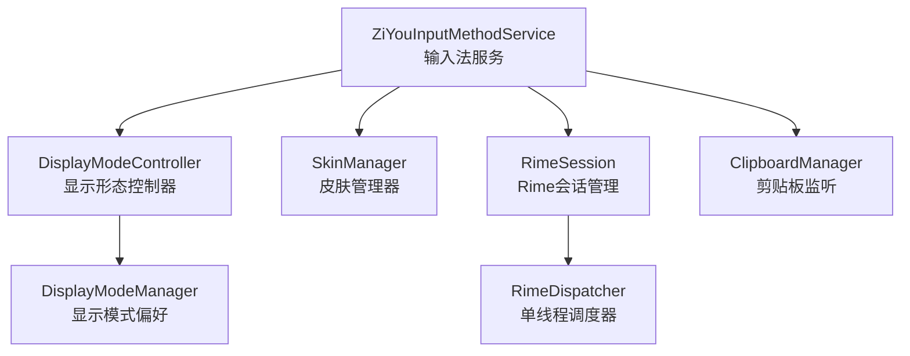
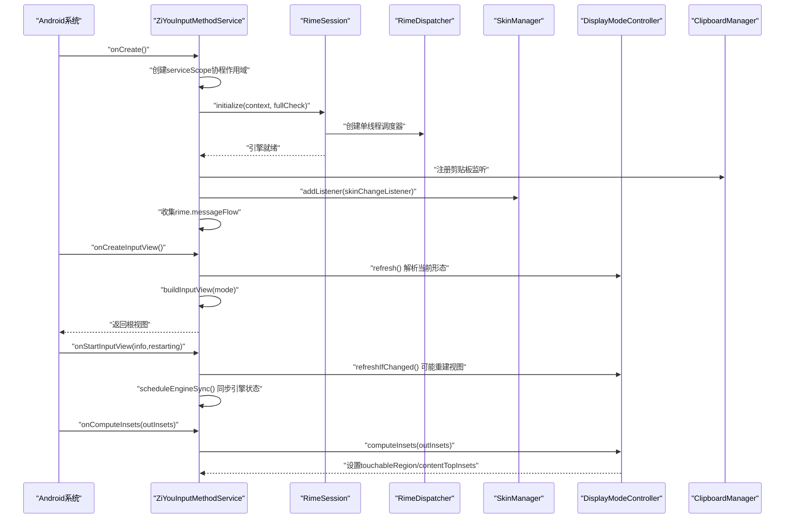
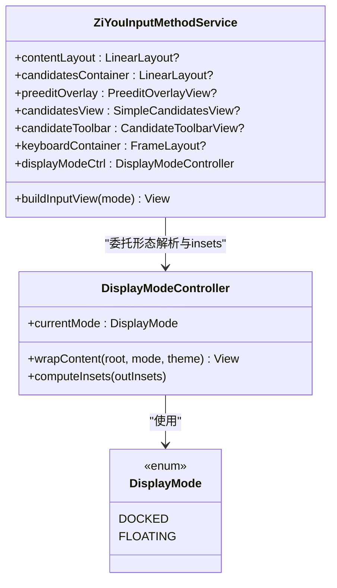
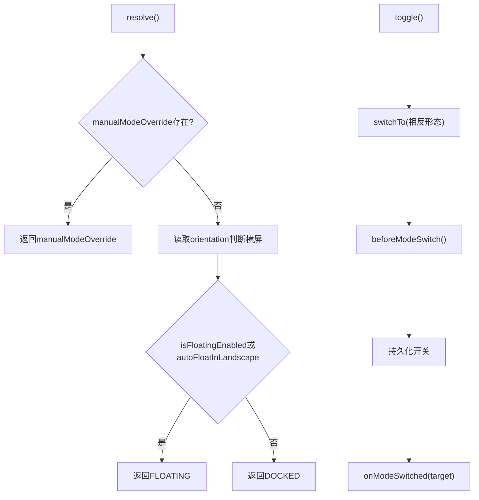
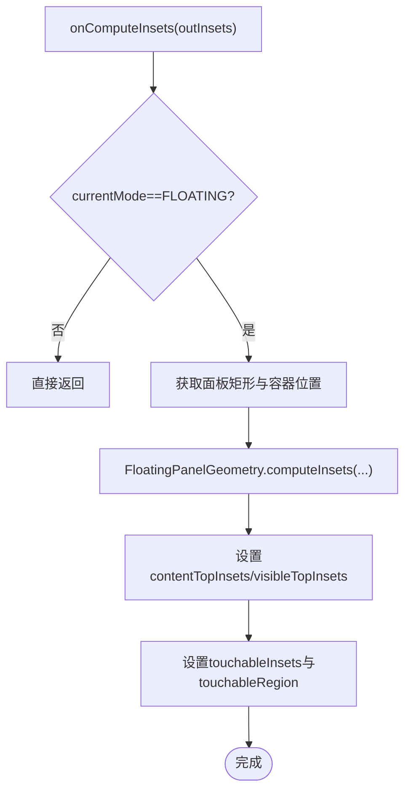
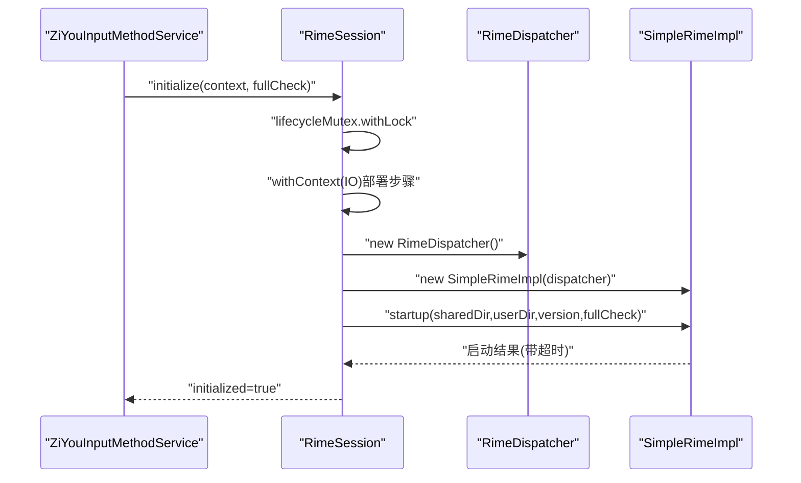
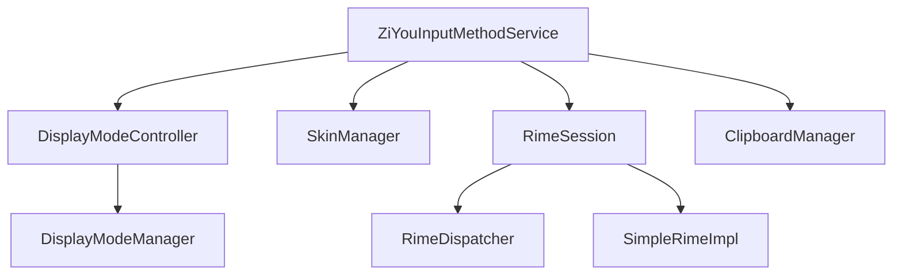

# 服务生命周期管理

<cite>
**本文引用的文件**   
- [ZiYouInputMethodService.kt](file://app/src/main/java/com/ziyou/ime/ime/ZiYouInputMethodService.kt)
- [DisplayModeController.kt](file://app/src/main/java/com/ziyou/ime/ime/DisplayModeController.kt)
- [DisplayMode.kt](file://app/src/main/java/com/ziyou/ime/ime/DisplayMode.kt)
- [RimeSession.kt](file://app/src/main/java/com/ziyou/ime/daemon/RimeSession.kt)
- [RimeDispatcher.kt](file://app/src/main/java/com/ziyou/ime/core/RimeDispatcher.kt)
- [SkinManager.kt](file://app/src/main/java/com/ziyou/ime/skin/SkinManager.kt)
- [DisplayModeManager.kt](file://app/src/main/java/com/ziyou/ime/config/DisplayModeManager.kt)
</cite>

## 目录
1. [简介](#简介)
2. [项目结构](#项目结构)
3. [核心组件](#核心组件)
4. [架构总览](#架构总览)
5. [详细组件分析](#详细组件分析)
6. [依赖关系分析](#依赖关系分析)
7. [性能考量](#性能考量)
8. [故障排查指南](#故障排查指南)
9. [结论](#结论)

## 简介
本文件聚焦于 ZiYouInputMethodService 作为 Android InputMethodService 子类的完整生命周期与关键实现，包括：
- onCreate、onCreateInputView、onStartInputView、onFinishInputView、onDestroy 等生命周期方法职责与执行顺序
- Rime 引擎启动、协程作用域创建、剪贴板监听注册、皮肤管理器订阅等初始化步骤
- 输入视图构建流程（候选区容器、编码区、键盘容器）的层次结构与组装方式
- 显示形态（停靠/悬浮）解析与切换机制，以及 onComputeInsets 对悬浮模式的窗口 insets 处理
- 关键流程图与代码级引用，帮助读者快速定位实现细节

## 项目结构
围绕输入法服务的核心代码集中在 ime 包内，配合配置、守护进程、皮肤管理等模块协同工作：
- ime: 输入法服务主类与显示形态控制器、显示模式枚举
- daemon: Rime 会话管理与部署步骤编排
- core: Rime 单线程调度器与消息流
- skin: 皮肤快照与变更通知门面
- config: 显示模式偏好存储（悬浮开关、横屏自动悬浮、面板位置等）

图表来源
- [ZiYouInputMethodService.kt:356-406](file://app/src/main/java/com/ziyou/ime/ime/ZiYouInputMethodService.kt#L356-L406)
- [DisplayModeController.kt:22-115](file://app/src/main/java/com/ziyou/ime/ime/DisplayModeController.kt#L22-L115)
- [SkinManager.kt:31-111](file://app/src/main/java/com/ziyou/ime/skin/SkinManager.kt#L31-L111)
- [RimeSession.kt:88-153](file://app/src/main/java/com/ziyou/ime/daemon/RimeSession.kt#L88-L153)
- [RimeDispatcher.kt:22-60](file://app/src/main/java/com/ziyou/ime/core/RimeDispatcher.kt#L22-L60)
- [DisplayModeManager.kt:44-57](file://app/src/main/java/com/ziyou/ime/config/DisplayModeManager.kt#L44-L57)

章节来源
- [ZiYouInputMethodService.kt:356-406](file://app/src/main/java/com/ziyou/ime/ime/ZiYouInputMethodService.kt#L356-L406)
- [DisplayModeController.kt:22-115](file://app/src/main/java/com/ziyou/ime/ime/DisplayModeController.kt#L22-L115)
- [SkinManager.kt:31-111](file://app/src/main/java/com/ziyou/ime/skin/SkinManager.kt#L31-L111)
- [RimeSession.kt:88-153](file://app/src/main/java/com/ziyou/ime/daemon/RimeSession.kt#L88-L153)
- [RimeDispatcher.kt:22-60](file://app/src/main/java/com/ziyou/ime/core/RimeDispatcher.kt#L22-L60)
- [DisplayModeManager.kt:44-57](file://app/src/main/java/com/ziyou/ime/config/DisplayModeManager.kt#L44-L57)

## 核心组件
- ZiYouInputMethodService: 输入法服务主类，负责生命周期管理、视图构建、按键处理、引擎状态同步、面板协调与资源清理。
- DisplayModeController: 封装显示形态（停靠/悬浮）解析、切换与悬浮 insets 计算，解耦 Service 的形态逻辑。
- RimeSession: Rime 引擎会话管理，负责初始化、销毁、重部署与 API 暴露。
- RimeDispatcher: 为 librime 提供单线程调度，保证线程安全。
- SkinManager: 皮肤快照与变更通知门面，支持样式增量更新与全量重建。
- DisplayModeManager: 悬浮模式相关用户偏好存储（开关、横屏自动悬浮、面板位置）。

章节来源
- [ZiYouInputMethodService.kt:53-100](file://app/src/main/java/com/ziyou/ime/ime/ZiYouInputMethodService.kt#L53-L100)
- [DisplayModeController.kt:22-115](file://app/src/main/java/com/ziyou/ime/ime/DisplayModeController.kt#L22-L115)
- [RimeSession.kt:38-153](file://app/src/main/java/com/ziyou/ime/daemon/RimeSession.kt#L38-L153)
- [RimeDispatcher.kt:22-60](file://app/src/main/java/com/ziyou/ime/core/RimeDispatcher.kt#L22-L60)
- [SkinManager.kt:31-111](file://app/src/main/java/com/ziyou/ime/skin/SkinManager.kt#L31-L111)
- [DisplayModeManager.kt:18-57](file://app/src/main/java/com/ziyou/ime/config/DisplayModeManager.kt#L18-L57)

## 架构总览
下图展示输入法服务在生命周期中的关键交互：服务创建时启动 Rime 引擎、注册剪贴板监听与皮肤监听；输入视图构建时按显示形态包裹内容；悬浮模式下通过 onComputeInsets 裁剪触摸区域；引擎消息驱动 UI 与状态同步。

图表来源
- [ZiYouInputMethodService.kt:356-406](file://app/src/main/java/com/ziyou/ime/ime/ZiYouInputMethodService.kt#L356-L406)
- [ZiYouInputMethodService.kt:442-456](file://app/src/main/java/com/ziyou/ime/ime/ZiYouInputMethodService.kt#L442-L456)
- [ZiYouInputMethodService.kt:796-835](file://app/src/main/java/com/ziyou/ime/ime/ZiYouInputMethodService.kt#L796-L835)
- [ZiYouInputMethodService.kt:561-564](file://app/src/main/java/com/ziyou/ime/ime/ZiYouInputMethodService.kt#L561-L564)
- [DisplayModeController.kt:124-146](file://app/src/main/java/com/ziyou/ime/ime/DisplayModeController.kt#L124-L146)
- [RimeSession.kt:88-153](file://app/src/main/java/com/ziyou/ime/daemon/RimeSession.kt#L88-L153)
- [RimeDispatcher.kt:22-60](file://app/src/main/java/com/ziyou/ime/core/RimeDispatcher.kt#L22-L60)

## 详细组件分析

### ZiYouInputMethodService 生命周期与职责
- onCreate
  - 创建 serviceScope（SupervisorJob + Main），用于统一协程生命周期
  - 预热符号分类缓存（后台 IO）
  - 异步初始化 Rime 引擎（fullCheck 由 AssetDeployer 决定）
  - 注册剪贴板监听（复制即收录历史）
  - 订阅皮肤变更监听（STYLE_ONLY 原地 applySkin，FULL 重建视图）
  - 收集 rime.messageFlow 并分发到 handleRimeMessage
- onCreateInputView
  - 调用 displayModeCtrl.refresh() 解析当前显示形态
  - buildInputView(mode) 构建候选区容器、编码区、键盘容器，并按悬浮形态包裹
- onStartInputView
  - 重新解析显示形态，必要时重建输入视图
  - 刷新图片能力（涂鸦面板按钮态）
  - 同步换行键文案
  - 兜底同步剪贴板历史
  - scheduleEngineSync(ENGINE_READY_TIMEOUT_MS) 先清编码再对齐方案与状态
- onFinishInputView
  - 关闭所有面板（技能/AI/涂鸦/粘贴板/工具）释放 WebView 等资源
  - 重置键盘输入状态、清空编码区
  - 落盘等级统计
  - 异步清除 Rime 编码
- onDestroy
  - 注销皮肤监听与剪贴板监听
  - 关闭面板、落盘统计、取消协程作用域、释放视图引用
  - 调用 displayModeCtrl.release()

```mermaid
flowchart TD
Start(["onCreate"]) --> InitScope["创建serviceScope协程作用域"]
InitScope --> PreloadSymbols["预热符号分类缓存"]
PreloadSymbols --> InitRime["异步初始化Rime引擎"]
InitRime --> RegisterClip["注册剪贴板监听"]
RegisterClip --> SubscribeSkin["订阅皮肤变更监听"]
SubscribeSkin --> CollectMsg["收集rime.messageFlow"]
CollectMsg --> EndCreate(["完成onCreate"])
EndCreate --> OnCreateInputView["onCreateInputView"]
OnCreateInputView --> BuildView["buildInputView(mode)"]
BuildView --> EndCreateInputView(["返回输入视图"])
EndCreateInputView --> OnStartInputView["onStartInputView"]
OnStartInputView --> RefreshMode["refreshIfChanged()可能重建视图"]
RefreshMode --> SyncClipboard["兜底同步剪贴板历史"]
SyncClipboard --> ScheduleSync["scheduleEngineSync()"]
ScheduleSync --> EndStart(["完成onStartInputView"])
EndStart --> OnFinishInputView["onFinishInputView"]
OnFinishInputView --> ClosePanels["关闭全部面板"]
ClosePanels --> ResetState["重置输入状态/清空编码区"]
ResetState --> FlushStats["落盘等级统计"]
FlushStats --> ClearComposition["异步清除Rime编码"]
ClearComposition --> EndFinish(["完成onFinishInputView"])
EndFinish --> OnDestroy["onDestroy"]
OnDestroy --> Unsubscribe["注销皮肤与剪贴板监听"]
Unsubscribe --> CancelScope["取消serviceScope"]
CancelScope --> ReleaseViews["释放视图引用"]
ReleaseViews --> EndDestroy(["完成onDestroy"])
```

图表来源
- [ZiYouInputMethodService.kt:356-406](file://app/src/main/java/com/ziyou/ime/ime/ZiYouInputMethodService.kt#L356-L406)
- [ZiYouInputMethodService.kt:442-456](file://app/src/main/java/com/ziyou/ime/ime/ZiYouInputMethodService.kt#L442-L456)
- [ZiYouInputMethodService.kt:796-835](file://app/src/main/java/com/ziyou/ime/ime/ZiYouInputMethodService.kt#L796-L835)
- [ZiYouInputMethodService.kt:841-866](file://app/src/main/java/com/ziyou/ime/ime/ZiYouInputMethodService.kt#L841-L866)
- [ZiYouInputMethodService.kt:1525-1554](file://app/src/main/java/com/ziyou/ime/ime/ZiYouInputMethodService.kt#L1525-L1554)

章节来源
- [ZiYouInputMethodService.kt:356-406](file://app/src/main/java/com/ziyou/ime/ime/ZiYouInputMethodService.kt#L356-L406)
- [ZiYouInputMethodService.kt:442-456](file://app/src/main/java/com/ziyou/ime/ime/ZiYouInputMethodService.kt#L442-L456)
- [ZiYouInputMethodService.kt:796-835](file://app/src/main/java/com/ziyou/ime/ime/ZiYouInputMethodService.kt#L796-L835)
- [ZiYouInputMethodService.kt:841-866](file://app/src/main/java/com/ziyou/ime/ime/ZiYouInputMethodService.kt#L841-L866)
- [ZiYouInputMethodService.kt:1525-1554](file://app/src/main/java/com/ziyou/ime/ime/ZiYouInputMethodService.kt#L1525-L1554)

### 视图构建流程与层次结构
- 根容器 contentLayout（垂直 LinearLayout）
  - 候选区容器 candidatesArea（垂直 LinearLayout）
    - 编码区 preeditOverlay（固定在顶部）
    - 候选词列表 candidatesView（独立滚动）
    - 候选区功能按钮栏 candidateToolbar（FrameLayout 覆盖，无候选词时显示）
  - 键盘容器 keyboardContainer（FrameLayout，承载可切换键盘视图）
- 悬浮形态下，contentLayout 被 DisplayModeController.wrapContent 包裹进 FloatingPanelContainer，实现拖拽、位置持久化与停靠按钮
- 悬浮缩放因子 FLOATING_SCALE 应用于编码区、候选词、按钮栏，停靠形态保持 1.0

图表来源
- [ZiYouInputMethodService.kt:451-556](file://app/src/main/java/com/ziyou/ime/ime/ZiYouInputMethodService.kt#L451-L556)
- [DisplayModeController.kt:105-115](file://app/src/main/java/com/ziyou/ime/ime/DisplayModeController.kt#L105-L115)
- [DisplayMode.kt:14-17](file://app/src/main/java/com/ziyou/ime/ime/DisplayMode.kt#L14-L17)

章节来源
- [ZiYouInputMethodService.kt:451-556](file://app/src/main/java/com/ziyou/ime/ime/ZiYouInputMethodService.kt#L451-L556)
- [DisplayModeController.kt:105-115](file://app/src/main/java/com/ziyou/ime/ime/DisplayModeController.kt#L105-L115)
- [DisplayMode.kt:14-17](file://app/src/main/java/com/ziyou/ime/ime/DisplayMode.kt#L14-L17)

### 显示形态解析与切换机制
- 优先级：手动覆盖 > 悬浮总开关 > 横屏自动悬浮
- resolve() 根据配置与方向解析当前形态
- toggle()/switchTo() 持久化开关并回调 Host.beforeModeSwitch/onModeSwitched
- wrapContent() 在悬浮形态下将内容根包裹进 FloatingPanelContainer
- computeInsets() 设置 touchableRegion 与 contentTopInsets，使面板外触摸穿透

图表来源
- [DisplayModeController.kt:54-98](file://app/src/main/java/com/ziyou/ime/ime/DisplayModeController.kt#L54-L98)
- [DisplayModeManager.kt:44-57](file://app/src/main/java/com/ziyou/ime/config/DisplayModeManager.kt#L44-L57)

章节来源
- [DisplayModeController.kt:54-98](file://app/src/main/java/com/ziyou/ime/ime/DisplayModeController.kt#L54-L98)
- [DisplayModeManager.kt:44-57](file://app/src/main/java/com/ziyou/ime/config/DisplayModeManager.kt#L44-L57)

### onComputeInsets 悬浮模式窗口 insets 处理
- 仅 FLOATING 生效
- 获取悬浮面板矩形与容器位置，委托 FloatingPanelGeometry.computeInsets 计算
- 设置 contentTopInsets/visibleTopInsets 压到底部，避免宿主应用被顶起
- 设置 touchableInsets=TOUCHABLE_INSETS_REGION 与 touchableRegion 为面板矩形，面板外触摸穿透

图表来源
- [ZiYouInputMethodService.kt:561-564](file://app/src/main/java/com/ziyou/ime/ime/ZiYouInputMethodService.kt#L561-L564)
- [DisplayModeController.kt:124-146](file://app/src/main/java/com/ziyou/ime/ime/DisplayModeController.kt#L124-L146)

章节来源
- [ZiYouInputMethodService.kt:561-564](file://app/src/main/java/com/ziyou/ime/ime/ZiYouInputMethodService.kt#L561-L564)
- [DisplayModeController.kt:124-146](file://app/src/main/java/com/ziyou/ime/ime/DisplayModeController.kt#L124-L146)

### Rime 引擎启动与协程作用域
- RimeSession.initialize(context, fullCheck) 串行化（Mutex）确保不重复初始化
- 在 IO 线程执行部署步骤（资源部署、目录创建）
- 创建 RimeDispatcher（单线程 Executor）与 SimpleRimeImpl
- 启动引擎带超时保护（STARTUP_TIMEOUT_MS），即使超时也标记已初始化以便后续重试
- ZiYouInputMethodService.serviceScope 跟随 Service 生命周期，统一协程任务管理

图表来源
- [RimeSession.kt:88-153](file://app/src/main/java/com/ziyou/ime/daemon/RimeSession.kt#L88-L153)
- [RimeDispatcher.kt:22-60](file://app/src/main/java/com/ziyou/ime/core/RimeDispatcher.kt#L22-L60)
- [ZiYouInputMethodService.kt:373-385](file://app/src/main/java/com/ziyou/ime/ime/ZiYouInputMethodService.kt#L373-L385)

章节来源
- [RimeSession.kt:88-153](file://app/src/main/java/com/ziyou/ime/daemon/RimeSession.kt#L88-L153)
- [RimeDispatcher.kt:22-60](file://app/src/main/java/com/ziyou/ime/core/RimeDispatcher.kt#L22-L60)
- [ZiYouInputMethodService.kt:373-385](file://app/src/main/java/com/ziyou/ime/ime/ZiYouInputMethodService.kt#L373-L385)

### 剪贴板监听注册与历史收录
- onCreate 中 getSystemService(ClipboardManager).addPrimaryClipChangedListener(clipboardListener)
- clipboardListener 调用 captureClipboardToHistory()
- captureClipboardToHistory() 读取 primaryClip，过滤敏感内容（EXTRA_IS_SENSITIVE），去重后入库 ClipboardHistoryRepository
- onStartInputView 兜底同步一次剪贴板，防止服务重启期间漏听

章节来源
- [ZiYouInputMethodService.kt:387-394](file://app/src/main/java/com/ziyou/ime/ime/ZiYouInputMethodService.kt#L387-L394)
- [ZiYouInputMethodService.kt:414-429](file://app/src/main/java/com/ziyou/ime/ime/ZiYouInputMethodService.kt#L414-L429)
- [ZiYouInputMethodService.kt:812-813](file://app/src/main/java/com/ziyou/ime/ime/ZiYouInputMethodService.kt#L812-L813)

### 皮肤管理器订阅与换肤流程
- onCreate 中 SkinManager.addListener(skinChangeListener)
- skinChangeListener.onSkinChanged(kind):
  - STYLE_ONLY：原地 applySkin 到各视图（键盘、候选、编码区、按钮栏）
  - FULL：resetInputState -> setInputView(buildInputView(currentMode)) -> scheduleEngineSync()
- onConfigurationChanged 触发 SkinManager.onSystemDarkModeChanged，按需重建快照

章节来源
- [ZiYouInputMethodService.kt:396-405](file://app/src/main/java/com/ziyou/ime/ime/ZiYouInputMethodService.kt#L396-L405)
- [ZiYouInputMethodService.kt:1364-1389](file://app/src/main/java/com/ziyou/ime/ime/ZiYouInputMethodService.kt#L1364-L1389)
- [SkinManager.kt:117-122](file://app/src/main/java/com/ziyou/ime/skin/SkinManager.kt#L117-L122)

### 引擎状态同步与键盘布局映射
- scheduleEngineSync(timeoutMs, beforeSync) latest-wins 串行化，等待引擎就绪后执行 applyEngineForKeyboard(type)
- applyEngineForKeyboard(type):
  - NINE_GRID：强制 t9 方案，确保中文模式
  - QWERTY：对齐 SchemaPreference 的全键盘方案，回退默认方案；pendingEnglishMode 强制 ascii_mode=true
  - SYMBOL/NUMBER：临时面板，清编码与 keyRecordStack
- 同步 UI：候选词、编码区预览、九宫格侧栏拼音候选与自定义符号

章节来源
- [ZiYouInputMethodService.kt:677-777](file://app/src/main/java/com/ziyou/ime/ime/ZiYouInputMethodService.kt#L677-L777)

## 依赖关系分析
- ZiYouInputMethodService 依赖：
  - DisplayModeController（形态解析与切换）
  - SkinManager（皮肤快照与变更通知）
  - RimeSession（引擎生命周期与 API）
  - ClipboardManager（剪贴板监听）
  - 多个面板协调器（技能/AI/涂鸦/粘贴板/工具）
- RimeSession 依赖：
  - RimeDispatcher（单线程调度）
  - SimpleRimeImpl（librime API 封装）
- DisplayModeController 依赖：
  - DisplayModeManager（偏好存储）
  - FloatingPanelContainer（悬浮面板容器）

图表来源
- [ZiYouInputMethodService.kt:53-100](file://app/src/main/java/com/ziyou/ime/ime/ZiYouInputMethodService.kt#L53-L100)
- [RimeSession.kt:38-153](file://app/src/main/java/com/ziyou/ime/daemon/RimeSession.kt#L38-L153)
- [DisplayModeController.kt:22-115](file://app/src/main/java/com/ziyou/ime/ime/DisplayModeController.kt#L22-L115)

章节来源
- [ZiYouInputMethodService.kt:53-100](file://app/src/main/java/com/ziyou/ime/ime/ZiYouInputMethodService.kt#L53-L100)
- [RimeSession.kt:38-153](file://app/src/main/java/com/ziyou/ime/daemon/RimeSession.kt#L38-L153)
- [DisplayModeController.kt:22-115](file://app/src/main/java/com/ziyou/ime/ime/DisplayModeController.kt#L22-L115)

## 性能考量
- 协程作用域 serviceScope 统一管理任务，避免泄漏
- RimeDispatcher 单线程调度确保 librime 线程安全
- 引擎状态同步 latest-wins 串行化，避免并发交错导致迟到写入
- 皮肤快照读路径 O(1)，写路径异步重建，STYLE_ONLY 增量更新减少重建开销
- 低内存场景 onTrimMemory 主动关闭面板与归还 native 空闲页

章节来源
- [ZiYouInputMethodService.kt:71-71](file://app/src/main/java/com/ziyou/ime/ime/ZiYouInputMethodService.kt#L71-L71)
- [RimeDispatcher.kt:22-60](file://app/src/main/java/com/ziyou/ime/core/RimeDispatcher.kt#L22-L60)
- [ZiYouInputMethodService.kt:677-699](file://app/src/main/java/com/ziyou/ime/ime/ZiYouInputMethodService.kt#L677-L699)
- [SkinManager.kt:66-80](file://app/src/main/java/com/ziyou/ime/skin/SkinManager.kt#L66-L80)
- [ZiYouInputMethodService.kt:879-892](file://app/src/main/java/com/ziyou/ime/ime/ZiYouInputMethodService.kt#L879-L892)

## 故障排查指南
- 引擎未就绪导致操作失败
  - 现象：切换中英文、方案切换失败
  - 排查：awaitEngineReady 超时日志；检查 RimeSession.initialize 是否成功
  - 参考：[ZiYouInputMethodService.kt:658-665](file://app/src/main/java/com/ziyou/ime/ime/ZiYouInputMethodService.kt#L658-L665), [RimeSession.kt:135-152](file://app/src/main/java/com/ziyou/ime/daemon/RimeSession.kt#L135-L152)
- 悬浮模式触摸无效
  - 现象：悬浮面板外触摸未被穿透
  - 排查：onComputeInsets 是否正确设置 touchableRegion；确认 currentMode 为 FLOATING
  - 参考：[DisplayModeController.kt:124-146](file://app/src/main/java/com/ziyou/ime/ime/DisplayModeController.kt#L124-L146)
- 皮肤切换未生效
  - 现象：切换皮肤后视图未更新
  - 排查：skinChangeListener 是否收到 FULL 事件；applySkinToViews 是否调用
  - 参考：[ZiYouInputMethodService.kt:1364-1389](file://app/src/main/java/com/ziyou/ime/ime/ZiYouInputMethodService.kt#L1364-L1389)
- 剪贴板历史未收录
  - 现象：复制内容未进入历史
  - 排查：剪贴板监听是否注册；是否因敏感内容跳过；onStartInputView 兜底是否执行
  - 参考：[ZiYouInputMethodService.kt:387-394](file://app/src/main/java/com/ziyou/ime/ime/ZiYouInputMethodService.kt#L387-L394), [ZiYouInputMethodService.kt:414-429](file://app/src/main/java/com/ziyou/ime/ime/ZiYouInputMethodService.kt#L414-L429)

章节来源
- [ZiYouInputMethodService.kt:658-665](file://app/src/main/java/com/ziyou/ime/ime/ZiYouInputMethodService.kt#L658-L665)
- [RimeSession.kt:135-152](file://app/src/main/java/com/ziyou/ime/daemon/RimeSession.kt#L135-L152)
- [DisplayModeController.kt:124-146](file://app/src/main/java/com/ziyou/ime/ime/DisplayModeController.kt#L124-L146)
- [ZiYouInputMethodService.kt:1364-1389](file://app/src/main/java/com/ziyou/ime/ime/ZiYouInputMethodService.kt#L1364-L1389)
- [ZiYouInputMethodService.kt:387-394](file://app/src/main/java/com/ziyou/ime/ime/ZiYouInputMethodService.kt#L387-L394)
- [ZiYouInputMethodService.kt:414-429](file://app/src/main/java/com/ziyou/ime/ime/ZiYouInputMethodService.kt#L414-L429)

## 结论
ZiYouInputMethodService 以清晰的生命周期划分与职责拆分，实现了输入法服务的高内聚与低耦合：
- 生命周期方法明确承担初始化、视图构建、状态同步与资源清理
- 显示形态与键盘布局正交，悬浮模式通过 insets 裁剪实现无权限悬浮体验
- Rime 引擎通过单线程调度与 latest-wins 同步策略保障线程安全与一致性
- 皮肤管理采用快照与增量更新，兼顾性能与用户体验
- 剪贴板监听与面板协调器完善输入生态，提升可用性