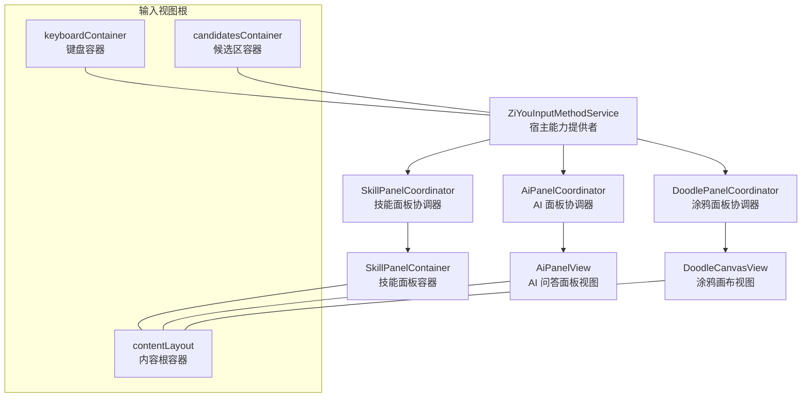
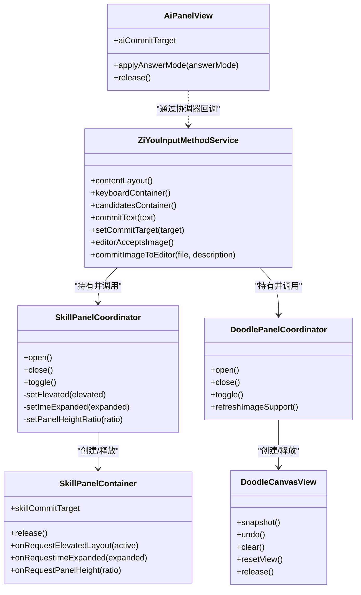
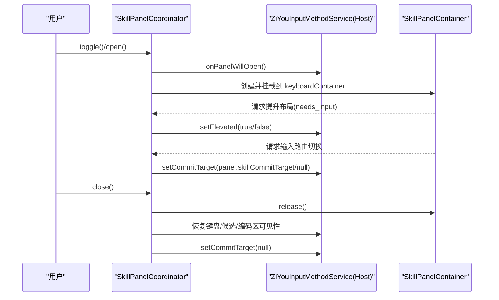
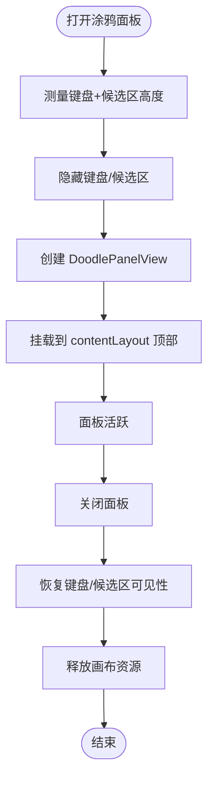
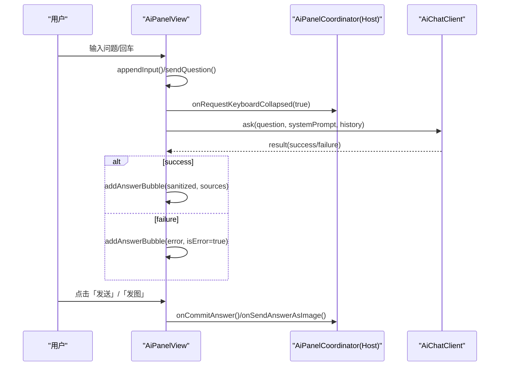
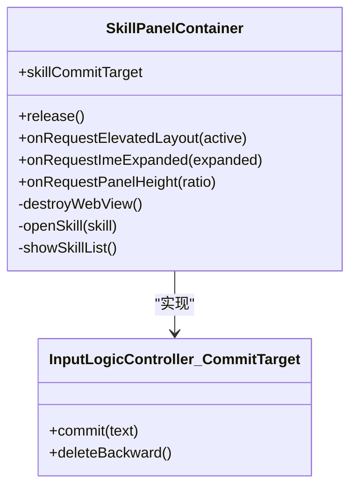
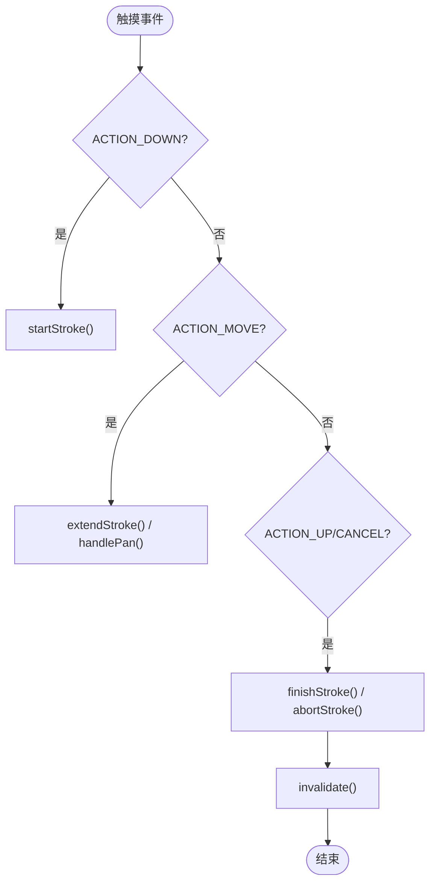
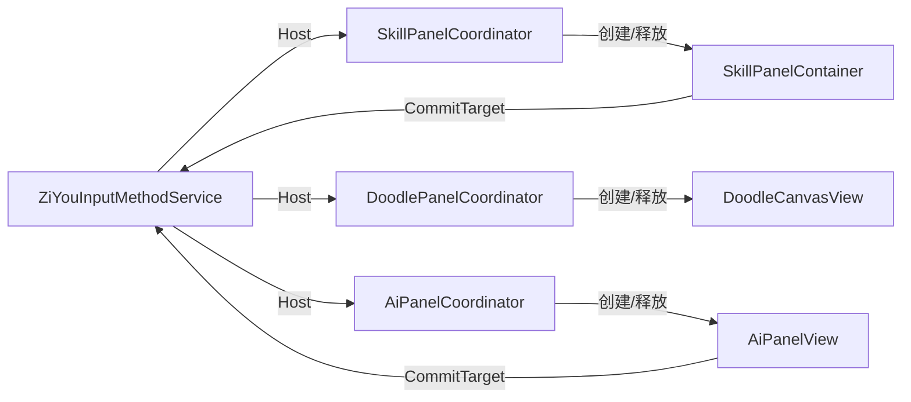

# 视图协调机制

<cite>
**本文引用的文件**   
- [ZiYouInputMethodService.kt](file://app/src/main/java/com/ziyou/ime/ime/ZiYouInputMethodService.kt)
- [SkillPanelCoordinator.kt](file://app/src/main/java/com/ziyou/ime/ime/SkillPanelCoordinator.kt)
- [DoodlePanelCoordinator.kt](file://app/src/main/java/com/ziyou/ime/ime/DoodlePanelCoordinator.kt)
- [AiPanelView.kt](file://app/src/main/java/com/ziyou/ime/ime/AiPanelView.kt)
- [SkillPanelContainer.kt](file://app/src/main/java/com/ziyou/ime/ime/SkillPanelContainer.kt)
- [DoodleCanvasView.kt](file://app/src/main/java/com/ziyou/ime/ime/DoodleCanvasView.kt)
- [FloatingPanelContainer.kt](file://app/src/main/java/com/ziyou/ime/ime/FloatingPanelContainer.kt)
</cite>

## 目录
1. [引言](#引言)
2. [项目结构](#项目结构)
3. [核心组件](#核心组件)
4. [架构总览](#架构总览)
5. [详细组件分析](#详细组件分析)
6. [依赖关系分析](#依赖关系分析)
7. [性能考量](#性能考量)
8. [故障排查指南](#故障排查指南)
9. [结论](#结论)

## 引言
本文件围绕输入法中的“视图协调机制”展开，聚焦三类面板协调器：技能面板协调器（SkillPanelCoordinator）、AI 问答面板（AiPanelView 与协调器）、涂鸦画板面板协调器（DoodlePanelCoordinator）。文档将系统阐述：
- 设计模式与协作关系（Host 宿主接口、协调器与面板容器解耦）
- 面板生命周期管理（打开、关闭、销毁时的资源清理与状态同步）
- 与键盘视图的交互（键盘收放、候选区隐藏、输入焦点转移、输入路由切换）
- 宿主能力接口定义与使用（容器访问、上屏出口、图片提交、IME 展开收缩）
- 面板互斥与优先级策略（避免多面板同时干扰输入体验）
- 关键流程的时序图与流程图，帮助快速定位问题与优化点

## 项目结构
与视图协调相关的关键代码集中在 ime 包下，采用“协调器 + 面板容器/视图 + Service 宿主”的分层组织方式：
- 协调器：SkillPanelCoordinator、DoodlePanelCoordinator、AiPanelCoordinator（由 Service 持有并编排）
- 面板容器/视图：SkillPanelContainer、AiPanelView、DoodleCanvasView
- 宿主入口：ZiYouInputMethodService（提供容器访问、上屏出口、输入路由切换等能力）
- 悬浮形态容器：FloatingPanelContainer（FLOATING 模式下作为根容器）

图表来源 
- [ZiYouInputMethodService.kt:102-200](file://app/src/main/java/com/ziyou/ime/ime/ZiYouInputMethodService.kt#L102-L200)
- [SkillPanelCoordinator.kt:31-70](file://app/src/main/java/com/ziyou/ime/ime/SkillPanelCoordinator.kt#L31-L70)
- [DoodlePanelCoordinator.kt:25-62](file://app/src/main/java/com/ziyou/ime/ime/DoodlePanelCoordinator.kt#L25-L62)
- [AiPanelView.kt:55-84](file://app/src/main/java/com/ziyou/ime/ime/AiPanelView.kt#L55-L84)
- [SkillPanelContainer.kt:38-79](file://app/src/main/java/com/ziyou/ime/ime/SkillPanelContainer.kt#L38-L79)
- [DoodleCanvasView.kt:42-58](file://app/src/main/java/com/ziyou/ime/ime/DoodleCanvasView.kt#L42-L58)

章节来源
- [ZiYouInputMethodService.kt:102-200](file://app/src/main/java/com/ziyou/ime/ime/ZiYouInputMethodService.kt#L102-L200)

## 核心组件
- SkillPanelCoordinator：负责技能面板的生命周期与三态布局编排（键盘叠层、提升挂载、收缩态），并通过 Host 接口与 Service 通信。
- DoodlePanelCoordinator：负责涂鸦面板的生命周期与键盘收放布局编排，不接管输入路由，对引擎零侵入。
- AiPanelView：AI 问答面板视图，支持提问态/答案态两种布局，通过 CommitTarget 接入键盘输入路由。
- SkillPanelContainer：技能面板容器，承载 WebView 与技能列表，维护输入路由与宿主角标。
- DoodleCanvasView：自由涂鸦画布，支持双指平移、撤销、清空、导出快照。
- FloatingPanelContainer：FLOATING 形态下的输入视图根容器，处理面板拖拽与 insets 裁剪。

章节来源
- [SkillPanelCoordinator.kt:31-70](file://app/src/main/java/com/ziyou/ime/ime/SkillPanelCoordinator.kt#L31-L70)
- [DoodlePanelCoordinator.kt:25-62](file://app/src/main/java/com/ziyou/ime/ime/DoodlePanelCoordinator.kt#L25-L62)
- [AiPanelView.kt:55-84](file://app/src/main/java/com/ziyou/ime/ime/AiPanelView.kt#L55-L84)
- [SkillPanelContainer.kt:38-79](file://app/src/main/java/com/ziyou/ime/ime/SkillPanelContainer.kt#L38-L79)
- [DoodleCanvasView.kt:42-58](file://app/src/main/java/com/ziyou/ime/ime/DoodleCanvasView.kt#L42-L58)
- [FloatingPanelContainer.kt:40-56](file://app/src/main/java/com/ziyou/ime/ime/FloatingPanelContainer.kt#L40-L56)

## 架构总览
整体采用“协调器-面板容器/视图-宿主”三层解耦：
- 协调器仅负责生命周期与布局编排，不直接操作 UI 细节
- 面板容器/视图实现具体业务逻辑（WebView 加载、对话渲染、画布绘制）
- 宿主（Service）暴露统一能力（容器访问、上屏出口、输入路由切换、图片提交）

图表来源 
- [ZiYouInputMethodService.kt:102-200](file://app/src/main/java/com/ziyou/ime/ime/ZiYouInputMethodService.kt#L102-L200)
- [SkillPanelCoordinator.kt:31-70](file://app/src/main/java/com/ziyou/ime/ime/SkillPanelCoordinator.kt#L31-L70)
- [DoodlePanelCoordinator.kt:25-62](file://app/src/main/java/com/ziyou/ime/ime/DoodlePanelCoordinator.kt#L25-L62)
- [SkillPanelContainer.kt:38-79](file://app/src/main/java/com/ziyou/ime/ime/SkillPanelContainer.kt#L38-L79)
- [AiPanelView.kt:55-84](file://app/src/main/java/com/ziyou/ime/ime/AiPanelView.kt#L55-L84)
- [DoodleCanvasView.kt:42-58](file://app/src/main/java/com/ziyou/ime/ime/DoodleCanvasView.kt#L42-L58)

## 详细组件分析

### 技能面板协调器（SkillPanelCoordinator）
- 职责：面板开关、三态布局（键盘叠层/提升挂载/收缩态）、高度比例控制、输入路由切换
- 关键点：
  - 打开时以键盘叠层展示技能列表；needs_input 技能提升至编码区上方
  - 收缩态时键盘/候选/编码区 GONE，面板接管三者实测高度之和，IME 窗口总高不变
  - 输入路由激活时，键盘上屏文本改道注入面板输入框（CommitTarget）
  - 关闭时释放 WebView/Bridge、恢复可见性与 commitTarget

图表来源 
- [SkillPanelCoordinator.kt:93-119](file://app/src/main/java/com/ziyou/ime/ime/SkillPanelCoordinator.kt#L93-L119)
- [SkillPanelCoordinator.kt:203-224](file://app/src/main/java/com/ziyou/ime/ime/SkillPanelCoordinator.kt#L203-L224)
- [SkillPanelCoordinator.kt:235-255](file://app/src/main/java/com/ziyou/ime/ime/SkillPanelCoordinator.kt#L235-L255)
- [SkillPanelContainer.kt:200-230](file://app/src/main/java/com/ziyou/ime/ime/SkillPanelContainer.kt#L200-L230)

章节来源
- [SkillPanelCoordinator.kt:93-119](file://app/src/main/java/com/ziyou/ime/ime/SkillPanelCoordinator.kt#L93-L119)
- [SkillPanelCoordinator.kt:203-224](file://app/src/main/java/com/ziyou/ime/ime/SkillPanelCoordinator.kt#L203-L224)
- [SkillPanelCoordinator.kt:235-255](file://app/src/main/java/com/ziyou/ime/ime/SkillPanelCoordinator.kt#L235-L255)
- [SkillPanelContainer.kt:200-230](file://app/src/main/java/com/ziyou/ime/ime/SkillPanelContainer.kt#L200-L230)

### 涂鸦面板协调器（DoodlePanelCoordinator）
- 职责：面板开关、键盘/候选区收放、图片发送/保存出口
- 关键点：
  - 打开即收起键盘/候选区，面板高度 = 二者实测高度之和（高度守恒）
  - 不接管 commitTarget，对 Rime 引擎与输入链路零侵入
  - 关闭时回收画布资源、恢复键盘/候选区可见性

图表来源 
- [DoodlePanelCoordinator.kt:79-100](file://app/src/main/java/com/ziyou/ime/ime/DoodlePanelCoordinator.kt#L79-L100)
- [DoodlePanelCoordinator.kt:112-119](file://app/src/main/java/com/ziyou/ime/ime/DoodlePanelCoordinator.kt#L112-L119)

章节来源
- [DoodlePanelCoordinator.kt:79-100](file://app/src/main/java/com/ziyou/ime/ime/DoodlePanelCoordinator.kt#L79-L100)
- [DoodlePanelCoordinator.kt:112-119](file://app/src/main/java/com/ziyou/ime/ime/DoodlePanelCoordinator.kt#L112-L119)

### AI 问答面板（AiPanelView）
- 职责：对话气泡展示、输入路由接入、答案态/提问态布局切换、异步请求与错误处理
- 关键点：
  - aiCommitTarget 接入键盘上屏，回车键触发发送
  - 答案态时键盘/候选区收回，对话区接管空间独立滚动
  - 支持 Markdown 渲染、敏感词过滤、知识库检索（RAG）
  - release 时持久化会话记忆、取消协程作用域

图表来源 
- [AiPanelView.kt:329-416](file://app/src/main/java/com/ziyou/ime/ime/AiPanelView.kt#L329-L416)
- [AiPanelView.kt:736-754](file://app/src/main/java/com/ziyou/ime/ime/AiPanelView.kt#L736-L754)
- [AiPanelView.kt:757-763](file://app/src/main/java/com/ziyou/ime/ime/AiPanelView.kt#L757-L763)

章节来源
- [AiPanelView.kt:329-416](file://app/src/main/java/com/ziyou/ime/ime/AiPanelView.kt#L329-L416)
- [AiPanelView.kt:736-754](file://app/src/main/java/com/ziyou/ime/ime/AiPanelView.kt#L736-L754)
- [AiPanelView.kt:757-763](file://app/src/main/java/com/ziyou/ime/ime/AiPanelView.kt#L757-L763)

### 技能面板容器（SkillPanelContainer）
- 职责：技能列表与 WebView 管理、输入路由激活、宿主角标（返回/关闭）
- 关键点：
  - skillCommitTarget 将键盘上屏文本注入面板输入框
  - 渲染进程崩溃时回到技能列表，面板存活
  - release 时恢复 IME 展开、关闭输入路由、释放 Bridge/WebView

图表来源 
- [SkillPanelContainer.kt:96-113](file://app/src/main/java/com/ziyou/ime/ime/SkillPanelContainer.kt#L96-L113)
- [SkillPanelContainer.kt:200-230](file://app/src/main/java/com/ziyou/ime/ime/SkillPanelContainer.kt#L200-L230)

章节来源
- [SkillPanelContainer.kt:96-113](file://app/src/main/java/com/ziyou/ime/ime/SkillPanelContainer.kt#L96-L113)
- [SkillPanelContainer.kt:200-230](file://app/src/main/java/com/ziyou/ime/ime/SkillPanelContainer.kt#L200-L230)

### 涂鸦画布视图（DoodleCanvasView）
- 职责：无限画布绘制、双指平移、撤销/清空、导出快照
- 关键点：
  - 双层渲染（离屏位图缓存 + 实时笔迹）
  - MAX_STROKES 约束内存占用
  - snapshot 渲染全部内容包围盒，超限时降采样防 OOM

图表来源 
- [DoodleCanvasView.kt:226-283](file://app/src/main/java/com/ziyou/ime/ime/DoodleCanvasView.kt#L226-L283)
- [DoodleCanvasView.kt:345-363](file://app/src/main/java/com/ziyou/ime/ime/DoodleCanvasView.kt#L345-L363)
- [DoodleCanvasView.kt:438-464](file://app/src/main/java/com/ziyou/ime/ime/DoodleCanvasView.kt#L438-L464)

章节来源
- [DoodleCanvasView.kt:226-283](file://app/src/main/java/com/ziyou/ime/ime/DoodleCanvasView.kt#L226-L283)
- [DoodleCanvasView.kt:345-363](file://app/src/main/java/com/ziyou/ime/ime/DoodleCanvasView.kt#L345-L363)
- [DoodleCanvasView.kt:438-464](file://app/src/main/java/com/ziyou/ime/ime/DoodleCanvasView.kt#L438-L464)

### 悬浮面板容器（FloatingPanelContainer）
- 职责：FLOATING 形态下的透明容器、面板宽度计算与摆放、拖动条拖拽移动、insets 裁剪
- 关键点：
  - translationX/Y 位移实现拖动，零 relayout 保持 60fps
  - getPanelRectInWindow 供 Service 的 onComputeInsets 裁剪触摸区域

章节来源
- [FloatingPanelContainer.kt:130-136](file://app/src/main/java/com/ziyou/ime/ime/FloatingPanelContainer.kt#L130-L136)
- [FloatingPanelContainer.kt:173-206](file://app/src/main/java/com/ziyou/ime/ime/FloatingPanelContainer.kt#L173-L206)

## 依赖关系分析
- 协调器依赖 Service 提供的 Host 接口，松耦合便于替换与测试
- 面板容器/视图依赖协调器的回调进行布局与状态同步
- 输入路由通过 InputLogicController.CommitTarget 在面板与宿主编辑器之间切换
- 图片提交通过 commitContent 或 FileProvider URI 直达宿主编辑器

图表来源 
- [ZiYouInputMethodService.kt:102-200](file://app/src/main/java/com/ziyou/ime/ime/ZiYouInputMethodService.kt#L102-L200)
- [SkillPanelCoordinator.kt:31-70](file://app/src/main/java/com/ziyou/ime/ime/SkillPanelCoordinator.kt#L31-L70)
- [DoodlePanelCoordinator.kt:25-62](file://app/src/main/java/com/ziyou/ime/ime/DoodlePanelCoordinator.kt#L25-L62)
- [AiPanelView.kt:55-84](file://app/src/main/java/com/ziyou/ime/ime/AiPanelView.kt#L55-L84)

章节来源
- [ZiYouInputMethodService.kt:102-200](file://app/src/main/java/com/ziyou/ime/ime/ZiYouInputMethodService.kt#L102-L200)

## 性能考量
- 技能面板 WebView 懒创建与用完即毁，降低内存占用
- 涂鸦画布采用双层渲染与离屏位图缓存，绘制热路径 O(1)
- MAX_STROKES 限制笔画数量，超出丢弃最早一笔
- 悬浮面板使用 translation 位移避免重排，保持 60fps
- AI 面板异步请求与协程作用域隔离，失败降级与错误隔离

[本节为通用指导，无需特定文件引用]

## 故障排查指南
- 面板无法打开：检查 Host 容器是否为空、悬浮模式限制（技能面板不支持悬浮）
- 输入路由未生效：确认 setCommitTarget 是否被正确设置与清除
- 图片提交失败：检查 editorAcceptsImage 与 commitContent/FileProvider 配置
- 画布内存溢出：检查 MAX_STROKES 与 snapshot 尺寸上限
- AI 请求失败：查看日志与降级路径（知识库检索异常回退原路径）

章节来源
- [SkillPanelCoordinator.kt:93-106](file://app/src/main/java/com/ziyou/ime/ime/SkillPanelCoordinator.kt#L93-L106)
- [DoodlePanelCoordinator.kt:79-100](file://app/src/main/java/com/ziyou/ime/ime/DoodlePanelCoordinator.kt#L79-L100)
- [AiPanelView.kt:329-416](file://app/src/main/java/com/ziyou/ime/ime/AiPanelView.kt#L329-L416)

## 结论
本视图协调机制通过协调器与面板容器的解耦设计，实现了多面板的生命周期管理与布局编排，结合输入路由与宿主能力接口，确保了输入体验的一致性与稳定性。未来可扩展更多面板类型，遵循同一拆分纪律与 Host 接口契约，保持系统的可维护性与扩展性。