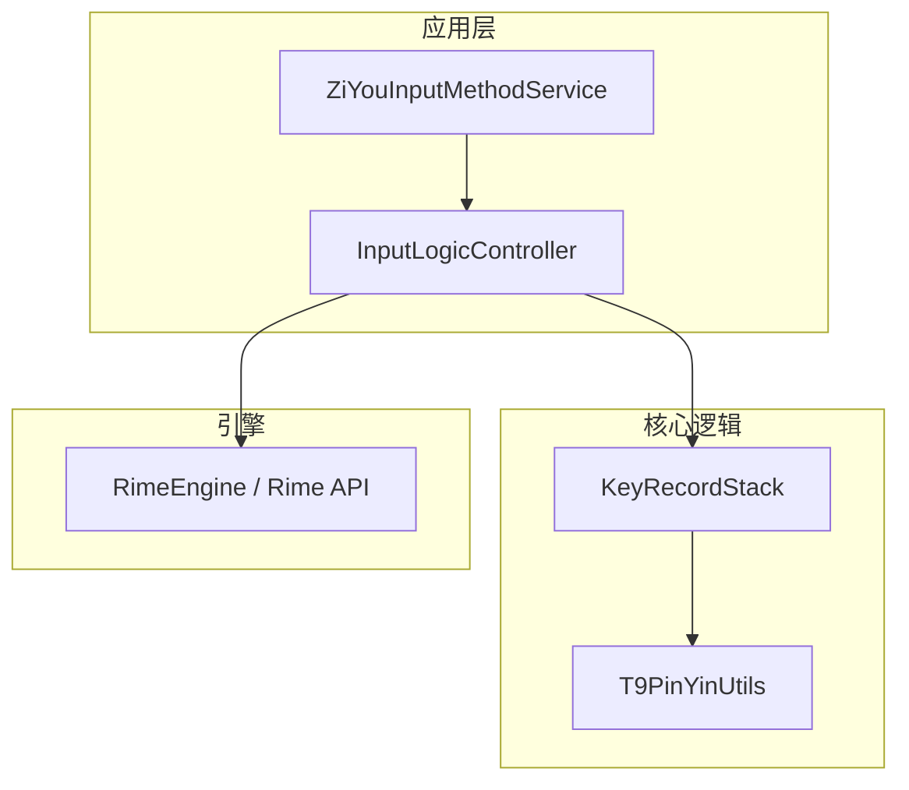
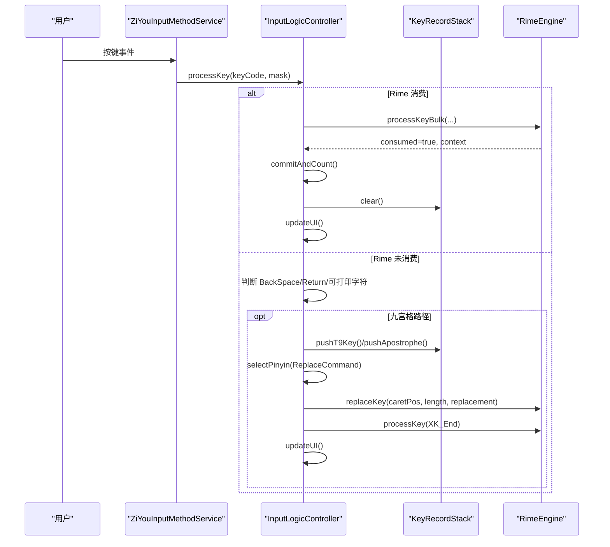
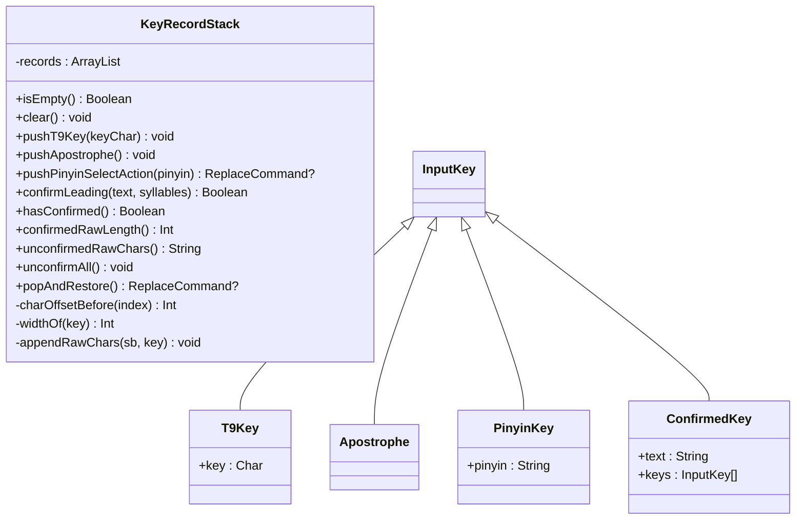
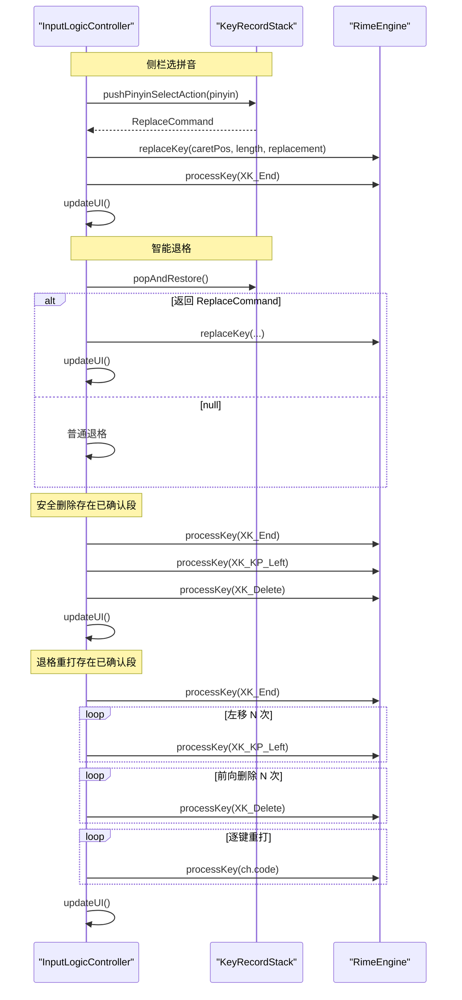
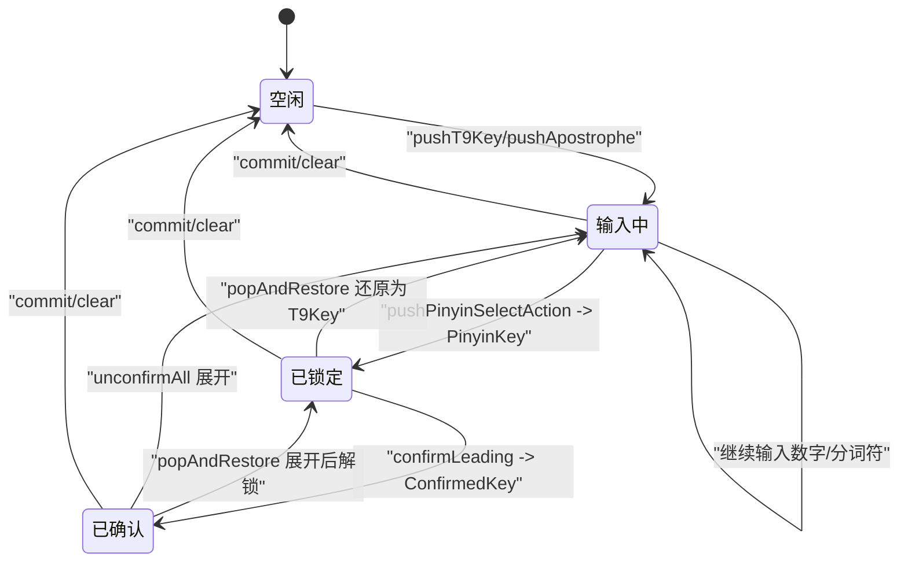
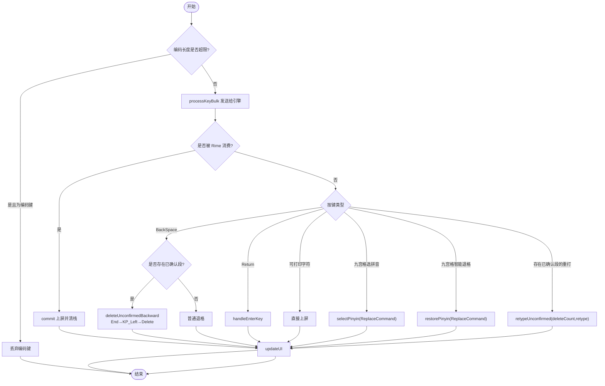
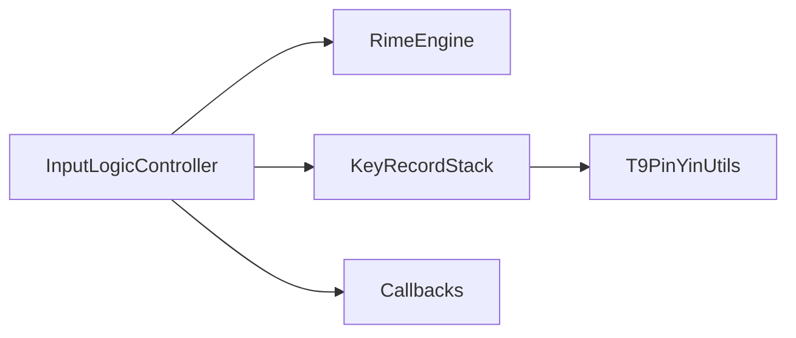

# 九宫格输入逻辑

<cite>
**本文引用的文件**   
- [KeyRecordStack.kt](file://core-logic/src/main/java/com/ziyou/ime/core/t9/KeyRecordStack.kt)
- [T9PinYinUtils.kt](file://core-logic/src/main/java/com/ziyou/ime/util/T9PinYinUtils.kt)
- [InputLogicController.kt](file://app/src/main/java/com/ziyou/ime/ime/InputLogicController.kt)
- [ZiYouInputMethodService.kt](file://app/src/main/java/com/ziyou/ime/ime/ZiYouInputMethodService.kt)
- [InputLogicControllerTest.kt](file://app/src/test/java/com/ziyou/ime/ime/InputLogicControllerTest.kt)
- [KeyRecordStackTest.kt](file://core-logic/src/test/java/com/ziyou/ime/core/t9/KeyRecordStackTest.kt)
</cite>

## 目录
1. [简介](#简介)
2. [项目结构](#项目结构)
3. [核心组件](#核心组件)
4. [架构总览](#架构总览)
5. [详细组件分析](#详细组件分析)
6. [依赖关系分析](#依赖关系分析)
7. [性能考量](#性能考量)
8. [故障排查指南](#故障排查指南)
9. [结论](#结论)
10. [附录](#附录)

## 简介
本技术文档聚焦于九宫格（T9）输入的核心逻辑，重点阐述：
- 智能退格与拼音锁定：ReplaceCommand 的生成与 replaceKey API 的使用。
- 安全删除机制 deleteUnconfirmedBackward：已确认段保护、特殊按键序列 End + KP_Left + Delete 的设计原因。
- 退格重打 retypeUnconfirmed：未确认原始键的精确删除与逐键重打新串的实现细节。
- 与 KeyRecordStack 的状态同步：confirmLeading 合并策略与降级处理。
- 状态转换图与按键处理流程图：覆盖复杂场景下的处理路径。

## 项目结构
围绕九宫格输入的关键代码分布在以下模块：
- core-logic：九宫格状态机 KeyRecordStack、T9 与拼音映射工具 T9PinYinUtils。
- app：输入逻辑控制器 InputLogicController 与服务层 ZiYouInputMethodService 的交互。
- 测试：对关键流程进行回归验证。

图表来源
- [InputLogicController.kt:126-185](file://app/src/main/java/com/ziyou/ime/ime/InputLogicController.kt#L126-L185)
- [KeyRecordStack.kt:20-34](file://core-logic/src/main/java/com/ziyou/ime/core/t9/KeyRecordStack.kt#L20-L34)
- [T9PinYinUtils.kt:12-41](file://core-logic/src/main/java/com/ziyou/ime/util/T9PinYinUtils.kt#L12-L41)

章节来源
- [InputLogicController.kt:126-185](file://app/src/main/java/com/ziyou/ime/ime/InputLogicController.kt#L126-L185)
- [KeyRecordStack.kt:20-34](file://core-logic/src/main/java/com/ziyou/ime/core/t9/KeyRecordStack.kt#L20-L34)
- [T9PinYinUtils.kt:12-41](file://core-logic/src/main/java/com/ziyou/ime/util/T9PinYinUtils.kt#L12-L41)

## 核心组件
- KeyRecordStack：九宫格输入状态机，维护“列表顺序 == Rime 编码串逻辑顺序”的不变式，支持：
  - pushT9Key/pushApostrophe：追加数字键与分词符。
  - pushPinyinSelectAction：侧栏选拼音，原地替换首个未确定音节段，返回 ReplaceCommand。
  - confirmLeading：分段确认后合并栈头为已确认段，保持偏移计算正确。
  - popAndRestore：智能退格，解锁已锁定拼音或弹出末位键。
  - unconfirmAll：展开已确认段以与引擎 set_input 行为对齐。
- T9PinYinUtils：T9 数字键与拼音的双向映射，提供 pinyin2Key、t9KeyToPinyin 等能力。
- InputLogicController：输入事务串行化、按键分发、候选选择、replaceKey/retype/delete 等上层编排。
- ZiYouInputMethodService：与 Android IME 框架对接，调用控制器方法完成上屏与 UI 刷新。

章节来源
- [KeyRecordStack.kt:20-34](file://core-logic/src/main/java/com/ziyou/ime/core/t9/KeyRecordStack.kt#L20-L34)
- [T9PinYinUtils.kt:305-330](file://core-logic/src/main/java/com/ziyou/ime/util/T9PinYinUtils.kt#L305-L330)
- [InputLogicController.kt:126-185](file://app/src/main/java/com/ziyou/ime/ime/InputLogicController.kt#L126-L185)

## 架构总览
九宫格输入的整体交互如下：
- 用户按键经 Service 进入 Controller.processKey。
- 若 Rime 消费按键，则取 commit 上屏并刷新 UI；否则按规则处理退格、回车或直接上屏。
- 九宫格相关操作（选拼音、智能退格、退格重打）通过 KeyRecordStack 维护本地状态，并通过 Rime API 执行 replaceKey 或 processKey 序列。

图表来源
- [InputLogicController.kt:126-185](file://app/src/main/java/com/ziyou/ime/ime/InputLogicController.kt#L126-L185)
- [InputLogicController.kt:273-289](file://app/src/main/java/com/ziyou/ime/ime/InputLogicController.kt#L273-L289)
- [KeyRecordStack.kt:57-83](file://core-logic/src/main/java/com/ziyou/ime/core/t9/KeyRecordStack.kt#L57-L83)

## 详细组件分析

### KeyRecordStack：九宫格状态机
- 数据结构与不变式
  - 记录类型：T9Key、Apostrophe、PinyinKey、ConfirmedKey。
  - 列表顺序严格对应 Rime 编码串逻辑顺序，确保偏移累加一致。
- 关键方法
  - pushPinyinSelectAction：定位首个未确定音节段，校验前缀匹配后原地替换为 PinyinKey，返回 ReplaceCommand（caretPos、length、replacement）。
  - confirmLeading：按所选候选注音音节消费栈头记录（跳过已确认段），将 T9Key/PinyinKey/Apostrophe 合并为 ConfirmedKey，失败时不修改栈。
  - popAndRestore：智能退格，栈尾为 PinyinKey 时还原为原 T9Key 段并返回 ReplaceCommand；为 T9Key/Apostrophe 时直接弹出；为 ConfirmedKey 时先展开再递归处理。
  - unconfirmAll：展开所有 ConfirmedKey 为合并前的原始记录，保证与引擎 set_input 清空已确认段的行为一致。
  - confirmedRawLength/unconfirmedRawChars：用于计算已确认段宽度与未确认原始串，支撑退格重打与偏移计算。

图表来源
- [KeyRecordStack.kt:20-34](file://core-logic/src/main/java/com/ziyou/ime/core/t9/KeyRecordStack.kt#L20-L34)
- [KeyRecordStack.kt:285-310](file://core-logic/src/main/java/com/ziyou/ime/core/t9/KeyRecordStack.kt#L285-L310)

章节来源
- [KeyRecordStack.kt:57-83](file://core-logic/src/main/java/com/ziyou/ime/core/t9/KeyRecordStack.kt#L57-L83)
- [KeyRecordStack.kt:98-142](file://core-logic/src/main/java/com/ziyou/ime/core/t9/KeyRecordStack.kt#L98-L142)
- [KeyRecordStack.kt:196-230](file://core-logic/src/main/java/com/ziyou/ime/core/t9/KeyRecordStack.kt#L196-L230)
- [KeyRecordStack.kt:175-186](file://core-logic/src/main/java/com/ziyou/ime/core/t9/KeyRecordStack.kt#L175-L186)
- [KeyRecordStack.kt:148-168](file://core-logic/src/main/java/com/ziyou/ime/core/t9/KeyRecordStack.kt#L148-L168)

### T9PinYinUtils：T9 与拼音映射
- 提供 pinyin2Key（O(1) 查找）、t9KeyToPinyin（由长到短前缀匹配）、单字符映射与格式化显示。
- 内部使用组代表字母作为中间表示，对外统一以数字键规范。

章节来源
- [T9PinYinUtils.kt:305-330](file://core-logic/src/main/java/com/ziyou/ime/util/T9PinYinUtils.kt#L305-L330)
- [T9PinYinUtils.kt:357-373](file://core-logic/src/main/java/com/ziyou/ime/util/T9PinYinUtils.kt#L357-L373)

### InputLogicController：输入编排与 Rime 交互
- 事务串行化：inputMutex 保证一次按键内多次 Rime 调用原子执行。
- 编码长度上限防护：MAX_INPUT_LENGTH=30，超限丢弃新增编码键，功能键不受限。
- 选词与分段确认：selectCandidate 后若无 commit，补发 XK_End 并同步状态机 syncStackAfterPartialSelect。
- 侧栏选拼音：selectPinyin(command) 调用 replaceKey，随后 XK_End 组织完整组合候选。
- 智能退格 restorePinyin：根据 ReplaceCommand 调用 replaceKey 恢复原数字段。
- 安全删除 deleteUnconfirmedBackward：End → KP_Left → Delete 序列，避免 BackSpace 触发 Reopen 导致已确认段被作废。
- 退格重打 retypeUnconfirmed：End → KP_Left×N → Delete×N → 逐键重打新串，保留已确认前缀。

图表来源
- [InputLogicController.kt:273-289](file://app/src/main/java/com/ziyou/ime/ime/InputLogicController.kt#L273-L289)
- [InputLogicController.kt:292-303](file://app/src/main/java/com/ziyou/ime/ime/InputLogicController.kt#L292-L303)
- [InputLogicController.kt:319-332](file://app/src/main/java/com/ziyou/ime/ime/InputLogicController.kt#L319-L332)
- [InputLogicController.kt:354-372](file://app/src/main/java/com/ziyou/ime/ime/InputLogicController.kt#L354-L372)

章节来源
- [InputLogicController.kt:126-185](file://app/src/main/java/com/ziyou/ime/ime/InputLogicController.kt#L126-L185)
- [InputLogicController.kt:195-227](file://app/src/main/java/com/ziyou/ime/ime/InputLogicController.kt#L195-L227)
- [InputLogicController.kt:233-245](file://app/src/main/java/com/ziyou/ime/ime/InputLogicController.kt#L233-L245)
- [InputLogicController.kt:273-289](file://app/src/main/java/com/ziyou/ime/ime/InputLogicController.kt#L273-L289)
- [InputLogicController.kt:292-303](file://app/src/main/java/com/ziyou/ime/ime/InputLogicController.kt#L292-L303)
- [InputLogicController.kt:319-332](file://app/src/main/java/com/ziyou/ime/ime/InputLogicController.kt#L319-L332)
- [InputLogicController.kt:354-372](file://app/src/main/java/com/ziyou/ime/ime/InputLogicController.kt#L354-L372)

### 与 KeyRecordStack 的状态同步机制
- 分段确认：selectCandidate 后若无 commit，调用 syncStackAfterPartialSelect，解析候选 comment 中的音节，调用 confirmLeading 合并栈头为 ConfirmedKey。
- 降级策略：若 confirmLeading 失败（如注音缺失或不匹配），整栈 clear，宁可降级不可错位。
- 展开策略：在发送 replaceKey 前调用 unconfirmAll，使栈与引擎 set_input 清空已确认段保持一致。

章节来源
- [InputLogicController.kt:233-245](file://app/src/main/java/com/ziyou/ime/ime/InputLogicController.kt#L233-L245)
- [KeyRecordStack.kt:98-142](file://core-logic/src/main/java/com/ziyou/ime/core/t9/KeyRecordStack.kt#L98-L142)
- [KeyRecordStack.kt:175-186](file://core-logic/src/main/java/com/ziyou/ime/core/t9/KeyRecordStack.kt#L175-L186)

### 九宫格输入的状态转换图

图表来源
- [KeyRecordStack.kt:32-41](file://core-logic/src/main/java/com/ziyou/ime/core/t9/KeyRecordStack.kt#L32-L41)
- [KeyRecordStack.kt:57-83](file://core-logic/src/main/java/com/ziyou/ime/core/t9/KeyRecordStack.kt#L57-L83)
- [KeyRecordStack.kt:98-142](file://core-logic/src/main/java/com/ziyou/ime/core/t9/KeyRecordStack.kt#L98-L142)
- [KeyRecordStack.kt:175-186](file://core-logic/src/main/java/com/ziyou/ime/core/t9/KeyRecordStack.kt#L175-L186)
- [KeyRecordStack.kt:196-230](file://core-logic/src/main/java/com/ziyou/ime/core/t9/KeyRecordStack.kt#L196-L230)

### 按键处理流程图（含复杂场景）

图表来源
- [InputLogicController.kt:126-185](file://app/src/main/java/com/ziyou/ime/ime/InputLogicController.kt#L126-L185)
- [InputLogicController.kt:273-289](file://app/src/main/java/com/ziyou/ime/ime/InputLogicController.kt#L273-L289)
- [InputLogicController.kt:292-303](file://app/src/main/java/com/ziyou/ime/ime/InputLogicController.kt#L292-L303)
- [InputLogicController.kt:319-332](file://app/src/main/java/com/ziyou/ime/ime/InputLogicController.kt#L319-L332)
- [InputLogicController.kt:354-372](file://app/src/main/java/com/ziyou/ime/ime/InputLogicController.kt#L354-L372)

## 依赖关系分析
- InputLogicController 依赖：
  - RimeEngine：processKeyBulk、replaceKey、getContext、getCommit、selectCandidate、changePage。
  - KeyRecordStack：pushT9Key、pushPinyinSelectAction、confirmLeading、popAndRestore、unconfirmAll、hasConfirmed、confirmedRawLength、unconfirmedRawChars。
  - Callbacks：currentInputConnection、currentEditorInfo、renderContext。
- KeyRecordStack 依赖：
  - T9PinYinUtils：pinyin2Key、pinyin2T9Key、getT9Composition。

图表来源
- [InputLogicController.kt:43-49](file://app/src/main/java/com/ziyou/ime/ime/InputLogicController.kt#L43-L49)
- [KeyRecordStack.kt:3](file://core-logic/src/main/java/com/ziyou/ime/core/t9/KeyRecordStack.kt#L3-L3)

章节来源
- [InputLogicController.kt:43-49](file://app/src/main/java/com/ziyou/ime/ime/InputLogicController.kt#L43-L49)
- [KeyRecordStack.kt:3](file://core-logic/src/main/java/com/ziyou/ime/core/t9/KeyRecordStack.kt#L3-L3)

## 性能考量
- 编码长度上限 MAX_INPUT_LENGTH=30：超过后丢弃新增编码键，避免 script_translator 组合爆炸导致的慢按键。
- 慢按键告警：processKeyBulk 耗时超过阈值打 Log.w，便于发现退化。
- 事务串行化：inputMutex 保证按键原子性，避免快速连击导致的上下文错配。
- 非热路径优化：retypeUnconfirmed 与 deleteUnconfirmedBackward 持锁串行执行，末尾一次性刷 UI。

章节来源
- [InputLogicController.kt:54-64](file://app/src/main/java/com/ziyou/ime/ime/InputLogicController.kt#L54-L64)
- [InputLogicController.kt:126-185](file://app/src/main/java/com/ziyou/ime/ime/InputLogicController.kt#L126-L185)
- [InputLogicController.kt:354-372](file://app/src/main/java/com/ziyou/ime/ime/InputLogicController.kt#L354-L372)

## 故障排查指南
- 分段确认同步失败：日志提示“分段确认同步失败，清栈降级”，检查候选 comment 音节格式与栈头记录匹配情况。
- 慢按键告警：关注 processKeyBulk 耗时与编码长度，必要时缩短编码或优化候选排序。
- 已确认段被误删：确认是否错误使用 BackSpace 而非 End+KP_Left+Delete 序列；检查 retypeUnconfirmed 的 deleteCount 与 retype 参数一致性。
- 替换指令位置错误：核对 ReplaceCommand.caretPos/length 与 KeyRecordStack.charOffsetBefore 计算是否一致。

章节来源
- [InputLogicController.kt:233-245](file://app/src/main/java/com/ziyou/ime/ime/InputLogicController.kt#L233-L245)
- [InputLogicController.kt:126-185](file://app/src/main/java/com/ziyou/ime/ime/InputLogicController.kt#L126-L185)
- [InputLogicController.kt:319-332](file://app/src/main/java/com/ziyou/ime/ime/InputLogicController.kt#L319-L332)
- [KeyRecordStack.kt:237-243](file://core-logic/src/main/java/com/ziyou/ime/core/t9/KeyRecordStack.kt#L237-L243)

## 结论
九宫格输入逻辑通过 KeyRecordStack 精确维护“列表顺序 == 编码串逻辑顺序”的不变式，结合 InputLogicController 的事务串行化与 Rime API 的安全序列（End+KP_Left+Delete），实现了：
- 智能退格与拼音锁定：ReplaceCommand 精准替换，避免多音节位置错乱。
- 安全删除与退格重打：保护已确认段，避免 Reopen 副作用。
- 分段确认同步：confirmLeading 合并与降级策略保障状态一致性。
整体设计兼顾性能与鲁棒性，适用于复杂输入场景。

## 附录
- 测试用例参考：
  - 九宫格状态机：KeyRecordStackTest 覆盖选拼音、分段确认、智能退格、展开与偏移计算。
  - 控制器流程：InputLogicControllerTest 验证安全删除序列、退格重打序列与编码上限防护。

章节来源
- [KeyRecordStackTest.kt:19-30](file://core-logic/src/test/java/com/ziyou/ime/core/t9/KeyRecordStackTest.kt#L19-L30)
- [KeyRecordStackTest.kt:101-117](file://core-logic/src/test/java/com/ziyou/ime/core/t9/KeyRecordStackTest.kt#L101-L117)
- [InputLogicControllerTest.kt:371-384](file://app/src/test/java/com/ziyou/ime/ime/InputLogicControllerTest.kt#L371-L384)
- [InputLogicControllerTest.kt:387-404](file://app/src/test/java/com/ziyou/ime/ime/InputLogicControllerTest.kt#L387-L404)