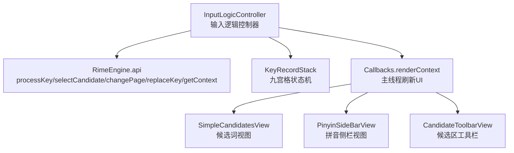
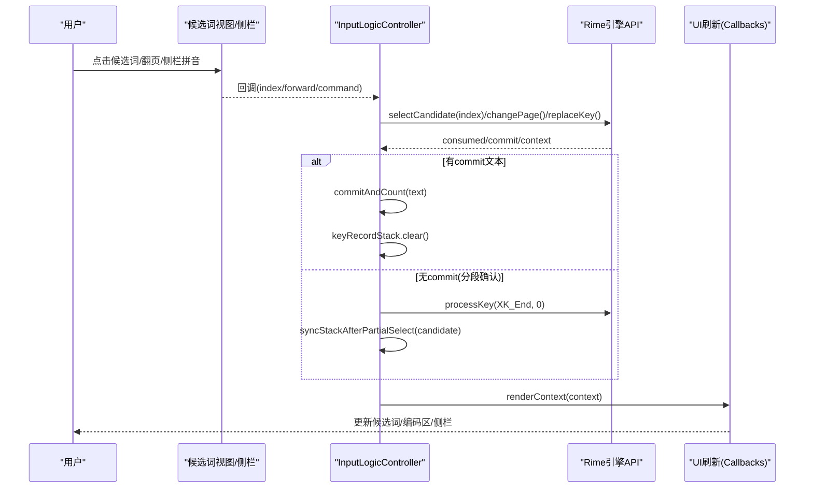
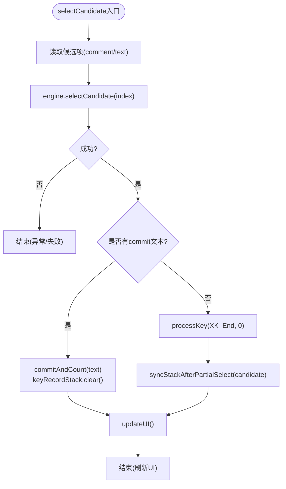
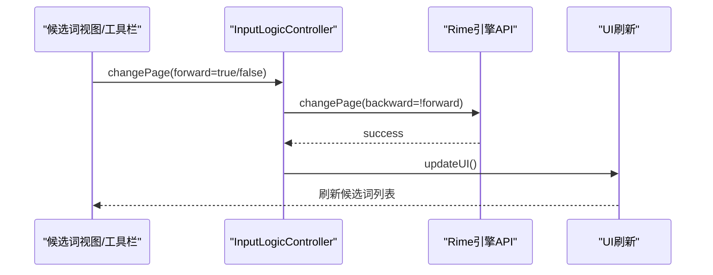
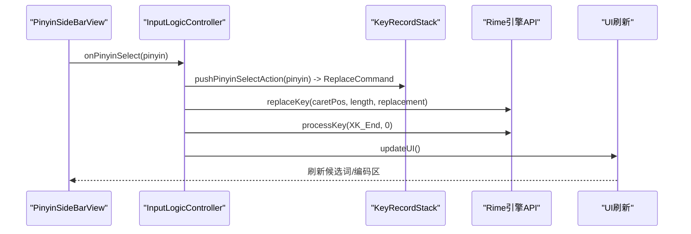
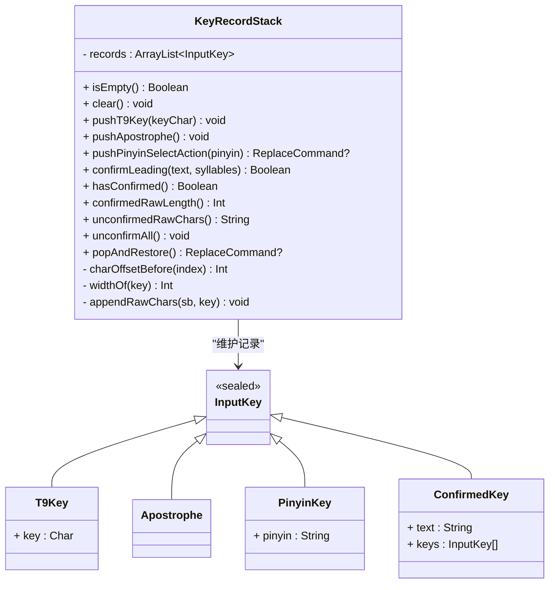
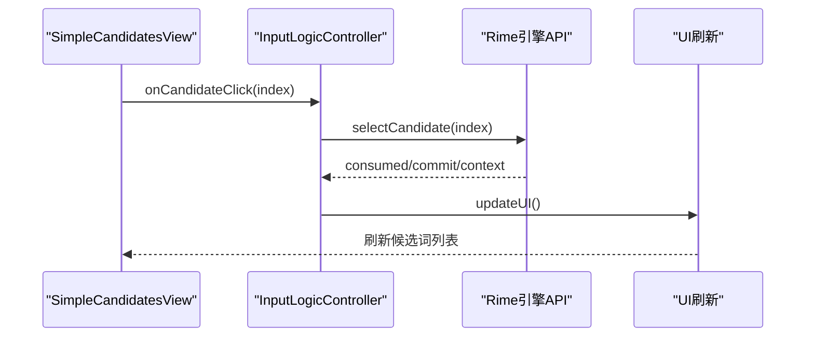
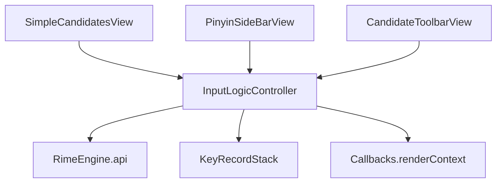

# 候选词管理

<cite>
**本文引用的文件**   
- [InputLogicController.kt](file://app/src/main/java/com/ziyou/ime/ime/InputLogicController.kt)
- [KeyRecordStack.kt](file://core-logic/src/main/java/com/ziyou/ime/core/t9/KeyRecordStack.kt)
- [PinyinSideBarView.kt](file://app/src/main/java/com/ziyou/ime/ime/PinyinSideBarView.kt)
- [SimpleCandidatesView.kt](file://app/src/main/java/com/ziyou/ime/ime/SimpleCandidatesView.kt)
- [CandidateToolbarView.kt](file://app/src/main/java/com/ziyou/ime/ime/CandidateToolbarView.kt)
</cite>

## 目录
1. [简介](#简介)
2. [项目结构](#项目结构)
3. [核心组件](#核心组件)
4. [架构总览](#架构总览)
5. [详细组件分析](#详细组件分析)
6. [依赖关系分析](#依赖关系分析)
7. [性能考量](#性能考量)
8. [故障排查指南](#故障排查指南)
9. [结论](#结论)
10. [附录](#附录)

## 简介
本技术文档聚焦输入法候选词管理子系统，围绕以下关键点展开：
- selectCandidate 选词逻辑：分段确认机制、九宫格状态机同步、End 键补发处理。
- 选词后 commit 文本处理流程：keyRecordStack 清理、UI 更新时机。
- changePage 翻页功能：forward/backward 参数与 UI 刷新。
- selectPinyin 拼音侧栏选词：ReplaceCommand 使用、replaceKey API 调用、光标定位与候选重组。
- 时序图与状态转换图：展示与 Rime 引擎交互细节及关键路径。

## 项目结构
候选词管理涉及输入逻辑控制器、九宫格状态机、候选词视图与拼音侧栏视图等模块。整体职责划分如下：
- InputLogicController：输入事务串行化、按键处理、选词/翻页/拼音替换、commit 上屏与 UI 刷新。
- KeyRecordStack：九宫格状态机，维护 T9 键序列、已锁定拼音、已确认段，提供 ReplaceCommand 生成与偏移计算。
- SimpleCandidatesView：候选词水平滚动显示、点击选择与翻页手势。
- PinyinSideBarView：左侧竖排拼音/符号列表，点击回调上层进行编码替换或直接上屏。
- CandidateToolbarView：候选区工具按钮（如翻页），通过自定义 KeyCode 向上路由。

**图示来源** 
- [InputLogicController.kt:126-185](file://app/src/main/java/com/ziyou/ime/ime/InputLogicController.kt#L126-L185)
- [InputLogicController.kt:195-227](file://app/src/main/java/com/ziyou/ime/ime/InputLogicController.kt#L195-L227)
- [InputLogicController.kt:248-262](file://app/src/main/java/com/ziyou/ime/ime/InputLogicController.kt#L248-L262)
- [InputLogicController.kt:273-289](file://app/src/main/java/com/ziyou/ime/ime/InputLogicController.kt#L273-L289)
- [KeyRecordStack.kt:57-83](file://core-logic/src/main/java/com/ziyou/ime/core/t9/KeyRecordStack.kt#L57-L83)
- [SimpleCandidatesView.kt:202-214](file://app/src/main/java/com/ziyou/ime/ime/SimpleCandidatesView.kt#L202-L214)
- [PinyinSideBarView.kt:215-227](file://app/src/main/java/com/ziyou/ime/ime/PinyinSideBarView.kt#L215-L227)
- [CandidateToolbarView.kt:336-344](file://app/src/main/java/com/ziyou/ime/ime/CandidateToolbarView.kt#L336-L344)

**章节来源**
- [InputLogicController.kt:126-185](file://app/src/main/java/com/ziyou/ime/ime/InputLogicController.kt#L126-L185)
- [KeyRecordStack.kt:20-310](file://core-logic/src/main/java/com/ziyou/ime/core/t9/KeyRecordStack.kt#L20-L310)
- [SimpleCandidatesView.kt:19-296](file://app/src/main/java/com/ziyou/ime/ime/SimpleCandidatesView.kt#L19-L296)
- [PinyinSideBarView.kt:21-397](file://app/src/main/java/com/ziyou/ime/ime/PinyinSideBarView.kt#L21-L397)
- [CandidateToolbarView.kt:29-642](file://app/src/main/java/com/ziyou/ime/ime/CandidateToolbarView.kt#L29-L642)

## 核心组件
- InputLogicController：负责按键处理、选词、翻页、拼音替换、commit 上屏与 UI 刷新；内部以 Mutex 保证一次输入操作的原子性。
- KeyRecordStack：维护九宫格输入状态，支持 pushT9Key/pushApostrophe/pushPinyinSelectAction/popAndRestore/confirmLeading/unconfirmAll 等操作，并计算字符偏移。
- SimpleCandidatesView：渲染候选词列表，响应点击与滑动翻页，支持预测模式高亮。
- PinyinSideBarView：渲染拼音或符号列表，点击回调上层进行编码替换或直接上屏。
- CandidateToolbarView：渲染工具栏按钮，将点击事件转换为 KeyCode 由 Service 统一路由。

**章节来源**
- [InputLogicController.kt:43-86](file://app/src/main/java/com/ziyou/ime/ime/InputLogicController.kt#L43-L86)
- [KeyRecordStack.kt:20-310](file://core-logic/src/main/java/com/ziyou/ime/core/t9/KeyRecordStack.kt#L20-L310)
- [SimpleCandidatesView.kt:31-110](file://app/src/main/java/com/ziyou/ime/ime/SimpleCandidatesView.kt#L31-L110)
- [PinyinSideBarView.kt:43-100](file://app/src/main/java/com/ziyou/ime/ime/PinyinSideBarView.kt#L43-L100)
- [CandidateToolbarView.kt:60-120](file://app/src/main/java/com/ziyou/ime/ime/CandidateToolbarView.kt#L60-L120)

## 架构总览
下图展示了候选词管理的端到端交互：用户操作触发 View 回调，进入 InputLogicController，再与 Rime 引擎交互，最后在主线程刷新 UI。

**图示来源** 
- [InputLogicController.kt:195-227](file://app/src/main/java/com/ziyou/ime/ime/InputLogicController.kt#L195-L227)
- [InputLogicController.kt:248-262](file://app/src/main/java/com/ziyou/ime/ime/InputLogicController.kt#L248-L262)
- [InputLogicController.kt:273-289](file://app/src/main/java/com/ziyou/ime/ime/InputLogicController.kt#L273-L289)
- [InputLogicController.kt:518-528](file://app/src/main/java/com/ziyou/ime/ime/InputLogicController.kt#L518-L528)

## 详细组件分析

### selectCandidate 选词逻辑
- 分段确认机制：当所选候选仅覆盖编码前缀时，引擎不返回 commit，但内部已确认该段（preedit 变为“你hao”）。此时需把所选候选的注音音节同步进九宫格状态机（confirmLeading），否则后续侧栏选拼音的替换偏移会错位；同步失败则整栈 clear 降级。
- End 键补发处理：分段确认后补发 XK_End，使 Navigator 消费后调用 BeginEditing 给已选段打上标记，避免首个退格走 ReopenPreviousSelection 导致行为错位。
- 九宫格状态机同步：按所选候选的 comment 解析音节，合并栈头为确认段；若注释缺失或不匹配，则清栈降级。
- 提交与 UI 更新：若有 commit 文本，直接上屏并清空 keyRecordStack；随后 updateUI 获取最新 context 并在主线程刷新 UI。

**图示来源** 
- [InputLogicController.kt:195-227](file://app/src/main/java/com/ziyou/ime/ime/InputLogicController.kt#L195-L227)
- [InputLogicController.kt:233-245](file://app/src/main/java/com/ziyou/ime/ime/InputLogicController.kt#L233-L245)
- [InputLogicController.kt:518-528](file://app/src/main/java/com/ziyou/ime/ime/InputLogicController.kt#L518-L528)

**章节来源**
- [InputLogicController.kt:195-227](file://app/src/main/java/com/ziyou/ime/ime/InputLogicController.kt#L195-L227)
- [InputLogicController.kt:233-245](file://app/src/main/java/com/ziyou/ime/ime/InputLogicController.kt#L233-L245)

### changePage 翻页功能
- forward/backward 参数处理：changePage(backward = !forward)，true=下一页，false=上一页。
- UI 刷新：成功后调用 updateUI 获取最新上下文并刷新 UI。

**图示来源** 
- [InputLogicController.kt:248-262](file://app/src/main/java/com/ziyou/ime/ime/InputLogicController.kt#L248-L262)
- [InputLogicController.kt:518-528](file://app/src/main/java/com/ziyou/ime/ime/InputLogicController.kt#L518-L528)

**章节来源**
- [InputLogicController.kt:248-262](file://app/src/main/java/com/ziyou/ime/ime/InputLogicController.kt#L248-L262)

### selectPinyin 拼音侧栏选词
- ReplaceCommand 使用：由 KeyRecordStack.pushPinyinSelectAction(pinyin) 生成命令，包含 caretPos、length、replacement（含分词符）。
- replaceKey API 调用：用选定拼音替换编码中对应的 T9 键序列（含末尾分词符），锁定该音节。
- 光标定位与候选重组：replaceKey 会把光标停在已锁定拼音之后，需发送 XK_End 将光标移到编码串末尾，令 Rime 组织完整组合候选。
- UI 刷新：完成后调用 updateUI 刷新候选词与编码区。

**图示来源** 
- [InputLogicController.kt:273-289](file://app/src/main/java/com/ziyou/ime/ime/InputLogicController.kt#L273-L289)
- [KeyRecordStack.kt:57-83](file://core-logic/src/main/java/com/ziyou/ime/core/t9/KeyRecordStack.kt#L57-L83)
- [InputLogicController.kt:518-528](file://app/src/main/java/com/ziyou/ime/ime/InputLogicController.kt#L518-L528)

**章节来源**
- [InputLogicController.kt:273-289](file://app/src/main/java/com/ziyou/ime/ime/InputLogicController.kt#L273-L289)
- [KeyRecordStack.kt:57-83](file://core-logic/src/main/java/com/ziyou/ime/core/t9/KeyRecordStack.kt#L57-L83)

### 九宫格状态机 KeyRecordStack
- 数据结构：records 列表维护 InputKey（T9Key/Apostrophe/PinyinKey/ConfirmedKey），顺序与 Rime 编码串逻辑顺序一致。
- 关键方法：
  - pushT9Key/pushApostrophe：追加数字键与分词符。
  - pushPinyinSelectAction：定位首个未确定音节，校验前缀，原地替换为 PinyinKey，生成 ReplaceCommand。
  - confirmLeading：部分选词后合并栈头为 ConfirmedKey，保持原始编码串不变，确保偏移正确。
  - popAndRestore：智能回退，解锁拼音还原为 T9 段或弹出数字/分词符；遇到 ConfirmedKey 先展开再处理。
  - unconfirmAll：展开全部确认段，与 replaceKey 清空已确认段的语义保持一致。
- 偏移计算：charOffsetBefore 累加 widthOf，确保 ReplaceCommand 的位置准确。

**图示来源** 
- [KeyRecordStack.kt:20-310](file://core-logic/src/main/java/com/ziyou/ime/core/t9/KeyRecordStack.kt#L20-L310)

**章节来源**
- [KeyRecordStack.kt:20-310](file://core-logic/src/main/java/com/ziyou/ime/core/t9/KeyRecordStack.kt#L20-L310)

### 候选词视图与侧栏视图
- SimpleCandidatesView：渲染候选词，支持点击选择与滑动翻页；预测模式下整栏强调色绘制。
- PinyinSideBarView：渲染拼音或符号列表，点击回调上层进行编码替换或直接上屏；底部固定“符号”键切换符号键盘。
- CandidateToolbarView：渲染工具栏按钮，将点击事件转换为 KeyCode 由 Service 统一路由。

**图示来源** 
- [SimpleCandidatesView.kt:202-214](file://app/src/main/java/com/ziyou/ime/ime/SimpleCandidatesView.kt#L202-L214)
- [InputLogicController.kt:195-227](file://app/src/main/java/com/ziyou/ime/ime/InputLogicController.kt#L195-L227)
- [InputLogicController.kt:518-528](file://app/src/main/java/com/ziyou/ime/ime/InputLogicController.kt#L518-L528)

**章节来源**
- [SimpleCandidatesView.kt:19-296](file://app/src/main/java/com/ziyou/ime/ime/SimpleCandidatesView.kt#L19-L296)
- [PinyinSideBarView.kt:21-397](file://app/src/main/java/com/ziyou/ime/ime/PinyinSideBarView.kt#L21-L397)
- [CandidateToolbarView.kt:29-642](file://app/src/main/java/com/ziyou/ime/ime/CandidateToolbarView.kt#L29-L642)

## 依赖关系分析
- InputLogicController 依赖 RimeEngine.api 完成按键处理、选词、翻页、替换与上下文获取。
- InputLogicController 依赖 KeyRecordStack 维护九宫格状态，生成 ReplaceCommand 并同步状态。
- InputLogicController 依赖 Callbacks.renderContext 在主线程刷新 UI。
- UI 层（SimpleCandidatesView、PinyinSideBarView、CandidateToolbarView）通过回调与 InputLogicController 交互。

**图示来源** 
- [InputLogicController.kt:43-86](file://app/src/main/java/com/ziyou/ime/ime/InputLogicController.kt#L43-L86)
- [InputLogicController.kt:126-185](file://app/src/main/java/com/ziyou/ime/ime/InputLogicController.kt#L126-L185)
- [KeyRecordStack.kt:20-310](file://core-logic/src/main/java/com/ziyou/ime/core/t9/KeyRecordStack.kt#L20-L310)

**章节来源**
- [InputLogicController.kt:43-86](file://app/src/main/java/com/ziyou/ime/ime/InputLogicController.kt#L43-L86)
- [InputLogicController.kt:126-185](file://app/src/main/java/com/ziyou/ime/ime/InputLogicController.kt#L126-L185)
- [KeyRecordStack.kt:20-310](file://core-logic/src/main/java/com/ziyou/ime/core/t9/KeyRecordStack.kt#L20-L310)

## 性能考量
- 慢按键告警：processKeyBulk 耗时超过阈值（默认 100ms）打 Log.w，便于发现退化。
- 编码长度上限：MAX_INPUT_LENGTH=30，超长编码丢弃新增键，避免组句搜索爆炸。
- 事务串行化：Mutex 保证一次输入操作原子执行，防止快速连击导致的 commit/context 错配。
- 批量调用：processKeyBulk 减少主线程↔Rime 线程往返与 JNI 跨界次数。

**章节来源**
- [InputLogicController.kt:54-64](file://app/src/main/java/com/ziyou/ime/ime/InputLogicController.kt#L54-L64)
- [InputLogicController.kt:126-185](file://app/src/main/java/com/ziyou/ime/ime/InputLogicController.kt#L126-L185)

## 故障排查指南
- 分段确认同步失败：log 提示“分段确认同步失败，清栈降级”，检查 candidate.comment 是否为空或音节不匹配。
- 慢按键告警：关注 processKeyBulk 耗时日志，检查编码长度与引擎负载。
- 编码超限：log 提示“编码长度达上限，丢弃编码键”，检查输入长度是否超过 MAX_INPUT_LENGTH。
- 替换失败：check ReplaceCommand 的 caretPos/length/replacement 是否正确，确保 pushPinyinSelectAction 成功。

**章节来源**
- [InputLogicController.kt:233-245](file://app/src/main/java/com/ziyou/ime/ime/InputLogicController.kt#L233-L245)
- [InputLogicController.kt:140-146](file://app/src/main/java/com/ziyou/ime/ime/InputLogicController.kt#L140-L146)
- [InputLogicController.kt:131-138](file://app/src/main/java/com/ziyou/ime/ime/InputLogicController.kt#L131-L138)
- [KeyRecordStack.kt:57-83](file://core-logic/src/main/java/com/ziyou/ime/core/t9/KeyRecordStack.kt#L57-L83)

## 结论
候选词管理子系统通过 InputLogicController 协调 Rime 引擎与 UI 层，结合 KeyRecordStack 的状态机实现九宫格输入与拼音侧栏选词的精准控制。分段确认机制、End 键补发、ReplaceCommand 与 replaceKey 的组合确保了候选重组与光标定位的正确性。性能优化与事务串行化保障了输入流畅性与一致性。

## 附录
- 术语说明：
  - 分段确认：仅覆盖编码前缀的选词，引擎内部确认该段但不返回 commit。
  - 九宫格状态机：KeyRecordStack 维护 T9 键序列、已锁定拼音与已确认段。
  - ReplaceCommand：描述编码替换指令（位置、长度、替换内容）。
  - 预测模式：librime-predict 在 commit 后产生的联想候选，以强调色显示。