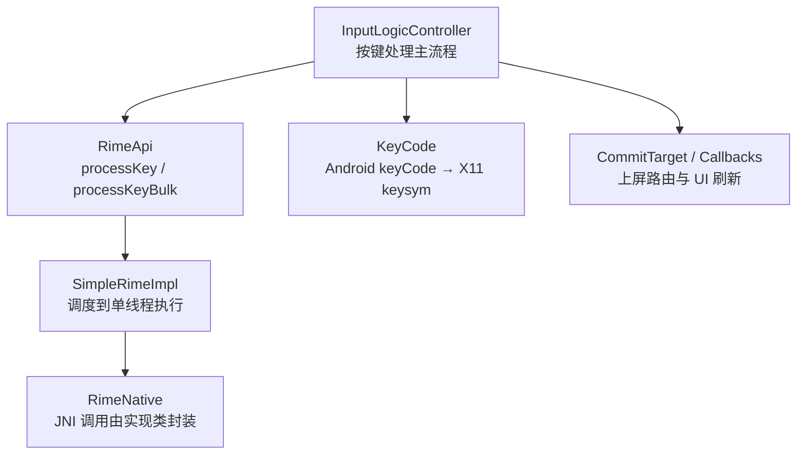
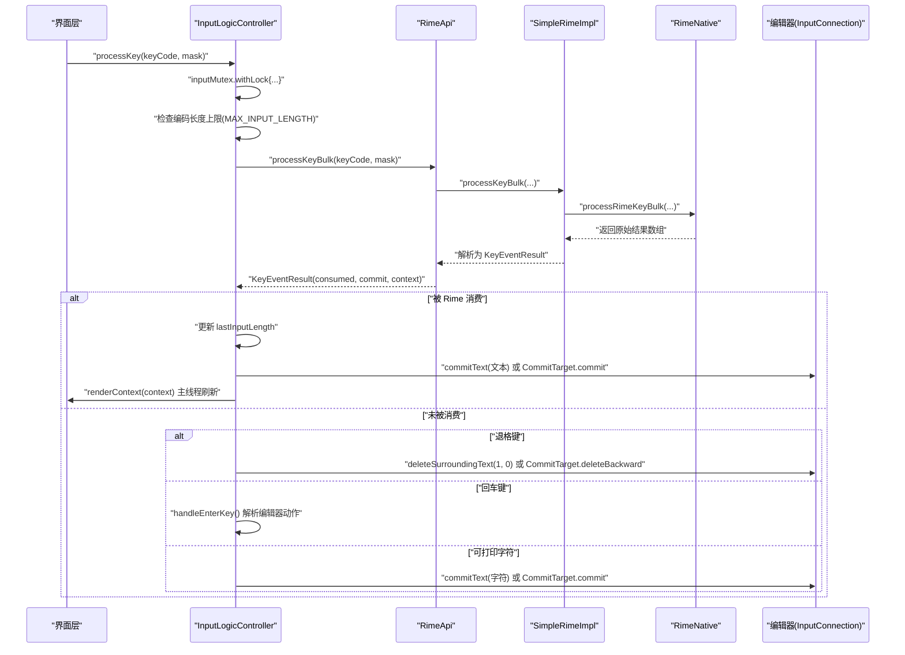
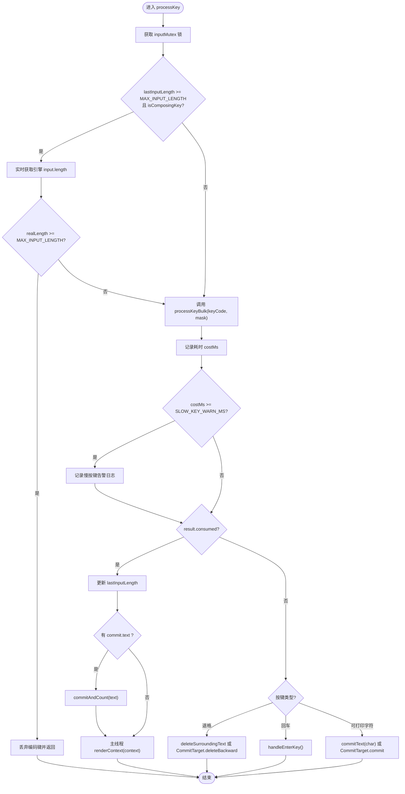
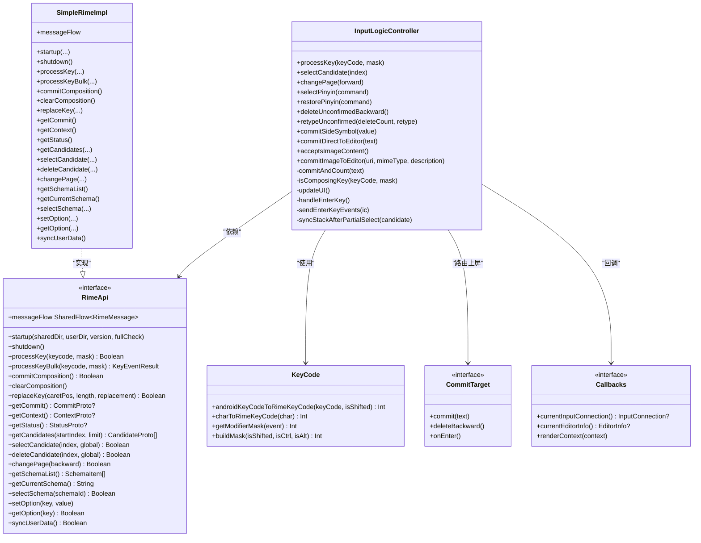

# 按键处理逻辑

<cite>
**本文引用的文件**   
- [InputLogicController.kt](file://app/src/main/java/com/ziyou/ime/ime/InputLogicController.kt)
- [RimeApi.kt](file://app/src/main/java/com/ziyou/ime/core/RimeApi.kt)
- [SimpleRimeImpl.kt](file://app/src/main/java/com/ziyou/ime/core/SimpleRimeImpl.kt)
- [KeyCode.kt](file://app/src/main/java/com/ziyou/ime/ime/KeyCode.kt)
- [EnterKeyBehaviorTest.kt](file://app/src/test/java/com/ziyou/ime/ime/EnterKeyBehaviorTest.kt)
- [InputLogicControllerTest.kt](file://app/src/test/java/com/ziyou/ime/ime/InputLogicControllerTest.kt)
</cite>

## 目录
1. [简介](#简介)
2. [项目结构](#项目结构)
3. [核心组件](#核心组件)
4. [架构总览](#架构总览)
5. [详细组件分析](#详细组件分析)
6. [依赖关系分析](#依赖关系分析)
7. [性能考量](#性能考量)
8. [故障排查指南](#故障排查指南)
9. [结论](#结论)
10. [附录](#附录)

## 简介
本技术文档聚焦输入法按键处理的核心流程，围绕 InputLogicController 的 processKey 方法展开，系统阐述：
- 编码超限防护机制（MAX_INPUT_LENGTH）
- 批量处理优化（processKeyBulk）
- 按键消费判断与分支策略（退格、回车、可打印字符）
- 与 Rime 引擎的交互模式（上下文同步、commit 文本获取、UI 刷新）
- 原子性保证（Mutex）与慢按键告警
- 关键流程图与代码片段路径，便于快速定位实现细节

## 项目结构
按键处理相关的关键代码集中在以下模块：
- 输入逻辑控制器：InputLogicController.kt
- Rime 引擎接口与实现：RimeApi.kt、SimpleRimeImpl.kt
- 按键码映射：KeyCode.kt
- 回车键语义测试：EnterKeyBehaviorTest.kt
- 按键处理行为测试：InputLogicControllerTest.kt

**图表来源** 
- [InputLogicController.kt:126-185](file://app/src/main/java/com/ziyou/ime/ime/InputLogicController.kt#L126-L185)
- [RimeApi.kt:29-40](file://app/src/main/java/com/ziyou/ime/core/RimeApi.kt#L29-L40)
- [SimpleRimeImpl.kt:53-64](file://app/src/main/java/com/ziyou/ime/core/SimpleRimeImpl.kt#L53-L64)
- [KeyCode.kt:122-202](file://app/src/main/java/com/ziyou/ime/ime/KeyCode.kt#L122-L202)

**章节来源**
- [InputLogicController.kt:1-531](file://app/src/main/java/com/ziyou/ime/ime/InputLogicController.kt#L1-L531)
- [RimeApi.kt:1-105](file://app/src/main/java/com/ziyou/ime/core/RimeApi.kt#L1-L105)
- [SimpleRimeImpl.kt:1-177](file://app/src/main/java/com/ziyou/ime/core/SimpleRimeImpl.kt#L1-L177)
- [KeyCode.kt:1-244](file://app/src/main/java/com/ziyou/ime/ime/KeyCode.kt#L1-L244)

## 核心组件
- InputLogicController：输入逻辑控制器，负责按键串行化、超限防护、批量处理、commit 上屏、UI 刷新与多种按键分支处理。
- RimeApi：Rime 引擎抽象接口，定义 processKey、processKeyBulk、getCommit、getContext 等能力。
- SimpleRimeImpl：RimeApi 的具体实现，通过 RimeDispatcher 将操作调度到单线程执行，并桥接到 JNI。
- KeyCode：Android KeyEvent 到 Rime X11 keysym 的转换工具。
- CommitTarget / Callbacks：上屏目标抽象与回调接口，支持技能面板或宿主编辑器的差异化路由与渲染。

**章节来源**
- [InputLogicController.kt:43-118](file://app/src/main/java/com/ziyou/ime/ime/InputLogicController.kt#L43-L118)
- [RimeApi.kt:10-40](file://app/src/main/java/com/ziyou/ime/core/RimeApi.kt#L10-L40)
- [SimpleRimeImpl.kt:10-64](file://app/src/main/java/com/ziyou/ime/core/SimpleRimeImpl.kt#L10-L64)
- [KeyCode.kt:13-202](file://app/src/main/java/com/ziyou/ime/ime/KeyCode.kt#L13-L202)

## 架构总览
按键处理的端到端流程如下：
- 上层触发 InputLogicController.processKey(keyCode, mask)
- 在 inputMutex 保护下执行：
  - 编码超限防护（MAX_INPUT_LENGTH）
  - 调用 RimeApi.processKeyBulk 进行批量处理（减少线程往返与 JNI 跨界）
  - 若被 Rime 消费：取 commit 文本上屏（经 CommitTarget 路由），更新 lastInputLength，主线程刷新 UI
  - 若未消费：按分支处理退格、回车、可打印字符
- UI 刷新通过 callbacks.renderContext(context) 在主线程完成

**图表来源** 
- [InputLogicController.kt:126-185](file://app/src/main/java/com/ziyou/ime/ime/InputLogicController.kt#L126-L185)
- [RimeApi.kt:32-40](file://app/src/main/java/com/ziyou/ime/core/RimeApi.kt#L32-L40)
- [SimpleRimeImpl.kt:59-64](file://app/src/main/java/com/ziyou/ime/core/SimpleRimeImpl.kt#L59-L64)

**章节来源**
- [InputLogicController.kt:126-185](file://app/src/main/java/com/ziyou/ime/ime/InputLogicController.kt#L126-L185)
- [RimeApi.kt:29-40](file://app/src/main/java/com/ziyou/ime/core/RimeApi.kt#L29-L40)
- [SimpleRimeImpl.kt:53-64](file://app/src/main/java/com/ziyou/ime/core/SimpleRimeImpl.kt#L53-L64)

## 详细组件分析

### InputLogicController.processKey 核心流程
- 串行化与异常容错：使用 inputMutex 保证一次按键的「processKey→getCommit→getContext」整体原子执行；异常捕获避免崩溃。
- 编码超限防护：当 lastInputLength >= MAX_INPUT_LENGTH 且当前键为会追加编码的键时，实时确认引擎 input 长度，超过则丢弃该编码键（退格/回车/空格等功能键不受限）。
- 批量处理优化：调用 processKeyBulk 合并 processKey + getCommit + getContext，减少线程往返与 JNI 跨界次数。
- 慢按键告警：统计耗时，超过阈值（SLOW_KEY_WARN_MS）记录警告日志，附带编码长度信息。
- 消费分支：
  - 被 Rime 消费：更新 lastInputLength，若有 commit 文本则上屏（经 CommitTarget 或 InputConnection），主线程刷新 UI。
  - 未被消费：
    - 退格键：直接删除目标（编辑器或 CommitTarget）中的字符。
    - 回车键：按编辑器语义落地（搜索/发送/前往等），多行或无动作时补发 ENTER 按键事件。
    - 可打印字符：直接提交字符（ASCII 范围且无修饰键）。

**图表来源** 
- [InputLogicController.kt:126-185](file://app/src/main/java/com/ziyou/ime/ime/InputLogicController.kt#L126-L185)

**章节来源**
- [InputLogicController.kt:126-185](file://app/src/main/java/com/ziyou/ime/ime/InputLogicController.kt#L126-L185)

### 编码超限防护机制（MAX_INPUT_LENGTH）
- 目的：防止 T9 混合数字编码过长导致 script_translator 组句搜索组合爆炸，造成按键积压与卡顿。
- 策略：缓存 lastInputLength 作为预判；命中上限时对编码键进行实时确认（读取引擎 input.length），真实超限则丢弃该键。
- 例外：退格、回车、空格等功能键不受限，直接送引擎处理。
- 副作用：旁路（选词/清编码）可能使缓存过期，但拒键前必经实时确认，确保准确性。

**章节来源**
- [InputLogicController.kt:54-64](file://app/src/main/java/com/ziyou/ime/ime/InputLogicController.kt#L54-L64)
- [InputLogicController.kt:128-138](file://app/src/main/java/com/ziyou/ime/ime/InputLogicController.kt#L128-L138)
- [InputLogicControllerTest.kt:408-460](file://app/src/test/java/com/ziyou/ime/ime/InputLogicControllerTest.kt#L408-L460)

### 批量处理优化（processKeyBulk）
- 设计：将 processKey + getCommit + getContext 合并为单次引擎调度，减少主线程↔Rime 线程往返与 JNI 跨界次数。
- 默认实现：RimeApi 的默认实现按三次调用组合（便于 fake/测试），生产实现通过 SimpleRimeImpl 单次 JNI 调用。
- 收益：热路径显著降低延迟，提升连打体验。

**章节来源**
- [RimeApi.kt:32-40](file://app/src/main/java/com/ziyou/ime/core/RimeApi.kt#L32-L40)
- [SimpleRimeImpl.kt:59-64](file://app/src/main/java/com/ziyou/ime/core/SimpleRimeImpl.kt#L59-L64)
- [InputLogicController.kt:140-146](file://app/src/main/java/com/ziyou/ime/ime/InputLogicController.kt#L140-L146)

### 按键消费判断与分支策略
- 被 Rime 消费：
  - 取 commit 文本上屏（经 CommitTarget 或 InputConnection）
  - 更新 lastInputLength
  - 主线程刷新 UI（renderContext）
- 未被消费：
  - 退格键：直接删除目标字符（编辑器或 CommitTarget）
  - 回车键：按编辑器语义落地（performEditorAction 或补发 ENTER 按键事件）
  - 可打印字符：直接提交字符（ASCII 范围且无修饰键）

**章节来源**
- [InputLogicController.kt:148-181](file://app/src/main/java/com/ziyou/ime/ime/InputLogicController.kt#L148-L181)
- [InputLogicControllerTest.kt:136-257](file://app/src/test/java/com/ziyou/ime/ime/InputLogicControllerTest.kt#L136-L257)

### 与 Rime 引擎的交互模式
- 上下文状态同步：updateUI 中获取最新 ContextProto，更新 lastInputLength，并在主线程渲染候选词、编码区与拼音侧栏。
- commit 文本获取：被消费时从 result.commit 取文本上屏；分段确认场景无 commit，需补发 End 以维护编辑标记。
- UI 刷新流程：callbacks.renderContext(context) 在主线程执行，确保候选词与编码区同步显示。

**章节来源**
- [InputLogicController.kt:518-528](file://app/src/main/java/com/ziyou/ime/ime/InputLogicController.kt#L518-L528)
- [InputLogicController.kt:204-221](file://app/src/main/java/com/ziyou/ime/ime/InputLogicController.kt#L204-L221)

### Mutex 锁保证的原子性操作
- inputMutex 保证一次按键的完整流程（processKey→getCommit→getContext）原子执行，避免快速连击导致的 commit/context 与按键错配。
- Kotlin Mutex 公平排队，天然保持按键先后顺序。

**章节来源**
- [InputLogicController.kt:67-74](file://app/src/main/java/com/ziyou/ime/ime/InputLogicController.kt#L67-L74)
- [InputLogicControllerTest.kt:290-310](file://app/src/test/java/com/ziyou/ime/ime/InputLogicControllerTest.kt#L290-L310)

### 慢按键告警机制
- 阈值：SLOW_KEY_WARN_MS（默认 100ms）
- 触发：processKeyBulk 耗时超过阈值时记录警告日志，附带编码长度信息，便于发现耗时退化。

**章节来源**
- [InputLogicController.kt:54-56](file://app/src/main/java/com/ziyou/ime/ime/InputLogicController.kt#L54-L56)
- [InputLogicController.kt:140-146](file://app/src/main/java/com/ziyou/ime/ime/InputLogicController.kt#L140-L146)

### 回车键语义化处理
- 优先级：若存在 CommitTarget（如 AI 面板），路由给面板 onEnter；否则解析编辑器动作。
- 编辑器动作：声明了搜索/发送/前往等动作的单行输入框走 performEditorAction；多行或无动作的输入框补发一对 ENTER 按键事件（而非 commitText("\n")），使换行符插入与监听回车键的应用都能正确响应。

**章节来源**
- [InputLogicController.kt:383-396](file://app/src/main/java/com/ziyou/ime/ime/InputLogicController.kt#L383-L396)
- [EnterKeyBehaviorTest.kt:1-100](file://app/src/test/java/com/ziyou/ime/ime/EnterKeyBehaviorTest.kt#L1-L100)

### 可打印字符的直接上屏
- 条件：keyCode 在 ASCII 可打印范围（0x20..0x7E）且 mask 为 0（无修饰键）
- 行为：直接提交字符（经 CommitTarget 或 InputConnection），并回调 commitListeners 计分（仅传递脱敏码点数）

**章节来源**
- [InputLogicController.kt:176-179](file://app/src/main/java/com/ziyou/ime/ime/InputLogicController.kt#L176-L179)
- [InputLogicControllerTest.kt:225-257](file://app/src/test/java/com/ziyou/ime/ime/InputLogicControllerTest.kt#L225-L257)

### 退格键的直接删除
- 行为：Rime 无编码可删时，直接删除目标（编辑器或 CommitTarget）中的字符。
- 差异：若存在 CommitTarget，调用 deleteBackward；否则调用 InputConnection.deleteSurroundingText(1, 0)。

**章节来源**
- [InputLogicController.kt:165-172](file://app/src/main/java/com/ziyou/ime/ime/InputLogicController.kt#L165-L172)
- [InputLogicControllerTest.kt:138-161](file://app/src/test/java/com/ziyou/ime/ime/InputLogicControllerTest.kt#L138-L161)

## 依赖关系分析
InputLogicController 依赖 RimeApi 进行引擎交互，SimpleRimeImpl 提供具体实现并通过 RimeDispatcher 调度到单线程执行。KeyCode 提供 Android keyCode 到 X11 keysym 的转换。CommitTarget 与 Callbacks 提供上屏路由与 UI 刷新能力。

**图表来源** 
- [InputLogicController.kt:43-118](file://app/src/main/java/com/ziyou/ime/ime/InputLogicController.kt#L43-L118)
- [RimeApi.kt:10-105](file://app/src/main/java/com/ziyou/ime/core/RimeApi.kt#L10-L105)
- [SimpleRimeImpl.kt:10-177](file://app/src/main/java/com/ziyou/ime/core/SimpleRimeImpl.kt#L10-L177)
- [KeyCode.kt:13-244](file://app/src/main/java/com/ziyou/ime/ime/KeyCode.kt#L13-L244)

**章节来源**
- [InputLogicController.kt:43-118](file://app/src/main/java/com/ziyou/ime/ime/InputLogicController.kt#L43-L118)
- [RimeApi.kt:10-105](file://app/src/main/java/com/ziyou/ime/core/RimeApi.kt#L10-L105)
- [SimpleRimeImpl.kt:10-177](file://app/src/main/java/com/ziyou/ime/core/SimpleRimeImpl.kt#L10-L177)
- [KeyCode.kt:13-244](file://app/src/main/java/com/ziyou/ime/ime/KeyCode.kt#L13-L244)

## 性能考量
- 批量处理（processKeyBulk）：减少线程往返与 JNI 跨界，显著提升热路径性能。
- 编码超限防护（MAX_INPUT_LENGTH）：防止长编码导致的组合爆炸与卡顿。
- 慢按键告警：监控耗时退化，及时发现问题。
- 串行化（inputMutex）：保证按键顺序与状态一致性，避免竞态条件。

[本节为通用指导，不直接分析具体文件]

## 故障排查指南
- 慢按键告警：检查 processKeyBulk 耗时日志，关注编码长度与按键类型。
- 编码超限误拒：确认 lastInputLength 缓存是否被旁路（选词/清编码）影响，实时确认逻辑应能纠正。
- 回车键行为异常：检查编辑器 Info（imeOptions/inputType）是否正确设置，多行输入框应补发 ENTER 事件。
- 退格键行为异常：确认是否存在 CommitTarget，以及 InputConnection.deleteSurroundingText 调用是否正确。
- 异常容错：processKey 内部捕获异常，避免崩溃，检查日志定位问题。

**章节来源**
- [InputLogicController.kt:140-146](file://app/src/main/java/com/ziyou/ime/ime/InputLogicController.kt#L140-L146)
- [InputLogicController.kt:182-184](file://app/src/main/java/com/ziyou/ime/ime/InputLogicController.kt#L182-L184)
- [InputLogicControllerTest.kt:279-288](file://app/src/test/java/com/ziyou/ime/ime/InputLogicControllerTest.kt#L279-L288)

## 结论
InputLogicController 的 processKey 方法通过编码超限防护、批量处理优化、按键消费判断与分支策略，以及与 Rime 引擎的高效交互，实现了高性能、高可靠性的按键处理流程。Mutex 锁保证原子性，慢按键告警机制帮助监控性能退化。整体设计兼顾用户体验与系统稳定性，适用于复杂输入法场景。

[本节为总结，不直接分析具体文件]

## 附录
- 关键代码片段路径：
  - 编码超限防护：[InputLogicController.kt:128-138](file://app/src/main/java/com/ziyou/ime/ime/InputLogicController.kt#L128-L138)
  - 批量处理优化：[RimeApi.kt:32-40](file://app/src/main/java/com/ziyou/ime/core/RimeApi.kt#L32-L40)
  - 按键消费判断：[InputLogicController.kt:148-181](file://app/src/main/java/com/ziyou/ime/ime/InputLogicController.kt#L148-L181)
  - 回车键语义化：[InputLogicController.kt:383-396](file://app/src/main/java/com/ziyou/ime/ime/InputLogicController.kt#L383-L396)
  - 可打印字符上屏：[InputLogicController.kt:176-179](file://app/src/main/java/com/ziyou/ime/ime/InputLogicController.kt#L176-L179)
  - 退格键删除：[InputLogicController.kt:165-172](file://app/src/main/java/com/ziyou/ime/ime/InputLogicController.kt#L165-L172)
  - Mutex 串行化：[InputLogicController.kt:67-74](file://app/src/main/java/com/ziyou/ime/ime/InputLogicController.kt#L67-L74)
  - 慢按键告警：[InputLogicController.kt:54-56](file://app/src/main/java/com/ziyou/ime/ime/InputLogicController.kt#L54-L56)

[本节为附录，不直接分析具体文件]