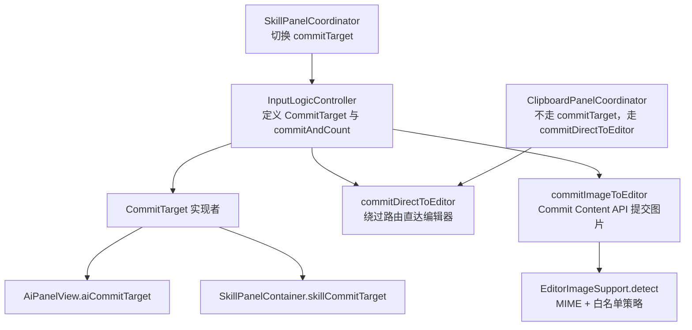
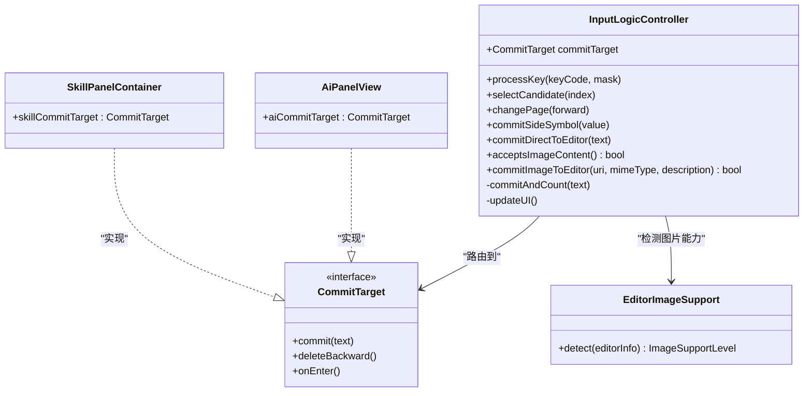
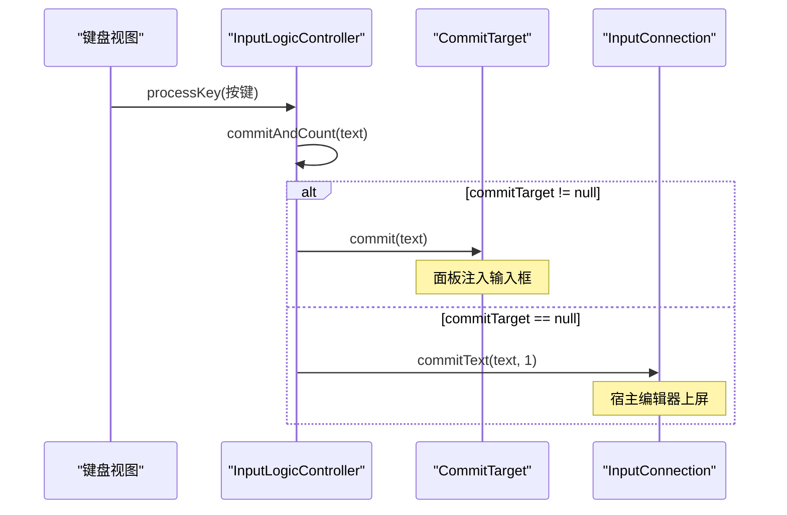
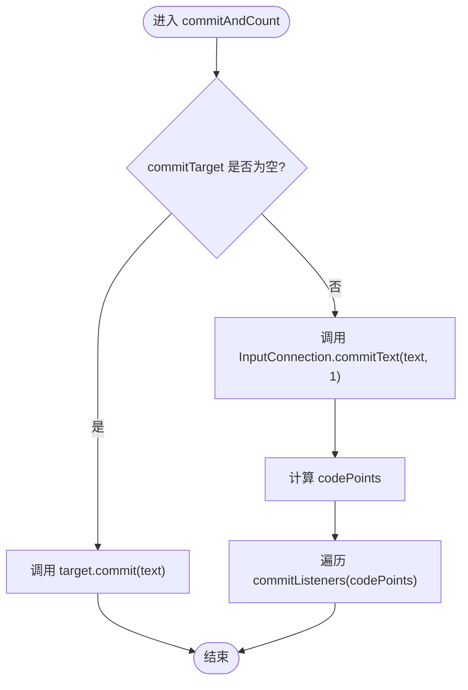
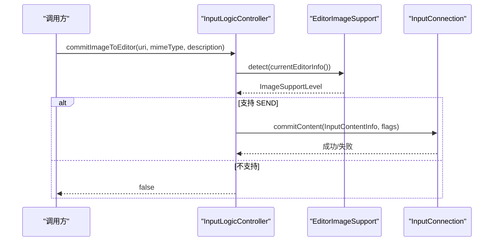
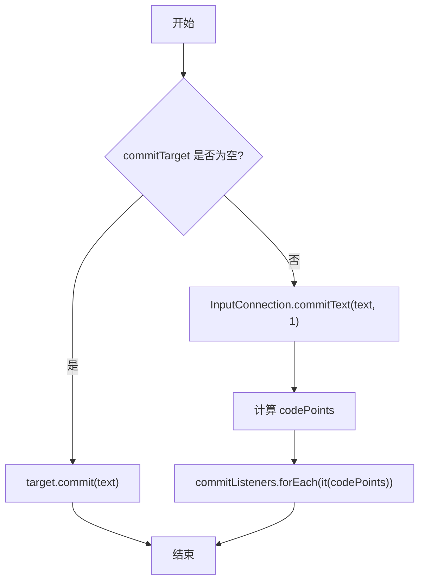
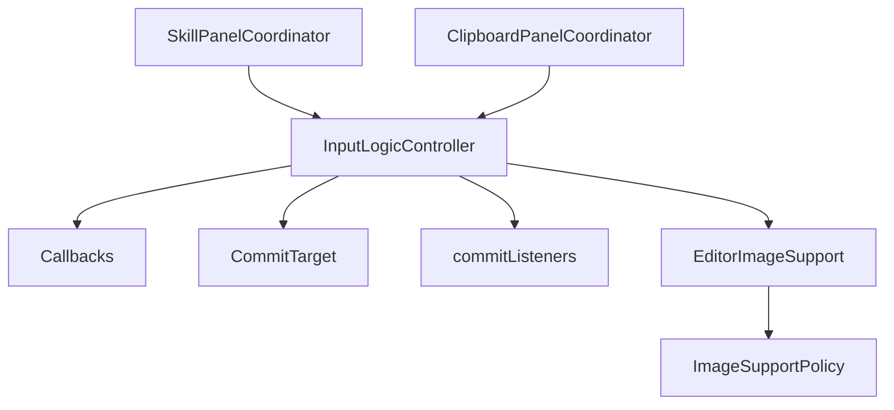

# 提交路由机制

<cite>
**本文引用的文件**   
- [InputLogicController.kt](file://app/src/main/java/com/ziyou/ime/ime/InputLogicController.kt)
- [EditorImageSupport.kt](file://app/src/main/java/com/ziyou/ime/ime/EditorImageSupport.kt)
- [AiPanelView.kt](file://app/src/main/java/com/ziyou/ime/ime/AiPanelView.kt)
- [SkillPanelContainer.kt](file://app/src/main/java/com/ziyou/ime/ime/SkillPanelContainer.kt)
- [SkillPanelCoordinator.kt](file://app/src/main/java/com/ziyou/ime/ime/SkillPanelCoordinator.kt)
- [ClipboardPanelCoordinator.kt](file://app/src/main/java/com/ziyou/ime/ime/ClipboardPanelCoordinator.kt)
- [ImageSupportPolicy.kt](file://core-logic/src/main/java/com/ziyou/ime/core/image/ImageSupportPolicy.kt)
- [ARCHITECTURE.md](file://ARCHITECTURE.md)
</cite>

## 目录
1. [简介](#简介)
2. [项目结构](#项目结构)
3. [核心组件](#核心组件)
4. [架构总览](#架构总览)
5. [详细组件分析](#详细组件分析)
6. [依赖关系分析](#依赖关系分析)
7. [性能考量](#性能考量)
8. [故障排查指南](#故障排查指南)
9. [结论](#结论)
10. [附录](#附录)

## 简介
本文件聚焦输入法“提交路由机制”的技术实现，围绕 CommitTarget 抽象、commitAndCount 统一上屏出口、commitDirectToEditor 直达编辑器、以及 commitImageToEditor 图片富媒体提交进行系统化说明。文档同时给出决策流程图与不同目标类型的处理差异对比，帮助读者快速理解面板与编辑器的统一输入路由设计。

## 项目结构
提交路由相关代码集中在 ime 包下的控制器与面板协调器中：
- InputLogicController：输入逻辑控制器，定义 CommitTarget 接口与统一上屏出口 commitAndCount，并提供 commitDirectToEditor、commitImageToEditor 等能力。
- EditorImageSupport：检测当前编辑器是否支持图片富媒体（基于 EditorInfo 的 MIME 声明与白名单策略）。
- AiPanelView / SkillPanelContainer / SkillPanelCoordinator / ClipboardPanelCoordinator：各面板通过实现 CommitTarget 或绕过路由直接提交到宿主编辑器，形成统一的输入路由体系。

图表来源
- [InputLogicController.kt:95-111](file://app/src/main/java/com/ziyou/ime/ime/InputLogicController.kt#L95-L111)
- [AiPanelView.kt:155-161](file://app/src/main/java/com/ziyou/ime/ime/AiPanelView.kt#L155-L161)
- [SkillPanelContainer.kt:100-108](file://app/src/main/java/com/ziyou/ime/ime/SkillPanelContainer.kt#L100-L108)
- [SkillPanelCoordinator.kt:149-152](file://app/src/main/java/com/ziyou/ime/ime/SkillPanelCoordinator.kt#L149-L152)
- [EditorImageSupport.kt:21-30](file://app/src/main/java/com/ziyou/ime/ime/EditorImageSupport.kt#L21-L30)

章节来源
- [InputLogicController.kt:95-111](file://app/src/main/java/com/ziyou/ime/ime/InputLogicController.kt#L95-L111)
- [SkillPanelCoordinator.kt:149-152](file://app/src/main/java/com/ziyou/ime/ime/SkillPanelCoordinator.kt#L149-L152)
- [AiPanelView.kt:155-161](file://app/src/main/java/com/ziyou/ime/ime/AiPanelView.kt#L155-L161)
- [SkillPanelContainer.kt:100-108](file://app/src/main/java/com/ziyou/ime/ime/SkillPanelContainer.kt#L100-L108)
- [EditorImageSupport.kt:21-30](file://app/src/main/java/com/ziyou/ime/ime/EditorImageSupport.kt#L21-L30)

## 核心组件
- CommitTarget 接口：统一抽象“文本上屏目标”，默认指向宿主编辑器；当技能/AI 面板申请焦点后，可切换为面板目标，使键盘输入注入面板输入框，Rime 引擎与候选链路不变。
- commitAndCount：统一上屏出口，根据 commitTarget 判断路由到面板或宿主编辑器；在编辑器路径回调 commitListeners 进行横切统计（如等级计分），仅传递脱敏码点数。
- commitDirectToEditor：绕过 commitTarget 直接提交到宿主编辑器，适用于面板打开期间仍需把内容送进真实输入框的场景（如 AI 答案上屏）。
- commitImageToEditor：使用 Commit Content API 向宿主编辑器提交图片，先经 EditorImageSupport 检测编辑器能力，再构造 InputContentInfo 并调用 InputConnectionCompat.commitContent。

章节来源
- [InputLogicController.kt:95-111](file://app/src/main/java/com/ziyou/ime/ime/InputLogicController.kt#L95-L111)
- [InputLogicController.kt:493-504](file://app/src/main/java/com/ziyou/ime/ime/InputLogicController.kt#L493-L504)
- [InputLogicController.kt:433-438](file://app/src/main/java/com/ziyou/ime/ime/InputLogicController.kt#L433-L438)
- [InputLogicController.kt:462-486](file://app/src/main/java/com/ziyou/ime/ime/InputLogicController.kt#L462-L486)
- [EditorImageSupport.kt:21-30](file://app/src/main/java/com/ziyou/ime/ime/EditorImageSupport.kt#L21-L30)

## 架构总览
提交路由的核心在于“目标抽象 + 统一出口 + 横切监听”。CommitTarget 将面板与编辑器统一抽象，commitAndCount 作为唯一上屏入口，commitListeners 提供横切能力（如等级计分）。面板通过 setCommitTarget 切换路由，非面板场景则直通宿主编辑器。

图表来源
- [InputLogicController.kt:95-111](file://app/src/main/java/com/ziyou/ime/ime/InputLogicController.kt#L95-L111)
- [AiPanelView.kt:155-161](file://app/src/main/java/com/ziyou/ime/ime/AiPanelView.kt#L155-L161)
- [SkillPanelContainer.kt:100-108](file://app/src/main/java/com/ziyou/ime/ime/SkillPanelContainer.kt#L100-L108)
- [EditorImageSupport.kt:21-30](file://app/src/main/java/com/ziyou/ime/ime/EditorImageSupport.kt#L21-L30)

## 详细组件分析

### CommitTarget 接口设计与实现
- 设计理念：将“文本上屏目标”抽象为 CommitTarget，默认指向宿主编辑器；当面板申请焦点时，切换为面板目标，从而在不改动 Rime 引擎与候选链路的前提下，改变最终落点。
- 实现方式：
  - AiPanelView.aiCommitTarget：将 commit 追加到面板输入缓冲，deleteBackward 按码点回删，onEnter 触发发送问题。
  - SkillPanelContainer.skillCommitTarget：通过 JS 垫片 window.__imeskillInput 分发 commit/backspace 到 WebView 输入元素。
  - 面板协调器（SkillPanelCoordinator）在 inputRoutingChanged(active) 时设置 commitTarget，激活/关闭输入路由。

图表来源
- [InputLogicController.kt:493-504](file://app/src/main/java/com/ziyou/ime/ime/InputLogicController.kt#L493-L504)
- [AiPanelView.kt:155-161](file://app/src/main/java/com/ziyou/ime/ime/AiPanelView.kt#L155-L161)
- [SkillPanelContainer.kt:100-108](file://app/src/main/java/com/ziyou/ime/ime/SkillPanelContainer.kt#L100-L108)
- [SkillPanelCoordinator.kt:149-152](file://app/src/main/java/com/ziyou/ime/ime/SkillPanelCoordinator.kt#L149-L152)

章节来源
- [InputLogicController.kt:95-111](file://app/src/main/java/com/ziyou/ime/ime/InputLogicController.kt#L95-L111)
- [AiPanelView.kt:155-161](file://app/src/main/java/com/ziyou/ime/ime/AiPanelView.kt#L155-L161)
- [SkillPanelContainer.kt:100-108](file://app/src/main/java/com/ziyou/ime/ime/SkillPanelContainer.kt#L100-L108)
- [SkillPanelCoordinator.kt:149-152](file://app/src/main/java/com/ziyou/ime/ime/SkillPanelCoordinator.kt#L149-L152)

### commitAndCount 统一上屏出口
- 路由判断：若 commitTarget 非空，调用 target.commit(text) 注入面板；否则通过 InputConnection.commitText 直接上屏到宿主编辑器。
- 回调机制：在编辑器路径计算 codePoints 并遍历 commitListeners 回调（如 LevelStats.onCommit 计分），仅传递脱敏码点数，不触碰内容。
- 适用场景：所有经由 processKey/selectCandidate/commitSideSymbol 等路径产生的文本上屏均经过此出口，保证行为一致。

图表来源
- [InputLogicController.kt:493-504](file://app/src/main/java/com/ziyou/ime/ime/InputLogicController.kt#L493-L504)

章节来源
- [InputLogicController.kt:493-504](file://app/src/main/java/com/ziyou/ime/ime/InputLogicController.kt#L493-L504)

### commitDirectToEditor 直接提交到编辑器
- 功能说明：绕过 commitTarget 路由，直接将文本提交到宿主编辑器，用于面板打开期间仍需把内容送进真实输入框的场景（如 AI 答案上屏）。
- 回调机制：仍会计算 codePoints 并回调 commitListeners，确保横切统计不受影响。
- 典型用法：AiPanelView 的 Host.onCommitAnswer 由上层调用 commitDirectToEditor，将解析后的纯文本上屏。

章节来源
- [InputLogicController.kt:433-438](file://app/src/main/java/com/ziyou/ime/ime/InputLogicController.kt#L433-L438)
- [AiPanelView.kt:72-80](file://app/src/main/java/com/ziyou/ime/ime/AiPanelView.kt#L72-L80)

### commitImageToEditor 图片富媒体提交
- 能力检测：通过 EditorImageSupport.detect 动态检测 EditorInfo 的 contentMimeTypes 是否包含 image/*，并结合 ImageCapableApp 白名单判定是否支持 SEND。
- 提交流程：构造 InputContentInfo（uri、ClipDescription、description），调用 InputConnectionCompat.commitContent 提交图片，授予读取 URI 权限。
- 使用场景：AI 答案转图发送、涂鸦面板发送图片等；第三方应用可能弹出确认框，IME 无法绕过接收方确认逻辑。

图表来源
- [InputLogicController.kt:462-486](file://app/src/main/java/com/ziyou/ime/ime/InputLogicController.kt#L462-L486)
- [EditorImageSupport.kt:21-30](file://app/src/main/java/com/ziyou/ime/ime/EditorImageSupport.kt#L21-L30)
- [ImageSupportPolicy.kt:52-58](file://core-logic/src/main/java/com/ziyou/ime/core/image/ImageSupportPolicy.kt#L52-L58)

章节来源
- [InputLogicController.kt:462-486](file://app/src/main/java/com/ziyou/ime/ime/InputLogicController.kt#L462-L486)
- [EditorImageSupport.kt:21-30](file://app/src/main/java/com/ziyou/ime/ime/EditorImageSupport.kt#L21-L30)
- [ImageSupportPolicy.kt:52-58](file://core-logic/src/main/java/com/ziyou/ime/core/image/ImageSupportPolicy.kt#L52-L58)

### 提交路由决策流程与目标类型差异
- 决策流程：
  - 若 commitTarget 非空：走面板目标（commit -> 面板输入框）。
  - 若 commitTarget 为空：走宿主编辑器（commitText -> InputConnection）。
  - 特殊路径：commitDirectToEditor 始终绕过 commitTarget 直达编辑器；commitImageToEditor 先检测能力再决定 SEND 或 SAVE_ONLY。
- 目标类型差异：
  - 面板目标：commit 注入面板输入框，不触发 commitListeners（文本未真正发送给应用）。
  - 编辑器目标：commitText 上屏，触发 commitListeners 横切统计（如等级计分）。
  - 直达编辑器：commitDirectToEditor 绕过路由但仍触发 commitListeners。
  - 图片提交：commitImageToEditor 依据 EditorImageSupport 检测结果选择 SEND 或 SAVE_ONLY。

图表来源
- [InputLogicController.kt:493-504](file://app/src/main/java/com/ziyou/ime/ime/InputLogicController.kt#L493-L504)

章节来源
- [InputLogicController.kt:493-504](file://app/src/main/java/com/ziyou/ime/ime/InputLogicController.kt#L493-L504)

## 依赖关系分析
- InputLogicController 依赖：
  - Callbacks：获取 InputConnection、EditorInfo 与主线程渲染。
  - CommitTarget：抽象上屏目标（面板或编辑器）。
  - commitListeners：横切监听（组合根注入，如等级计分）。
- 面板协调器依赖：
  - SkillPanelCoordinator：通过 Host.setCommitTarget 切换 commitTarget。
  - ClipboardPanelCoordinator：不走 commitTarget，直接调用 commitDirectToEditor。
- 图片能力检测：
  - EditorImageSupport：基于 EditorInfo 的 MIME 声明与 ImageCapableApp 白名单。

图表来源
- [InputLogicController.kt:76-86](file://app/src/main/java/com/ziyou/ime/ime/InputLogicController.kt#L76-86)
- [SkillPanelCoordinator.kt:149-152](file://app/src/main/java/com/ziyou/ime/ime/SkillPanelCoordinator.kt#L149-L152)
- [EditorImageSupport.kt:21-30](file://app/src/main/java/com/ziyou/ime/ime/EditorImageSupport.kt#L21-L30)
- [ImageSupportPolicy.kt:52-58](file://core-logic/src/main/java/com/ziyou/ime/core/image/ImageSupportPolicy.kt#L52-L58)

章节来源
- [InputLogicController.kt:76-86](file://app/src/main/java/com/ziyou/ime/ime/InputLogicController.kt#L76-86)
- [SkillPanelCoordinator.kt:149-152](file://app/src/main/java/com/ziyou/ime/ime/SkillPanelCoordinator.kt#L149-L152)
- [EditorImageSupport.kt:21-30](file://app/src/main/java/com/ziyou/ime/ime/EditorImageSupport.kt#L21-L30)
- [ImageSupportPolicy.kt:52-58](file://core-logic/src/main/java/com/ziyou/ime/core/image/ImageSupportPolicy.kt#L52-L58)

## 性能考量
- 热路径优化：processKey 使用 processKeyBulk 单次跨界减少 JNI 往返；commitAndCount 仅在编辑器路径计算 codePoints 并回调 listeners。
- 编码超限防护：MAX_INPUT_LENGTH 限制编码串长度，避免组句搜索爆炸导致慢按键。
- 横切监听轻量：commitListeners 仅传递脱敏码点数，不触碰内容，降低开销。

章节来源
- [InputLogicController.kt:126-185](file://app/src/main/java/com/ziyou/ime/ime/InputLogicController.kt#L126-L185)
- [InputLogicController.kt:493-504](file://app/src/main/java/com/ziyou/ime/ime/InputLogicController.kt#L493-L504)

## 故障排查指南
- 图片提交失败：检查 EditorImageSupport.detect 返回值是否为 SEND；确认 uri 权限与 mimeType 正确。
- 面板输入无效：确认 commitTarget 已正确设置为面板目标；检查面板 inputRoutingActive 状态。
- 上屏无统计：确认 commitListeners 已注入；检查 commitAndCount 是否在编辑器路径执行。

章节来源
- [InputLogicController.kt:462-486](file://app/src/main/java/com/ziyou/ime/ime/InputLogicController.kt#L462-L486)
- [SkillPanelContainer.kt:248-254](file://app/src/main/java/com/ziyou/ime/ime/SkillPanelContainer.kt#L248-L254)
- [InputLogicController.kt:493-504](file://app/src/main/java/com/ziyou/ime/ime/InputLogicController.kt#L493-L504)

## 结论
提交路由机制通过 CommitTarget 抽象与 commitAndCount 统一出口，实现了面板与编辑器的无缝切换；commitDirectToEditor 与 commitImageToEditor 提供了直达编辑器与富媒体提交的扩展能力。该设计在保证 Rime 引擎与候选链路不变的前提下，灵活适配多面板场景，并通过 commitListeners 实现横切统计，具备良好的可扩展性与性能表现。

## 附录
- 参考架构文档对输入协作类的描述，进一步理解 InputLogicController 的职责边界与协作关系。

章节来源
- [ARCHITECTURE.md:260-275](file://ARCHITECTURE.md#L260-L275)