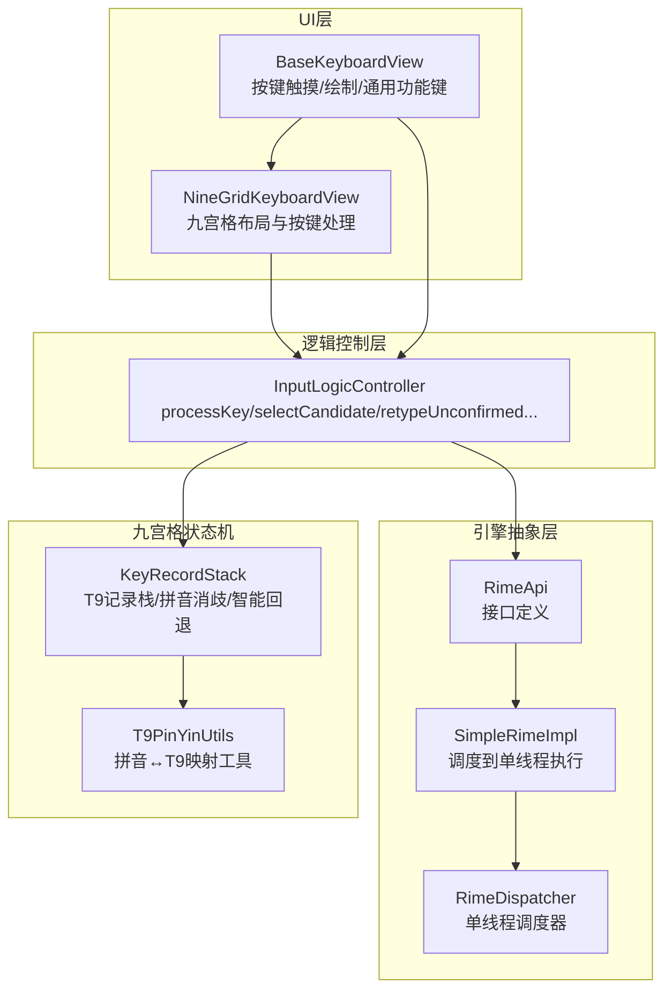
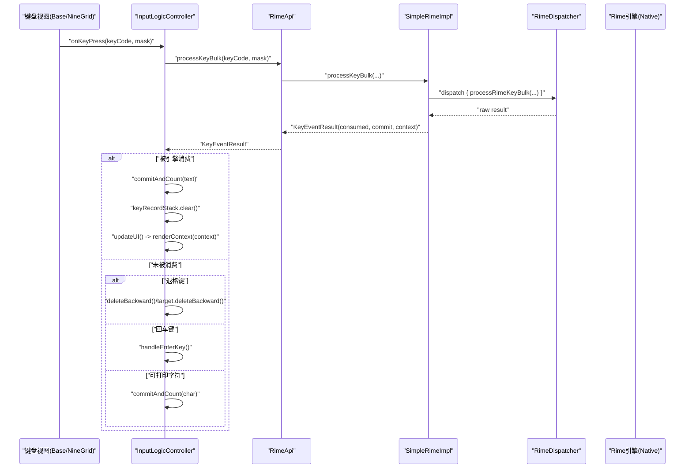
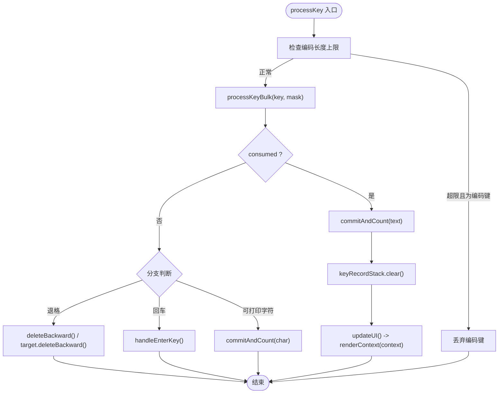
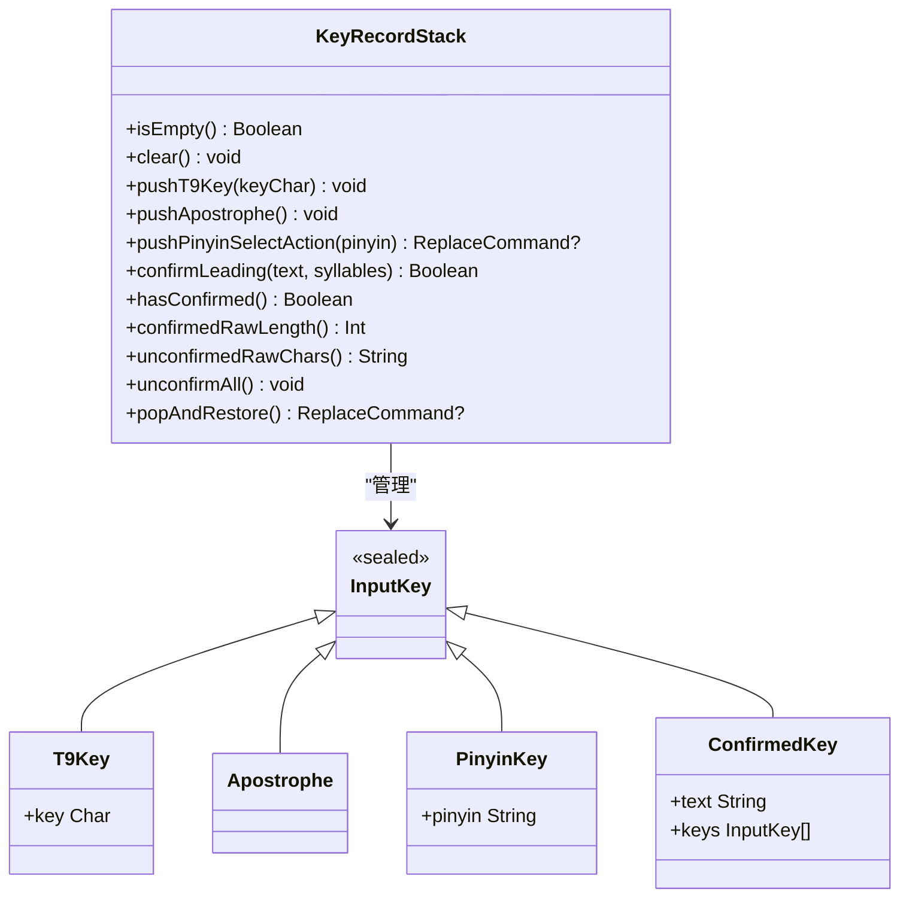
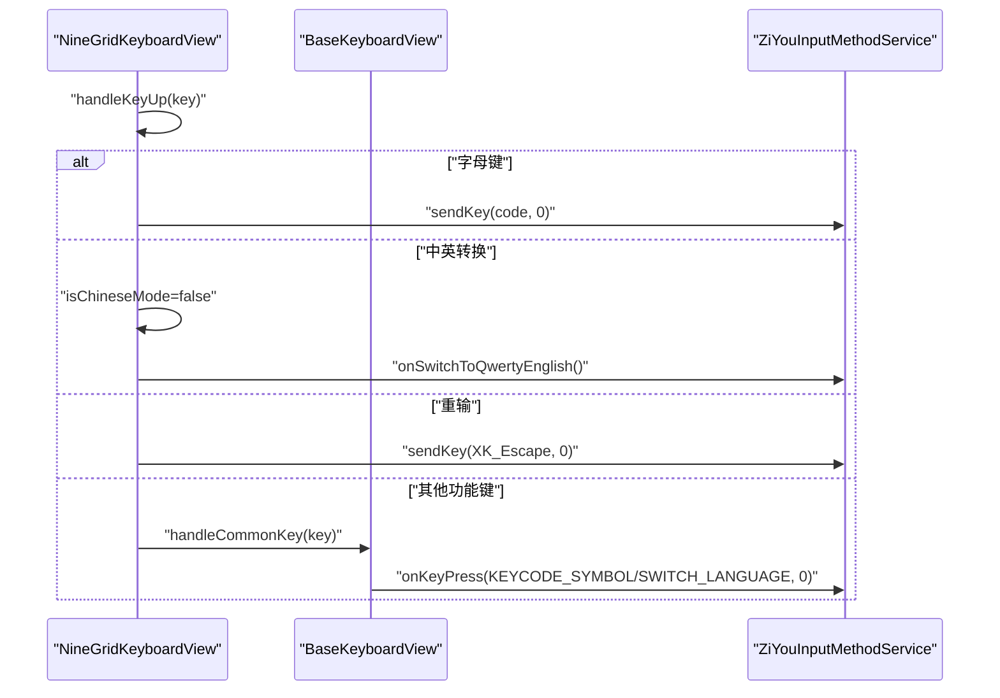
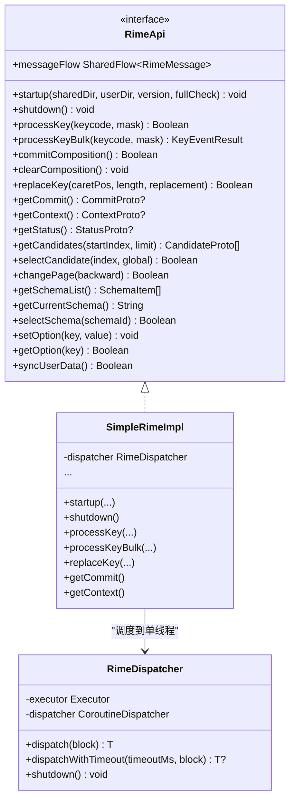
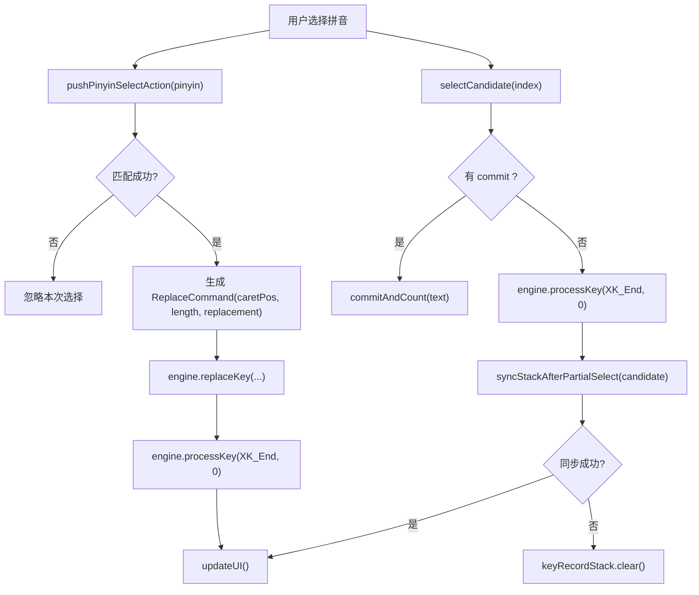
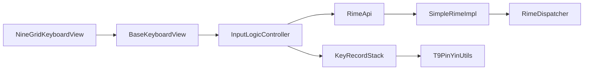

# 输入事件处理

<cite>
**本文引用的文件**   
- [InputLogicController.kt](file://app/src/main/java/com/ziyou/ime/ime/InputLogicController.kt)
- [KeyRecordStack.kt](file://core-logic/src/main/java/com/ziyou/ime/core/t9/KeyRecordStack.kt)
- [RimeDispatcher.kt](file://app/src/main/java/com/ziyou/ime/core/RimeDispatcher.kt)
- [SimpleRimeImpl.kt](file://app/src/main/java/com/ziyou/ime/core/SimpleRimeImpl.kt)
- [RimeApi.kt](file://app/src/main/java/com/ziyou/ime/core/RimeApi.kt)
- [T9PinYinUtils.kt](file://core-logic/src/main/java/com/ziyou/ime/util/T9PinYinUtils.kt)
- [BaseKeyboardView.kt](file://app/src/main/java/com/ziyou/ime/ime/BaseKeyboardView.kt)
- [NineGridKeyboardView.kt](file://app/src/main/java/com/ziyou/ime/ime/NineGridKeyboardView.kt)
- [KeyCode.kt](file://app/src/main/java/com/ziyou/ime/ime/KeyCode.kt)
- [ZiYouInputMethodService.kt](file://app/src/main/java/com/ziyou/ime/ime/ZiYouInputMethodService.kt)
</cite>

## 目录
1. [引言](#引言)
2. [项目结构](#项目结构)
3. [核心组件](#核心组件)
4. [架构总览](#架构总览)
5. [详细组件分析](#详细组件分析)
6. [依赖关系分析](#依赖关系分析)
7. [性能考量](#性能考量)
8. [故障排查指南](#故障排查指南)
9. [结论](#结论)
10. [附录](#附录)

## 引言
本技术文档聚焦输入法输入事件处理的核心路径，围绕 InputLogicController 的职责与实现展开，系统阐述按键事件分发、候选词选择、上屏提交、软键事件处理策略，以及与 Rime 引擎的交互模式。同时重点说明九宫格输入的特殊处理逻辑：KeyRecordStack 的状态机设计、拼音消歧、智能回退与分段确认同步等机制。文末提供流程图与关键代码片段路径，帮助读者快速定位实现细节。

## 项目结构
输入事件处理涉及 UI 层（键盘视图）、逻辑控制层（InputLogicController）、引擎抽象层（RimeApi/SimpleRimeImpl/RimeDispatcher）以及九宫格状态机（KeyRecordStack）。整体分层清晰，职责单一，便于测试与扩展。

图表来源 
- [BaseKeyboardView.kt:1-300](file://app/src/main/java/com/ziyou/ime/ime/BaseKeyboardView.kt#L1-L300)
- [NineGridKeyboardView.kt:1-200](file://app/src/main/java/com/ziyou/ime/ime/NineGridKeyboardView.kt#L1-L200)
- [InputLogicController.kt:1-120](file://app/src/main/java/com/ziyou/ime/ime/InputLogicController.kt#L1-L120)
- [RimeApi.kt:1-105](file://app/src/main/java/com/ziyou/ime/core/RimeApi.kt#L1-L105)
- [SimpleRimeImpl.kt:1-120](file://app/src/main/java/com/ziyou/ime/core/SimpleRimeImpl.kt#L1-L120)
- [RimeDispatcher.kt:1-91](file://app/src/main/java/com/ziyou/ime/core/RimeDispatcher.kt#L1-L91)
- [KeyRecordStack.kt:1-120](file://core-logic/src/main/java/com/ziyou/ime/core/t9/KeyRecordStack.kt#L1-L120)
- [T9PinYinUtils.kt:1-120](file://core-logic/src/main/java/com/ziyou/ime/util/T9PinYinUtils.kt#L1-L120)

章节来源
- [BaseKeyboardView.kt:1-300](file://app/src/main/java/com/ziyou/ime/ime/BaseKeyboardView.kt#L1-L300)
- [NineGridKeyboardView.kt:1-200](file://app/src/main/java/com/ziyou/ime/ime/NineGridKeyboardView.kt#L1-L200)
- [InputLogicController.kt:1-120](file://app/src/main/java/com/ziyou/ime/ime/InputLogicController.kt#L1-L120)
- [RimeApi.kt:1-105](file://app/src/main/java/com/ziyou/ime/core/RimeApi.kt#L1-L105)
- [SimpleRimeImpl.kt:1-120](file://app/src/main/java/com/ziyou/ime/core/SimpleRimeImpl.kt#L1-L120)
- [RimeDispatcher.kt:1-91](file://app/src/main/java/com/ziyou/ime/core/RimeDispatcher.kt#L1-L91)
- [KeyRecordStack.kt:1-120](file://core-logic/src/main/java/com/ziyou/ime/core/t9/KeyRecordStack.kt#L1-L120)
- [T9PinYinUtils.kt:1-120](file://core-logic/src/main/java/com/ziyou/ime/util/T9PinYinUtils.kt#L1-L120)

## 核心组件
- InputLogicController：输入逻辑控制器，负责 processKey 热路径、候选词选择、翻页、侧栏选词替换、智能退格、回车落地、富媒体提交等；通过 CommitTarget 路由上屏目标（宿主编辑器或技能面板），并维护 lastInputLength 编码长度上限防护。
- KeyRecordStack：九宫格输入状态机，维护 T9 按键、分词符、已锁定拼音与已确认段，支持 pushPinyinSelectAction、confirmLeading、popAndRestore、unconfirmAll 等操作，确保与 Rime 编码串逻辑顺序一致。
- RimeApi/SimpleRimeImpl/RimeDispatcher：引擎抽象与单线程调度，保证 librime 调用线程安全；processKeyBulk 为热路径批量接口，减少 JNI 跨界与线程往返。
- BaseKeyboardView/NineGridKeyboardView：键盘视图基类与九宫格实现，封装触摸、绘制、通用功能键（中英文切换、符号键盘）与具体按键派发。
- KeyCode：Android KeyEvent 到 Rime keysym 的映射与 mask 构建。
- ZiYouInputMethodService：服务入口，装配 InputLogicController、CommitTarget、回调与 UI 渲染，协调各面板与显示模式。

章节来源
- [InputLogicController.kt:1-120](file://app/src/main/java/com/ziyou/ime/ime/InputLogicController.kt#L1-L120)
- [KeyRecordStack.kt:1-120](file://core-logic/src/main/java/com/ziyou/ime/core/t9/KeyRecordStack.kt#L1-L120)
- [RimeApi.kt:1-105](file://app/src/main/java/com/ziyou/ime/core/RimeApi.kt#L1-L105)
- [SimpleRimeImpl.kt:1-120](file://app/src/main/java/com/ziyou/ime/core/SimpleRimeImpl.kt#L1-L120)
- [RimeDispatcher.kt:1-91](file://app/src/main/java/com/ziyou/ime/core/RimeDispatcher.kt#L1-L91)
- [BaseKeyboardView.kt:1-300](file://app/src/main/java/com/ziyou/ime/ime/BaseKeyboardView.kt#L1-L300)
- [NineGridKeyboardView.kt:1-200](file://app/src/main/java/com/ziyou/ime/ime/NineGridKeyboardView.kt#L1-L200)
- [KeyCode.kt:1-120](file://app/src/main/java/com/ziyou/ime/ime/KeyCode.kt#L1-L120)
- [ZiYouInputMethodService.kt:1-200](file://app/src/main/java/com/ziyou/ime/ime/ZiYouInputMethodService.kt#L1-L200)

## 架构总览
输入事件从键盘视图触发，经 onKeyPress 回调进入 InputLogicController.processKey，随后通过 RimeApi.processKeyBulk 批量处理按键，得到 consumed/commit/context。若被消费则上屏并提交计数，刷新 UI；否则按规则处理退格、回车或直接上屏可打印字符。九宫格路径中，KeyRecordStack 负责拼音消歧与智能回退，必要时通过 replaceKey 更新 Rime 编码串。

图表来源 
- [InputLogicController.kt:120-200](file://app/src/main/java/com/ziyou/ime/ime/InputLogicController.kt#L120-L200)
- [RimeApi.kt:30-60](file://app/src/main/java/com/ziyou/ime/core/RimeApi.kt#L30-L60)
- [SimpleRimeImpl.kt:50-80](file://app/src/main/java/com/ziyou/ime/core/SimpleRimeImpl.kt#L50-L80)
- [RimeDispatcher.kt:40-80](file://app/src/main/java/com/ziyou/ime/core/RimeDispatcher.kt#L40-L80)

## 详细组件分析

### InputLogicController：核心输入路径
- processKey：串行化输入事务（Mutex），编码长度超限防护（MAX_INPUT_LENGTH=30），热路径使用 processKeyBulk，消耗后取 commit 上屏并刷新 UI；未消耗时处理退格、回车、可打印字符。
- selectCandidate：选择候选词，若有 commit 则上屏并清栈；无 commit（分段确认）则补发 End 标记并同步九宫格状态机（syncStackAfterPartialSelect）。
- changePage：翻页操作，成功后刷新 UI。
- selectPinyin：侧栏选词替换，先 replaceKey 再 End 归位，刷新 UI。
- restorePinyin：智能回退，将已锁定拼音还原为原 T9 键序列。
- deleteUnconfirmedBackward：安全删除末位未确认原始键，避免 ReopenPreviousSegment 导致已确认段被撤销。
- retypeUnconfirmed：退格重打，逐键定位删除未确认部分，再逐键重打新串，保持已确认前缀不变。
- handleEnterKey：回车落地，优先路由到 CommitTarget（技能面板），否则按 EditorInfo 动作执行 performEditorAction 或补发 ENTER 物理按键事件。
- commitSideSymbol/commitDirectToEditor/commitImageToEditor：侧栏符号直接上屏、绕过 CommitTarget 直连宿主编辑器、富媒体图片提交（Commit Content API）。
- updateUI：获取最新上下文并在主线程刷新 UI。

图表来源 
- [InputLogicController.kt:120-200](file://app/src/main/java/com/ziyou/ime/ime/InputLogicController.kt#L120-L200)
- [InputLogicController.kt:380-420](file://app/src/main/java/com/ziyou/ime/ime/InputLogicController.kt#L380-L420)

章节来源
- [InputLogicController.kt:120-200](file://app/src/main/java/com/ziyou/ime/ime/InputLogicController.kt#L120-L200)
- [InputLogicController.kt:190-230](file://app/src/main/java/com/ziyou/ime/ime/InputLogicController.kt#L190-L230)
- [InputLogicController.kt:240-290](file://app/src/main/java/com/ziyou/ime/ime/InputLogicController.kt#L240-L290)
- [InputLogicController.kt:290-340](file://app/src/main/java/com/ziyou/ime/ime/InputLogicController.kt#L290-L340)
- [InputLogicController.kt:340-380](file://app/src/main/java/com/ziyou/ime/ime/InputLogicController.kt#L340-L380)
- [InputLogicController.kt:380-420](file://app/src/main/java/com/ziyou/ime/ime/InputLogicController.kt#L380-L420)
- [InputLogicController.kt:420-530](file://app/src/main/java/com/ziyou/ime/ime/InputLogicController.kt#L420-L530)

### KeyRecordStack：九宫格状态机
- pushT9Key/pushApostrophe：追加数字键与分词符。
- pushPinyinSelectAction：根据拼音计算 T9 序列，定位首个未确定音节段，校验匹配后原地替换为 PinyinKey，返回 ReplaceCommand。
- confirmLeading：分段确认后合并栈头记录为 ConfirmedKey，保持原始编码串宽度用于偏移计算。
- popAndRestore：智能回退，栈尾为 PinyinKey 则还原为 T9Key 段；为 T9Key/Apostrophe 则弹出；为 ConfirmedKey 则展开后递归处理。
- unconfirmAll：展开全部 ConfirmedKey 为原始记录，与 replaceKey 清空已确认段的语义保持一致。
- confirmedRawLength/unconfirmedRawChars：计算已确认段原始长度与未确认部分原始字符串表示，供重打路径使用。

图表来源 
- [KeyRecordStack.kt:1-120](file://core-logic/src/main/java/com/ziyou/ime/core/t9/KeyRecordStack.kt#L1-L120)
- [KeyRecordStack.kt:250-310](file://core-logic/src/main/java/com/ziyou/ime/core/t9/KeyRecordStack.kt#L250-L310)

章节来源
- [KeyRecordStack.kt:1-120](file://core-logic/src/main/java/com/ziyou/ime/core/t9/KeyRecordStack.kt#L1-L120)
- [KeyRecordStack.kt:120-220](file://core-logic/src/main/java/com/ziyou/ime/core/t9/KeyRecordStack.kt#L120-L220)
- [KeyRecordStack.kt:220-310](file://core-logic/src/main/java/com/ziyou/ime/core/t9/KeyRecordStack.kt#L220-L310)

### 软键事件处理（handleSoftKeyPress）
- BaseKeyboardView.handleCommonKey：统一处理中英文切换（KEYCODE_SWITCH_LANGUAGE）与符号键盘（KEYCODE_SYMBOL），通过 onKeyPress 回调向上派发。
- NineGridKeyboardView.handleKeyUp：字母键直接发送对应数字键；中英转换强制英文并切换到全键盘；重输发送 Escape；其他功能键走 handleCommonKey 或直接 sendKey。
- 功能键、符号键、布局切换键的处理策略由视图层识别并派发至 Service 层，再由 Service 决定最终行为（如切换布局、打开符号面板、切换中英文等）。

图表来源 
- [NineGridKeyboardView.kt:250-288](file://app/src/main/java/com/ziyou/ime/ime/NineGridKeyboardView.kt#L250-L288)
- [BaseKeyboardView.kt:560-580](file://app/src/main/java/com/ziyou/ime/ime/BaseKeyboardView.kt#L560-L580)

章节来源
- [BaseKeyboardView.kt:560-580](file://app/src/main/java/com/ziyou/ime/ime/BaseKeyboardView.kt#L560-L580)
- [NineGridKeyboardView.kt:250-288](file://app/src/main/java/com/ziyou/ime/ime/NineGridKeyboardView.kt#L250-L288)

### 与 Rime 引擎的交互模式
- SimpleRimeImpl：所有 suspend 方法通过 RimeDispatcher.dispatch 在单线程执行，保证线程安全；processKeyBulk 解析原生数组为 KeyEventResult。
- RimeDispatcher：创建专属单线程 Executor，协程调度器绑定该线程，提供 dispatch/dispatchWithTimeout/shutdown。
- 上下文状态同步：processKeyBulk 返回 context，InputLogicController.updateUI 在主线程渲染候选词与编码区；selectCandidate 后可能无 commit（分段确认），需补发 End 并同步状态机。

图表来源 
- [RimeApi.kt:1-105](file://app/src/main/java/com/ziyou/ime/core/RimeApi.kt#L1-L105)
- [SimpleRimeImpl.kt:1-120](file://app/src/main/java/com/ziyou/ime/core/SimpleRimeImpl.kt#L1-L120)
- [RimeDispatcher.kt:1-91](file://app/src/main/java/com/ziyou/ime/core/RimeDispatcher.kt#L1-L91)

章节来源
- [RimeApi.kt:1-105](file://app/src/main/java/com/ziyou/ime/core/RimeApi.kt#L1-L105)
- [SimpleRimeImpl.kt:1-120](file://app/src/main/java/com/ziyou/ime/core/SimpleRimeImpl.kt#L1-L120)
- [RimeDispatcher.kt:1-91](file://app/src/main/java/com/ziyou/ime/core/RimeDispatcher.kt#L1-L91)

### 九宫格输入特殊处理
- 拼音消歧：T9PinYinUtils.pinyin2Key 将拼音映射为 T9 数字序列；KeyRecordStack.pushPinyinSelectAction 定位首个未确定音节段并校验匹配，返回 ReplaceCommand 供 replaceKey 使用。
- 智能回退：KeyRecordStack.popAndRestore 将已锁定拼音还原为原 T9 键序列；若栈尾为 ConfirmedKey 则展开后递归处理。
- 分段确认同步：selectCandidate 无 commit 时，InputLogicController.syncStackAfterPartialSelect 根据所选候选注音合并栈头记录为 ConfirmedKey，失败则清栈降级。
- 退格重打：retypeUnconfirmed 使用 End/KP_Left/Delete 序列精确定位删除未确认部分，再逐键重打新串，保持已确认前缀不变。

图表来源 
- [KeyRecordStack.kt:50-120](file://core-logic/src/main/java/com/ziyou/ime/core/t9/KeyRecordStack.kt#L50-L120)
- [InputLogicController.kt:190-240](file://app/src/main/java/com/ziyou/ime/ime/InputLogicController.kt#L190-L240)
- [T9PinYinUtils.kt:320-340](file://core-logic/src/main/java/com/ziyou/ime/util/T9PinYinUtils.kt#L320-L340)

章节来源
- [KeyRecordStack.kt:50-120](file://core-logic/src/main/java/com/ziyou/ime/core/t9/KeyRecordStack.kt#L50-L120)
- [InputLogicController.kt:190-240](file://app/src/main/java/com/ziyou/ime/ime/InputLogicController.kt#L190-L240)
- [T9PinYinUtils.kt:320-340](file://core-logic/src/main/java/com/ziyou/ime/util/T9PinYinUtils.kt#L320-L340)

## 依赖关系分析
- InputLogicController 依赖 RimeEngine（RimeApi 实现）、KeyRecordStack、Callbacks（Service 提供）与 commitListeners（横切监听）。
- SimpleRimeImpl 依赖 RimeDispatcher 进行单线程调度，所有 RimeNative 调用均在专属线程执行。
- BaseKeyboardView/NineGridKeyboardView 通过 onKeyPress 回调向 Service 派发按键，Service 再交由 InputLogicController 处理。
- KeyRecordStack 依赖 T9PinYinUtils 进行拼音与 T9 序列的双向映射。

图表来源 
- [NineGridKeyboardView.kt:1-200](file://app/src/main/java/com/ziyou/ime/ime/NineGridKeyboardView.kt#L1-L200)
- [BaseKeyboardView.kt:1-300](file://app/src/main/java/com/ziyou/ime/ime/BaseKeyboardView.kt#L1-L300)
- [InputLogicController.kt:1-120](file://app/src/main/java/com/ziyou/ime/ime/InputLogicController.kt#L1-L120)
- [RimeApi.kt:1-105](file://app/src/main/java/com/ziyou/ime/core/RimeApi.kt#L1-L105)
- [SimpleRimeImpl.kt:1-120](file://app/src/main/java/com/ziyou/ime/core/SimpleRimeImpl.kt#L1-L120)
- [RimeDispatcher.kt:1-91](file://app/src/main/java/com/ziyou/ime/core/RimeDispatcher.kt#L1-L91)
- [KeyRecordStack.kt:1-120](file://core-logic/src/main/java/com/ziyou/ime/core/t9/KeyRecordStack.kt#L1-L120)
- [T9PinYinUtils.kt:1-120](file://core-logic/src/main/java/com/ziyou/ime/util/T9PinYinUtils.kt#L1-L120)

章节来源
- [InputLogicController.kt:1-120](file://app/src/main/java/com/ziyou/ime/ime/InputLogicController.kt#L1-L120)
- [SimpleRimeImpl.kt:1-120](file://app/src/main/java/com/ziyou/ime/core/SimpleRimeImpl.kt#L1-L120)
- [RimeDispatcher.kt:1-91](file://app/src/main/java/com/ziyou/ime/core/RimeDispatcher.kt#L1-L91)
- [KeyRecordStack.kt:1-120](file://core-logic/src/main/java/com/ziyou/ime/core/t9/KeyRecordStack.kt#L1-L120)
- [T9PinYinUtils.kt:1-120](file://core-logic/src/main/java/com/ziyou/ime/util/T9PinYinUtils.kt#L1-L120)

## 性能考量
- 热路径优化：processKeyBulk 将 processKey/getCommit/getContext 合并为单次引擎调度，减少线程往返与 JNI 跨界次数。
- 编码长度上限：MAX_INPUT_LENGTH=30，超过后丢弃新增编码键，避免 script_translator 组句搜索组合爆炸导致的耗时退化。
- 慢按键告警：SLOW_KEY_WARN_MS=100ms，超过阈值记录警告日志，便于发现性能退化。
- 串行化输入：inputMutex 保证一次按键内的多次 Rime 调用连续执行，避免快速连击导致的 commit/context 错配。

[本节为通用指导，不直接分析具体文件]

## 故障排查指南
- 按键异常：检查 isComposingKey 判定与 MAX_INPUT_LENGTH 限制，确认是否因编码过长被丢弃。
- 候选错乱：查看 selectCandidate 后的分段确认同步（syncStackAfterPartialSelect）是否失败导致清栈降级。
- 已确认段被撤销：确认 deleteUnconfirmedBackward 与 retypeUnconfirmed 使用的 End/KP_Left/Delete 序列是否正确，避免 BackSpace 触发的 ReopenPreviousSegment 问题。
- 引擎线程问题：确认 SimpleRimeImpl 与 RimeDispatcher 的单线程调度是否正常，避免并发访问 librime。
- 软键派发：检查 BaseKeyboardView.handleCommonKey 与 NineGridKeyboardView.handleKeyUp 的派发逻辑，确保功能键正确路由到 Service。

章节来源
- [InputLogicController.kt:120-200](file://app/src/main/java/com/ziyou/ime/ime/InputLogicController.kt#L120-L200)
- [InputLogicController.kt:190-240](file://app/src/main/java/com/ziyou/ime/ime/InputLogicController.kt#L190-L240)
- [InputLogicController.kt:310-380](file://app/src/main/java/com/ziyou/ime/ime/InputLogicController.kt#L310-L380)
- [SimpleRimeImpl.kt:1-120](file://app/src/main/java/com/ziyou/ime/core/SimpleRimeImpl.kt#L1-L120)
- [BaseKeyboardView.kt:560-580](file://app/src/main/java/com/ziyou/ime/ime/BaseKeyboardView.kt#L560-L580)
- [NineGridKeyboardView.kt:250-288](file://app/src/main/java/com/ziyou/ime/ime/NineGridKeyboardView.kt#L250-L288)

## 结论
InputLogicController 作为输入事件处理的核心，通过 processKey 热路径、候选词选择、智能回退与回车落地等功能，实现了高效稳定的输入体验。KeyRecordStack 与 T9PinYinUtils 协同完成九宫格拼音消歧与状态同步，确保与 Rime 引擎的编码串逻辑一致。RimeApi/SimpleRimeImpl/RimeDispatcher 提供线程安全的引擎抽象与调度，保障 librime 调用的稳定性。整体架构分层清晰、职责明确，便于扩展与维护。

[本节为总结性内容，不直接分析具体文件]

## 附录
- 关键代码片段路径（仅列路径，不包含代码内容）：
  - processKey 热路径：[InputLogicController.kt:120-200](file://app/src/main/java/com/ziyou/ime/ime/InputLogicController.kt#L120-L200)
  - selectCandidate 分段确认：[InputLogicController.kt:190-240](file://app/src/main/java/com/ziyou/ime/ime/InputLogicController.kt#L190-L240)
  - retypeUnconfirmed 退格重打：[InputLogicController.kt:340-380](file://app/src/main/java/com/ziyou/ime/ime/InputLogicController.kt#L340-L380)
  - handleEnterKey 回车落地：[InputLogicController.kt:380-420](file://app/src/main/java/com/ziyou/ime/ime/InputLogicController.kt#L380-L420)
  - KeyRecordStack.pushPinyinSelectAction：[KeyRecordStack.kt:50-120](file://core-logic/src/main/java/com/ziyou/ime/core/t9/KeyRecordStack.kt#L50-L120)
  - KeyRecordStack.popAndRestore：[KeyRecordStack.kt:190-230](file://core-logic/src/main/java/com/ziyou/ime/core/t9/KeyRecordStack.kt#L190-L230)
  - T9PinYinUtils.pinyin2Key：[T9PinYinUtils.kt:320-340](file://core-logic/src/main/java/com/ziyou/ime/util/T9PinYinUtils.kt#L320-L340)
  - SimpleRimeImpl.processKeyBulk：[SimpleRimeImpl.kt:50-80](file://app/src/main/java/com/ziyou/ime/core/SimpleRimeImpl.kt#L50-L80)
  - BaseKeyboardView.handleCommonKey：[BaseKeyboardView.kt:560-580](file://app/src/main/java/com/ziyou/ime/ime/BaseKeyboardView.kt#L560-L580)
  - NineGridKeyboardView.handleKeyUp：[NineGridKeyboardView.kt:250-288](file://app/src/main/java/com/ziyou/ime/ime/NineGridKeyboardView.kt#L250-L288)

[本节为附录，不直接分析具体文件]