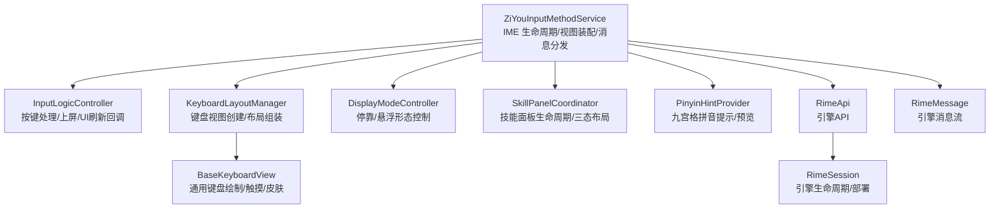
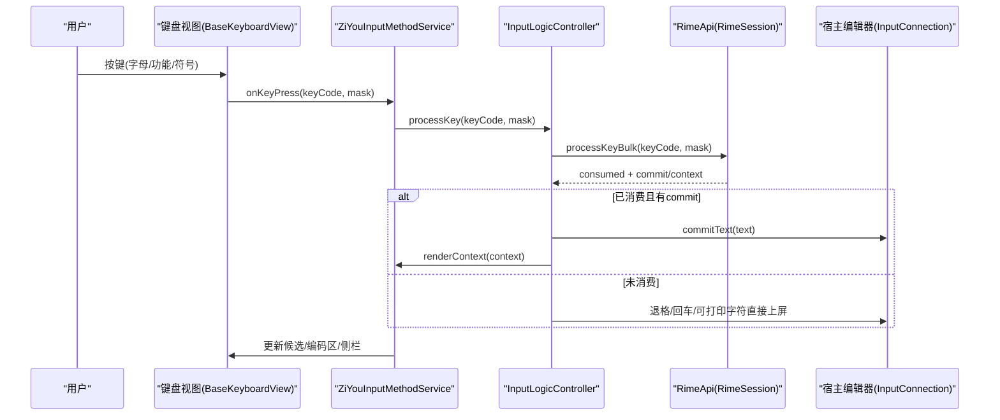
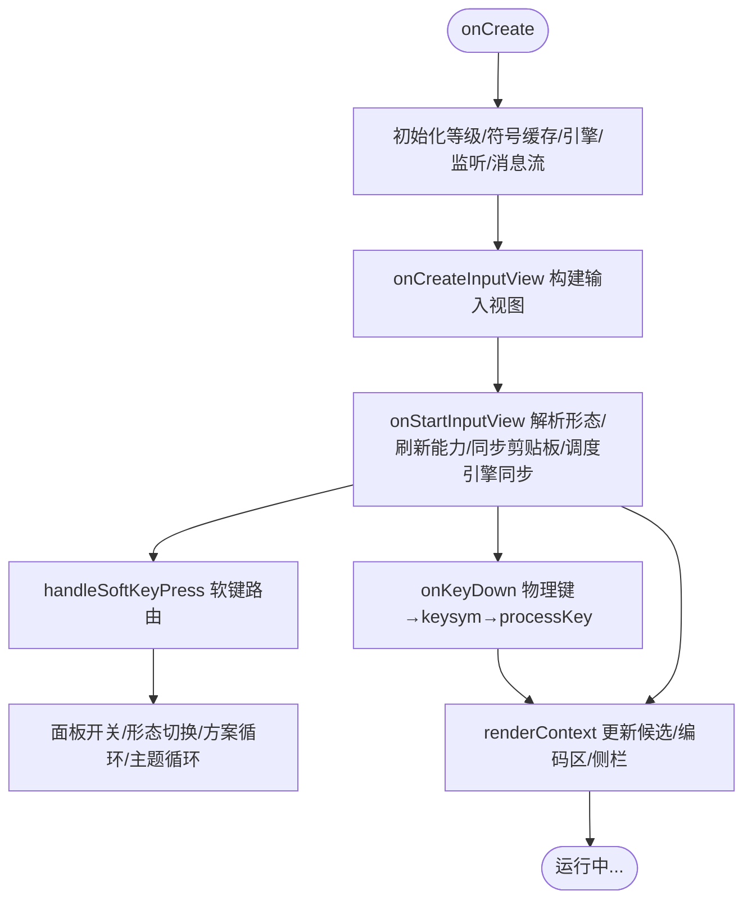
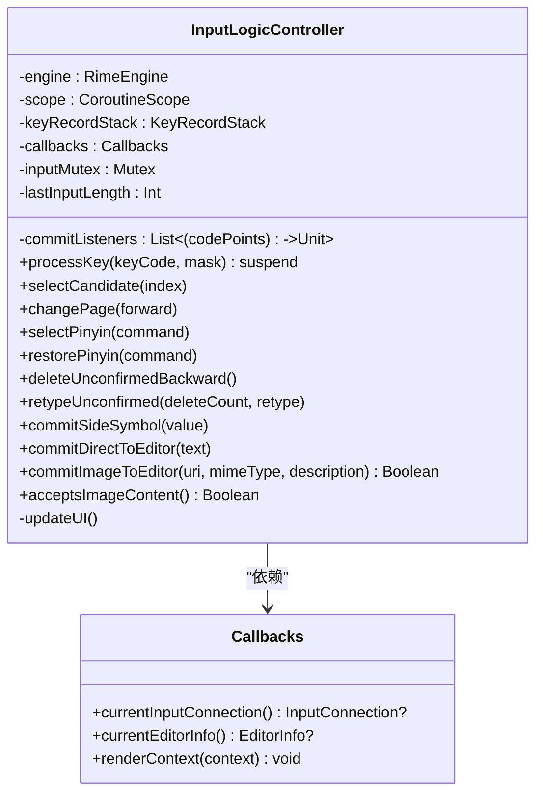
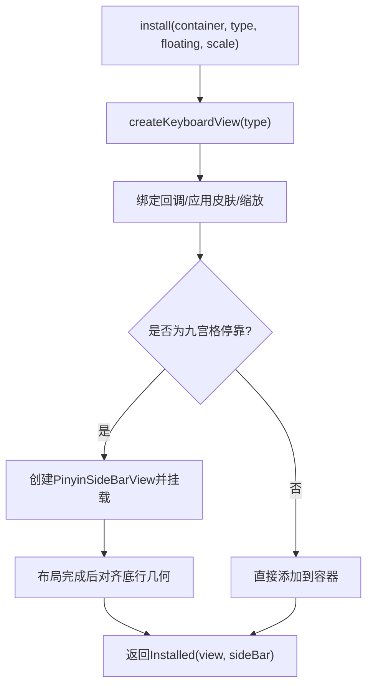
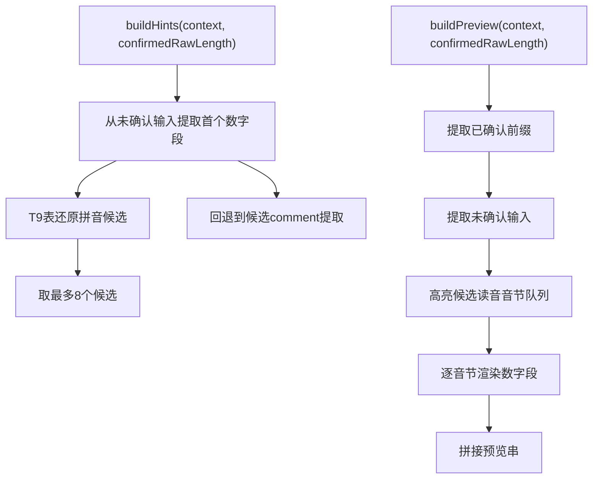
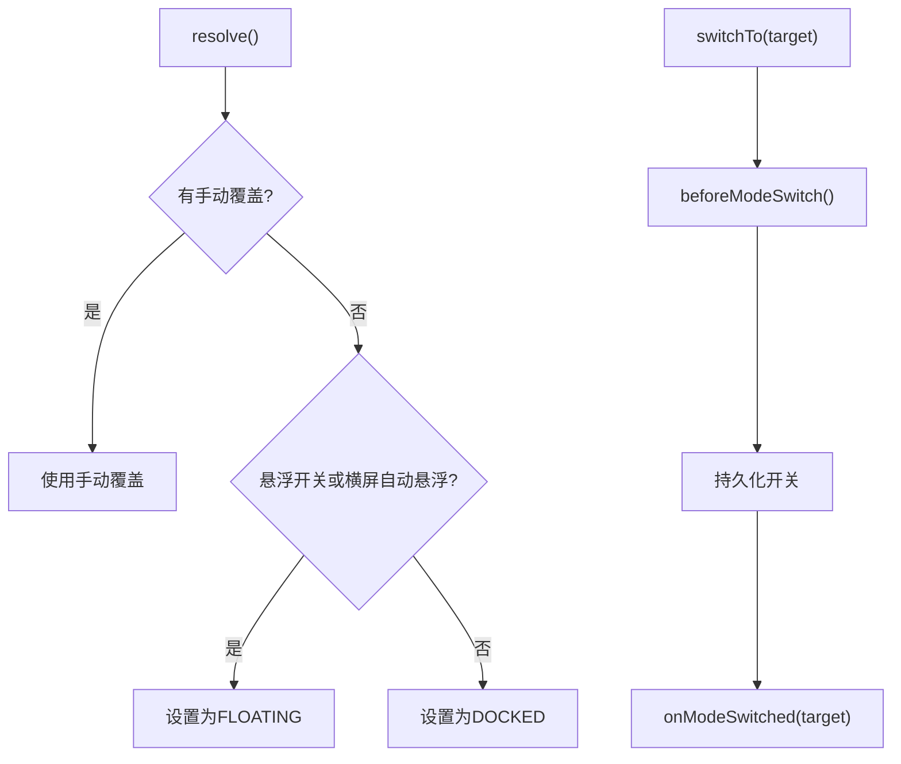
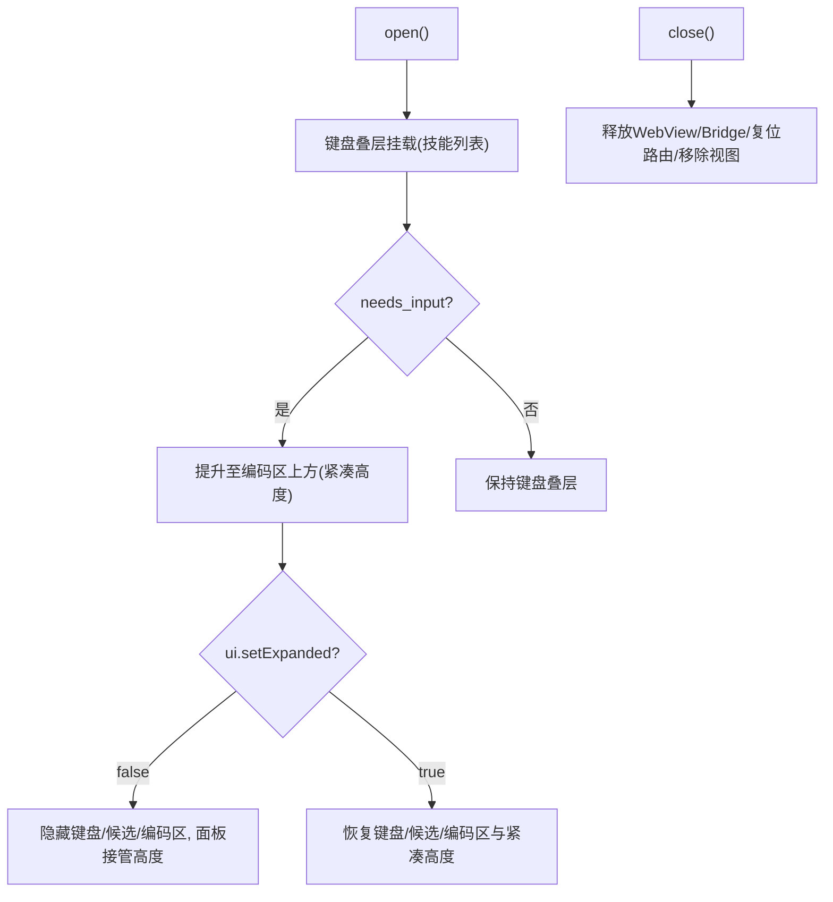
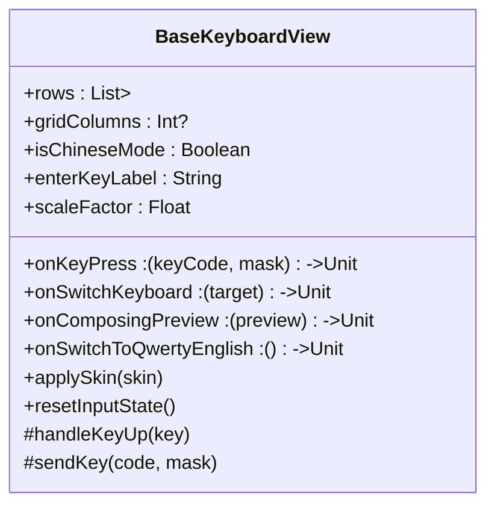
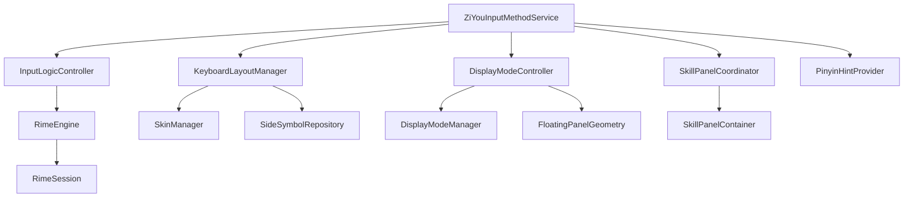

# 输入方法服务

<cite>
**本文引用的文件**   
- [ZiYouInputMethodService.kt](file://app/src/main/java/com/ziyou/ime/ime/ZiYouInputMethodService.kt)
- [InputLogicController.kt](file://app/src/main/java/com/ziyou/ime/ime/InputLogicController.kt)
- [KeyboardLayoutManager.kt](file://app/src/main/java/com/ziyou/ime/ime/KeyboardLayoutManager.kt)
- [PinyinHintProvider.kt](file://app/src/main/java/com/ziyou/ime/ime/PinyinHintProvider.kt)
- [DisplayModeController.kt](file://app/src/main/java/com/ziyou/ime/ime/DisplayModeController.kt)
- [SkillPanelCoordinator.kt](file://app/src/main/java/com/ziyou/ime/ime/SkillPanelCoordinator.kt)
- [BaseKeyboardView.kt](file://app/src/main/java/com/ziyou/ime/ime/BaseKeyboardView.kt)
- [KeyCode.kt](file://app/src/main/java/com/ziyou/ime/ime/KeyCode.kt)
- [KeyboardType.kt](file://app/src/main/java/com/ziyou/ime/ime/KeyboardType.kt)
- [RimeApi.kt](file://app/src/main/java/com/ziyou/ime/core/RimeApi.kt)
- [RimeMessage.kt](file://app/src/main/java/com/ziyou/ime/core/RimeMessage.kt)
- [RimeSession.kt](file://app/src/main/java/com/ziyou/ime/daemon/RimeSession.kt)
</cite>

## 目录
1. [简介](#简介)
2. [项目结构](#项目结构)
3. [核心组件](#核心组件)
4. [架构总览](#架构总览)
5. [详细组件分析](#详细组件分析)
6. [依赖关系分析](#依赖关系分析)
7. [性能考量](#性能考量)
8. [故障排查指南](#故障排查指南)
9. [结论](#结论)
10. [附录](#附录)

## 简介
本技术文档围绕“字由输入法”的输入方法服务展开，重点说明 ZiYouInputMethodService 的生命周期管理、InputLogicController 的核心输入路径（按键处理、候选词选择与上屏）、KeyboardLayoutManager 的键盘视图创建与布局组装机制，以及五个协作类（InputLogicController、KeyboardLayoutManager、PinyinHintProvider、DisplayModeController、SkillPanelCoordinator）的职责分离与交互关系。文档同时覆盖按键事件处理流程、视图更新机制以及与 Rime 引擎的交互模式，并提供关键实现细节的代码片段路径与流程图。

## 项目结构
- 输入方法服务主类：ZiYouInputMethodService 负责 Android IME 生命周期、视图装配、引擎状态同步与消息分发。
- 输入逻辑控制器：InputLogicController 封装与 Rime 引擎的交互、上屏提交、UI 刷新回调与事务串行化。
- 键盘布局管理器：KeyboardLayoutManager 负责不同键盘类型的视图创建、回调绑定与九宫格复合布局组装。
- 拼音提示提供者：PinyinHintProvider 纯逻辑生成九宫格侧栏候选与编码区预览。
- 显示形态控制器：DisplayModeController 管理停靠/悬浮形态解析、切换与悬浮 insets。
- 技能面板协调器：SkillPanelCoordinator 管理技能面板生命周期与三态布局编排。
- 基础键盘视图：BaseKeyboardView 抽象出通用绘制、触摸、皮肤与布局能力。
- 键码映射：KeyCode 将 Android KeyEvent 转换为 Rime keysym。
- 键盘类型枚举：KeyboardType 定义布局与方案映射。
- Rime 接口与消息：RimeApi、RimeMessage 定义引擎 API 与消息流。
- Rime 会话：RimeSession 单例管理引擎生命周期与部署。

**图表来源** 
- [ZiYouInputMethodService.kt](file://app/src/main/java/com/ziyou/ime/ime/ZiYouInputMethodService.kt)
- [InputLogicController.kt](file://app/src/main/java/com/ziyou/ime/ime/InputLogicController.kt)
- [KeyboardLayoutManager.kt](file://app/src/main/java/com/ziyou/ime/ime/KeyboardLayoutManager.kt)
- [DisplayModeController.kt](file://app/src/main/java/com/ziyou/ime/ime/DisplayModeController.kt)
- [SkillPanelCoordinator.kt](file://app/src/main/java/com/ziyou/ime/ime/SkillPanelCoordinator.kt)
- [BaseKeyboardView.kt](file://app/src/main/java/com/ziyou/ime/ime/BaseKeyboardView.kt)
- [PinyinHintProvider.kt](file://app/src/main/java/com/ziyou/ime/ime/PinyinHintProvider.kt)
- [RimeApi.kt](file://app/src/main/java/com/ziyou/ime/core/RimeApi.kt)
- [RimeMessage.kt](file://app/src/main/java/com/ziyou/ime/core/RimeMessage.kt)
- [RimeSession.kt](file://app/src/main/java/com/ziyou/ime/daemon/RimeSession.kt)

**章节来源**
- [ZiYouInputMethodService.kt](file://app/src/main/java/com/ziyou/ime/ime/ZiYouInputMethodService.kt)
- [InputLogicController.kt](file://app/src/main/java/com/ziyou/ime/ime/InputLogicController.kt)
- [KeyboardLayoutManager.kt](file://app/src/main/java/com/ziyou/ime/ime/KeyboardLayoutManager.kt)
- [PinyinHintProvider.kt](file://app/src/main/java/com/ziyou/ime/ime/PinyinHintProvider.kt)
- [DisplayModeController.kt](file://app/src/main/java/com/ziyou/ime/ime/DisplayModeController.kt)
- [SkillPanelCoordinator.kt](file://app/src/main/java/com/ziyou/ime/ime/SkillPanelCoordinator.kt)
- [BaseKeyboardView.kt](file://app/src/main/java/com/ziyou/ime/ime/BaseKeyboardView.kt)
- [KeyCode.kt](file://app/src/main/java/com/ziyou/ime/ime/KeyCode.kt)
- [KeyboardType.kt](file://app/src/main/java/com/ziyou/ime/ime/KeyboardType.kt)
- [RimeApi.kt](file://app/src/main/java/com/ziyou/ime/core/RimeApi.kt)
- [RimeMessage.kt](file://app/src/main/java/com/ziyou/ime/core/RimeMessage.kt)
- [RimeSession.kt](file://app/src/main/java/com/ziyou/ime/daemon/RimeSession.kt)

## 核心组件
- ZiYouInputMethodService：IME 服务入口，负责 onCreate/onCreateInputView/onStartInputView/onFinishInputView/onDestroy 等生命周期；构建输入视图（编码区+候选+键盘），管理显示形态与面板；调度引擎状态同步；处理物理/软键盘按键与候选操作；订阅 Rime 消息并驱动 UI。
- InputLogicController：核心输入路径，processKey 批量处理按键（热路径 processKeyBulk），选词 selectCandidate、翻页 changePage、拼音替换 selectPinyin、退格重打 retypeUnconfirmed、安全删除 deleteUnconfirmedBackward；统一上屏 commitAndCount 与图片提交 commitImageToEditor；通过 Callbacks 在主线程渲染 UI。
- KeyboardLayoutManager：根据 KeyboardType 创建具体键盘视图，绑定回调，完成九宫格左侧拼音侧栏与网格的复合布局；支持悬浮缩放与皮肤应用。
- PinyinHintProvider：基于 ContextProto 与 T9 工具生成九宫格侧栏候选列表与顶部编码区预览，确保与候选读音同源对齐。
- DisplayModeController：解析当前显示形态（手动覆盖 > 悬浮开关 > 横屏自动悬浮），切换时重建输入视图并计算悬浮 insets。
- SkillPanelCoordinator：技能面板生命周期与三态布局（键盘叠层/提升挂载/收缩态），高度守恒，支持面板内输入路由切换。

**章节来源**
- [ZiYouInputMethodService.kt](file://app/src/main/java/com/ziyou/ime/ime/ZiYouInputMethodService.kt)
- [InputLogicController.kt](file://app/src/main/java/com/ziyou/ime/ime/InputLogicController.kt)
- [KeyboardLayoutManager.kt](file://app/src/main/java/com/ziyou/ime/ime/KeyboardLayoutManager.kt)
- [PinyinHintProvider.kt](file://app/src/main/java/com/ziyou/ime/ime/PinyinHintProvider.kt)
- [DisplayModeController.kt](file://app/src/main/java/com/ziyou/ime/ime/DisplayModeController.kt)
- [SkillPanelCoordinator.kt](file://app/src/main/java/com/ziyou/ime/ime/SkillPanelCoordinator.kt)

## 架构总览
下图展示从按键到上屏的关键调用链路与数据流，包括 Service 层、控制器、引擎与 UI 渲染。

**图表来源** 
- [ZiYouInputMethodService.kt](file://app/src/main/java/com/ziyou/ime/ime/ZiYouInputMethodService.kt)
- [InputLogicController.kt](file://app/src/main/java/com/ziyou/ime/ime/InputLogicController.kt)
- [RimeApi.kt](file://app/src/main/java/com/ziyou/ime/core/RimeApi.kt)
- [RimeSession.kt](file://app/src/main/java/com/ziyou/ime/daemon/RimeSession.kt)
- [BaseKeyboardView.kt](file://app/src/main/java/com/ziyou/ime/ime/BaseKeyboardView.kt)

## 详细组件分析

### ZiYouInputMethodService 生命周期与视图管理
- onCreate：初始化等级计分、预热符号分类缓存、启动 Rime 引擎（必要时 fullCheck）、注册剪贴板监听、皮肤变更监听、订阅 Rime 消息流。
- onCreateInputView：解析显示形态，构建完整输入视图（编码区+候选+键盘），按皮肤应用背景与缩放，悬浮形态包裹悬浮容器。
- onStartInputView：重新解析显示形态（横屏自动悬浮/设置页变更），刷新图片能力、换行键文案、兜底同步剪贴板、scheduleEngineSync（先清编码再按当前键盘同步方案与状态）。
- onFinishInputView：关闭所有面板、重置键盘状态、清空编码区、落盘计分、异步清除引擎编码。
- onDestroy：注销皮肤与剪贴板监听、关闭面板、落盘计分、取消协程、释放视图引用。
- 引擎状态同步：scheduleEngineSync 使用 latest-wins 串行化，等待引擎就绪后 applyEngineForKeyboard（九宫格强制 t9 且中文模式；全键盘恢复用户偏好；符号/数字临时面板清编码不动方案）。
- 按键处理：onKeyDown 转换 keysym 并异步 processKey；handleSoftKeyPress 处理中英文切换、形态切换、各面板开关、符号/数字临时面板、普通按键（含九宫格智能退格与 T9 追踪）。
- UI 渲染：renderContext 更新候选、按钮栏显隐、编码区预览（九宫格用 PinyinHintProvider 生成预览，全键盘回退 preedit）、侧栏候选/符号。
- 图片提交：AI/涂鸦面板发送或保存，优先走 commitContent 直发，否则保存到相册。

**图表来源** 
- [ZiYouInputMethodService.kt](file://app/src/main/java/com/ziyou/ime/ime/ZiYouInputMethodService.kt)

**章节来源**
- [ZiYouInputMethodService.kt](file://app/src/main/java/com/ziyou/ime/ime/ZiYouInputMethodService.kt)

### InputLogicController 核心输入路径
- processKey：Mutex 串行化，编码长度上限防护（MAX_INPUT_LENGTH=30），热路径 processKeyBulk，consumed 分支取 commit 上屏并刷新 UI；未消费分支处理退格/回车/可打印字符。
- selectCandidate：选词后取 commit 上屏；分段确认无 commit 时补发 End 并同步九宫格状态机；updateUI 获取最新上下文刷新 UI。
- changePage：翻页成功则 updateUI。
- selectPinyin/restorePinyin：replaceKey 替换编码段，End 归位重组候选；restore 回退锁定拼音为原 T9 键。
- deleteUnconfirmedBackward：存在已确认段时的安全删除序列（End→KP_Left→Delete），避免 Reopen 导致已确认段作废。
- retypeUnconfirmed：逐键重打未确认部分，保留已确认前缀。
- handleEnterKey：面板目标路由 onEnter；否则按 EnterKeyBehavior 执行 performEditorAction 或补发 ENTER 按键事件。
- commitSideSymbol/commitDirectToEditor/commitImageToEditor：侧栏符号直接上屏；绕过 commitTarget 直达宿主编辑器；Commit Content API 提交图片。
- acceptsImageContent：检测编辑器是否接受图片富媒体。
- updateUI：获取最新 context，主线程渲染。

**图表来源** 
- [InputLogicController.kt](file://app/src/main/java/com/ziyou/ime/ime/InputLogicController.kt)

**章节来源**
- [InputLogicController.kt](file://app/src/main/java/com/ziyou/ime/ime/InputLogicController.kt)

### KeyboardLayoutManager 键盘视图创建与布局组装
- createKeyboardView：按 KeyboardType 返回 QWERTY/NINE_GRID/SYMBOL/NUMBER 视图。
- install：绑定回调（按键/切换键盘/英文切换/预览/拼音选择/侧栏符号/添加符号），应用皮肤与缩放；符号/数字键盘经 Service 统一 commit 出口；九宫格停靠形态挂载左侧拼音侧栏，底部「符号」键与网格底行对齐；悬浮形态下九宫格自带「符」键。
- 返回 Installed（keyboardView + pinyinSideBar）。

**图表来源** 
- [KeyboardLayoutManager.kt](file://app/src/main/java/com/ziyou/ime/ime/KeyboardLayoutManager.kt)

**章节来源**
- [KeyboardLayoutManager.kt](file://app/src/main/java/com/ziyou/ime/ime/KeyboardLayoutManager.kt)

### PinyinHintProvider 拼音提示与预览
- buildHints：优先从未确认输入提取首个数字段并用 T9 表还原候选拼音；回退到候选 comment 提取。
- buildPreview：以高亮候选读音为消歧依据，结合实际击键数约束，生成编码区预览串；分段确认后已确认前缀以汉字展示，未确认部分按音节对齐；无可用内容回退 null 由调用方使用 Rime 原始 preedit。
- unconfirmedInput/confirmedPrefix/highlightedSyllables/renderDigitRun/restoreDigitsLocally：处理确认偏移、UTF-8/Unicode 索引换算、音节还原与本地兜底。

**图表来源** 
- [PinyinHintProvider.kt](file://app/src/main/java/com/ziyou/ime/ime/PinyinHintProvider.kt)

**章节来源**
- [PinyinHintProvider.kt](file://app/src/main/java/com/ziyou/ime/ime/PinyinHintProvider.kt)

### DisplayModeController 显示形态控制
- resolve：手动覆盖 > 悬浮总开关 > 横屏自动悬浮。
- refresh/refreshIfChanged：解析并生效当前形态，变化时返回新形态供重建视图。
- toggle/switchTo：切换形态，持久化开关，回调 Service 重建视图并重同步。
- wrapContent：悬浮形态包裹 FloatingPanelContainer，停靠形态返回根视图。
- computeInsets：悬浮形态计算触摸区域与内容 inset，保证游戏画面不被顶起。

**图表来源** 
- [DisplayModeController.kt](file://app/src/main/java/com/ziyou/ime/ime/DisplayModeController.kt)

**章节来源**
- [DisplayModeController.kt](file://app/src/main/java/com/ziyou/ime/ime/DisplayModeController.kt)

### SkillPanelCoordinator 技能面板协调
- open/close：打开时初始挂载在键盘区域（叠层），关闭时释放 WebView/Bridge、复位上屏路由与可见性。
- setElevated：needs_input 技能提升至编码区上方（紧凑高度），普通技能回到键盘叠层。
- setImeExpanded：收缩态隐藏键盘/候选/编码区，面板接管三者实测高度之和，窗口总高不变。
- Host 能力：内容/键盘/候选容器访问、上屏出口、输入路由切换、编辑器信息低敏提供、震动反馈、图片提交。

**图表来源** 
- [SkillPanelCoordinator.kt](file://app/src/main/java/com/ziyou/ime/ime/SkillPanelCoordinator.kt)

**章节来源**
- [SkillPanelCoordinator.kt](file://app/src/main/java/com/ziyou/ime/ime/SkillPanelCoordinator.kt)

### BaseKeyboardView 基础键盘视图
- 抽象 rows/gridColumns 布局模型，Canvas 绘制（背景/圆角/阴影/文字），触摸按下高亮+触觉反馈，皮肤着色，统一按键回调。
- 长按连续触发（如退格键），失焦清理按压状态，enterKeyLabel 动态文案。
- 尺寸/缩放：dp/sp 单位叠加 scaleFactor，悬浮模式统一缩放。

**图表来源** 
- [BaseKeyboardView.kt](file://app/src/main/java/com/ziyou/ime/ime/BaseKeyboardView.kt)

**章节来源**
- [BaseKeyboardView.kt](file://app/src/main/java/com/ziyou/ime/ime/BaseKeyboardView.kt)

### 键码映射与键盘类型
- KeyCode：Android KeyEvent → Rime keysym，修饰掩码构建，自定义功能码（中英文切换/符号/数字/形态/面板/设置/主题/方案/工具/键盘选择）。
- KeyboardType：QWERTY/NINE_GRID/SYMBOL/NUMBER，forcedSchemaId 专用方案映射，allowsSchemaChoice 允许自选方案，pickerLabel 主键盘选择项。

**章节来源**
- [KeyCode.kt](file://app/src/main/java/com/ziyou/ime/ime/KeyCode.kt)
- [KeyboardType.kt](file://app/src/main/java/com/ziyou/ime/ime/KeyboardType.kt)

## 依赖关系分析
- ZiYouInputMethodService 依赖 InputLogicController（输入路径）、KeyboardLayoutManager（键盘视图）、DisplayModeController（形态控制）、SkillPanelCoordinator（技能面板）、PinyinHintProvider（拼音提示）、RimeEngine（引擎）、SkinManager（皮肤）、LevelStats（等级计分）、ClipboardHistoryRepository（剪贴板历史）。
- InputLogicController 依赖 RimeEngine、KeyRecordStack、Callbacks（Service 提供）、commitListeners（横切监听）。
- KeyboardLayoutManager 依赖 SkinManager、SideSymbolRepository、BaseKeyboardView 子类。
- DisplayModeController 依赖 DisplayModeManager、FloatingPanelGeometry、SkinTheme。
- SkillPanelCoordinator 依赖 SkinManager、SkillPanelContainer、Host（Service 提供）。
- RimeSession 管理 RimeDispatcher、SimpleRimeImpl、消息流与部署步骤。

**图表来源** 
- [ZiYouInputMethodService.kt](file://app/src/main/java/com/ziyou/ime/ime/ZiYouInputMethodService.kt)
- [InputLogicController.kt](file://app/src/main/java/com/ziyou/ime/ime/InputLogicController.kt)
- [KeyboardLayoutManager.kt](file://app/src/main/java/com/ziyou/ime/ime/KeyboardLayoutManager.kt)
- [DisplayModeController.kt](file://app/src/main/java/com/ziyou/ime/ime/DisplayModeController.kt)
- [SkillPanelCoordinator.kt](file://app/src/main/java/com/ziyou/ime/ime/SkillPanelCoordinator.kt)
- [RimeSession.kt](file://app/src/main/java/com/ziyou/ime/daemon/RimeSession.kt)

**章节来源**
- [ZiYouInputMethodService.kt](file://app/src/main/java/com/ziyou/ime/ime/ZiYouInputMethodService.kt)
- [InputLogicController.kt](file://app/src/main/java/com/ziyou/ime/ime/InputLogicController.kt)
- [KeyboardLayoutManager.kt](file://app/src/main/java/com/ziyou/ime/ime/KeyboardLayoutManager.kt)
- [DisplayModeController.kt](file://app/src/main/java/com/ziyou/ime/ime/DisplayModeController.kt)
- [SkillPanelCoordinator.kt](file://app/src/main/java/com/ziyou/ime/ime/SkillPanelCoordinator.kt)
- [RimeSession.kt](file://app/src/main/java/com/ziyou/ime/daemon/RimeSession.kt)

## 性能考量
- 按键热路径：InputLogicController.processKeyBulk 合并 processKey/getCommit/getContext，减少线程往返与 JNI 跨界次数。
- 编码长度上限：MAX_INPUT_LENGTH=30，防止长编码导致组合爆炸与慢按键告警（SLOW_KEY_WARN_MS=100ms）。
- 引擎就绪等待：awaitEngineReady 轮询超时，避免重部署期间 rime.api 异常；scheduleEngineSync latest-wins 串行化消除并发交错。
- 视图重建优化：STYLE_ONLY 皮肤变更原地 applySkin，跳过全量重建；悬浮形态下保守策略仍重建。
- 内存管理：onTrimMemory 关闭全部面板释放 WebView/定时器，归还 native 空闲页；onDestroy 释放所有视图与协程。

[本节为通用指导，不直接分析具体文件]

## 故障排查指南
- 引擎未就绪：onStartInputView/scheduleEngineSync 等待超时日志；检查 RimeSession.initialize/redeploy 是否成功。
- 方案不一致：RimeMessage.SchemaMessage 触发一致性守护，强制重同步；检查 KeyboardType.forcedSchemaId 与当前 schema。
- 候选错乱/丢字：InputLogicController.inputMutex 串行化；快速连击导致 commit/context 错配时检查 Mutex 与 processKeyBulk。
- 九宫格智能退格异常：确认 keyRecordStack 状态与 hasConfirmed 分支；deleteUnconfirmedBackward 安全序列是否正确。
- 图片提交失败：acceptsImageContent 检测失败或 commitContent 异常；检查 FileProvider URI 与 MIME。
- 面板资源泄漏：onFinishInputView/onTrimMemory/onDestroy 是否关闭面板；WebView/Bridge 释放。

**章节来源**
- [ZiYouInputMethodService.kt](file://app/src/main/java/com/ziyou/ime/ime/ZiYouInputMethodService.kt)
- [InputLogicController.kt](file://app/src/main/java/com/ziyou/ime/ime/InputLogicController.kt)
- [RimeMessage.kt](file://app/src/main/java/com/ziyou/ime/core/RimeMessage.kt)
- [RimeSession.kt](file://app/src/main/java/com/ziyou/ime/daemon/RimeSession.kt)

## 结论
ZiYouInputMethodService 作为 IME 服务主类，清晰划分了生命周期管理、视图装配、引擎状态同步与消息分发职责；InputLogicController 聚焦输入路径与上屏逻辑，采用 Mutex 串行化与热路径优化；KeyboardLayoutManager 解耦键盘视图创建与布局组装；PinyinHintProvider 提供纯逻辑的拼音提示与预览；DisplayModeController 与 SkillPanelCoordinator 分别管理形态与面板生命周期。整体架构通过明确的接口与回调机制，实现了高内聚、低耦合的可维护设计，并在性能与稳定性方面做了充分保障。

[本节为总结，不直接分析具体文件]

## 附录
- 关键代码片段路径（用于定位实现细节）：
  - 生命周期与视图构建：[ZiYouInputMethodService.kt](file://app/src/main/java/com/ziyou/ime/ime/ZiYouInputMethodService.kt)
  - 输入路径与上屏：[InputLogicController.kt](file://app/src/main/java/com/ziyou/ime/ime/InputLogicController.kt)
  - 键盘布局组装：[KeyboardLayoutManager.kt](file://app/src/main/java/com/ziyou/ime/ime/KeyboardLayoutManager.kt)
  - 拼音提示与预览：[PinyinHintProvider.kt](file://app/src/main/java/com/ziyou/ime/ime/PinyinHintProvider.kt)
  - 形态控制：[DisplayModeController.kt](file://app/src/main/java/com/ziyou/ime/ime/DisplayModeController.kt)
  - 技能面板：[SkillPanelCoordinator.kt](file://app/src/main/java/com/ziyou/ime/ime/SkillPanelCoordinator.kt)
  - 基础键盘视图：[BaseKeyboardView.kt](file://app/src/main/java/com/ziyou/ime/ime/BaseKeyboardView.kt)
  - 键码映射与类型：[KeyCode.kt](file://app/src/main/java/com/ziyou/ime/ime/KeyCode.kt), [KeyboardType.kt](file://app/src/main/java/com/ziyou/ime/ime/KeyboardType.kt)
  - 引擎接口与消息：[RimeApi.kt](file://app/src/main/java/com/ziyou/ime/core/RimeApi.kt), [RimeMessage.kt](file://app/src/main/java/com/ziyou/ime/core/RimeMessage.kt)
  - 引擎会话：[RimeSession.kt](file://app/src/main/java/com/ziyou/ime/daemon/RimeSession.kt)

[本节为附录，不直接分析具体文件]