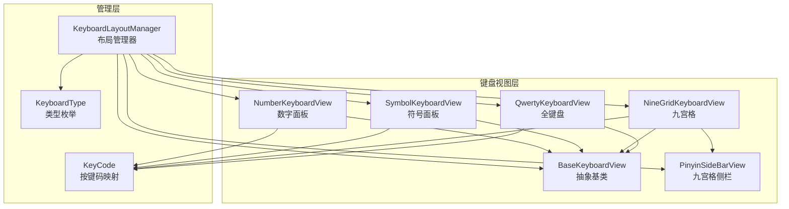
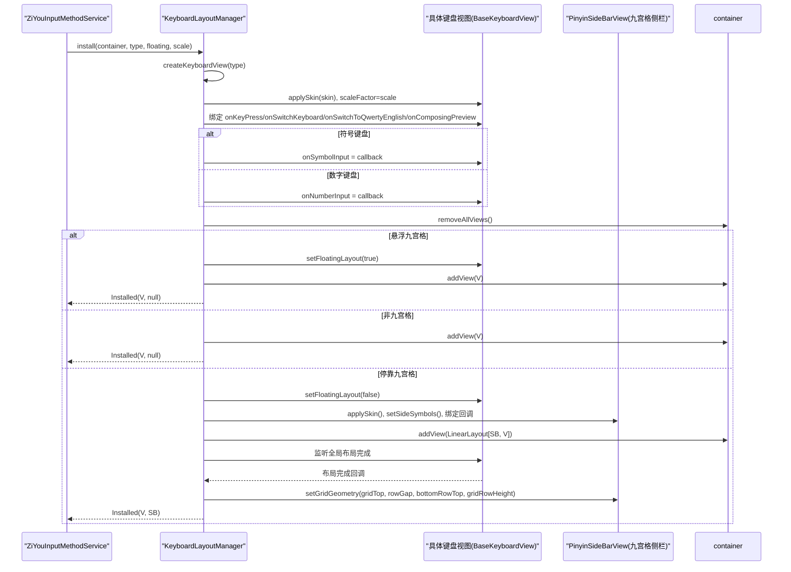
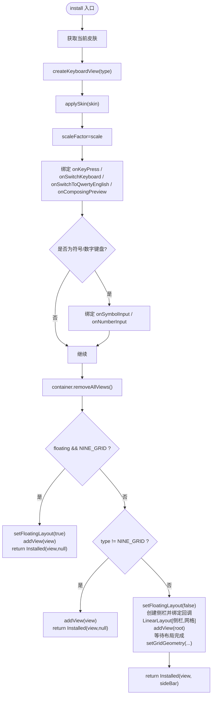
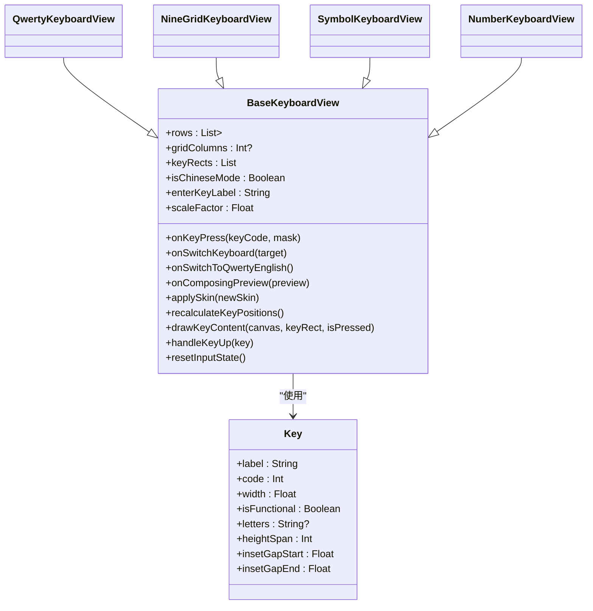
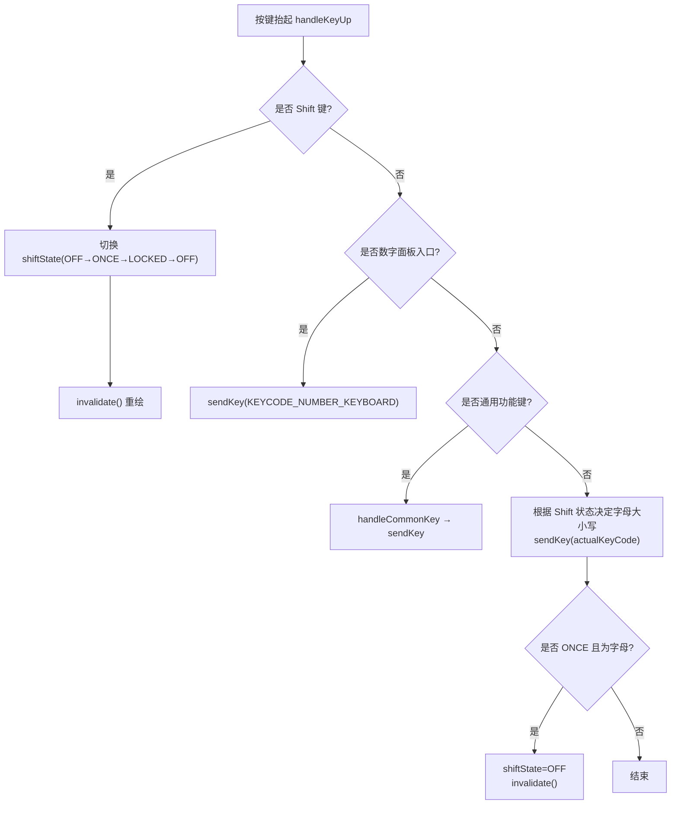
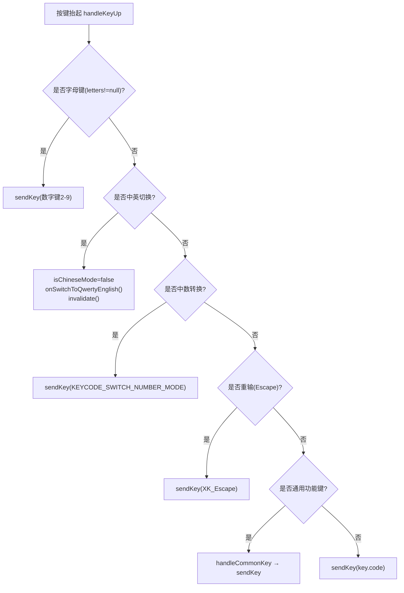
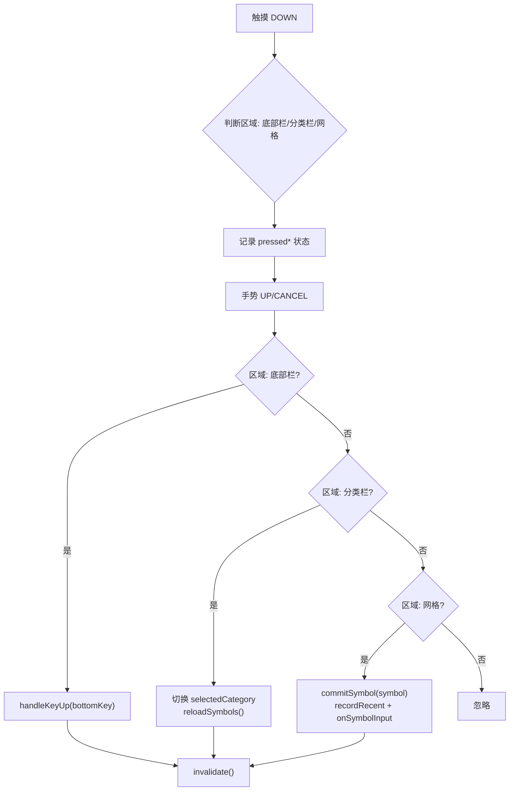
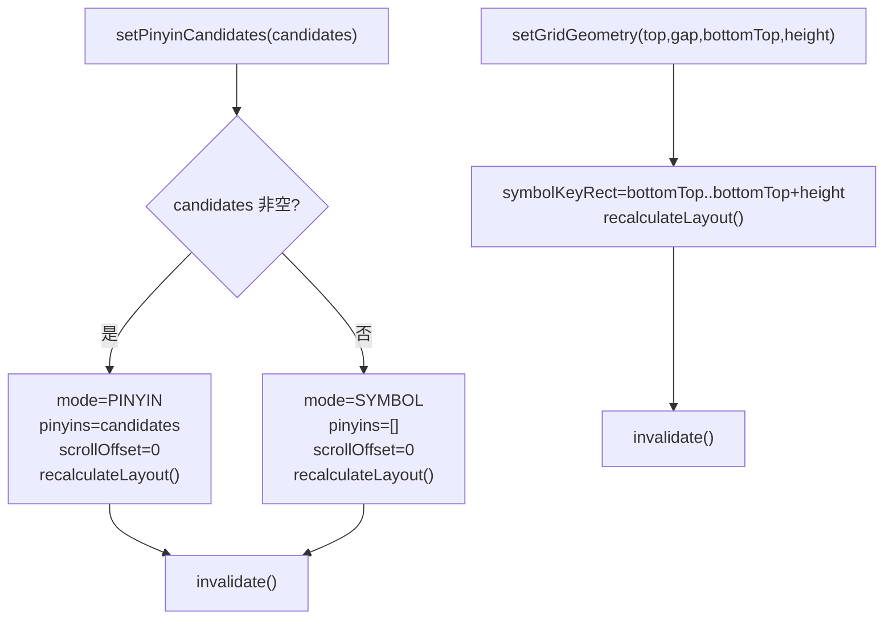
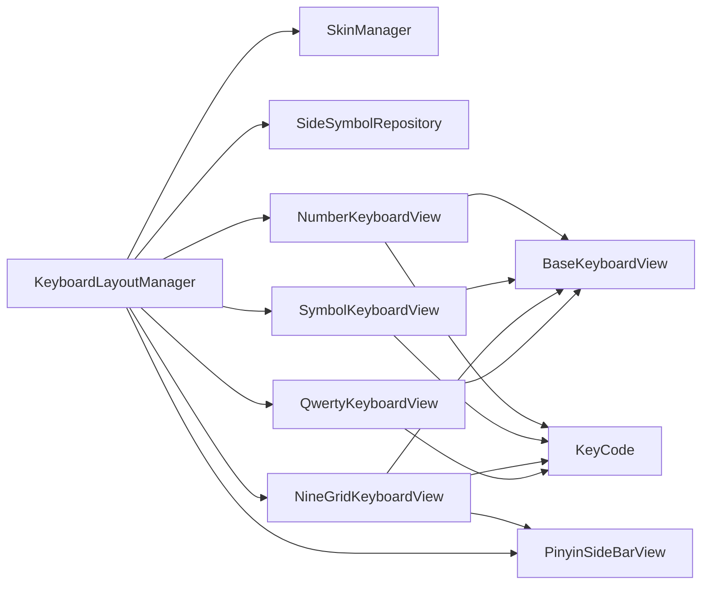

# 键盘布局管理

<cite>
**本文引用的文件**   
- [KeyboardLayoutManager.kt](file://app/src/main/java/com/ziyou/ime/ime/KeyboardLayoutManager.kt)
- [KeyboardType.kt](file://app/src/main/java/com/ziyou/ime/ime/KeyboardType.kt)
- [BaseKeyboardView.kt](file://app/src/main/java/com/ziyou/ime/ime/BaseKeyboardView.kt)
- [QwertyKeyboardView.kt](file://app/src/main/java/com/ziyou/ime/ime/QwertyKeyboardView.kt)
- [NineGridKeyboardView.kt](file://app/src/main/java/com/ziyou/ime/ime/NineGridKeyboardView.kt)
- [SymbolKeyboardView.kt](file://app/src/main/java/com/ziyou/ime/ime/SymbolKeyboardView.kt)
- [PinyinSideBarView.kt](file://app/src/main/java/com/ziyou/ime/ime/PinyinSideBarView.kt)
- [KeyCode.kt](file://app/src/main/java/com/ziyou/ime/ime/KeyCode.kt)
</cite>

## 目录
1. [引言](#引言)
2. [项目结构](#项目结构)
3. [核心组件](#核心组件)
4. [架构总览](#架构总览)
5. [详细组件分析](#详细组件分析)
6. [依赖关系分析](#依赖关系分析)
7. [性能考量](#性能考量)
8. [故障排查指南](#故障排查指南)
9. [结论](#结论)
10. [附录](#附录)

## 引言
本技术文档聚焦输入法项目的“键盘布局管理”子系统，围绕 KeyboardLayoutManager 的键盘视图创建与布局组装机制展开，覆盖 QWERTY、九宫格（T9）、符号、数字等键盘类型的实例化与配置；详解 install 方法的工作流程（容器清空、视图创建、回调绑定、悬浮模式适配）；阐述键盘视图的生命周期管理与状态重置；说明键盘切换的实现逻辑（布局持久化、状态恢复、引擎同步）；并深入解析九宫格复合布局的组装过程（主键盘区与侧边栏的组合与对齐）。文档以代码级分析与图示为主，辅以可操作的排障建议与最佳实践。

## 项目结构
键盘布局管理位于 ime 包内，采用“基类 + 具体布局 + 管理器”的分层组织：
- BaseKeyboardView：抽象出所有键盘共用的绘制、触摸、皮肤、缩放、按键模型与通用功能键处理。
- 具体键盘视图：QwertyKeyboardView、NineGridKeyboardView、SymbolKeyboardView（以及 NumberKeyboardView 的占位实现），各自定义 rows 布局与 handleKeyUp 输入逻辑。
- KeyboardLayoutManager：负责根据 KeyboardType 选择并创建具体键盘视图，完成安装、回调绑定、悬浮/停靠形态装配与侧栏组合。
- PinyinSideBarView：九宫格停靠形态下的左侧拼音/符号侧栏，提供候选拼音或自定义符号列表，底部固定「符号」键与网格底行对齐。
- KeyCode：Android KeyEvent 到 Rime keysym 的映射与修饰掩码构建工具。
- KeyboardType：键盘类型枚举，声明强制方案、是否允许自选方案、是否作为持久化主键盘等元信息。

**图表来源** 
- [KeyboardLayoutManager.kt:1-145](file://app/src/main/java/com/ziyou/ime/ime/KeyboardLayoutManager.kt#L1-L145)
- [KeyboardType.kt:1-55](file://app/src/main/java/com/ziyou/ime/ime/KeyboardType.kt#L1-L55)
- [BaseKeyboardView.kt:1-619](file://app/src/main/java/com/ziyou/ime/ime/BaseKeyboardView.kt#L1-L619)
- [QwertyKeyboardView.kt:1-139](file://app/src/main/java/com/ziyou/ime/ime/QwertyKeyboardView.kt#L1-L139)
- [NineGridKeyboardView.kt:1-288](file://app/src/main/java/com/ziyou/ime/ime/NineGridKeyboardView.kt#L1-L288)
- [SymbolKeyboardView.kt:1-533](file://app/src/main/java/com/ziyou/ime/ime/SymbolKeyboardView.kt#L1-L533)
- [PinyinSideBarView.kt:1-397](file://app/src/main/java/com/ziyou/ime/ime/PinyinSideBarView.kt#L1-L397)
- [KeyCode.kt:1-244](file://app/src/main/java/com/ziyou/ime/ime/KeyCode.kt#L1-L244)

**章节来源**
- [KeyboardLayoutManager.kt:1-145](file://app/src/main/java/com/ziyou/ime/ime/KeyboardLayoutManager.kt#L1-L145)
- [KeyboardType.kt:1-55](file://app/src/main/java/com/ziyou/ime/ime/KeyboardType.kt#L1-L55)
- [BaseKeyboardView.kt:1-619](file://app/src/main/java/com/ziyou/ime/ime/BaseKeyboardView.kt#L1-L619)

## 核心组件
- KeyboardLayoutManager：集中管理键盘视图的创建、安装与装配；通过 Callbacks 将交互事件上抛给 Service 层；支持悬浮/停靠两种形态；对九宫格进行侧栏组合与几何对齐。
- BaseKeyboardView：统一键盘绘制、触摸、长按重复、皮肤与缩放、按键矩形计算与缓存、通用功能键处理（中英文切换、符号面板入口等）。
- QwertyKeyboardView：标准 QWERTY 四行布局，Shift 大小写切换，中英文切换与数字面板入口。
- NineGridKeyboardView：九宫格 T9 布局，字母键直接发送数字键，由 t9.schema 消歧；底行在悬浮/停靠形态下不同；暴露网格几何供侧栏对齐。
- SymbolKeyboardView：分类导航 + 符号网格，点击上屏、长按收藏、返回键回退；纯 Canvas 自绘，复用主题与缩放。
- PinyinSideBarView：九宫格停靠形态左侧栏，支持拼音候选与自定义符号列表，底部固定「符号」键与网格底行对齐。
- KeyCode：Android KeyEvent 到 Rime keysym 的映射与修饰掩码构建。
- KeyboardType：键盘类型元数据（强制方案、是否允许自选、是否持久化主键盘）。

**章节来源**
- [KeyboardLayoutManager.kt:1-145](file://app/src/main/java/com/ziyou/ime/ime/KeyboardLayoutManager.kt#L1-L145)
- [BaseKeyboardView.kt:1-619](file://app/src/main/java/com/ziyou/ime/ime/BaseKeyboardView.kt#L1-L619)
- [QwertyKeyboardView.kt:1-139](file://app/src/main/java/com/ziyou/ime/ime/QwertyKeyboardView.kt#L1-L139)
- [NineGridKeyboardView.kt:1-288](file://app/src/main/java/com/ziyou/ime/ime/NineGridKeyboardView.kt#L1-L288)
- [SymbolKeyboardView.kt:1-533](file://app/src/main/java/com/ziyou/ime/ime/SymbolKeyboardView.kt#L1-L533)
- [PinyinSideBarView.kt:1-397](file://app/src/main/java/com/ziyou/ime/ime/PinyinSideBarView.kt#L1-L397)
- [KeyCode.kt:1-244](file://app/src/main/java/com/ziyou/ime/ime/KeyCode.kt#L1-L244)
- [KeyboardType.kt:1-55](file://app/src/main/java/com/ziyou/ime/ime/KeyboardType.kt#L1-L55)

## 架构总览
键盘布局管理的整体调用链与服务交互如下：

**图表来源** 
- [KeyboardLayoutManager.kt:59-143](file://app/src/main/java/com/ziyou/ime/ime/KeyboardLayoutManager.kt#L59-L143)
- [BaseKeyboardView.kt:283-290](file://app/src/main/java/com/ziyou/ime/ime/BaseKeyboardView.kt#L283-L290)
- [NineGridKeyboardView.kt:114-120](file://app/src/main/java/com/ziyou/ime/ime/NineGridKeyboardView.kt#L114-L120)
- [PinyinSideBarView.kt:240-250](file://app/src/main/java/com/ziyou/ime/ime/PinyinSideBarView.kt#L240-L250)

## 详细组件分析

### KeyboardLayoutManager：键盘视图创建与安装
- 视图创建：createKeyboardView 根据 KeyboardType 返回对应子类实例（QWERTY、NINE_GRID、SYMBOL、NUMBER）。
- 安装流程 install：
  - 获取当前皮肤并应用到视图；设置 scaleFactor；绑定各类回调（按键、切换、预览、英文直切等）。
  - 符号/数字键盘的特殊回调绑定到统一的 commit 出口（onSideSymbolInput）。
  - 容器清空后按形态分支：
    - 悬浮九宫格：setFloatingLayout(true)，直接添加视图，返回 Installed(view, null)。
    - 非九宫格：直接添加视图，返回 Installed(view, null)。
    - 停靠九宫格：setFloatingLayout(false)，创建 PinyinSideBarView，应用皮肤与侧栏符号，绑定侧栏回调；使用横向 LinearLayout 组合 [侧栏][网格]，权重约 1.8 : 8.2；布局完成后通过 ViewTreeObserver 获取网格几何并同步给侧栏，使底部「符号」键与网格底行对齐。
- 返回值 Installed：包含 keyboardView 与可选的 pinyinSideBar 引用，便于上层维护与生命周期管理。

**图表来源** 
- [KeyboardLayoutManager.kt:59-143](file://app/src/main/java/com/ziyou/ime/ime/KeyboardLayoutManager.kt#L59-L143)

**章节来源**
- [KeyboardLayoutManager.kt:41-47](file://app/src/main/java/com/ziyou/ime/ime/KeyboardLayoutManager.kt#L41-L47)
- [KeyboardLayoutManager.kt:59-143](file://app/src/main/java/com/ziyou/ime/ime/KeyboardLayoutManager.kt#L59-L143)

### BaseKeyboardView：键盘视图基类
- 布局模型：基于 rows（行×Key）与可选 gridColumns（列网格）两种模型；自动计算单位宽度与按键矩形，缓存 keyRects 用于绘制与命中检测。
- 绘制系统：背景板、按键阴影/描边/填充、文字居中绘制；支持 Filled/Outline/Flat 三种 keyStyle；回车强调色与按下态高亮。
- 触摸与长按：ACTION_DOWN/MOVE/UP/CANCEL 处理；支持长按连续触发（默认仅退格键），重复任务调度与取消。
- 皮肤与缩放：applySkin 刷新尺寸与画笔；scaleFactor 影响 dp/sp 换算与尺寸重算；onScaleChanged 供子类同步自有画笔字号。
- 通用功能键：handleCommonKey 处理中英文切换、符号面板入口；sendKey 统一上抛 onKeyPress。
- 生命周期与状态清理：onDetachedFromWindow、onWindowFocusChanged 中清理按压状态与重复任务；resetInputState 供上层在结束输入时重置临时状态。

**图表来源** 
- [BaseKeyboardView.kt:43-168](file://app/src/main/java/com/ziyou/ime/ime/BaseKeyboardView.kt#L43-L168)
- [BaseKeyboardView.kt:283-313](file://app/src/main/java/com/ziyou/ime/ime/BaseKeyboardView.kt#L283-L313)
- [BaseKeyboardView.kt:337-384](file://app/src/main/java/com/ziyou/ime/ime/BaseKeyboardView.kt#L337-L384)
- [BaseKeyboardView.kt:487-557](file://app/src/main/java/com/ziyou/ime/ime/BaseKeyboardView.kt#L487-L557)
- [BaseKeyboardView.kt:559-619](file://app/src/main/java/com/ziyou/ime/ime/BaseKeyboardView.kt#L559-L619)

**章节来源**
- [BaseKeyboardView.kt:1-619](file://app/src/main/java/com/ziyou/ime/ime/BaseKeyboardView.kt#L1-L619)

### QwertyKeyboardView：全键盘布局
- 布局：10 列网格，第二行半列缩进居中；底行包含数字面板、逗号、空格、中英文切换、换行。
- Shift 状态：OFF/ONCE/LOCKED，影响字母大小写与 Shift 键显示样式。
- 按键处理：Shift 循环切换；数字面板入口；通用功能键（中英文切换、符号面板）；普通字母键根据 Shift 状态发送对应 keysym。

**图表来源** 
- [QwertyKeyboardView.kt:104-137](file://app/src/main/java/com/ziyou/ime/ime/QwertyKeyboardView.kt#L104-L137)

**章节来源**
- [QwertyKeyboardView.kt:1-139](file://app/src/main/java/com/ziyou/ime/ime/QwertyKeyboardView.kt#L1-L139)

### NineGridKeyboardView：九宫格（T9）布局
- 布局：前三行为标准 T9 字母键网格（带 letters 序列），右侧功能列含退格、重输、跨行换行；第四行停靠形态为「123/空格/英」，悬浮形态增加「符」键。
- 输入逻辑：字母键直接发送数字键（2-9），由 t9.schema 的 speller/algebra 派生拼音并消歧；「重输」发送 Escape；「分词」发送撇号分隔音节。
- 悬浮/停靠切换：setFloatingLayout 切换第四行变体并重新计算布局。
- 网格几何：暴露 gridUnitWidth、gridRowHeight、gridTop、gridRowGap、bottomRowTop 供侧栏对齐。

**图表来源** 
- [NineGridKeyboardView.kt:253-280](file://app/src/main/java/com/ziyou/ime/ime/NineGridKeyboardView.kt#L253-L280)

**章节来源**
- [NineGridKeyboardView.kt:1-288](file://app/src/main/java/com/ziyou/ime/ime/NineGridKeyboardView.kt#L1-L288)

### SymbolKeyboardView：符号面板
- 布局：左侧分类栏（滚动），右侧符号网格（5 列，滚动），底部功能栏（返回、空格、退格、换行）。
- 交互：点击符号上屏（记录最近），长按加入常用/从常用移除；分类点击切换内容并回到顶部；返回键发送 KEYCODE_SYMBOL 由 Service 恢复进入前布局；退格长按连续删除。
- 绘制：纯 Canvas 自绘，仅绘制可见区域，命中检测坐标反算行列，避免大量矩形缓存。

**图表来源** 
- [SymbolKeyboardView.kt:353-467](file://app/src/main/java/com/ziyou/ime/ime/SymbolKeyboardView.kt#L353-L467)

**章节来源**
- [SymbolKeyboardView.kt:1-533](file://app/src/main/java/com/ziyou/ime/ime/SymbolKeyboardView.kt#L1-L533)

### PinyinSideBarView：九宫格侧栏
- 模式：拼音模式（展示候选拼音，点击回调 onPinyinSelect）与符号模式（展示自定义符号，点击回调 onSymbolInput，末尾「＋」页脚回调 onAddSymbol）。
- 对齐：setGridGeometry 接收网格几何（首行顶部、行间距、底行顶部、单行高度），确保底部「符号」键与网格底行水平对齐。
- 绘制：列表整体圆角裁剪，项间紧密排列；阴影与键盘按键同源；文本按比例缩放以适应单元宽度。

**图表来源** 
- [PinyinSideBarView.kt:215-227](file://app/src/main/java/com/ziyou/ime/ime/PinyinSideBarView.kt#L215-L227)
- [PinyinSideBarView.kt:240-250](file://app/src/main/java/com/ziyou/ime/ime/PinyinSideBarView.kt#L240-L250)

**章节来源**
- [PinyinSideBarView.kt:1-397](file://app/src/main/java/com/ziyou/ime/ime/PinyinSideBarView.kt#L1-L397)

### KeyboardType：键盘类型元数据
- 字段：forcedSchemaId（强制绑定专用方案，如九宫格绑定 t9）、allowsSchemaChoice（是否允许用户自选方案）、pickerLabel（是否作为持久化主键盘入选选择面板）。
- 伴生对象：T9_SCHEMA_ID、FORCED_SCHEMA_IDS、PICKER_TYPES、fromName(name) 安全解析。

**章节来源**
- [KeyboardType.kt:1-55](file://app/src/main/java/com/ziyou/ime/ime/KeyboardType.kt#L1-L55)

### KeyCode：按键码映射
- X11 Keysym 常量：退格、回车、Escape、空格、方向键、修饰键等。
- Android KeyEvent 到 Rime keysym 的转换：字母、数字、功能键、符号键映射；修饰掩码构建。

**章节来源**
- [KeyCode.kt:1-244](file://app/src/main/java/com/ziyou/ime/ime/KeyCode.kt#L1-L244)

## 依赖关系分析
- KeyboardLayoutManager 依赖 SkinManager（皮肤）、SideSymbolRepository（侧栏符号）、各具体键盘视图与 PinyinSideBarView。
- 具体键盘视图均继承 BaseKeyboardView，复用绘制、触摸、皮肤与缩放能力。
- NineGridKeyboardView 与 PinyinSideBarView 通过几何参数耦合，保证停靠形态下的视觉对齐。
- 所有键盘视图通过 KeyCode 与 Rime 引擎交互（keysym 值）。
- KeyboardType 作为单一来源，驱动布局与方案映射。

**图表来源** 
- [KeyboardLayoutManager.kt:1-145](file://app/src/main/java/com/ziyou/ime/ime/KeyboardLayoutManager.kt#L1-L145)
- [BaseKeyboardView.kt:1-619](file://app/src/main/java/com/ziyou/ime/ime/BaseKeyboardView.kt#L1-L619)
- [NineGridKeyboardView.kt:1-288](file://app/src/main/java/com/ziyou/ime/ime/NineGridKeyboardView.kt#L1-L288)
- [PinyinSideBarView.kt:1-397](file://app/src/main/java/com/ziyou/ime/ime/PinyinSideBarView.kt#L1-L397)
- [KeyCode.kt:1-244](file://app/src/main/java/com/ziyou/ime/ime/KeyCode.kt#L1-L244)

**章节来源**
- [KeyboardLayoutManager.kt:1-145](file://app/src/main/java/com/ziyou/ime/ime/KeyboardLayoutManager.kt#L1-L145)
- [BaseKeyboardView.kt:1-619](file://app/src/main/java/com/ziyou/ime/ime/BaseKeyboardView.kt#L1-L619)

## 性能考量
- 绘制优化：SymbolKeyboardView 仅绘制可见区域，命中检测坐标反算行列，避免大量矩形缓存；BaseKeyboardView 的 keyRects 缓存减少重复计算。
- 触摸与长按：BaseKeyboardView 的长按重复任务仅在必要时启动并在 ACTION_UP/CANCEL 及时取消，避免内存泄漏与多余按键事件。
- 布局测量：BaseKeyboardView 的 onMeasure 基于行数与键高倍率快速计算总高度；NineGridKeyboardView 的 unitWidthOf 以基准行推导单位宽度，降低复杂度。
- 皮肤与缩放：applySkin 与 onScaleChanged 集中刷新画笔与尺寸，避免频繁重建；dp/sp 换算叠加 scaleFactor 实现悬浮缩放零回归。

[本节为通用指导，不直接分析具体文件]

## 故障排查指南
- 按键无响应：检查 onTouchEvent 是否正确分发至 handleKeyUp；确认 keyRects 已正确计算；查看 onKeyPress 回调是否被正确绑定。
- 长按重复异常：确认 isRepeatableKey 与 keyRepeatRunnable 的调度与取消逻辑；在 onDetachedFromWindow 与 onWindowFocusChanged 中清理状态。
- 悬浮缩放错位：检查 scaleFactor 变更是否触发 refreshDimensions 与 onScaleChanged；确认子类自有画笔字号已同步。
- 九宫格侧栏对齐问题：确认 setGridGeometry 在布局完成后被调用；检查 gridTop、rowGap、bottomRowTop、gridRowHeight 参数是否正确。
- 符号面板无法上屏：检查 onSymbolInput 是否绑定；确认 SymbolRepository 的最近/常用操作正常。

**章节来源**
- [BaseKeyboardView.kt:487-557](file://app/src/main/java/com/ziyou/ime/ime/BaseKeyboardView.kt#L487-L557)
- [BaseKeyboardView.kt:546-557](file://app/src/main/java/com/ziyou/ime/ime/BaseKeyboardView.kt#L546-L557)
- [PinyinSideBarView.kt:240-250](file://app/src/main/java/com/ziyou/ime/ime/PinyinSideBarView.kt#L240-L250)
- [SymbolKeyboardView.kt:496-517](file://app/src/main/java/com/ziyou/ime/ime/SymbolKeyboardView.kt#L496-L517)

## 结论
KeyboardLayoutManager 通过清晰的职责分离与回调机制，实现了多键盘类型的统一创建、安装与装配；BaseKeyboardView 提供了强大的通用能力，使新增键盘类型只需关注布局与输入逻辑；九宫格停靠形态下的侧栏组合与几何对齐确保了良好的用户体验。结合 KeyboardType 的元数据与 KeyCode 的映射，整个键盘布局管理系统具备良好的扩展性与可维护性。

[本节为总结，不直接分析具体文件]

## 附录
- 键盘切换与引擎同步：KeyboardType.forcedSchemaId 指定九宫格绑定 t9 方案，由 Service 层在 applyEngineForKeyboard 中同步；allowsSchemaChoice 控制是否允许用户自选方案；pickerLabel 决定布局是否作为持久化主键盘入选选择面板。
- 生命周期管理：BaseKeyboardView.resetInputState 供 Service 在 onFinishInputView 时重置临时状态；onDetachedFromWindow 与 onWindowFocusChanged 清理按压与重复任务，避免状态残留。

**章节来源**
- [KeyboardType.kt:27-54](file://app/src/main/java/com/ziyou/ime/ime/KeyboardType.kt#L27-L54)
- [BaseKeyboardView.kt:603-619](file://app/src/main/java/com/ziyou/ime/ime/BaseKeyboardView.kt#L603-L619)