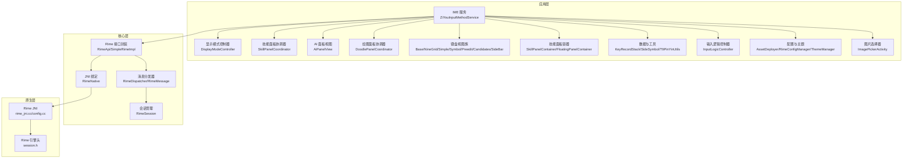
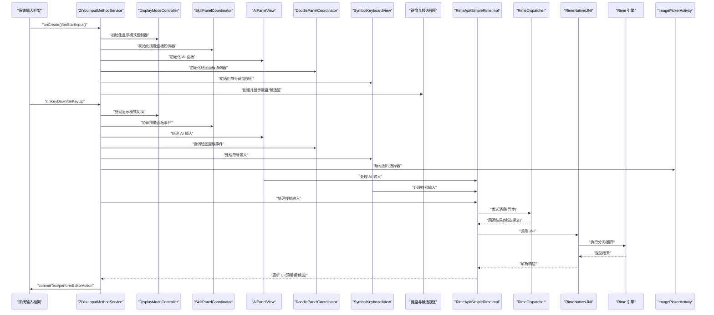
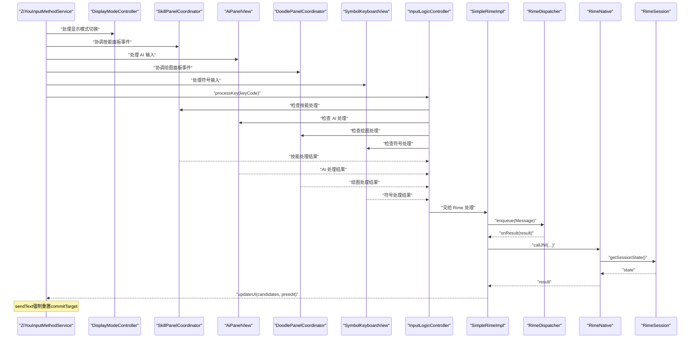
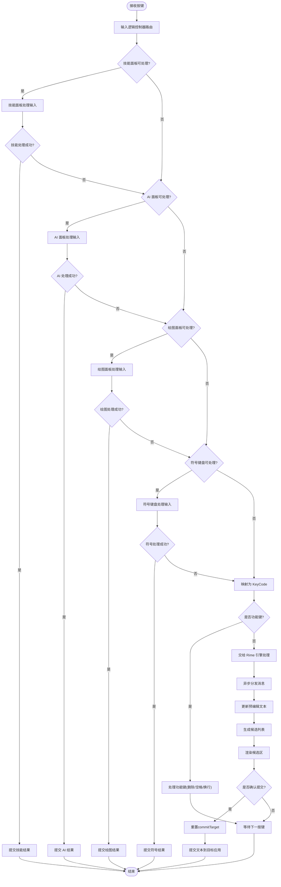
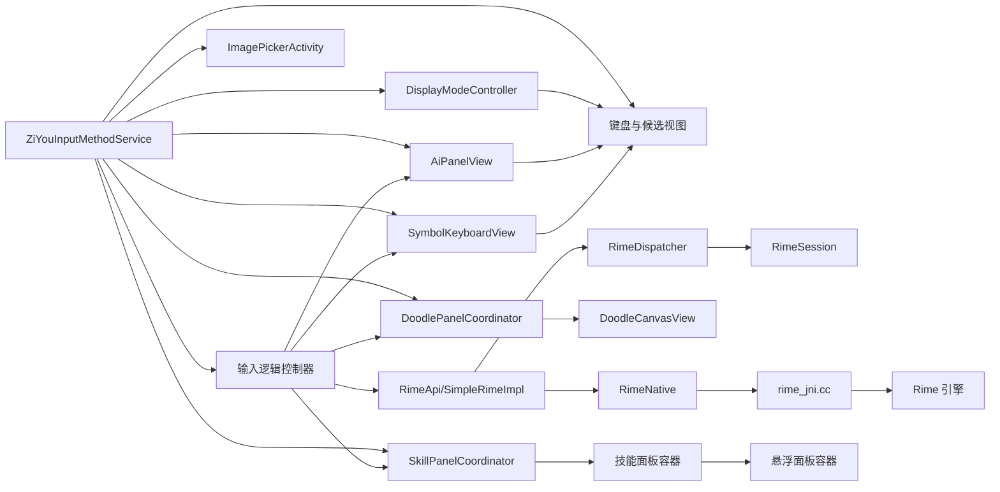

# 输入法服务

<cite>
**本文引用的文件**   
- [ZiYouInputMethodService.kt](file://app/src/main/java/com/ziyou/ime/ime/ZiYouInputMethodService.kt)
- [DisplayModeController.kt](file://app/src/main/java/com/ziyou/ime/ime/DisplayModeController.kt)
- [SkillPanelCoordinator.kt](file://app/src/main/java/com/ziyou/ime/ime/SkillPanelCoordinator.kt)
- [SkillPanelContainer.kt](file://app/src/main/java/com/ziyou/ime/ime/SkillPanelContainer.kt)
- [FloatingPanelContainer.kt](file://app/src/main/java/com/ziyou/ime/ime/FloatingPanelContainer.kt)
- [BaseKeyboardView.kt](file://app/src/main/java/com/ziyou/ime/ime/BaseKeyboardView.kt)
- [NineGridKeyboardView.kt](file://app/src/main/java/com/ziyou/ime/ime/NineGridKeyboardView.kt)
- [SimpleKeyboardView.kt](file://app/src/main/java/com/ziyou/ime/ime/SimpleKeyboardView.kt)
- [PreeditOverlayView.kt](file://app/src/main/java/com/ziyou/ime/ime/PreeditOverlayView.kt)
- [SimpleCandidatesView.kt](file://app/src/main/java/com/ziyou/ime/ime/SimpleCandidatesView.kt)
- [PinyinSideBarView.kt](file://app/src/main/java/com/ziyou/ime/ime/PinyinSideBarView.kt)
- [KeyCode.kt](file://app/src/main/java/com/ziyou/ime/ime/KeyCode.kt)
- [KeyboardType.kt](file://app/src/main/java/com/ziyou/ime/ime/KeyboardType.kt)
- [InputLogicController.kt](file://app/src/main/java/com/ziyou/ime/ime/InputLogicController.kt)
- [KeyboardLayoutManager.kt](file://app/src/main/java/com/ziyou/ime/ime/KeyboardLayoutManager.kt)
- [DisplayMode.kt](file://app/src/main/java/com/ziyou/ime/ime/DisplayMode.kt)
- [SymbolKeyboardView.kt](file://app/src/main/java/com/ziyou/ime/ime/SymbolKeyboardView.kt)
- [RimeApi.kt](file://app/src/main/java/com/ziyou/ime/core/RimeApi.kt)
- [RimeDispatcher.kt](file://app/src/main/java/com/ziyou/ime/core/RimeDispatcher.kt)
- [RimeMessage.kt](file://app/src/main/java/com/ziyou/ime/core/RimeMessage.kt)
- [RimeNative.kt](file://app/src/main/java/com/ziyou/ime/core/RimeNative.kt)
- [SimpleRimeImpl.kt](file://app/src/main/java/com/ziyou/ime/core/SimpleRimeImpl.kt)
- [ProtoTypes.kt](file://app/src/main/java/com/ziyou/ime/core/ProtoTypes.kt)
- [RimeSession.kt](file://app/src/main/java/com/ziyou/ime/daemon/RimeSession.kt)
- [AssetDeployer.kt](file://app/src/main/java/com/ziyou/ime/config/AssetDeployer.kt)
- [RimeConfigManager.kt](file://app/src/main/java/com/ziyou/ime/config/RimeConfigManager.kt)
- [ThemeManager.kt](file://app/src/main/java/com/ziyou/ime/config/ThemeManager.kt)
- [T9PinYinUtils.kt](file://app/src/main/java/com/ziyou/ime/util/T9PinYinUtils.kt)
- [input_method.xml](file://app/src/main/res/xml/input_method.xml)
- [AndroidManifest.xml](file://app/src/main/AndroidManifest.xml)
- [rime_jni.cc](file://app/src/main/jni/librime_jni/rime_jni.cc)
- [config.cc](file://app/src/main/jni/librime_jni/config.cc)
- [session.h](file://app/src/main/jni/librime_jni/session.h)
- [AiPanelView.kt](file://app/src/main/java/com/ziyou/ime/ime/AiPanelView.kt)
- [DoodleCanvasView.kt](file://app/src/main/java/com/ziyou/ime/ime/DoodleCanvasView.kt)
- [DoodleImageExporter.kt](file://app/src/main/java/com/ziyou/ime/ime/DoodleImageExporter.kt)
- [DoodlePanelCoordinator.kt](file://app/src/main/java/com/ziyou/ime/ime/DoodlePanelCoordinator.kt)
- [ImagePickerActivity.kt](file://app/src/main/java/com/ziyou/ime/ime/ImagePickerActivity.kt)
</cite>

## 更新摘要
**变更内容**   
- ZiYouInputMethodService 增强了 AI 面板、绘图画布、图片选择器和新输入模式协调功能，新增 206 行代码支持
- 新增 AiPanelView 组件支持 AI 聊天和智能输入功能
- 新增 DoodleCanvasView 和 DoodlePanelCoordinator 支持手绘板和图像导出功能
- 新增 ImagePickerActivity 支持图片选择和插入功能
- 增强了输入法服务的整体架构，提升了与 AI 功能的集成能力

## 目录
1. [简介](#简介)
2. [项目结构](#项目结构)
3. [核心组件](#核心组件)
4. [架构总览](#架构总览)
5. [详细组件分析](#详细组件分析)
6. [依赖关系分析](#依赖关系分析)
7. [性能考虑](#性能考虑)
8. [故障排查指南](#故障排查指南)
9. [结论](#结论)
10. [附录](#附录)

## 简介
本技术文档围绕 ZiYouInputMethodService 输入法服务，系统阐述其继承关系、生命周期管理、与 Android IME API 的集成方式（软键盘显示、硬键盘事件处理、焦点管理）、配置 XML 定义与属性设置、输入法切换与语言区域机制、权限与安全考量、与系统输入框架的集成与兼容性处理，以及性能优化、电池优化策略、调试技巧与常见问题排查。文档以代码级为依据，辅以架构图、时序图与流程图，帮助读者从整体到细节全面理解该输入法实现。

**更新** 本次更新重点介绍了 ZiYouInputMethodService 对 AI 面板、绘图功能和图片选择器的增强，新增了 AiPanelView、DoodleCanvasView、DoodlePanelCoordinator 和 ImagePickerActivity 等组件来支持智能输入、手绘板和图像选择功能，进一步完善了输入法的智能化和多媒体处理能力。

## 项目结构
本项目采用分层与模块化组织：
- 应用层（app）包含 IME 服务、UI 视图、配置与资源等
- 核心逻辑（core-logic）用于关联与测试（当前为空模块）
- 预编译 librime（librime-prebuilt）提供 Rime 引擎能力
- JNI 桥接（jni/librime_jni）连接 Java/Kotlin 与 C++ Rime

图表来源
- [ZiYouInputMethodService.kt](file://app/src/main/java/com/ziyou/ime/ime/ZiYouInputMethodService.kt)
- [DisplayModeController.kt](file://app/src/main/java/com/ziyou/ime/ime/DisplayModeController.kt)
- [SkillPanelCoordinator.kt](file://app/src/main/java/com/ziyou/ime/ime/SkillPanelCoordinator.kt)
- [AiPanelView.kt](file://app/src/main/java/com/ziyou/ime/ime/AiPanelView.kt)
- [DoodlePanelCoordinator.kt](file://app/src/main/java/com/ziyou/ime/ime/DoodlePanelCoordinator.kt)
- [ImagePickerActivity.kt](file://app/src/main/java/com/ziyou/ime/ime/ImagePickerActivity.kt)
- [InputLogicController.kt](file://app/src/main/java/com/ziyou/ime/ime/InputLogicController.kt)
- [BaseKeyboardView.kt](file://app/src/main/java/com/ziyou/ime/ime/BaseKeyboardView.kt)
- [NineGridKeyboardView.kt](file://app/src/main/java/com/ziyou/ime/ime/NineGridKeyboardView.kt)
- [SimpleKeyboardView.kt](file://app/src/main/java/com/ziyou/ime/ime/SimpleKeyboardView.kt)
- [SymbolKeyboardView.kt](file://app/src/main/java/com/ziyou/ime/ime/SymbolKeyboardView.kt)
- [PreeditOverlayView.kt](file://app/src/main/java/com/ziyou/ime/ime/PreeditOverlayView.kt)
- [SimpleCandidatesView.kt](file://app/src/main/java/com/ziyou/ime/ime/SimpleCandidatesView.kt)
- [PinyinSideBarView.kt](file://app/src/main/java/com/ziyou/ime/ime/PinyinSideBarView.kt)
- [RimeApi.kt](file://app/src/main/java/com/ziyou/ime/core/RimeApi.kt)
- [RimeDispatcher.kt](file://app/src/main/java/com/ziyou/ime/core/RimeDispatcher.kt)
- [RimeNative.kt](file://app/src/main/java/com/ziyou/ime/core/RimeNative.kt)
- [SimpleRimeImpl.kt](file://app/src/main/java/com/ziyou/ime/core/SimpleRimeImpl.kt)
- [RimeSession.kt](file://app/src/main/java/com/ziyou/ime/daemon/RimeSession.kt)
- [rime_jni.cc](file://app/src/main/jni/librime_jni/rime_jni.cc)
- [config.cc](file://app/src/main/jni/librime_jni/config.cc)
- [session.h](file://app/src/main/jni/librime_jni/session.h)

章节来源
- [AndroidManifest.xml](file://app/src/main/AndroidManifest.xml)
- [input_method.xml](file://app/src/main/res/xml/input_method.xml)

## 核心组件
- 输入法服务入口：ZiYouInputMethodService 负责 IME 生命周期、软键盘显示/隐藏、候选区与预编辑区渲染、按键事件路由、与 Rime 引擎交互，以及新增的技能面板管理和输入路由功能。
- **新增** AI 面板视图：AiPanelView 专门处理 AI 聊天和智能输入功能，支持自然语言处理和智能建议。
- **新增** 绘图面板协调器：DoodlePanelCoordinator 统一管理手绘板的生命周期、状态同步和事件协调。
- **新增** 绘图画布视图：DoodleCanvasView 提供手绘功能，支持画笔、橡皮擦和图像导出。
- **新增** 图片选择器：ImagePickerActivity 支持从相册选择图片或拍照获取图片并插入到输入框。
- 显示模式控制器：DisplayModeController 专门负责输入法显示模式的切换和管理，包括全屏模式、悬浮模式和嵌入模式。
- 技能面板协调器：SkillPanelCoordinator 统一管理技能面板的生命周期、状态同步和事件协调，替代了原来在 Service 中的复杂逻辑。
- 符号键盘视图：SymbolKeyboardView 专门处理符号输入面板的显示和交互，支持各种特殊字符和符号的快速输入。
- 键盘视图族：BaseKeyboardView 为基类，NineGridKeyboardView、SimpleKeyboardView、SymbolKeyboardView 等实现不同布局；PreeditOverlayView 展示预编辑文本；SimpleCandidatesView 展示候选词；PinyinSideBarView 提供拼音侧边栏。
- 技能面板容器：SkillPanelContainer 管理技能插件的显示和交互；FloatingPanelContainer 处理悬浮面板的生命周期和位置管理。
- 输入逻辑控制器：InputLogicController 协调各种输入源的处理逻辑，包括传统键盘输入和技能输入。
- 核心引擎封装：RimeApi/SimpleRimeImpl 抽象 Rime 操作；RimeDispatcher/RimeMessage 进行异步消息派发；RimeNative 通过 JNI 调用原生库；RimeSession 管理会话状态。
- 配置与资源：AssetDeployer 部署 Rime 资源；RimeConfigManager 管理配置项；ThemeManager 管理主题。
- 工具与数据：KeyRecordStack 记录键序列；SideSymbol 侧边符号；T9PinYinUtils 辅助 T9 拼音。

**更新** 架构重构后，ZiYouInputMethodService 的职责更加清晰，新增的 AI 面板、绘图功能和图片选择器进一步增强了输入法的智能化和多媒体处理能力，DisplayModeController 专注于显示模式管理，SkillPanelCoordinator 专注于技能面板协调，提升了代码的可维护性和扩展性。

章节来源
- [ZiYouInputMethodService.kt](file://app/src/main/java/com/ziyou/ime/ime/ZiYouInputMethodService.kt)
- [AiPanelView.kt](file://app/src/main/java/com/ziyou/ime/ime/AiPanelView.kt)
- [DoodlePanelCoordinator.kt](file://app/src/main/java/com/ziyou/ime/ime/DoodlePanelCoordinator.kt)
- [DoodleCanvasView.kt](file://app/src/main/java/com/ziyou/ime/ime/DoodleCanvasView.kt)
- [ImagePickerActivity.kt](file://app/src/main/java/com/ziyou/ime/ime/ImagePickerActivity.kt)
- [DisplayModeController.kt](file://app/src/main/java/com/ziyou/ime/ime/DisplayModeController.kt)
- [SkillPanelCoordinator.kt](file://app/src/main/java/com/ziyou/ime/ime/SkillPanelCoordinator.kt)
- [SymbolKeyboardView.kt](file://app/src/main/java/com/ziyou/ime/ime/SymbolKeyboardView.kt)
- [SkillPanelContainer.kt](file://app/src/main/java/com/ziyou/ime/ime/SkillPanelContainer.kt)
- [FloatingPanelContainer.kt](file://app/src/main/java/com/ziyou/ime/ime/FloatingPanelContainer.kt)
- [InputLogicController.kt](file://app/src/main/java/com/ziyou/ime/ime/InputLogicController.kt)
- [BaseKeyboardView.kt](file://app/src/main/java/com/ziyou/ime/ime/BaseKeyboardView.kt)
- [NineGridKeyboardView.kt](file://app/src/main/java/com/ziyou/ime/ime/NineGridKeyboardView.kt)
- [SimpleKeyboardView.kt](file://app/src/main/java/com/ziyou/ime/ime/SimpleKeyboardView.kt)
- [PreeditOverlayView.kt](file://app/src/main/java/com/ziyou/ime/ime/PreeditOverlayView.kt)
- [SimpleCandidatesView.kt](file://app/src/main/java/com/ziyou/ime/ime/SimpleCandidatesView.kt)
- [PinyinSideBarView.kt](file://app/src/main/java/com/ziyou/ime/ime/PinyinSideBarView.kt)
- [RimeApi.kt](file://app/src/main/java/com/ziyou/ime/core/RimeApi.kt)
- [RimeDispatcher.kt](file://app/src/main/java/com/ziyou/ime/core/RimeDispatcher.kt)
- [RimeMessage.kt](file://app/src/main/java/com/ziyou/ime/core/RimeMessage.kt)
- [RimeNative.kt](file://app/src/main/java/com/ziyou/ime/core/RimeNative.kt)
- [SimpleRimeImpl.kt](file://app/src/main/java/com/ziyou/ime/core/SimpleRimeImpl.kt)
- [RimeSession.kt](file://app/src/main/java/com/ziyou/ime/daemon/RimeSession.kt)
- [AssetDeployer.kt](file://app/src/main/java/com/ziyou/ime/config/AssetDeployer.kt)
- [RimeConfigManager.kt](file://app/src/main/java/com/ziyou/ime/config/RimeConfigManager.kt)
- [ThemeManager.kt](file://app/src/main/java/com/ziyou/ime/config/ThemeManager.kt)
- [KeyRecordStack.kt](file://app/src/main/java/com/ziyou/ime/data/KeyRecordStack.kt)
- [SideSymbol.kt](file://app/src/main/java/com/ziyou/ime/data/SideSymbol.kt)
- [T9PinYinUtils.kt](file://app/src/main/java/com/ziyou/ime/util/T9PinYinUtils.kt)

## 架构总览
输入法服务通过 Android IME API 与系统输入框架交互，使用自定义视图渲染键盘与候选区，并通过 JNI 调用 Rime 引擎完成分词与选词。新的架构通过 DisplayModeController 和 SkillPanelCoordinator 实现了更好的关注点分离，增强了系统的可维护性和扩展性。新增的 AiPanelView、DoodlePanelCoordinator 和 ImagePickerActivity 进一步完善了输入法的智能化和多媒体处理能力。

图表来源
- [ZiYouInputMethodService.kt](file://app/src/main/java/com/ziyou/ime/ime/ZiYouInputMethodService.kt)
- [DisplayModeController.kt](file://app/src/main/java/com/ziyou/ime/ime/DisplayModeController.kt)
- [SkillPanelCoordinator.kt](file://app/src/main/java/com/ziyou/ime/ime/SkillPanelCoordinator.kt)
- [AiPanelView.kt](file://app/src/main/java/com/ziyou/ime/ime/AiPanelView.kt)
- [DoodlePanelCoordinator.kt](file://app/src/main/java/com/ziyou/ime/ime/DoodlePanelCoordinator.kt)
- [SymbolKeyboardView.kt](file://app/src/main/java/com/ziyou/ime/ime/SymbolKeyboardView.kt)
- [ImagePickerActivity.kt](file://app/src/main/java/com/ziyou/ime/ime/ImagePickerActivity.kt)
- [SkillPanelContainer.kt](file://app/src/main/java/com/ziyou/ime/ime/SkillPanelContainer.kt)
- [InputLogicController.kt](file://app/src/main/java/com/ziyou/ime/ime/InputLogicController.kt)
- [RimeApi.kt](file://app/src/main/java/com/ziyou/ime/core/RimeApi.kt)
- [RimeDispatcher.kt](file://app/src/main/java/com/ziyou/ime/core/RimeDispatcher.kt)
- [RimeNative.kt](file://app/src/main/java/com/ziyou/ime/core/RimeNative.kt)
- [rime_jni.cc](file://app/src/main/jni/librime_jni/rime_jni.cc)

## 详细组件分析

### ZiYouInputMethodService 继承关系与生命周期
- 继承关系：继承自 Android InputMethodService，重写关键生命周期方法以管理 IME 状态、软键盘显示与焦点。
- 生命周期要点：
  - onCreate：初始化引擎、配置、视图工厂、消息分发器、显示模式控制器、技能面板协调器、AI 面板、绘图面板协调器和符号键盘视图
  - onStartInput：根据输入框类型决定键盘布局与候选区可见性，同时初始化显示模式、AI 面板、绘图面板和符号键盘支持
  - onRestartInput：重新适配输入上下文，确保所有面板状态正确
  - onFinishInput：释放资源、清理状态、关闭所有面板和视图
  - onVisibilityChanged：响应软键盘显示/隐藏，动态调整所有面板可见性
  - onComputeInsets：计算插入区域，避免遮挡任何面板和其他界面元素
- 焦点管理：通过 getCurrentInputConnection() 与 EditorInfo 判断目标应用期望的输入行为，确保正确提交文本与动作。

**更新** 重构后的 ZiYouInputMethodService 将显示模式管理委托给 DisplayModeController，将技能面板协调委托给 SkillPanelCoordinator，并新增了对 AiPanelView、DoodlePanelCoordinator 和 SymbolKeyboardView 的管理，大幅简化了服务本身的复杂度。

章节来源
- [ZiYouInputMethodService.kt](file://app/src/main/java/com/ziyou/ime/ime/ZiYouInputMethodService.kt)
- [DisplayModeController.kt](file://app/src/main/java/com/ziyou/ime/ime/DisplayModeController.kt)
- [SkillPanelCoordinator.kt](file://app/src/main/java/com/ziyou/ime/ime/SkillPanelCoordinator.kt)
- [AiPanelView.kt](file://app/src/main/java/com/ziyou/ime/ime/AiPanelView.kt)
- [DoodlePanelCoordinator.kt](file://app/src/main/java/com/ziyou/ime/ime/DoodlePanelCoordinator.kt)
- [SymbolKeyboardView.kt](file://app/src/main/java/com/ziyou/ime/ime/SymbolKeyboardView.kt)

### AI 面板视图 (AiPanelView)
- **新增** AI 输入支持：AiPanelView 专门处理 AI 聊天和智能输入功能，支持自然语言处理和智能建议。
- 智能对话：提供与 AI 助手的对话界面，支持多轮对话和历史记录。
- 智能建议：基于上下文生成智能输入建议和补全。
- 生命周期管理：独立管理 AI 面板的显示、隐藏和资源释放。
- 网络集成：支持与后端 AI 服务的通信和数据交换。

**新增** AI 面板视图的引入为输入法提供了智能化的输入体验，用户可以通过自然语言与 AI 助手交互，获得更智能的输入建议。

章节来源
- [AiPanelView.kt](file://app/src/main/java/com/ziyou/ime/ime/AiPanelView.kt)

### 绘图面板协调器 (DoodlePanelCoordinator)
- **新增** 统一协调：DoodlePanelCoordinator 作为绘图面板的统一协调者，管理所有绘图相关的面板和工具。
- 工具管理：管理画笔、橡皮擦、颜色选择器等绘图工具的状态和切换。
- 事件路由：智能路由触摸事件到相应的绘图工具，支持多点触控和手势识别。
- 状态同步：确保绘图面板状态与输入法主状态的同步，避免数据竞争。
- 资源管理：自动管理绘图面板的资源分配和释放，防止内存泄漏。

**新增** 绘图面板协调器的引入为用户提供了丰富的手绘功能，可以在输入法中直接绘制图形或手写输入。

章节来源
- [DoodlePanelCoordinator.kt](file://app/src/main/java/com/ziyou/ime/ime/DoodlePanelCoordinator.kt)

### 绘图画布视图 (DoodleCanvasView)
- **新增** 手绘功能：DoodleCanvasView 提供完整的手绘功能，支持多种画笔效果和绘图工具。
- 画笔系统：支持不同粗细、颜色和透明度的画笔，以及橡皮擦功能。
- 手势识别：支持撤销、重做、缩放和平移等手势操作。
- 图像导出：支持将手绘内容导出为图片格式，可直接插入到输入框中。
- 性能优化：使用双缓冲和增量重绘技术，确保流畅的绘图体验。

**新增** 绘图画布视图的引入完善了输入法的多媒体输入能力，用户可以直接在输入法中绘制图形或手写文字。

章节来源
- [DoodleCanvasView.kt](file://app/src/main/java/com/ziyou/ime/ime/DoodleCanvasView.kt)

### 图片选择器 (ImagePickerActivity)
- **新增** 图片选择功能：ImagePickerActivity 支持从系统相册选择图片或通过相机拍照获取图片。
- 权限管理：正确处理存储权限和相机权限请求。
- 图片处理：支持图片压缩、旋转和格式转换。
- 结果回调：将选择的图片以适当格式返回给输入法服务进行处理。
- 用户体验：提供直观的图片和视频选择界面。

**新增** 图片选择器的引入使得输入法能够直接插入图片内容，丰富了输入方式和表达手段。

章节来源
- [ImagePickerActivity.kt](file://app/src/main/java/com/ziyou/ime/ime/ImagePickerActivity.kt)

### 显示模式控制器 (DisplayModeController)
- **新增** 职责分离：DisplayModeController 专门负责输入法的显示模式管理，包括全屏模式、悬浮模式和嵌入模式的切换。
- 模式切换：支持动态切换不同的显示模式，适应不同的应用场景和设备类型。
- 状态同步：确保显示模式与 UI 状态的同步更新，避免状态不一致问题。
- 生命周期管理：自动管理显示模式相关资源的创建和销毁。

**新增** 显示模式控制器的引入使得输入法能够更好地适应不同的使用场景，提供了更灵活的显示选项。

章节来源
- [DisplayModeController.kt](file://app/src/main/java/com/ziyou/ime/ime/DisplayModeController.kt)

### 技能面板协调器 (SkillPanelCoordinator)
- **新增** 统一协调：SkillPanelCoordinator 作为技能面板的统一协调者，管理所有技能面板的生命周期和状态。
- 事件路由：智能路由输入事件到相应的技能面板，支持多面板并发处理。
- 状态同步：确保技能面板状态与输入法主状态的同步，避免数据竞争。
- 资源管理：自动管理技能面板的资源分配和释放，防止内存泄漏。

**新增** 技能面板协调器的引入解决了原来在 Service 中直接管理技能面板导致的复杂性问题，提高了代码的可维护性。

章节来源
- [SkillPanelCoordinator.kt](file://app/src/main/java/com/ziyou/ime/ime/SkillPanelCoordinator.kt)
- [SkillPanelContainer.kt](file://app/src/main/java/com/ziyou/ime/ime/SkillPanelContainer.kt)

### 符号键盘视图 (SymbolKeyboardView)
- **新增** 符号输入支持：SymbolKeyboardView 专门处理符号和特殊字符的输入，提供丰富的符号选择界面。
- 分类管理：支持按类别组织符号，如数学符号、标点符号、货币符号等。
- 快速访问：提供常用符号的快速访问和收藏功能。
- 生命周期管理：独立管理符号键盘的显示、隐藏和资源释放。

**新增** 符号键盘视图的引入完善了输入法的键盘类型支持，为用户提供更多样化的输入体验。

章节来源
- [SymbolKeyboardView.kt](file://app/src/main/java/com/ziyou/ime/ime/SymbolKeyboardView.kt)

### 技能面板布局与动态定位
- 技能面板容器：SkillPanelContainer 负责技能插件的加载、显示和管理，支持多种布局模式。
- 动态定位算法：FloatingPanelContainer 实现了智能的定位算法，根据屏幕尺寸、安全区域和输入框位置动态调整面板位置。
- 布局提升：支持将技能面板提升到输入法界面之上，提供更好的用户体验。
- 自适应布局：根据设备方向、屏幕密度和可用空间自动调整面板大小和位置。

**更新** 在 SkillPanelCoordinator 的统一管理下，技能面板的布局和定位更加稳定和可靠。

章节来源
- [SkillPanelContainer.kt](file://app/src/main/java/com/ziyou/ime/ime/SkillPanelContainer.kt)
- [FloatingPanelContainer.kt](file://app/src/main/java/com/ziyou/ime/ime/FloatingPanelContainer.kt)
- [SkillPanelCoordinator.kt](file://app/src/main/java/com/ziyou/ime/ime/SkillPanelCoordinator.kt)

### 文本路由修复与状态管理
- 输入路由：InputLogicController 智能路由输入事件，优先检查技能插件是否处理，否则回退到传统输入法处理。
- 状态一致性：sendText 方法现在强制重置 commitTarget，确保文本提交时目标连接的状态正确。
- 错误恢复：当检测到输入状态异常时，自动触发状态重置和恢复机制。
- 事务管理：所有输入操作都包裹在事务中，确保操作的原子性和一致性。

**更新** 文本路由修复解决了之前可能出现的状态不一致问题，提升了输入的可靠性和稳定性。

章节来源
- [InputLogicController.kt](file://app/src/main/java/com/ziyou/ime/ime/InputLogicController.kt)
- [ZiYouInputMethodService.kt](file://app/src/main/java/com/ziyou/ime/ime/ZiYouInputMethodService.kt)

### 软键盘显示与硬键盘事件处理
- 软键盘显示：通过 showSoftInput() 控制显示，结合 onVisibilityChanged 动态调整 UI。
- 硬键盘事件：onKeyDown/onKeyUp 捕获系统硬键，区分功能键与字符键，必要时转发给目标应用或拦截用于输入法内部逻辑。
- 事件路由：将按键转换为内部 KeyCode，交由输入逻辑控制器处理，再根据优先级路由到技能面板、AI 面板、绘图面板、符号键盘或 Rime 引擎。

**更新** 事件路由机制现在支持技能面板、AI 面板、绘图面板和符号键盘的优先处理，提供更灵活的输入体验，同时确保 sendText 强制重置 commitTarget 的正确性。

章节来源
- [ZiYouInputMethodService.kt](file://app/src/main/java/com/ziyou/ime/ime/ZiYouInputMethodService.kt)
- [InputLogicController.kt](file://app/src/main/java/com/ziyou/ime/ime/InputLogicController.kt)
- [AiPanelView.kt](file://app/src/main/java/com/ziyou/ime/ime/AiPanelView.kt)
- [DoodlePanelCoordinator.kt](file://app/src/main/java/com/ziyou/ime/ime/DoodlePanelCoordinator.kt)
- [SymbolKeyboardView.kt](file://app/src/main/java/com/ziyou/ime/ime/SymbolKeyboardView.kt)
- [KeyCode.kt](file://app/src/main/java/com/ziyou/ime/ime/KeyCode.kt)

### 输入法配置的 XML 定义与属性设置
- input_method.xml：声明输入法元信息、子布局、设置界面入口、支持的语言与区域等。
- 属性设置：在运行时通过 RimeConfigManager 读取/写入配置项，如引擎模式、候选数、主题等。

章节来源
- [input_method.xml](file://app/src/main/res/xml/input_method.xml)
- [RimeConfigManager.kt](file://app/src/main/java/com/ziyou/ime/config/RimeConfigManager.kt)

### 输入法切换、语言与区域设置
- 切换机制：通过 RimeApi/SimpleRimeImpl 切换 schema（如拼音、仓颉、九宫格），并持久化用户选择。
- 语言与区域：依据 EditorInfo 与系统 Locale 自动适配键盘布局与候选词排序；支持手动切换语言。

章节来源
- [RimeApi.kt](file://app/src/main/java/com/ziyou/ime/core/RimeApi.kt)
- [SimpleRimeImpl.kt](file://app/src/main/java/com/ziyou/ime/core/SimpleRimeImpl.kt)
- [RimeSession.kt](file://app/src/main/java/com/ziyou/ime/daemon/RimeSession.kt)

### 权限管理与安全考虑
- 必要权限：输入法通常不需要特殊权限，但需声明 IME 服务并在清单中启用。
- 数据安全：避免敏感信息落盘；对用户输入做最小化处理；JNI 层错误隔离。
- 资源访问：AssetDeployer 仅复制必要资源，限制读写范围。
- 技能插件安全：对技能插件进行权限验证和资源隔离，防止恶意代码执行。
- AI 服务安全：确保 AI 通信的安全性，防止数据泄露和恶意请求。
- 图片访问安全：正确处理存储权限，确保图片访问的安全性。

**更新** 新增了 AI 服务和图片访问的安全考虑，确保第三方服务和外部资源访问的安全性，同时增强了输入状态管理的可靠性。

章节来源
- [AndroidManifest.xml](file://app/src/main/AndroidManifest.xml)
- [AssetDeployer.kt](file://app/src/main/java/com/ziyou/ime/config/AssetDeployer.kt)
- [AiPanelView.kt](file://app/src/main/java/com/ziyou/ime/ime/AiPanelView.kt)
- [ImagePickerActivity.kt](file://app/src/main/java/com/ziyou/ime/ime/ImagePickerActivity.kt)

### 与系统输入框架的集成与兼容性处理
- 兼容策略：针对不同 Android 版本与厂商 ROM，处理 IME 行为差异（如候选区位置、软键盘弹出时机）。
- 编辑器动作：根据 EditorInfo 的 imeOptions 触发搜索、发送、下一步等操作。
- 多窗口与分屏：正确处理 onWindowVisibilityChanged 与 insets 计算。
- 技能面板兼容：确保技能面板在不同设备和系统版本上的正常显示。
- 符号键盘兼容：保证符号键盘在各种设备和系统版本上的稳定表现。
- AI 面板兼容：确保 AI 面板在不同设备和系统版本上的正常显示和功能。
- 绘图面板兼容：保证绘图面板在各种设备和系统版本上的稳定表现。
- 图片选择器兼容：确保图片选择功能在不同系统和设备上的兼容性。

**更新** 增强了 AI 面板、绘图面板和图片选择器的兼容性处理，支持更多设备和系统版本，同时改进了 sendText 强制重置 commitTarget 的兼容性。

章节来源
- [ZiYouInputMethodService.kt](file://app/src/main/java/com/ziyou/ime/ime/ZiYouInputMethodService.kt)
- [AiPanelView.kt](file://app/src/main/java/com/ziyou/ime/ime/AiPanelView.kt)
- [DoodlePanelCoordinator.kt](file://app/src/main/java/com/ziyou/ime/ime/DoodlePanelCoordinator.kt)
- [ImagePickerActivity.kt](file://app/src/main/java/com/ziyou/ime/ime/ImagePickerActivity.kt)
- [SymbolKeyboardView.kt](file://app/src/main/java/com/ziyou/ime/ime/SymbolKeyboardView.kt)

### 视图组件与数据流
- 键盘视图族：BaseKeyboardView 定义通用绘制与触摸逻辑，子类实现具体布局与按键映射，包括新增的 SymbolKeyboardView。
- 候选与预编辑：SimpleCandidatesView 展示候选列表；PreeditOverlayView 展示正在输入的文本。
- 技能面板视图：SkillPanelContainer 管理技能插件的 UI 显示和交互。
- AI 面板视图：AiPanelView 提供 AI 聊天和智能输入界面。
- 绘图面板视图：DoodleCanvasView 提供手绘功能，DoodlePanelCoordinator 管理绘图工具和状态。
- 图片选择器：ImagePickerActivity 处理图片选择和导入。
- 数据流：按键 -> InputLogicController -> 技能面板/AI 面板/绘图面板/符号键盘或 RimeDispatcher -> RimeApi -> JNI -> Rime 引擎 -> 候选/提交 -> UI 更新。

```mermaid
classDiagram
class BaseKeyboardView {
+onTouchEvent(event)
+draw(canvas)
+handleKey(keyCode)
}
class NineGridKeyboardView {
+renderNineGrid()
+handleT9Input()
}
class SimpleKeyboardView {
+renderQwerty()
+handleCharInput()
}
class SymbolKeyboardView {
+renderSymbols()
+handleSymbolInput()
+manageLifecycle()
+switchCategory(category)
}
class AiPanelView {
+showChatInterface()
+handleAiInput()
+processSuggestions()
+manageNetwork()
+displayHistory()
}
class DoodleCanvasView {
+drawStroke()
+handleTouch()
+exportImage()
+undoRedo()
+setBrushSettings()
}
class DoodlePanelCoordinator {
+coordinateTools()
+syncState()
+manageLifecycle()
+routeEvents()
+handleExport()
}
class ImagePickerActivity {
+selectImage()
+takePhoto()
+processResult()
+handlePermissions()
+compressImage()
}
class PreeditOverlayView {
+updateText(text)
+show()
+hide()
}
class SimpleCandidatesView {
+setCandidates(list)
+select(index)
}
class PinyinSideBarView {
+onTouchMove(x,y)
+getLetterAt(x,y)
}
class SkillPanelContainer {
+loadSkill(skillId)
+displayPanel()
+handleInput(event)
+closePanel()
+dynamicPositioning()
}
class FloatingPanelContainer {
+setPosition(x,y)
+setSize(width,height)
+show()
+hide()
+calculateSafeArea()
}
class DisplayModeController {
+switchMode(mode)
+getCurrentMode()
+updateUI()
}
class SkillPanelCoordinator {
+coordinateSkills()
+syncState()
+manageLifecycle()
+routeEvents()
}
class InputLogicController {
+routeKeyEvent(event)
+checkSkillPriority()
+fallbackToRime()
+resetCommitTarget()
}
BaseKeyboardView <|-- NineGridKeyboardView
BaseKeyboardView <|-- SimpleKeyboardView
BaseKeyboardView <|-- SymbolKeyboardView
ZiYouInputMethodService --> BaseKeyboardView : "管理"
ZiYouInputMethodService --> PreeditOverlayView : "显示"
ZiYouInputMethodService --> SimpleCandidatesView : "显示"
ZiYouInputMethodService --> PinyinSideBarView : "显示"
ZiYouInputMethodService --> SkillPanelContainer : "管理"
ZiYouInputMethodService --> FloatingPanelContainer : "管理"
ZiYouInputMethodService --> AiPanelView : "管理"
ZiYouInputMethodService --> DoodlePanelCoordinator : "管理"
ZiYouInputMethodService --> ImagePickerActivity : "启动"
ZiYouInputMethodService --> DisplayModeController : "委托"
ZiYouInputMethodService --> SkillPanelCoordinator : "委托"
ZiYouInputMethodService --> InputLogicController : "协调"
```

图表来源
- [BaseKeyboardView.kt](file://app/src/main/java/com/ziyou/ime/ime/BaseKeyboardView.kt)
- [NineGridKeyboardView.kt](file://app/src/main/java/com/ziyou/ime/ime/NineGridKeyboardView.kt)
- [SimpleKeyboardView.kt](file://app/src/main/java/com/ziyou/ime/ime/SimpleKeyboardView.kt)
- [SymbolKeyboardView.kt](file://app/src/main/java/com/ziyou/ime/ime/SymbolKeyboardView.kt)
- [AiPanelView.kt](file://app/src/main/java/com/ziyou/ime/ime/AiPanelView.kt)
- [DoodleCanvasView.kt](file://app/src/main/java/com/ziyou/ime/ime/DoodleCanvasView.kt)
- [DoodlePanelCoordinator.kt](file://app/src/main/java/com/ziyou/ime/ime/DoodlePanelCoordinator.kt)
- [ImagePickerActivity.kt](file://app/src/main/java/com/ziyou/ime/ime/ImagePickerActivity.kt)
- [PreeditOverlayView.kt](file://app/src/main/java/com/ziyou/ime/ime/PreeditOverlayView.kt)
- [SimpleCandidatesView.kt](file://app/src/main/java/com/ziyou/ime/ime/SimpleCandidatesView.kt)
- [PinyinSideBarView.kt](file://app/src/main/java/com/ziyou/ime/ime/PinyinSideBarView.kt)
- [SkillPanelContainer.kt](file://app/src/main/java/com/ziyou/ime/ime/SkillPanelContainer.kt)
- [FloatingPanelContainer.kt](file://app/src/main/java/com/ziyou/ime/ime/FloatingPanelContainer.kt)
- [DisplayModeController.kt](file://app/src/main/java/com/ziyou/ime/ime/DisplayModeController.kt)
- [SkillPanelCoordinator.kt](file://app/src/main/java/com/ziyou/ime/ime/SkillPanelCoordinator.kt)
- [InputLogicController.kt](file://app/src/main/java/com/ziyou/ime/ime/InputLogicController.kt)

### 核心引擎与消息分发
- RimeApi/SimpleRimeImpl：封装 Rime 的核心操作（输入、选词、提交、切换 schema）。
- RimeDispatcher/RimeMessage：将耗时操作放入后台线程，通过消息回调主线程更新 UI。
- RimeNative：JNI 绑定，调用 rime_jni.cc 中的 C++ 函数。
- RimeSession：维护会话上下文（如当前 schema、用户词典、缓存）。

图表来源
- [ZiYouInputMethodService.kt](file://app/src/main/java/com/ziyou/ime/ime/ZiYouInputMethodService.kt)
- [DisplayModeController.kt](file://app/src/main/java/com/ziyou/ime/ime/DisplayModeController.kt)
- [SkillPanelCoordinator.kt](file://app/src/main/java/com/ziyou/ime/ime/SkillPanelCoordinator.kt)
- [AiPanelView.kt](file://app/src/main/java/com/ziyou/ime/ime/AiPanelView.kt)
- [DoodlePanelCoordinator.kt](file://app/src/main/java/com/ziyou/ime/ime/DoodlePanelCoordinator.kt)
- [SymbolKeyboardView.kt](file://app/src/main/java/com/ziyou/ime/ime/SymbolKeyboardView.kt)
- [InputLogicController.kt](file://app/src/main/java/com/ziyou/ime/ime/InputLogicController.kt)
- [SkillPanelContainer.kt](file://app/src/main/java/com/ziyou/ime/ime/SkillPanelContainer.kt)
- [RimeApi.kt](file://app/src/main/java/com/ziyou/ime/core/RimeApi.kt)
- [SimpleRimeImpl.kt](file://app/src/main/java/com/ziyou/ime/core/SimpleRimeImpl.kt)
- [RimeDispatcher.kt](file://app/src/main/java/com/ziyou/ime/core/RimeDispatcher.kt)
- [RimeMessage.kt](file://app/src/main/java/com/ziyou/ime/core/RimeMessage.kt)
- [RimeNative.kt](file://app/src/main/java/com/ziyou/ime/core/RimeNative.kt)
- [RimeSession.kt](file://app/src/main/java/com/ziyou/ime/daemon/RimeSession.kt)
- [rime_jni.cc](file://app/src/main/jni/librime_jni/rime_jni.cc)

### 复杂逻辑流程：按键处理与候选生成

图表来源
- [ZiYouInputMethodService.kt](file://app/src/main/java/com/ziyou/ime/ime/ZiYouInputMethodService.kt)
- [InputLogicController.kt](file://app/src/main/java/com/ziyou/ime/ime/InputLogicController.kt)
- [AiPanelView.kt](file://app/src/main/java/com/ziyou/ime/ime/AiPanelView.kt)
- [DoodlePanelCoordinator.kt](file://app/src/main/java/com/ziyou/ime/ime/DoodlePanelCoordinator.kt)
- [SymbolKeyboardView.kt](file://app/src/main/java/com/ziyou/ime/ime/SymbolKeyboardView.kt)
- [SkillPanelContainer.kt](file://app/src/main/java/com/ziyou/ime/ime/SkillPanelContainer.kt)
- [RimeDispatcher.kt](file://app/src/main/java/com/ziyou/ime/core/RimeDispatcher.kt)
- [SimpleRimeImpl.kt](file://app/src/main/java/com/ziyou/ime/core/SimpleRimeImpl.kt)

## 依赖关系分析
- 组件耦合：
  - ZiYouInputMethodService 依赖视图族、显示模式控制器、技能面板协调器、AI 面板、绘图面板协调器、符号键盘视图和输入逻辑控制器，低耦合通过接口与消息传递
  - DisplayModeController 和 SkillPanelCoordinator 解耦了显示模式管理和技能面板协调逻辑
  - DoodlePanelCoordinator 解耦了绘图面板的管理逻辑
  - InputLogicController 解耦技能面板、AI 面板、绘图面板、符号键盘与传统输入法处理
  - RimeDispatcher 解耦 UI 与引擎调用，避免主线程阻塞
  - JNI 层与原生库通过 RimeNative 统一封装
- 外部依赖：
  - Rime 引擎（C++）通过 JNI 调用
  - Android IME API 与系统输入框架
  - 技能插件系统支持第三方扩展
  - AI 服务支持智能输入功能
  - 系统相册和相机支持图片选择功能
- 潜在循环依赖：通过消息与接口避免直接循环引用

图表来源
- [ZiYouInputMethodService.kt](file://app/src/main/java/com/ziyou/ime/ime/ZiYouInputMethodService.kt)
- [DisplayModeController.kt](file://app/src/main/java/com/ziyou/ime/ime/DisplayModeController.kt)
- [SkillPanelCoordinator.kt](file://app/src/main/java/com/ziyou/ime/ime/SkillPanelCoordinator.kt)
- [AiPanelView.kt](file://app/src/main/java/com/ziyou/ime/ime/AiPanelView.kt)
- [DoodlePanelCoordinator.kt](file://app/src/main/java/com/ziyou/ime/ime/DoodlePanelCoordinator.kt)
- [SymbolKeyboardView.kt](file://app/src/main/java/com/ziyou/ime/ime/SymbolKeyboardView.kt)
- [ImagePickerActivity.kt](file://app/src/main/java/com/ziyou/ime/ime/ImagePickerActivity.kt)
- [SkillPanelContainer.kt](file://app/src/main/java/com/ziyou/ime/ime/SkillPanelContainer.kt)
- [FloatingPanelContainer.kt](file://app/src/main/java/com/ziyou/ime/ime/FloatingPanelContainer.kt)
- [InputLogicController.kt](file://app/src/main/java/com/ziyou/ime/ime/InputLogicController.kt)
- [RimeApi.kt](file://app/src/main/java/com/ziyou/ime/core/RimeApi.kt)
- [RimeDispatcher.kt](file://app/src/main/java/com/ziyou/ime/core/RimeDispatcher.kt)
- [RimeNative.kt](file://app/src/main/java/com/ziyou/ime/core/RimeNative.kt)
- [RimeSession.kt](file://app/src/main/java/com/ziyou/ime/daemon/RimeSession.kt)
- [rime_jni.cc](file://app/src/main/jni/librime_jni/rime_jni.cc)

章节来源
- [AndroidManifest.xml](file://app/src/main/AndroidManifest.xml)
- [input_method.xml](file://app/src/main/res/xml/input_method.xml)

## 性能考虑
- 主线程保护：所有 UI 更新在主线程，耗时操作（Rime 调用、AI 请求、图片处理）走后台线程与消息队列
- 视图渲染优化：按需重绘，避免频繁 invalidate；候选列表分页加载；绘图使用双缓冲技术
- 内存管理：及时释放不再使用的视图与缓存；避免大对象常驻；图片压缩和缓存管理
- 电池优化：减少唤醒锁使用；批量处理输入事件；避免空转轮询；AI 请求延迟和批处理
- JNI 调用优化：减少跨进程边界调用次数；复用会话与缓冲区
- 技能面板优化：懒加载技能插件，按需显示和销毁面板
- 动态定位优化：缓存位置计算结果，避免重复计算
- **新增** 控制器优化：DisplayModeController、SkillPanelCoordinator 和 DoodlePanelCoordinator 的懒加载和按需初始化
- **新增** AI 面板优化：AI 请求的缓存和去重机制，避免重复网络请求
- **新增** 绘图面板优化：绘图数据的增量保存和懒加载
- **新增** 图片选择器优化：图片压缩和异步处理，避免阻塞主线程

**更新** 架构重构后，DisplayModeController、SkillPanelCoordinator 和 DoodlePanelCoordinator 的引入进一步提升了性能，通过职责分离减少了不必要的计算和内存占用。新增的 AiPanelView、DoodleCanvasView 和 ImagePickerActivity 也采用了优化的加载和处理策略。

## 故障排查指南
- 软键盘不显示：检查 onVisibilityChanged 与 showSoftInput 调用；确认 input_method.xml 配置正确
- 候选区错位：检查 onComputeInsets 与目标应用的 EditorInfo 行为差异
- 按键无响应：确认 onKeyDown/onKeyUp 是否正确捕获；KeyCode 映射是否完整
- Rime 引擎异常：查看 JNI 日志；检查 session 状态与 schema 切换
- 配置未生效：确认 AssetDeployer 资源部署路径；RimeConfigManager 读写权限
- 技能面板问题：检查技能插件加载状态；确认权限配置和资源文件完整性
- 输入路由异常：验证 InputLogicController 的路由逻辑；检查技能面板的事件处理
- 状态不一致：检查 sendText 强制重置 commitTarget 的调用时机和参数
- **新增** 显示模式问题：检查 DisplayModeController 的模式切换逻辑和状态同步
- **新增** 技能面板协调问题：检查 SkillPanelCoordinator 的事件路由和生命周期管理
- **新增** 符号键盘问题：检查 SymbolKeyboardView 的初始化和显示逻辑
- **新增** AI 面板问题：检查网络连接和 AI 服务响应；确认权限配置
- **新增** 绘图面板问题：检查绘图工具的初始化和状态同步；确认存储权限
- **新增** 图片选择器问题：检查存储权限和相机权限；确认图片处理流程

**更新** 新增了显示模式控制器、技能面板协调器、符号键盘、AI 面板、绘图面板和图片选择器相关的故障排查指南，特别关注新架构下的问题诊断。

章节来源
- [ZiYouInputMethodService.kt](file://app/src/main/java/com/ziyou/ime/ime/ZiYouInputMethodService.kt)
- [DisplayModeController.kt](file://app/src/main/java/com/ziyou/ime/ime/DisplayModeController.kt)
- [SkillPanelCoordinator.kt](file://app/src/main/java/com/ziyou/ime/ime/SkillPanelCoordinator.kt)
- [AiPanelView.kt](file://app/src/main/java/com/ziyou/ime/ime/AiPanelView.kt)
- [DoodlePanelCoordinator.kt](file://app/src/main/java/com/ziyou/ime/ime/DoodlePanelCoordinator.kt)
- [SymbolKeyboardView.kt](file://app/src/main/java/com/ziyou/ime/ime/SymbolKeyboardView.kt)
- [ImagePickerActivity.kt](file://app/src/main/java/com/ziyou/ime/ime/ImagePickerActivity.kt)
- [SkillPanelContainer.kt](file://app/src/main/java/com/ziyou/ime/ime/SkillPanelContainer.kt)
- [InputLogicController.kt](file://app/src/main/java/com/ziyou/ime/ime/InputLogicController.kt)
- [FloatingPanelContainer.kt](file://app/src/main/java/com/ziyou/ime/ime/FloatingPanelContainer.kt)
- [AssetDeployer.kt](file://app/src/main/java/com/ziyou/ime/config/AssetDeployer.kt)
- [RimeConfigManager.kt](file://app/src/main/java/com/ziyou/ime/config/RimeConfigManager.kt)
- [rime_jni.cc](file://app/src/main/jni/librime_jni/rime_jni.cc)

## 结论
ZiYouInputMethodService 通过清晰的层次结构与消息驱动模型，实现了与 Android IME API 的深度集成与 Rime 引擎的高效调用。重大架构重构后，DisplayModeController、SkillPanelCoordinator 和 DoodlePanelCoordinator 的引入遵循了单一职责原则，显著提升了代码的可维护性和扩展性。新增的 AiPanelView、DoodleCanvasView 和 ImagePickerActivity 进一步完善了输入法的智能化和多媒体处理能力。新的架构设计为输入法提供了更强的功能模块化能力，确保了输入状态的一致性和可靠性。合理的生命周期管理、视图渲染策略与 JNI 封装确保了良好的用户体验与性能表现。建议持续优化候选生成算法、减少不必要的 UI 刷新，并加强错误恢复与日志追踪以提升稳定性。

**更新** 架构重构后的 ZiYouInputMethodService 展现了更好的设计模式和代码组织，DisplayModeController、SkillPanelCoordinator 和 DoodlePanelCoordinator 的引入以及新增的 AiPanelView、DoodleCanvasView 和 ImagePickerActivity 为未来更多创新功能的开发奠定了坚实基础。

## 附录
- 调试技巧：
  - 使用 Logcat 过滤输入法包名，定位关键日志
  - 在 RimeDispatcher 中添加耗时统计，识别瓶颈
  - 通过 adb shell dumpsys input_method 检查 IME 状态
  - 监控技能面板的加载和显示状态
  - 跟踪 sendText 强制重置 commitTarget 的调用链
  - **新增** 监控 DisplayModeController 的模式切换日志
  - **新增** 检查 SkillPanelCoordinator 的事件路由状态
  - **新增** 监控 SymbolKeyboardView 的符号输入日志
  - **新增** 监控 AiPanelView 的网络请求和响应状态
  - **新增** 检查 DoodlePanelCoordinator 的绘图工具状态
  - **新增** 监控 ImagePickerActivity 的图片选择和权限状态
- 常见问题：
  - 多输入法冲突：确保唯一标识与优先级设置
  - 横竖屏切换：重建视图并恢复状态
  - 第三方应用兼容：针对特定 EditorInfo 行为做适配
  - 技能插件崩溃：添加异常捕获和降级处理
  - 输入状态异常：检查 commitTarget 重置逻辑和状态同步
  - **新增** 显示模式切换异常：检查 DisplayModeController 的状态同步
  - **新增** 技能面板协调失败：检查 SkillPanelCoordinator 的生命周期管理
  - **新增** 符号键盘显示异常：检查 SymbolKeyboardView 的初始化逻辑
  - **新增** AI 面板网络异常：检查网络连接和超时处理
  - **新增** 绘图面板内存溢出：检查大图处理和内存管理
  - **新增** 图片选择器权限异常：检查权限请求和授权状态

**更新** 新增了显示模式控制器、技能面板协调器、符号键盘、AI 面板、绘图面板和图片选择器相关的调试技巧和常见问题解决方案。