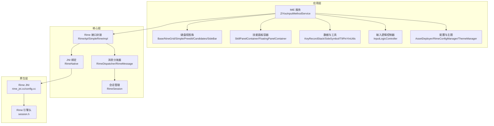
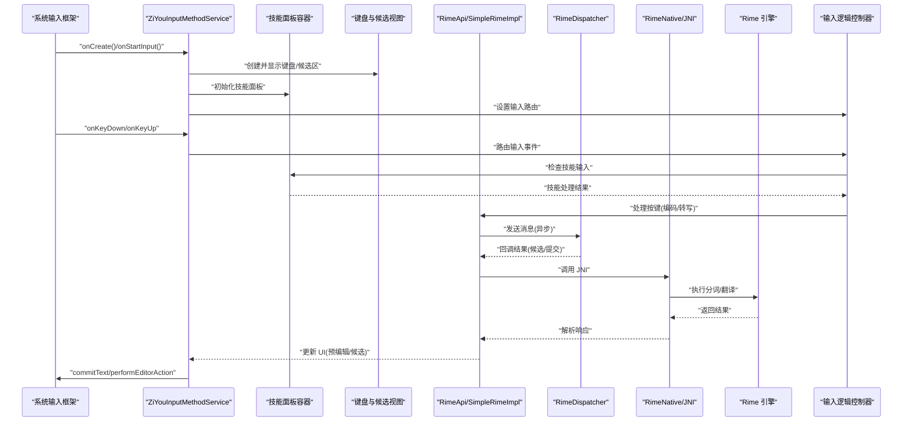
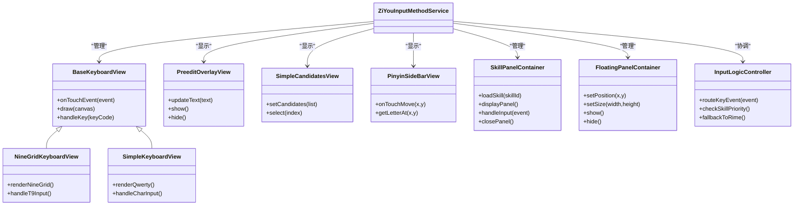
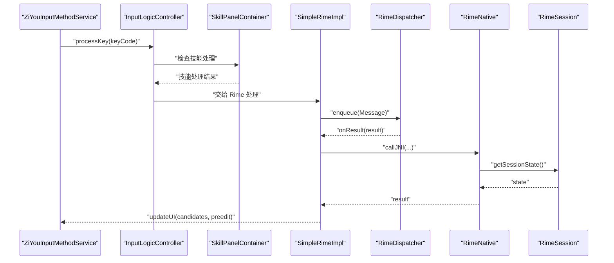
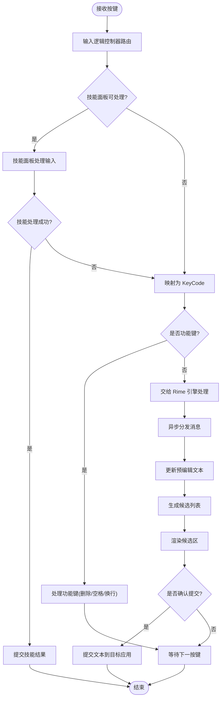
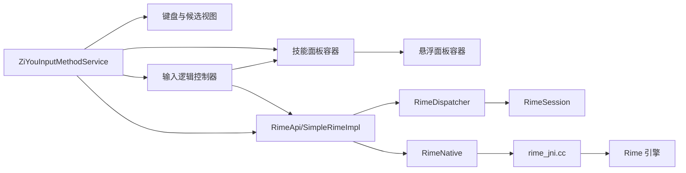

# 输入法服务

<cite>
**本文引用的文件**   
- [ZiYouInputMethodService.kt](file://app/src/main/java/com/ziyou/ime/ime/ZiYouInputMethodService.kt)
- [SkillPanelContainer.kt](file://app/src/main/java/com/ziyou/ime/ime/SkillPanelContainer.kt)
- [FloatingPanelContainer.kt](file://app/src/main/java/com/ziyou/ime/ime/FloatingPanelContainer.kt)
- [BaseKeyboardView.kt](file://app/src/main/java/com/ziyou/ime/ime/BaseKeyboardView.kt)
- [NineGridKeyboardView.kt](file://app/src/main/java/com/ziyou/ime/ime/NineGridKeyboardView.kt)
- [SimpleKeyboardView.kt](file://app/src/main/java/com/ziyou/ime/ime/SimpleKeyboardView.kt)
- [PreeditOverlayView.kt](file://app/src/main/java/com/ziyou/ime/ime/PreeditOverlayView.kt)
- [SimpleCandidatesView.kt](file://app/src/main/java/com/ziyou/ime/ime/SimpleCandidatesView.kt)
- [PinyinSideBarView.kt](file://app/src/main/java/com/ziyou/ime/ime/PinyinSideBarView.kt)
- [KeyCode.kt](file://app/src/main/java/com/ziyou/ime/ime/KeyCode.kt)
- [KeyboardType.kt](file://app/src/main/java/com/ziyou/ime/ime/KeyboardType.kt)
- [InputLogicController.kt](file://app/src/main/java/com/ziyou/ime/ime/InputLogicController.kt)
- [KeyboardLayoutManager.kt](file://app/src/main/java/com/ziyou/ime/ime/KeyboardLayoutManager.kt)
- [DisplayMode.kt](file://app/src/main/java/com/ziyou/ime/ime/DisplayMode.kt)
- [RimeApi.kt](file://app/src/main/java/com/ziyou/ime/core/RimeApi.kt)
- [RimeDispatcher.kt](file://app/src/main/java/com/ziyou/ime/core/RimeDispatcher.kt)
- [RimeMessage.kt](file://app/src/main/java/com/ziyou/ime/core/RimeMessage.kt)
- [RimeNative.kt](file://app/src/main/java/com/ziyou/ime/core/RimeNative.kt)
- [SimpleRimeImpl.kt](file://app/src/main/java/com/ziyou/ime/core/SimpleRimeImpl.kt)
- [ProtoTypes.kt](file://app/src/main/java/com/ziyou/ime/core/ProtoTypes.kt)
- [RimeSession.kt](file://app/src/main/java/com/ziyou/ime/daemon/RimeSession.kt)
- [AssetDeployer.kt](file://app/src/main/java/com/ziyou/ime/config/AssetDeployer.kt)
- [RimeConfigManager.kt](file://app/src/main/java/com/ziyou/ime/config/RimeConfigManager.kt)
- [ThemeManager.kt](file://app/src/main/java/com/ziyou/ime/config/ThemeManager.kt)
- [T9PinYinUtils.kt](file://app/src/main/java/com/ziyou/ime/util/T9PinYinUtils.kt)
- [input_method.xml](file://app/src/main/res/xml/input_method.xml)
- [AndroidManifest.xml](file://app/src/main/AndroidManifest.xml)
- [rime_jni.cc](file://app/src/main/jni/librime_jni/rime_jni.cc)
- [config.cc](file://app/src/main/jni/librime_jni/config.cc)
- [session.h](file://app/src/main/jni/librime_jni/session.h)
</cite>

## 更新摘要
**变更内容**   
- 新增技能面板显示和输入路由功能支持
- 扩展了布局提升机制以支持技能插件系统
- 增强了输入处理逻辑控制器
- 改进了悬浮面板容器管理

## 目录
1. [简介](#简介)
2. [项目结构](#项目结构)
3. [核心组件](#核心组件)
4. [架构总览](#架构总览)
5. [详细组件分析](#详细组件分析)
6. [依赖关系分析](#依赖关系分析)
7. [性能考虑](#性能考虑)
8. [故障排查指南](#故障排查指南)
9. [结论](#结论)
10. [附录](#附录)

## 简介
本技术文档围绕 ZiYouInputMethodService 输入法服务，系统阐述其继承关系、生命周期管理、与 Android IME API 的集成方式（软键盘显示、硬键盘事件处理、焦点管理）、配置 XML 定义与属性设置、输入法切换与语言区域机制、权限与安全考量、与系统输入框架的集成与兼容性处理，以及性能优化、电池优化策略、调试技巧与常见问题排查。文档以代码级为依据，辅以架构图、时序图与流程图，帮助读者从整体到细节全面理解该输入法实现。

**更新** 本次更新重点介绍了新增的技能面板显示和输入路由功能，以及布局提升机制的实现。

## 项目结构
本项目采用分层与模块化组织：
- 应用层（app）包含 IME 服务、UI 视图、配置与资源等
- 核心逻辑（core-logic）用于关联与测试（当前为空模块）
- 预编译 librime（librime-prebuilt）提供 Rime 引擎能力
- JNI 桥接（jni/librime_jni）连接 Java/Kotlin 与 C++ Rime

图表来源
- [ZiYouInputMethodService.kt](file://app/src/main/java/com/ziyou/ime/ime/ZiYouInputMethodService.kt)
- [SkillPanelContainer.kt](file://app/src/main/java/com/ziyou/ime/ime/SkillPanelContainer.kt)
- [FloatingPanelContainer.kt](file://app/src/main/java/com/ziyou/ime/ime/FloatingPanelContainer.kt)
- [InputLogicController.kt](file://app/src/main/java/com/ziyou/ime/ime/InputLogicController.kt)
- [BaseKeyboardView.kt](file://app/src/main/java/com/ziyou/ime/ime/BaseKeyboardView.kt)
- [NineGridKeyboardView.kt](file://app/src/main/java/com/ziyou/ime/ime/NineGridKeyboardView.kt)
- [SimpleKeyboardView.kt](file://app/src/main/java/com/ziyou/ime/ime/SimpleKeyboardView.kt)
- [PreeditOverlayView.kt](file://app/src/main/java/com/ziyou/ime/ime/PreeditOverlayView.kt)
- [SimpleCandidatesView.kt](file://app/src/main/java/com/ziyou/ime/ime/SimpleCandidatesView.kt)
- [PinyinSideBarView.kt](file://app/src/main/java/com/ziyou/ime/ime/PinyinSideBarView.kt)
- [RimeApi.kt](file://app/src/main/java/com/ziyou/ime/core/RimeApi.kt)
- [RimeDispatcher.kt](file://app/src/main/java/com/ziyou/ime/core/RimeDispatcher.kt)
- [RimeNative.kt](file://app/src/main/java/com/ziyou/ime/core/RimeNative.kt)
- [SimpleRimeImpl.kt](file://app/src/main/java/com/ziyou/ime/core/SimpleRimeImpl.kt)
- [RimeSession.kt](file://app/src/main/java/com/ziyou/ime/daemon/RimeSession.kt)
- [rime_jni.cc](file://app/src/main/jni/librime_jni/rime_jni.cc)
- [config.cc](file://app/src/main/jni/librime_jni/config.cc)
- [session.h](file://app/src/main/jni/librime_jni/session.h)

章节来源
- [AndroidManifest.xml](file://app/src/main/AndroidManifest.xml)
- [input_method.xml](file://app/src/main/res/xml/input_method.xml)

## 核心组件
- 输入法服务入口：ZiYouInputMethodService 负责 IME 生命周期、软键盘显示/隐藏、候选区与预编辑区渲染、按键事件路由、与 Rime 引擎交互，以及新增的技能面板管理和输入路由功能。
- 键盘视图族：BaseKeyboardView 为基类，NineGridKeyboardView、SimpleKeyboardView 等实现不同布局；PreeditOverlayView 展示预编辑文本；SimpleCandidatesView 展示候选词；PinyinSideBarView 提供拼音侧边栏。
- 技能面板容器：SkillPanelContainer 管理技能插件的显示和交互；FloatingPanelContainer 处理悬浮面板的生命周期和位置管理。
- 输入逻辑控制器：InputLogicController 协调各种输入源的处理逻辑，包括传统键盘输入和技能输入。
- 核心引擎封装：RimeApi/SimpleRimeImpl 抽象 Rime 操作；RimeDispatcher/RimeMessage 进行异步消息派发；RimeNative 通过 JNI 调用原生库；RimeSession 管理会话状态。
- 配置与资源：AssetDeployer 部署 Rime 资源；RimeConfigManager 管理配置项；ThemeManager 管理主题。
- 工具与数据：KeyRecordStack 记录键序列；SideSymbol 侧边符号；T9PinYinUtils 辅助 T9 拼音。

**更新** 新增了技能面板容器和输入逻辑控制器，增强了输入处理的灵活性和可扩展性。

章节来源
- [ZiYouInputMethodService.kt](file://app/src/main/java/com/ziyou/ime/ime/ZiYouInputMethodService.kt)
- [SkillPanelContainer.kt](file://app/src/main/java/com/ziyou/ime/ime/SkillPanelContainer.kt)
- [FloatingPanelContainer.kt](file://app/src/main/java/com/ziyou/ime/ime/FloatingPanelContainer.kt)
- [InputLogicController.kt](file://app/src/main/java/com/ziyou/ime/ime/InputLogicController.kt)
- [BaseKeyboardView.kt](file://app/src/main/java/com/ziyou/ime/ime/BaseKeyboardView.kt)
- [NineGridKeyboardView.kt](file://app/src/main/java/com/ziyou/ime/ime/NineGridKeyboardView.kt)
- [SimpleKeyboardView.kt](file://app/src/main/java/com/ziyou/ime/ime/SimpleKeyboardView.kt)
- [PreeditOverlayView.kt](file://app/src/main/java/com/ziyou/ime/ime/PreeditOverlayView.kt)
- [SimpleCandidatesView.kt](file://app/src/main/java/com/ziyou/ime/ime/SimpleCandidatesView.kt)
- [PinyinSideBarView.kt](file://app/src/main/java/com/ziyou/ime/ime/PinyinSideBarView.kt)
- [RimeApi.kt](file://app/src/main/java/com/ziyou/ime/core/RimeApi.kt)
- [RimeDispatcher.kt](file://app/src/main/java/com/ziyou/ime/core/RimeDispatcher.kt)
- [RimeMessage.kt](file://app/src/main/java/com/ziyou/ime/core/RimeMessage.kt)
- [RimeNative.kt](file://app/src/main/java/com/ziyou/ime/core/RimeNative.kt)
- [SimpleRimeImpl.kt](file://app/src/main/java/com/ziyou/ime/core/SimpleRimeImpl.kt)
- [RimeSession.kt](file://app/src/main/java/com/ziyou/ime/daemon/RimeSession.kt)
- [AssetDeployer.kt](file://app/src/main/java/com/ziyou/ime/config/AssetDeployer.kt)
- [RimeConfigManager.kt](file://app/src/main/java/com/ziyou/ime/config/RimeConfigManager.kt)
- [ThemeManager.kt](file://app/src/main/java/com/ziyou/ime/config/ThemeManager.kt)
- [KeyRecordStack.kt](file://app/src/main/java/com/ziyou/ime/data/KeyRecordStack.kt)
- [SideSymbol.kt](file://app/src/main/java/com/ziyou/ime/data/SideSymbol.kt)
- [T9PinYinUtils.kt](file://app/src/main/java/com/ziyou/ime/util/T9PinYinUtils.kt)

## 架构总览
输入法服务通过 Android IME API 与系统输入框架交互，使用自定义视图渲染键盘与候选区，并通过 JNI 调用 Rime 引擎完成分词与选词。新增的技能面板系统允许第三方插件在输入法界面中执行特定任务。

图表来源
- [ZiYouInputMethodService.kt](file://app/src/main/java/com/ziyou/ime/ime/ZiYouInputMethodService.kt)
- [SkillPanelContainer.kt](file://app/src/main/java/com/ziyou/ime/ime/SkillPanelContainer.kt)
- [InputLogicController.kt](file://app/src/main/java/com/ziyou/ime/ime/InputLogicController.kt)
- [RimeApi.kt](file://app/src/main/java/com/ziyou/ime/core/RimeApi.kt)
- [RimeDispatcher.kt](file://app/src/main/java/com/ziyou/ime/core/RimeDispatcher.kt)
- [RimeNative.kt](file://app/src/main/java/com/ziyou/ime/core/RimeNative.kt)
- [rime_jni.cc](file://app/src/main/jni/librime_jni/rime_jni.cc)

## 详细组件分析

### ZiYouInputMethodService 继承关系与生命周期
- 继承关系：继承自 Android InputMethodService，重写关键生命周期方法以管理 IME 状态、软键盘显示与焦点。
- 生命周期要点：
  - onCreate：初始化引擎、配置、视图工厂、消息分发器、技能面板容器和输入逻辑控制器
  - onStartInput：根据输入框类型决定键盘布局与候选区可见性，同时初始化技能面板
  - onRestartInput：重新适配输入上下文
  - onFinishInput：释放资源、清理状态、关闭技能面板
  - onVisibilityChanged：响应软键盘显示/隐藏
  - onComputeInsets：计算插入区域，避免遮挡
- 焦点管理：通过 getCurrentInputConnection() 与 EditorInfo 判断目标应用期望的输入行为，确保正确提交文本与动作。

**更新** 新增了技能面板容器的初始化和生命周期管理，确保技能插件的正确加载和卸载。

章节来源
- [ZiYouInputMethodService.kt](file://app/src/main/java/com/ziyou/ime/ime/ZiYouInputMethodService.kt)

### 技能面板显示和输入路由功能
- 技能面板容器：SkillPanelContainer 负责技能插件的加载、显示和管理，支持多种布局模式。
- 输入路由：InputLogicController 智能路由输入事件，优先检查技能插件是否处理，否则回退到传统输入法处理。
- 布局提升：支持将技能面板提升到输入法界面之上，提供更好的用户体验。
- 悬浮面板：FloatingPanelContainer 管理悬浮面板的位置、大小和生命周期。

**新增** 技能面板系统允许第三方开发者创建丰富的输入增强功能，如计算器、天气查询等。

章节来源
- [SkillPanelContainer.kt](file://app/src/main/java/com/ziyou/ime/ime/SkillPanelContainer.kt)
- [InputLogicController.kt](file://app/src/main/java/com/ziyou/ime/ime/InputLogicController.kt)
- [FloatingPanelContainer.kt](file://app/src/main/java/com/ziyou/ime/ime/FloatingPanelContainer.kt)

### 软键盘显示与硬键盘事件处理
- 软键盘显示：通过 showSoftInput() 控制显示，结合 onVisibilityChanged 动态调整 UI。
- 硬键盘事件：onKeyDown/onKeyUp 捕获系统硬键，区分功能键与字符键，必要时转发给目标应用或拦截用于输入法内部逻辑。
- 事件路由：将按键转换为内部 KeyCode，交由输入逻辑控制器处理，再根据优先级路由到技能面板或 Rime 引擎。

**更新** 事件路由机制现在支持技能面板的优先处理，提供更灵活的输入体验。

章节来源
- [ZiYouInputMethodService.kt](file://app/src/main/java/com/ziyou/ime/ime/ZiYouInputMethodService.kt)
- [InputLogicController.kt](file://app/src/main/java/com/ziyou/ime/ime/InputLogicController.kt)
- [KeyCode.kt](file://app/src/main/java/com/ziyou/ime/ime/KeyCode.kt)

### 输入法配置的 XML 定义与属性设置
- input_method.xml：声明输入法元信息、子布局、设置界面入口、支持的语言与区域等。
- 属性设置：在运行时通过 RimeConfigManager 读取/写入配置项，如引擎模式、候选数、主题等。

章节来源
- [input_method.xml](file://app/src/main/res/xml/input_method.xml)
- [RimeConfigManager.kt](file://app/src/main/java/com/ziyou/ime/config/RimeConfigManager.kt)

### 输入法切换、语言与区域设置
- 切换机制：通过 RimeApi/SimpleRimeImpl 切换 schema（如拼音、仓颉、九宫格），并持久化用户选择。
- 语言与区域：依据 EditorInfo 与系统 Locale 自动适配键盘布局与候选词排序；支持手动切换语言。

章节来源
- [RimeApi.kt](file://app/src/main/java/com/ziyou/ime/core/RimeApi.kt)
- [SimpleRimeImpl.kt](file://app/src/main/java/com/ziyou/ime/core/SimpleRimeImpl.kt)
- [RimeSession.kt](file://app/src/main/java/com/ziyou/ime/daemon/RimeSession.kt)

### 权限管理与安全考虑
- 必要权限：输入法通常不需要特殊权限，但需声明 IME 服务并在清单中启用。
- 数据安全：避免敏感信息落盘；对用户输入做最小化处理；JNI 层错误隔离。
- 资源访问：AssetDeployer 仅复制必要资源，限制读写范围。
- 技能插件安全：对技能插件进行权限验证和资源隔离，防止恶意代码执行。

**更新** 新增了技能插件的安全验证机制，确保第三方插件的安全性。

章节来源
- [AndroidManifest.xml](file://app/src/main/AndroidManifest.xml)
- [AssetDeployer.kt](file://app/src/main/java/com/ziyou/ime/config/AssetDeployer.kt)

### 与系统输入框架的集成与兼容性处理
- 兼容策略：针对不同 Android 版本与厂商 ROM，处理 IME 行为差异（如候选区位置、软键盘弹出时机）。
- 编辑器动作：根据 EditorInfo 的 imeOptions 触发搜索、发送、下一步等操作。
- 多窗口与分屏：正确处理 onWindowVisibilityChanged 与 insets 计算。
- 技能面板兼容：确保技能面板在不同设备和系统版本上的正常显示。

**更新** 增强了技能面板的兼容性处理，支持更多设备和系统版本。

章节来源
- [ZiYouInputMethodService.kt](file://app/src/main/java/com/ziyou/ime/ime/ZiYouInputMethodService.kt)

### 视图组件与数据流
- 键盘视图族：BaseKeyboardView 定义通用绘制与触摸逻辑，子类实现具体布局与按键映射。
- 候选与预编辑：SimpleCandidatesView 展示候选列表；PreeditOverlayView 展示正在输入的文本。
- 技能面板视图：SkillPanelContainer 管理技能插件的 UI 显示和交互。
- 数据流：按键 -> InputLogicController -> 技能面板或 RimeDispatcher -> RimeApi -> JNI -> Rime 引擎 -> 候选/提交 -> UI 更新。

图表来源
- [BaseKeyboardView.kt](file://app/src/main/java/com/ziyou/ime/ime/BaseKeyboardView.kt)
- [NineGridKeyboardView.kt](file://app/src/main/java/com/ziyou/ime/ime/NineGridKeyboardView.kt)
- [SimpleKeyboardView.kt](file://app/src/main/java/com/ziyou/ime/ime/SimpleKeyboardView.kt)
- [PreeditOverlayView.kt](file://app/src/main/java/com/ziyou/ime/ime/PreeditOverlayView.kt)
- [SimpleCandidatesView.kt](file://app/src/main/java/com/ziyou/ime/ime/SimpleCandidatesView.kt)
- [PinyinSideBarView.kt](file://app/src/main/java/com/ziyou/ime/ime/PinyinSideBarView.kt)
- [SkillPanelContainer.kt](file://app/src/main/java/com/ziyou/ime/ime/SkillPanelContainer.kt)
- [FloatingPanelContainer.kt](file://app/src/main/java/com/ziyou/ime/ime/FloatingPanelContainer.kt)
- [InputLogicController.kt](file://app/src/main/java/com/ziyou/ime/ime/InputLogicController.kt)

### 核心引擎与消息分发
- RimeApi/SimpleRimeImpl：封装 Rime 的核心操作（输入、选词、提交、切换 schema）。
- RimeDispatcher/RimeMessage：将耗时操作放入后台线程，通过消息回调主线程更新 UI。
- RimeNative：JNI 绑定，调用 rime_jni.cc 中的 C++ 函数。
- RimeSession：维护会话上下文（如当前 schema、用户词典、缓存）。

图表来源
- [ZiYouInputMethodService.kt](file://app/src/main/java/com/ziyou/ime/ime/ZiYouInputMethodService.kt)
- [InputLogicController.kt](file://app/src/main/java/com/ziyou/ime/ime/InputLogicController.kt)
- [SkillPanelContainer.kt](file://app/src/main/java/com/ziyou/ime/ime/SkillPanelContainer.kt)
- [RimeApi.kt](file://app/src/main/java/com/ziyou/ime/core/RimeApi.kt)
- [SimpleRimeImpl.kt](file://app/src/main/java/com/ziyou/ime/core/SimpleRimeImpl.kt)
- [RimeDispatcher.kt](file://app/src/main/java/com/ziyou/ime/core/RimeDispatcher.kt)
- [RimeMessage.kt](file://app/src/main/java/com/ziyou/ime/core/RimeMessage.kt)
- [RimeNative.kt](file://app/src/main/java/com/ziyou/ime/core/RimeNative.kt)
- [RimeSession.kt](file://app/src/main/java/com/ziyou/ime/daemon/RimeSession.kt)
- [rime_jni.cc](file://app/src/main/jni/librime_jni/rime_jni.cc)

### 复杂逻辑流程：按键处理与候选生成

图表来源
- [ZiYouInputMethodService.kt](file://app/src/main/java/com/ziyou/ime/ime/ZiYouInputMethodService.kt)
- [InputLogicController.kt](file://app/src/main/java/com/ziyou/ime/ime/InputLogicController.kt)
- [SkillPanelContainer.kt](file://app/src/main/java/com/ziyou/ime/ime/SkillPanelContainer.kt)
- [RimeDispatcher.kt](file://app/src/main/java/com/ziyou/ime/core/RimeDispatcher.kt)
- [SimpleRimeImpl.kt](file://app/src/main/java/com/ziyou/ime/core/SimpleRimeImpl.kt)

## 依赖关系分析
- 组件耦合：
  - ZiYouInputMethodService 依赖视图族、技能面板容器和输入逻辑控制器，低耦合通过接口与消息传递
  - InputLogicController 解耦技能面板与传统输入法处理
  - RimeDispatcher 解耦 UI 与引擎调用，避免主线程阻塞
  - JNI 层与原生库通过 RimeNative 统一封装
- 外部依赖：
  - Rime 引擎（C++）通过 JNI 调用
  - Android IME API 与系统输入框架
  - 技能插件系统支持第三方扩展
- 潜在循环依赖：通过消息与接口避免直接循环引用

图表来源
- [ZiYouInputMethodService.kt](file://app/src/main/java/com/ziyou/ime/ime/ZiYouInputMethodService.kt)
- [SkillPanelContainer.kt](file://app/src/main/java/com/ziyou/ime/ime/SkillPanelContainer.kt)
- [InputLogicController.kt](file://app/src/main/java/com/ziyou/ime/ime/InputLogicController.kt)
- [FloatingPanelContainer.kt](file://app/src/main/java/com/ziyou/ime/ime/FloatingPanelContainer.kt)
- [RimeApi.kt](file://app/src/main/java/com/ziyou/ime/core/RimeApi.kt)
- [RimeDispatcher.kt](file://app/src/main/java/com/ziyou/ime/core/RimeDispatcher.kt)
- [RimeNative.kt](file://app/src/main/java/com/ziyou/ime/core/RimeNative.kt)
- [RimeSession.kt](file://app/src/main/java/com/ziyou/ime/daemon/RimeSession.kt)
- [rime_jni.cc](file://app/src/main/jni/librime_jni/rime_jni.cc)

章节来源
- [AndroidManifest.xml](file://app/src/main/AndroidManifest.xml)
- [input_method.xml](file://app/src/main/res/xml/input_method.xml)

## 性能考虑
- 主线程保护：所有 UI 更新在主线程，耗时操作（Rime 调用）走后台线程与消息队列
- 视图渲染优化：按需重绘，避免频繁 invalidate；候选列表分页加载
- 内存管理：及时释放不再使用的视图与缓存；避免大对象常驻
- 电池优化：减少唤醒锁使用；批量处理输入事件；避免空转轮询
- JNI 调用优化：减少跨进程边界调用次数；复用会话与缓冲区
- 技能面板优化：懒加载技能插件，按需显示和销毁面板

**更新** 新增了技能面板的性能优化策略，确保插件系统的流畅运行。

## 故障排查指南
- 软键盘不显示：检查 onVisibilityChanged 与 showSoftInput 调用；确认 input_method.xml 配置正确
- 候选区错位：检查 onComputeInsets 与目标应用的 EditorInfo 行为差异
- 按键无响应：确认 onKeyDown/onKeyUp 是否正确捕获；KeyCode 映射是否完整
- Rime 引擎异常：查看 JNI 日志；检查 session 状态与 schema 切换
- 配置未生效：确认 AssetDeployer 资源部署路径；RimeConfigManager 读写权限
- 技能面板问题：检查技能插件加载状态；确认权限配置和资源文件完整性
- 输入路由异常：验证 InputLogicController 的路由逻辑；检查技能面板的事件处理

**更新** 新增了技能面板和输入路由相关的故障排查指南。

章节来源
- [ZiYouInputMethodService.kt](file://app/src/main/java/com/ziyou/ime/ime/ZiYouInputMethodService.kt)
- [SkillPanelContainer.kt](file://app/src/main/java/com/ziyou/ime/ime/SkillPanelContainer.kt)
- [InputLogicController.kt](file://app/src/main/java/com/ziyou/ime/ime/InputLogicController.kt)
- [AssetDeployer.kt](file://app/src/main/java/com/ziyou/ime/config/AssetDeployer.kt)
- [RimeConfigManager.kt](file://app/src/main/java/com/ziyou/ime/config/RimeConfigManager.kt)
- [rime_jni.cc](file://app/src/main/jni/librime_jni/rime_jni.cc)

## 结论
ZiYouInputMethodService 通过清晰的层次结构与消息驱动模型，实现了与 Android IME API 的深度集成与 Rime 引擎的高效调用。新增的技能面板系统和输入路由机制为输入法提供了强大的扩展能力，合理的生命周期管理、视图渲染策略与 JNI 封装确保了良好的用户体验与性能表现。建议持续优化候选生成算法、减少不必要的 UI 刷新，并加强错误恢复与日志追踪以提升稳定性。

**更新** 技能面板系统的引入显著增强了输入法的功能性和可扩展性，为未来更多创新功能的开发奠定了基础。

## 附录
- 调试技巧：
  - 使用 Logcat 过滤输入法包名，定位关键日志
  - 在 RimeDispatcher 中添加耗时统计，识别瓶颈
  - 通过 adb shell dumpsys input_method 检查 IME 状态
  - 监控技能面板的加载和显示状态
- 常见问题：
  - 多输入法冲突：确保唯一标识与优先级设置
  - 横竖屏切换：重建视图并恢复状态
  - 第三方应用兼容：针对特定 EditorInfo 行为做适配
  - 技能插件崩溃：添加异常捕获和降级处理

**更新** 新增了技能面板相关的调试技巧和常见问题解决方案。