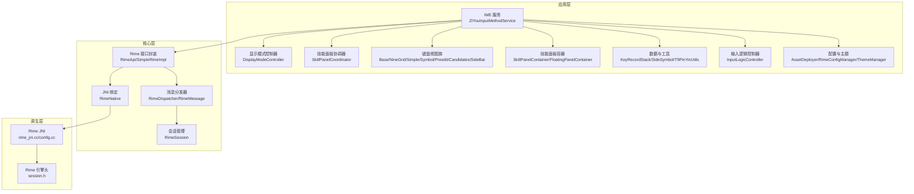
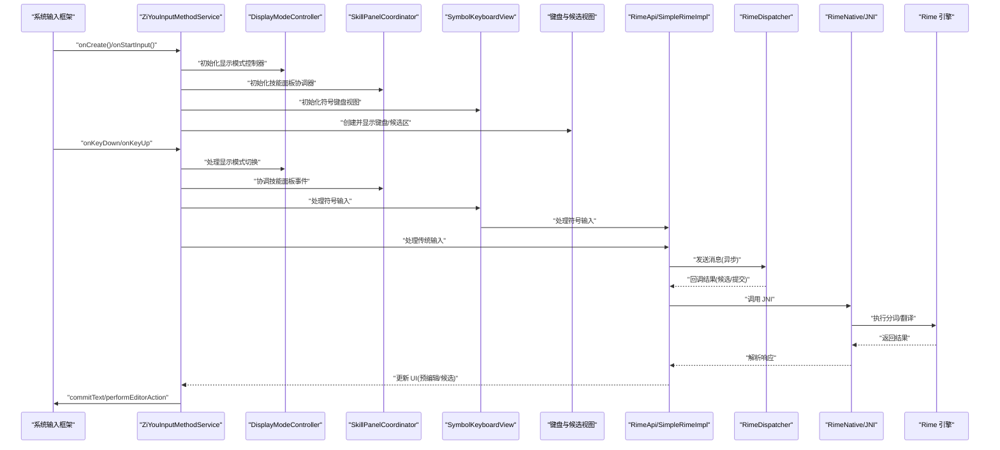
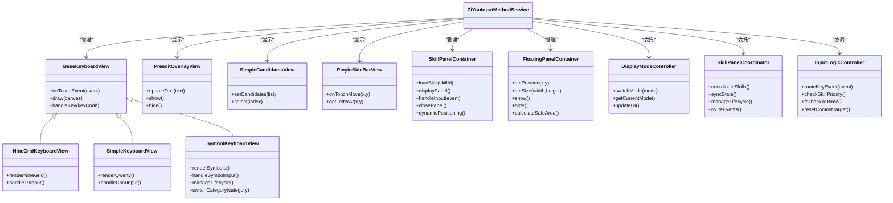
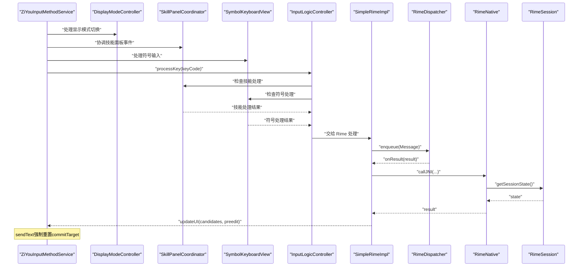
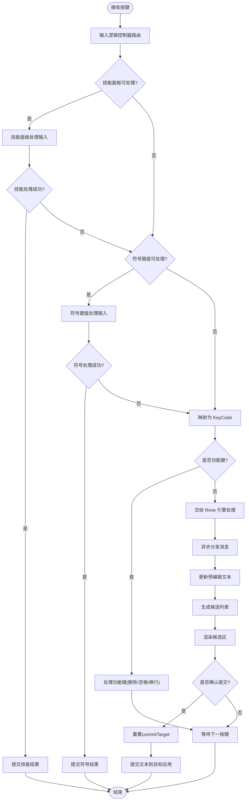
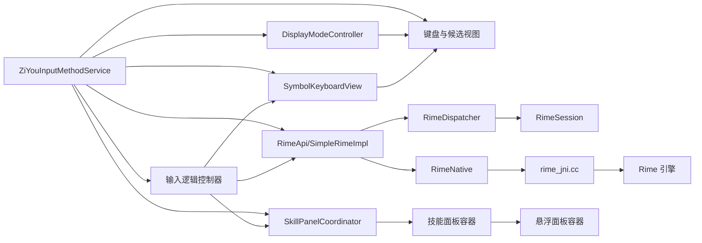

# 输入法服务

<cite>
**本文引用的文件**   
- [ZiYouInputMethodService.kt](file://app/src/main/java/com/ziyou/ime/ime/ZiYouInputMethodService.kt)
- [DisplayModeController.kt](file://app/src/main/java/com/ziyou/ime/ime/DisplayModeController.kt)
- [SkillPanelCoordinator.kt](file://app/src/main/java/com/ziyou/ime/ime/SkillPanelCoordinator.kt)
- [SkillPanelContainer.kt](file://app/src/main/java/com/ziyou/ime/ime/SkillPanelContainer.kt)
- [FloatingPanelContainer.kt](file://app/src/main/java/com/ziyou/ime/ime/FloatingPanelContainer.kt)
- [BaseKeyboardView.kt](file://app/src/main/java/com/ziyou/ime/ime/BaseKeyboardView.kt)
- [NineGridKeyboardView.kt](file://app/src/main/java/com/ziyou/ime/ime/NineGridKeyboardView.kt)
- [SimpleKeyboardView.kt](file://app/src/main/java/com/ziyou/ime/ime/SimpleKeyboardView.kt)
- [PreeditOverlayView.kt](file://app/src/main/java/com/ziyou/ime/ime/PreeditOverlayView.kt)
- [SimpleCandidatesView.kt](file://app/src/main/java/com/ziyou/ime/ime/SimpleCandidatesView.kt)
- [PinyinSideBarView.kt](file://app/src/main/java/com/ziyou/ime/ime/PinyinSideBarView.kt)
- [KeyCode.kt](file://app/src/main/java/com/ziyou/ime/ime/KeyCode.kt)
- [KeyboardType.kt](file://app/src/main/java/com/ziyou/ime/ime/KeyboardType.kt)
- [InputLogicController.kt](file://app/src/main/java/com/ziyou/ime/ime/InputLogicController.kt)
- [KeyboardLayoutManager.kt](file://app/src/main/java/com/ziyou/ime/ime/KeyboardLayoutManager.kt)
- [DisplayMode.kt](file://app/src/main/java/com/ziyou/ime/ime/DisplayMode.kt)
- [SymbolKeyboardView.kt](file://app/src/main/java/com/ziyou/ime/ime/SymbolKeyboardView.kt)
- [RimeApi.kt](file://app/src/main/java/com/ziyou/ime/core/RimeApi.kt)
- [RimeDispatcher.kt](file://app/src/main/java/com/ziyou/ime/core/RimeDispatcher.kt)
- [RimeMessage.kt](file://app/src/main/java/com/ziyou/ime/core/RimeMessage.kt)
- [RimeNative.kt](file://app/src/main/java/com/ziyou/ime/core/RimeNative.kt)
- [SimpleRimeImpl.kt](file://app/src/main/java/com/ziyou/ime/core/SimpleRimeImpl.kt)
- [ProtoTypes.kt](file://app/src/main/java/com/ziyou/ime/core/ProtoTypes.kt)
- [RimeSession.kt](file://app/src/main/java/com/ziyou/ime/daemon/RimeSession.kt)
- [AssetDeployer.kt](file://app/src/main/java/com/ziyou/ime/config/AssetDeployer.kt)
- [RimeConfigManager.kt](file://app/src/main/java/com/ziyou/ime/config/RimeConfigManager.kt)
- [ThemeManager.kt](file://app/src/main/java/com/ziyou/ime/config/ThemeManager.kt)
- [T9PinYinUtils.kt](file://app/src/main/java/com/ziyou/ime/util/T9PinYinUtils.kt)
- [input_method.xml](file://app/src/main/res/xml/input_method.xml)
- [AndroidManifest.xml](file://app/src/main/AndroidManifest.xml)
- [rime_jni.cc](file://app/src/main/jni/librime_jni/rime_jni.cc)
- [config.cc](file://app/src/main/jni/librime_jni/config.cc)
- [session.h](file://app/src/main/jni/librime_jni/session.h)
</cite>

## 更新摘要
**变更内容**   
- ZiYouInputMethodService 增强了符号键盘的激活和生命周期管理功能
- 新增 SymbolKeyboardView 组件支持符号输入面板
- 改进了键盘类型管理和切换机制
- 增强了输入法服务的整体架构，提升代码可维护性和扩展性

## 目录
1. [简介](#简介)
2. [项目结构](#项目结构)
3. [核心组件](#核心组件)
4. [架构总览](#架构总览)
5. [详细组件分析](#详细组件分析)
6. [依赖关系分析](#依赖关系分析)
7. [性能考虑](#性能考虑)
8. [故障排查指南](#故障排查指南)
9. [结论](#结论)
10. [附录](#附录)

## 简介
本技术文档围绕 ZiYouInputMethodService 输入法服务，系统阐述其继承关系、生命周期管理、与 Android IME API 的集成方式（软键盘显示、硬键盘事件处理、焦点管理）、配置 XML 定义与属性设置、输入法切换与语言区域机制、权限与安全考量、与系统输入框架的集成与兼容性处理，以及性能优化、电池优化策略、调试技巧与常见问题排查。文档以代码级为依据，辅以架构图、时序图与流程图，帮助读者从整体到细节全面理解该输入法实现。

**更新** 本次更新重点介绍了 ZiYouInputMethodService 对符号键盘功能的增强，新增了 SymbolKeyboardView 组件来支持符号输入面板的激活和生命周期管理，进一步完善了输入法的键盘类型支持体系。

## 项目结构
本项目采用分层与模块化组织：
- 应用层（app）包含 IME 服务、UI 视图、配置与资源等
- 核心逻辑（core-logic）用于关联与测试（当前为空模块）
- 预编译 librime（librime-prebuilt）提供 Rime 引擎能力
- JNI 桥接（jni/librime_jni）连接 Java/Kotlin 与 C++ Rime

图表来源
- [ZiYouInputMethodService.kt](file://app/src/main/java/com/ziyou/ime/ime/ZiYouInputMethodService.kt)
- [DisplayModeController.kt](file://app/src/main/java/com/ziyou/ime/ime/DisplayModeController.kt)
- [SkillPanelCoordinator.kt](file://app/src/main/java/com/ziyou/ime/ime/SkillPanelCoordinator.kt)
- [SkillPanelContainer.kt](file://app/src/main/java/com/ziyou/ime/ime/SkillPanelContainer.kt)
- [FloatingPanelContainer.kt](file://app/src/main/java/com/ziyou/ime/ime/FloatingPanelContainer.kt)
- [InputLogicController.kt](file://app/src/main/java/com/ziyou/ime/ime/InputLogicController.kt)
- [BaseKeyboardView.kt](file://app/src/main/java/com/ziyou/ime/ime/BaseKeyboardView.kt)
- [NineGridKeyboardView.kt](file://app/src/main/java/com/ziyou/ime/ime/NineGridKeyboardView.kt)
- [SimpleKeyboardView.kt](file://app/src/main/java/com/ziyou/ime/ime/SimpleKeyboardView.kt)
- [SymbolKeyboardView.kt](file://app/src/main/java/com/ziyou/ime/ime/SymbolKeyboardView.kt)
- [PreeditOverlayView.kt](file://app/src/main/java/com/ziyou/ime/ime/PreeditOverlayView.kt)
- [SimpleCandidatesView.kt](file://app/src/main/java/com/ziyou/ime/ime/SimpleCandidatesView.kt)
- [PinyinSideBarView.kt](file://app/src/main/java/com/ziyou/ime/ime/PinyinSideBarView.kt)
- [RimeApi.kt](file://app/src/main/java/com/ziyou/ime/core/RimeApi.kt)
- [RimeDispatcher.kt](file://app/src/main/java/com/ziyou/ime/core/RimeDispatcher.kt)
- [RimeNative.kt](file://app/src/main/java/com/ziyou/ime/core/RimeNative.kt)
- [SimpleRimeImpl.kt](file://app/src/main/java/com/ziyou/ime/core/SimpleRimeImpl.kt)
- [RimeSession.kt](file://app/src/main/java/com/ziyou/ime/daemon/RimeSession.kt)
- [rime_jni.cc](file://app/src/main/jni/librime_jni/rime_jni.cc)
- [config.cc](file://app/src/main/jni/librime_jni/config.cc)
- [session.h](file://app/src/main/jni/librime_jni/session.h)

章节来源
- [AndroidManifest.xml](file://app/src/main/AndroidManifest.xml)
- [input_method.xml](file://app/src/main/res/xml/input_method.xml)

## 核心组件
- 输入法服务入口：ZiYouInputMethodService 负责 IME 生命周期、软键盘显示/隐藏、候选区与预编辑区渲染、按键事件路由、与 Rime 引擎交互，以及新增的技能面板管理和输入路由功能。
- **新增** 显示模式控制器：DisplayModeController 专门负责输入法显示模式的切换和管理，包括全屏模式、悬浮模式和嵌入模式。
- **新增** 技能面板协调器：SkillPanelCoordinator 统一管理技能面板的生命周期、状态同步和事件协调，替代了原来在 Service 中的复杂逻辑。
- **新增** 符号键盘视图：SymbolKeyboardView 专门处理符号输入面板的显示和交互，支持各种特殊字符和符号的快速输入。
- 键盘视图族：BaseKeyboardView 为基类，NineGridKeyboardView、SimpleKeyboardView、SymbolKeyboardView 等实现不同布局；PreeditOverlayView 展示预编辑文本；SimpleCandidatesView 展示候选词；PinyinSideBarView 提供拼音侧边栏。
- 技能面板容器：SkillPanelContainer 管理技能插件的显示和交互；FloatingPanelContainer 处理悬浮面板的生命周期和位置管理。
- 输入逻辑控制器：InputLogicController 协调各种输入源的处理逻辑，包括传统键盘输入和技能输入。
- 核心引擎封装：RimeApi/SimpleRimeImpl 抽象 Rime 操作；RimeDispatcher/RimeMessage 进行异步消息派发；RimeNative 通过 JNI 调用原生库；RimeSession 管理会话状态。
- 配置与资源：AssetDeployer 部署 Rime 资源；RimeConfigManager 管理配置项；ThemeManager 管理主题。
- 工具与数据：KeyRecordStack 记录键序列；SideSymbol 侧边符号；T9PinYinUtils 辅助 T9 拼音。

**更新** 架构重构后，ZiYouInputMethodService 的职责更加清晰，DisplayModeController 专注于显示模式管理，SkillPanelCoordinator 专注于技能面板协调，新增的 SymbolKeyboardView 完善了符号输入支持，提升了代码的可维护性和扩展性。

章节来源
- [ZiYouInputMethodService.kt](file://app/src/main/java/com/ziyou/ime/ime/ZiYouInputMethodService.kt)
- [DisplayModeController.kt](file://app/src/main/java/com/ziyou/ime/ime/DisplayModeController.kt)
- [SkillPanelCoordinator.kt](file://app/src/main/java/com/ziyou/ime/ime/SkillPanelCoordinator.kt)
- [SymbolKeyboardView.kt](file://app/src/main/java/com/ziyou/ime/ime/SymbolKeyboardView.kt)
- [SkillPanelContainer.kt](file://app/src/main/java/com/ziyou/ime/ime/SkillPanelContainer.kt)
- [FloatingPanelContainer.kt](file://app/src/main/java/com/ziyou/ime/ime/FloatingPanelContainer.kt)
- [InputLogicController.kt](file://app/src/main/java/com/ziyou/ime/ime/InputLogicController.kt)
- [BaseKeyboardView.kt](file://app/src/main/java/com/ziyou/ime/ime/BaseKeyboardView.kt)
- [NineGridKeyboardView.kt](file://app/src/main/java/com/ziyou/ime/ime/NineGridKeyboardView.kt)
- [SimpleKeyboardView.kt](file://app/src/main/java/com/ziyou/ime/ime/SimpleKeyboardView.kt)
- [PreeditOverlayView.kt](file://app/src/main/java/com/ziyou/ime/ime/PreeditOverlayView.kt)
- [SimpleCandidatesView.kt](file://app/src/main/java/com/ziyou/ime/ime/SimpleCandidatesView.kt)
- [PinyinSideBarView.kt](file://app/src/main/java/com/ziyou/ime/ime/PinyinSideBarView.kt)
- [RimeApi.kt](file://app/src/main/java/com/ziyou/ime/core/RimeApi.kt)
- [RimeDispatcher.kt](file://app/src/main/java/com/ziyou/ime/core/RimeDispatcher.kt)
- [RimeMessage.kt](file://app/src/main/java/com/ziyou/ime/core/RimeMessage.kt)
- [RimeNative.kt](file://app/src/main/java/com/ziyou/ime/core/RimeNative.kt)
- [SimpleRimeImpl.kt](file://app/src/main/java/com/ziyou/ime/core/SimpleRimeImpl.kt)
- [RimeSession.kt](file://app/src/main/java/com/ziyou/ime/daemon/RimeSession.kt)
- [AssetDeployer.kt](file://app/src/main/java/com/ziyou/ime/config/AssetDeployer.kt)
- [RimeConfigManager.kt](file://app/src/main/java/com/ziyou/ime/config/RimeConfigManager.kt)
- [ThemeManager.kt](file://app/src/main/java/com/ziyou/ime/config/ThemeManager.kt)
- [KeyRecordStack.kt](file://app/src/main/java/com/ziyou/ime/data/KeyRecordStack.kt)
- [SideSymbol.kt](file://app/src/main/java/com/ziyou/ime/data/SideSymbol.kt)
- [T9PinYinUtils.kt](file://app/src/main/java/com/ziyou/ime/util/T9PinYinUtils.kt)

## 架构总览
输入法服务通过 Android IME API 与系统输入框架交互，使用自定义视图渲染键盘与候选区，并通过 JNI 调用 Rime 引擎完成分词与选词。新的架构通过 DisplayModeController 和 SkillPanelCoordinator 实现了更好的关注点分离，增强了系统的可维护性和扩展性。新增的 SymbolKeyboardView 进一步完善了键盘类型支持体系。

图表来源
- [ZiYouInputMethodService.kt](file://app/src/main/java/com/ziyou/ime/ime/ZiYouInputMethodService.kt)
- [DisplayModeController.kt](file://app/src/main/java/com/ziyou/ime/ime/DisplayModeController.kt)
- [SkillPanelCoordinator.kt](file://app/src/main/java/com/ziyou/ime/ime/SkillPanelCoordinator.kt)
- [SymbolKeyboardView.kt](file://app/src/main/java/com/ziyou/ime/ime/SymbolKeyboardView.kt)
- [SkillPanelContainer.kt](file://app/src/main/java/com/ziyou/ime/ime/SkillPanelContainer.kt)
- [InputLogicController.kt](file://app/src/main/java/com/ziyou/ime/ime/InputLogicController.kt)
- [RimeApi.kt](file://app/src/main/java/com/ziyou/ime/core/RimeApi.kt)
- [RimeDispatcher.kt](file://app/src/main/java/com/ziyou/ime/core/RimeDispatcher.kt)
- [RimeNative.kt](file://app/src/main/java/com/ziyou/ime/core/RimeNative.kt)
- [rime_jni.cc](file://app/src/main/jni/librime_jni/rime_jni.cc)

## 详细组件分析

### ZiYouInputMethodService 继承关系与生命周期
- 继承关系：继承自 Android InputMethodService，重写关键生命周期方法以管理 IME 状态、软键盘显示与焦点。
- 生命周期要点：
  - onCreate：初始化引擎、配置、视图工厂、消息分发器、显示模式控制器、技能面板协调器和符号键盘视图
  - onStartInput：根据输入框类型决定键盘布局与候选区可见性，同时初始化显示模式和符号键盘支持
  - onRestartInput：重新适配输入上下文，确保符号键盘状态正确
  - onFinishInput：释放资源、清理状态、关闭技能面板和符号键盘
  - onVisibilityChanged：响应软键盘显示/隐藏，动态调整符号键盘可见性
  - onComputeInsets：计算插入区域，避免遮挡符号键盘和其他面板
- 焦点管理：通过 getCurrentInputConnection() 与 EditorInfo 判断目标应用期望的输入行为，确保正确提交文本与动作。

**更新** 重构后的 ZiYouInputMethodService 将显示模式管理委托给 DisplayModeController，将技能面板协调委托给 SkillPanelCoordinator，并新增了对 SymbolKeyboardView 的管理，大幅简化了服务本身的复杂度。

章节来源
- [ZiYouInputMethodService.kt](file://app/src/main/java/com/ziyou/ime/ime/ZiYouInputMethodService.kt)
- [DisplayModeController.kt](file://app/src/main/java/com/ziyou/ime/ime/DisplayModeController.kt)
- [SkillPanelCoordinator.kt](file://app/src/main/java/com/ziyou/ime/ime/SkillPanelCoordinator.kt)
- [SymbolKeyboardView.kt](file://app/src/main/java/com/ziyou/ime/ime/SymbolKeyboardView.kt)

### 显示模式控制器 (DisplayModeController)
- **新增** 职责分离：DisplayModeController 专门负责输入法的显示模式管理，包括全屏模式、悬浮模式和嵌入模式的切换。
- 模式切换：支持动态切换不同的显示模式，适应不同的应用场景和设备类型。
- 状态同步：确保显示模式与 UI 状态的同步更新，避免状态不一致问题。
- 生命周期管理：自动管理显示模式相关资源的创建和销毁。

**新增** 显示模式控制器的引入使得输入法能够更好地适应不同的使用场景，提供了更灵活的显示选项。

章节来源
- [DisplayModeController.kt](file://app/src/main/java/com/ziyou/ime/ime/DisplayModeController.kt)

### 技能面板协调器 (SkillPanelCoordinator)
- **新增** 统一协调：SkillPanelCoordinator 作为技能面板的统一协调者，管理所有技能面板的生命周期和状态。
- 事件路由：智能路由输入事件到相应的技能面板，支持多面板并发处理。
- 状态同步：确保技能面板状态与输入法主状态的同步，避免数据竞争。
- 资源管理：自动管理技能面板的资源分配和释放，防止内存泄漏。

**新增** 技能面板协调器的引入解决了原来在 Service 中直接管理技能面板导致的复杂性问题，提高了代码的可维护性。

章节来源
- [SkillPanelCoordinator.kt](file://app/src/main/java/com/ziyou/ime/ime/SkillPanelCoordinator.kt)
- [SkillPanelContainer.kt](file://app/src/main/java/com/ziyou/ime/ime/SkillPanelContainer.kt)

### 符号键盘视图 (SymbolKeyboardView)
- **新增** 符号输入支持：SymbolKeyboardView 专门处理符号和特殊字符的输入，提供丰富的符号选择界面。
- 分类管理：支持按类别组织符号，如数学符号、标点符号、货币符号等。
- 快速访问：提供常用符号的快速访问和收藏功能。
- 生命周期管理：独立管理符号键盘的显示、隐藏和资源释放。

**新增** 符号键盘视图的引入完善了输入法的键盘类型支持，为用户提供更多样化的输入体验。

章节来源
- [SymbolKeyboardView.kt](file://app/src/main/java/com/ziyou/ime/ime/SymbolKeyboardView.kt)

### 技能面板布局与动态定位
- 技能面板容器：SkillPanelContainer 负责技能插件的加载、显示和管理，支持多种布局模式。
- 动态定位算法：FloatingPanelContainer 实现了智能的定位算法，根据屏幕尺寸、安全区域和输入框位置动态调整面板位置。
- 布局提升：支持将技能面板提升到输入法界面之上，提供更好的用户体验。
- 自适应布局：根据设备方向、屏幕密度和可用空间自动调整面板大小和位置。

**更新** 在 SkillPanelCoordinator 的统一管理下，技能面板的布局和定位更加稳定和可靠。

章节来源
- [SkillPanelContainer.kt](file://app/src/main/java/com/ziyou/ime/ime/SkillPanelContainer.kt)
- [FloatingPanelContainer.kt](file://app/src/main/java/com/ziyou/ime/ime/FloatingPanelContainer.kt)
- [SkillPanelCoordinator.kt](file://app/src/main/java/com/ziyou/ime/ime/SkillPanelCoordinator.kt)

### 文本路由修复与状态管理
- 输入路由：InputLogicController 智能路由输入事件，优先检查技能插件是否处理，否则回退到传统输入法处理。
- 状态一致性：sendText 方法现在强制重置 commitTarget，确保文本提交时目标连接的状态正确。
- 错误恢复：当检测到输入状态异常时，自动触发状态重置和恢复机制。
- 事务管理：所有输入操作都包裹在事务中，确保操作的原子性和一致性。

**更新** 文本路由修复解决了之前可能出现的状态不一致问题，提升了输入的可靠性和稳定性。

章节来源
- [InputLogicController.kt](file://app/src/main/java/com/ziyou/ime/ime/InputLogicController.kt)
- [ZiYouInputMethodService.kt](file://app/src/main/java/com/ziyou/ime/ime/ZiYouInputMethodService.kt)

### 软键盘显示与硬键盘事件处理
- 软键盘显示：通过 showSoftInput() 控制显示，结合 onVisibilityChanged 动态调整 UI。
- 硬键盘事件：onKeyDown/onKeyUp 捕获系统硬键，区分功能键与字符键，必要时转发给目标应用或拦截用于输入法内部逻辑。
- 事件路由：将按键转换为内部 KeyCode，交由输入逻辑控制器处理，再根据优先级路由到技能面板、符号键盘或 Rime 引擎。

**更新** 事件路由机制现在支持技能面板和符号键盘的优先处理，提供更灵活的输入体验，同时确保 sendText 强制重置 commitTarget 的正确性。

章节来源
- [ZiYouInputMethodService.kt](file://app/src/main/java/com/ziyou/ime/ime/ZiYouInputMethodService.kt)
- [InputLogicController.kt](file://app/src/main/java/com/ziyou/ime/ime/InputLogicController.kt)
- [SymbolKeyboardView.kt](file://app/src/main/java/com/ziyou/ime/ime/SymbolKeyboardView.kt)
- [KeyCode.kt](file://app/src/main/java/com/ziyou/ime/ime/KeyCode.kt)

### 输入法配置的 XML 定义与属性设置
- input_method.xml：声明输入法元信息、子布局、设置界面入口、支持的语言与区域等。
- 属性设置：在运行时通过 RimeConfigManager 读取/写入配置项，如引擎模式、候选数、主题等。

章节来源
- [input_method.xml](file://app/src/main/res/xml/input_method.xml)
- [RimeConfigManager.kt](file://app/src/main/java/com/ziyou/ime/config/RimeConfigManager.kt)

### 输入法切换、语言与区域设置
- 切换机制：通过 RimeApi/SimpleRimeImpl 切换 schema（如拼音、仓颉、九宫格），并持久化用户选择。
- 语言与区域：依据 EditorInfo 与系统 Locale 自动适配键盘布局与候选词排序；支持手动切换语言。

章节来源
- [RimeApi.kt](file://app/src/main/java/com/ziyou/ime/core/RimeApi.kt)
- [SimpleRimeImpl.kt](file://app/src/main/java/com/ziyou/ime/core/SimpleRimeImpl.kt)
- [RimeSession.kt](file://app/src/main/java/com/ziyou/ime/daemon/RimeSession.kt)

### 权限管理与安全考虑
- 必要权限：输入法通常不需要特殊权限，但需声明 IME 服务并在清单中启用。
- 数据安全：避免敏感信息落盘；对用户输入做最小化处理；JNI 层错误隔离。
- 资源访问：AssetDeployer 仅复制必要资源，限制读写范围。
- 技能插件安全：对技能插件进行权限验证和资源隔离，防止恶意代码执行。

**更新** 新增了技能插件的安全验证机制，确保第三方插件的安全性，同时增强了输入状态管理的可靠性。

章节来源
- [AndroidManifest.xml](file://app/src/main/AndroidManifest.xml)
- [AssetDeployer.kt](file://app/src/main/java/com/ziyou/ime/config/AssetDeployer.kt)

### 与系统输入框架的集成与兼容性处理
- 兼容策略：针对不同 Android 版本与厂商 ROM，处理 IME 行为差异（如候选区位置、软键盘弹出时机）。
- 编辑器动作：根据 EditorInfo 的 imeOptions 触发搜索、发送、下一步等操作。
- 多窗口与分屏：正确处理 onWindowVisibilityChanged 与 insets 计算。
- 技能面板兼容：确保技能面板在不同设备和系统版本上的正常显示。
- 符号键盘兼容：保证符号键盘在各种设备和系统版本上的稳定表现。

**更新** 增强了技能面板和符号键盘的兼容性处理，支持更多设备和系统版本，同时改进了 sendText 强制重置 commitTarget 的兼容性。

章节来源
- [ZiYouInputMethodService.kt](file://app/src/main/java/com/ziyou/ime/ime/ZiYouInputMethodService.kt)
- [SymbolKeyboardView.kt](file://app/src/main/java/com/ziyou/ime/ime/SymbolKeyboardView.kt)

### 视图组件与数据流
- 键盘视图族：BaseKeyboardView 定义通用绘制与触摸逻辑，子类实现具体布局与按键映射，包括新增的 SymbolKeyboardView。
- 候选与预编辑：SimpleCandidatesView 展示候选列表；PreeditOverlayView 展示正在输入的文本。
- 技能面板视图：SkillPanelContainer 管理技能插件的 UI 显示和交互。
- 数据流：按键 -> InputLogicController -> 技能面板/符号键盘或 RimeDispatcher -> RimeApi -> JNI -> Rime 引擎 -> 候选/提交 -> UI 更新。

图表来源
- [BaseKeyboardView.kt](file://app/src/main/java/com/ziyou/ime/ime/BaseKeyboardView.kt)
- [NineGridKeyboardView.kt](file://app/src/main/java/com/ziyou/ime/ime/NineGridKeyboardView.kt)
- [SimpleKeyboardView.kt](file://app/src/main/java/com/ziyou/ime/ime/SimpleKeyboardView.kt)
- [SymbolKeyboardView.kt](file://app/src/main/java/com/ziyou/ime/ime/SymbolKeyboardView.kt)
- [PreeditOverlayView.kt](file://app/src/main/java/com/ziyou/ime/ime/PreeditOverlayView.kt)
- [SimpleCandidatesView.kt](file://app/src/main/java/com/ziyou/ime/ime/SimpleCandidatesView.kt)
- [PinyinSideBarView.kt](file://app/src/main/java/com/ziyou/ime/ime/PinyinSideBarView.kt)
- [SkillPanelContainer.kt](file://app/src/main/java/com/ziyou/ime/ime/SkillPanelContainer.kt)
- [FloatingPanelContainer.kt](file://app/src/main/java/com/ziyou/ime/ime/FloatingPanelContainer.kt)
- [DisplayModeController.kt](file://app/src/main/java/com/ziyou/ime/ime/DisplayModeController.kt)
- [SkillPanelCoordinator.kt](file://app/src/main/java/com/ziyou/ime/ime/SkillPanelCoordinator.kt)
- [InputLogicController.kt](file://app/src/main/java/com/ziyou/ime/ime/InputLogicController.kt)

### 核心引擎与消息分发
- RimeApi/SimpleRimeImpl：封装 Rime 的核心操作（输入、选词、提交、切换 schema）。
- RimeDispatcher/RimeMessage：将耗时操作放入后台线程，通过消息回调主线程更新 UI。
- RimeNative：JNI 绑定，调用 rime_jni.cc 中的 C++ 函数。
- RimeSession：维护会话上下文（如当前 schema、用户词典、缓存）。

图表来源
- [ZiYouInputMethodService.kt](file://app/src/main/java/com/ziyou/ime/ime/ZiYouInputMethodService.kt)
- [DisplayModeController.kt](file://app/src/main/java/com/ziyou/ime/ime/DisplayModeController.kt)
- [SkillPanelCoordinator.kt](file://app/src/main/java/com/ziyou/ime/ime/SkillPanelCoordinator.kt)
- [SymbolKeyboardView.kt](file://app/src/main/java/com/ziyou/ime/ime/SymbolKeyboardView.kt)
- [InputLogicController.kt](file://app/src/main/java/com/ziyou/ime/ime/InputLogicController.kt)
- [SkillPanelContainer.kt](file://app/src/main/java/com/ziyou/ime/ime/SkillPanelContainer.kt)
- [RimeApi.kt](file://app/src/main/java/com/ziyou/ime/core/RimeApi.kt)
- [SimpleRimeImpl.kt](file://app/src/main/java/com/ziyou/ime/core/SimpleRimeImpl.kt)
- [RimeDispatcher.kt](file://app/src/main/java/com/ziyou/ime/core/RimeDispatcher.kt)
- [RimeMessage.kt](file://app/src/main/java/com/ziyou/ime/core/RimeMessage.kt)
- [RimeNative.kt](file://app/src/main/java/com/ziyou/ime/core/RimeNative.kt)
- [RimeSession.kt](file://app/src/main/java/com/ziyou/ime/daemon/RimeSession.kt)
- [rime_jni.cc](file://app/src/main/jni/librime_jni/rime_jni.cc)

### 复杂逻辑流程：按键处理与候选生成

图表来源
- [ZiYouInputMethodService.kt](file://app/src/main/java/com/ziyou/ime/ime/ZiYouInputMethodService.kt)
- [InputLogicController.kt](file://app/src/main/java/com/ziyou/ime/ime/InputLogicController.kt)
- [SymbolKeyboardView.kt](file://app/src/main/java/com/ziyou/ime/ime/SymbolKeyboardView.kt)
- [SkillPanelContainer.kt](file://app/src/main/java/com/ziyou/ime/ime/SkillPanelContainer.kt)
- [RimeDispatcher.kt](file://app/src/main/java/com/ziyou/ime/core/RimeDispatcher.kt)
- [SimpleRimeImpl.kt](file://app/src/main/java/com/ziyou/ime/core/SimpleRimeImpl.kt)

## 依赖关系分析
- 组件耦合：
  - ZiYouInputMethodService 依赖视图族、显示模式控制器、技能面板协调器、符号键盘视图和输入逻辑控制器，低耦合通过接口与消息传递
  - DisplayModeController 和 SkillPanelCoordinator 解耦了显示模式管理和技能面板协调逻辑
  - InputLogicController 解耦技能面板、符号键盘与传统输入法处理
  - RimeDispatcher 解耦 UI 与引擎调用，避免主线程阻塞
  - JNI 层与原生库通过 RimeNative 统一封装
- 外部依赖：
  - Rime 引擎（C++）通过 JNI 调用
  - Android IME API 与系统输入框架
  - 技能插件系统支持第三方扩展
- 潜在循环依赖：通过消息与接口避免直接循环引用

图表来源
- [ZiYouInputMethodService.kt](file://app/src/main/java/com/ziyou/ime/ime/ZiYouInputMethodService.kt)
- [DisplayModeController.kt](file://app/src/main/java/com/ziyou/ime/ime/DisplayModeController.kt)
- [SkillPanelCoordinator.kt](file://app/src/main/java/com/ziyou/ime/ime/SkillPanelCoordinator.kt)
- [SymbolKeyboardView.kt](file://app/src/main/java/com/ziyou/ime/ime/SymbolKeyboardView.kt)
- [SkillPanelContainer.kt](file://app/src/main/java/com/ziyou/ime/ime/SkillPanelContainer.kt)
- [FloatingPanelContainer.kt](file://app/src/main/java/com/ziyou/ime/ime/FloatingPanelContainer.kt)
- [InputLogicController.kt](file://app/src/main/java/com/ziyou/ime/ime/InputLogicController.kt)
- [RimeApi.kt](file://app/src/main/java/com/ziyou/ime/core/RimeApi.kt)
- [RimeDispatcher.kt](file://app/src/main/java/com/ziyou/ime/core/RimeDispatcher.kt)
- [RimeNative.kt](file://app/src/main/java/com/ziyou/ime/core/RimeNative.kt)
- [RimeSession.kt](file://app/src/main/java/com/ziyou/ime/daemon/RimeSession.kt)
- [rime_jni.cc](file://app/src/main/jni/librime_jni/rime_jni.cc)

章节来源
- [AndroidManifest.xml](file://app/src/main/AndroidManifest.xml)
- [input_method.xml](file://app/src/main/res/xml/input_method.xml)

## 性能考虑
- 主线程保护：所有 UI 更新在主线程，耗时操作（Rime 调用）走后台线程与消息队列
- 视图渲染优化：按需重绘，避免频繁 invalidate；候选列表分页加载
- 内存管理：及时释放不再使用的视图与缓存；避免大对象常驻
- 电池优化：减少唤醒锁使用；批量处理输入事件；避免空转轮询
- JNI 调用优化：减少跨进程边界调用次数；复用会话与缓冲区
- 技能面板优化：懒加载技能插件，按需显示和销毁面板
- 动态定位优化：缓存位置计算结果，避免重复计算
- **新增** 控制器优化：DisplayModeController 和 SkillPanelCoordinator 的懒加载和按需初始化
- **新增** 符号键盘优化：符号键盘的按需加载和缓存机制

**更新** 架构重构后，DisplayModeController 和 SkillPanelCoordinator 的引入进一步提升了性能，通过职责分离减少了不必要的计算和内存占用。新增的 SymbolKeyboardView 也采用了优化的加载和缓存策略。

## 故障排查指南
- 软键盘不显示：检查 onVisibilityChanged 与 showSoftInput 调用；确认 input_method.xml 配置正确
- 候选区错位：检查 onComputeInsets 与目标应用的 EditorInfo 行为差异
- 按键无响应：确认 onKeyDown/onKeyUp 是否正确捕获；KeyCode 映射是否完整
- Rime 引擎异常：查看 JNI 日志；检查 session 状态与 schema 切换
- 配置未生效：确认 AssetDeployer 资源部署路径；RimeConfigManager 读写权限
- 技能面板问题：检查技能插件加载状态；确认权限配置和资源文件完整性
- 输入路由异常：验证 InputLogicController 的路由逻辑；检查技能面板的事件处理
- 状态不一致：检查 sendText 强制重置 commitTarget 的调用时机和参数
- **新增** 显示模式问题：检查 DisplayModeController 的模式切换逻辑和状态同步
- **新增** 技能面板协调问题：检查 SkillPanelCoordinator 的事件路由和生命周期管理
- **新增** 符号键盘问题：检查 SymbolKeyboardView 的初始化和显示逻辑

**更新** 新增了显示模式控制器、技能面板协调器和符号键盘相关的故障排查指南，特别关注新架构下的问题诊断。

章节来源
- [ZiYouInputMethodService.kt](file://app/src/main/java/com/ziyou/ime/ime/ZiYouInputMethodService.kt)
- [DisplayModeController.kt](file://app/src/main/java/com/ziyou/ime/ime/DisplayModeController.kt)
- [SkillPanelCoordinator.kt](file://app/src/main/java/com/ziyou/ime/ime/SkillPanelCoordinator.kt)
- [SymbolKeyboardView.kt](file://app/src/main/java/com/ziyou/ime/ime/SymbolKeyboardView.kt)
- [SkillPanelContainer.kt](file://app/src/main/java/com/ziyou/ime/ime/SkillPanelContainer.kt)
- [InputLogicController.kt](file://app/src/main/java/com/ziyou/ime/ime/InputLogicController.kt)
- [FloatingPanelContainer.kt](file://app/src/main/java/com/ziyou/ime/ime/FloatingPanelContainer.kt)
- [AssetDeployer.kt](file://app/src/main/java/com/ziyou/ime/config/AssetDeployer.kt)
- [RimeConfigManager.kt](file://app/src/main/java/com/ziyou/ime/config/RimeConfigManager.kt)
- [rime_jni.cc](file://app/src/main/jni/librime_jni/rime_jni.cc)

## 结论
ZiYouInputMethodService 通过清晰的层次结构与消息驱动模型，实现了与 Android IME API 的深度集成与 Rime 引擎的高效调用。重大架构重构后，DisplayModeController 和 SkillPanelCoordinator 的引入遵循了单一职责原则，显著提升了代码的可维护性和扩展性。新增的 SymbolKeyboardView 进一步完善了输入法的键盘类型支持体系。新的架构设计为输入法提供了更强的功能模块化能力，确保了输入状态的一致性和可靠性。合理的生命周期管理、视图渲染策略与 JNI 封装确保了良好的用户体验与性能表现。建议持续优化候选生成算法、减少不必要的 UI 刷新，并加强错误恢复与日志追踪以提升稳定性。

**更新** 架构重构后的 ZiYouInputMethodService 展现了更好的设计模式和代码组织，DisplayModeController 和 SkillPanelCoordinator 的引入以及新增的 SymbolKeyboardView 为未来更多创新功能的开发奠定了坚实基础。

## 附录
- 调试技巧：
  - 使用 Logcat 过滤输入法包名，定位关键日志
  - 在 RimeDispatcher 中添加耗时统计，识别瓶颈
  - 通过 adb shell dumpsys input_method 检查 IME 状态
  - 监控技能面板的加载和显示状态
  - 跟踪 sendText 强制重置 commitTarget 的调用链
  - **新增** 监控 DisplayModeController 的模式切换日志
  - **新增** 检查 SkillPanelCoordinator 的事件路由状态
  - **新增** 监控 SymbolKeyboardView 的符号输入日志
- 常见问题：
  - 多输入法冲突：确保唯一标识与优先级设置
  - 横竖屏切换：重建视图并恢复状态
  - 第三方应用兼容：针对特定 EditorInfo 行为做适配
  - 技能插件崩溃：添加异常捕获和降级处理
  - 输入状态异常：检查 commitTarget 重置逻辑和状态同步
  - **新增** 显示模式切换异常：检查 DisplayModeController 的状态同步
  - **新增** 技能面板协调失败：检查 SkillPanelCoordinator 的生命周期管理
  - **新增** 符号键盘显示异常：检查 SymbolKeyboardView 的初始化逻辑

**更新** 新增了显示模式控制器、技能面板协调器和符号键盘相关的调试技巧和常见问题解决方案。