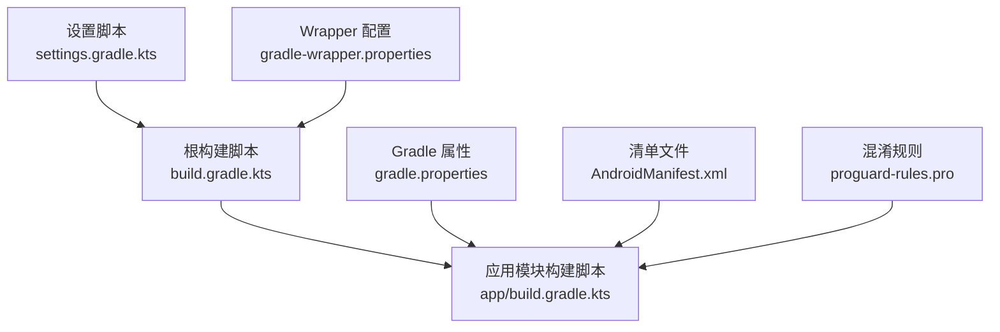
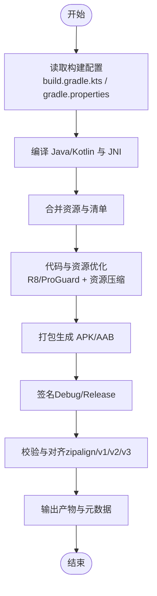
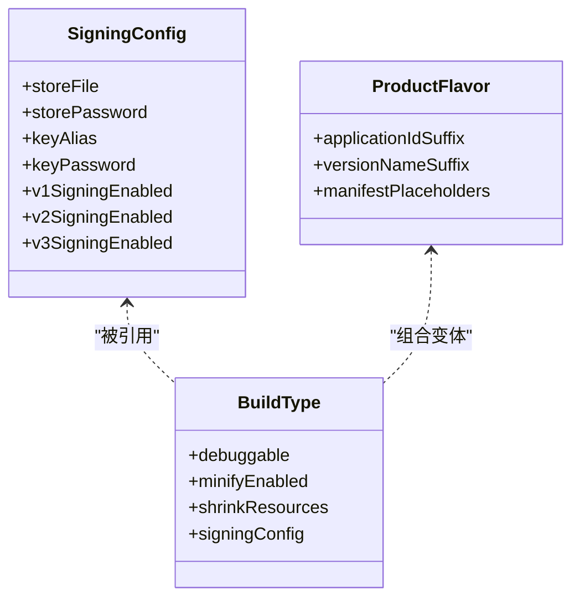
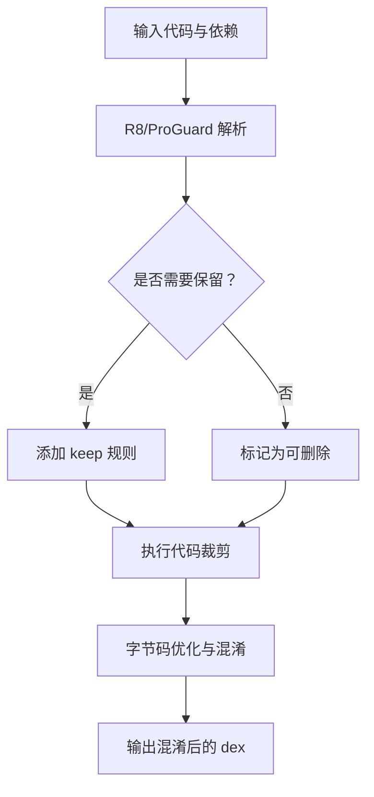
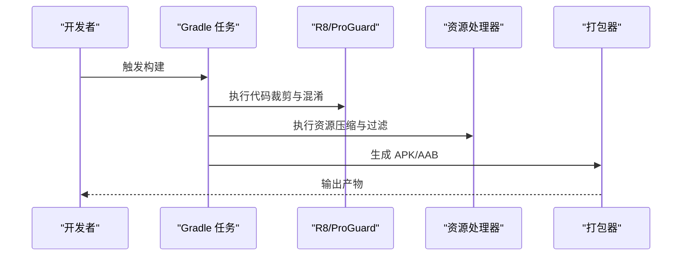
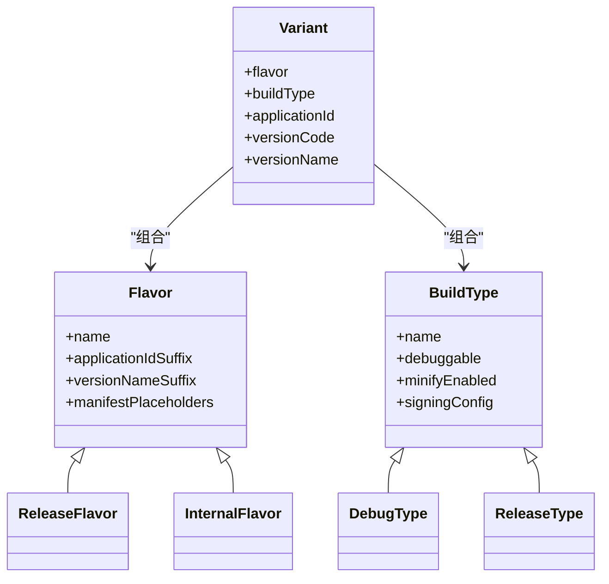
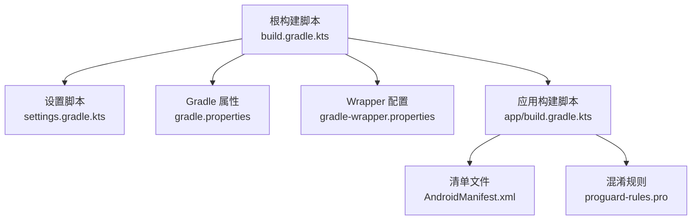

# APK 打包与签名

<cite>
**本文引用的文件**   
- [app/build.gradle.kts](file://app/build.gradle.kts)
- [build.gradle.kts](file://build.gradle.kts)
- [gradle.properties](file://gradle.properties)
- [settings.gradle.kts](file://settings.gradle.kts)
- [app/proguard-rules.pro](file://app/proguard-rules.pro)
- [app/src/main/AndroidManifest.xml](file://app/src/main/AndroidManifest.xml)
- [gradle/wrapper/gradle-wrapper.properties](file://gradle/wrapper/gradle-wrapper.properties)
</cite>

## 目录
1. [简介](#简介)
2. [项目结构](#项目结构)
3. [核心组件](#核心组件)
4. [架构总览](#架构总览)
5. [详细组件分析](#详细组件分析)
6. [依赖分析](#依赖分析)
7. [性能考虑](#性能考虑)
8. [故障排查指南](#故障排查指南)
9. [结论](#结论)
10. [附录](#附录)

## 简介
本文件面向 Android 输入法项目的构建与发布，聚焦于 APK 的打包与签名流程。内容涵盖：
- Debug 与 Release 构建配置的差异与最佳实践
- APK 签名配置、密钥管理与安全建议
- ProGuard/R8 混淆规则与优化策略
- 资源压缩与代码优化的关键选项
- 多渠道打包与版本管理方法
- 构建产物管理与发布准备流程
- 常见问题定位与解决方案
- 安全加固与反调试的配置思路

## 项目结构
本项目采用 Gradle Kotlin DSL 进行构建，模块以 app 为主，包含 JNI 集成与 Rime 引擎相关资源。构建相关的关键位置如下：
- 根级构建脚本与全局属性：根 build.gradle.kts、gradle.properties、settings.gradle.kts
- 应用模块构建脚本：app/build.gradle.kts（含签名、混淆、资源处理等）
- 清单文件：app/src/main/AndroidManifest.xml（包名、权限、入口等）
- 混淆规则：app/proguard-rules.pro
- Gradle Wrapper：gradle/wrapper/gradle-wrapper.properties

**图表来源**
- [build.gradle.kts](file://build.gradle.kts)
- [app/build.gradle.kts](file://app/build.gradle.kts)
- [gradle.properties](file://gradle.properties)
- [settings.gradle.kts](file://settings.gradle.kts)
- [app/src/main/AndroidManifest.xml](file://app/src/main/AndroidManifest.xml)
- [app/proguard-rules.pro](file://app/proguard-rules.pro)
- [gradle/wrapper/gradle-wrapper.properties](file://gradle/wrapper/gradle-wrapper.properties)

**章节来源**
- [build.gradle.kts](file://build.gradle.kts)
- [app/build.gradle.kts](file://app/build.gradle.kts)
- [gradle.properties](file://gradle.properties)
- [settings.gradle.kts](file://settings.gradle.kts)
- [app/src/main/AndroidManifest.xml](file://app/src/main/AndroidManifest.xml)
- [app/proguard-rules.pro](file://app/proguard-rules.pro)
- [gradle/wrapper/gradle-wrapper.properties](file://gradle/wrapper/gradle-wrapper.properties)

## 核心组件
围绕 APK 打包与签名的核心要素包括：
- 构建变体：Debug 与 Release 的差异（调试符号、优化开关、签名方式）
- 签名配置：keystore 路径、别名、密码及环境变量注入
- 混淆与优化：ProGuard/R8 规则、资源压缩、代码裁剪
- 资源处理：资源压缩、无效资源清理、多语言/多 ABI 过滤
- 版本与渠道：版本号、渠道标识、动态注入
- 产物管理：输出目录、命名规范、校验与归档

上述能力在 Gradle 构建脚本中通过 android{} 块、signingConfigs{}、buildTypes{}、androidResources{}、packagingOptions{} 等配置项实现。

**章节来源**
- [app/build.gradle.kts](file://app/build.gradle.kts)
- [gradle.properties](file://gradle.properties)

## 架构总览
下图展示了从源码到 APK 的构建流水线，以及签名、混淆、资源处理的交互关系。

**图表来源**
- [app/build.gradle.kts](file://app/build.gradle.kts)
- [gradle.properties](file://gradle.properties)

## 详细组件分析

### 构建变体与签名配置
- Debug 与 Release 的典型差异
  - 调试信息：是否保留堆栈、调试符号
  - 优化级别：代码裁剪、内联、死代码消除
  - 资源压缩：是否启用资源压缩与无用资源移除
  - 签名：Debug 使用默认调试签名；Release 使用正式 keystore
- 签名配置要点
  - 使用 signingConfigs 定义 keystore 路径、别名、密码
  - 敏感信息通过环境变量或外部配置文件注入，避免硬编码
  - 推荐启用 v1+v2+v3 签名以兼容不同平台
- 构建类型与产品维度
  - buildTypes 控制 debuggable、minifyEnabled、shrinkResources、signingConfig
  - productFlavors 用于多渠道与差异化配置（如渠道 ID、API 端点）

**图表来源**
- [app/build.gradle.kts](file://app/build.gradle.kts)

**章节来源**
- [app/build.gradle.kts](file://app/build.gradle.kts)

### ProGuard/R8 混淆与优化
- 混淆目标
  - 类名、字段名、方法名混淆
  - 去除未使用的代码与资源
  - 字节码优化（内联、常量折叠等）
- 规则文件
  - app/proguard-rules.pro 存放自定义保留与忽略规则
  - 针对反射、JNI、序列化、第三方库的特殊保留
- 优化策略
  - 逐步开启 minifyEnabled/shrinkResources
  - 先关闭混淆再开启，定位问题后逐步放宽规则
  - 使用 keep 规则最小化影响面，避免破坏运行时行为

**图表来源**
- [app/proguard-rules.pro](file://app/proguard-rules.pro)
- [app/build.gradle.kts](file://app/build.gradle.kts)

**章节来源**
- [app/proguard-rules.pro](file://app/proguard-rules.pro)
- [app/build.gradle.kts](file://app/build.gradle.kts)

### 资源压缩与代码优化
- 资源压缩
  - 启用 shrinkResources 移除未引用资源
  - 配合 resConfig/resIgnore 过滤不需要的语言与 ABI
  - 注意动态加载的资源需显式保留
- 代码优化
  - minifyEnabled 开启 R8/ProGuard
  - 合理配置 keep 规则，避免误删
  - 对 JNI 与反射调用进行必要保留
- 打包选项
  - packagingOptions 处理重复文件、排除冲突库
  - 确保 native 库按 ABI 正确打包

**图表来源**
- [app/build.gradle.kts](file://app/build.gradle.kts)

**章节来源**
- [app/build.gradle.kts](file://app/build.gradle.kts)

### 多渠道打包与版本管理
- 多渠道
  - 使用 productFlavors 定义渠道（如 release、internal、custom）
  - 每个渠道可独立 applicationIdSuffix、versionNameSuffix、manifestPlaceholders
  - 结合 buildTypes 形成多维变体矩阵
- 版本管理
  - versionCode/versionName 集中管理
  - 可通过 gradle.properties 注入 CI 生成的版本号
  - 建议使用语义化版本并配合 Git Tag

**图表来源**
- [app/build.gradle.kts](file://app/build.gradle.kts)

**章节来源**
- [app/build.gradle.kts](file://app/build.gradle.kts)

### 构建产物管理与发布准备
- 产物位置
  - APK/AAB 输出至 app/build/outputs/{apk,aab}
  - 混淆映射文件 mapping.txt 位于 app/build/outputs/mapping/
- 命名规范
  - 建议在文件名中包含版本、渠道、时间戳
- 校验与归档
  - 生成 SHA 校验文件
  - 归档产物与映射文件，便于回溯
- 发布清单
  - 记录变更日志、已知问题、兼容性说明
  - 准备上架所需截图、描述、隐私政策

**章节来源**
- [app/build.gradle.kts](file://app/build.gradle.kts)

### 安全加固与反调试
- 加固思路
  - 使用 VMP 或壳方案进行二次加固（需评估兼容性与性能）
  - 关键逻辑下沉至 native 层，增加逆向难度
- 反调试
  - 检测调试器附加、ptrace、/proc/self/status 中的 TracerPid
  - 检查常见调试工具进程
  - 发现调试环境时退出或降级功能
- 安全存储
  - 敏感配置与密钥不要硬编码，使用系统 KeyStore 或加密存储
  - 网络通信启用证书锁定与完整性校验

[本节为通用指导，不直接分析具体文件]

## 依赖分析
构建阶段的主要依赖与耦合关系如下：
- Gradle 插件与 AGP：由根 build.gradle.kts 与 settings.gradle.kts 管理
- Android 构建工具链：由 gradle.properties 与 wrapper 指定版本
- 应用模块依赖：app/build.gradle.kts 声明库依赖与本地模块
- 混淆与资源处理：R8/ProGuard 与 aapt2 协同工作

**图表来源**
- [build.gradle.kts](file://build.gradle.kts)
- [settings.gradle.kts](file://settings.gradle.kts)
- [gradle.properties](file://gradle.properties)
- [gradle/wrapper/gradle-wrapper.properties](file://gradle/wrapper/gradle-wrapper.properties)
- [app/build.gradle.kts](file://app/build.gradle.kts)
- [app/src/main/AndroidManifest.xml](file://app/src/main/AndroidManifest.xml)
- [app/proguard-rules.pro](file://app/proguard-rules.pro)

**章节来源**
- [build.gradle.kts](file://build.gradle.kts)
- [settings.gradle.kts](file://settings.gradle.kts)
- [gradle.properties](file://gradle.properties)
- [gradle/wrapper/gradle-wrapper.properties](file://gradle/wrapper/gradle-wrapper.properties)
- [app/build.gradle.kts](file://app/build.gradle.kts)
- [app/src/main/AndroidManifest.xml](file://app/src/main/AndroidManifest.xml)
- [app/proguard-rules.pro](file://app/proguard-rules.pro)

## 性能考虑
- 构建速度
  - 启用并行构建与守护进程
  - 合理使用增量编译与缓存
  - 减少不必要的依赖与资源体积
- 运行性能
  - 合理开启代码优化与资源压缩
  - 避免过度混淆导致反射失败
  - 关注 native 库大小与加载时间

[本节提供通用建议，不直接分析具体文件]

## 故障排查指南
- 签名失败
  - 检查 keystore 路径、别名、密码是否正确
  - 确认签名算法与平台兼容性（v1/v2/v3）
  - 查看 Gradle 输出中的错误堆栈
- 混淆崩溃
  - 逐步缩小 keep 范围，定位破坏点
  - 针对反射、JNI、序列化添加保留规则
  - 使用 mapping.txt 还原堆栈
- 资源缺失
  - 确认动态加载的资源未被压缩
  - 检查 resConfig/resIgnore 是否误过滤
- 多渠道异常
  - 核对 applicationIdSuffix 与 manifestPlaceholders
  - 验证渠道特定配置是否生效
- 构建缓慢
  - 分析构建报告，定位耗时任务
  - 调整并行度与缓存策略

**章节来源**
- [app/build.gradle.kts](file://app/build.gradle.kts)
- [app/proguard-rules.pro](file://app/proguard-rules.pro)

## 结论
通过合理的构建配置、严格的签名管理、科学的混淆与优化策略，以及完善的产物管理与发布流程，可以显著提升输入法应用的构建效率、安全性与可维护性。建议在生产环境中采用自动化 CI/CD 管线，统一密钥管理与版本发布，确保一致性与可追溯性。

[本节为总结性内容，不直接分析具体文件]

## 附录
- 常用命令
  - 构建 Debug：./gradlew assembleDebug
  - 构建 Release：./gradlew assembleRelease
  - 生成混淆映射：./gradlew bundleRelease 或 assembleRelease（取决于配置）
- 参考文件
  - 构建脚本：app/build.gradle.kts、build.gradle.kts
  - 混淆规则：app/proguard-rules.pro
  - 清单文件：app/src/main/AndroidManifest.xml
  - 构建属性：gradle.properties、gradle/wrapper/gradle-wrapper.properties

**章节来源**
- [app/build.gradle.kts](file://app/build.gradle.kts)
- [build.gradle.kts](file://build.gradle.kts)
- [app/proguard-rules.pro](file://app/proguard-rules.pro)
- [app/src/main/AndroidManifest.xml](file://app/src/main/AndroidManifest.xml)
- [gradle.properties](file://gradle.properties)
- [gradle/wrapper/gradle-wrapper.properties](file://gradle/wrapper/gradle-wrapper.properties)