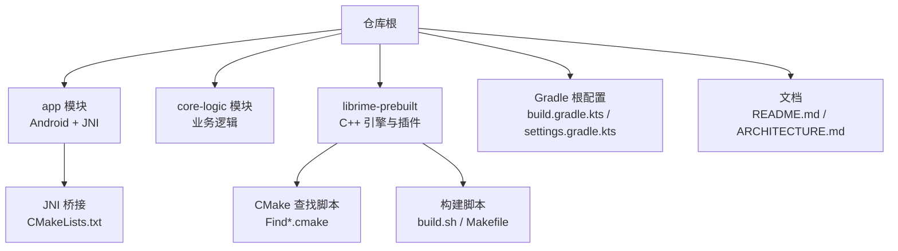
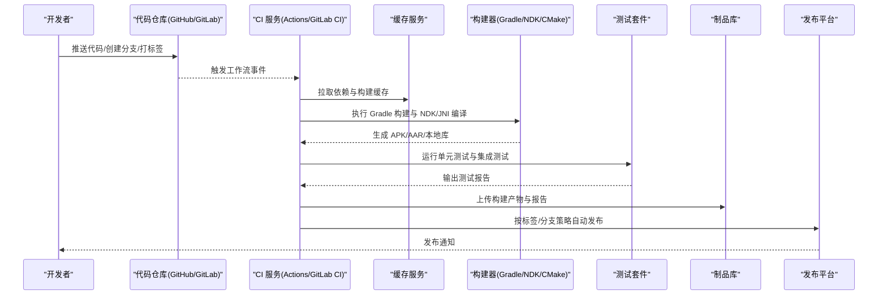
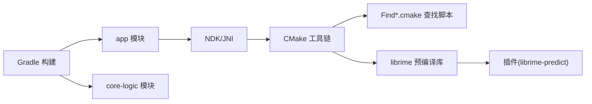

# CI/CD 流水线

<cite>
**本文引用的文件**   
- [README.md](file://README.md)
- [ARCHITECTURE.md](file://ARCHITECTURE.md)
- [build.gradle.kts](file://build.gradle.kts)
- [app/build.gradle.kts](file://app/build.gradle.kts)
- [gradle.properties](file://gradle.properties)
- [settings.gradle.kts](file://settings.gradle.kts)
- [gradle/wrapper/gradle-wrapper.properties](file://gradle/wrapper/gradle-wrapper.properties)
- [app/src/main/jni/librime_jni/CMakeLists.txt](file://app/src/main/jni/librime_jni/CMakeLists.txt)
- [librime-prebuilt/Makefile](file://librime-prebuilt/Makefile)
- [librime-prebuilt/build.sh](file://librime-prebuilt/build.sh)
- [librime-prebuilt/cmake/Find*.cmake](file://librime-prebuilt/cmake/FindYamlCpp.cmake)
- [librime-prebuilt/Dockerfile](file://librime-prebuilt/Dockerfile)
- [librime-prebuilt/.github/workflows/ci.yml](file://librime-prebuilt/.github/workflows/ci.yml)
- [librime-prebuilt/plugins/librime-predict/.github/workflows/ci.yml](file://librime-prebuilt/plugins/librime-predict/.github/workflows/ci.yml)
</cite>

## 目录
1. [简介](#简介)
2. [项目结构](#项目结构)
3. [核心组件](#核心组件)
4. [架构总览](#架构总览)
5. [详细组件分析](#详细组件分析)
6. [依赖关系分析](#依赖关系分析)
7. [性能考虑](#性能考虑)
8. [故障排查指南](#故障排查指南)
9. [结论](#结论)
10. [附录](#附录)

## 简介
本文件面向开发者与运维人员，系统化说明该输入法项目的持续集成与持续交付（CI/CD）流水线设计、配置要点与最佳实践。内容覆盖：
- GitHub Actions/GitLab CI 的触发条件、多分支策略与标签发布流程
- 代码检查、单元测试、构建测试与自动发布的完整链路
- 构建缓存与依赖缓存策略，加速流水线执行
- 测试结果收集与报告生成
- 失败重试与通知机制
- 流水线监控与问题定位方法
- 私有仓库与敏感信息保护策略

本项目为 Android 输入法应用，包含 Kotlin/Java 应用层、JNI 桥接与 C++ 底层 librime 预编译库。CI/CD 需同时处理 Gradle 构建、NDK/JNI 编译以及 CMake 工具链环境准备。

## 项目结构
从仓库根目录可见以下关键要素：
- 应用模块 app：Android 源码、资源、JNI 桥接与 CMake 配置
- 核心逻辑 core-logic：纯 Java/Kotlin 业务逻辑（当前为空或占位）
- 第三方依赖 librime-prebuilt：C++ 引擎与插件，提供 CMake 查找脚本与构建脚本
- Gradle 工程：根 build.gradle.kts、settings.gradle.kts、gradle.properties、wrapper 配置
- 文档 README.md、ARCHITECTURE.md：项目背景与架构说明

**图示来源** 
- [build.gradle.kts](file://build.gradle.kts)
- [settings.gradle.kts](file://settings.gradle.kts)
- [app/src/main/jni/librime_jni/CMakeLists.txt](file://app/src/main/jni/librime_jni/CMakeLists.txt)
- [librime-prebuilt/cmake/FindYamlCpp.cmake](file://librime-prebuilt/cmake/FindYamlCpp.cmake)
- [librime-prebuilt/build.sh](file://librime-prebuilt/build.sh)
- [librime-prebuilt/Makefile](file://librime-prebuilt/Makefile)

**章节来源**
- [README.md](file://README.md)
- [ARCHITECTURE.md](file://ARCHITECTURE.md)
- [build.gradle.kts](file://build.gradle.kts)
- [settings.gradle.kts](file://settings.gradle.kts)

## 核心组件
- Gradle 构建系统
  - 根级构建脚本与设置文件定义多模块工程结构与全局属性
  - app 模块负责 Android 应用构建、资源打包与 NDK/JNI 编译
- NDK/JNI 与 CMake
  - app/src/main/jni/librime_jni/CMakeLists.txt 描述 JNI 桥接与本地库构建
  - 通过 CMake 调用系统工具链与依赖查找脚本
- 第三方 librime 预编译库
  - 提供 CMake 查找脚本（Find*.cmake）与构建脚本（build.sh/Makefile）
  - 可结合 Dockerfile 在容器化环境中复现构建

**章节来源**
- [build.gradle.kts](file://build.gradle.kts)
- [app/build.gradle.kts](file://app/build.gradle.kts)
- [app/src/main/jni/librime_jni/CMakeLists.txt](file://app/src/main/jni/librime_jni/CMakeLists.txt)
- [librime-prebuilt/cmake/FindYamlCpp.cmake](file://librime-prebuilt/cmake/FindYamlCpp.cmake)
- [librime-prebuilt/build.sh](file://librime-prebuilt/build.sh)
- [librime-prebuilt/Makefile](file://librime-prebuilt/Makefile)

## 架构总览
下图展示 CI/CD 流水线的整体架构与数据流，涵盖触发、构建、测试、缓存、产物与发布等环节。

**图示来源** 
- [librime-prebuilt/.github/workflows/ci.yml](file://librime-prebuilt/.github/workflows/ci.yml)
- [librime-prebuilt/plugins/librime-predict/.github/workflows/ci.yml](file://librime-prebuilt/plugins/librime-predict/.github/workflows/ci.yml)
- [build.gradle.kts](file://build.gradle.kts)
- [app/build.gradle.kts](file://app/build.gradle.kts)

## 详细组件分析

### 代码检查与静态分析
- 建议引入 Lint/Spotless/Ktlint 等工具，作为独立任务在 PR 与默认分支上执行
- 将检查结果以工件形式上传，便于审查与归档

**章节来源**
- [build.gradle.kts](file://build.gradle.kts)
- [app/build.gradle.kts](file://app/build.gradle.kts)

### 单元测试与测试报告
- 使用 Gradle 测试任务执行 JVM 与 Android 测试
- 聚合测试报告（JUnit XML/HTML），并上传至 CI 制品库
- 对覆盖率进行统计与阈值校验（可选）

**章节来源**
- [build.gradle.kts](file://build.gradle.kts)
- [app/build.gradle.kts](file://app/build.gradle.kts)

### 构建与 NDK/JNI 编译
- 使用 Gradle 的 NDK 支持或外部 CMake 任务完成 JNI 编译
- 确保 CMake 工具链与依赖查找脚本可用（Find*.cmake）
- 针对多 ABI（arm64-v8a 等）并行构建以提升速度

**章节来源**
- [app/src/main/jni/librime_jni/CMakeLists.txt](file://app/src/main/jni/librime_jni/CMakeLists.txt)
- [librime-prebuilt/cmake/FindYamlCpp.cmake](file://librime-prebuilt/cmake/FindYamlCpp.cmake)

### 自动化发布与版本标签
- 基于 Git 标签（如 v1.2.3）触发发布流水线
- 生成签名 APK/AAR，上传到制品库或发布平台
- 自动生成变更日志与发布说明

**章节来源**
- [librime-prebuilt/.github/workflows/ci.yml](file://librime-prebuilt/.github/workflows/ci.yml)
- [librime-prebuilt/plugins/librime-predict/.github/workflows/ci.yml](file://librime-prebuilt/plugins/librime-predict/.github/workflows/ci.yml)

### 多分支策略
- main/master 分支：稳定版构建与发布
- develop 分支：集成测试与预览构建
- feature/* 分支：PR 检查与快速验证
- 通过分支规则控制任务执行范围与产物命名

**章节来源**
- [librime-prebuilt/.github/workflows/ci.yml](file://librime-prebuilt/.github/workflows/ci.yml)

### 构建缓存与依赖缓存
- 缓存 Gradle 依赖与构建输出（.gradle/caches、build 目录）
- 缓存 NDK/CMake 工具链与第三方依赖（librime 预编译产物）
- 使用键值策略（如 gradle.lockfile、checksum）提升命中率

**章节来源**
- [build.gradle.kts](file://build.gradle.kts)
- [app/build.gradle.kts](file://app/build.gradle.kts)
- [librime-prebuilt/build.sh](file://librime-prebuilt/build.sh)

### 测试结果收集与报告生成
- 统一输出 JUnit XML 与 HTML 报告
- 在 CI 界面中可视化展示通过率、失败用例详情
- 失败时阻断合并或发布流程

**章节来源**
- [build.gradle.kts](file://build.gradle.kts)
- [app/build.gradle.kts](file://app/build.gradle.kts)

### 失败重试与通知机制
- 对网络相关步骤（下载依赖、拉取镜像）启用有限次重试
- 失败时发送通知（邮件/IM/Slack/钉钉）
- 重要失败需标记为阻塞项，阻止后续发布

**章节来源**
- [librime-prebuilt/.github/workflows/ci.yml](file://librime-prebuilt/.github/workflows/ci.yml)

### 流水线监控与问题排查
- 查看构建日志、测试报告与制品清单
- 使用缓存命中率与构建时长指标评估性能
- 对常见错误（NDK 路径、CMake 版本、依赖缺失）建立知识库

**章节来源**
- [librime-prebuilt/Dockerfile](file://librime-prebuilt/Dockerfile)
- [librime-prebuilt/build.sh](file://librime-prebuilt/build.sh)

### 私有仓库与敏感信息保护
- 使用密钥管理（GitHub Secrets/GitLab CI Variables）存储签名证书、Token
- 最小权限原则，限制访问范围
- 避免在日志中泄露敏感信息

**章节来源**
- [librime-prebuilt/.github/workflows/ci.yml](file://librime-prebuilt/.github/workflows/ci.yml)

## 依赖关系分析
下图展示各模块与工具的依赖关系，包括 Gradle、NDK、CMake 与第三方 librime。

**图示来源** 
- [build.gradle.kts](file://build.gradle.kts)
- [app/build.gradle.kts](file://app/build.gradle.kts)
- [app/src/main/jni/librime_jni/CMakeLists.txt](file://app/src/main/jni/librime_jni/CMakeLists.txt)
- [librime-prebuilt/cmake/FindYamlCpp.cmake](file://librime-prebuilt/cmake/FindYamlCpp.cmake)
- [librime-prebuilt/plugins/librime-predict/.github/workflows/ci.yml](file://librime-prebuilt/plugins/librime-predict/.github/workflows/ci.yml)

**章节来源**
- [build.gradle.kts](file://build.gradle.kts)
- [settings.gradle.kts](file://settings.gradle.kts)
- [app/build.gradle.kts](file://app/build.gradle.kts)
- [app/src/main/jni/librime_jni/CMakeLists.txt](file://app/src/main/jni/librime_jni/CMakeLists.txt)
- [librime-prebuilt/cmake/FindYamlCpp.cmake](file://librime-prebuilt/cmake/FindYamlCpp.cmake)

## 性能考虑
- 并行化构建：多 ABI、多模块并行执行
- 缓存优化：合理设置缓存键，避免无效失效
- 增量构建：利用 Gradle 增量特性减少重复编译
- 资源瘦身：开启混淆与资源压缩，减小产物体积
- 容器化构建：使用固定镜像版本保证一致性

[本节为通用指导，不直接分析具体文件]

## 故障排查指南
- 常见问题
  - NDK 路径或版本不匹配
  - CMake 版本过低或缺少必要组件
  - 依赖查找脚本未找到目标库
  - 网络超时导致依赖下载失败
- 排查步骤
  - 查看构建日志中的错误堆栈
  - 验证环境变量与工具链安装
  - 清理缓存后重试
  - 使用 Docker 镜像复现环境
- 预防措施
  - 锁定工具链版本
  - 增加重试与超时配置
  - 完善错误码与提示信息

**章节来源**
- [librime-prebuilt/Dockerfile](file://librime-prebuilt/Dockerfile)
- [librime-prebuilt/build.sh](file://librime-prebuilt/build.sh)
- [app/src/main/jni/librime_jni/CMakeLists.txt](file://app/src/main/jni/librime_jni/CMakeLists.txt)

## 结论
本 CI/CD 流水线围绕 Android 输入法应用的构建与发布需求，整合了 Gradle、NDK/JNI、CMake 与第三方 librime 库的构建流程。通过合理的缓存策略、分支与标签管理、测试报告与制品管理，以及安全与监控措施，实现了高效、稳定、可追溯的持续集成与交付。建议持续优化构建性能与错误诊断能力，保障团队协作与发布质量。

[本节为总结性内容，不直接分析具体文件]

## 附录
- 推荐工具链版本与依赖清单
- 环境变量与密钥配置模板
- 常用命令与调试技巧

[本节为补充信息，不直接分析具体文件]