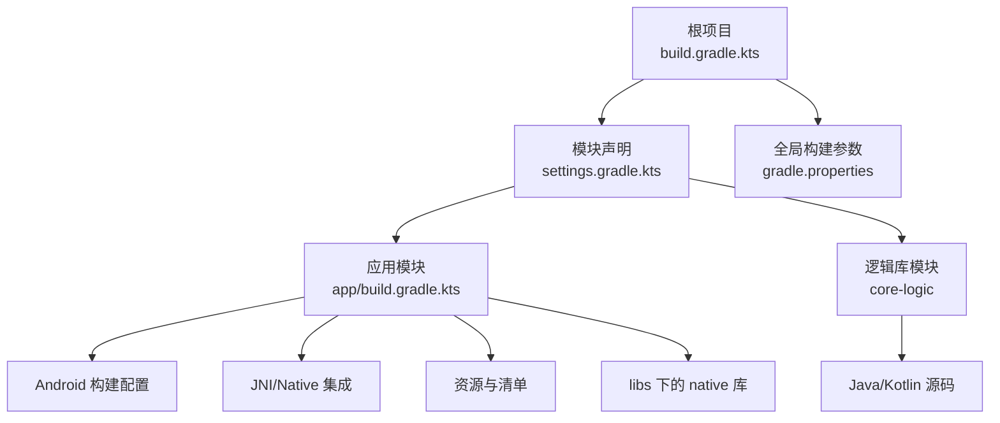
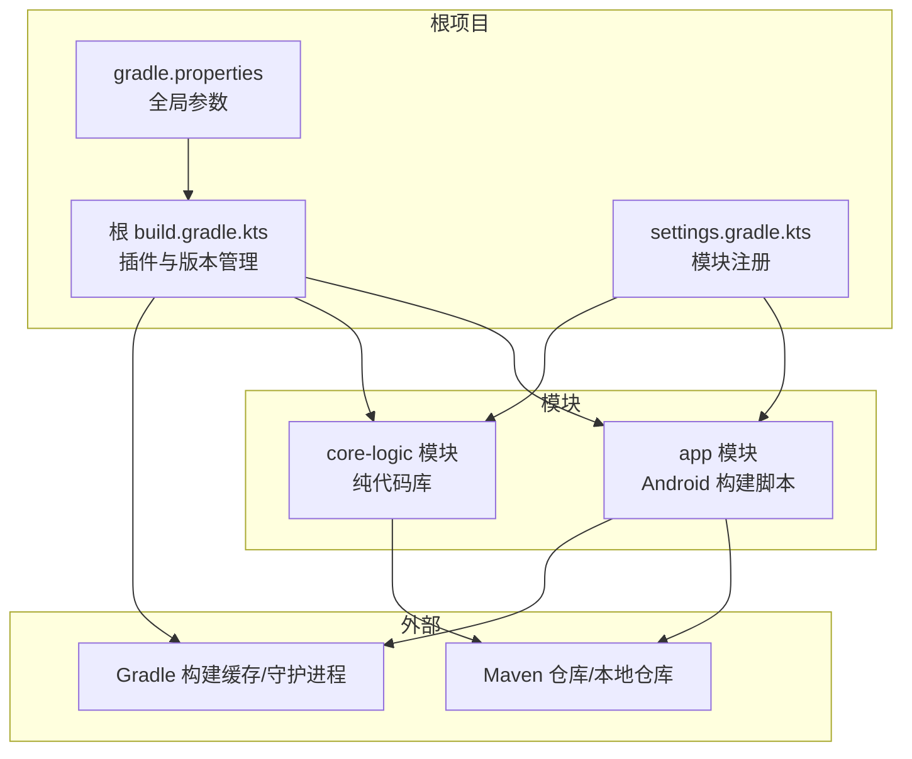
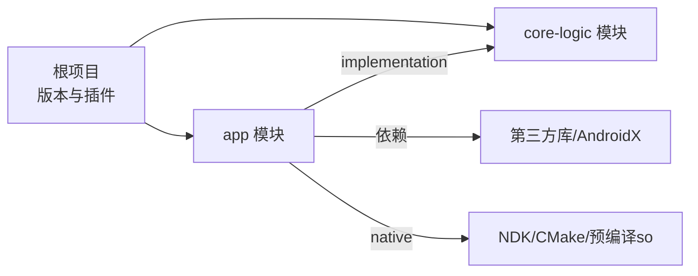

# Gradle 构建配置

<cite>
**本文引用的文件**   
- [build.gradle.kts](file://build.gradle.kts)
- [settings.gradle.kts](file://settings.gradle.kts)
- [gradle.properties](file://gradle.properties)
- [app/build.gradle.kts](file://app/build.gradle.kts)
- [core-logic/src/main/java/com/ziyou/ime/core/association](file://core-logic/src/main/java/com/ziyou/ime/core/association)
- [gradle/wrapper/gradle-wrapper.properties](file://gradle/wrapper/gradle-wrapper.properties)
</cite>

## 目录
1. [简介](#简介)
2. [项目结构](#项目结构)
3. [核心组件](#核心组件)
4. [架构总览](#架构总览)
5. [详细组件分析](#详细组件分析)
6. [依赖关系分析](#依赖关系分析)
7. [性能考量](#性能考量)
8. [故障排查指南](#故障排查指南)
9. [结论](#结论)
10. [附录](#附录)

## 简介
本文件面向 Android + Kotlin 多模块项目的 Gradle 构建配置，系统性说明根项目与模块的 build.gradle.kts 脚本结构、依赖管理、插件配置与自定义任务；解释 gradle.properties 中的全局构建选项（JVM 参数、构建缓存、并行优化等）；梳理 Android 特定构建配置（编译选项、资源处理、签名配置）；并给出构建性能优化最佳实践与常见问题排查方法。文档力求对非深度技术读者友好，同时提供足够的细节以便工程化落地。

## 项目结构
本项目采用 Gradle 多模块组织：
- 根项目负责统一依赖版本、插件版本与全局构建行为
- app 模块为 Android 应用模块，包含 UI、IME 服务、JNI 集成与资源
- core-logic 模块为纯 Java/Kotlin 逻辑库（当前为空骨架，预留扩展）
- librime-prebuilt 为第三方 C++ 库源码或预编译产物（由 JNI 层调用）
- libs 目录存放预编译的 native 库头文件与二进制

图表来源
- [build.gradle.kts:1-200](file://build.gradle.kts#L1-L200)
- [settings.gradle.kts:1-200](file://settings.gradle.kts#L1-L200)
- [gradle.properties:1-200](file://gradle.properties#L1-L200)
- [app/build.gradle.kts:1-200](file://app/build.gradle.kts#L1-L200)

章节来源
- [build.gradle.kts:1-200](file://build.gradle.kts#L1-L200)
- [settings.gradle.kts:1-200](file://settings.gradle.kts#L1-L200)
- [gradle.properties:1-200](file://gradle.properties#L1-L200)
- [app/build.gradle.kts:1-200](file://app/build.gradle.kts#L1-L200)

## 核心组件
- 根级构建脚本：集中声明插件、依赖版本与公共配置，确保多模块一致性
- 设置脚本：定义参与构建的模块集合与仓库源
- 应用模块脚本：Android 插件配置、依赖声明、构建变体、签名与打包
- 全局属性：JVM、Gradle 守护进程、并行与缓存策略

章节来源
- [build.gradle.kts:1-200](file://build.gradle.kts#L1-L200)
- [settings.gradle.kts:1-200](file://settings.gradle.kts#L1-L200)
- [gradle.properties:1-200](file://gradle.properties#L1-L200)
- [app/build.gradle.kts:1-200](file://app/build.gradle.kts#L1-L200)

## 架构总览
下图展示 Gradle 构建在根项目与各模块间的职责划分与数据流：

图表来源
- [build.gradle.kts:1-200](file://build.gradle.kts#L1-L200)
- [settings.gradle.kts:1-200](file://settings.gradle.kts#L1-L200)
- [gradle.properties:1-200](file://gradle.properties#L1-L200)
- [app/build.gradle.kts:1-200](file://app/build.gradle.kts#L1-L200)

## 详细组件分析

### 根项目构建脚本（build.gradle.kts）
- 插件管理：集中声明 Android、Kotlin、Android Library 等插件及其版本，便于统一升级
- 依赖版本管理：通过版本目录或 ext 变量统一管理三方库版本，避免散落在各模块
- 公共配置：统一的编译目标、语言级别、测试框架、代码风格与静态检查
- 自定义任务：可在此定义跨模块任务（如统一清理、生成版本号、批量校验）

建议关注点
- 插件版本与 Android Gradle Plugin（AGP）版本需与 Gradle 版本兼容
- 使用版本目录（version catalog）提升可读性与可维护性
- 将重复的配置抽取到公共脚本并通过 apply(from=...) 复用

章节来源
- [build.gradle.kts:1-200](file://build.gradle.kts#L1-L200)

### 设置脚本（settings.gradle.kts）
- 模块声明：include 所有参与构建的模块（app、core-logic 等）
- 仓库源：声明 Maven Central、Google、JitPack、本地 maven 仓库等
- 插件管理：可选地启用插件管理 DSL，统一插件版本

建议关注点
- 仅 include 实际需要的模块，减少构建图规模
- 合理配置仓库顺序，优先使用稳定且快速的镜像

章节来源
- [settings.gradle.kts:1-200](file://settings.gradle.kts#L1-L200)

### 应用模块构建脚本（app/build.gradle.kts）
- Android 插件配置：compileSdk/targetSdk/minSdk、命名空间、默认配置
- 构建变体：debug/release、多渠道、产品风味
- 依赖声明：implementation/api/dependencies 与平台库、第三方库
- 资源处理：res、assets、AndroidManifest.xml、R 生成与混淆
- 签名配置：keystore、签名别名、密码环境变量注入
- JNI/Native 集成：ndkVersion、abiFilters、CMakeLists.txt 路径、预编译 so 引入
- 测试与覆盖率：单元测试、仪器测试、Jacoco 配置

建议关注点
- 明确区分 debug/release 的编译选项与资源替换
- 使用 buildTypes 与 flavorDimensions 管理多环境
- 安全存储签名信息，避免硬编码

章节来源
- [app/build.gradle.kts:1-200](file://app/build.gradle.kts#L1-L200)

### 逻辑库模块（core-logic）
- 当前为空骨架，预留 Java/Kotlin 源码目录
- 后续可添加 library 插件、API 暴露与测试配置

章节来源
- [core-logic/src/main/java/com/ziyou/ime/core/association](file://core-logic/src/main/java/com/ziyou/ime/core/association)

### 全局属性（gradle.properties）
- JVM 参数：org.gradle.jvmargs（堆大小、GC 选择、内存限制）
- 构建缓存：org.gradle.caching=true、org.gradle.parallel=true、org.gradle.configureondemand=true
- 守护进程：org.gradle.daemon=true
- Android 相关：android.useAndroidX、android.enableJetifier、android.nonTransitiveRClass
- 网络与代理：系统代理、超时、重试策略

建议关注点
- 根据机器 CPU/内存调整 JVM 参数，避免 OOM
- 开启并行与缓存显著提升增量构建速度
- 谨慎开启 configure-on-demand，确保任务依赖正确

章节来源
- [gradle.properties:1-200](file://gradle.properties#L1-L200)

### Gradle Wrapper（gradle-wrapper.properties）
- 指定 Gradle 发行版版本与下载 URL
- 保证团队与环境一致性

章节来源
- [gradle/wrapper/gradle-wrapper.properties:1-200](file://gradle/wrapper/gradle-wrapper.properties#L1-L200)

## 依赖关系分析
- 根项目集中管理插件与依赖版本，模块通过 implementation 引入
- app 模块依赖 core-logic 模块（若存在），以及 Android SDK、第三方库与 native 库
- 仓库源优先级影响依赖解析速度与稳定性

图表来源
- [build.gradle.kts:1-200](file://build.gradle.kts#L1-L200)
- [settings.gradle.kts:1-200](file://settings.gradle.kts#L1-L200)
- [app/build.gradle.kts:1-200](file://app/build.gradle.kts#L1-L200)

章节来源
- [build.gradle.kts:1-200](file://build.gradle.kts#L1-L200)
- [settings.gradle.kts:1-200](file://settings.gradle.kts#L1-L200)
- [app/build.gradle.kts:1-200](file://app/build.gradle.kts#L1-L200)

## 性能考量
- 增量编译：合理使用 API/implementation，避免不必要的重新编译
- 构建缓存：开启 org.gradle.caching，配合远程缓存共享结果
- 并行执行：org.gradle.parallel=true，结合 -Pmax-workers 控制并发度
- 守护进程：org.gradle.daemon=true，缩短冷启动时间
- JVM 调优：根据机器配置设置 org.gradle.jvmargs，避免 GC 抖动
- 依赖解析优化：固定版本、使用稳定的仓库镜像、减少动态版本
- 资源与 ABI：按需启用 abiFilters，减少无用架构产物
- 任务去重：合并重复任务，避免冗余工作

[本节为通用指导，不直接分析具体文件]

## 故障排查指南
- 构建失败：查看完整日志，定位具体任务与错误栈；必要时使用 --info/--debug
- 依赖冲突：使用 ./gradlew :app:dependencies 或 :app:dependencyInsight 分析
- 签名问题：确认 keystore 路径、别名、密码环境变量正确；调试与发布签名分离
- Native 集成：核对 ndkVersion、abiFilters、CMakeLists 路径与工具链；检查预编译 so 是否齐全
- 内存不足：增大 org.gradle.jvmargs，关闭不必要插件，减少并行度
- 缓存损坏：清理 .gradle 与构建输出目录后重试
- 仓库不可达：检查代理与镜像配置，切换备用仓库源

章节来源
- [gradle.properties:1-200](file://gradle.properties#L1-L200)
- [app/build.gradle.kts:1-200](file://app/build.gradle.kts#L1-L200)

## 结论
通过根项目集中管理与模块内精细化配置相结合，可实现一致、可维护且高性能的 Gradle 构建体系。遵循依赖与插件版本统一管理、合理配置 Android 构建变体与签名、启用并行与缓存，并结合清晰的依赖分析与问题排查流程，可显著提升开发效率与构建稳定性。

[本节为总结性内容，不直接分析具体文件]

## 附录
- 常用命令
  - 清理构建：./gradlew clean
  - 构建 Debug：./gradlew assembleDebug
  - 构建 Release：./gradlew assembleRelease
  - 运行测试：./gradlew test
  - 依赖分析：./gradlew :app:dependencies
- 参考文件
  - 根构建脚本：[build.gradle.kts](file://build.gradle.kts)
  - 模块设置：[settings.gradle.kts](file://settings.gradle.kts)
  - 全局参数：[gradle.properties](file://gradle.properties)
  - 应用模块：[app/build.gradle.kts](file://app/build.gradle.kts)
  - Wrapper 版本：[gradle/wrapper/gradle-wrapper.properties](file://gradle/wrapper/gradle-wrapper.properties)