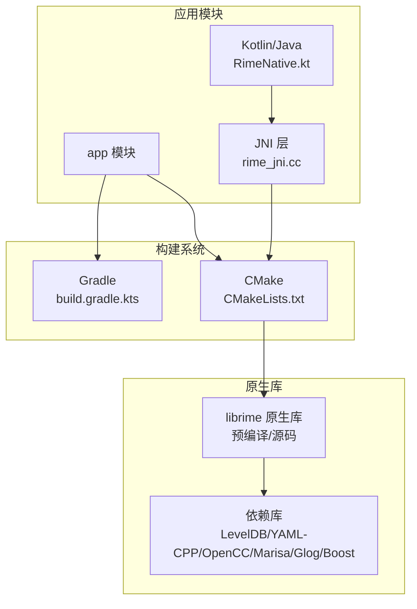
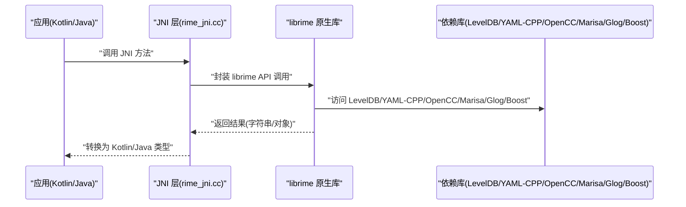
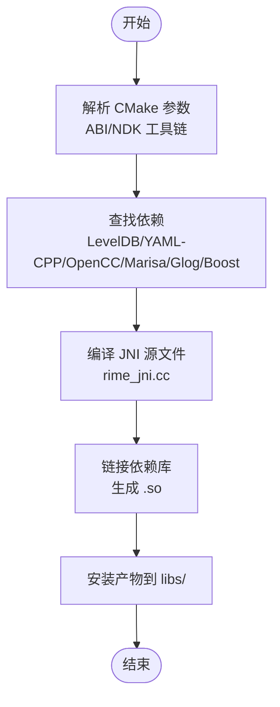
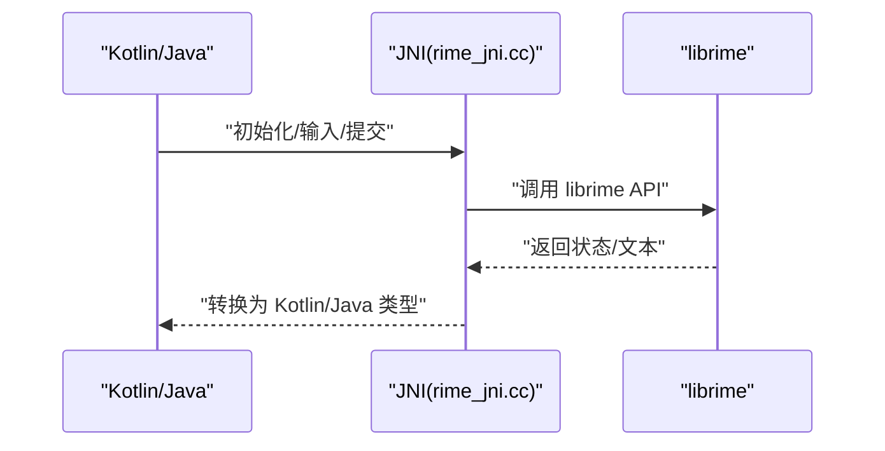
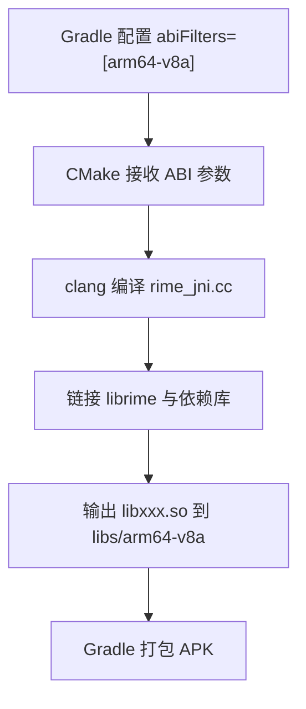
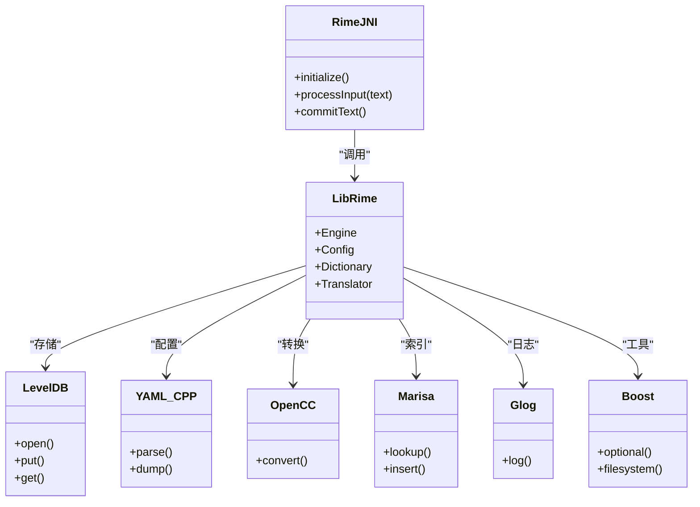
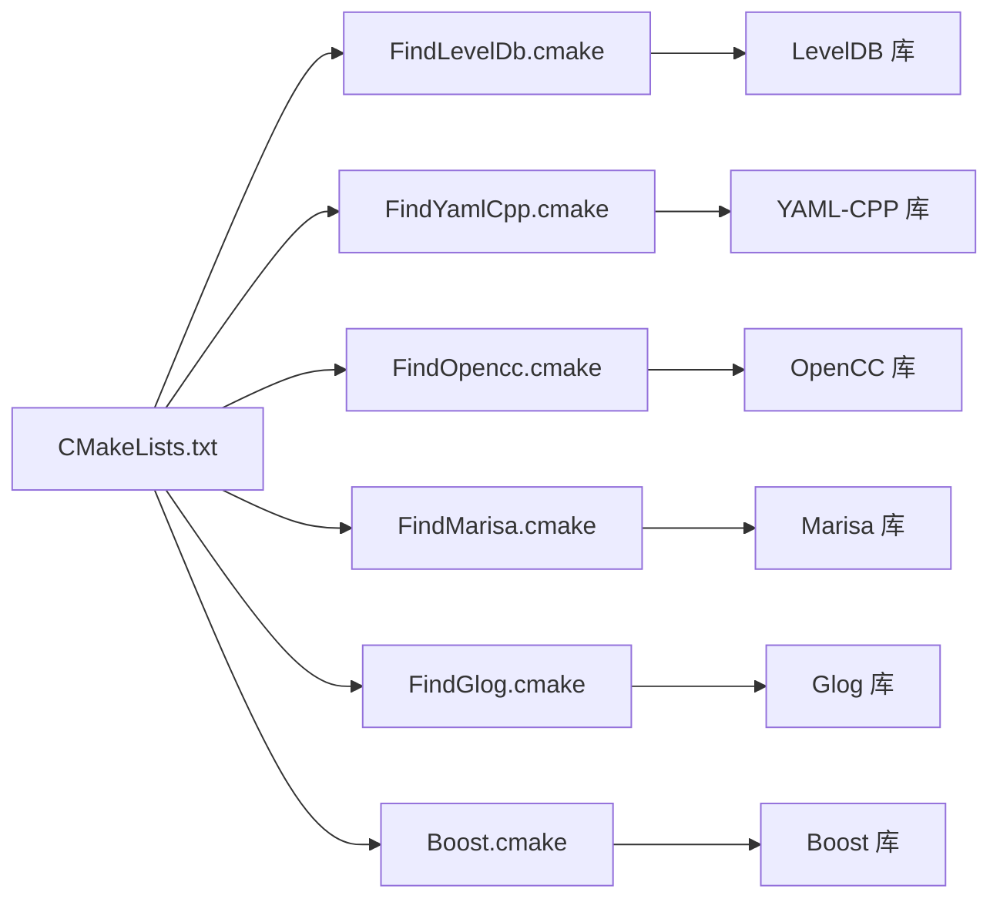

# NDK 编译环境

<cite>
**本文档引用的文件**   
- [app/build.gradle.kts](file://app/build.gradle.kts)
- [app/src/main/jni/librime_jni/CMakeLists.txt](file://app/src/main/jni/librime_jni/CMakeLists.txt)
- [app/src/main/jni/librime_jni/rime_jni.cc](file://app/src/main/jni/librime_jni/rime_jni.cc)
- [app/src/main/java/com/ziyou/ime/core/RimeNative.kt](file://app/src/main/java/com/ziyou/ime/core/RimeNative.kt)
- [app/src/main/java/com/ziyou/ime/config/AssetDeployer.kt](file://app/src/main/java/com/ziyou/ime/config/AssetDeployer.kt)
- [gradle.properties](file://gradle.properties)
- [build.gradle.kts](file://build.gradle.kts)
- [settings.gradle.kts](file://settings.gradle.kts)
- [librime-prebuilt/cmake/FindLevelDb.cmake](file://librime-prebuilt/cmake/FindLevelDb.cmake)
- [librime-prebuilt/cmake/FindYamlCpp.cmake](file://librime-prebuilt/cmake/FindYamlCpp.cmake)
- [librime-prebuilt/cmake/FindOpencc.cmake](file://librime-prebuilt/cmake/FindOpencc.cmake)
- [librime-prebuilt/cmake/FindMarisa.cmake](file://librime-prebuilt/cmake/FindMarisa.cmake)
- [librime-prebuilt/cmake/FindGlog.cmake](file://librime-prebuilt/cmake/FindGlog.cmake)
- [librime-prebuilt/cmake/Boost.cmake](file://librime-prebuilt/cmake/Boost.cmake)
- [librime-prebuilt/cmake/BundleStaticLibrary.cmake](file://librime-prebuilt/cmake/BundleStaticLibrary.cmake)
- [librime-prebuilt/cmake/OpenccWorkarounds.cmake](file://librime-prebuilt/cmake/OpenccWorkarounds.cmake)
- [librime-prebuilt/build.sh](file://librime-prebuilt/build.sh)
- [librime-prebuilt/README.md](file://librime-prebuilt/README.md)
- [libs/arm64-v8a](file://libs/arm64-v8a)
- [libs/include](file://libs/include)
</cite>

## 目录
1. [简介](#简介)
2. [项目结构](#项目结构)
3. [核心组件](#核心组件)
4. [架构总览](#架构总览)
5. [详细组件分析](#详细组件分析)
6. [依赖分析](#依赖分析)
7. [性能考虑](#性能考虑)
8. [故障排查指南](#故障排查指南)
9. [结论](#结论)
10. [附录](#附录)

## 简介
本文件面向在 Android 项目中集成 librime 原生库的开发者，系统性说明 NDK 编译环境的搭建与配置、CMakeLists.txt 的关键设置、JNI 库的构建流程、多架构（arm64-v8a）产物管理、预编译库管理与版本控制策略、NDK 工具链与环境变量、交叉编译常见问题排查、本地开发调试配置，以及原生代码的性能优化与内存管理最佳实践。文档以仓库实际文件为依据，提供可追溯的来源标注与可视化图示，帮助读者快速上手并深入理解整个构建链路。

## 项目结构
本项目采用 Gradle + CMake 的混合构建方式：
- app 模块包含 Kotlin/Java 业务层与 JNI 桥接层，并通过 CMake 构建原生库。
- core-logic 为纯 Java/Kotlin 逻辑模块（与本 NDK 主题关联度较低）。
- librime-prebuilt 为第三方 librime 源码及构建脚本与 cmake 辅助脚本集合，用于生成预编译库或作为子模块参与构建。
- libs 目录存放按架构划分的预编译库与头文件，供 CMake 查找与链接。

图表来源
- [app/src/main/jni/librime_jni/CMakeLists.txt](file://app/src/main/jni/librime_jni/CMakeLists.txt)
- [app/src/main/java/com/ziyou/ime/core/RimeNative.kt](file://app/src/main/java/com/ziyou/ime/core/RimeNative.kt)
- [app/build.gradle.kts](file://app/build.gradle.kts)

章节来源
- [app/build.gradle.kts](file://app/build.gradle.kts)
- [build.gradle.kts](file://build.gradle.kts)
- [settings.gradle.kts](file://settings.gradle.kts)

## 核心组件
- CMake 构建入口：位于 app/src/main/jni/librime_jni/CMakeLists.txt，定义目标库、源文件、包含路径、链接选项与安装规则。
- JNI 桥接实现：rime_jni.cc 暴露 JNI 函数，封装 librime API 调用，负责数据转换与生命周期管理。
- Kotlin/Java 绑定：RimeNative.kt 通过 System.loadLibrary 加载原生库并提供上层 API。
- 资源部署：AssetDeployer.kt 将 assets/rime 下的词典与配置文件部署到运行时目录，确保 librime 正确加载。
- Gradle 配置：app/build.gradle.kts 中启用 ndk { cxx { ... } } 块，指定 CMake 脚本路径、ABI 过滤、编译选项等。

章节来源
- [app/src/main/jni/librime_jni/CMakeLists.txt](file://app/src/main/jni/librime_jni/CMakeLists.txt)
- [app/src/main/jni/librime_jni/rime_jni.cc](file://app/src/main/jni/librime_jni/rime_jni.cc)
- [app/src/main/java/com/ziyou/ime/core/RimeNative.kt](file://app/src/main/java/com/ziyou/ime/core/RimeNative.kt)
- [app/src/main/java/com/ziyou/ime/config/AssetDeployer.kt](file://app/src/main/java/com/ziyou/ime/config/AssetDeployer.kt)
- [app/build.gradle.kts](file://app/build.gradle.kts)

## 架构总览
下图展示了从 Kotlin/Java 到 JNI 再到 librime 的调用链路与构建产物关系。

图表来源
- [app/src/main/jni/librime_jni/rime_jni.cc](file://app/src/main/jni/librime_jni/rime_jni.cc)
- [app/src/main/java/com/ziyou/ime/core/RimeNative.kt](file://app/src/main/java/com/ziyou/ime/core/RimeNative.kt)

章节来源
- [app/src/main/jni/librime_jni/rime_jni.cc](file://app/src/main/jni/librime_jni/rime_jni.cc)
- [app/src/main/java/com/ziyou/ime/core/RimeNative.kt](file://app/src/main/java/com/ziyou/ime/core/RimeNative.kt)

## 详细组件分析

### CMakeLists.txt 配置与 JNI 库构建流程
- 目标库定义：声明 JNI 库名称、源文件列表、包含路径与链接库。
- 查找依赖：通过 find_package 或自定义 Find*.cmake 定位 LevelDB、YAML-CPP、OpenCC、Marisa、Glog、Boost 等依赖的头文件与库文件。
- ABI 与工具链：由 Gradle 传入 NDK 工具链参数，CMake 根据目标 ABI 选择编译器与链接器。
- 安装与打包：将生成的 .so 安装至 libs/<abi>/ 目录，供 Gradle 打包进 APK。

图表来源
- [app/src/main/jni/librime_jni/CMakeLists.txt](file://app/src/main/jni/librime_jni/CMakeLists.txt)

章节来源
- [app/src/main/jni/librime_jni/CMakeLists.txt](file://app/src/main/jni/librime_jni/CMakeLists.txt)

### JNI 桥接实现与调用序列
- JNI 导出函数：rime_jni.cc 暴露 JNI 接口，处理字符串编码、对象创建与异常传播。
- 调用顺序：Kotlin/Java 调用 -> JNI 层校验与转换 -> librime API -> 返回结果 -> JNI 层转换回 Kotlin/Java。

图表来源
- [app/src/main/jni/librime_jni/rime_jni.cc](file://app/src/main/jni/librime_jni/rime_jni.cc)
- [app/src/main/java/com/ziyou/ime/core/RimeNative.kt](file://app/src/main/java/com/ziyou/ime/core/RimeNative.kt)

章节来源
- [app/src/main/jni/librime_jni/rime_jni.cc](file://app/src/main/jni/librime_jni/rime_jni.cc)
- [app/src/main/java/com/ziyou/ime/core/RimeNative.kt](file://app/src/main/java/com/ziyou/ime/core/RimeNative.kt)

### 多架构（arm64-v8a）编译配置与产物管理
- ABI 过滤：在 Gradle 的 android.ndk.abiFilters 中指定 arm64-v8a，仅构建该架构产物，减小 APK 体积。
- 产物目录：CMake 将 .so 安装到 libs/arm64-v8a/，Gradle 打包时自动包含对应 ABI 的库。
- 工具链：NDK 工具链通过 Gradle 注入，CMake 使用 clang 编译器与链接器生成 ARM64 二进制。

图表来源
- [app/build.gradle.kts](file://app/build.gradle.kts)
- [app/src/main/jni/librime_jni/CMakeLists.txt](file://app/src/main/jni/librime_jni/CMakeLists.txt)

章节来源
- [app/build.gradle.kts](file://app/build.gradle.kts)
- [app/src/main/jni/librime_jni/CMakeLists.txt](file://app/src/main/jni/librime_jni/CMakeLists.txt)

### librime 原生库集成与依赖关系
- 集成方式：通过预编译库（libs/arm64-v8a/*.so 与 include/*.h）或源码子模块方式引入；CMake 使用 find_package 或自定义 Find*.cmake 定位依赖。
- 依赖清单：LevelDB（持久化）、YAML-CPP（配置解析）、OpenCC（繁简转换）、Marisa（前缀树）、Glog（日志）、Boost（可选功能）。
- 版本控制：建议锁定依赖版本号，使用 Git Submodule 或固定标签，避免上游变更导致构建不稳定。

图表来源
- [librime-prebuilt/cmake/FindLevelDb.cmake](file://librime-prebuilt/cmake/FindLevelDb.cmake)
- [librime-prebuilt/cmake/FindYamlCpp.cmake](file://librime-prebuilt/cmake/FindYamlCpp.cmake)
- [librime-prebuilt/cmake/FindOpencc.cmake](file://librime-prebuilt/cmake/FindOpencc.cmake)
- [librime-prebuilt/cmake/FindMarisa.cmake](file://librime-prebuilt/cmake/FindMarisa.cmake)
- [librime-prebuilt/cmake/FindGlog.cmake](file://librime-prebuilt/cmake/FindGlog.cmake)
- [librime-prebuilt/cmake/Boost.cmake](file://librime-prebuilt/cmake/Boost.cmake)

章节来源
- [librime-prebuilt/cmake/FindLevelDb.cmake](file://librime-prebuilt/cmake/FindLevelDb.cmake)
- [librime-prebuilt/cmake/FindYamlCpp.cmake](file://librime-prebuilt/cmake/FindYamlCpp.cmake)
- [librime-prebuilt/cmake/FindOpencc.cmake](file://librime-prebuilt/cmake/FindOpencc.cmake)
- [librime-prebuilt/cmake/FindMarisa.cmake](file://librime-prebuilt/cmake/FindMarisa.cmake)
- [librime-prebuilt/cmake/FindGlog.cmake](file://librime-prebuilt/cmake/FindGlog.cmake)
- [librime-prebuilt/cmake/Boost.cmake](file://librime-prebuilt/cmake/Boost.cmake)

### 预编译库管理与版本控制策略
- 预编译库位置：libs/arm64-v8a/*.so 与 libs/include/*.h。
- 版本锁定：在 librime-prebuilt 中使用固定分支或标签，配合 build.sh 生成一致的产物。
- 校验与发布：对预编译库进行哈希校验，记录构建环境与依赖版本，便于回溯问题。

章节来源
- [librime-prebuilt/build.sh](file://librime-prebuilt/build.sh)
- [librime-prebuilt/README.md](file://librime-prebuilt/README.md)
- [libs/arm64-v8a](file://libs/arm64-v8a)
- [libs/include](file://libs/include)

### NDK 工具链配置与环境变量
- Gradle 注入：android.ndk { cxx { ... } } 块中指定 CMake 脚本路径、ABI 过滤、编译选项。
- 环境变量：ANDROID_NDK_HOME、NDK_ROOT、CMAKE_TOOLCHAIN_FILE 等，确保 CMake 能找到正确的工具链。
- 工具链选择：建议使用 NDK 自带的 clang，避免系统编译器冲突。

章节来源
- [app/build.gradle.kts](file://app/build.gradle.kts)
- [gradle.properties](file://gradle.properties)

### 交叉编译配置与常见问题排查
- 交叉编译：CMake 通过 NDK 工具链自动完成交叉编译，无需手动设置 sysroot。
- 常见问题：
  - 找不到依赖头文件或库：检查 Find*.cmake 路径与 CMAKE_PREFIX_PATH。
  - ABI 不匹配：确认 abiFilters 与预编译库架构一致。
  - 符号未定义：检查链接顺序与依赖库是否完整。
  - 运行时崩溃：使用 logcat 与 ndk-stack 定位崩溃堆栈。

章节来源
- [app/src/main/jni/librime_jni/CMakeLists.txt](file://app/src/main/jni/librime_jni/CMakeLists.txt)
- [librime-prebuilt/cmake/FindLevelDb.cmake](file://librime-prebuilt/cmake/FindLevelDb.cmake)
- [librime-prebuilt/cmake/FindYamlCpp.cmake](file://librime-prebuilt/cmake/FindYamlCpp.cmake)
- [librime-prebuilt/cmake/FindOpencc.cmake](file://librime-prebuilt/cmake/FindOpencc.cmake)
- [librime-prebuilt/cmake/FindMarisa.cmake](file://librime-prebuilt/cmake/FindMarisa.cmake)
- [librime-prebuilt/cmake/FindGlog.cmake](file://librime-prebuilt/cmake/FindGlog.cmake)
- [librime-prebuilt/cmake/Boost.cmake](file://librime-prebuilt/cmake/Boost.cmake)

### 本地开发环境搭建与调试配置
- 环境要求：Android Studio、NDK、CMake、Git。
- 步骤：
  - 克隆仓库并初始化子模块（如使用 Git Submodule）。
  - 配置 ANDROID_NDK_HOME 与 CMAKE_TOOLCHAIN_FILE。
  - 在 Gradle 中启用 C++ 支持并指定 CMake 脚本。
  - 运行 app 模块，确保 assets/rime 资源被正确部署。
- 调试：
  - 使用 Android Studio 的 C++ 调试器附加进程。
  - 开启 Glog 日志并查看 logcat。
  - 使用 ndk-stack 解析崩溃堆栈。

章节来源
- [app/src/main/java/com/ziyou/ime/config/AssetDeployer.kt](file://app/src/main/java/com/ziyou/ime/config/AssetDeployer.kt)
- [app/build.gradle.kts](file://app/build.gradle.kts)

### 原生代码性能优化与内存管理最佳实践
- 性能优化：
  - 减少 JNI 调用次数，批量处理数据。
  - 避免频繁字符串拷贝，使用共享缓冲区。
  - 合理缓存词典与配置，减少 I/O 开销。
- 内存管理：
  - 严格管理 JNIEnv 与局部引用，及时释放。
  - 避免内存泄漏，使用 RAII 或智能指针。
  - 监控内存使用，使用 Android Profiler 分析。

章节来源
- [app/src/main/jni/librime_jni/rime_jni.cc](file://app/src/main/jni/librime_jni/rime_jni.cc)

## 依赖分析
下图展示 CMake 查找依赖的流程与各 Find*.cmake 的作用。

图表来源
- [app/src/main/jni/librime_jni/CMakeLists.txt](file://app/src/main/jni/librime_jni/CMakeLists.txt)
- [librime-prebuilt/cmake/FindLevelDb.cmake](file://librime-prebuilt/cmake/FindLevelDb.cmake)
- [librime-prebuilt/cmake/FindYamlCpp.cmake](file://librime-prebuilt/cmake/FindYamlCpp.cmake)
- [librime-prebuilt/cmake/FindOpencc.cmake](file://librime-prebuilt/cmake/FindOpencc.cmake)
- [librime-prebuilt/cmake/FindMarisa.cmake](file://librime-prebuilt/cmake/FindMarisa.cmake)
- [librime-prebuilt/cmake/FindGlog.cmake](file://librime-prebuilt/cmake/FindGlog.cmake)
- [librime-prebuilt/cmake/Boost.cmake](file://librime-prebuilt/cmake/Boost.cmake)

章节来源
- [app/src/main/jni/librime_jni/CMakeLists.txt](file://app/src/main/jni/librime_jni/CMakeLists.txt)
- [librime-prebuilt/cmake/FindLevelDb.cmake](file://librime-prebuilt/cmake/FindLevelDb.cmake)
- [librime-prebuilt/cmake/FindYamlCpp.cmake](file://librime-prebuilt/cmake/FindYamlCpp.cmake)
- [librime-prebuilt/cmake/FindOpencc.cmake](file://librime-prebuilt/cmake/FindOpencc.cmake)
- [librime-prebuilt/cmake/FindMarisa.cmake](file://librime-prebuilt/cmake/FindMarisa.cmake)
- [librime-prebuilt/cmake/FindGlog.cmake](file://librime-prebuilt/cmake/FindGlog.cmake)
- [librime-prebuilt/cmake/Boost.cmake](file://librime-prebuilt/cmake/Boost.cmake)

## 性能考虑
- 构建性能：
  - 使用增量编译，避免全量重建。
  - 并行编译（-j 参数）加速构建。
- 运行时性能：
  - 减少 JNI 边界穿越，合并数据传递。
  - 使用零拷贝技术，避免不必要的内存分配。
  - 预热词典与配置，降低首次启动延迟。

[本节为通用指导，不直接分析具体文件]

## 故障排查指南
- 构建失败：
  - 检查 CMake 错误日志，确认依赖路径是否正确。
  - 清理构建缓存（./gradlew clean）后重试。
- 运行时崩溃：
  - 使用 logcat 查看 Glog 输出。
  - 使用 ndk-stack 解析崩溃堆栈。
- 资源加载失败：
  - 确认 AssetDeployer.kt 正确部署 assets/rime 到运行时目录。
  - 检查文件权限与路径。

章节来源
- [app/src/main/jni/librime_jni/CMakeLists.txt](file://app/src/main/jni/librime_jni/CMakeLists.txt)
- [app/src/main/java/com/ziyou/ime/config/AssetDeployer.kt](file://app/src/main/java/com/ziyou/ime/config/AssetDeployer.kt)

## 结论
通过合理的 CMake 配置、JNI 桥接设计与 Gradle 集成，本项目成功将 librime 原生库嵌入 Android 应用。多架构支持与预编译库管理确保了构建的稳定性和可维护性。遵循性能优化与内存管理最佳实践，可进一步提升应用体验。建议在持续集成中固化依赖版本与构建环境，保障构建一致性。

[本节为总结，不直接分析具体文件]

## 附录
- 常用命令：
  - 构建：./gradlew assembleDebug
  - 清理：./gradlew clean
  - 调试：Android Studio 运行 app 模块
- 参考文件：
  - [librime-prebuilt/README.md](file://librime-prebuilt/README.md)
  - [librime-prebuilt/build.sh](file://librime-prebuilt/build.sh)

[本节为附录，不直接分析具体文件]