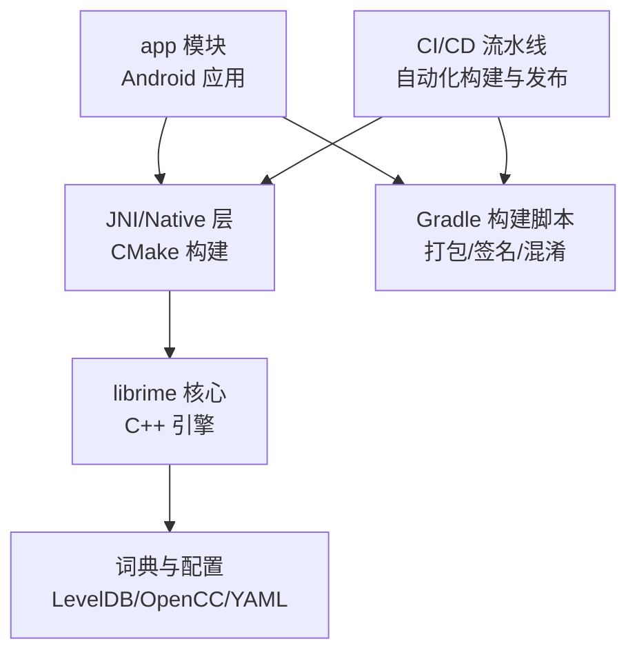
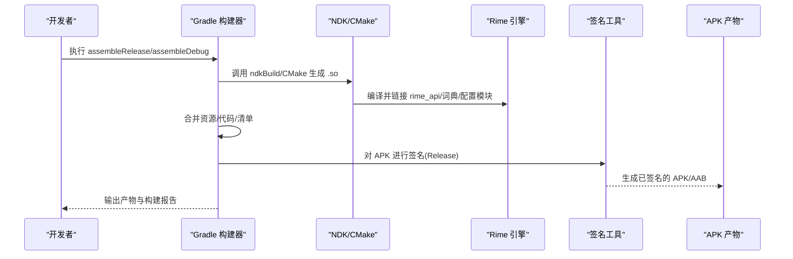
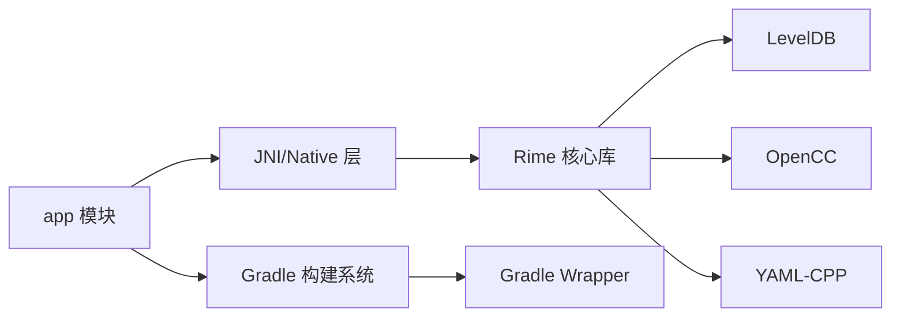

# 部署与构建

<cite>
**本文引用的文件**   
- [build.gradle.kts](file://app/build.gradle.kts)
- [proguard-rules.pro](file://app/proguard-rules.pro)
- [CMakeLists.txt](file://app/src/main/jni/librime_jni/CMakeLists.txt)
- [gradle.properties](file://gradle.properties)
- [settings.gradle.kts](file://settings.gradle.kts)
- [gradle-wrapper.properties](file://gradle/wrapper/gradle-wrapper.properties)
- [librime-prebuilt/build.sh](file://librime-prebuilt/build.sh)
- [librime-prebuilt/Makefile](file://librime-prebuilt/Makefile)
- [librime-prebuilt/cmake/FindLevelDb.cmake](file://librime-prebuilt/cmake/FindLevelDb.cmake)
- [librime-prebuilt/cmake/FindOpencc.cmake](file://librime-prebuilt/cmake/FindOpencc.cmake)
- [librime-prebuilt/cmake/FindYamlCpp.cmake](file://librime-prebuilt/cmake/FindYamlCpp.cmake)
- [librime-prebuilt/cmake/BundleStaticLibrary.cmake](file://librime-prebuilt/cmake/BundleStaticLibrary.cmake)
- [librime-prebuilt/librime/CMakeLists.txt](file://librime-prebuilt/librime/CMakeLists.txt)
- [librime-prebuilt/librime/src/rime_api.cc](file://librime-prebuilt/librime/src/rime_api.cc)
- [librime-prebuilt/librime/src/rime_api.h](file://librime-prebuilt/librime/src/rime_api.h)
- [librime-prebuilt/librime/src/engine.cc](file://librime-prebuilt/librime/src/engine.cc)
- [librime-prebuilt/librime/src/config/config_compiler.cc](file://librime-prebuilt/librime/src/config/config_compiler.cc)
- [librime-prebuilt/librime/src/dict/dictionary.cc](file://librime-prebuilt/librime/src/dict/dictionary.cc)
- [librime-prebuilt/librime/src/gears_module.cc](file://librime-prebuilt/librime/src/gears_module.cc)
- [librime-prebuilt/plugins/librime-predict/CMakeLists.txt](file://librime-prebuilt/plugins/librime-predict/CMakeLists.txt)
- [librime-prebuilt/plugins/librime-predict/src/predict_engine.cc](file://librime-prebuilt/plugins/librime-predict/src/predict_engine.cc)
- [librime-prebuilt/plugins/librime-predict/src/predict_translator.cc](file://librime-prebuilt/plugins/librime-predict/src/predict_translator.cc)
</cite>

## 目录
1. [简介](#简介)
2. [项目结构](#项目结构)
3. [核心组件](#核心组件)
4. [架构总览](#架构总览)
5. [详细组件分析](#详细组件分析)
6. [依赖分析](#依赖分析)
7. [性能考虑](#性能考虑)
8. [故障排查指南](#故障排查指南)
9. [结论](#结论)
10. [附录](#附录)

## 简介
本文件面向“部署与构建”，围绕 Gradle 构建脚本、NDK/CMake 编译、多架构 APK 产物管理、签名与发布、ProGuard 混淆、CI/CD 流水线、版本管理与最佳实践进行系统化说明。文档基于仓库中的构建配置与 NDK 集成点进行分析，帮助开发者在本地与 CI 环境中稳定、高效地构建和发布输入法应用。

## 项目结构
本项目采用 Android + NDK 的多模块组织方式：
- app 模块：Android 应用主体，包含 Kotlin/Java 源码、资源、JNI 桥接与 CMake 配置。
- librime-prebuilt：Rime 引擎的预构建或可嵌入构建子系统，提供 CMake 查找脚本、插件与示例。
- libs/include：NDK 头文件与静态库（若使用预构建）。
- gradle 根配置：Gradle Wrapper、全局属性与设置。

图表来源
- [build.gradle.kts](file://app/build.gradle.kts)
- [CMakeLists.txt](file://app/src/main/jni/librime_jni/CMakeLists.txt)
- [librime-prebuilt/librime/CMakeLists.txt](file://librime-prebuilt/librime/CMakeLists.txt)

章节来源
- [build.gradle.kts](file://app/build.gradle.kts)
- [settings.gradle.kts](file://settings.gradle.kts)
- [gradle-wrapper.properties](file://gradle/wrapper/gradle-wrapper.properties)

## 核心组件
- Gradle 构建脚本（app/build.gradle.kts）：定义 Android 插件、编译选项、ABI 过滤、资源处理、签名与 ProGuard 规则入口。
- NDK 与 CMake（app/src/main/jni/librime_jni/CMakeLists.txt）：声明 JNI 目标、链接 Rime 库、平台特性与优化开关。
- 预构建与依赖查找（librime-prebuilt/cmake/*.cmake）：为 LevelDB、OpenCC、YAML-CPP 等第三方库提供 Find 脚本与打包辅助。
- 版本与全局属性（gradle.properties）：控制 Gradle 行为、并行度、内存与 NDK 路径等。
- 混淆规则（app/proguard-rules.pro）：指定保留类、方法与字段，避免反射破坏。

章节来源
- [build.gradle.kts](file://app/build.gradle.kts)
- [CMakeLists.txt](file://app/src/main/jni/librime_jni/CMakeLists.txt)
- [librime-prebuilt/cmake/FindLevelDb.cmake](file://librime-prebuilt/cmake/FindLevelDb.cmake)
- [librime-prebuilt/cmake/FindOpencc.cmake](file://librime-prebuilt/cmake/FindOpencc.cmake)
- [librime-prebuilt/cmake/FindYamlCpp.cmake](file://librime-prebuilt/cmake/FindYamlCpp.cmake)
- [gradle.properties](file://gradle.properties)
- [proguard-rules.pro](file://app/proguard-rules.pro)

## 架构总览
下图展示从 Gradle 到 NDK 再到 Rime 引擎的构建与运行链路，以及产物输出与签名流程。

图表来源
- [build.gradle.kts](file://app/build.gradle.kts)
- [CMakeLists.txt](file://app/src/main/jni/librime_jni/CMakeLists.txt)
- [librime-prebuilt/librime/CMakeLists.txt](file://librime-prebuilt/librime/CMakeLists.txt)

## 详细组件分析

### Gradle 构建脚本与自定义任务
- 构建变体与 ABI 过滤：通过 buildTypes 与 abiFilters 限定目标架构，减少产物体积与构建时间。
- 资源与资产：将 Rime 字典与配置文件放入 assets/rime，并在构建时复制到 APK。
- 自定义任务：可在构建生命周期中插入预处理（如下载依赖、校验环境、生成版本号）。
- 产物命名与归档：统一输出目录与文件名规范，便于 CI 归档与分发。

章节来源
- [build.gradle.kts](file://app/build.gradle.kts)

### NDK 编译环境与依赖管理
- CMake 目标：声明 JNI 库、源文件、包含路径与链接库。
- 平台特性：启用 C++ 标准、异常支持、RTTI、优化等级。
- 第三方依赖：通过 Find 脚本定位 LevelDB、OpenCC、YAML-CPP；或使用预构建静态库。
- 插件扩展：可选加载预测插件（predict），按需编译与链接。

图表来源
- [CMakeLists.txt](file://app/src/main/jni/librime_jni/CMakeLists.txt)
- [librime-prebuilt/cmake/FindLevelDb.cmake](file://librime-prebuilt/cmake/FindLevelDb.cmake)
- [librime-prebuilt/cmake/FindOpencc.cmake](file://librime-prebuilt/cmake/FindOpencc.cmake)
- [librime-prebuilt/cmake/FindYamlCpp.cmake](file://librime-prebuilt/cmake/FindYamlCpp.cmake)

章节来源
- [CMakeLists.txt](file://app/src/main/jni/librime_jni/CMakeLists.txt)
- [librime-prebuilt/cmake/BundleStaticLibrary.cmake](file://librime-prebuilt/cmake/BundleStaticLibrary.cmake)

### 多架构 APK 构建流程与产物管理
- 支持的 ABI：arm64-v8a、armeabi-v7a、x86_64、x86（按需启用）。
- 构建命令：使用 assembleRelease 或 assembleDebug 触发全量或多 ABI 构建。
- 产物位置：app/build/outputs/apk/{variant}/ 与 app/build/intermediates/merged_native_libs/。
- 分包策略：按 ABI 拆分 APK 或生成单一包内含多架构 so（推荐 AAB 配合 Google Play 动态下发）。

章节来源
- [build.gradle.kts](file://app/build.gradle.kts)

### 签名配置与发布版本打包
- 调试签名：默认 debug keystore，自动用于 Debug 变体。
- 发布签名：通过 signingConfigs 配置 keystore 路径、别名、密码；在 Release 变体中启用。
- 安全建议：密钥文件不入库，使用环境变量或密钥管理服务注入。
- 产物校验：构建后校验签名与 APK/AAB 完整性。

章节来源
- [build.gradle.kts](file://app/build.gradle.kts)

### ProGuard 混淆与优化
- 规则入口：app/proguard-rules.pro 作为混淆规则文件。
- 保留策略：针对 JNI 接口、反射访问、Rime API 与关键类进行 keep。
- 优化选项：启用代码压缩、无用代码移除、字节码优化。
- 调试信息：Release 构建保留必要堆栈映射以便问题定位。

章节来源
- [proguard-rules.pro](file://app/proguard-rules.pro)
- [build.gradle.kts](file://app/build.gradle.kts)

### CI/CD 流水线搭建与自动化部署
- 环境准备：安装 JDK、Android SDK、NDK、CMake 与依赖（LevelDB、OpenCC、YAML-CPP）。
- 缓存策略：缓存 Gradle 依赖与 NDK 构建中间产物，加速重复构建。
- 构建阶段：执行 assembleRelease，生成 APK/AAB 并上传制品。
- 发布阶段：推送至内部仓库或应用商店；生成变更日志与版本标签。

章节来源
- [gradle.properties](file://gradle.properties)
- [gradle-wrapper.properties](file://gradle/wrapper/gradle-wrapper.properties)

### 版本管理与发布流程最佳实践
- 语义化版本：使用 MAJOR.MINOR.PATCH 格式，结合 Git Tag 管理。
- 构建号：每次构建递增 versionCode，确保唯一性。
- 分支策略：main/release 分支用于发布，feature 分支用于开发。
- 发布清单：记录变更内容、已知问题与回滚方案。

章节来源
- [build.gradle.kts](file://app/build.gradle.kts)

## 依赖分析
- 直接依赖：
  - app 模块依赖 Android SDK、Gradle 插件、NDK/CMake。
  - JNI 层依赖 Rime 核心库与第三方组件（LevelDB、OpenCC、YAML-CPP）。
- 间接依赖：
  - Rime 插件（如 predict）可选编译与链接。
- 外部工具链：
  - Gradle Wrapper 保证构建一致性。
  - CMake 与 NDK 工具链负责原生编译。

图表来源
- [build.gradle.kts](file://app/build.gradle.kts)
- [CMakeLists.txt](file://app/src/main/jni/librime_jni/CMakeLists.txt)
- [librime-prebuilt/cmake/FindLevelDb.cmake](file://librime-prebuilt/cmake/FindLevelDb.cmake)
- [librime-prebuilt/cmake/FindOpencc.cmake](file://librime-prebuilt/cmake/FindOpencc.cmake)
- [librime-prebuilt/cmake/FindYamlCpp.cmake](file://librime-prebuilt/cmake/FindYamlCpp.cmake)

章节来源
- [settings.gradle.kts](file://settings.gradle.kts)
- [gradle-wrapper.properties](file://gradle/wrapper/gradle-wrapper.properties)

## 性能考虑
- 增量构建：启用 Gradle 配置缓存与并行构建，缩短冷启动时间。
- NDK 构建优化：合理设置 CMAKE_BUILD_TYPE、启用 LTO/Strip、减少不必要的源文件。
- 资源与资产：仅包含必要字典与配置，按需加载。
- 产物瘦身：启用 ProGuard/R8 压缩与混淆，剔除未用代码与资源。
- 缓存策略：缓存 Gradle 依赖、NDK 工具链与第三方库，提升重复构建速度。

[本节为通用指导，无需特定文件引用]

## 故障排查指南
- NDK/CMake 找不到依赖：检查 Find 脚本路径与库安装位置，确认环境变量与 cmake 参数。
- 链接失败：核对 ABI 匹配、符号可见性与库顺序。
- 运行时崩溃：检查 JNI 方法签名、反射保留规则与 ProGuard 配置。
- 构建缓慢：清理缓存、禁用不必要任务、限制并发线程数。
- 签名错误：验证 keystore 与密码、确保签名配置正确。

章节来源
- [librime-prebuilt/cmake/FindLevelDb.cmake](file://librime-prebuilt/cmake/FindLevelDb.cmake)
- [librime-prebuilt/cmake/FindOpencc.cmake](file://librime-prebuilt/cmake/FindOpencc.cmake)
- [librime-prebuilt/cmake/FindYamlCpp.cmake](file://librime-prebuilt/cmake/FindYamlCpp.cmake)
- [proguard-rules.pro](file://app/proguard-rules.pro)
- [build.gradle.kts](file://app/build.gradle.kts)

## 结论
通过合理的 Gradle 配置、NDK/CMake 集成与依赖管理，可实现稳定高效的输入法构建与发布。遵循本文的流程与最佳实践，能够在本地与 CI 环境中快速迭代、可靠交付高质量产品。

[本节为总结，无需特定文件引用]

## 附录

### Rime 引擎关键实现要点（供参考）
- rime_api：对外暴露的核心 API，供 JNI 层调用。
- engine：引擎主循环与状态管理。
- config：配置编译与合并逻辑。
- dictionary：词典读写与索引。
- gears_module：齿轮（翻译器、过滤器）注册与调度。
- predict 插件：预测引擎与翻译器，可选编译与链接。

章节来源
- [librime-prebuilt/librime/src/rime_api.cc](file://librime-prebuilt/librime/src/rime_api.cc)
- [librime-prebuilt/librime/src/rime_api.h](file://librime-prebuilt/librime/src/rime_api.h)
- [librime-prebuilt/librime/src/engine.cc](file://librime-prebuilt/librime/src/engine.cc)
- [librime-prebuilt/librime/src/config/config_compiler.cc](file://librime-prebuilt/librime/src/config/config_compiler.cc)
- [librime-prebuilt/librime/src/dict/dictionary.cc](file://librime-prebuilt/librime/src/dict/dictionary.cc)
- [librime-prebuilt/librime/src/gears_module.cc](file://librime-prebuilt/librime/src/gears_module.cc)
- [librime-prebuilt/plugins/librime-predict/CMakeLists.txt](file://librime-prebuilt/plugins/librime-predict/CMakeLists.txt)
- [librime-prebuilt/plugins/librime-predict/src/predict_engine.cc](file://librime-prebuilt/plugins/librime-predict/src/predict_engine.cc)
- [librime-prebuilt/plugins/librime-predict/src/predict_translator.cc](file://librime-prebuilt/plugins/librime-predict/src/predict_translator.cc)

### 预构建与构建脚本
- build.sh：封装依赖安装、编译与打包步骤，适合 CI 环境。
- Makefile：顶层构建入口，协调子模块与插件。

章节来源
- [librime-prebuilt/build.sh](file://librime-prebuilt/build.sh)
- [librime-prebuilt/Makefile](file://librime-prebuilt/Makefile)