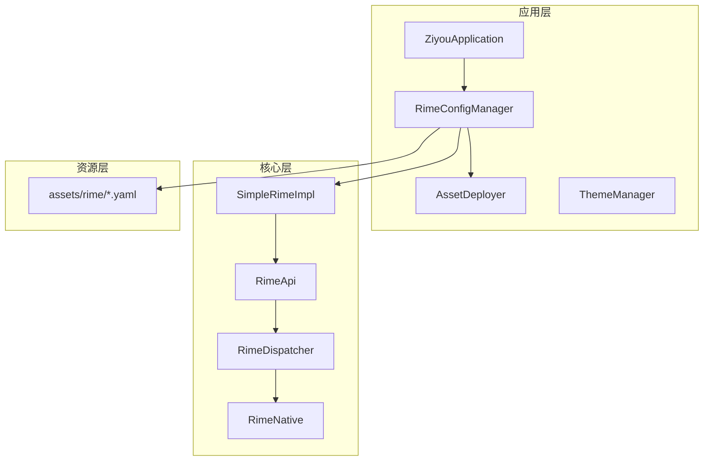
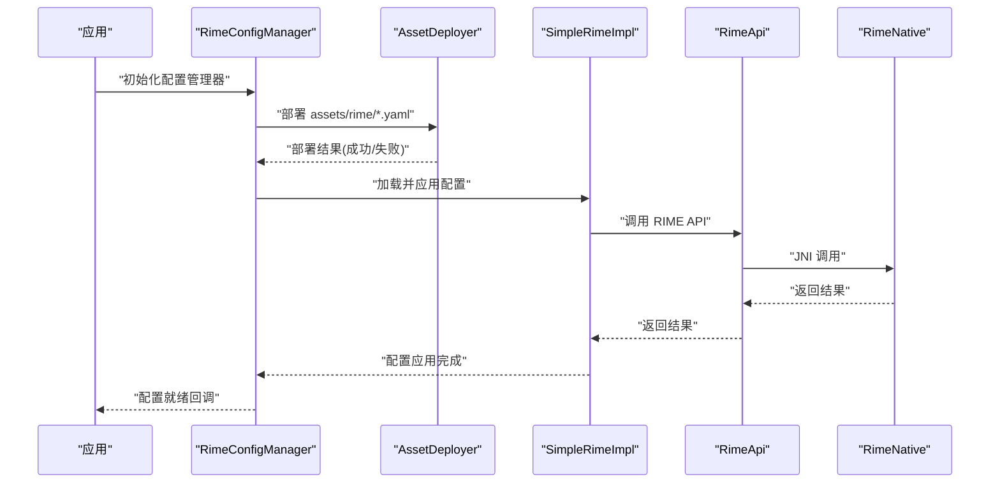
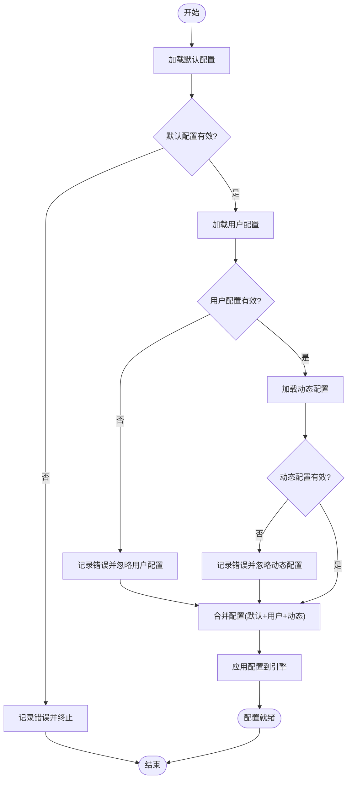
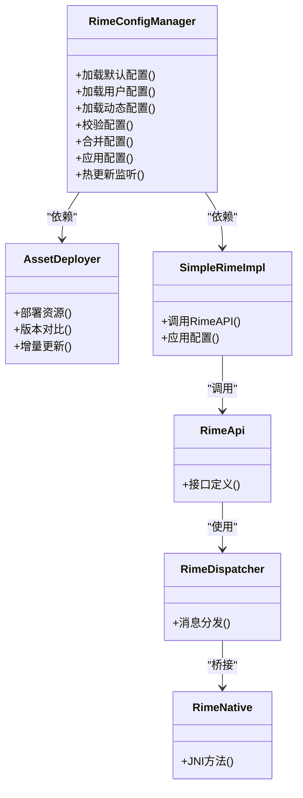

# Rime配置管理器

<cite>
**本文引用的文件**   
- [RimeConfigManager.kt](file://app/src/main/java/com/ziyou/ime/config/RimeConfigManager.kt)
- [AssetDeployer.kt](file://app/src/main/java/com/ziyou/ime/config/AssetDeployer.kt)
- [ThemeManager.kt](file://app/src/main/java/com/ziyou/ime/config/ThemeManager.kt)
- [SimpleRimeImpl.kt](file://app/src/main/java/com/ziyou/ime/core/SimpleRimeImpl.kt)
- [RimeApi.kt](file://app/src/main/java/com/ziyou/ime/core/RimeApi.kt)
- [RimeDispatcher.kt](file://app/src/main/java/com/ziyou/ime/core/RimeDispatcher.kt)
- [RimeNative.kt](file://app/src/main/java/com/ziyou/ime/core/RimeNative.kt)
- [ZiyouApplication.kt](file://app/src/main/java/com/ziyou/ime/ZiyouApplication.kt)
- [default.yaml](file://app/src/main/assets/rime/default.yaml)
- [luna_pinyin.schema.yaml](file://app/src/main/assets/rime/luna_pinyin.schema.yaml)
- [cangjie5.schema.yaml](file://app/src/main/assets/rime/cangjie5.schema.yaml)
- [symbols.yaml](file://app/src/main/assets/rime/symbols.yaml)
</cite>

## 目录
1. [简介](#简介)
2. [项目结构](#项目结构)
3. [核心组件](#核心组件)
4. [架构总览](#架构总览)
5. [详细组件分析](#详细组件分析)
6. [依赖关系分析](#依赖关系分析)
7. [性能考虑](#性能考虑)
8. [故障排查指南](#故障排查指南)
9. [结论](#结论)
10. [附录](#附录)

## 简介
本技术文档围绕 RimeConfigManager（Rime 配置管理器）展开，系统阐述其在 Android 应用中的职责与实现要点：YAML 配置的加载、解析与校验；默认配置、用户配置与动态配置的优先级与合并策略；配置热更新的监听、增量更新与状态同步机制；新增配置项的规范流程；以及性能优化、内存管理与线程安全等最佳实践。同时提供常见问题与解决方案，帮助开发者快速定位并解决问题。

## 项目结构
本项目采用按功能域划分的模块组织方式，与 Rime 输入法引擎紧密集成。与配置管理相关的关键位置如下：
- app/src/main/java/com/ziyou/ime/config：包含 RimeConfigManager、AssetDeployer、ThemeManager 等配置与资源部署相关类
- app/src/main/java/com/ziyou/ime/core：包含 Rime 核心 API、调度器、JNI 封装及简单实现
- app/src/main/assets/rime：存放 Rime 的 YAML 配置文件（schema、字典、符号等）
- app/src/main/java/com/ziyou/ime/ZiyouApplication：应用入口，负责初始化关键组件

图表来源
- [ZiyouApplication.kt](file://app/src/main/java/com/ziyou/ime/ZiyouApplication.kt)
- [RimeConfigManager.kt](file://app/src/main/java/com/ziyou/ime/config/RimeConfigManager.kt)
- [AssetDeployer.kt](file://app/src/main/java/com/ziyou/ime/config/AssetDeployer.kt)
- [SimpleRimeImpl.kt](file://app/src/main/java/com/ziyou/ime/core/SimpleRimeImpl.kt)
- [RimeApi.kt](file://app/src/main/java/com/ziyou/ime/core/RimeApi.kt)
- [RimeDispatcher.kt](file://app/src/main/java/com/ziyou/ime/core/RimeDispatcher.kt)
- [RimeNative.kt](file://app/src/main/java/com/ziyou/ime/core/RimeNative.kt)

章节来源
- [ZiyouApplication.kt](file://app/src/main/java/com/ziyou/ime/ZiyouApplication.kt)
- [RimeConfigManager.kt](file://app/src/main/java/com/ziyou/ime/config/RimeConfigManager.kt)
- [AssetDeployer.kt](file://app/src/main/java/com/ziyou/ime/config/AssetDeployer.kt)
- [SimpleRimeImpl.kt](file://app/src/main/java/com/ziyou/ime/core/SimpleRimeImpl.kt)
- [RimeApi.kt](file://app/src/main/java/com/ziyou/ime/core/RimeApi.kt)
- [RimeDispatcher.kt](file://app/src/main/java/com/ziyou/ime/core/RimeDispatcher.kt)
- [RimeNative.kt](file://app/src/main/java/com/ziyou/ime/core/RimeNative.kt)

## 核心组件
- RimeConfigManager：负责 Rime 配置的加载、校验、合并、热更新与对外暴露的配置访问接口
- AssetDeployer：负责将 assets 下的 YAML 等资源部署到目标路径，确保运行时可用
- ThemeManager：主题相关的配置管理（颜色、样式等），与 Rime 配置解耦但可联动
- SimpleRimeImpl：对 Rime 能力的简化封装，向上提供统一 API
- RimeApi / RimeDispatcher / RimeNative：Rime 的核心 API、消息分发与 JNI 桥接

章节来源
- [RimeConfigManager.kt](file://app/src/main/java/com/ziyou/ime/config/RimeConfigManager.kt)
- [AssetDeployer.kt](file://app/src/main/java/com/ziyou/ime/config/AssetDeployer.kt)
- [ThemeManager.kt](file://app/src/main/java/com/ziyou/ime/config/ThemeManager.kt)
- [SimpleRimeImpl.kt](file://app/src/main/java/com/ziyou/ime/core/SimpleRimeImpl.kt)
- [RimeApi.kt](file://app/src/main/java/com/ziyou/ime/core/RimeApi.kt)
- [RimeDispatcher.kt](file://app/src/main/java/com/ziyou/ime/core/RimeDispatcher.kt)
- [RimeNative.kt](file://app/src/main/java/com/ziyou/ime/core/RimeNative.kt)

## 架构总览
RimeConfigManager 位于应用配置层，向上为 UI 和业务逻辑提供统一的配置访问能力，向下通过 AssetDeployer 完成资源部署，并通过 SimpleRimeImpl 与 Rime 引擎交互。YAML 配置文件由 assets 提供，经部署后生效于运行期。

图表来源
- [RimeConfigManager.kt](file://app/src/main/java/com/ziyou/ime/config/RimeConfigManager.kt)
- [AssetDeployer.kt](file://app/src/main/java/com/ziyou/ime/config/AssetDeployer.kt)
- [SimpleRimeImpl.kt](file://app/src/main/java/com/ziyou/ime/core/SimpleRimeImpl.kt)
- [RimeApi.kt](file://app/src/main/java/com/ziyou/ime/core/RimeApi.kt)
- [RimeNative.kt](file://app/src/main/java/com/ziyou/ime/core/RimeNative.kt)

## 详细组件分析

### RimeConfigManager：配置加载、校验与合并
- 职责
  - 加载默认配置（assets/rime/default.yaml 等）
  - 加载用户配置（外部存储或私有目录）
  - 加载动态配置（运行时生成的覆盖项）
  - 执行配置项校验与错误处理
  - 维护配置优先级与合并策略
  - 提供配置热更新能力（监听、增量更新、状态同步）
- 关键点
  - YAML 解析：使用 Yaml 库进行解析与类型映射
  - 配置验证：字段存在性、类型检查、取值范围校验
  - 错误处理：记录日志、回滚、降级策略
  - 合并策略：默认 < 用户 < 动态，同名键覆盖
  - 热更新：文件监听 + 增量 diff + 原子替换 + 事件通知

图表来源
- [RimeConfigManager.kt](file://app/src/main/java/com/ziyou/ime/config/RimeConfigManager.kt)

章节来源
- [RimeConfigManager.kt](file://app/src/main/java/com/ziyou/ime/config/RimeConfigManager.kt)

### AssetDeployer：资源部署与版本管理
- 职责
  - 将 assets/rime 下的 YAML 文件复制到目标路径
  - 支持版本对比与增量更新
  - 保证部署原子性与一致性
- 关键点
  - 文件哈希校验，避免重复写入
  - 失败回滚与重试机制
  - 并发安全与锁保护

章节来源
- [AssetDeployer.kt](file://app/src/main/java/com/ziyou/ime/config/AssetDeployer.kt)

### ThemeManager：主题配置管理
- 职责
  - 管理主题相关的配置项（颜色、字体、布局等）
  - 与 Rime 配置解耦，但可在需要时联动刷新
- 关键点
  - 主题切换时的配置重建与缓存清理
  - 与 UI 层的主题事件同步

章节来源
- [ThemeManager.kt](file://app/src/main/java/com/ziyou/ime/config/ThemeManager.kt)

### SimpleRimeImpl：Rime 能力封装
- 职责
  - 提供简化的 Rime API 调用
  - 封装配置加载与应用流程
  - 屏蔽底层 JNI 细节
- 关键点
  - 线程安全的 API 调用
  - 错误码映射与异常转换

章节来源
- [SimpleRimeImpl.kt](file://app/src/main/java/com/ziyou/ime/core/SimpleRimeImpl.kt)

### RimeApi / RimeDispatcher / RimeNative：核心 API 与 JNI 桥接
- 职责
  - RimeApi：定义上层可调用的接口
  - RimeDispatcher：消息分发与任务调度
  - RimeNative：JNI 方法声明与参数转换
- 关键点
  - 异步调用与回调机制
  - 内存模型与对象生命周期管理

章节来源
- [RimeApi.kt](file://app/src/main/java/com/ziyou/ime/core/RimeApi.kt)
- [RimeDispatcher.kt](file://app/src/main/java/com/ziyou/ime/core/RimeDispatcher.kt)
- [RimeNative.kt](file://app/src/main/java/com/ziyou/ime/core/RimeNative.kt)

## 依赖关系分析
RimeConfigManager 依赖 AssetDeployer 进行资源部署，依赖 SimpleRimeImpl 与 Rime 引擎交互，间接依赖 RimeApi、RimeDispatcher 与 RimeNative。YAML 配置文件作为输入源，最终影响引擎行为。

图表来源
- [RimeConfigManager.kt](file://app/src/main/java/com/ziyou/ime/config/RimeConfigManager.kt)
- [AssetDeployer.kt](file://app/src/main/java/com/ziyou/ime/config/AssetDeployer.kt)
- [SimpleRimeImpl.kt](file://app/src/main/java/com/ziyou/ime/core/SimpleRimeImpl.kt)
- [RimeApi.kt](file://app/src/main/java/com/ziyou/ime/core/RimeApi.kt)
- [RimeDispatcher.kt](file://app/src/main/java/com/ziyou/ime/core/RimeDispatcher.kt)
- [RimeNative.kt](file://app/src/main/java/com/ziyou/ime/core/RimeNative.kt)

章节来源
- [RimeConfigManager.kt](file://app/src/main/java/com/ziyou/ime/config/RimeConfigManager.kt)
- [AssetDeployer.kt](file://app/src/main/java/com/ziyou/ime/config/AssetDeployer.kt)
- [SimpleRimeImpl.kt](file://app/src/main/java/com/ziyou/ime/core/SimpleRimeImpl.kt)
- [RimeApi.kt](file://app/src/main/java/com/ziyou/ime/core/RimeApi.kt)
- [RimeDispatcher.kt](file://app/src/main/java/com/ziyou/ime/core/RimeDispatcher.kt)
- [RimeNative.kt](file://app/src/main/java/com/ziyou/ime/core/RimeNative.kt)

## 性能考虑
- 配置加载
  - 延迟加载：仅在首次使用时加载完整配置
  - 增量更新：仅重新解析变更部分，减少 CPU 与 I/O 开销
- 内存管理
  - 使用不可变配置对象，避免频繁拷贝
  - 及时释放不再使用的临时对象，防止内存泄漏
- 线程安全
  - 配置读写分离，读多写少场景下使用只读快照
  - 热更新时使用原子替换，避免中间态被读取
- 并发控制
  - 部署与更新操作加锁，防止竞态条件
  - 批量操作合并，减少锁竞争

[本节为通用指导，不直接分析具体文件]

## 故障排查指南
- 常见配置问题
  - YAML 语法错误：检查缩进、引号、特殊字符
  - 字段缺失或类型不匹配：核对 schema 定义与默认值
  - 权限不足：确认目标路径写入权限
  - 循环依赖：检查 include 引用链
- 排查步骤
  - 查看日志输出，定位错误阶段（加载/校验/合并/应用）
  - 对比默认配置与用户配置差异
  - 禁用动态配置，逐步缩小问题范围
  - 重启应用或恢复默认配置以验证基线
- 解决方案
  - 修复 YAML 语法与字段定义
  - 调整权限或路径
  - 移除循环引用或拆分配置
  - 增加更详细的日志与断言

章节来源
- [RimeConfigManager.kt](file://app/src/main/java/com/ziyou/ime/config/RimeConfigManager.kt)
- [AssetDeployer.kt](file://app/src/main/java/com/ziyou/ime/config/AssetDeployer.kt)

## 结论
RimeConfigManager 在应用中承担配置管理的核心职责，通过清晰的加载、校验、合并与热更新机制，确保 Rime 引擎在不同环境下的稳定运行。遵循本文档的最佳实践，可有效提升系统的可维护性、性能与可靠性。

[本节为总结，不直接分析具体文件]

## 附录

### 配置优先级与覆盖规则
- 优先级顺序：默认配置 < 用户配置 < 动态配置
- 覆盖策略：同名键按优先级高者覆盖低者
- 合并粒度：字段级合并，非整块替换

章节来源
- [RimeConfigManager.kt](file://app/src/main/java/com/ziyou/ime/config/RimeConfigManager.kt)

### 如何添加新的配置项
- 定义配置类
  - 新增字段与默认值
  - 标注必填与可选
- 设置默认值
  - 在默认配置文件中补充
  - 在代码中提供 fallback
- 添加验证规则
  - 类型检查、取值范围、业务约束
- 更新合并与热更新
  - 确保新字段参与合并与增量更新
  - 发布配置变更通知

章节来源
- [RimeConfigManager.kt](file://app/src/main/java/com/ziyou/ime/config/RimeConfigManager.kt)

### 配置文件清单
- default.yaml：默认全局配置
- luna_pinyin.schema.yaml：拼音方案定义
- cangjie5.schema.yaml：仓颉方案定义
- symbols.yaml：符号表配置

章节来源
- [default.yaml](file://app/src/main/assets/rime/default.yaml)
- [luna_pinyin.schema.yaml](file://app/src/main/assets/rime/luna_pinyin.schema.yaml)
- [cangjie5.schema.yaml](file://app/src/main/assets/rime/cangjie5.schema.yaml)
- [symbols.yaml](file://app/src/main/assets/rime/symbols.yaml)