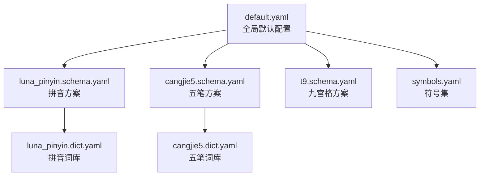
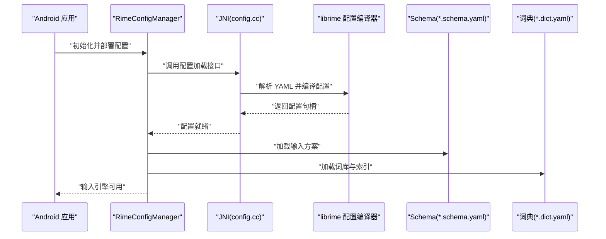
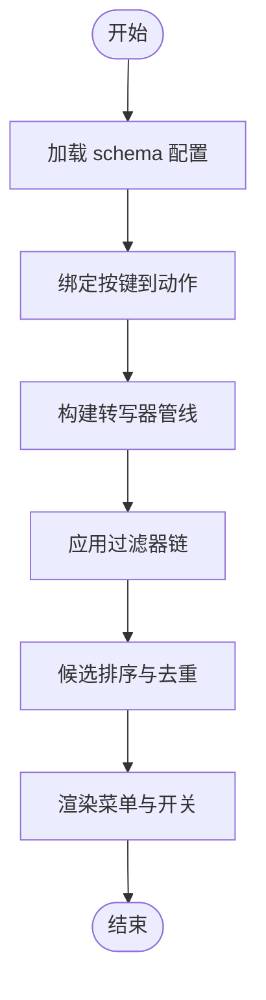
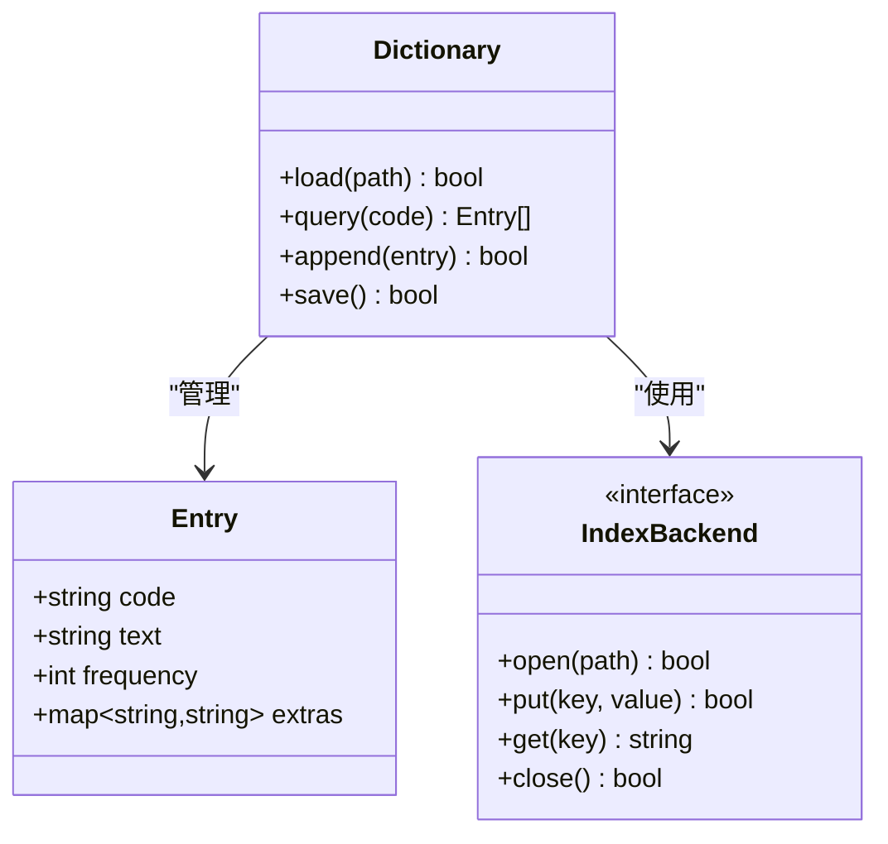
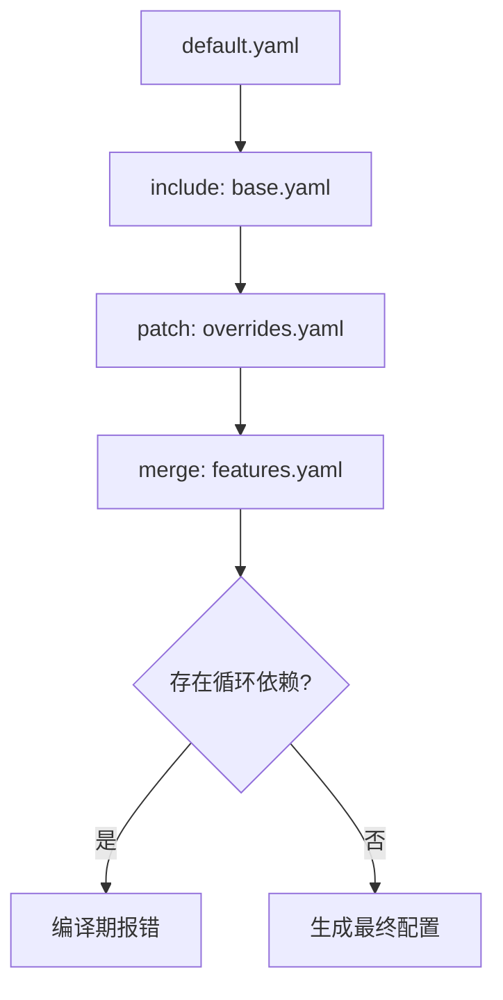
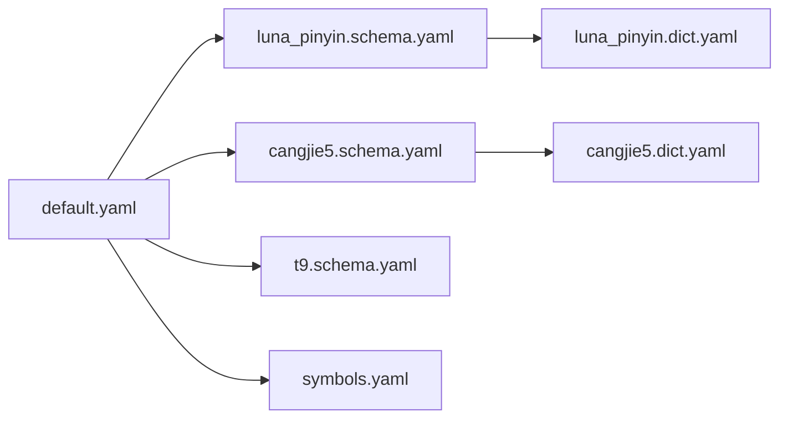

# YAML配置文件规范

<cite>
**本文档引用的文件**   
- [app/src/main/assets/rime/default.yaml](file://app/src/main/assets/rime/default.yaml)
- [app/src/main/assets/rime/luna_pinyin.schema.yaml](file://app/src/main/assets/rime/luna_pinyin.schema.yaml)
- [app/src/main/assets/rime/cangjie5.schema.yaml](file://app/src/main/assets/rime/cangjie5.schema.yaml)
- [app/src/main/assets/rime/t9.schema.yaml](file://app/src/main/assets/rime/t9.schema.yaml)
- [app/src/main/assets/rime/luna_pinyin.dict.yaml](file://app/src/main/assets/rime/luna_pinyin.dict.yaml)
- [app/src/main/assets/rime/cangjie5.dict.yaml](file://app/src/main/assets/rime/cangjie5.dict.yaml)
- [app/src/main/assets/rime/symbols.yaml](file://app/src/main/assets/rime/symbols.yaml)
- [librime-prebuilt/librime/data/minimal/default.yaml](file://librime-prebuilt/librime/data/minimal/default.yaml)
- [librime-prebuilt/librime/data/minimal/luna_pinyin.schema.yaml](file://librime-prebuilt/librime/data/minimal/luna_pinyin.schema.yaml)
- [librime-prebuilt/librime/data/minimal/cangjie5.schema.yaml](file://librime-prebuilt/librime/data/minimal/cangjie5.schema.yaml)
- [librime-prebuilt/librime/data/minimal/luna_pinyin.dict.yaml](file://librime-prebuilt/librime/data/minimal/luna_pinyin.dict.yaml)
- [librime-prebuilt/librime/data/minimal/cangjie5.dict.yaml](file://librime-prebuilt/librime/data/minimal/cangjie5.dict.yaml)
- [librime-prebuilt/librime/data/minimal/symbols.yaml](file://librime-prebuilt/librime/data/minimal/symbols.yaml)
- [librime-prebuilt/librime/data/test/config_test.yaml](file://librime-prebuilt/librime/data/test/config_test.yaml)
- [librime-prebuilt/librime/data/test/config_merge_test.yaml](file://librime-prebuilt/librime/data/test/config_merge_test.yaml)
- [librime-prebuilt/librime/data/test/config_dependency_test.yaml](file://librime-prebuilt/librime/data/test/config_dependency_test.yaml)
- [librime-prebuilt/librime/data/test/dictionary_test.dict.yaml](file://librime-prebuilt/librime/data/test/dictionary_test.dict.yaml)
- [librime-prebuilt/librime/data/test/starcraft.yaml](file://librime-prebuilt/librime/data/test/starcraft.yaml)
- [app/src/main/java/com/ziyou/ime/config/RimeConfigManager.kt](file://app/src/main/java/com/ziyou/ime/config/RimeConfigManager.kt)
- [app/src/main/java/com/ziyou/ime/core/RimeApi.kt](file://app/src/main/java/com/ziyou/ime/core/RimeApi.kt)
- [app/src/main/jni/librime_jni/config.cc](file://app/src/main/jni/librime_jni/config.cc)
</cite>

## 目录
1. [简介](#简介)
2. [项目结构](#项目结构)
3. [核心组件](#核心组件)
4. [架构总览](#架构总览)
5. [详细组件分析](#详细组件分析)
6. [依赖关系分析](#依赖关系分析)
7. [性能考虑](#性能考虑)
8. [故障排查指南](#故障排查指南)
9. [结论](#结论)
10. [附录](#附录)

## 简介
本规范面向 Rime 输入法的 YAML 配置文件，系统性说明语法与规则、schema 配置结构、词典文件格式、插件参数约定、多文件继承与条件加载机制，以及最佳实践与调试方法。文档基于仓库中的示例与测试配置，并结合 librime 的编译期与运行期行为进行解释，帮助开发者快速构建可维护、可扩展的输入法配置体系。

## 项目结构
Rime 的配置以 YAML 文件组织，常见类型包括：
- default.yaml：全局默认配置（如键盘布局、菜单、开关等）
- *.schema.yaml：输入方案定义（键位映射、转写器、过滤器、候选排序等）
- *.dict.yaml：词库与词条索引（TSV 文本或预编译表）
- symbols.yaml：符号集与快捷键映射
- 测试用例：config_*.yaml、dictionary_test.dict.yaml 等用于验证合并、依赖、循环引用等特性

图表来源
- [app/src/main/assets/rime/default.yaml](file://app/src/main/assets/rime/default.yaml)
- [app/src/main/assets/rime/luna_pinyin.schema.yaml](file://app/src/main/assets/rime/luna_pinyin.schema.yaml)
- [app/src/main/assets/rime/cangjie5.schema.yaml](file://app/src/main/assets/rime/cangjie5.schema.yaml)
- [app/src/main/assets/rime/t9.schema.yaml](file://app/src/main/assets/rime/t9.schema.yaml)
- [app/src/main/assets/rime/luna_pinyin.dict.yaml](file://app/src/main/assets/rime/luna_pinyin.dict.yaml)
- [app/src/main/assets/rime/cangjie5.dict.yaml](file://app/src/main/assets/rime/cangjie5.dict.yaml)
- [app/src/main/assets/rime/symbols.yaml](file://app/src/main/assets/rime/symbols.yaml)

章节来源
- [app/src/main/assets/rime/default.yaml](file://app/src/main/assets/rime/default.yaml)
- [app/src/main/assets/rime/luna_pinyin.schema.yaml](file://app/src/main/assets/rime/luna_pinyin.schema.yaml)
- [app/src/main/assets/rime/cangjie5.schema.yaml](file://app/src/main/assets/rime/cangjie5.schema.yaml)
- [app/src/main/assets/rime/t9.schema.yaml](file://app/src/main/assets/rime/t9.schema.yaml)
- [app/src/main/assets/rime/luna_pinyin.dict.yaml](file://app/src/main/assets/rime/luna_pinyin.dict.yaml)
- [app/src/main/assets/rime/cangjie5.dict.yaml](file://app/src/main/assets/rime/cangjie5.dict.yaml)
- [app/src/main/assets/rime/symbols.yaml](file://app/src/main/assets/rime/symbols.yaml)

## 核心组件
- 全局默认配置（default.yaml）：定义键盘布局、菜单项、常用开关、插件启用等基础选项。
- 输入方案（*.schema.yaml）：声明输入引擎、转写器、过滤器、按键绑定、候选排序策略等。
- 词典（*.dict.yaml）：定义词条、编码、频率、扩展字段及索引方式。
- 符号集（symbols.yaml）：定义符号快捷键与输出映射。
- 测试配置（data/test/*.yaml）：覆盖合并、依赖、可选引用、循环依赖等边界场景。

章节来源
- [librime-prebuilt/librime/data/minimal/default.yaml](file://librime-prebuilt/librime/data/minimal/default.yaml)
- [librime-prebuilt/librime/data/minimal/luna_pinyin.schema.yaml](file://librime-prebuilt/librime/data/minimal/luna_pinyin.schema.yaml)
- [librime-prebuilt/librime/data/minimal/cangjie5.schema.yaml](file://librime-prebuilt/librime/data/minimal/cangjie5.schema.yaml)
- [librime-prebuilt/librime/data/minimal/luna_pinyin.dict.yaml](file://librime-prebuilt/librime/data/minimal/luna_pinyin.dict.yaml)
- [librime-prebuilt/librime/data/minimal/cangjie5.dict.yaml](file://librime-prebuilt/librime/data/minimal/cangjie5.dict.yaml)
- [librime-prebuilt/librime/data/minimal/symbols.yaml](file://librime-prebuilt/librime/data/minimal/symbols.yaml)

## 架构总览
Rime 的配置在应用层通过 JNI 桥接至底层 librime，由配置编译器解析 YAML，生成运行时可用的配置对象。Android 侧负责部署 assets 中的配置到用户目录，并在启动时加载 schema 与词典。

图表来源
- [app/src/main/java/com/ziyou/ime/config/RimeConfigManager.kt](file://app/src/main/java/com/ziyou/ime/config/RimeConfigManager.kt)
- [app/src/main/jni/librime_jni/config.cc](file://app/src/main/jni/librime_jni/config.cc)
- [app/src/main/java/com/ziyou/ime/core/RimeApi.kt](file://app/src/main/java/com/ziyou/ime/core/RimeApi.kt)

## 详细组件分析

### YAML 语法与数据结构
- 键值对：使用冒号分隔键与值，支持字符串、数字、布尔、空值等基本类型。
- 嵌套结构：使用缩进表示层级，适合表达复杂配置树。
- 数组格式：使用短横线“-”表示列表项，常用于按键绑定、转写器链、过滤器列表等。
- 注释：以“#”开头整行注释；行尾注释需空格分隔。
- 引用与合并：支持 include、patch、merge 等机制实现多文件组合与覆盖（详见后文）。

章节来源
- [librime-prebuilt/librime/data/test/config_test.yaml](file://librime-prebuilt/librime/data/test/config_test.yaml)
- [librime-prebuilt/librime/data/test/config_merge_test.yaml](file://librime-prebuilt/librime/data/test/config_merge_test.yaml)
- [librime-prebuilt/librime/data/test/config_dependency_test.yaml](file://librime-prebuilt/librime/data/test/config_dependency_test.yaml)

### 输入方案（schema）配置结构
schema 文件定义输入引擎的工作流，通常包含以下关键部分：
- 名称与版本：标识方案名、版本、作者等信息。
- 键盘布局：定义按键到动作的映射，如字母、数字、标点、功能键。
- 转写器（translators）：将用户输入转换为候选词条，例如拼音转写、五笔转写、历史记忆、上下文联想等。
- 过滤器（filters）：对候选结果进行过滤与排序，如去重、单字优先、繁简转换、正则过滤等。
- 菜单与开关：定义菜单项与运行时开关，便于动态切换功能。
- 候选与分页：控制候选数量、翻页键、上屏行为等。

图表来源
- [app/src/main/assets/rime/luna_pinyin.schema.yaml](file://app/src/main/assets/rime/luna_pinyin.schema.yaml)
- [app/src/main/assets/rime/cangjie5.schema.yaml](file://app/src/main/assets/rime/cangjie5.schema.yaml)
- [app/src/main/assets/rime/t9.schema.yaml](file://app/src/main/assets/rime/t9.schema.yaml)

章节来源
- [app/src/main/assets/rime/luna_pinyin.schema.yaml](file://app/src/main/assets/rime/luna_pinyin.schema.yaml)
- [app/src/main/assets/rime/cangjie5.schema.yaml](file://app/src/main/assets/rime/cangjie5.schema.yaml)
- [app/src/main/assets/rime/t9.schema.yaml](file://app/src/main/assets/rime/t9.schema.yaml)

### 词典（dictionary）配置与词库格式
词典文件描述词条及其索引方式，常见要素：
- 词条格式：通常为 TSV（制表符分隔），包含编码、词条、频率、扩展字段等列。
- 编码规范：不同输入方案采用各自编码规则（如拼音音节、五笔字形码）。
- 索引机制：支持 LevelDB、TableDB、TextDB 等后端，提升查询与更新性能。
- 用户词库：允许增量写入用户自定义词条，持久化存储于用户目录。
- 预编译与增量更新：可通过工具将 TSV 编译为高效表格式，支持热更新。

图表来源
- [librime-prebuilt/librime/data/test/dictionary_test.dict.yaml](file://librime-prebuilt/librime/data/test/dictionary_test.dict.yaml)
- [librime-prebuilt/librime/data/minimal/luna_pinyin.dict.yaml](file://librime-prebuilt/librime/data/minimal/luna_pinyin.dict.yaml)
- [librime-prebuilt/librime/data/minimal/cangjie5.dict.yaml](file://librime-prebuilt/librime/data/minimal/cangjie5.dict.yaml)

章节来源
- [librime-prebuilt/librime/data/test/dictionary_test.dict.yaml](file://librime-prebuilt/librime/data/test/dictionary_test.dict.yaml)
- [librime-prebuilt/librime/data/minimal/luna_pinyin.dict.yaml](file://librime-prebuilt/librime/data/minimal/luna_pinyin.dict.yaml)
- [librime-prebuilt/librime/data/minimal/cangjie5.dict.yaml](file://librime-prebuilt/librime/data/minimal/cangjie5.dict.yaml)

### 符号集（symbols）配置
符号集提供快捷输入符号的能力，通常包含：
- 符号分组：按类别组织（如数学、货币、标点）。
- 快捷键映射：将特定按键序列映射到符号输出。
- 优先级与冲突处理：当多个规则匹配时，依据优先级选择输出。

章节来源
- [app/src/main/assets/rime/symbols.yaml](file://app/src/main/assets/rime/symbols.yaml)
- [librime-prebuilt/librime/data/minimal/symbols.yaml](file://librime-prebuilt/librime/data/minimal/symbols.yaml)

### 插件配置参数
插件通过 schema 或 default 配置启用，常见参数类型与约定：
- 布尔开关：启用/禁用某项功能（如自动纠错、繁简转换）。
- 数值阈值：控制候选数量、频率权重、学习率等。
- 字符串路径：指向外部资源（如 OpenCC 配置、脚本路径）。
- 列表参数：转写器链、过滤器列表、按键绑定等。
- 默认值与校验：未提供的参数使用默认值；非法值会在编译期报错。

章节来源
- [librime-prebuilt/librime/data/test/starcraft.yaml](file://librime-prebuilt/librime/data/test/starcraft.yaml)
- [librime-prebuilt/librime/data/test/config_test.yaml](file://librime-prebuilt/librime/data/test/config_test.yaml)

### 继承与组合机制
Rime 支持多文件配置与条件加载，主要机制包括：
- include：引入其他配置文件，形成层次化结构。
- patch：对已有配置进行局部修改与覆盖。
- merge：合并多个配置片段，解决命名冲突与优先级问题。
- optional_reference：可选引用，缺失时不报错但跳过。
- 循环依赖检测：编译期检测并阻止循环引用，保证配置稳定性。

图表来源
- [librime-prebuilt/librime/data/test/config_merge_test.yaml](file://librime-prebuilt/librime/data/test/config_merge_test.yaml)
- [librime-prebuilt/librime/data/test/config_dependency_test.yaml](file://librime-prebuilt/librime/data/test/config_dependency_test.yaml)

章节来源
- [librime-prebuilt/librime/data/test/config_merge_test.yaml](file://librime-prebuilt/librime/data/test/config_merge_test.yaml)
- [librime-prebuilt/librime/data/test/config_dependency_test.yaml](file://librime-prebuilt/librime/data/test/config_dependency_test.yaml)

## 依赖关系分析
配置之间的依赖关系直接影响加载顺序与生效范围：
- default.yaml 作为根配置，被各 schema 与词典引用。
- schema 依赖词典与符号集，决定输入行为。
- 测试用例展示合并与依赖的正确性，避免循环引用。

图表来源
- [app/src/main/assets/rime/default.yaml](file://app/src/main/assets/rime/default.yaml)
- [app/src/main/assets/rime/luna_pinyin.schema.yaml](file://app/src/main/assets/rime/luna_pinyin.schema.yaml)
- [app/src/main/assets/rime/cangjie5.schema.yaml](file://app/src/main/assets/rime/cangjie5.schema.yaml)
- [app/src/main/assets/rime/t9.schema.yaml](file://app/src/main/assets/rime/t9.schema.yaml)
- [app/src/main/assets/rime/luna_pinyin.dict.yaml](file://app/src/main/assets/rime/luna_pinyin.dict.yaml)
- [app/src/main/assets/rime/cangjie5.dict.yaml](file://app/src/main/assets/rime/cangjie5.dict.yaml)
- [app/src/main/assets/rime/symbols.yaml](file://app/src/main/assets/rime/symbols.yaml)

章节来源
- [app/src/main/assets/rime/default.yaml](file://app/src/main/assets/rime/default.yaml)
- [librime-prebuilt/librime/data/test/config_dependency_test.yaml](file://librime-prebuilt/librime/data/test/config_dependency_test.yaml)

## 性能考虑
- 词典索引：优先使用 LevelDB/TableDB 等高效后端，减少查询延迟。
- 转写器管线：精简不必要的转写器，降低候选生成开销。
- 过滤器链：合理排序过滤器，尽早过滤无效候选。
- 缓存策略：利用内存缓存热点词条与结果，提高响应速度。
- 增量更新：用户词库增量写入，避免全量重建。

[本节为通用指导，无需具体文件来源]

## 故障排查指南
常见问题与定位方法：
- 配置编译失败：检查 include/patch/merge 语法与路径是否正确，查看编译日志。
- 循环依赖：使用测试用例验证依赖图，确保无环。
- 词典加载失败：确认 TSV 格式与编码正确，检查索引后端是否可用。
- 插件参数错误：核对参数类型与默认值，必要时添加校验逻辑。
- Android 集成问题：确认 assets 部署路径与权限，检查 JNI 调用栈。

章节来源
- [librime-prebuilt/librime/data/test/config_test.yaml](file://librime-prebuilt/librime/data/test/config_test.yaml)
- [librime-prebuilt/librime/data/test/config_merge_test.yaml](file://librime-prebuilt/librime/data/test/config_merge_test.yaml)
- [app/src/main/jni/librime_jni/config.cc](file://app/src/main/jni/librime_jni/config.cc)

## 结论
本规范系统阐述了 Rime YAML 配置的语法、结构与最佳实践，涵盖 schema、词典、符号集、插件参数、继承与组合机制，并提供性能优化与故障排查建议。遵循本规范可构建稳定、高效、易维护的输入法配置体系。

[本节为总结性内容，无需具体文件来源]

## 附录
- 命名规范：文件名采用小写加下划线，schema 与 dict 后缀明确区分。
- 注释约定：关键配置添加行内注释，说明用途与取值范围。
- 版本管理：使用 Git 管理配置变更，配合测试用例保障兼容性。
- 验证工具：使用 librime 提供的配置编译器与测试用例进行静态检查。

[本节为通用指导，无需具体文件来源]