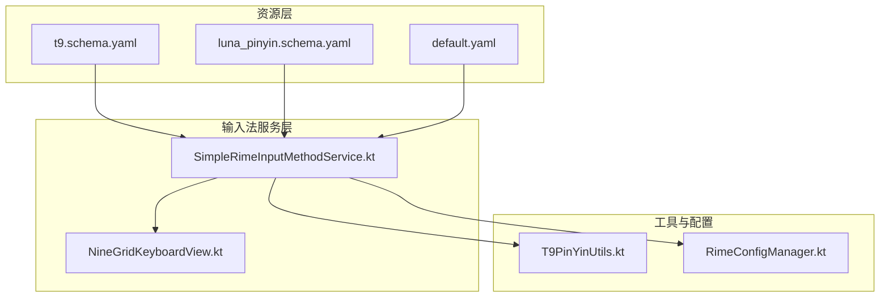
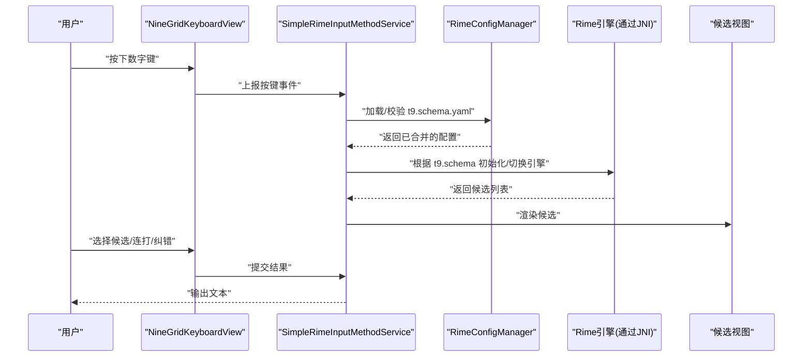
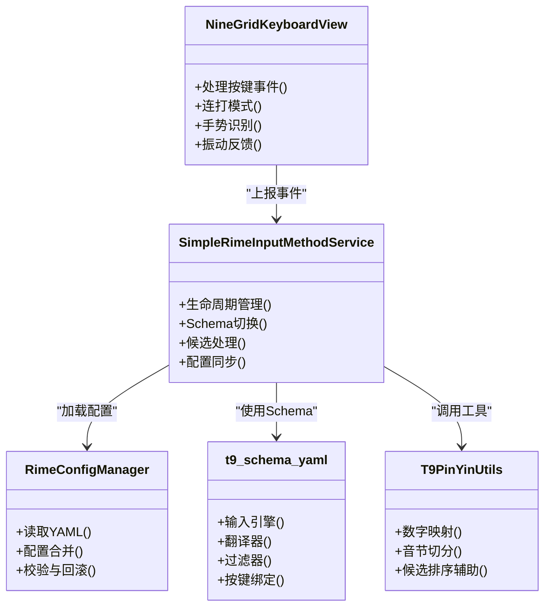

# 九宫格配置 (t9.schema.yaml)

<cite>
**本文引用的文件**   
- [t9.schema.yaml](file://app/src/main/assets/rime/t9.schema.yaml)
- [NineGridKeyboardView.kt](file://app/src/main/java/com/ziyou/ime/ime/NineGridKeyboardView.kt)
- [T9PinYinUtils.kt](file://app/src/main/java/com/ziyou/ime/util/T9PinYinUtils.kt)
- [SimpleRimeInputMethodService.kt](file://app/src/main/java/com/ziyou/ime/ime/SimpleRimeInputMethodService.kt)
- [RimeConfigManager.kt](file://app/src/main/java/com/ziyou/ime/config/RimeConfigManager.kt)
- [luna_pinyin.schema.yaml](file://app/src/main/assets/rime/luna_pinyin.schema.yaml)
- [default.yaml](file://app/src/main/assets/rime/default.yaml)
</cite>

## 目录
1. [简介](#简介)
2. [项目结构](#项目结构)
3. [核心组件](#核心组件)
4. [架构总览](#架构总览)
5. [详细组件分析](#详细组件分析)
6. [依赖关系分析](#依赖关系分析)
7. [性能考量](#性能考量)
8. [故障排查指南](#故障排查指南)
9. [结论](#结论)
10. [附录](#附录)

## 简介
本文件围绕九宫格（T9）输入配置的完整实现进行系统化说明，重点覆盖：
- T9 键盘布局与数字键映射、字母分布规则
- 候选词选择逻辑与连打模式
- 纠错算法与智能预测机制
- 与标准键盘输入的差异化配置（按键响应、手势支持、振动反馈）
- 性能优化策略（预加载、缓存、内存管理）
- 最佳实践与用户习惯适配建议
- 常见问题排查与性能调优方法

## 项目结构
本项目采用“资源层 + 业务逻辑层 + 输入法服务层”的分层组织方式。与九宫格输入直接相关的资源位于 assets/rime 下的 schema 与字典配置；业务逻辑集中在 Java/Kotlin 层的键盘视图、工具类与服务中。

图表来源 
- [t9.schema.yaml](file://app/src/main/assets/rime/t9.schema.yaml)
- [luna_pinyin.schema.yaml](file://app/src/main/assets/rime/luna_pinyin.schema.yaml)
- [default.yaml](file://app/src/main/assets/rime/default.yaml)
- [SimpleRimeInputMethodService.kt](file://app/src/main/java/com/ziyou/ime/ime/SimpleRimeInputMethodService.kt)
- [NineGridKeyboardView.kt](file://app/src/main/java/com/ziyou/ime/ime/NineGridKeyboardView.kt)
- [T9PinYinUtils.kt](file://app/src/main/java/com/ziyou/ime/util/T9PinYinUtils.kt)
- [RimeConfigManager.kt](file://app/src/main/java/com/ziyou/ime/config/RimeConfigManager.kt)

章节来源
- [t9.schema.yaml](file://app/src/main/assets/rime/t9.schema.yaml)
- [luna_pinyin.schema.yaml](file://app/src/main/assets/rime/luna_pinyin.schema.yaml)
- [default.yaml](file://app/src/main/assets/rime/default.yaml)
- [SimpleRimeInputMethodService.kt](file://app/src/main/java/com/ziyou/ime/ime/SimpleRimeInputMethodService.kt)
- [NineGridKeyboardView.kt](file://app/src/main/java/com/ziyou/ime/ime/NineGridKeyboardView.kt)
- [T9PinYinUtils.kt](file://app/src/main/java/com/ziyou/ime/util/T9PinYinUtils.kt)
- [RimeConfigManager.kt](file://app/src/main/java/com/ziyou/ime/config/RimeConfigManager.kt)

## 核心组件
- t9.schema.yaml：定义九宫格输入模式的 Schema，包括输入引擎、翻译器、过滤器、按键绑定等关键配置项。
- NineGridKeyboardView.kt：九宫格键盘视图，负责按键事件捕获、连打模式、手势识别与 UI 反馈（含振动）。
- T9PinYinUtils.kt：T9 拼音工具集，提供数字到字母的映射、音节切分、候选排序辅助等能力。
- SimpleRimeInputMethodService.kt：输入法服务入口，协调 Rime 引擎、Schema 切换、候选展示与提交。
- RimeConfigManager.kt：配置管理器，负责读取与合并 YAML 配置，确保 t9.schema.yaml 生效。
- luna_pinyin.schema.yaml / default.yaml：基础拼音与默认配置，作为 t9.schema.yaml 的依赖或扩展点。

章节来源
- [t9.schema.yaml](file://app/src/main/assets/rime/t9.schema.yaml)
- [NineGridKeyboardView.kt](file://app/src/main/java/com/ziyou/ime/ime/NineGridKeyboardView.kt)
- [T9PinYinUtils.kt](file://app/src/main/java/com/ziyou/ime/util/T9PinYinUtils.kt)
- [SimpleRimeInputMethodService.kt](file://app/src/main/java/com/ziyou/ime/ime/SimpleRimeInputMethodService.kt)
- [RimeConfigManager.kt](file://app/src/main/java/com/ziyou/ime/config/RimeConfigManager.kt)
- [luna_pinyin.schema.yaml](file://app/src/main/assets/rime/luna_pinyin.schema.yaml)
- [default.yaml](file://app/src/main/assets/rime/default.yaml)

## 架构总览
下图展示了从用户按键到候选词生成与提交的端到端流程，以及各组件之间的交互关系。

图表来源 
- [NineGridKeyboardView.kt](file://app/src/main/java/com/ziyou/ime/ime/NineGridKeyboardView.kt)
- [SimpleRimeInputMethodService.kt](file://app/src/main/java/com/ziyou/ime/ime/SimpleRimeInputMethodService.kt)
- [RimeConfigManager.kt](file://app/src/main/java/com/ziyou/ime/config/RimeConfigManager.kt)
- [t9.schema.yaml](file://app/src/main/assets/rime/t9.schema.yaml)

## 详细组件分析

### 九宫格 Schema 配置（t9.schema.yaml）
- 作用：声明九宫格输入模式的核心行为，包括输入引擎、翻译器链、过滤器、按键绑定、候选排序策略等。
- 关键点：
  - 输入引擎：通常基于 Rime 的 Speller/Segmentor 组合，将数字序列解析为拼音音节。
  - 翻译器：将音节转换为候选字词，可能结合上下文与用户词典。
  - 过滤器：用于过滤不相关候选、去重、排序与格式化。
  - 按键绑定：将数字键与特定动作（如确认、翻页、切换模式）关联。
  - 候选排序：可启用频率、最近使用、上下文预测等权重。
- 与标准键盘的差异：
  - 输入源不同：九宫格以数字序列为主，需做数字到字母的映射与音节切分。
  - 纠错与预测：更强调容错（误触、连打），需要更强的纠错与预测能力。
  - 交互差异：连打、长按、滑动等手势在九宫格上更为常见。

章节来源
- [t9.schema.yaml](file://app/src/main/assets/rime/t9.schema.yaml)
- [luna_pinyin.schema.yaml](file://app/src/main/assets/rime/luna_pinyin.schema.yaml)
- [default.yaml](file://app/src/main/assets/rime/default.yaml)

### 九宫格键盘视图（NineGridKeyboardView.kt）
- 职责：
  - 按键事件捕获与分发：处理数字键点击、长按、滑动等。
  - 连打模式：快速连续按键时自动拼接音节并触发候选更新。
  - 手势支持：左右滑动翻页、长按进入编辑模式等。
  - 振动反馈：对关键操作（如确认、翻页）提供触觉反馈。
- 与输入法服务的协作：
  - 将按键事件封装后上报给 SimpleRimeInputMethodService。
  - 接收候选列表并渲染，处理用户选择后的提交。
- 性能考虑：
  - 避免频繁重建视图，复用候选项布局。
  - 合理控制振动频率，避免过度消耗电量。

章节来源
- [NineGridKeyboardView.kt](file://app/src/main/java/com/ziyou/ime/ime/NineGridKeyboardView.kt)
- [SimpleRimeInputMethodService.kt](file://app/src/main/java/com/ziyou/ime/ime/SimpleRimeInputMethodService.kt)

### T9 拼音工具（T9PinYinUtils.kt）
- 功能：
  - 数字到字母映射：将 2-9 键映射到对应字母集合。
  - 音节切分：根据拼音规则对数字序列进行切分，提高候选准确率。
  - 候选排序辅助：结合频率、长度、上下文等因子计算权重。
- 复杂度：
  - 映射与切分通常为 O(n)，n 为输入数字长度。
  - 排序复杂度取决于候选数量与权重计算方式。
- 错误处理：
  - 对非法数字（如 0、1）进行过滤或特殊处理。
  - 对无法切分的序列提供回退策略（如逐字匹配）。

章节来源
- [T9PinYinUtils.kt](file://app/src/main/java/com/ziyou/ime/util/T9PinYinUtils.kt)

### 输入法服务（SimpleRimeInputMethodService.kt）
- 职责：
  - 生命周期管理：启动、停止、销毁 Rime 引擎。
  - Schema 切换：根据用户设置或场景动态切换 t9.schema.yaml。
  - 候选处理：接收候选列表，渲染并处理提交。
  - 配置同步：与 RimeConfigManager 协作，确保配置一致性。
- 与九宫格的集成：
  - 监听来自 NineGridKeyboardView 的事件。
  - 调用 Rime 引擎进行翻译与候选生成。

章节来源
- [SimpleRimeInputMethodService.kt](file://app/src/main/java/com/ziyou/ime/ime/SimpleRimeInputMethodService.kt)
- [RimeConfigManager.kt](file://app/src/main/java/com/ziyou/ime/config/RimeConfigManager.kt)

### 配置管理（RimeConfigManager.kt）
- 功能：
  - 读取 YAML 配置：加载 t9.schema.yaml 及其依赖。
  - 配置合并：将用户自定义与默认配置合并。
  - 校验与回滚：确保配置合法性，失败时回滚到上一版本。
- 性能：
  - 懒加载：按需加载配置，减少启动时间。
  - 缓存：对已解析的配置进行缓存，避免重复解析。

章节来源
- [RimeConfigManager.kt](file://app/src/main/java/com/ziyou/ime/config/RimeConfigManager.kt)

## 依赖关系分析
下图展示了主要组件之间的依赖关系与数据流向。

图表来源 
- [NineGridKeyboardView.kt](file://app/src/main/java/com/ziyou/ime/ime/NineGridKeyboardView.kt)
- [SimpleRimeInputMethodService.kt](file://app/src/main/java/com/ziyou/ime/ime/SimpleRimeInputMethodService.kt)
- [RimeConfigManager.kt](file://app/src/main/java/com/ziyou/ime/config/RimeConfigManager.kt)
- [T9PinYinUtils.kt](file://app/src/main/java/com/ziyou/ime/util/T9PinYinUtils.kt)
- [t9.schema.yaml](file://app/src/main/assets/rime/t9.schema.yaml)

章节来源
- [NineGridKeyboardView.kt](file://app/src/main/java/com/ziyou/ime/ime/NineGridKeyboardView.kt)
- [SimpleRimeInputMethodService.kt](file://app/src/main/java/com/ziyou/ime/ime/SimpleRimeInputMethodService.kt)
- [RimeConfigManager.kt](file://app/src/main/java/com/ziyou/ime/config/RimeConfigManager.kt)
- [T9PinYinUtils.kt](file://app/src/main/java/com/ziyou/ime/util/T9PinYinUtils.kt)
- [t9.schema.yaml](file://app/src/main/assets/rime/t9.schema.yaml)

## 性能考量
- 预加载：
  - 在应用启动时预加载常用 Schema 与词典，减少首次输入延迟。
- 缓存机制：
  - 缓存候选结果与配置解析结果，避免重复计算。
  - 对高频词汇建立本地缓存，提升命中率。
- 内存管理：
  - 及时释放不再使用的候选视图与中间对象。
  - 限制候选列表大小，避免内存峰值过高。
- 线程模型：
  - 将耗时操作（如词典查询）放在后台线程，主线程仅负责 UI 更新。
- 振动优化：
  - 合并多次振动请求，减少系统调用次数。

[本节为通用指导，无需引用具体文件]

## 故障排查指南
- 候选词不准确：
  - 检查 t9.schema.yaml 中的翻译器与过滤器配置是否正确。
  - 验证 T9PinYinUtils 的数字映射与音节切分逻辑。
- 连打模式异常：
  - 确认 NineGridKeyboardView 的按键事件处理是否被拦截。
  - 检查 SimpleRimeInputMethodService 的事件分发逻辑。
- 配置加载失败：
  - 查看 RimeConfigManager 的错误日志，确认 YAML 语法正确。
  - 检查依赖的 schema 文件是否存在且路径正确。
- 性能问题：
  - 使用性能分析工具定位卡顿点，重点关注候选生成与 UI 渲染。
  - 调整缓存策略与线程池大小。

章节来源
- [t9.schema.yaml](file://app/src/main/assets/rime/t9.schema.yaml)
- [T9PinYinUtils.kt](file://app/src/main/java/com/ziyou/ime/util/T9PinYinUtils.kt)
- [NineGridKeyboardView.kt](file://app/src/main/java/com/ziyou/ime/ime/NineGridKeyboardView.kt)
- [SimpleRimeInputMethodService.kt](file://app/src/main/java/com/ziyou/ime/ime/SimpleRimeInputMethodService.kt)
- [RimeConfigManager.kt](file://app/src/main/java/com/ziyou/ime/config/RimeConfigManager.kt)

## 结论
九宫格输入配置是一个涉及多层次的复杂系统，需要从 Schema 设计、键盘交互、工具函数、服务协调等多个维度进行优化。通过合理的架构设计与性能策略，可以显著提升输入体验与系统稳定性。

[本节为总结性内容，无需引用具体文件]

## 附录
- 最佳实践：
  - 保持 Schema 配置简洁明了，避免过度复杂的规则。
  - 对用户习惯进行数据分析，动态调整候选排序策略。
  - 提供用户可配置的选项，如连打灵敏度、振动强度等。
- 用户习惯适配：
  - 支持方言与网络用语的扩展词典。
  - 提供学习模式，逐步适应用户输入风格。

[本节为补充信息，无需引用具体文件]