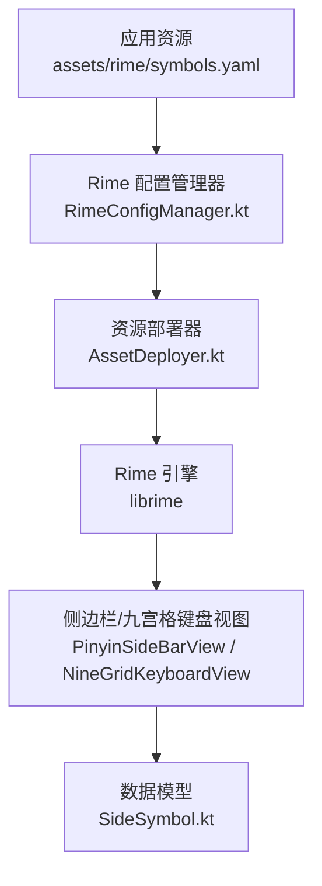
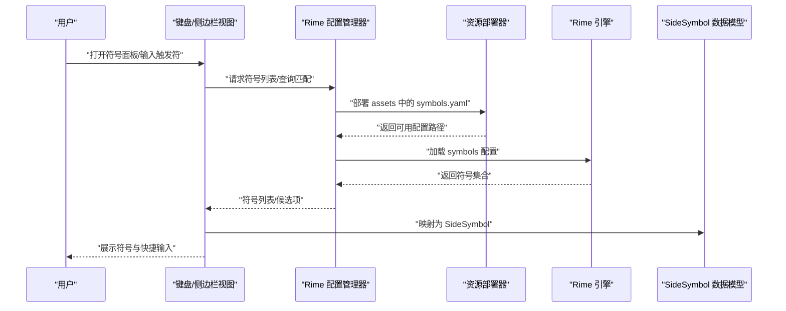
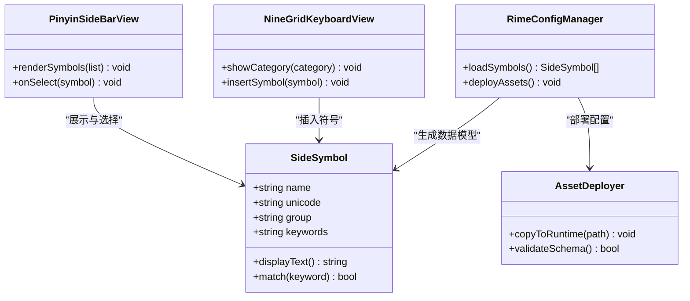
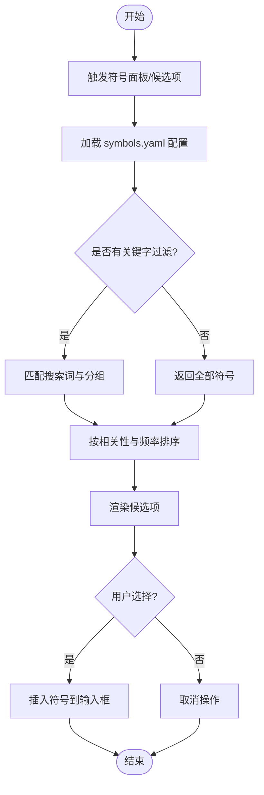
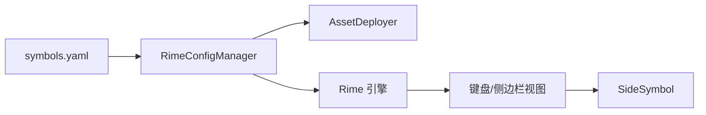

# 符号配置 (symbols.yaml)

<cite>
**本文档引用的文件**   
- [symbols.yaml](file://app/src/main/assets/rime/symbols.yaml)
- [symbols.yaml](file://librime-prebuilt/librime/data/minimal/symbols.yaml)
- [RimeConfigManager.kt](file://app/src/main/java/com/ziyou/ime/config/RimeConfigManager.kt)
- [AssetDeployer.kt](file://app/src/main/java/com/ziyou/ime/config/AssetDeployer.kt)
- [SideSymbol.kt](file://app/src/main/java/com/ziyou/ime/data/SideSymbol.kt)
- [SimpleKeyboardView.kt](file://app/src/main/java/com/ziyou/ime/ime/SimpleKeyboardView.kt)
- [NineGridKeyboardView.kt](file://app/src/main/java/com/ziyou/ime/ime/NineGridKeyboardView.kt)
- [PinyinSideBarView.kt](file://app/src/main/java/com/ziyou/ime/ime/PinyinSideBarView.kt)
</cite>

## 目录
1. [简介](#简介)
2. [项目结构](#项目结构)
3. [核心组件](#核心组件)
4. [架构总览](#架构总览)
5. [详细组件分析](#详细组件分析)
6. [依赖关系分析](#依赖关系分析)
7. [性能考虑](#性能考虑)
8. [故障排查指南](#故障排查指南)
9. [结论](#结论)
10. [附录](#附录)

## 简介
本文件为输入法项目中“符号配置”（symbols.yaml）的权威文档。内容涵盖：
- 符号集定义格式：符号名称、Unicode 编码、分组分类与搜索关键词
- 触发方式与快捷输入规则
- 符号分类体系：数学符号、标点符号、货币符号、表情符号等
- 动态加载机制与自定义符号添加方法
- 常用符号集的推荐配置与使用技巧
- 符号搜索优化与性能注意事项

该文档面向开发者与高级用户，既提供概念性说明，也给出与代码实现对应的参考路径，便于定位与扩展。

## 项目结构
在 Android 应用中，符号配置文件位于 assets/rime 目录下，由 Rime 引擎读取并驱动键盘展示与候选项生成。同时，librime 预构建包中也包含一份 minimal 版本的 symbols.yaml，用于最小化运行环境或测试。

图表来源
- [symbols.yaml](file://app/src/main/assets/rime/symbols.yaml)
- [symbols.yaml](file://librime-prebuilt/librime/data/minimal/symbols.yaml)
- [RimeConfigManager.kt](file://app/src/main/java/com/ziyou/ime/config/RimeConfigManager.kt)
- [AssetDeployer.kt](file://app/src/main/java/com/ziyou/ime/config/AssetDeployer.kt)
- [PinyinSideBarView.kt](file://app/src/main/java/com/ziyou/ime/ime/PinyinSideBarView.kt)
- [NineGridKeyboardView.kt](file://app/src/main/java/com/ziyou/ime/ime/NineGridKeyboardView.kt)
- [SideSymbol.kt](file://app/src/main/java/com/ziyou/ime/data/SideSymbol.kt)

章节来源
- [symbols.yaml](file://app/src/main/assets/rime/symbols.yaml)
- [symbols.yaml](file://librime-prebuilt/librime/data/minimal/symbols.yaml)
- [RimeConfigManager.kt](file://app/src/main/java/com/ziyou/ime/config/RimeConfigManager.kt)
- [AssetDeployer.kt](file://app/src/main/java/com/ziyou/ime/config/AssetDeployer.kt)

## 核心组件
- 符号配置文件 symbols.yaml：定义符号条目、分组、别名与触发规则，是符号系统的唯一数据源。
- Rime 配置管理器：负责加载、合并与应用 Rime 配置（含 symbols.yaml），并在运行时生效。
- 资源部署器：将 assets 中的配置部署到 Rime 可访问的路径，确保引擎能正确读取。
- 键盘视图与侧边栏：根据当前 schema 和符号配置渲染候选项与快捷输入入口。
- 数据模型 SideSymbol：承载单个符号的显示文本、Unicode、分组与搜索词等属性。

章节来源
- [symbols.yaml](file://app/src/main/assets/rime/symbols.yaml)
- [RimeConfigManager.kt](file://app/src/main/java/com/ziyou/ime/config/RimeConfigManager.kt)
- [AssetDeployer.kt](file://app/src/main/java/com/ziyou/ime/config/AssetDeployer.kt)
- [SideSymbol.kt](file://app/src/main/java/com/ziyou/ime/data/SideSymbol.kt)
- [SimpleKeyboardView.kt](file://app/src/main/java/com/ziyou/ime/ime/SimpleKeyboardView.kt)
- [NineGridKeyboardView.kt](file://app/src/main/java/com/ziyou/ime/ime/NineGridKeyboardView.kt)
- [PinyinSideBarView.kt](file://app/src/main/java/com/ziyou/ime/ime/PinyinSideBarView.kt)

## 架构总览
符号系统的数据流从配置到渲染的关键路径如下：

图表来源
- [RimeConfigManager.kt](file://app/src/main/java/com/ziyou/ime/config/RimeConfigManager.kt)
- [AssetDeployer.kt](file://app/src/main/java/com/ziyou/ime/config/AssetDeployer.kt)
- [symbols.yaml](file://app/src/main/assets/rime/symbols.yaml)
- [SideSymbol.kt](file://app/src/main/java/com/ziyou/ime/data/SideSymbol.kt)
- [PinyinSideBarView.kt](file://app/src/main/java/com/ziyou/ime/ime/PinyinSideBarView.kt)
- [NineGridKeyboardView.kt](file://app/src/main/java/com/ziyou/ime/ime/NineGridKeyboardView.kt)

## 详细组件分析

### 符号配置格式与字段说明
- 符号名称：用于标识一个符号条目，通常与显示文本一致或作为别名。
- Unicode 编码：以十六进制形式表示字符码位，如 U+XXXX。
- 分组分类：将符号按用途组织，例如数学、标点、货币、表情等。
- 搜索关键词：用于快速检索的辅助词，支持多词并用空格分隔。
- 触发方式：可通过前缀键、组合键或特定模式触发符号面板或候选项。
- 快捷输入：支持通过固定序列或模板直接插入符号。

建议遵循以下约定：
- 名称简洁明确，避免歧义。
- Unicode 编码准确，必要时附带注释。
- 分组命名统一，便于管理与筛选。
- 搜索词覆盖常见同义词与缩写。

章节来源
- [symbols.yaml](file://app/src/main/assets/rime/symbols.yaml)
- [symbols.yaml](file://librime-prebuilt/librime/data/minimal/symbols.yaml)

### 符号分类体系
- 数学符号：包括运算符、关系符、希腊字母、上下标等。
- 标点符号：逗号、句号、引号、括号、破折号等。
- 货币符号：人民币、美元、欧元、日元等货币标志。
- 表情符号：Emoji 及常用表情字符。
- 其他分类：单位、箭头、星号、特殊标记等。

分类应保持一致性与可扩展性，新增分类时同步更新搜索词与界面标签。

章节来源
- [symbols.yaml](file://app/src/main/assets/rime/symbols.yaml)

### 触发方式与快捷输入规则
- 前缀触发：输入特定前缀（如反斜杠、冒号）后进入符号面板或候选项。
- 组合键：结合功能键或修饰键快速切换符号类别。
- 模板输入：通过占位符模板批量插入带格式的符号。
- 智能联想：基于上下文与历史选择提升命中率。

建议在配置中明确每种触发方式的优先级与冲突处理策略。

章节来源
- [symbols.yaml](file://app/src/main/assets/rime/symbols.yaml)

### 动态加载机制与自定义符号添加
- 动态加载：应用启动或切换 schema 时，由配置管理器部署并加载 symbols.yaml，无需重启。
- 热更新：修改配置后重新部署即可生效，适合调试与增量更新。
- 自定义添加：在 symbols.yaml 中新增条目，保持字段规范；或通过用户层配置覆盖默认集合。
- 版本兼容：新增字段需向后兼容，避免破坏旧版行为。

章节来源
- [RimeConfigManager.kt](file://app/src/main/java/com/ziyou/ime/config/RimeConfigManager.kt)
- [AssetDeployer.kt](file://app/src/main/java/com/ziyou/ime/config/AssetDeployer.kt)
- [symbols.yaml](file://app/src/main/assets/rime/symbols.yaml)

### 常用符号集推荐配置
- 基础标点集：包含常用标点与括号，满足日常输入需求。
- 数学公式集：覆盖基本运算与希腊字母，适合学术写作。
- 货币单位集：主流货币符号与单位，便于财务与商务场景。
- 表情符号集：精选高频 Emoji，兼顾跨平台兼容性。
- 专业符号集：按行业划分（如编程、化学、音乐），按需启用。

推荐做法：
- 分层管理：基础集必选，专业集可选。
- 搜索词优化：为每个符号补充同义词与缩写。
- 分组清晰：界面展示与过滤保持一致。

章节来源
- [symbols.yaml](file://app/src/main/assets/rime/symbols.yaml)

### 符号搜索优化与性能考虑
- 索引构建：对搜索词建立倒排索引，提升匹配速度。
- 缓存策略：缓存热门符号与最近使用的分组，减少重复计算。
- 延迟加载：仅加载当前可见分组的符号，降低内存占用。
- 去重与排序：按使用频率与相关性排序，提高命中率。
- 异步处理：在后台线程执行搜索与渲染，避免卡顿。

章节来源
- [SideSymbol.kt](file://app/src/main/java/com/ziyou/ime/data/SideSymbol.kt)
- [PinyinSideBarView.kt](file://app/src/main/java/com/ziyou/ime/ime/PinyinSideBarView.kt)
- [NineGridKeyboardView.kt](file://app/src/main/java/com/ziyou/ime/ime/NineGridKeyboardView.kt)

### 类图：数据模型与视图交互

图表来源
- [SideSymbol.kt](file://app/src/main/java/com/ziyou/ime/data/SideSymbol.kt)
- [PinyinSideBarView.kt](file://app/src/main/java/com/ziyou/ime/ime/PinyinSideBarView.kt)
- [NineGridKeyboardView.kt](file://app/src/main/java/com/ziyou/ime/ime/NineGridKeyboardView.kt)
- [RimeConfigManager.kt](file://app/src/main/java/com/ziyou/ime/config/RimeConfigManager.kt)
- [AssetDeployer.kt](file://app/src/main/java/com/ziyou/ime/config/AssetDeployer.kt)

### 流程图：符号插入流程

图表来源
- [symbols.yaml](file://app/src/main/assets/rime/symbols.yaml)
- [PinyinSideBarView.kt](file://app/src/main/java/com/ziyou/ime/ime/PinyinSideBarView.kt)
- [NineGridKeyboardView.kt](file://app/src/main/java/com/ziyou/ime/ime/NineGridKeyboardView.kt)

## 依赖关系分析
符号系统的关键依赖如下：
- symbols.yaml 被 Rime 引擎解析，供上层视图消费。
- 配置管理器依赖资源部署器完成配置文件的部署与校验。
- 视图层依赖数据模型进行展示与交互。
- 搜索与排序逻辑依赖索引与缓存以提升性能。

图表来源
- [symbols.yaml](file://app/src/main/assets/rime/symbols.yaml)
- [RimeConfigManager.kt](file://app/src/main/java/com/ziyou/ime/config/RimeConfigManager.kt)
- [AssetDeployer.kt](file://app/src/main/java/com/ziyou/ime/config/AssetDeployer.kt)
- [SideSymbol.kt](file://app/src/main/java/com/ziyou/ime/data/SideSymbol.kt)
- [PinyinSideBarView.kt](file://app/src/main/java/com/ziyou/ime/ime/PinyinSideBarView.kt)
- [NineGridKeyboardView.kt](file://app/src/main/java/com/ziyou/ime/ime/NineGridKeyboardView.kt)

章节来源
- [symbols.yaml](file://app/src/main/assets/rime/symbols.yaml)
- [RimeConfigManager.kt](file://app/src/main/java/com/ziyou/ime/config/RimeConfigManager.kt)
- [AssetDeployer.kt](file://app/src/main/java/com/ziyou/ime/config/AssetDeployer.kt)
- [SideSymbol.kt](file://app/src/main/java/com/ziyou/ime/data/SideSymbol.kt)
- [PinyinSideBarView.kt](file://app/src/main/java/com/ziyou/ime/ime/PinyinSideBarView.kt)
- [NineGridKeyboardView.kt](file://app/src/main/java/com/ziyou/ime/ime/NineGridKeyboardView.kt)

## 性能考虑
- 配置体积控制：合理拆分符号集，按需加载，避免一次性载入过大文件。
- 搜索复杂度：采用 O(log n) 或 O(1) 的查找结构，减少线性扫描。
- 内存占用：使用对象池与弱引用管理临时对象，防止内存泄漏。
- I/O 优化：批量读写与异步任务调度，避免主线程阻塞。
- 渲染效率：分页与虚拟化列表，减少 UI 重绘次数。

[本节为通用指导，不直接分析具体文件]

## 故障排查指南
常见问题与解决思路：
- 符号不显示：检查 symbols.yaml 语法与路径是否正确，确认已部署到运行时目录。
- 搜索无结果：验证搜索词与关键字是否匹配，检查索引是否重建。
- 触发失效：确认前缀键与组合键配置是否与 schema 一致。
- 性能卡顿：查看是否频繁全量加载，考虑引入缓存与懒加载。
- 自定义无效：检查用户覆盖配置的优先级与字段命名是否规范。

章节来源
- [RimeConfigManager.kt](file://app/src/main/java/com/ziyou/ime/config/RimeConfigManager.kt)
- [AssetDeployer.kt](file://app/src/main/java/com/ziyou/ime/config/AssetDeployer.kt)
- [symbols.yaml](file://app/src/main/assets/rime/symbols.yaml)

## 结论
symbols.yaml 是输入法符号系统的核心配置，定义了符号的语义、分类与交互规则。通过合理的配置结构与高效的加载机制，可实现快速、准确的符号输入体验。建议在实践中持续优化搜索与渲染性能，并保持配置的模块化与可扩展性。

[本节为总结性内容，不直接分析具体文件]

## 附录
- 字段命名规范：统一使用小写与下划线分隔，避免歧义。
- Unicode 编码格式：使用 U+XXXX 标准格式，必要时附加注释。
- 分组命名约定：中文分组名简洁明了，便于界面展示。
- 搜索词策略：覆盖同义词、缩写与常见误拼。
- 版本迁移：新增字段时保留默认值，确保向后兼容。

[本节为补充信息，不直接分析具体文件]