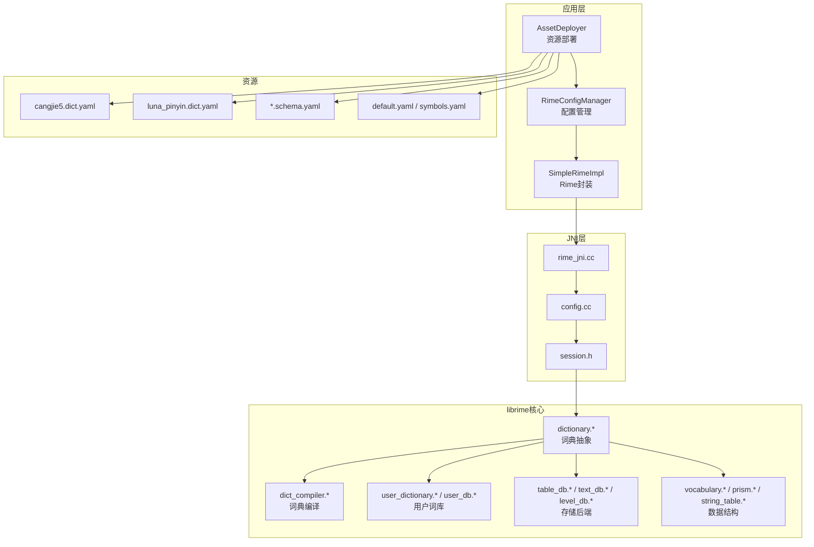
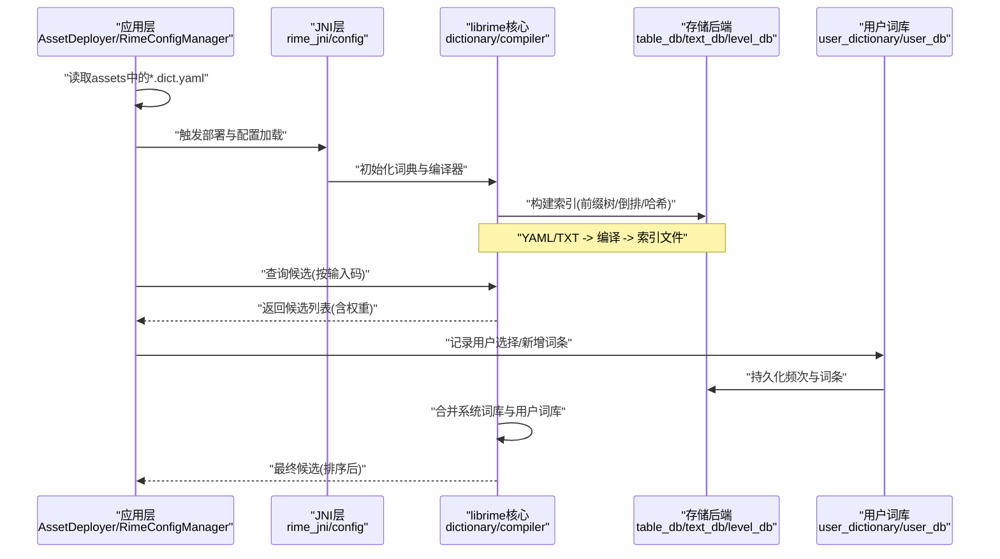
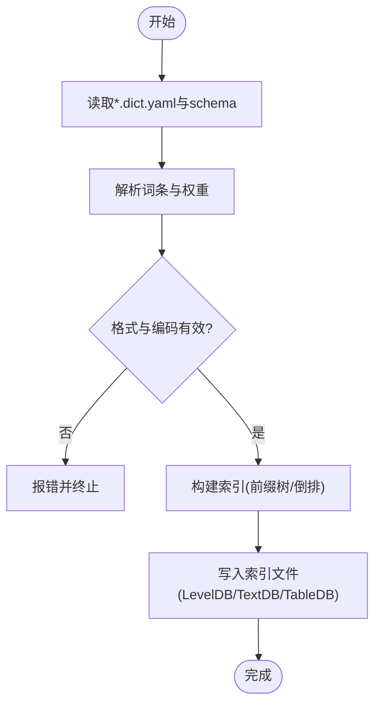
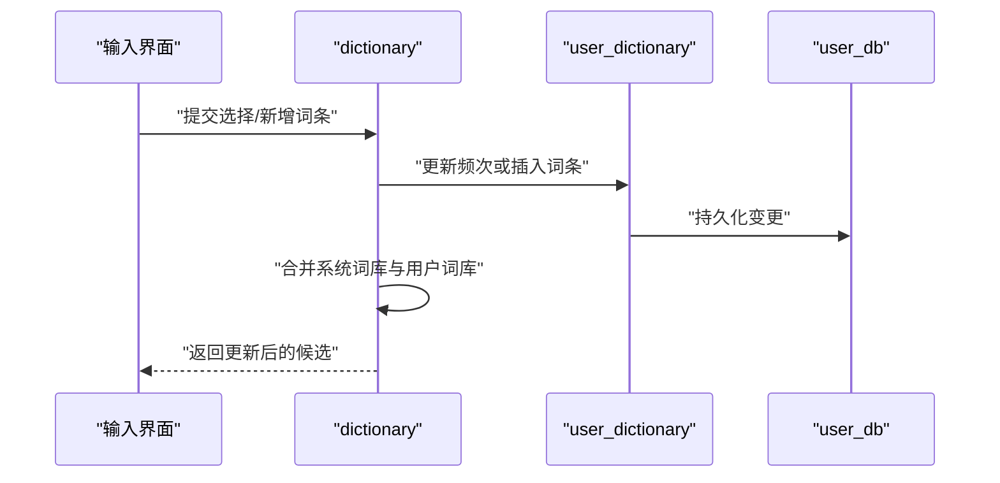
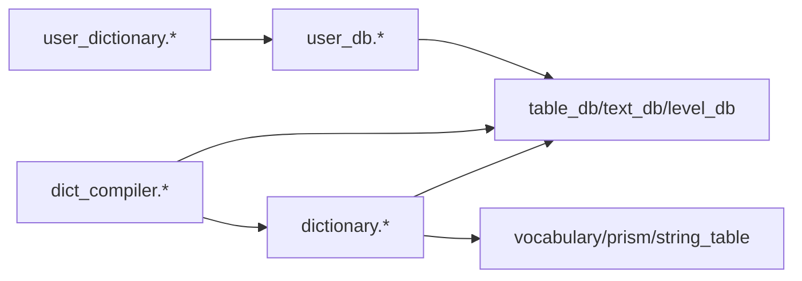

# 词典配置文件 (dict.yaml)

<cite>
**本文引用的文件**   
- [cangjie5.dict.yaml](file://app/src/main/assets/rime/cangjie5.dict.yaml)
- [luna_pinyin.dict.yaml](file://app/src/main/assets/rime/luna_pinyin.dict.yaml)
- [default.yaml](file://app/src/main/assets/rime/default.yaml)
- [cangjie5.schema.yaml](file://app/src/main/assets/rime/cangjie5.schema.yaml)
- [luna_pinyin.schema.yaml](file://app/src/main/assets/rime/luna_pinyin.schema.yaml)
- [symbols.yaml](file://app/src/main/assets/rime/symbols.yaml)
- [AssetDeployer.kt](file://app/src/main/java/com/ziyou/ime/config/AssetDeployer.kt)
- [RimeConfigManager.kt](file://app/src/main/java/com/ziyou/ime/config/RimeConfigManager.kt)
- [SimpleRimeImpl.kt](file://app/src/main/java/com/ziyou/ime/core/SimpleRimeImpl.kt)
- [rime_jni.cc](file://app/src/main/jni/librime_jni/rime_jni.cc)
- [config.cc](file://app/src/main/jni/librime_jni/config.cc)
- [session.h](file://app/src/main/jni/librime_jni/session.h)
- [dictionary.h](file://librime-prebuilt/librime/src/rime/dict/dictionary.h)
- [dictionary.cc](file://librime-prebuilt/librime/src/rime/dict/dictionary.cc)
- [dict_compiler.h](file://librime-prebuilt/librime/src/rime/dict/dict_compiler.h)
- [dict_compiler.cc](file://librime-prebuilt/librime/src/rime/dict/dict_compiler.cc)
- [user_dictionary.h](file://librime-prebuilt/librime/src/rime/dict/user_dictionary.h)
- [user_db.h](file://librime-prebuilt/librime/src/rime/dict/user_db.h)
- [table_db.h](file://librime-prebuilt/librime/src/rime/dict/table_db.h)
- [text_db.h](file://librime-prebuilt/librime/src/rime/dict/text_db.h)
- [level_db.h](file://librime-prebuilt/librime/src/rime/dict/level_db.h)
- [db_utils.h](file://librime-prebuilt/librime/src/rime/dict/db_utils.h)
- [vocabulary.h](file://librime-prebuilt/librime/src/rime/dict/vocabulary.h)
- [prism.h](file://librime-prebuilt/librime/src/rime/dict/prism.h)
- [string_table.h](file://librime-prebuilt/librime/src/rime/dict/string_table.h)
- [tsv.h](file://librime-prebuilt/librime/src/rime/dict/tsv.h)
- [preset_vocabulary.h](file://librime-prebuilt/librime/src/rime/dict/preset_vocabulary.h)
- [reverse_lookup_dictionary.h](file://librime-prebuilt/librime/src/rime/dict/reverse_lookup_dictionary.h)
- [rime_dict_manager.cc](file://librime-prebuilt/librime/tools/rime_dict_manager.cc)
- [rime_deployer.cc](file://librime-prebuilt/librime/tools/rime_deployer.cc)
</cite>

## 目录
1. [简介](#简介)
2. [项目结构](#项目结构)
3. [核心组件](#核心组件)
4. [架构总览](#架构总览)
5. [详细组件分析](#详细组件分析)
6. [依赖关系分析](#依赖关系分析)
7. [性能考量](#性能考量)
8. [故障排查指南](#故障排查指南)
9. [结论](#结论)
10. [附录](#附录)

## 简介
本文件面向输入法项目中“词典配置”（dict.yaml）的完整说明，涵盖：
- 词典文件格式规范：词条格式、权重设置、分类标记、编码要求
- 词典编译流程：从原始文本到索引文件的转换过程
- 动态词典更新机制：用户自定义词条与频率学习
- 压缩算法与内存管理策略
- 词典制作工具使用指南：批量导入、格式转换、质量检查
- 词典优化技巧与性能调优方法

本项目基于 Rime 输入法引擎，Android 端通过 JNI 调用 librime，assets 中提供 .dict.yaml 与 .schema.yaml 等配置。运行时由部署器将 YAML 词典编译为高效索引结构，并在运行期支持用户词库与频率学习。

## 项目结构
- assets/rime 目录包含各方案的词典与模式定义：
  - cangjie5.dict.yaml、luna_pinyin.dict.yaml：词典数据
  - cangjie5.schema.yaml、luna_pinyin.schema.yaml：方案配置
  - default.yaml、symbols.yaml：默认配置与符号表
- Android 层通过 AssetDeployer 与 RimeConfigManager 负责资源部署与配置加载
- JNI 层 rime_jni.cc、config.cc、session.h 桥接 Java/Kotlin 与 C++ librime
- librime 源码实现词典解析、编译、查询、用户词库与持久化

**图表来源**
- [AssetDeployer.kt](file://app/src/main/java/com/ziyou/ime/config/AssetDeployer.kt)
- [RimeConfigManager.kt](file://app/src/main/java/com/ziyou/ime/config/RimeConfigManager.kt)
- [SimpleRimeImpl.kt](file://app/src/main/java/com/ziyou/ime/core/SimpleRimeImpl.kt)
- [rime_jni.cc](file://app/src/main/jni/librime_jni/rime_jni.cc)
- [config.cc](file://app/src/main/jni/librime_jni/config.cc)
- [session.h](file://app/src/main/jni/librime_jni/session.h)
- [dictionary.h](file://librime-prebuilt/librime/src/rime/dict/dictionary.h)
- [dict_compiler.h](file://librime-prebuilt/librime/src/rime/dict/dict_compiler.h)
- [user_dictionary.h](file://librime-prebuilt/librime/src/rime/dict/user_dictionary.h)
- [table_db.h](file://librime-prebuilt/librime/src/rime/dict/table_db.h)
- [text_db.h](file://librime-prebuilt/librime/src/rime/dict/text_db.h)
- [level_db.h](file://librime-prebuilt/librime/src/rime/dict/level_db.h)
- [vocabulary.h](file://librime-prebuilt/librime/src/rime/dict/vocabulary.h)
- [prism.h](file://librime-prebuilt/librime/src/rime/dict/prism.h)
- [string_table.h](file://librime-prebuilt/librime/src/rime/dict/string_table.h)

**章节来源**
- [cangjie5.dict.yaml](file://app/src/main/assets/rime/cangjie5.dict.yaml)
- [luna_pinyin.dict.yaml](file://app/src/main/assets/rime/luna_pinyin.dict.yaml)
- [default.yaml](file://app/src/main/assets/rime/default.yaml)
- [cangjie5.schema.yaml](file://app/src/main/assets/rime/cangjie5.schema.yaml)
- [luna_pinyin.schema.yaml](file://app/src/main/assets/rime/luna_pinyin.schema.yaml)
- [symbols.yaml](file://app/src/main/assets/rime/symbols.yaml)

## 核心组件
- 词典抽象与实现
  - dictionary.*：统一词典接口，负责条目加载、查询、迭代
  - table_db.* / text_db.* / level_db.*：多种存储后端（表、文本、LevelDB），用于不同场景的读写与缓存
- 词典编译
  - dict_compiler.*：将 YAML/TXT 源转换为高效索引（如前缀树、倒排、哈希）
- 用户词库与频率学习
  - user_dictionary.* / user_db.*：用户自定义词条、频次统计、持久化与恢复
- 数据结构与压缩
  - vocabulary.* / prism.* / string_table.*：词条、音节映射、字符串去重与共享
  - tsv.* / preset_vocabulary.*：TSV 输入与预置词库

**章节来源**
- [dictionary.h](file://librime-prebuilt/librime/src/rime/dict/dictionary.h)
- [dictionary.cc](file://librime-prebuilt/librime/src/rime/dict/dictionary.cc)
- [dict_compiler.h](file://librime-prebuilt/librime/src/rime/dict/dict_compiler.h)
- [dict_compiler.cc](file://librime-prebuilt/librime/src/rime/dict/dict_compiler.cc)
- [user_dictionary.h](file://librime-prebuilt/librime/src/rime/dict/user_dictionary.h)
- [user_db.h](file://librime-prebuilt/librime/src/rime/dict/user_db.h)
- [table_db.h](file://librime-prebuilt/librime/src/rime/dict/table_db.h)
- [text_db.h](file://librime-prebuilt/librime/src/rime/dict/text_db.h)
- [level_db.h](file://librime-prebuilt/librime/src/rime/dict/level_db.h)
- [vocabulary.h](file://librime-prebuilt/librime/src/rime/dict/vocabulary.h)
- [prism.h](file://librime-prebuilt/librime/src/rime/dict/prism.h)
- [string_table.h](file://librime-prebuilt/librime/src/rime/dict/string_table.h)
- [tsv.h](file://librime-prebuilt/librime/src/rime/dict/tsv.h)
- [preset_vocabulary.h](file://librime-prebuilt/librime/src/rime/dict/preset_vocabulary.h)

## 架构总览
下图展示从资源部署到词典编译、查询与用户词库更新的端到端流程。

**图表来源**
- [AssetDeployer.kt](file://app/src/main/java/com/ziyou/ime/config/AssetDeployer.kt)
- [RimeConfigManager.kt](file://app/src/main/java/com/ziyou/ime/config/RimeConfigManager.kt)
- [rime_jni.cc](file://app/src/main/jni/librime_jni/rime_jni.cc)
- [config.cc](file://app/src/main/jni/librime_jni/config.cc)
- [dictionary.h](file://librime-prebuilt/librime/src/rime/dict/dictionary.h)
- [dict_compiler.h](file://librime-prebuilt/librime/src/rime/dict/dict_compiler.h)
- [user_dictionary.h](file://librime-prebuilt/librime/src/rime/dict/user_dictionary.h)
- [table_db.h](file://librime-prebuilt/librime/src/rime/dict/table_db.h)
- [text_db.h](file://librime-prebuilt/librime/src/rime/dict/text_db.h)
- [level_db.h](file://librime-prebuilt/librime/src/rime/dict/level_db.h)

## 详细组件分析

### 词典文件格式规范（dict.yaml）
- 基本结构
  - 以 YAML 形式组织，通常包含若干“词条行”，每行表示一个可被检索的候选
  - 常见字段包括：词条文本、权重（频率）、可选的分类标记或标签
- 词条格式
  - 典型顺序：词条内容 + 空格分隔的权重数值 + 可选注释
  - 权重越大，在候选列表中越靠前；权重可为整数或浮点，具体取决于实现
- 分类标记
  - 某些词典会在词条后附加分类标记，便于过滤与显示分组
  - 标记通常为短字符串或数字，需与 schema 配置保持一致
- 编码要求
  - 建议使用 UTF-8 编码，确保多语言与特殊字符正确解析
  - 避免 BOM 头，防止解析异常
- 示例参考路径
  - [cangjie5.dict.yaml](file://app/src/main/assets/rime/cangjie5.dict.yaml)
  - [luna_pinyin.dict.yaml](file://app/src/main/assets/rime/luna_pinyin.dict.yaml)

**章节来源**
- [cangjie5.dict.yaml](file://app/src/main/assets/rime/cangjie5.dict.yaml)
- [luna_pinyin.dict.yaml](file://app/src/main/assets/rime/luna_pinyin.dict.yaml)

### 词典编译流程（YAML/TXT → 索引）
- 编译入口
  - 由部署器或命令行工具触发，读取 *.dict.yaml 与相关 schema
- 解析阶段
  - 解析 YAML/TXT 为内部词条对象，校验格式与编码
- 索引构建
  - 根据输入码（如拼音、五笔）建立前缀树或倒排索引
  - 将权重与分类信息嵌入索引节点，支持快速排序与过滤
- 输出产物
  - 生成二进制索引文件（如 LevelDB/TextDB/TableDB），提高查询性能
- 工具链
  - librime 提供编译工具，可在构建时或运行时执行

**图表来源**
- [dict_compiler.h](file://librime-prebuilt/librime/src/rime/dict/dict_compiler.h)
- [dict_compiler.cc](file://librime-prebuilt/librime/src/rime/dict/dict_compiler.cc)
- [table_db.h](file://librime-prebuilt/librime/src/rime/dict/table_db.h)
- [text_db.h](file://librime-prebuilt/librime/src/rime/dict/text_db.h)
- [level_db.h](file://librime-prebuilt/librime/src/rime/dict/level_db.h)

**章节来源**
- [dict_compiler.h](file://librime-prebuilt/librime/src/rime/dict/dict_compiler.h)
- [dict_compiler.cc](file://librime-prebuilt/librime/src/rime/dict/dict_compiler.cc)

### 动态词典更新机制（用户自定义词条与频率学习）
- 用户词库
  - user_dictionary.* 维护用户新增词条与频次统计
  - user_db.* 负责持久化（LevelDB/文本），支持增量更新与恢复
- 更新流程
  - 用户选择候选或输入新词条时，更新频次或插入新词条
  - 定期合并系统词库与用户词库，重新排序候选
- 恢复与一致性
  - 启动时进行恢复任务，保证用户词库一致性与完整性

**图表来源**
- [user_dictionary.h](file://librime-prebuilt/librime/src/rime/dict/user_dictionary.h)
- [user_db.h](file://librime-prebuilt/librime/src/rime/dict/user_db.h)
- [dictionary.h](file://librime-prebuilt/librime/src/rime/dict/dictionary.h)

**章节来源**
- [user_dictionary.h](file://librime-prebuilt/librime/src/rime/dict/user_dictionary.h)
- [user_db.h](file://librime-prebuilt/librime/src/rime/dict/user_db.h)

### 压缩算法与内存管理策略
- 字符串共享
  - string_table.* 对重复字符串进行去重与共享，降低内存占用
- 前缀树与倒排
  - prism.* 与前缀树结构结合，减少冗余存储并加速匹配
- 存储后端
  - table_db.* / text_db.* / level_db.* 提供不同压缩与访问特性
  - LevelDB 适合高并发与持久化；TextDB 适合轻量与可读性
- 内存管理
  - 按需加载与懒解析，避免一次性载入全部词条
  - 合理设置缓存大小与淘汰策略，平衡性能与内存

**章节来源**
- [string_table.h](file://librime-prebuilt/librime/src/rime/dict/string_table.h)
- [prism.h](file://librime-prebuilt/librime/src/rime/dict/prism.h)
- [table_db.h](file://librime-prebuilt/librime/src/rime/dict/table_db.h)
- [text_db.h](file://librime-prebuilt/librime/src/rime/dict/text_db.h)
- [level_db.h](file://librime-prebuilt/librime/src/rime/dict/level_db.h)

### 词典制作工具使用指南
- 工具清单
  - rime_dict_manager：词典管理与操作（导入、导出、检查）
  - rime_deployer：部署与编译（将 YAML/TXT 编译为索引）
- 常用操作
  - 批量导入：将 TSV/YAML 批量导入为词典
  - 格式转换：在不同格式间转换（TXT ↔ TSV ↔ YAML）
  - 质量检查：校验词条格式、权重范围、编码一致性
- 使用建议
  - 先进行质量检查，再执行编译与部署
  - 对大词典分批次处理，避免内存溢出

**章节来源**
- [rime_dict_manager.cc](file://librime-prebuilt/librime/tools/rime_dict_manager.cc)
- [rime_deployer.cc](file://librime-prebuilt/librime/tools/rime_deployer.cc)

## 依赖关系分析
- 组件耦合
  - dictionary.* 依赖存储后端（table_db/text_db/level_db）与数据结构（vocabulary/prism/string_table）
  - dict_compiler.* 依赖解析器与存储后端，产出索引
  - user_dictionary.* 依赖 user_db.* 进行持久化
- 外部依赖
  - LevelDB（持久化与高性能KV存储）
  - YAML 解析库（YamlCpp）
- 潜在循环依赖
  - 词典模块内部分层清晰，应避免跨层直接引用

**图表来源**
- [dictionary.h](file://librime-prebuilt/librime/src/rime/dict/dictionary.h)
- [dict_compiler.h](file://librime-prebuilt/librime/src/rime/dict/dict_compiler.h)
- [user_dictionary.h](file://librime-prebuilt/librime/src/rime/dict/user_dictionary.h)
- [user_db.h](file://librime-prebuilt/librime/src/rime/dict/user_db.h)
- [table_db.h](file://librime-prebuilt/librime/src/rime/dict/table_db.h)
- [text_db.h](file://librime-prebuilt/librime/src/rime/dict/text_db.h)
- [level_db.h](file://librime-prebuilt/librime/src/rime/dict/level_db.h)
- [vocabulary.h](file://librime-prebuilt/librime/src/rime/dict/vocabulary.h)
- [prism.h](file://librime-prebuilt/librime/src/rime/dict/prism.h)
- [string_table.h](file://librime-prebuilt/librime/src/rime/dict/string_table.h)

**章节来源**
- [dictionary.h](file://librime-prebuilt/librime/src/rime/dict/dictionary.h)
- [dict_compiler.h](file://librime-prebuilt/librime/src/rime/dict/dict_compiler.h)
- [user_dictionary.h](file://librime-prebuilt/librime/src/rime/dict/user_dictionary.h)
- [user_db.h](file://librime-prebuilt/librime/src/rime/dict/user_db.h)

## 性能考量
- 索引选择
  - 大规模词库优先使用 LevelDB，提升查询与持久化性能
  - 小规模或调试场景可使用 TextDB，便于查看与修改
- 内存控制
  - 启用字符串共享与前缀树压缩，降低内存峰值
  - 合理设置缓存上限，避免频繁换页
- 编译优化
  - 离线编译索引，避免运行时开销
  - 分批次导入与增量更新，减少全量重建
- 查询优化
  - 利用前缀匹配与倒排索引，缩短候选生成时间
  - 合并系统词库与用户词库时采用惰性合并，按需计算

[本节为通用指导，不直接分析具体文件]

## 故障排查指南
- 常见问题
  - 编码错误：UTF-8 缺失或 BOM 导致解析失败
  - 权重异常：负数或过大值影响排序
  - 分类标记不一致：与 schema 配置不匹配导致过滤异常
- 排查步骤
  - 使用 rime_dict_manager 进行质量检查
  - 检查 YAML/TXT 格式与编码
  - 验证 schema 与词典标记的一致性
- 日志与恢复
  - 查看部署与编译日志，定位错误位置
  - 使用 user_db 恢复任务修复不一致状态

**章节来源**
- [rime_dict_manager.cc](file://librime-prebuilt/librime/tools/rime_dict_manager.cc)
- [user_db.h](file://librime-prebuilt/librime/src/rime/dict/user_db.h)

## 结论
本文件系统化阐述了词典配置文件（dict.yaml）的格式规范、编译流程、动态更新机制、压缩与内存管理策略，以及工具使用与性能调优方法。通过遵循上述规范与实践，可构建高效、稳定且可扩展的输入法词典系统。

[本节为总结性内容，不直接分析具体文件]

## 附录
- 参考文件路径
  - 词典数据：[cangjie5.dict.yaml](file://app/src/main/assets/rime/cangjie5.dict.yaml)、[luna_pinyin.dict.yaml](file://app/src/main/assets/rime/luna_pinyin.dict.yaml)
  - 方案配置：[cangjie5.schema.yaml](file://app/src/main/assets/rime/cangjie5.schema.yaml)、[luna_pinyin.schema.yaml](file://app/src/main/assets/rime/luna_pinyin.schema.yaml)
  - 默认配置：[default.yaml](file://app/src/main/assets/rime/default.yaml)、[symbols.yaml](file://app/src/main/assets/rime/symbols.yaml)
- 关键实现
  - 词典抽象与编译：[dictionary.*](file://librime-prebuilt/librime/src/rime/dict/dictionary.h)、[dict_compiler.*](file://librime-prebuilt/librime/src/rime/dict/dict_compiler.h)
  - 用户词库与持久化：[user_dictionary.*](file://librime-prebuilt/librime/src/rime/dict/user_dictionary.h)、[user_db.*](file://librime-prebuilt/librime/src/rime/dict/user_db.h)
  - 存储后端：[table_db.*](file://librime-prebuilt/librime/src/rime/dict/table_db.h)、[text_db.*](file://librime-prebuilt/librime/src/rime/dict/text_db.h)、[level_db.*](file://librime-prebuilt/librime/src/rime/dict/level_db.h)
  - 数据结构与压缩：[vocabulary.*](file://librime-prebuilt/librime/src/rime/dict/vocabulary.h)、[prism.*](file://librime-prebuilt/librime/src/rime/dict/prism.h)、[string_table.*](file://librime-prebuilt/librime/src/rime/dict/string_table.h)

[本节为附录，不直接分析具体文件]