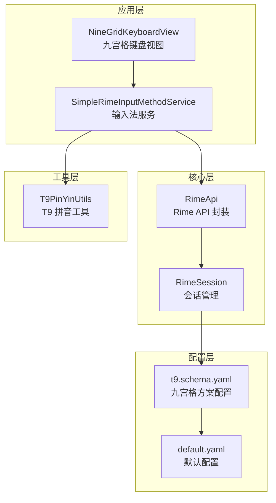
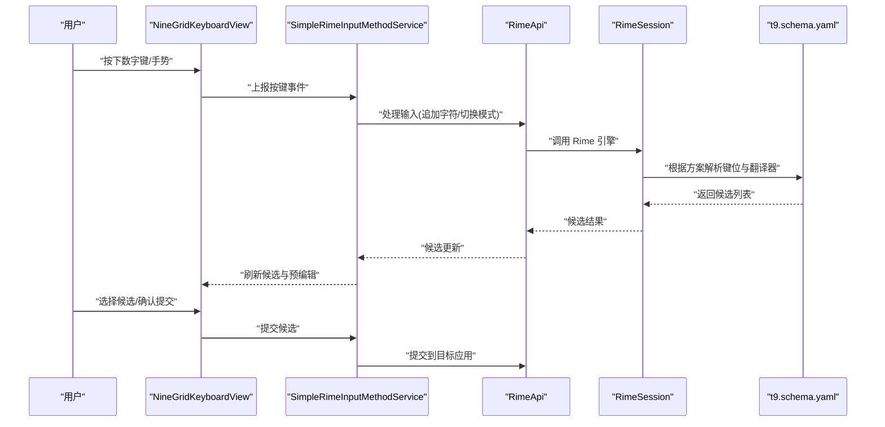
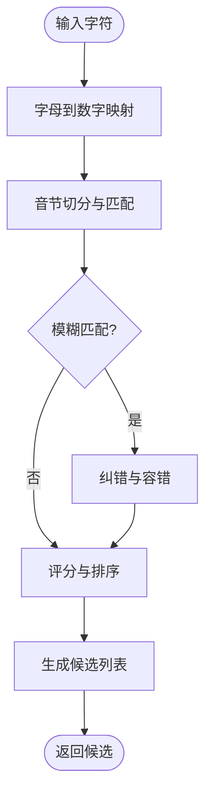
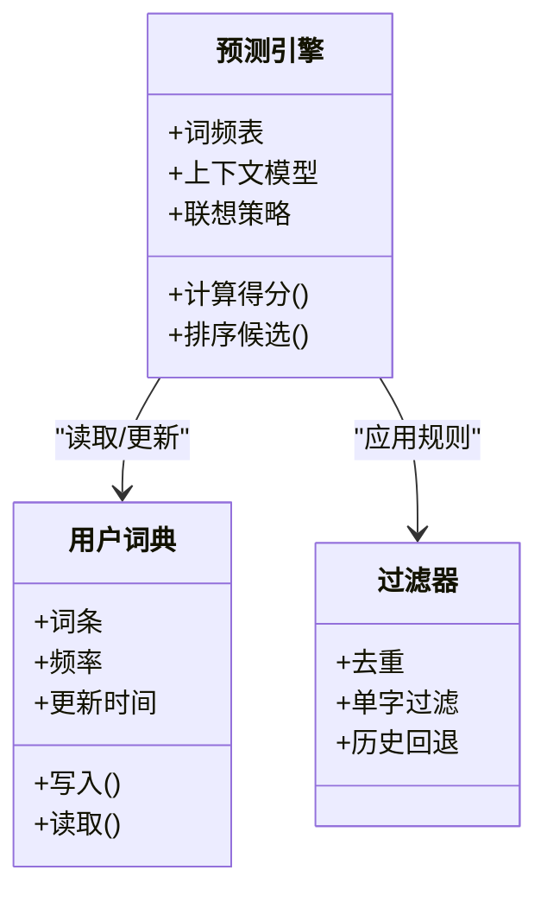
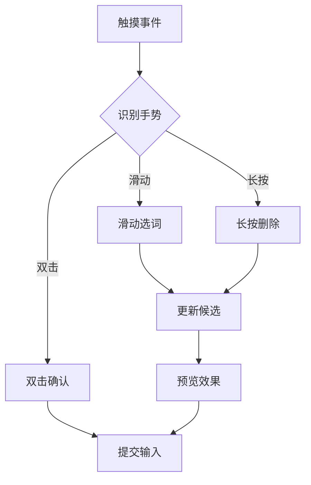
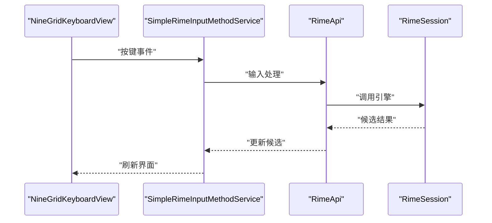
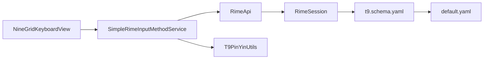

# 九宫格方案配置

<cite>
**本文引用的文件**   
- [t9.schema.yaml](file://app/src/main/assets/rime/t9.schema.yaml)
- [NineGridKeyboardView.kt](file://app/src/main/java/com/ziyou/ime/ime/NineGridKeyboardView.kt)
- [T9PinYinUtils.kt](file://app/src/main/java/com/ziyou/ime/util/T9PinYinUtils.kt)
- [SimpleRimeInputMethodService.kt](file://app/src/main/java/com/ziyou/ime/ime/SimpleRimeInputMethodService.kt)
- [RimeApi.kt](file://app/src/main/java/com/ziyou/ime/core/RimeApi.kt)
- [RimeSession.kt](file://app/src/main/java/com/ziyou/ime/daemon/RimeSession.kt)
- [RimeConfigManager.kt](file://app/src/main/java/com/ziyou/ime/config/RimeConfigManager.kt)
- [default.yaml](file://app/src/main/assets/rime/default.yaml)
</cite>

## 目录
1. [简介](#简介)
2. [项目结构](#项目结构)
3. [核心组件](#核心组件)
4. [架构总览](#架构总览)
5. [详细组件分析](#详细组件分析)
6. [依赖关系分析](#依赖关系分析)
7. [性能考虑](#性能考虑)
8. [故障排查指南](#故障排查指南)
9. [结论](#结论)
10. [附录](#附录)

## 简介
本文件面向“九宫格输入方案”的配置与实现，围绕 t9.schema.yaml 的结构、数字键盘映射、字母到数字的转换规则、候选词预测算法进行系统化说明。同时覆盖智能联想、词频学习、手势输入支持等九宫格特殊配置项；给出键盘布局优化、输入速度提升技巧与用户体验改进建议；并提供调试方法与性能调优策略，以及定制化与扩展开发参考。

## 项目结构
- 资源层：rime 引擎配置文件位于 app/src/main/assets/rime/，其中 t9.schema.yaml 定义九宫格方案的键位映射、翻译器、过滤器、用户词典路径等。
- 应用层：Android 输入法服务与 UI 视图负责接收按键事件、渲染九宫格键盘、展示候选与预编辑文本。
- 核心层：Rime API 封装与 Session 管理负责调用底层 Rime 引擎执行分词、翻译、候选生成与提交。
- 工具层：T9 拼音工具类提供字母到数字的映射、音节切分、候选排序辅助逻辑。

**图表来源** 
- [NineGridKeyboardView.kt](file://app/src/main/java/com/ziyou/ime/ime/NineGridKeyboardView.kt)
- [SimpleRimeInputMethodService.kt](file://app/src/main/java/com/ziyou/ime/ime/SimpleRimeInputMethodService.kt)
- [RimeApi.kt](file://app/src/main/java/com/ziyou/ime/core/RimeApi.kt)
- [RimeSession.kt](file://app/src/main/java/com/ziyou/ime/daemon/RimeSession.kt)
- [t9.schema.yaml](file://app/src/main/assets/rime/t9.schema.yaml)
- [default.yaml](file://app/src/main/assets/rime/default.yaml)

**章节来源**
- [t9.schema.yaml](file://app/src/main/assets/rime/t9.schema.yaml)
- [NineGridKeyboardView.kt](file://app/src/main/java/com/ziyou/ime/ime/NineGridKeyboardView.kt)
- [T9PinYinUtils.kt](file://app/src/main/java/com/ziyou/ime/util/T9PinYinUtils.kt)
- [SimpleRimeInputMethodService.kt](file://app/src/main/java/com/ziyou/ime/ime/SimpleRimeInputMethodService.kt)
- [RimeApi.kt](file://app/src/main/java/com/ziyou/ime/core/RimeApi.kt)
- [RimeSession.kt](file://app/src/main/java/com/ziyou/ime/daemon/RimeSession.kt)
- [default.yaml](file://app/src/main/assets/rime/default.yaml)

## 核心组件
- t9.schema.yaml：定义九宫格方案的键位映射（key_binder）、翻译器（translator）与过滤器（filter），并指定用户词典与词库路径，是九宫格输入的核心配置。
- NineGridKeyboardView：渲染 3x3 数字键盘，处理长按、滑动、连击等手势，将按键事件转换为 T9 序列并提交给上层。
- T9PinYinUtils：提供字母到数字的映射表、音节切分、候选排序辅助函数，支撑快速输入与联想。
- SimpleRimeInputMethodService：输入法服务入口，协调 UI、Rime API、Session，处理输入生命周期与候选提交。
- RimeApi / RimeSession：封装 Rime 引擎调用，包括初始化、加载方案、输入处理、候选获取与提交。
- default.yaml：全局默认配置，被 t9.schema.yaml 引用或覆盖，影响行为开关与通用设置。

**章节来源**
- [t9.schema.yaml](file://app/src/main/assets/rime/t9.schema.yaml)
- [NineGridKeyboardView.kt](file://app/src/main/java/com/ziyou/ime/ime/NineGridKeyboardView.kt)
- [T9PinYinUtils.kt](file://app/src/main/java/com/ziyou/ime/util/T9PinYinUtils.kt)
- [SimpleRimeInputMethodService.kt](file://app/src/main/java/com/ziyou/ime/ime/SimpleRimeInputMethodService.kt)
- [RimeApi.kt](file://app/src/main/java/com/ziyou/ime/core/RimeApi.kt)
- [RimeSession.kt](file://app/src/main/java/com/ziyou/ime/daemon/RimeSession.kt)
- [default.yaml](file://app/src/main/assets/rime/default.yaml)

## 架构总览
九宫格输入流程从 UI 按键开始，经输入法服务转发至 Rime 引擎，由 t9.schema.yaml 驱动键位绑定与翻译器选择，最终返回候选词供用户选择与提交。

**图表来源** 
- [NineGridKeyboardView.kt](file://app/src/main/java/com/ziyou/ime/ime/NineGridKeyboardView.kt)
- [SimpleRimeInputMethodService.kt](file://app/src/main/java/com/ziyou/ime/ime/SimpleRimeInputMethodService.kt)
- [RimeApi.kt](file://app/src/main/java/com/ziyou/ime/core/RimeApi.kt)
- [RimeSession.kt](file://app/src/main/java/com/ziyou/ime/daemon/RimeSession.kt)
- [t9.schema.yaml](file://app/src/main/assets/rime/t9.schema.yaml)

## 详细组件分析

### t9.schema.yaml 结构与字段说明
- 键位绑定（key_binder）：定义数字键到字符或动作的映射，支持长按、组合键、快捷操作。
- 翻译器（translator）：指定 T9 拼音翻译器、候选排序策略、用户词典路径、词频权重。
- 过滤器（filter）：启用智能联想、去重、单字过滤、历史回退等。
- 用户词典（user_dict）：配置用户自定义词条与学习数据持久化位置。
- 方案开关（switches）：控制是否开启联想、词频学习、手势输入等功能。

常见配置项与作用：
- 数字键盘映射：将 2-9 键映射到对应字母集合，支持长按切换符号或功能。
- 字母到数字转换：依据拼音首字母或音节切分规则，将输入序列转为数字串。
- 候选词预测：结合词频、上下文、用户习惯进行排序与联想。
- 智能联想：基于历史与常用词自动补全。
- 词频学习：记录用户选择，动态调整候选顺序。
- 手势输入：支持滑动选词、长按删除、双击确认等。

**章节来源**
- [t9.schema.yaml](file://app/src/main/assets/rime/t9.schema.yaml)
- [default.yaml](file://app/src/main/assets/rime/default.yaml)

### 数字键盘映射与字母到数字转换
- 映射规则：2=ABC, 3=DEF, 4=GHI, 5=JKL, 6=MNO, 7=PQRS, 8=TUV, 9=WXYZ。
- 转换策略：优先匹配常用音节，次级匹配首字母；支持模糊音与纠错。
- 边界处理：多音字、同音词通过候选排序与上下文消歧。

**图表来源** 
- [T9PinYinUtils.kt](file://app/src/main/java/com/ziyou/ime/util/T9PinYinUtils.kt)
- [t9.schema.yaml](file://app/src/main/assets/rime/t9.schema.yaml)

**章节来源**
- [T9PinYinUtils.kt](file://app/src/main/java/com/ziyou/ime/util/T9PinYinUtils.kt)
- [t9.schema.yaml](file://app/src/main/assets/rime/t9.schema.yaml)

### 候选词预测算法与智能联想
- 词频模型：基于用户选择频率与全局词频加权，动态调整候选顺序。
- 上下文感知：利用前文语义与常用搭配提升准确率。
- 联想策略：自动补全、短语推荐、热榜词插入。
- 学习机制：增量更新用户词典，避免冷启动问题。

**图表来源** 
- [t9.schema.yaml](file://app/src/main/assets/rime/t9.schema.yaml)
- [RimeSession.kt](file://app/src/main/java/com/ziyou/ime/daemon/RimeSession.kt)

**章节来源**
- [t9.schema.yaml](file://app/src/main/assets/rime/t9.schema.yaml)
- [RimeSession.kt](file://app/src/main/java/com/ziyou/ime/daemon/RimeSession.kt)

### 手势输入支持与键盘布局优化
- 手势支持：滑动选词、长按删除、双击确认、多点触控。
- 布局优化：增大热点区域、减少误触、优化按键间距与反馈。
- 交互改进：即时预览、震动/音效反馈、错误提示。

**图表来源** 
- [NineGridKeyboardView.kt](file://app/src/main/java/com/ziyou/ime/ime/NineGridKeyboardView.kt)

**章节来源**
- [NineGridKeyboardView.kt](file://app/src/main/java/com/ziyou/ime/ime/NineGridKeyboardView.kt)

### 输入法服务与 Rime 集成
- SimpleRimeInputMethodService：协调 UI 与 Rime 引擎，处理输入生命周期、候选显示与提交。
- RimeApi / RimeSession：封装引擎调用，确保线程安全与状态一致。
- 配置管理：RimeConfigManager 负责加载与更新 schema 配置。

**图表来源** 
- [SimpleRimeInputMethodService.kt](file://app/src/main/java/com/ziyou/ime/ime/SimpleRimeInputMethodService.kt)
- [RimeApi.kt](file://app/src/main/java/com/ziyou/ime/core/RimeApi.kt)
- [RimeSession.kt](file://app/src/main/java/com/ziyou/ime/daemon/RimeSession.kt)

**章节来源**
- [SimpleRimeInputMethodService.kt](file://app/src/main/java/com/ziyou/ime/ime/SimpleRimeInputMethodService.kt)
- [RimeApi.kt](file://app/src/main/java/com/ziyou/ime/core/RimeApi.kt)
- [RimeSession.kt](file://app/src/main/java/com/ziyou/ime/daemon/RimeSession.kt)

## 依赖关系分析
- UI 层依赖输入法服务，服务依赖 Rime API，API 依赖 Session，Session 依赖 t9.schema.yaml。
- T9PinYinUtils 为 UI 与服务提供工具支持。
- default.yaml 作为基础配置被 t9.schema.yaml 引用。

**图表来源** 
- [NineGridKeyboardView.kt](file://app/src/main/java/com/ziyou/ime/ime/NineGridKeyboardView.kt)
- [SimpleRimeInputMethodService.kt](file://app/src/main/java/com/ziyou/ime/ime/SimpleRimeInputMethodService.kt)
- [RimeApi.kt](file://app/src/main/java/com/ziyou/ime/core/RimeApi.kt)
- [RimeSession.kt](file://app/src/main/java/com/ziyou/ime/daemon/RimeSession.kt)
- [t9.schema.yaml](file://app/src/main/assets/rime/t9.schema.yaml)
- [default.yaml](file://app/src/main/assets/rime/default.yaml)
- [T9PinYinUtils.kt](file://app/src/main/java/com/ziyou/ime/util/T9PinYinUtils.kt)

**章节来源**
- [t9.schema.yaml](file://app/src/main/assets/rime/t9.schema.yaml)
- [default.yaml](file://app/src/main/assets/rime/default.yaml)
- [NineGridKeyboardView.kt](file://app/src/main/java/com/ziyou/ime/ime/NineGridKeyboardView.kt)
- [SimpleRimeInputMethodService.kt](file://app/src/main/java/com/ziyou/ime/ime/SimpleRimeInputMethodService.kt)
- [RimeApi.kt](file://app/src/main/java/com/ziyou/ime/core/RimeApi.kt)
- [RimeSession.kt](file://app/src/main/java/com/ziyou/ime/daemon/RimeSession.kt)
- [T9PinYinUtils.kt](file://app/src/main/java/com/ziyou/ime/util/T9PinYinUtils.kt)

## 性能考虑
- 候选生成优化：缓存高频词、延迟加载大词典、限制候选数量。
- 内存管理：及时释放无用对象，避免频繁 GC。
- 线程调度：将耗时任务移至后台线程，主线程仅处理 UI 更新。
- I/O 优化：批量写入用户词典，减少磁盘访问次数。
- 配置加载：按需加载 schema，避免重复解析。

[本节为通用指导，不直接分析具体文件]

## 故障排查指南
- 常见问题：候选为空、映射错误、手势无效、词频不更新。
- 排查步骤：检查 t9.schema.yaml 配置是否正确、验证数字映射、确认用户词典路径、查看日志输出。
- 调试方法：启用详细日志、模拟输入序列、逐步验证候选生成。
- 恢复策略：重置用户词典、重新加载配置、重启输入法服务。

**章节来源**
- [t9.schema.yaml](file://app/src/main/assets/rime/t9.schema.yaml)
- [RimeSession.kt](file://app/src/main/java/com/ziyou/ime/daemon/RimeSession.kt)
- [RimeConfigManager.kt](file://app/src/main/java/com/ziyou/ime/config/RimeConfigManager.kt)

## 结论
t9.schema.yaml 是九宫格输入方案的核心配置，定义了键位映射、翻译器与过滤器，配合 UI 与 Rime 引擎实现高效输入。通过智能联想、词频学习与手势支持，可显著提升输入速度与体验。合理优化性能与完善调试手段，有助于稳定运行与持续改进。

[本节为总结性内容，不直接分析具体文件]

## 附录
- 定制与扩展：修改 t9.schema.yaml 添加新键位映射、新增翻译器或过滤器、扩展手势识别。
- 测试用例：构造典型输入序列验证候选准确性与响应速度。
- 最佳实践：保持配置简洁、模块化设计、充分测试与监控。

[本节为补充信息，不直接分析具体文件]