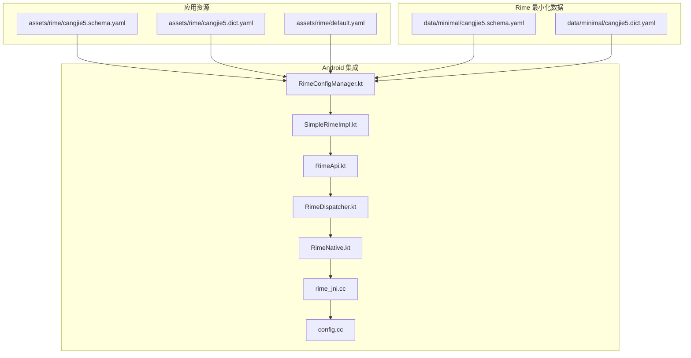
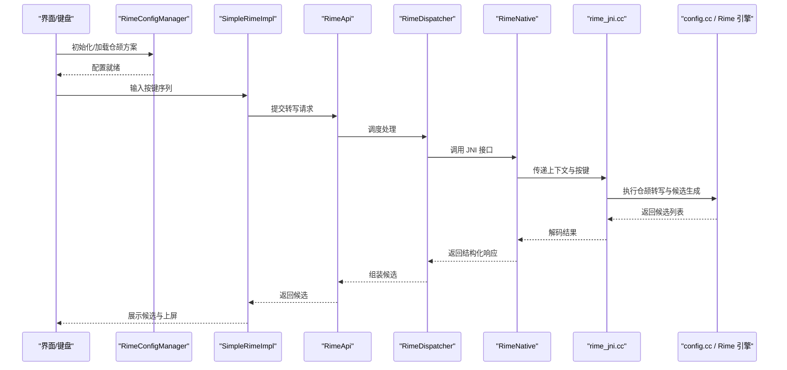
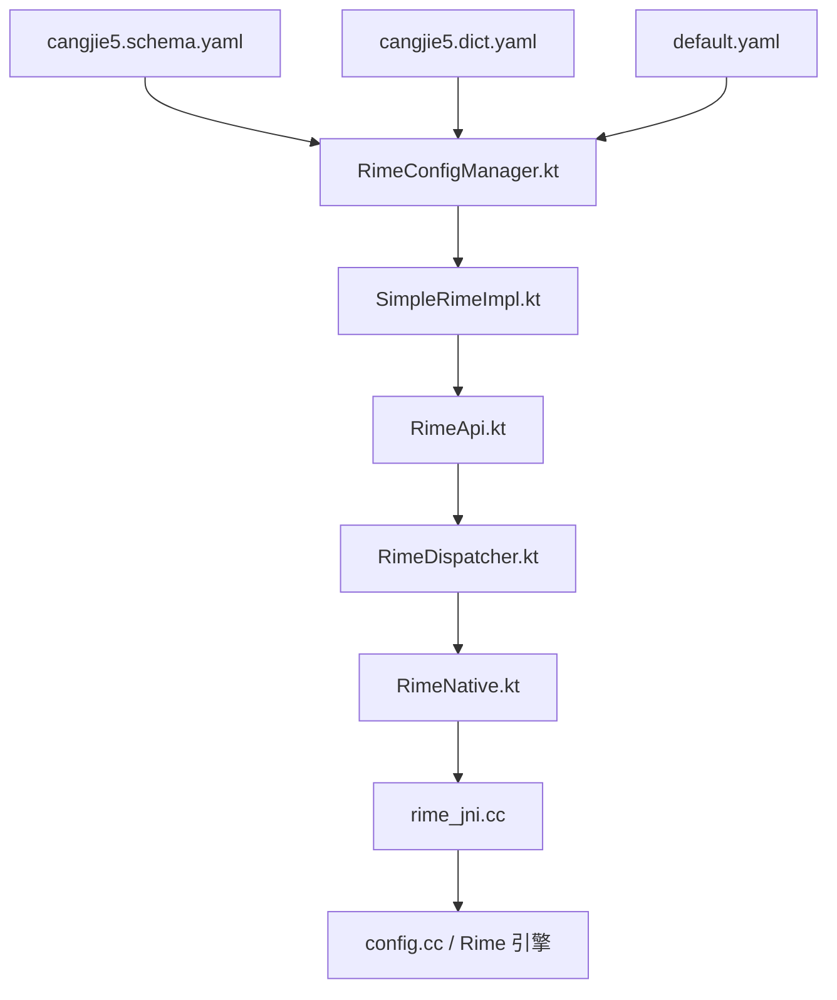

# 仓颉方案配置

<cite>
**本文引用的文件**   
- [cangjie5.schema.yaml](file://app/src/main/assets/rime/cangjie5.schema.yaml)
- [cangjie5.dict.yaml](file://app/src/main/assets/rime/cangjie5.dict.yaml)
- [default.yaml](file://app/src/main/assets/rime/default.yaml)
- [cangjie5.schema.yaml（最小化）](file://librime-prebuilt/librime/data/minimal/cangjie5.schema.yaml)
- [cangjie5.dict.yaml（最小化）](file://librime-prebuilt/librime/data/minimal/cangjie5.dict.yaml)
- [RimeConfigManager.kt](file://app/src/main/java/com/ziyou/ime/config/RimeConfigManager.kt)
- [SimpleRimeImpl.kt](file://app/src/main/java/com/ziyou/ime/core/SimpleRimeImpl.kt)
- [RimeApi.kt](file://app/src/main/java/com/ziyou/ime/core/RimeApi.kt)
- [RimeDispatcher.kt](file://app/src/main/java/com/ziyou/ime/core/RimeDispatcher.kt)
- [RimeNative.kt](file://app/src/main/java/com/ziyou/ime/core/RimeNative.kt)
- [rime_jni.cc](file://app/src/main/jni/librime_jni/rime_jni.cc)
- [config.cc](file://app/src/main/jni/librime_jni/config.cc)
</cite>

## 目录
1. [简介](#简介)
2. [项目结构](#项目结构)
3. [核心组件](#核心组件)
4. [架构总览](#架构总览)
5. [详细组件分析](#详细组件分析)
6. [依赖关系分析](#依赖关系分析)
7. [性能考虑](#性能考虑)
8. [故障排查指南](#故障排查指南)
9. [结论](#结论)
10. [附录](#附录)

## 简介
本文件面向仓颉输入法方案的配置与定制，重点围绕 cangjie5.schema.yaml 的结构与语义，系统解释仓颉编码规则、字根映射表、候选词选择机制，以及简码、容错输入、智能纠错等高级特性。同时给出在 Android 端 Rime 集成中的调试方法与性能优化建议，并提供定制化与扩展开发指南，帮助开发者快速搭建并优化仓颉输入体验。

## 项目结构
本项目在 assets/rime 目录下提供仓颉方案的 schema 与字典，并在 librime 最小化数据中保留一份参考实现。Android 侧通过 Kotlin 封装的 Rime API 与 JNI 层调用底层引擎，完成配置加载、转写与候选生成。

图表来源
- [cangjie5.schema.yaml](file://app/src/main/assets/rime/cangjie5.schema.yaml)
- [cangjie5.dict.yaml](file://app/src/main/assets/rime/cangjie5.dict.yaml)
- [default.yaml](file://app/src/main/assets/rime/default.yaml)
- [cangjie5.schema.yaml（最小化）](file://librime-prebuilt/librime/data/minimal/cangjie5.schema.yaml)
- [cangjie5.dict.yaml（最小化）](file://librime-prebuilt/librime/data/minimal/cangjie5.dict.yaml)
- [RimeConfigManager.kt](file://app/src/main/java/com/ziyou/ime/config/RimeConfigManager.kt)
- [SimpleRimeImpl.kt](file://app/src/main/java/com/ziyou/ime/core/SimpleRimeImpl.kt)
- [RimeApi.kt](file://app/src/main/java/com/ziyou/ime/core/RimeApi.kt)
- [RimeDispatcher.kt](file://app/src/main/java/com/ziyou/ime/core/RimeDispatcher.kt)
- [RimeNative.kt](file://app/src/main/java/com/ziyou/ime/core/RimeNative.kt)
- [rime_jni.cc](file://app/src/main/jni/librime_jni/rime_jni.cc)
- [config.cc](file://app/src/main/jni/librime_jni/config.cc)

章节来源
- [cangjie5.schema.yaml](file://app/src/main/assets/rime/cangjie5.schema.yaml)
- [cangjie5.dict.yaml](file://app/src/main/assets/rime/cangjie5.dict.yaml)
- [default.yaml](file://app/src/main/assets/rime/default.yaml)
- [cangjie5.schema.yaml（最小化）](file://librime-prebuilt/librime/data/minimal/cangjie5.schema.yaml)
- [cangjie5.dict.yaml（最小化）](file://librime-prebuilt/librime/data/minimal/cangjie5.dict.yaml)
- [RimeConfigManager.kt](file://app/src/main/java/com/ziyou/ime/config/RimeConfigManager.kt)
- [SimpleRimeImpl.kt](file://app/src/main/java/com/ziyou/ime/core/SimpleRimeImpl.kt)
- [RimeApi.kt](file://app/src/main/java/com/ziyou/ime/core/RimeApi.kt)
- [RimeDispatcher.kt](file://app/src/main/java/com/ziyou/ime/core/RimeDispatcher.kt)
- [RimeNative.kt](file://app/src/main/java/com/ziyou/ime/core/RimeNative.kt)
- [rime_jni.cc](file://app/src/main/jni/librime_jni/rime_jni.cc)
- [config.cc](file://app/src/main/jni/librime_jni/config.cc)

## 核心组件
- 仓颉方案配置文件：定义仓颉编码规则、键位映射、候选排序策略、简码与容错开关等。
- 仓颉字典文件：维护仓颉编码到汉字的映射及权重，支撑候选生成与排序。
- 默认配置：全局行为（如键盘布局、标点、切换模式）由 default.yaml 统一控制。
- Android 集成层：RimeConfigManager 负责加载与合并配置；SimpleRimeImpl/RimeApi/RimeDispatcher 封装转写流程；JNI 层桥接原生 Rime。

章节来源
- [cangjie5.schema.yaml](file://app/src/main/assets/rime/cangjie5.schema.yaml)
- [cangjie5.dict.yaml](file://app/src/main/assets/rime/cangjie5.dict.yaml)
- [default.yaml](file://app/src/main/assets/rime/default.yaml)
- [RimeConfigManager.kt](file://app/src/main/java/com/ziyou/ime/config/RimeConfigManager.kt)
- [SimpleRimeImpl.kt](file://app/src/main/java/com/ziyou/ime/core/SimpleRimeImpl.kt)
- [RimeApi.kt](file://app/src/main/java/com/ziyou/ime/core/RimeApi.kt)
- [RimeDispatcher.kt](file://app/src/main/java/com/ziyou/ime/core/RimeDispatcher.kt)

## 架构总览
仓颉方案在 Android 端的整体调用链从 UI 触发按键开始，经 Kotlin 封装层进入 JNI，最终由 Rime 引擎根据 schema 与字典进行分词、转写与候选排序。

图表来源
- [RimeConfigManager.kt](file://app/src/main/java/com/ziyou/ime/config/RimeConfigManager.kt)
- [SimpleRimeImpl.kt](file://app/src/main/java/com/ziyou/ime/core/SimpleRimeImpl.kt)
- [RimeApi.kt](file://app/src/main/java/com/ziyou/ime/core/RimeApi.kt)
- [RimeDispatcher.kt](file://app/src/main/java/com/ziyou/ime/core/RimeDispatcher.kt)
- [RimeNative.kt](file://app/src/main/java/com/ziyou/ime/core/RimeNative.kt)
- [rime_jni.cc](file://app/src/main/jni/librime_jni/rime_jni.cc)
- [config.cc](file://app/src/main/jni/librime_jni/config.cc)

## 详细组件分析

### 仓颉方案配置文件（cangjie5.schema.yaml）
- 作用：定义仓颉输入法的“规则集”，包括键位映射、编码长度限制、候选排序策略、简码与容错开关、纠错策略等。
- 关键要点：
  - 键位映射：将物理按键映射为仓颉字根或功能键（如翻页、确认）。
  - 编码规则：限定最大编码长度、是否允许省略尾码、是否启用模糊匹配。
  - 候选排序：依据字典权重、历史使用频率、上下文相关性等进行排序。
  - 简码设置：为高频字根或常用词配置短码，提升输入效率。
  - 容错输入：支持近似字根或相邻键位的容错匹配。
  - 智能纠错：基于上下文与词典对误输进行自动修正。

章节来源
- [cangjie5.schema.yaml](file://app/src/main/assets/rime/cangjie5.schema.yaml)
- [cangjie5.schema.yaml（最小化）](file://librime-prebuilt/librime/data/minimal/cangjie5.schema.yaml)

### 仓颉字典（cangjie5.dict.yaml）
- 作用：维护仓颉编码到汉字/词语的映射与权重，是候选生成的基础数据源。
- 关键要点：
  - 编码-词条映射：每个仓颉编码对应一个或多个候选词条。
  - 权重与频率：影响候选排序，通常结合用户历史与通用语料。
  - 扩展性：可追加专业词汇、人名地名等以提升命中率。

章节来源
- [cangjie5.dict.yaml](file://app/src/main/assets/rime/cangjie5.dict.yaml)
- [cangjie5.dict.yaml（最小化）](file://librime-prebuilt/librime/data/minimal/cangjie5.dict.yaml)

### 默认配置（default.yaml）
- 作用：全局行为配置，如键盘布局、标点符号、中英文切换、主题与交互行为。
- 与仓颉的关系：为仓颉方案提供统一的输入环境与交互约定。

章节来源
- [default.yaml](file://app/src/main/assets/rime/default.yaml)

### Android 集成层
- RimeConfigManager：负责读取 assets/rime 下的 schema 与字典，合并默认配置，确保仓颉方案可用。
- SimpleRimeImpl/RimeApi/RimeDispatcher：封装转写流程，屏蔽 JNI 细节，向上提供简洁 API。
- RimeNative/rime_jni.cc/config.cc：桥接 Kotlin 与原生 Rime，执行实际的转写与候选生成。

章节来源
- [RimeConfigManager.kt](file://app/src/main/java/com/ziyou/ime/config/RimeConfigManager.kt)
- [SimpleRimeImpl.kt](file://app/src/main/java/com/ziyou/ime/core/SimpleRimeImpl.kt)
- [RimeApi.kt](file://app/src/main/java/com/ziyou/ime/core/RimeApi.kt)
- [RimeDispatcher.kt](file://app/src/main/java/com/ziyou/ime/core/RimeDispatcher.kt)
- [RimeNative.kt](file://app/src/main/java/com/ziyou/ime/core/RimeNative.kt)
- [rime_jni.cc](file://app/src/main/jni/librime_jni/rime_jni.cc)
- [config.cc](file://app/src/main/jni/librime_jni/config.cc)

### 仓颉编码规则与候选选择机制
- 编码规则：
  - 字根映射：按键到仓颉字根的映射决定编码序列。
  - 长度限制：限制最大编码长度，避免过长导致候选发散。
  - 容错与纠错：开启后允许近似匹配与自动修正，提高鲁棒性。
- 候选选择：
  - 字典权重：高权重词条优先。
  - 历史频率：用户常用词优先。
  - 上下文相关：结合前文语境提升命中概率。

章节来源
- [cangjie5.schema.yaml](file://app/src/main/assets/rime/cangjie5.schema.yaml)
- [cangjie5.dict.yaml](file://app/src/main/assets/rime/cangjie5.dict.yaml)

### 键盘布局与五笔字型配置
- 键盘布局：在 default.yaml 中定义按键分布与功能键（如翻页、确认），与仓颉字根映射配合。
- 五笔字型配置：若需兼容五笔字型，可在 schema 中增加额外映射与规则，但仓颉方案以仓颉为主。

章节来源
- [default.yaml](file://app/src/main/assets/rime/default.yaml)
- [cangjie5.schema.yaml](file://app/src/main/assets/rime/cangjie5.schema.yaml)

### 简码设置、容错输入与智能纠错
- 简码设置：为高频字根或常用词配置短码，减少按键次数。
- 容错输入：允许相邻键位或近似字根输入，降低误击影响。
- 智能纠错：基于上下文与词典自动修正错误编码，提升输入流畅度。

章节来源
- [cangjie5.schema.yaml](file://app/src/main/assets/rime/cangjie5.schema.yaml)

### 调试工具使用方法
- 日志输出：在 JNI 与 Kotlin 层添加日志，观察转写过程与候选变化。
- 配置热更新：通过 RimeConfigManager 动态重载 schema 与字典，验证改动效果。
- 单元测试：针对编码映射与候选排序编写用例，确保稳定性。

章节来源
- [RimeConfigManager.kt](file://app/src/main/java/com/ziyou/ime/config/RimeConfigManager.kt)
- [SimpleRimeImpl.kt](file://app/src/main/java/com/ziyou/ime/core/SimpleRimeImpl.kt)
- [RimeApi.kt](file://app/src/main/java/com/ziyou/ime/core/RimeApi.kt)
- [RimeDispatcher.kt](file://app/src/main/java/com/ziyou/ime/core/RimeDispatcher.kt)
- [rime_jni.cc](file://app/src/main/jni/librime_jni/rime_jni.cc)
- [config.cc](file://app/src/main/jni/librime_jni/config.cc)

### 性能优化建议
- 字典压缩：减小字典体积，提升加载速度。
- 缓存策略：对常用编码与候选进行缓存，减少重复计算。
- 异步处理：将耗时操作放入后台线程，避免阻塞 UI。
- 合理阈值：调整容错与纠错阈值，平衡准确率与响应速度。

章节来源
- [cangjie5.dict.yaml](file://app/src/main/assets/rime/cangjie5.dict.yaml)
- [RimeConfigManager.kt](file://app/src/main/java/com/ziyou/ime/config/RimeConfigManager.kt)
- [SimpleRimeImpl.kt](file://app/src/main/java/com/ziyou/ime/core/SimpleRimeImpl.kt)

### 定制化配置与扩展开发指南
- 自定义字根映射：修改 schema 中的键位映射，适配不同键盘布局。
- 扩展词典：追加专业词汇、术语与热词，提升命中率。
- 插件机制：利用 Rime 插件体系扩展功能（如预测、上下文翻译）。
- 版本管理：通过 default.yaml 统一管理全局行为，便于多方案共存。

章节来源
- [cangjie5.schema.yaml](file://app/src/main/assets/rime/cangjie5.schema.yaml)
- [cangjie5.dict.yaml](file://app/src/main/assets/rime/cangjie5.dict.yaml)
- [default.yaml](file://app/src/main/assets/rime/default.yaml)

## 依赖关系分析
仓颉方案依赖 Android 集成层与 Rime 引擎，schema 与字典作为核心数据源，共同决定输入体验。

图表来源
- [cangjie5.schema.yaml](file://app/src/main/assets/rime/cangjie5.schema.yaml)
- [cangjie5.dict.yaml](file://app/src/main/assets/rime/cangjie5.dict.yaml)
- [default.yaml](file://app/src/main/assets/rime/default.yaml)
- [RimeConfigManager.kt](file://app/src/main/java/com/ziyou/ime/config/RimeConfigManager.kt)
- [SimpleRimeImpl.kt](file://app/src/main/java/com/ziyou/ime/core/SimpleRimeImpl.kt)
- [RimeApi.kt](file://app/src/main/java/com/ziyou/ime/core/RimeApi.kt)
- [RimeDispatcher.kt](file://app/src/main/java/com/ziyou/ime/core/RimeDispatcher.kt)
- [RimeNative.kt](file://app/src/main/java/com/ziyou/ime/core/RimeNative.kt)
- [rime_jni.cc](file://app/src/main/jni/librime_jni/rime_jni.cc)
- [config.cc](file://app/src/main/jni/librime_jni/config.cc)

章节来源
- [cangjie5.schema.yaml](file://app/src/main/assets/rime/cangjie5.schema.yaml)
- [cangjie5.dict.yaml](file://app/src/main/assets/rime/cangjie5.dict.yaml)
- [default.yaml](file://app/src/main/assets/rime/default.yaml)
- [RimeConfigManager.kt](file://app/src/main/java/com/ziyou/ime/config/RimeConfigManager.kt)
- [SimpleRimeImpl.kt](file://app/src/main/java/com/ziyou/ime/core/SimpleRimeImpl.kt)
- [RimeApi.kt](file://app/src/main/java/com/ziyou/ime/core/RimeApi.kt)
- [RimeDispatcher.kt](file://app/src/main/java/com/ziyou/ime/core/RimeDispatcher.kt)
- [RimeNative.kt](file://app/src/main/java/com/ziyou/ime/core/RimeNative.kt)
- [rime_jni.cc](file://app/src/main/jni/librime_jni/rime_jni.cc)
- [config.cc](file://app/src/main/jni/librime_jni/config.cc)

## 性能考虑
- 字典体积与加载时间：压缩与增量加载可显著改善启动速度。
- 候选排序开销：合理使用缓存与阈值，避免频繁重算。
- 内存占用：控制缓存大小，及时释放无用对象。
- 线程模型：将耗时任务下沉至后台，保证 UI 流畅。

[本节为通用指导，不直接分析具体文件]

## 故障排查指南
- 配置未生效：检查 RimeConfigManager 是否正确加载 schema 与字典。
- 候选异常：核对 cangjie5.dict.yaml 的映射与权重。
- 崩溃或卡顿：查看 JNI 层日志，定位 rime_jni.cc 与 config.cc 的问题。
- 容错过度：调整 schema 中的容错阈值，避免误匹配。

章节来源
- [RimeConfigManager.kt](file://app/src/main/java/com/ziyou/ime/config/RimeConfigManager.kt)
- [cangjie5.dict.yaml](file://app/src/main/assets/rime/cangjie5.dict.yaml)
- [rime_jni.cc](file://app/src/main/jni/librime_jni/rime_jni.cc)
- [config.cc](file://app/src/main/jni/librime_jni/config.cc)

## 结论
通过合理配置 cangjie5.schema.yaml 与 cangjie5.dict.yaml，并结合 Android 集成层的优化，可实现高效、稳定且易定制的仓颉输入法方案。建议在迭代过程中持续监控性能与用户体验，逐步完善简码、容错与纠错策略。

[本节为总结性内容，不直接分析具体文件]

## 附录
- 常见配置项说明：
  - 编码长度限制：控制最大输入长度，避免候选发散。
  - 简码映射：为高频字根配置短码，提升输入效率。
  - 容错阈值：调节近似匹配的宽松程度。
  - 纠错策略：基于上下文与词典自动修正错误。
- 扩展开发建议：
  - 使用插件机制扩展功能。
  - 通过 default.yaml 统一管理全局行为。
  - 定期更新词典与热词，提升命中率。

[本节为补充信息，不直接分析具体文件]