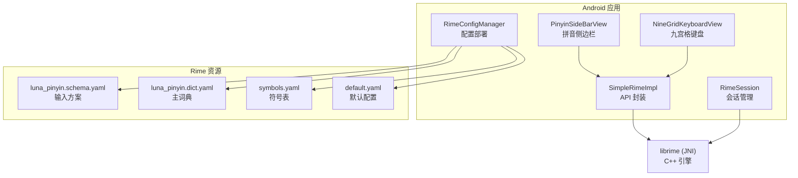
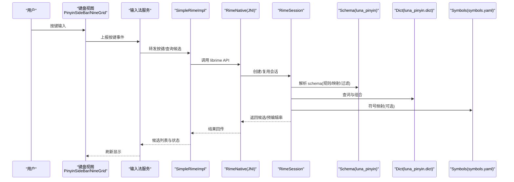
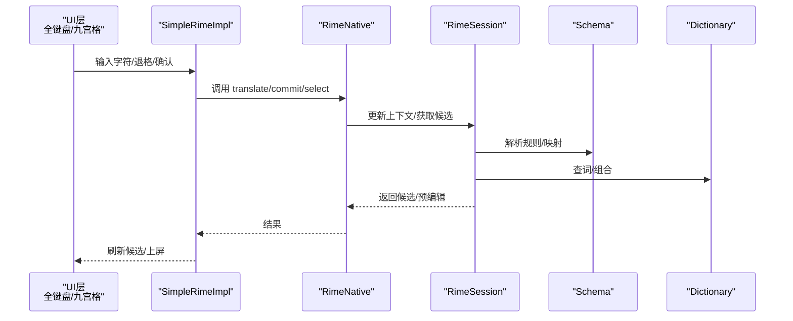
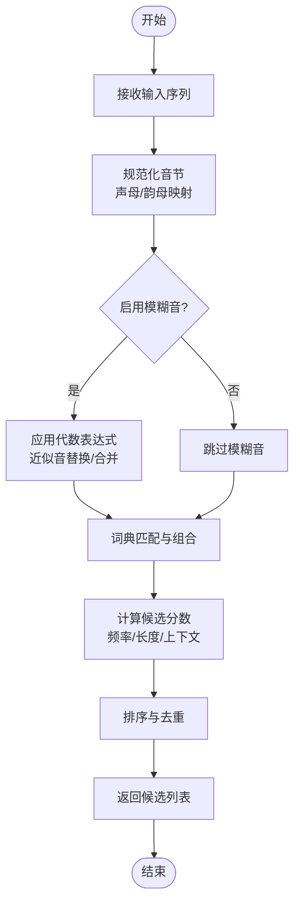
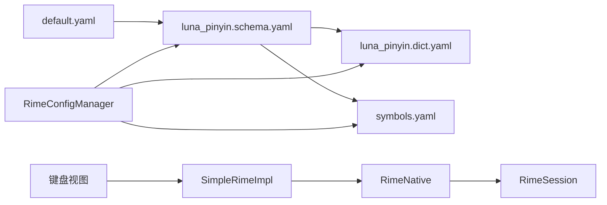

# 拼音方案配置

<cite>
**本文引用的文件**   
- [luna_pinyin.schema.yaml](file://app/src/main/assets/rime/luna_pinyin.schema.yaml)
- [luna_pinyin.dict.yaml](file://app/src/main/assets/rime/luna_pinyin.dict.yaml)
- [symbols.yaml](file://app/src/main/assets/rime/symbols.yaml)
- [default.yaml](file://app/src/main/assets/rime/default.yaml)
- [RimeConfigManager.kt](file://app/src/main/java/com/ziyou/ime/config/RimeConfigManager.kt)
- [SimpleRimeImpl.kt](file://app/src/main/java/com/ziyou/ime/core/SimpleRimeImpl.kt)
- [RimeNative.kt](file://app/src/main/java/com/ziyou/ime/core/RimeNative.kt)
- [RimeSession.kt](file://app/src/main/java/com/ziyou/ime/daemon/RimeSession.kt)
- [PinyinSideBarView.kt](file://app/src/main/java/com/ziyou/ime/ime/PinyinSideBarView.kt)
- [NineGridKeyboardView.kt](file://app/src/main/java/com/ziyou/ime/ime/NineGridKeyboardView.kt)
- [T9PinYinUtils.kt](file://app/src/main/java/com/ziyou/ime/util/T9PinYinUtils.kt)
</cite>

## 目录
1. [简介](#简介)
2. [项目结构](#项目结构)
3. [核心组件](#核心组件)
4. [架构总览](#架构总览)
5. [详细组件分析](#详细组件分析)
6. [依赖关系分析](#依赖关系分析)
7. [性能考量](#性能考量)
8. [故障排查指南](#故障排查指南)
9. [结论](#结论)
10. [附录](#附录)

## 简介
本文件面向使用与定制 Rime 拼音输入方案的开发者与高级用户，围绕 luna_pinyin.schema.yaml 的配置结构进行系统化说明。内容涵盖：
- 拼音输入规则、声母韵母映射表、音调处理与模糊音设置
- 智能组词、候选词排序策略与自定义词典集成
- 键盘映射、特殊符号输入与快捷操作
- 调试方法、性能优化技巧与常见问题解决方案
- 定制化最佳实践与扩展指南

## 项目结构
本项目将 Rime 的 schema 与字典资源以 assets 形式打包进 Android 应用，并在运行时通过 JNI 调用 librime 引擎完成分词、翻译与候选生成。关键路径如下：
- app/src/main/assets/rime: 存放 Rime 配置文件（schema、dict、symbols、默认配置等）
- app/src/main/java/.../config: 负责部署与更新 Rime 配置
- app/src/main/java/.../core: 封装 Rime API 与 JNI 交互
- app/src/main/java/.../daemon: 管理 Rime Session 生命周期
- app/src/main/java/.../ime: 输入法 UI 与键盘视图（含拼音侧边栏、九宫格）
- app/src/main/java/.../util: 工具类（如 T9 拼音辅助）

**图示来源** 
- [RimeConfigManager.kt](file://app/src/main/java/com/ziyou/ime/config/RimeConfigManager.kt)
- [SimpleRimeImpl.kt](file://app/src/main/java/com/ziyou/ime/core/SimpleRimeImpl.kt)
- [RimeSession.kt](file://app/src/main/java/com/ziyou/ime/daemon/RimeSession.kt)
- [luna_pinyin.schema.yaml](file://app/src/main/assets/rime/luna_pinyin.schema.yaml)
- [luna_pinyin.dict.yaml](file://app/src/main/assets/rime/luna_pinyin.dict.yaml)
- [symbols.yaml](file://app/src/main/assets/rime/symbols.yaml)
- [default.yaml](file://app/src/main/assets/rime/default.yaml)

**章节来源**
- [RimeConfigManager.kt](file://app/src/main/java/com/ziyou/ime/config/RimeConfigManager.kt)
- [SimpleRimeImpl.kt](file://app/src/main/java/com/ziyou/ime/core/SimpleRimeImpl.kt)
- [RimeSession.kt](file://app/src/main/java/com/ziyou/ime/daemon/RimeSession.kt)

## 核心组件
- 输入方案定义：luna_pinyin.schema.yaml 描述拼音输入规则、键位映射、翻译器链、过滤器与排序策略。
- 词典数据：luna_pinyin.dict.yaml 提供基础词汇与频率信息；可叠加用户自定义词典。
- 符号表：symbols.yaml 定义特殊符号与快捷输入。
- 默认配置：default.yaml 提供全局开关与行为参数。
- 配置部署：RimeConfigManager 负责将 assets 中的资源部署到 Rime 工作目录并触发重载。
- 引擎封装：SimpleRimeImpl 与 RimeNative 封装 JNI 调用，暴露选词、提交、上下文管理等接口。
- 会话管理：RimeSession 维护单个输入会话的生命周期与状态。
- 输入界面：PinyinSideBarView 与 NineGridKeyboardView 分别支持全键盘与九宫格输入。

**章节来源**
- [luna_pinyin.schema.yaml](file://app/src/main/assets/rime/luna_pinyin.schema.yaml)
- [luna_pinyin.dict.yaml](file://app/src/main/assets/rime/luna_pinyin.dict.yaml)
- [symbols.yaml](file://app/src/main/assets/rime/symbols.yaml)
- [default.yaml](file://app/src/main/assets/rime/default.yaml)
- [RimeConfigManager.kt](file://app/src/main/java/com/ziyou/ime/config/RimeConfigManager.kt)
- [SimpleRimeImpl.kt](file://app/src/main/java/com/ziyou/ime/core/SimpleRimeImpl.kt)
- [RimeNative.kt](file://app/src/main/java/com/ziyou/ime/core/RimeNative.kt)
- [RimeSession.kt](file://app/src/main/java/com/ziyou/ime/daemon/RimeSession.kt)
- [PinyinSideBarView.kt](file://app/src/main/java/com/ziyou/ime/ime/PinyinSideBarView.kt)
- [NineGridKeyboardView.kt](file://app/src/main/java/com/ziyou/ime/ime/NineGridKeyboardView.kt)

## 架构总览
下图展示从用户按键到候选词生成的端到端流程，以及配置与资源在其中的作用。

**图示来源** 
- [SimpleRimeImpl.kt](file://app/src/main/java/com/ziyou/ime/core/SimpleRimeImpl.kt)
- [RimeNative.kt](file://app/src/main/java/com/ziyou/ime/core/RimeNative.kt)
- [RimeSession.kt](file://app/src/main/java/com/ziyou/ime/daemon/RimeSession.kt)
- [luna_pinyin.schema.yaml](file://app/src/main/assets/rime/luna_pinyin.schema.yaml)
- [luna_pinyin.dict.yaml](file://app/src/main/assets/rime/luna_pinyin.dict.yaml)
- [symbols.yaml](file://app/src/main/assets/rime/symbols.yaml)

## 详细组件分析

### luna_pinyin.schema.yaml 结构与字段说明
该文件是拼音输入方案的核心，通常包含以下关键段落与含义：
- 名称与版本：标识方案名与版本，便于切换与升级。
- 键位映射（key_binder）：定义字母、数字、标点与功能键的行为，如翻页、上屏、切换中英等。
- 输入规则（speller）：
  - initials/finals：声母与韵母的映射与别名，用于规范化输入。
  - algebra：代数表达式，实现模糊音、去重、合并、转换等。
- 翻译器链（translators）：
  - table_translator：基于词典的查词与候选生成。
  - history_translator：历史词频提升。
  - context_translator：上下文联想。
  - punctuator：标点符号映射。
  - matcher/recognizer：识别模式（如英文、数字、日期）。
- 过滤器（filters）：
  - uniquifier：去重。
  - single_char_filter：单字优先。
  - reverse_lookup_filter：反查（如五笔反查）。
  - simplifier/opencc：繁简转换。
- 排序与权重（menu/candidate_preparer）：控制候选排序策略、频率权重、长度惩罚等。
- 用户词典与预设词库：指定用户词典路径与加载顺序，支持增量学习。

建议阅读以下位置以了解具体字段与用法：
- [luna_pinyin.schema.yaml](file://app/src/main/assets/rime/luna_pinyin.schema.yaml)

**章节来源**
- [luna_pinyin.schema.yaml](file://app/src/main/assets/rime/luna_pinyin.schema.yaml)

### 拼音输入规则、声母韵母映射与模糊音
- 声母/韵母映射：通过 initials 与 finals 定义标准与别名，确保不同方言或习惯输入的兼容。
- 模糊音：在 algebra 中配置近似音替换（如 n/l、z/zh、c/ch 等），提高容错率。
- 音节拆分与合并：利用 algebra 表达式对多音节输入进行归一化，减少歧义。
- 音调处理：可通过转换器或过滤器启用音调标记与去除，影响候选排序与匹配精度。

参考位置：
- [luna_pinyin.schema.yaml](file://app/src/main/assets/rime/luna_pinyin.schema.yaml)

**章节来源**
- [luna_pinyin.schema.yaml](file://app/src/main/assets/rime/luna_pinyin.schema.yaml)

### 智能组词、候选排序与自定义词典
- 智能组词：table_translator 结合历史与上下文翻译器，动态生成短语候选。
- 候选排序：menu 与 candidate_preparer 控制频率、长度、最近使用等权重，平衡“常用优先”与“新鲜度”。
- 自定义词典：通过 user_dict 与 preset_vocabulary 加载用户词库，支持增量写入与热更新。

参考位置：
- [luna_pinyin.schema.yaml](file://app/src/main/assets/rime/luna_pinyin.schema.yaml)
- [luna_pinyin.dict.yaml](file://app/src/main/assets/rime/luna_pinyin.dict.yaml)

**章节来源**
- [luna_pinyin.schema.yaml](file://app/src/main/assets/rime/luna_pinyin.schema.yaml)
- [luna_pinyin.dict.yaml](file://app/src/main/assets/rime/luna_pinyin.dict.yaml)

### 键盘映射、特殊符号与快捷操作
- 键位绑定：key_binder 定义功能键（如空格上屏、逗号句号、Shift 切换、Ctrl+Space 切换方案）。
- 符号输入：punctuator 与 symbols.yaml 配合，支持快速插入标点、数学符号与表情。
- 快捷操作：通过 recognizer/matcher 识别特定前缀（如 #、@、$）进入数字、邮箱、URL 等模式。

参考位置：
- [luna_pinyin.schema.yaml](file://app/src/main/assets/rime/luna_pinyin.schema.yaml)
- [symbols.yaml](file://app/src/main/assets/rime/symbols.yaml)

**章节来源**
- [luna_pinyin.schema.yaml](file://app/src/main/assets/rime/luna_pinyin.schema.yaml)
- [symbols.yaml](file://app/src/main/assets/rime/symbols.yaml)

### 输入流程时序（全键盘与九宫格）
全键盘与九宫格在 UI 层不同，但都通过 SimpleRimeImpl 调用 librime 完成翻译与候选生成。

**图示来源** 
- [SimpleRimeImpl.kt](file://app/src/main/java/com/ziyou/ime/core/SimpleRimeImpl.kt)
- [RimeNative.kt](file://app/src/main/java/com/ziyou/ime/core/RimeNative.kt)
- [RimeSession.kt](file://app/src/main/java/com/ziyou/ime/daemon/RimeSession.kt)
- [luna_pinyin.schema.yaml](file://app/src/main/assets/rime/luna_pinyin.schema.yaml)
- [luna_pinyin.dict.yaml](file://app/src/main/assets/rime/luna_pinyin.dict.yaml)

**章节来源**
- [PinyinSideBarView.kt](file://app/src/main/java/com/ziyou/ime/ime/PinyinSideBarView.kt)
- [NineGridKeyboardView.kt](file://app/src/main/java/com/ziyou/ime/ime/NineGridKeyboardView.kt)
- [T9PinYinUtils.kt](file://app/src/main/java/com/ziyou/ime/util/T9PinYinUtils.kt)

### 算法流程图（模糊音与候选排序）

**图示来源** 
- [luna_pinyin.schema.yaml](file://app/src/main/assets/rime/luna_pinyin.schema.yaml)
- [luna_pinyin.dict.yaml](file://app/src/main/assets/rime/luna_pinyin.dict.yaml)

## 依赖关系分析
- 配置与资源依赖：schema 依赖 dict 与 symbols；default 提供全局开关。
- 运行时依赖：Android 层通过 SimpleRimeImpl 与 RimeNative 调用 librime；RimeSession 管理上下文。
- UI 依赖：键盘视图依赖 SimpleRimeImpl 提供的 API 进行输入与候选刷新。

**图示来源** 
- [luna_pinyin.schema.yaml](file://app/src/main/assets/rime/luna_pinyin.schema.yaml)
- [luna_pinyin.dict.yaml](file://app/src/main/assets/rime/luna_pinyin.dict.yaml)
- [symbols.yaml](file://app/src/main/assets/rime/symbols.yaml)
- [default.yaml](file://app/src/main/assets/rime/default.yaml)
- [RimeConfigManager.kt](file://app/src/main/java/com/ziyou/ime/config/RimeConfigManager.kt)
- [SimpleRimeImpl.kt](file://app/src/main/java/com/ziyou/ime/core/SimpleRimeImpl.kt)
- [RimeNative.kt](file://app/src/main/java/com/ziyou/ime/core/RimeNative.kt)
- [RimeSession.kt](file://app/src/main/java/com/ziyou/ime/daemon/RimeSession.kt)

**章节来源**
- [RimeConfigManager.kt](file://app/src/main/java/com/ziyou/ime/config/RimeConfigManager.kt)
- [SimpleRimeImpl.kt](file://app/src/main/java/com/ziyou/ime/core/SimpleRimeImpl.kt)
- [RimeNative.kt](file://app/src/main/java/com/ziyou/ime/core/RimeNative.kt)
- [RimeSession.kt](file://app/src/main/java/com/ziyou/ime/daemon/RimeSession.kt)

## 性能考量
- 词典规模与索引：合理划分主词典与用户词典，避免单次加载过大；必要时使用 LevelDB 或 Marisa 加速查找。
- 翻译器链优化：按需启用历史与上下文翻译器，减少不必要的计算开销。
- 模糊音与代数表达式：复杂表达式会增加匹配时间，建议精简与缓存中间结果。
- 候选排序权重：降低高频计算项（如长文本上下文）的频率，保证实时性。
- 内存与线程：避免在主线程执行重型 IO；合理复用 Session，减少创建销毁成本。

[本节为通用指导，不直接分析具体文件]

## 故障排查指南
- 配置未生效：检查 RimeConfigManager 是否正确部署 assets 到工作目录，并触发重载。
- 候选为空或异常：确认 luna_pinyin.dict.yaml 是否加载成功；检查 schema 中 translators 与 filters 的顺序。
- 模糊音无效：核对 algebra 表达式语法与优先级；验证 initials/finals 映射是否覆盖所有输入。
- 符号无法输入：检查 punctuator 与 symbols.yaml 的映射关系；确认 key_binder 未冲突。
- 性能卡顿：禁用非必要翻译器；简化 algebra；减少候选数量上限。

**章节来源**
- [RimeConfigManager.kt](file://app/src/main/java/com/ziyou/ime/config/RimeConfigManager.kt)
- [luna_pinyin.schema.yaml](file://app/src/main/assets/rime/luna_pinyin.schema.yaml)
- [luna_pinyin.dict.yaml](file://app/src/main/assets/rime/luna_pinyin.dict.yaml)
- [symbols.yaml](file://app/src/main/assets/rime/symbols.yaml)

## 结论
通过对 luna_pinyin.schema.yaml 的结构化分析与工程集成说明，可实现对拼音输入规则的精细控制与性能调优。结合自定义词典与智能组词，能够显著提升输入体验与效率。建议在迭代过程中持续监控候选质量与响应时延，逐步优化代数表达式与翻译器链。

[本节为总结性内容，不直接分析具体文件]

## 附录
- 常见配置项速查：
  - key_binder：功能键绑定
  - speller：声母/韵母映射与代数表达式
  - translators：翻译器链（table/history/context/punctuator）
  - filters：过滤器（去重/单字/反查/繁简）
  - menu/candidate_preparer：排序与权重
- 扩展建议：
  - 新增模糊音：在 algebra 中添加替换规则，并进行回归测试
  - 自定义词典：增量写入用户词典，观察候选变化
  - 符号扩展：在 symbols.yaml 中补充常用符号与快捷键

[本节为补充信息，不直接分析具体文件]