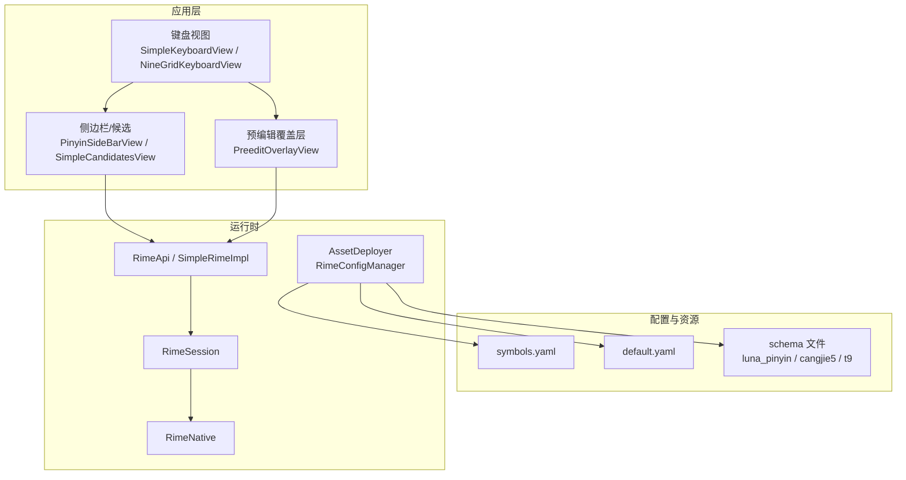
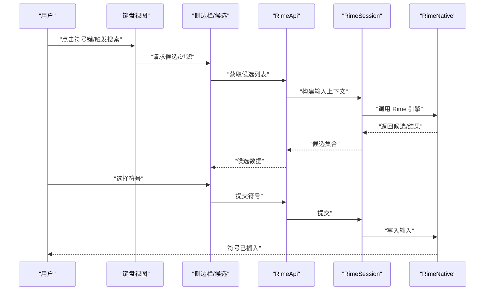
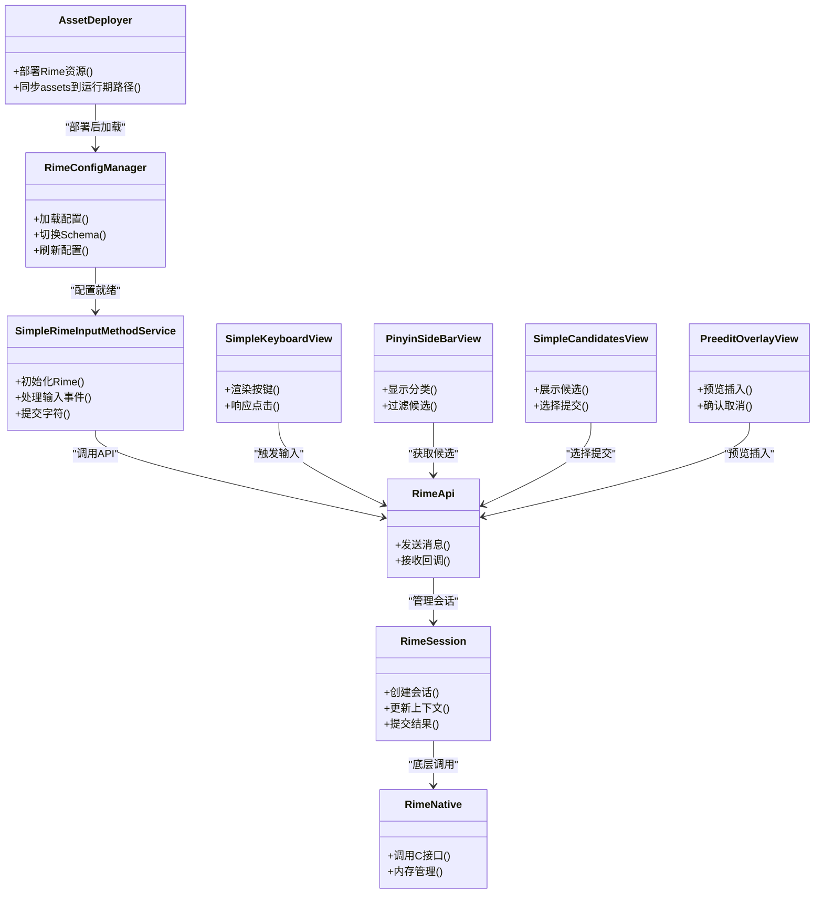

# 符号输入配置

<cite>
**本文引用的文件**   
- [symbols.yaml](file://app/src/main/assets/rime/symbols.yaml)
- [default.yaml](file://app/src/main/assets/rime/default.yaml)
- [luna_pinyin.schema.yaml](file://app/src/main/assets/rime/luna_pinyin.schema.yaml)
- [cangjie5.schema.yaml](file://app/src/main/assets/rime/cangjie5.schema.yaml)
- [t9.schema.yaml](file://app/src/main/assets/rime/t9.schema.yaml)
- [RimeConfigManager.kt](file://app/src/main/java/com/ziyou/ime/config/RimeConfigManager.kt)
- [AssetDeployer.kt](file://app/src/main/java/com/ziyou/ime/config/AssetDeployer.kt)
- [SideSymbol.kt](file://app/src/main/java/com/ziyou/ime/data/SideSymbol.kt)
- [SimpleKeyboardView.kt](file://app/src/main/java/com/ziyou/ime/ime/SimpleKeyboardView.kt)
- [NineGridKeyboardView.kt](file://app/src/main/java/com/ziyou/ime/ime/NineGridKeyboardView.kt)
- [BaseKeyboardView.kt](file://app/src/main/java/com/ziyou/ime/ime/BaseKeyboardView.kt)
- [PinyinSideBarView.kt](file://app/src/main/java/com/ziyou/ime/ime/PinyinSideBarView.kt)
- [SimpleCandidatesView.kt](file://app/src/main/java/com/ziyou/ime/ime/SimpleCandidatesView.kt)
- [PreeditOverlayView.kt](file://app/src/main/java/com/ziyou/ime/ime/PreeditOverlayView.kt)
- [KeyCode.kt](file://app/src/main/java/com/ziyou/ime/ime/KeyCode.kt)
- [KeyboardType.kt](file://app/src/main/java/com/ziyou/ime/ime/KeyboardType.kt)
- [SimpleRimeInputMethodService.kt](file://app/src/main/java/com/ziyou/ime/ime/SimpleRimeInputMethodService.kt)
- [RimeApi.kt](file://app/src/main/java/com/ziyou/ime/core/RimeApi.kt)
- [RimeDispatcher.kt](file://app/src/main/java/com/ziyou/ime/core/RimeDispatcher.kt)
- [RimeMessage.kt](file://app/src/main/java/com/ziyou/ime/core/RimeMessage.kt)
- [RimeNative.kt](file://app/src/main/java/com/ziyou/ime/core/RimeNative.kt)
- [SimpleRimeImpl.kt](file://app/src/main/java/com/ziyou/ime/core/SimpleRimeImpl.kt)
- [RimeSession.kt](file://app/src/main/java/com/ziyou/ime/daemon/RimeSession.kt)
</cite>

## 目录
1. [简介](#简介)
2. [项目结构](#项目结构)
3. [核心组件](#核心组件)
4. [架构总览](#架构总览)
5. [详细组件分析](#详细组件分析)
6. [依赖关系分析](#依赖关系分析)
7. [性能考量](#性能考量)
8. [故障排查指南](#故障排查指南)
9. [结论](#结论)
10. [附录](#附录)

## 简介
本文件围绕“符号输入配置”展开，重点解析 symbols.yaml 的结构与用法，涵盖符号分类、快捷键映射、自定义符号定义，以及数学符号、标点符号、特殊字符和表情符号的配置方法。同时说明符号输入的搜索、分类管理与快速插入机制，并提供符号库扩展、用户自定义添加、批量导入导出的实践建议与常用模板思路。

## 项目结构
本项目采用 Rime 输入法引擎作为底层能力，符号输入相关资源位于 assets/rime 目录下的 YAML 配置文件；Android 层通过 Kotlin 模块加载、部署并调用 Rime API，完成符号的展示、搜索与插入。

图表来源
- [symbols.yaml](file://app/src/main/assets/rime/symbols.yaml)
- [default.yaml](file://app/src/main/assets/rime/default.yaml)
- [luna_pinyin.schema.yaml](file://app/src/main/assets/rime/luna_pinyin.schema.yaml)
- [cangjie5.schema.yaml](file://app/src/main/assets/rime/cangjie5.schema.yaml)
- [t9.schema.yaml](file://app/src/main/assets/rime/t9.schema.yaml)
- [AssetDeployer.kt](file://app/src/main/java/com/ziyou/ime/config/AssetDeployer.kt)
- [RimeConfigManager.kt](file://app/src/main/java/com/ziyou/ime/config/RimeConfigManager.kt)
- [SimpleRimeInputMethodService.kt](file://app/src/main/java/com/ziyou/ime/ime/SimpleRimeInputMethodService.kt)
- [RimeApi.kt](file://app/src/main/java/com/ziyou/ime/core/RimeApi.kt)
- [RimeDispatcher.kt](file://app/src/main/java/com/ziyou/ime/core/RimeDispatcher.kt)
- [RimeMessage.kt](file://app/src/main/java/com/ziyou/ime/core/RimeMessage.kt)
- [RimeNative.kt](file://app/src/main/java/com/ziyou/ime/core/RimeNative.kt)
- [SimpleRimeImpl.kt](file://app/src/main/java/com/ziyou/ime/core/SimpleRimeImpl.kt)
- [RimeSession.kt](file://app/src/main/java/com/ziyou/ime/daemon/RimeSession.kt)

章节来源
- [symbols.yaml](file://app/src/main/assets/rime/symbols.yaml)
- [default.yaml](file://app/src/main/assets/rime/default.yaml)
- [luna_pinyin.schema.yaml](file://app/src/main/assets/rime/luna_pinyin.schema.yaml)
- [cangjie5.schema.yaml](file://app/src/main/assets/rime/cangjie5.schema.yaml)
- [t9.schema.yaml](file://app/src/main/assets/rime/t9.schema.yaml)
- [RimeConfigManager.kt](file://app/src/main/java/com/ziyou/ime/config/RimeConfigManager.kt)
- [AssetDeployer.kt](file://app/src/main/java/com/ziyou/ime/config/AssetDeployer.kt)

## 核心组件
- 符号配置中心：symbols.yaml 集中管理符号分组、键位映射、快捷输入与显示名称等元数据。
- 配置部署器：AssetDeployer 负责将 assets 中的 rime 资源部署到运行期路径，确保 Rime 能读取 symbols.yaml。
- 配置管理器：RimeConfigManager 提供对 Rime 配置的查询与更新能力（如切换 schema、刷新配置）。
- 键盘与候选：SimpleKeyboardView / NineGridKeyboardView 负责按键与界面交互；PinyinSideBarView / SimpleCandidatesView 负责符号候选列表与搜索过滤。
- 预编辑覆盖层：PreeditOverlayView 用于在输入框上方预览即将插入的符号或提示。
- Rime 运行时：RimeApi / SimpleRimeImpl / RimeSession / RimeNative 封装 Rime 引擎调用，处理输入上下文、候选生成与提交。

章节来源
- [RimeConfigManager.kt](file://app/src/main/java/com/ziyou/ime/config/RimeConfigManager.kt)
- [AssetDeployer.kt](file://app/src/main/java/com/ziyou/ime/config/AssetDeployer.kt)
- [SimpleKeyboardView.kt](file://app/src/main/java/com/ziyou/ime/ime/SimpleKeyboardView.kt)
- [NineGridKeyboardView.kt](file://app/src/main/java/com/ziyou/ime/ime/NineGridKeyboardView.kt)
- [PinyinSideBarView.kt](file://app/src/main/java/com/ziyou/ime/ime/PinyinSideBarView.kt)
- [SimpleCandidatesView.kt](file://app/src/main/java/com/ziyou/ime/ime/SimpleCandidatesView.kt)
- [PreeditOverlayView.kt](file://app/src/main/java/com/ziyou/ime/ime/PreeditOverlayView.kt)
- [RimeApi.kt](file://app/src/main/java/com/ziyou/ime/core/RimeApi.kt)
- [RimeDispatcher.kt](file://app/src/main/java/com/ziyou/ime/core/RimeDispatcher.kt)
- [RimeMessage.kt](file://app/src/main/java/com/ziyou/ime/core/RimeMessage.kt)
- [RimeNative.kt](file://app/src/main/java/com/ziyou/ime/core/RimeNative.kt)
- [SimpleRimeImpl.kt](file://app/src/main/java/com/ziyou/ime/core/SimpleRimeImpl.kt)
- [RimeSession.kt](file://app/src/main/java/com/ziyou/ime/daemon/RimeSession.kt)

## 架构总览
符号输入的整体流程从用户操作键盘或侧边栏开始，经过候选/搜索过滤，最终通过 Rime 引擎提交到目标文本框。

图表来源
- [SimpleKeyboardView.kt](file://app/src/main/java/com/ziyou/ime/ime/SimpleKeyboardView.kt)
- [PinyinSideBarView.kt](file://app/src/main/java/com/ziyou/ime/ime/PinyinSideBarView.kt)
- [SimpleCandidatesView.kt](file://app/src/main/java/com/ziyou/ime/ime/SimpleCandidatesView.kt)
- [RimeApi.kt](file://app/src/main/java/com/ziyou/ime/core/RimeApi.kt)
- [RimeSession.kt](file://app/src/main/java/com/ziyou/ime/daemon/RimeSession.kt)
- [RimeNative.kt](file://app/src/main/java/com/ziyou/ime/core/RimeNative.kt)

## 详细组件分析

### symbols.yaml 结构与字段说明
- 分组与分类
  - 使用分组键组织符号类别，例如数学、标点、特殊字符、表情等。每个分组下包含若干条目。
  - 分组可设置排序权重、显示名、是否默认可见等元信息，便于侧边栏与候选页的分类展示。
- 条目字段
  - 键位映射：支持单键或多键组合，用于快速插入对应符号。
  - 显示名/别名：用于搜索匹配与候选展示。
  - 内容：实际要插入的字符或字符串。
  - 标签/分类：用于筛选与聚合展示。
  - 优先级/频率：影响候选排序与推荐。
- 快捷键与搜索
  - 快捷键映射由键位字段决定，支持字母、数字与功能键组合。
  - 搜索基于显示名、别名、标签与内容关键字进行模糊匹配，提升查找效率。
- 自定义符号
  - 新增条目即可扩展符号库，无需修改代码。
  - 可通过批量导入导出工具维护大型符号集。

章节来源
- [symbols.yaml](file://app/src/main/assets/rime/symbols.yaml)

### 数学符号配置
- 分类建议：按运算、希腊字母、逻辑、集合、微积分等子分类组织。
- 键位设计：优先使用易记且不冲突的键位，必要时使用组合键。
- 搜索优化：为常见符号添加常用别名（如“加号”“等于”），提高检索命中率。
- 示例要点：
  - 为“∑”“∫”“π”“∈”“∀”等建立独立条目，标注用途与别名。
  - 对复杂表达式，可提供片段式插入（如“∑_{i=1}^{n}”）以提升效率。

章节来源
- [symbols.yaml](file://app/src/main/assets/rime/symbols.yaml)

### 标点符号配置
- 分类建议：中文标点、英文标点、全角/半角变体、引号与括号配对。
- 键位设计：常用标点直接映射到主键盘区，减少层级。
- 搜索优化：别名覆盖中英文描述（如“逗号”“comma”）。
- 示例要点：
  - “，”“.”“!”“?”“（）”“[]”“{}”等高频标点优先配置。
  - 成对标点支持自动补全与智能配对。

章节来源
- [symbols.yaml](file://app/src/main/assets/rime/symbols.yaml)

### 特殊字符配置
- 分类建议：货币、单位、箭头、几何、制表符、不可见字符等。
- 键位设计：结合业务场景，将专业领域常用字符置顶。
- 搜索优化：为“欧元”“美元”“摄氏度”等提供多语言别名。
- 示例要点：
  - “€”“$”“℃”“→”“△”“\t”“\n”等按需配置。
  - 对不可见字符提供可视化提示，避免误用。

章节来源
- [symbols.yaml](file://app/src/main/assets/rime/symbols.yaml)

### 表情符号配置
- 分类建议：人脸、动物、自然、物体、活动、旗帜等。
- 键位设计：表情通常不直接映射到物理键，更多依赖搜索与收藏。
- 搜索优化：为表情提供语义化别名（如“笑脸”“心形”“点赞”）。
- 示例要点：
  - 热门表情优先收录，支持收藏与最近使用排序。
  - 可按主题创建分组，便于快速定位。

章节来源
- [symbols.yaml](file://app/src/main/assets/rime/symbols.yaml)

### 搜索与分类管理
- 搜索策略
  - 关键词匹配：标题、别名、标签、内容均参与索引。
  - 模糊匹配：支持拼音、英文、中文混合检索。
  - 排序规则：频率、优先级、最近使用加权。
- 分类管理
  - 分组维度：按类型、主题、使用频率划分。
  - 动态分组：根据用户行为生成“常用”“最近”等虚拟组。
- 交互流程
  - 用户在侧边栏或候选页输入关键词，系统实时过滤并高亮匹配项。
  - 支持多选与批量插入（如连续选择多个符号一次性提交）。

章节来源
- [PinyinSideBarView.kt](file://app/src/main/java/com/ziyou/ime/ime/PinyinSideBarView.kt)
- [SimpleCandidatesView.kt](file://app/src/main/java/com/ziyou/ime/ime/SimpleCandidatesView.kt)
- [symbols.yaml](file://app/src/main/assets/rime/symbols.yaml)

### 快速插入机制
- 快捷键插入：通过键位映射直接插入，适合高频符号。
- 候选插入：从候选列表中选择，适合低频或长串符号。
- 片段插入：支持整段文本或模板（如公式片段）一次性插入。
- 预编辑预览：在插入前通过 PreeditOverlayView 预览效果，降低错误率。

章节来源
- [SimpleKeyboardView.kt](file://app/src/main/java/com/ziyou/ime/ime/SimpleKeyboardView.kt)
- [NineGridKeyboardView.kt](file://app/src/main/java/com/ziyou/ime/ime/NineGridKeyboardView.kt)
- [PreeditOverlayView.kt](file://app/src/main/java/com/ziyou/ime/ime/PreeditOverlayView.kt)
- [symbols.yaml](file://app/src/main/assets/rime/symbols.yaml)

### 符号库扩展与批量导入导出
- 扩展方式
  - 直接在 symbols.yaml 中新增分组与条目，或通过外部工具生成增量补丁。
  - 利用别名与标签体系实现跨语言检索与归类。
- 批量导入
  - 准备 CSV/TSV 文件，包含字段映射（键位、内容、别名、标签、优先级等）。
  - 通过脚本转换为 YAML 片段并合并至 symbols.yaml。
- 批量导出
  - 从 symbols.yaml 导出当前符号集，便于备份与分享。
  - 支持按分组或标签筛选导出。

章节来源
- [symbols.yaml](file://app/src/main/assets/rime/symbols.yaml)

### 最佳实践
- 命名规范
  - 分组名简洁明确，别名覆盖多语言与口语化表达。
  - 键位避免冲突，优先使用无冲突的单键或短组合。
- 组织结构
  - 高频符号靠前，低频符号归入二级分组。
  - 使用标签统一分类，便于搜索与统计。
- 性能优化
  - 控制单个分组条目数量，避免候选页过长。
  - 合理设置优先级与频率，提升命中速度。
- 可维护性
  - 使用版本化管理 symbols.yaml，记录变更原因。
  - 定期清理无用条目，保持库精简。

章节来源
- [symbols.yaml](file://app/src/main/assets/rime/symbols.yaml)

### 常用符号配置模板（思路）
- 数学模板
  - 分组：运算、希腊字母、逻辑、集合、微积分、线性代数。
  - 条目：基础运算符、常用常量、函数与符号、上下标模板。
- 标点模板
  - 分组：中文标点、英文标点、引号括号、分隔符。
  - 条目：逗号句号、问号感叹号、引号括号、省略号破折号。
- 特殊字符模板
  - 分组：货币单位、箭头几何、制表空白、不可见字符。
  - 条目：货币符号、单位符号、方向箭头、空格换行。
- 表情模板
  - 分组：人脸、动物、自然、物体、活动、旗帜。
  - 条目：热门表情、节日表情、行业相关表情。

章节来源
- [symbols.yaml](file://app/src/main/assets/rime/symbols.yaml)

## 依赖关系分析
符号输入涉及 Android 视图层、配置层与 Rime 引擎层的协作。下图展示了关键依赖关系。

图表来源
- [AssetDeployer.kt](file://app/src/main/java/com/ziyou/ime/config/AssetDeployer.kt)
- [RimeConfigManager.kt](file://app/src/main/java/com/ziyou/ime/config/RimeConfigManager.kt)
- [SimpleRimeInputMethodService.kt](file://app/src/main/java/com/ziyou/ime/ime/SimpleRimeInputMethodService.kt)
- [RimeApi.kt](file://app/src/main/java/com/ziyou/ime/core/RimeApi.kt)
- [RimeSession.kt](file://app/src/main/java/com/ziyou/ime/daemon/RimeSession.kt)
- [RimeNative.kt](file://app/src/main/java/com/ziyou/ime/core/RimeNative.kt)
- [SimpleKeyboardView.kt](file://app/src/main/java/com/ziyou/ime/ime/SimpleKeyboardView.kt)
- [PinyinSideBarView.kt](file://app/src/main/java/com/ziyou/ime/ime/PinyinSideBarView.kt)
- [SimpleCandidatesView.kt](file://app/src/main/java/com/ziyou/ime/ime/SimpleCandidatesView.kt)
- [PreeditOverlayView.kt](file://app/src/main/java/com/ziyou/ime/ime/PreeditOverlayView.kt)

章节来源
- [RimeApi.kt](file://app/src/main/java/com/ziyou/ime/core/RimeApi.kt)
- [RimeDispatcher.kt](file://app/src/main/java/com/ziyou/ime/core/RimeDispatcher.kt)
- [RimeMessage.kt](file://app/src/main/java/com/ziyou/ime/core/RimeMessage.kt)
- [RimeNative.kt](file://app/src/main/java/com/ziyou/ime/core/RimeNative.kt)
- [SimpleRimeImpl.kt](file://app/src/main/java/com/ziyou/ime/core/SimpleRimeImpl.kt)
- [RimeSession.kt](file://app/src/main/java/com/ziyou/ime/daemon/RimeSession.kt)

## 性能考量
- 候选列表分页与懒加载：避免一次性渲染大量符号导致卡顿。
- 搜索索引优化：对别名与标签建立倒排索引，提升匹配速度。
- 内存管理：符号条目尽量复用对象，减少 GC 压力。
- 异步处理：候选生成与过滤在后台线程执行，UI 线程仅做展示。
- 配置热更新：在不重启的情况下刷新 symbols.yaml 的变更。

[本节为通用指导，不涉及具体文件分析]

## 故障排查指南
- 符号未显示
  - 检查 symbols.yaml 语法是否正确，分组与条目字段是否完整。
  - 确认 AssetDeployer 已成功部署资源到运行期路径。
  - 查看 Rime 日志，确认候选生成是否正常。
- 搜索无效
  - 检查别名与标签是否配置正确。
  - 确认搜索关键词与索引字段匹配。
- 快捷键冲突
  - 调整键位映射，避免与其他功能冲突。
- 插入失败
  - 检查 RimeSession 上下文状态与提交流程。
  - 确认目标输入框支持文本插入。

章节来源
- [AssetDeployer.kt](file://app/src/main/java/com/ziyou/ime/config/AssetDeployer.kt)
- [RimeConfigManager.kt](file://app/src/main/java/com/ziyou/ime/config/RimeConfigManager.kt)
- [RimeSession.kt](file://app/src/main/java/com/ziyou/ime/daemon/RimeSession.kt)
- [RimeApi.kt](file://app/src/main/java/com/ziyou/ime/core/RimeApi.kt)

## 结论
通过 symbols.yaml 集中管理符号配置，结合 Android 视图与 Rime 引擎，可实现高效、灵活的符号输入体验。合理的分类、别名与键位设计能显著提升搜索与插入效率。借助批量导入导出与版本化管理，符号库可长期演进并保持高质量。

[本节为总结，不涉及具体文件分析]

## 附录
- 术语解释
  - 分组：符号的分类容器，便于组织与展示。
  - 条目：单个符号的定义，包含键位、内容与元数据。
  - 别名：用于搜索与展示的辅助名称。
  - 标签：用于筛选与聚合的分类标记。
- 参考文件
  - symbols.yaml：符号配置核心文件。
  - default.yaml：默认配置，可能包含全局开关与主题。
  - schema 文件：不同输入方案的配置，可能与符号输入联动。

章节来源
- [symbols.yaml](file://app/src/main/assets/rime/symbols.yaml)
- [default.yaml](file://app/src/main/assets/rime/default.yaml)
- [luna_pinyin.schema.yaml](file://app/src/main/assets/rime/luna_pinyin.schema.yaml)
- [cangjie5.schema.yaml](file://app/src/main/assets/rime/cangjie5.schema.yaml)
- [t9.schema.yaml](file://app/src/main/assets/rime/t9.schema.yaml)