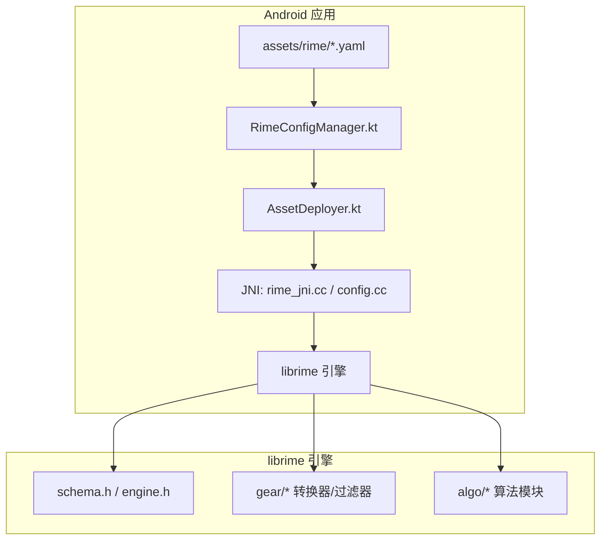
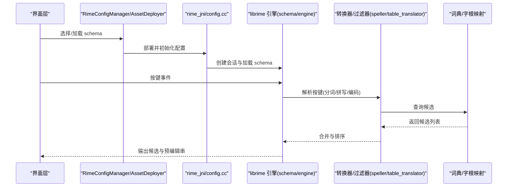
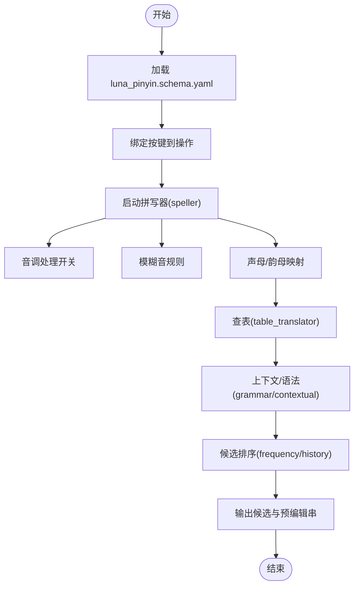
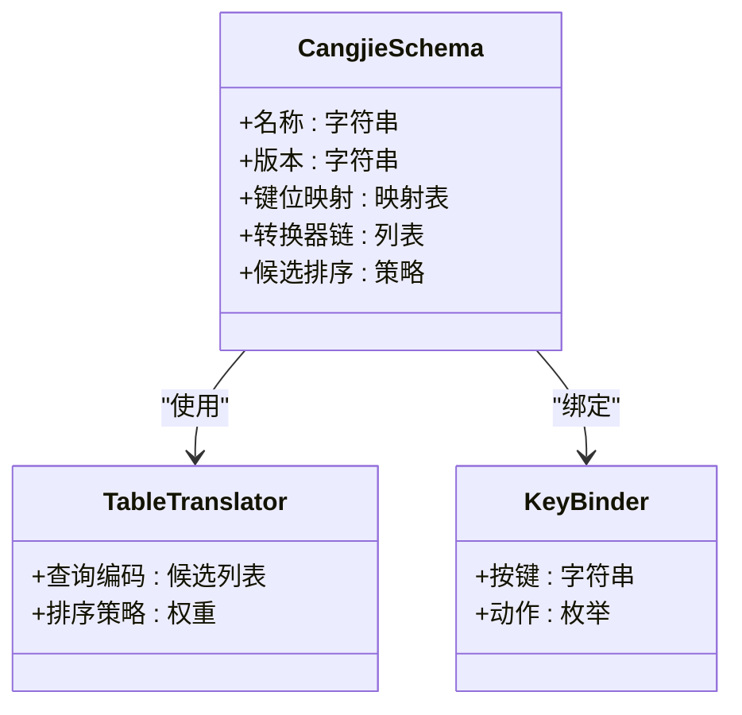
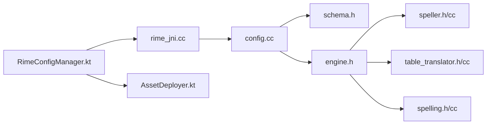

# 输入方案配置 (schema.yaml)

<cite>
**本文引用的文件**
- [luna_pinyin.schema.yaml](file://app/src/main/assets/rime/luna_pinyin.schema.yaml)
- [cangjie5.schema.yaml](file://app/src/main/assets/rime/cangjie5.schema.yaml)
- [t9.schema.yaml](file://app/src/main/assets/rime/t9.schema.yaml)
- [default.yaml](file://app/src/main/assets/rime/default.yaml)
- [symbols.yaml](file://app/src/main/assets/rime/symbols.yaml)
- [RimeConfigManager.kt](file://app/src/main/java/com/ziyou/ime/config/RimeConfigManager.kt)
- [AssetDeployer.kt](file://app/src/main/java/com/ziyou/ime/config/AssetDeployer.kt)
- [SimpleRimeImpl.kt](file://app/src/main/java/com/ziyou/ime/core/SimpleRimeImpl.kt)
- [rime_jni.cc](file://app/src/main/jni/librime_jni/rime_jni.cc)
- [config.cc](file://app/src/main/jni/librime_jni/config.cc)
- [spelling.h](file://librime-prebuilt/librime/src/rime/algo/spelling.h)
- [spelling.cc](file://librime-prebuilt/librime/src/rime/algo/spelling.cc)
- [table_translator.h](file://librime-prebuilt/librime/src/rime/gear/table_translator.h)
- [table_translator.cc](file://librime-prebuilt/librime/src/rime/gear/table_translator.cc)
- [speller.h](file://librime-prebuilt/librime/src/rime/gear/speller.h)
- [speller.cc](file://librime-prebuilt/librime/src/rime/gear/speller.cc)
- [key_binder.h](file://librime-prebuilt/librime/src/rime/gear/key_binder.h)
- [key_binder.cc](file://librime-prebuilt/librime/src/rime/gear/key_binder.cc)
- [grammar.h](file://librime-prebuilt/librime/src/rime/gear/grammar.h)
- [engine.h](file://librime-prebuilt/librime/src/rime/engine.h)
- [schema.h](file://librime-prebuilt/librime/src/rime/schema.h)
</cite>

## 目录
1. [简介](#简介)
2. [项目结构](#项目结构)
3. [核心组件](#核心组件)
4. [架构总览](#架构总览)
5. [详细组件分析](#详细组件分析)
6. [依赖关系分析](#依赖关系分析)
7. [性能考虑](#性能考虑)
8. [故障排查指南](#故障排查指南)
9. [结论](#结论)
10. [附录](#附录)

## 简介
本文件面向输入方案配置文件（schema.yaml）的深入说明，覆盖以下主题：
- 输入方案定义与整体结构
- 键盘映射规则与按键绑定
- 转换引擎配置（分词、拼写、查表、候选排序）
- 拼音方案的特殊配置项（声母韵母映射、音调处理、模糊音、智能组词）
- 仓颉方案的编码规则与字根映射
- 扩展机制（自定义转换器与过滤器）
- 不同输入方案的配置对比与迁移指南
- 调试工具与性能优化建议

本说明基于仓库中的 Rime 资源与 Android 集成代码，结合 librime 源码实现进行解读。

## 项目结构
Android 应用将 Rime 的资源文件置于 assets/rime 目录中，包含多个 schema 与字典、符号等配置文件；运行时通过 JNI 调用 librime，由 Java/Kotlin 层负责加载与部署。

图表来源
- [RimeConfigManager.kt](file://app/src/main/java/com/ziyou/ime/config/RimeConfigManager.kt)
- [AssetDeployer.kt](file://app/src/main/java/com/ziyou/ime/config/AssetDeployer.kt)
- [rime_jni.cc](file://app/src/main/jni/librime_jni/rime_jni.cc)
- [config.cc](file://app/src/main/jni/librime_jni/config.cc)
- [schema.h](file://librime-prebuilt/librime/src/rime/schema.h)
- [engine.h](file://librime-prebuilt/librime/src/rime/engine.h)

章节来源
- [RimeConfigManager.kt](file://app/src/main/java/com/ziyou/ime/config/RimeConfigManager.kt)
- [AssetDeployer.kt](file://app/src/main/java/com/ziyou/ime/config/AssetDeployer.kt)
- [rime_jni.cc](file://app/src/main/jni/librime_jni/rime_jni.cc)
- [config.cc](file://app/src/main/jni/librime_jni/config.cc)

## 核心组件
- 输入方案定义：每个 schema.yaml 描述一种输入法的“方案”，包括名称、键位、转换器链、候选排序策略等。
- 键盘映射：通过 key_binder 或类似组件将物理按键映射为逻辑操作（如上翻页、切换方案、确认候选）。
- 转换引擎：由 speller（拼写）、table_translator（查表）、script_translator（脚本）等组合而成，形成候选生成流水线。
- 候选排序：支持按频率、历史、语法、上下文等权重进行排序。
- 扩展点：可通过自定义 translator/filter 接入新的转换与过滤逻辑。

章节来源
- [luna_pinyin.schema.yaml](file://app/src/main/assets/rime/luna_pinyin.schema.yaml)
- [cangjie5.schema.yaml](file://app/src/main/assets/rime/cangjie5.schema.yaml)
- [t9.schema.yaml](file://app/src/main/assets/rime/t9.schema.yaml)
- [speller.h](file://librime-prebuilt/librime/src/rime/gear/speller.h)
- [table_translator.h](file://librime-prebuilt/librime/src/rime/gear/table_translator.h)
- [key_binder.h](file://librime-prebuilt/librime/src/rime/gear/key_binder.h)

## 架构总览
下图展示从用户按键到候选输出的关键流程，以及 schema 在各环节的作用。

图表来源
- [RimeConfigManager.kt](file://app/src/main/java/com/ziyou/ime/config/RimeConfigManager.kt)
- [AssetDeployer.kt](file://app/src/main/java/com/ziyou/ime/config/AssetDeployer.kt)
- [rime_jni.cc](file://app/src/main/jni/librime_jni/rime_jni.cc)
- [config.cc](file://app/src/main/jni/librime_jni/config.cc)
- [engine.h](file://librime-prebuilt/librime/src/rime/engine.h)
- [schema.h](file://librime-prebuilt/librime/src/rime/schema.h)
- [speller.h](file://librime-prebuilt/librime/src/rime/gear/speller.h)
- [table_translator.h](file://librime-prebuilt/librime/src/rime/gear/table_translator.h)

## 详细组件分析

### 拼音方案（luna_pinyin）
- 方案定义：名称、版本、作者、说明等元数据。
- 键盘映射：定义字母键、功能键（上/下翻页、空格确认、切换中英等）。
- 转换器链：通常包含 speller（拼写器）、translator（查表）、contextual_translation（上下文）、history（历史）等。
- 候选排序：可配置 frequency、user_history、grammar 等权重。
- 拼音特殊配置：
  - 声母/韵母映射：用于修正或扩展拼音识别（如 v/u 映射、方言音）。
  - 音调处理：是否保留/忽略音调字符，影响候选匹配与显示。
  - 模糊音：设置近似音替换规则（如 n/l、z/zh 等），提升容错率。
  - 智能组词：启用 grammar 或 contextual 模块，根据前后文动态调整候选顺序。

图表来源
- [luna_pinyin.schema.yaml](file://app/src/main/assets/rime/luna_pinyin.schema.yaml)
- [speller.h](file://librime-prebuilt/librime/src/rime/gear/speller.h)
- [speller.cc](file://librime-prebuilt/librime/src/rime/gear/speller.cc)
- [table_translator.h](file://librime-prebuilt/librime/src/rime/gear/table_translator.h)
- [table_translator.cc](file://librime-prebuilt/librime/src/rime/gear/table_translator.cc)
- [spelling.h](file://librime-prebuilt/librime/src/rime/algo/spelling.h)
- [spelling.cc](file://librime-prebuilt/librime/src/rime/algo/spelling.cc)

章节来源
- [luna_pinyin.schema.yaml](file://app/src/main/assets/rime/luna_pinyin.schema.yaml)
- [speller.h](file://librime-prebuilt/librime/src/rime/gear/speller.h)
- [speller.cc](file://librime-prebuilt/librime/src/rime/gear/speller.cc)
- [table_translator.h](file://librime-prebuilt/librime/src/rime/gear/table_translator.h)
- [table_translator.cc](file://librime-prebuilt/librime/src/rime/gear/table_translator.cc)
- [spelling.h](file://librime-prebuilt/librime/src/rime/algo/spelling.h)
- [spelling.cc](file://librime-prebuilt/librime/src/rime/algo/spelling.cc)

### 仓颉方案（cangjie5）
- 方案定义：仓颉五笔编码规则、字根映射、取码策略。
- 键盘映射：将字母键映射为仓颉字根（例如 A/I/U/E/O 等对应特定字根）。
- 转换器链：以 table_translator 为主，配合可能的 reverse_lookup（反查）或 punctuator（标点）。
- 候选排序：可按频率、历史、字形相似度等排序。
- 编码规则要点：
  - 字根映射：在 schema 或关联字典中定义字母到字根的映射。
  - 取码顺序：首码、次码、尾码的规则与截断策略。
  - 容错与纠错：可选的模糊匹配或近似字根。

图表来源
- [cangjie5.schema.yaml](file://app/src/main/assets/rime/cangjie5.schema.yaml)
- [table_translator.h](file://librime-prebuilt/librime/src/rime/gear/table_translator.h)
- [key_binder.h](file://librime-prebuilt/librime/src/rime/gear/key_binder.h)

章节来源
- [cangjie5.schema.yaml](file://app/src/main/assets/rime/cangjie5.schema.yaml)
- [table_translator.h](file://librime-prebuilt/librime/src/rime/gear/table_translator.h)
- [key_binder.h](file://librime-prebuilt/librime/src/rime/gear/key_binder.h)

### T9 九宫格方案（t9）
- 方案定义：针对数字键的拼音/英文混合输入。
- 键盘映射：数字键到字母集合的映射，结合长按、短按策略。
- 转换器链：可能包含 t9_speller、table_translator、punctuator。
- 候选排序：频率、历史、上下文等。

章节来源
- [t9.schema.yaml](file://app/src/main/assets/rime/t9.schema.yaml)

### 默认配置与符号（default.yaml、symbols.yaml）
- default.yaml：全局默认设置（如字体、候选数、快捷键等）。
- symbols.yaml：符号与表情映射，供各方案复用。

章节来源
- [default.yaml](file://app/src/main/assets/rime/default.yaml)
- [symbols.yaml](file://app/src/main/assets/rime/symbols.yaml)

## 依赖关系分析
- Android 层：RimeConfigManager 负责读取与部署 assets 中的 schema；AssetDeployer 将资源复制到运行目录；SimpleRimeImpl 封装 API 调用。
- JNI 层：rime_jni.cc 暴露接口给 Kotlin/Java；config.cc 处理配置加载与校验。
- librime 层：schema.h/engine.h 定义方案与引擎；gear/* 提供转换器与过滤器；algo/* 提供拼写与字符串算法。

图表来源
- [RimeConfigManager.kt](file://app/src/main/java/com/ziyou/ime/config/RimeConfigManager.kt)
- [AssetDeployer.kt](file://app/src/main/java/com/ziyou/ime/config/AssetDeployer.kt)
- [SimpleRimeImpl.kt](file://app/src/main/java/com/ziyou/ime/core/SimpleRimeImpl.kt)
- [rime_jni.cc](file://app/src/main/jni/librime_jni/rime_jni.cc)
- [config.cc](file://app/src/main/jni/librime_jni/config.cc)
- [schema.h](file://librime-prebuilt/librime/src/rime/schema.h)
- [engine.h](file://librime-prebuilt/librime/src/rime/engine.h)
- [speller.h](file://librime-prebuilt/librime/src/rime/gear/speller.h)
- [table_translator.h](file://librime-prebuilt/librime/src/rime/gear/table_translator.h)
- [spelling.h](file://librime-prebuilt/librime/src/rime/algo/spelling.h)

章节来源
- [RimeConfigManager.kt](file://app/src/main/java/com/ziyou/ime/config/RimeConfigManager.kt)
- [AssetDeployer.kt](file://app/src/main/java/com/ziyou/ime/config/AssetDeployer.kt)
- [SimpleRimeImpl.kt](file://app/src/main/java/com/ziyou/ime/core/SimpleRimeImpl.kt)
- [rime_jni.cc](file://app/src/main/jni/librime_jni/rime_jni.cc)
- [config.cc](file://app/src/main/jni/librime_jni/config.cc)
- [schema.h](file://librime-prebuilt/librime/src/rime/schema.h)
- [engine.h](file://librime-prebuilt/librime/src/rime/engine.h)
- [speller.h](file://librime-prebuilt/librime/src/rime/gear/speller.h)
- [table_translator.h](file://librime-prebuilt/librime/src/rime/gear/table_translator.h)
- [spelling.h](file://librime-prebuilt/librime/src/rime/algo/spelling.h)

## 性能考虑
- 候选排序权重：合理设置 frequency、user_history、grammar 的权重，避免过度计算导致卡顿。
- 模糊音与映射：模糊音规则过多会增加匹配开销，应谨慎启用。
- 词典规模：大型词典会增大内存占用与查询时间，建议按需裁剪或使用分层词典。
- 转换器链长度：减少不必要的转换器，缩短链路可降低延迟。
- 缓存与预热：对常用字根/拼音进行预热，提高首次响应速度。
- 线程与异步：在 Android 侧避免阻塞主线程，JNI 调用尽量批量处理。

[本节为通用指导，不直接分析具体文件]

## 故障排查指南
- 配置加载失败：检查 assets/rime 下的 schema 文件格式与路径是否正确；确认 AssetDeployer 已复制到运行目录。
- 按键无响应：核对 key_binder 映射是否与 schema 一致；验证按键事件是否传递到 librime。
- 候选为空：检查 table_translator 的词典路径与编码规则；确认 speller 的拼音/字根映射有效。
- 排序异常：调整候选排序权重；禁用部分过滤器定位问题。
- 性能问题：开启日志（若可用），观察转换器耗时；减少模糊音与复杂语法。

章节来源
- [RimeConfigManager.kt](file://app/src/main/java/com/ziyou/ime/config/RimeConfigManager.kt)
- [AssetDeployer.kt](file://app/src/main/java/com/ziyou/ime/config/AssetDeployer.kt)
- [rime_jni.cc](file://app/src/main/jni/librime_jni/rime_jni.cc)
- [config.cc](file://app/src/main/jni/librime_jni/config.cc)

## 结论
输入方案配置文件是 Rime 输入法的核心，通过 schema.yaml 统一描述方案元数据、键位映射、转换器链与候选排序。拼音与仓颉等不同方案在映射与规则上各有侧重，但都依托相同的引擎与扩展机制。借助 librime 的模块化设计，开发者可以灵活定制转换器与过滤器，满足多样化输入需求。在实际使用中，应关注性能与稳定性，合理配置模糊音、语法与排序权重，并通过调试工具持续优化体验。

[本节为总结性内容，不直接分析具体文件]

## 附录

### 不同输入方案的配置对比
- 拼音（luna_pinyin）：强调拼写器与模糊音、音调处理、智能组词。
- 仓颉（cangjie5）：强调字根映射与编码规则，查表为主。
- T9（t9）：强调数字键映射与九宫格交互。

章节来源
- [luna_pinyin.schema.yaml](file://app/src/main/assets/rime/luna_pinyin.schema.yaml)
- [cangjie5.schema.yaml](file://app/src/main/assets/rime/cangjie5.schema.yaml)
- [t9.schema.yaml](file://app/src/main/assets/rime/t9.schema.yaml)

### 迁移指南
- 从旧版 schema 迁移：保持键位与转换器链兼容，逐步引入新特性（如 grammar、contextual）。
- 跨平台迁移：确保 assets/rime 资源与 JNI 接口一致；验证 Android 部署流程。
- 自定义扩展：新增 translator/filter 时，需在 schema 中注册并配置参数。

章节来源
- [RimeConfigManager.kt](file://app/src/main/java/com/ziyou/ime/config/RimeConfigManager.kt)
- [AssetDeployer.kt](file://app/src/main/java/com/ziyou/ime/config/AssetDeployer.kt)
- [rime_jni.cc](file://app/src/main/jni/librime_jni/rime_jni.cc)
- [config.cc](file://app/src/main/jni/librime_jni/config.cc)

### 调试工具与最佳实践
- 使用 librime 控制台工具（如 rime_console）验证 schema 与词典。
- 在 Android 侧打印关键节点日志（按键、候选、排序权重）。
- 逐步启用功能模块，定位性能瓶颈与错误源。

章节来源
- [rime_jni.cc](file://app/src/main/jni/librime_jni/rime_jni.cc)
- [config.cc](file://app/src/main/jni/librime_jni/config.cc)
- [engine.h](file://librime-prebuilt/librime/src/rime/engine.h)