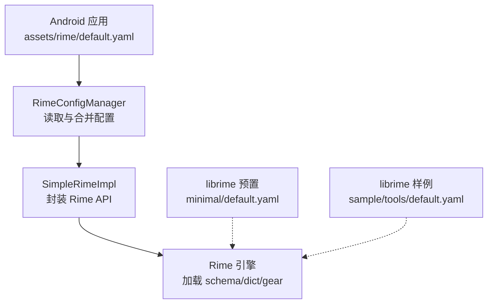
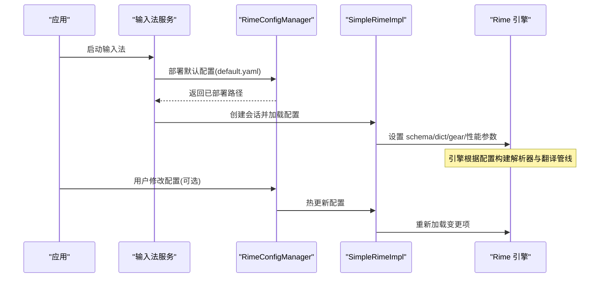
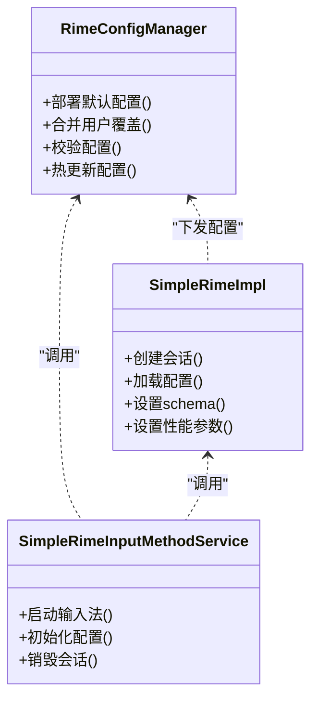

# 默认配置文件 (default.yaml)

<cite>
**本文引用的文件**   
- [app/src/main/assets/rime/default.yaml](file://app/src/main/assets/rime/default.yaml)
- [librime-prebuilt/librime/data/minimal/default.yaml](file://librime-prebuilt/librime/data/minimal/default.yaml)
- [librime-prebuilt/librime/sample/tools/default.yaml](file://librime-prebuilt/librime/sample/tools/default.yaml)
- [app/src/main/java/com/ziyou/ime/config/RimeConfigManager.kt](file://app/src/main/java/com/ziyou/ime/config/RimeConfigManager.kt)
- [app/src/main/java/com/ziyou/ime/core/SimpleRimeImpl.kt](file://app/src/main/java/com/ziyou/ime/core/SimpleRimeImpl.kt)
- [app/src/main/java/com/ziyou/ime/ime/SimpleRimeInputMethodService.kt](file://app/src/main/java/com/ziyou/ime/ime/SimpleRimeInputMethodService.kt)
</cite>

## 目录
1. [简介](#简介)
2. [项目结构](#项目结构)
3. [核心组件](#核心组件)
4. [架构总览](#架构总览)
5. [详细组件分析](#详细组件分析)
6. [依赖关系分析](#依赖关系分析)
7. [性能考量](#性能考量)
8. [故障排除指南](#故障排除指南)
9. [结论](#结论)
10. [附录](#附录)

## 简介
本文件为输入法默认配置 default.yaml 的权威说明，聚焦以下方面：
- 全局设置、键盘布局、候选词显示与性能调优等关键配置项
- 各字段的作用域与影响范围（全局、用户偏好、系统级）
- 数据类型、取值范围与默认值
- 常见场景示例（切换输入方案、调整候选数、自定义快捷键）
- 配置加载顺序与优先级机制
- 配置校验方法与常见问题排查

## 项目结构
本项目在 Android 应用层通过 assets/rime 提供 Rime 默认配置，并在运行时由 Java/Kotlin 侧管理器加载并下发至底层引擎。同时，librime 预编译包内也包含 minimal 与 sample 两套参考 default.yaml，便于对照理解字段含义与行为差异。

图表来源
- [app/src/main/assets/rime/default.yaml](file://app/src/main/assets/rime/default.yaml)
- [librime-prebuilt/librime/data/minimal/default.yaml](file://librime-prebuilt/librime/data/minimal/default.yaml)
- [librime-prebuilt/librime/sample/tools/default.yaml](file://librime-prebuilt/librime/sample/tools/default.yaml)
- [app/src/main/java/com/ziyou/ime/config/RimeConfigManager.kt](file://app/src/main/java/com/ziyou/ime/config/RimeConfigManager.kt)
- [app/src/main/java/com/ziyou/ime/core/SimpleRimeImpl.kt](file://app/src/main/java/com/ziyou/ime/core/SimpleRimeImpl.kt)

章节来源
- [app/src/main/assets/rime/default.yaml](file://app/src/main/assets/rime/default.yaml)
- [librime-prebuilt/librime/data/minimal/default.yaml](file://librime-prebuilt/librime/data/minimal/default.yaml)
- [librime-prebuilt/librime/sample/tools/default.yaml](file://librime-prebuilt/librime/sample/tools/default.yaml)
- [app/src/main/java/com/ziyou/ime/config/RimeConfigManager.kt](file://app/src/main/java/com/ziyou/ime/config/RimeConfigManager.kt)
- [app/src/main/java/com/ziyou/ime/core/SimpleRimeImpl.kt](file://app/src/main/java/com/ziyou/ime/core/SimpleRimeImpl.kt)

## 核心组件
- 默认配置 default.yaml：定义输入法全局行为、键盘布局、候选展示、快捷键与性能参数等
- RimeConfigManager：负责从 assets 部署默认配置、合并用户覆盖、校验与热更新
- SimpleRimeImpl：对 Rime 引擎 API 的封装，负责将配置下发到引擎会话
- SimpleRimeInputMethodService：输入法服务入口，启动时初始化配置与会话

章节来源
- [app/src/main/java/com/ziyou/ime/config/RimeConfigManager.kt](file://app/src/main/java/com/ziyou/ime/config/RimeConfigManager.kt)
- [app/src/main/java/com/ziyou/ime/core/SimpleRimeImpl.kt](file://app/src/main/java/com/ziyou/ime/core/SimpleRimeImpl.kt)
- [app/src/main/java/com/ziyou/ime/ime/SimpleRimeInputMethodService.kt](file://app/src/main/java/com/ziyou/ime/ime/SimpleRimeInputMethodService.kt)

## 架构总览
下图展示了 default.yaml 从资源到引擎的完整加载链路，以及用户覆盖与热更新的交互流程。

图表来源
- [app/src/main/java/com/ziyou/ime/config/RimeConfigManager.kt](file://app/src/main/java/com/ziyou/ime/config/RimeConfigManager.kt)
- [app/src/main/java/com/ziyou/ime/core/SimpleRimeImpl.kt](file://app/src/main/java/com/ziyou/ime/core/SimpleRimeImpl.kt)
- [app/src/main/java/com/ziyou/ime/ime/SimpleRimeInputMethodService.kt](file://app/src/main/java/com/ziyou/ime/ime/SimpleRimeInputMethodService.kt)

## 详细组件分析

### 全局设置（Global Settings）
- 作用域：全局生效，影响所有输入法会话
- 典型字段类别
  - 语言与编码：如字符集、UTF-8 相关开关
  - 日志级别：调试输出粒度
  - 内存与缓存：候选缓存、历史长度上限
  - 插件与扩展：是否启用预测、OpenCC 简繁转换等
- 数据类型与默认值
  - 布尔型：true/false，控制功能开关
  - 整型：非负整数，表示阈值或上限
  - 字符串：标识符或路径引用
- 影响范围
  - 影响引擎初始化、模块加载与运行时行为
  - 与用户配置合并后生效

章节来源
- [app/src/main/assets/rime/default.yaml](file://app/src/main/assets/rime/default.yaml)
- [librime-prebuilt/librime/data/minimal/default.yaml](file://librime-prebuilt/librime/data/minimal/default.yaml)

### 键盘布局（Keyboard Layout）
- 作用域：当前输入法界面与按键映射
- 典型字段类别
  - 布局类型：全键盘、九宫格、符号面板等
  - 键位映射：修饰键、组合键、长按行为
  - 候选导航键：上/下翻页、确认、删除等
- 数据类型与默认值
  - 枚举/字符串：布局名称
  - 列表/映射：键码到动作的映射
- 影响范围
  - 仅影响 UI 层按键处理与事件分发
  - 可与全局设置中的快捷键策略叠加

章节来源
- [app/src/main/assets/rime/default.yaml](file://app/src/main/assets/rime/default.yaml)
- [librime-prebuilt/librime/sample/tools/default.yaml](file://librime-prebuilt/librime/sample/tools/default.yaml)

### 候选词显示（Candidates Display）
- 作用域：候选面板渲染与交互
- 典型字段类别
  - 候选数量：每页显示条目数、最大候选数
  - 排序策略：频率优先、拼音匹配度、自定义权重
  - 样式与主题：字体大小、行高、颜色（若由 UI 层接管）
- 数据类型与默认值
  - 整型：候选条数、分页大小
  - 布尔型：是否启用智能排序
  - 字符串：排序规则名
- 影响范围
  - 影响候选生成与过滤阶段
  - 与性能参数联动（过多候选可能增加计算开销）

章节来源
- [app/src/main/assets/rime/default.yaml](file://app/src/main/assets/rime/default.yaml)
- [librime-prebuilt/librime/data/minimal/default.yaml](file://librime-prebuilt/librime/data/minimal/default.yaml)

### 性能调优（Performance Tuning）
- 作用域：引擎运行时的资源与速度平衡
- 典型字段类别
  - 缓存大小：候选缓存、词典缓存上限
  - 并发与线程：翻译线程池大小
  - I/O 策略：同步/异步加载、延迟预热
  - 内存限制：单会话最大内存占用
- 数据类型与默认值
  - 整型：容量、超时、线程数
  - 布尔型：是否启用优化开关
- 影响范围
  - 直接影响响应延迟与内存占用
  - 需结合设备能力与使用场景调优

章节来源
- [app/src/main/assets/rime/default.yaml](file://app/src/main/assets/rime/default.yaml)
- [librime-prebuilt/librime/data/minimal/default.yaml](file://librime-prebuilt/librime/data/minimal/default.yaml)

### 快捷键与组合键（Key Bindings）
- 作用域：全局与局部（会话）均可定义
- 典型字段类别
  - 全局快捷键：切换方案、切换中英文、打开设置
  - 局部快捷键：候选翻页、确认、退格、空格
  - 修饰键：Shift/Ctrl/Alt 的组合策略
- 数据类型与默认值
  - 字符串/列表：键序列描述
  - 映射表：键到动作的绑定
- 影响范围
  - 与键盘布局协同工作
  - 可被用户配置覆盖

章节来源
- [app/src/main/assets/rime/default.yaml](file://app/src/main/assets/rime/default.yaml)
- [librime-prebuilt/librime/sample/tools/default.yaml](file://librime-prebuilt/librime/sample/tools/default.yaml)

### 数据模型与字段规范
- 数据类型
  - 布尔：true/false
  - 整数：非负为主，部分可为负表示特殊含义
  - 字符串：标识符、路径、枚举值
  - 列表/映射：用于多值与键值对
- 取值范围与默认值
  - 具体数值以 default.yaml 为准
  - 超出范围将被忽略或回退到默认值
- 作用域层次
  - 全局（default.yaml）→ 用户覆盖（custom.yaml）→ 会话级（运行时设置）

章节来源
- [app/src/main/assets/rime/default.yaml](file://app/src/main/assets/rime/default.yaml)
- [librime-prebuilt/librime/data/minimal/default.yaml](file://librime-prebuilt/librime/data/minimal/default.yaml)

### 常见配置场景示例
- 切换输入方案
  - 在全局设置中指定默认 schema，或通过快捷键触发切换
  - 影响范围：当前会话及后续新建会话
- 调整候选词数量
  - 修改候选显示数量与分页大小
  - 影响范围：候选面板与翻译管线
- 自定义快捷键
  - 在 key_bindings 中添加或覆盖默认绑定
  - 影响范围：UI 按键事件与引擎命令

章节来源
- [app/src/main/assets/rime/default.yaml](file://app/src/main/assets/rime/default.yaml)
- [librime-prebuilt/librime/sample/tools/default.yaml](file://librime-prebuilt/librime/sample/tools/default.yaml)

## 依赖关系分析
default.yaml 与 Kotlin 管理器的依赖关系如下：

图表来源
- [app/src/main/java/com/ziyou/ime/config/RimeConfigManager.kt](file://app/src/main/java/com/ziyou/ime/config/RimeConfigManager.kt)
- [app/src/main/java/com/ziyou/ime/core/SimpleRimeImpl.kt](file://app/src/main/java/com/ziyou/ime/core/SimpleRimeImpl.kt)
- [app/src/main/java/com/ziyou/ime/ime/SimpleRimeInputMethodService.kt](file://app/src/main/java/com/ziyou/ime/ime/SimpleRimeInputMethodService.kt)

章节来源
- [app/src/main/java/com/ziyou/ime/config/RimeConfigManager.kt](file://app/src/main/java/com/ziyou/ime/config/RimeConfigManager.kt)
- [app/src/main/java/com/ziyou/ime/core/SimpleRimeImpl.kt](file://app/src/main/java/com/ziyou/ime/core/SimpleRimeImpl.kt)
- [app/src/main/java/com/ziyou/ime/ime/SimpleRimeInputMethodService.kt](file://app/src/main/java/com/ziyou/ime/ime/SimpleRimeInputMethodService.kt)

## 性能考量
- 候选数量与排序复杂度
  - 候选越多，排序与过滤开销越大；建议按设备能力设定合理上限
- 缓存策略
  - 适当增大候选缓存可减少重复计算，但会增加内存占用
- I/O 与线程
  - 异步加载与预热可降低首帧延迟；线程池大小需避免过度竞争
- 内存限制
  - 单会话内存上限应结合机型与后台任务进行权衡

[本节为通用指导，不直接分析具体文件]

## 故障排除指南
- 配置未生效
  - 检查是否成功部署默认配置与用户覆盖
  - 确认热更新流程是否调用
- 候选异常
  - 核对候选数量与排序规则
  - 检查词典与 schema 是否正确加载
- 快捷键冲突
  - 查看 key_bindings 是否存在重复或无效键码
- 性能问题
  - 降低候选上限、关闭非必要插件
  - 调整缓存与线程参数

章节来源
- [app/src/main/java/com/ziyou/ime/config/RimeConfigManager.kt](file://app/src/main/java/com/ziyou/ime/config/RimeConfigManager.kt)
- [app/src/main/java/com/ziyou/ime/core/SimpleRimeImpl.kt](file://app/src/main/java/com/ziyou/ime/core/SimpleRimeImpl.kt)

## 结论
default.yaml 是输入法行为的核心蓝图，涵盖全局设置、键盘布局、候选展示与性能调优等关键维度。通过 RimeConfigManager 与 SimpleRimeImpl 的配合，可实现配置的部署、合并、校验与热更新。合理设置各项参数，可在体验与性能之间取得良好平衡。

[本节为总结性内容，不直接分析具体文件]

## 附录

### 配置加载顺序与优先级
- 加载顺序
  - 默认配置（assets/rime/default.yaml）
  - 用户覆盖（custom.yaml 或运行时覆盖）
  - 会话级设置（运行时动态参数）
- 优先级
  - 用户覆盖 > 默认配置
  - 会话级设置 > 用户覆盖（仅在会话生命周期内有效）

章节来源
- [app/src/main/assets/rime/default.yaml](file://app/src/main/assets/rime/default.yaml)
- [app/src/main/java/com/ziyou/ime/config/RimeConfigManager.kt](file://app/src/main/java/com/ziyou/ime/config/RimeConfigManager.kt)

### 配置验证方法
- 语法校验
  - 确保 YAML 格式正确，无缩进错误
- 语义校验
  - 字段类型与取值范围是否符合预期
  - 依赖的 schema/dict 路径是否存在
- 运行时校验
  - 观察日志输出与候选表现
  - 使用热更新接口逐步验证变更

章节来源
- [app/src/main/java/com/ziyou/ime/config/RimeConfigManager.kt](file://app/src/main/java/com/ziyou/ime/config/RimeConfigManager.kt)