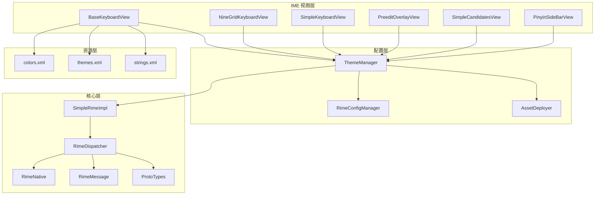
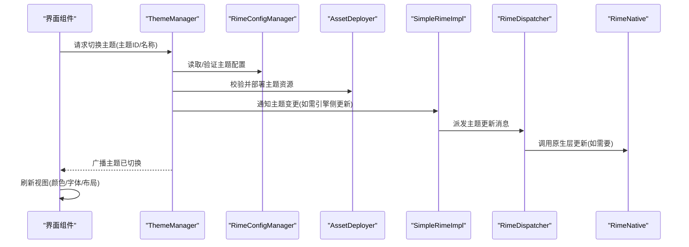
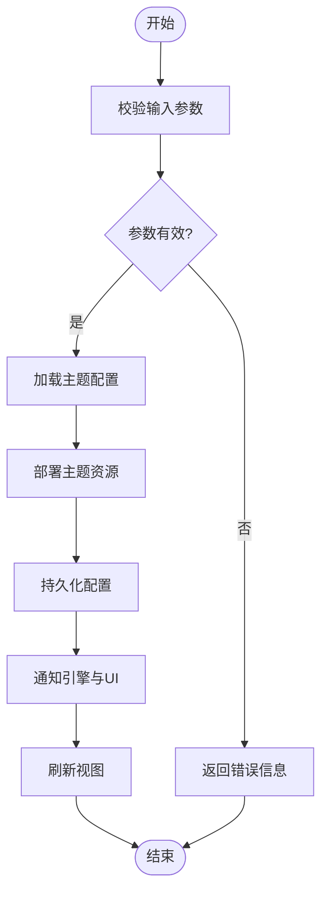
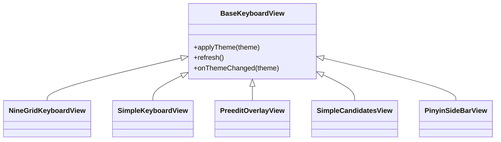
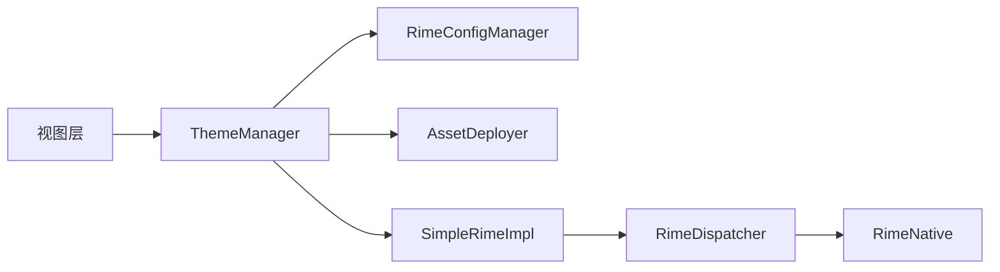

# 主题管理器

<cite>
**本文档引用的文件**   
- [ThemeManager.kt](file://app/src/main/java/com/ziyou/ime/config/ThemeManager.kt)
- [RimeConfigManager.kt](file://app/src/main/java/com/ziyou/ime/config/RimeConfigManager.kt)
- [AssetDeployer.kt](file://app/src/main/java/com/ziyou/ime/config/AssetDeployer.kt)
- [SimpleRimeImpl.kt](file://app/src/main/java/com/ziyou/ime/core/SimpleRimeImpl.kt)
- [RimeDispatcher.kt](file://app/src/main/java/com/ziyou/ime/core/RimeDispatcher.kt)
- [RimeNative.kt](file://app/src/main/java/com/ziyou/ime/core/RimeNative.kt)
- [RimeMessage.kt](file://app/src/main/java/com/ziyou/ime/core/RimeMessage.kt)
- [ProtoTypes.kt](file://app/src/main/java/com/ziyou/ime/core/ProtoTypes.kt)
- [BaseKeyboardView.kt](file://app/src/main/java/com/ziyou/ime/ime/BaseKeyboardView.kt)
- [NineGridKeyboardView.kt](file://app/src/main/java/com/ziyou/ime/ime/NineGridKeyboardView.kt)
- [SimpleKeyboardView.kt](file://app/src/main/java/com/ziyou/ime/ime/SimpleKeyboardView.kt)
- [PreeditOverlayView.kt](file://app/src/main/java/com/ziyou/ime/ime/PreeditOverlayView.kt)
- [SimpleCandidatesView.kt](file://app/src/main/java/com/ziyou/ime/ime/SimpleCandidatesView.kt)
- [PinyinSideBarView.kt](file://app/src/main/java/com/ziyou/ime/ime/PinyinSideBarView.kt)
- [colors.xml](file://app/src/main/res/values/colors.xml)
- [themes.xml](file://app/src/main/res/values/themes.xml)
- [strings.xml](file://app/src/main/res/values/strings.xml)
</cite>

## 目录
1. [简介](#简介)
2. [项目结构](#项目结构)
3. [核心组件](#核心组件)
4. [架构总览](#架构总览)
5. [详细组件分析](#详细组件分析)
6. [依赖关系分析](#依赖关系分析)
7. [性能考量](#性能考量)
8. [故障排查指南](#故障排查指南)
9. [结论](#结论)
10. [附录](#附录)

## 简介
本技术文档围绕 ThemeManager（主题管理器）展开，系统性阐述主题系统的架构设计、资源管理与渲染引擎集成方式。重点覆盖：
- 主题定义与数据结构
- 预设主题创建与管理（颜色方案、字体设置、布局配置）
- 自定义主题的导入与导出（文件格式、校验规则、兼容性检查）
- 动态主题切换机制（资源重加载、UI 刷新、状态保持）
- 主题继承与覆盖（部分属性覆盖、全局样式定制）
- 开发最佳实践（性能优化、内存管理、用户体验）
- 调试工具与常见问题解决方案

## 项目结构
本项目采用分层组织：
- 配置层：ThemeManager、RimeConfigManager、AssetDeployer
- 核心层：Rime 相关实现与消息分发（SimpleRimeImpl、RimeDispatcher、RimeNative、RimeMessage、ProtoTypes）
- IME 视图层：各类键盘与候选词视图（BaseKeyboardView、NineGridKeyboardView、SimpleKeyboardView、PreeditOverlayView、SimpleCandidatesView、PinyinSideBarView）
- 资源层：颜色、主题、字符串等 Android 资源

图表来源
- [ThemeManager.kt:1-200](file://app/src/main/java/com/ziyou/ime/config/ThemeManager.kt#L1-L200)
- [RimeConfigManager.kt:1-200](file://app/src/main/java/com/ziyou/ime/config/RimeConfigManager.kt#L1-L200)
- [AssetDeployer.kt:1-200](file://app/src/main/java/com/ziyou/ime/config/AssetDeployer.kt#L1-L200)
- [SimpleRimeImpl.kt:1-200](file://app/src/main/java/com/ziyou/ime/core/SimpleRimeImpl.kt#L1-L200)
- [RimeDispatcher.kt:1-200](file://app/src/main/java/com/ziyou/ime/core/RimeDispatcher.kt#L1-L200)
- [RimeNative.kt:1-200](file://app/src/main/java/com/ziyou/ime/core/RimeNative.kt#L1-L200)
- [RimeMessage.kt:1-200](file://app/src/main/java/com/ziyou/ime/core/RimeMessage.kt#L1-L200)
- [ProtoTypes.kt:1-200](file://app/src/main/java/com/ziyou/ime/core/ProtoTypes.kt#L1-L200)
- [BaseKeyboardView.kt:1-200](file://app/src/main/java/com/ziyou/ime/ime/BaseKeyboardView.kt#L1-L200)
- [NineGridKeyboardView.kt:1-200](file://app/src/main/java/com/ziyou/ime/ime/NineGridKeyboardView.kt#L1-L200)
- [SimpleKeyboardView.kt:1-200](file://app/src/main/java/com/ziyou/ime/ime/SimpleKeyboardView.kt#L1-L200)
- [PreeditOverlayView.kt:1-200](file://app/src/main/java/com/ziyou/ime/ime/PreeditOverlayView.kt#L1-L200)
- [SimpleCandidatesView.kt:1-200](file://app/src/main/java/com/ziyou/ime/ime/SimpleCandidatesView.kt#L1-L200)
- [PinyinSideBarView.kt:1-200](file://app/src/main/java/com/ziyou/ime/ime/PinyinSideBarView.kt#L1-L200)
- [colors.xml:1-200](file://app/src/main/res/values/colors.xml#L1-L200)
- [themes.xml:1-200](file://app/src/main/res/values/themes.xml#L1-L200)
- [strings.xml:1-200](file://app/src/main/res/values/strings.xml#L1-L200)

章节来源
- [ThemeManager.kt:1-200](file://app/src/main/java/com/ziyou/ime/config/ThemeManager.kt#L1-L200)
- [RimeConfigManager.kt:1-200](file://app/src/main/java/com/ziyou/ime/config/RimeConfigManager.kt#L1-L200)
- [AssetDeployer.kt:1-200](file://app/src/main/java/com/ziyou/ime/config/AssetDeployer.kt#L1-L200)

## 核心组件
- ThemeManager：主题生命周期与策略中心，负责主题定义、加载、切换、缓存与通知 UI 刷新。
- RimeConfigManager：与 Rime 配置系统交互，持久化主题相关配置项。
- AssetDeployer：资源部署与校验，确保主题资源在运行时可用。
- SimpleRimeImpl / RimeDispatcher / RimeNative：Rime 引擎封装与消息分发，主题切换时触发必要的引擎更新。
- 视图层组件：各键盘与候选词视图订阅主题变化并应用样式。

章节来源
- [ThemeManager.kt:1-200](file://app/src/main/java/com/ziyou/ime/config/ThemeManager.kt#L1-L200)
- [RimeConfigManager.kt:1-200](file://app/src/main/java/com/ziyou/ime/config/RimeConfigManager.kt#L1-L200)
- [AssetDeployer.kt:1-200](file://app/src/main/java/com/ziyou/ime/config/AssetDeployer.kt#L1-L200)
- [SimpleRimeImpl.kt:1-200](file://app/src/main/java/com/ziyou/ime/core/SimpleRimeImpl.kt#L1-L200)
- [RimeDispatcher.kt:1-200](file://app/src/main/java/com/ziyou/ime/core/RimeDispatcher.kt#L1-L200)
- [RimeNative.kt:1-200](file://app/src/main/java/com/ziyou/ime/core/RimeNative.kt#L1-L200)

## 架构总览
主题系统以 ThemeManager 为核心，向上暴露主题能力接口，向下协调配置、资源与引擎。视图层通过观察者模式订阅主题变更事件，按需刷新绘制。

图表来源
- [ThemeManager.kt:1-200](file://app/src/main/java/com/ziyou/ime/config/ThemeManager.kt#L1-L200)
- [RimeConfigManager.kt:1-200](file://app/src/main/java/com/ziyou/ime/config/RimeConfigManager.kt#L1-L200)
- [AssetDeployer.kt:1-200](file://app/src/main/java/com/ziyou/ime/config/AssetDeployer.kt#L1-L200)
- [SimpleRimeImpl.kt:1-200](file://app/src/main/java/com/ziyou/ime/core/SimpleRimeImpl.kt#L1-L200)
- [RimeDispatcher.kt:1-200](file://app/src/main/java/com/ziyou/ime/core/RimeDispatcher.kt#L1-L200)
- [RimeNative.kt:1-200](file://app/src/main/java/com/ziyou/ime/core/RimeNative.kt#L1-L200)

## 详细组件分析

### ThemeManager：主题生命周期与策略中心
- 职责
  - 主题定义与注册（预设主题、自定义主题）
  - 主题加载与缓存（内存与磁盘）
  - 主题切换流程（校验、部署、通知、刷新）
  - 主题继承与覆盖（基础主题 + 增量覆盖）
  - 主题导入/导出（格式校验、兼容性检查）
- 关键流程
  - 切换主题：参数校验 → 资源部署 → 配置持久化 → 引擎更新 → UI 刷新
  - 继承覆盖：合并基础主题与覆盖字段，冲突时按优先级处理
  - 导入导出：序列化/反序列化主题数据，执行 schema 校验与兼容性矩阵检查
- 性能要点
  - 懒加载与缓存命中
  - 批量刷新减少重绘次数
  - 避免在主线程进行 I/O 与重型计算

图表来源
- [ThemeManager.kt:1-200](file://app/src/main/java/com/ziyou/ime/config/ThemeManager.kt#L1-L200)

章节来源
- [ThemeManager.kt:1-200](file://app/src/main/java/com/ziyou/ime/config/ThemeManager.kt#L1-L200)

### RimeConfigManager：配置持久化与版本兼容
- 职责
  - 读写主题相关配置项
  - 配置迁移与版本兼容
  - 与 Rime 引擎配置同步
- 关键点
  - 配置键命名规范与默认值
  - 增量更新与回滚策略
  - 并发安全与事务性写入

章节来源
- [RimeConfigManager.kt:1-200](file://app/src/main/java/com/ziyou/ime/config/RimeConfigManager.kt#L1-L200)

### AssetDeployer：资源部署与校验
- 职责
  - 主题资源（图片、字体、样式）的可用性检查
  - 资源复制与路径映射
  - 失败回滚与错误上报
- 关键点
  - 资源指纹校验（哈希或版本）
  - 多分辨率适配与资源选择
  - 异步部署与进度回调

章节来源
- [AssetDeployer.kt:1-200](file://app/src/main/java/com/ziyou/ime/config/AssetDeployer.kt#L1-L200)

### SimpleRimeImpl / RimeDispatcher / RimeNative：引擎集成
- 职责
  - 将主题变更映射为引擎可识别的消息
  - 分发与路由主题相关事件
  - 与原生层交互完成底层渲染更新
- 关键点
  - 消息结构与协议定义
  - 重试与超时处理
  - 日志与诊断信息输出

章节来源
- [SimpleRimeImpl.kt:1-200](file://app/src/main/java/com/ziyou/ime/core/SimpleRimeImpl.kt#L1-L200)
- [RimeDispatcher.kt:1-200](file://app/src/main/java/com/ziyou/ime/core/RimeDispatcher.kt#L1-L200)
- [RimeNative.kt:1-200](file://app/src/main/java/com/ziyou/ime/core/RimeNative.kt#L1-L200)
- [RimeMessage.kt:1-200](file://app/src/main/java/com/ziyou/ime/core/RimeMessage.kt#L1-L200)
- [ProtoTypes.kt:1-200](file://app/src/main/java/com/ziyou/ime/core/ProtoTypes.kt#L1-L200)

### 视图层组件：主题应用与刷新
- BaseKeyboardView：基类提供主题订阅与通用刷新逻辑
- NineGridKeyboardView / SimpleKeyboardView：九宫格与简易键盘的主题应用
- PreeditOverlayView：预编辑区样式与布局
- SimpleCandidatesView：候选词列表样式与滚动行为
- PinyinSideBarView：拼音侧边栏主题适配

图表来源
- [BaseKeyboardView.kt:1-200](file://app/src/main/java/com/ziyou/ime/ime/BaseKeyboardView.kt#L1-L200)
- [NineGridKeyboardView.kt:1-200](file://app/src/main/java/com/ziyou/ime/ime/NineGridKeyboardView.kt#L1-L200)
- [SimpleKeyboardView.kt:1-200](file://app/src/main/java/com/ziyou/ime/ime/SimpleKeyboardView.kt#L1-L200)
- [PreeditOverlayView.kt:1-200](file://app/src/main/java/com/ziyou/ime/ime/PreeditOverlayView.kt#L1-L200)
- [SimpleCandidatesView.kt:1-200](file://app/src/main/java/com/ziyou/ime/ime/SimpleCandidatesView.kt#L1-L200)
- [PinyinSideBarView.kt:1-200](file://app/src/main/java/com/ziyou/ime/ime/PinyinSideBarView.kt#L1-L200)

章节来源
- [BaseKeyboardView.kt:1-200](file://app/src/main/java/com/ziyou/ime/ime/BaseKeyboardView.kt#L1-L200)
- [NineGridKeyboardView.kt:1-200](file://app/src/main/java/com/ziyou/ime/ime/NineGridKeyboardView.kt#L1-L200)
- [SimpleKeyboardView.kt:1-200](file://app/src/main/java/com/ziyou/ime/ime/SimpleKeyboardView.kt#L1-L200)
- [PreeditOverlayView.kt:1-200](file://app/src/main/java/com/ziyou/ime/ime/PreeditOverlayView.kt#L1-L200)
- [SimpleCandidatesView.kt:1-200](file://app/src/main/java/com/ziyou/ime/ime/SimpleCandidatesView.kt#L1-L200)
- [PinyinSideBarView.kt:1-200](file://app/src/main/java/com/ziyou/ime/ime/PinyinSideBarView.kt#L1-L200)

## 依赖关系分析
- 模块耦合
  - ThemeManager 依赖 RimeConfigManager 与 AssetDeployer，解耦配置与资源
  - 视图层仅依赖 ThemeManager 提供的主题查询与订阅接口，降低耦合
- 外部依赖
  - Rime 引擎通过 SimpleRimeImpl 与 RimeDispatcher 桥接
  - Android 资源系统用于颜色、字体与布局资源
- 潜在循环依赖
  - 通过事件总线与回调避免直接双向引用

图表来源
- [ThemeManager.kt:1-200](file://app/src/main/java/com/ziyou/ime/config/ThemeManager.kt#L1-L200)
- [RimeConfigManager.kt:1-200](file://app/src/main/java/com/ziyou/ime/config/RimeConfigManager.kt#L1-L200)
- [AssetDeployer.kt:1-200](file://app/src/main/java/com/ziyou/ime/config/AssetDeployer.kt#L1-L200)
- [SimpleRimeImpl.kt:1-200](file://app/src/main/java/com/ziyou/ime/core/SimpleRimeImpl.kt#L1-L200)
- [RimeDispatcher.kt:1-200](file://app/src/main/java/com/ziyou/ime/core/RimeDispatcher.kt#L1-L200)
- [RimeNative.kt:1-200](file://app/src/main/java/com/ziyou/ime/core/RimeNative.kt#L1-L200)

章节来源
- [ThemeManager.kt:1-200](file://app/src/main/java/com/ziyou/ime/config/ThemeManager.kt#L1-L200)
- [RimeConfigManager.kt:1-200](file://app/src/main/java/com/ziyou/ime/config/RimeConfigManager.kt#L1-L200)
- [AssetDeployer.kt:1-200](file://app/src/main/java/com/ziyou/ime/config/AssetDeployer.kt#L1-L200)

## 性能考量
- 资源加载
  - 使用懒加载与缓存，避免重复 I/O
  - 对大图与字体进行压缩与复用
- 刷新策略
  - 批量更新视图，减少重绘次数
  - 使用局部刷新而非全量重建
- 内存管理
  - 及时释放不再使用的主题资源
  - 监控内存峰值，避免 OOM
- 主线程保护
  - 将耗时操作移至后台线程
  - 使用协程或线程池管理任务

[本节为通用指导，不直接分析具体文件]

## 故障排查指南
- 常见问题
  - 主题切换后 UI 未刷新：检查主题订阅与刷新回调是否生效
  - 资源缺失或路径错误：确认 AssetDeployer 部署成功与资源清单完整
  - 配置不一致：核对 RimeConfigManager 持久化与默认值
  - 引擎更新失败：查看 RimeDispatcher 与 RimeNative 的错误日志
- 调试建议
  - 启用详细日志，记录主题切换全流程
  - 使用断点与变量监视定位问题
  - 对导入/导出流程进行单元测试覆盖

章节来源
- [ThemeManager.kt:1-200](file://app/src/main/java/com/ziyou/ime/config/ThemeManager.kt#L1-L200)
- [RimeConfigManager.kt:1-200](file://app/src/main/java/com/ziyou/ime/config/RimeConfigManager.kt#L1-L200)
- [AssetDeployer.kt:1-200](file://app/src/main/java/com/ziyou/ime/config/AssetDeployer.kt#L1-L200)
- [RimeDispatcher.kt:1-200](file://app/src/main/java/com/ziyou/ime/core/RimeDispatcher.kt#L1-L200)
- [RimeNative.kt:1-200](file://app/src/main/java/com/ziyou/ime/core/RimeNative.kt#L1-L200)

## 结论
ThemeManager 作为主题系统的中枢，整合了配置、资源与引擎，提供了完整的主题生命周期管理能力。通过清晰的架构设计与良好的解耦策略，实现了高效的动态主题切换与稳定的 UI 刷新。遵循本文的最佳实践与排查指南，可有效提升主题系统的性能与可维护性。

[本节为总结，不直接分析具体文件]

## 附录
- 主题文件格式建议
  - JSON/YAML 结构，包含颜色、字体、布局与扩展字段
  - 版本号与兼容性矩阵
- 校验规则
  - 必填字段检查
  - 类型与范围校验
  - 资源存在性与完整性校验
- 兼容性检查
  - 引擎版本匹配
  - 平台差异处理
  - 向后兼容策略

[本节为概念性内容，不直接分析具体文件]