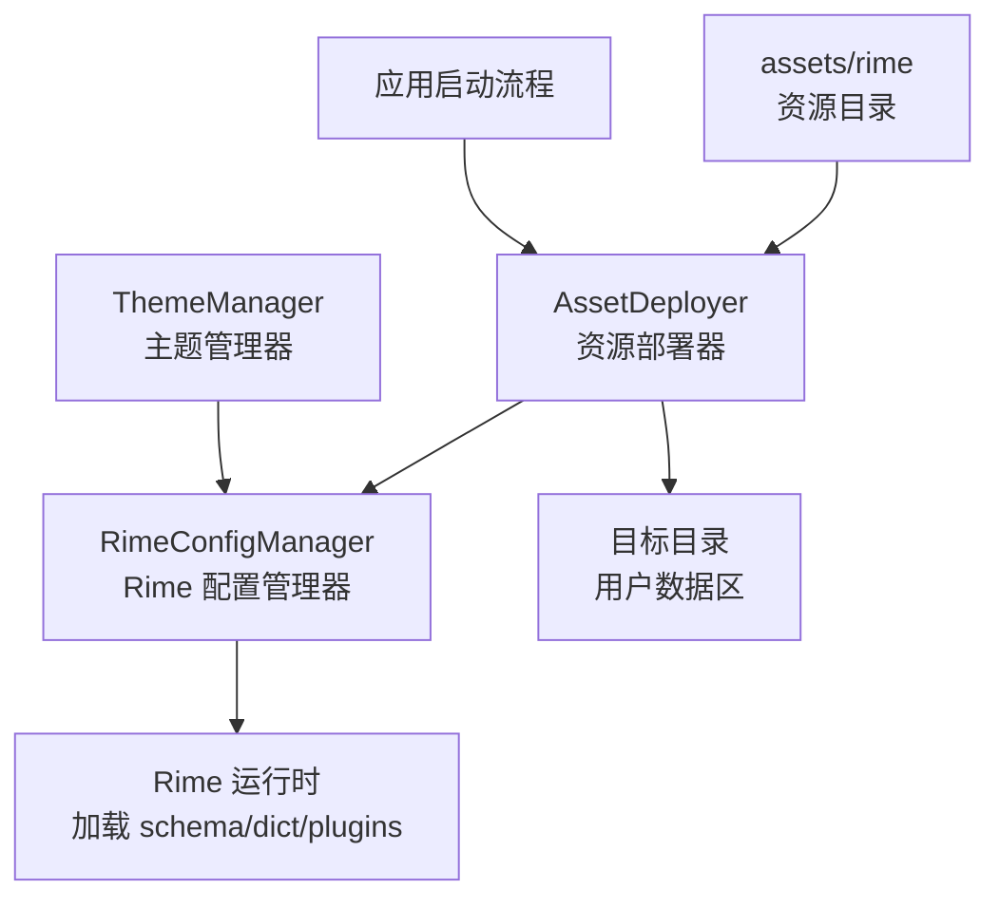
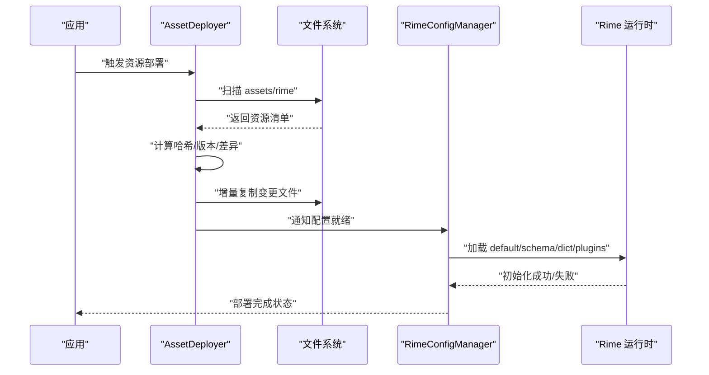
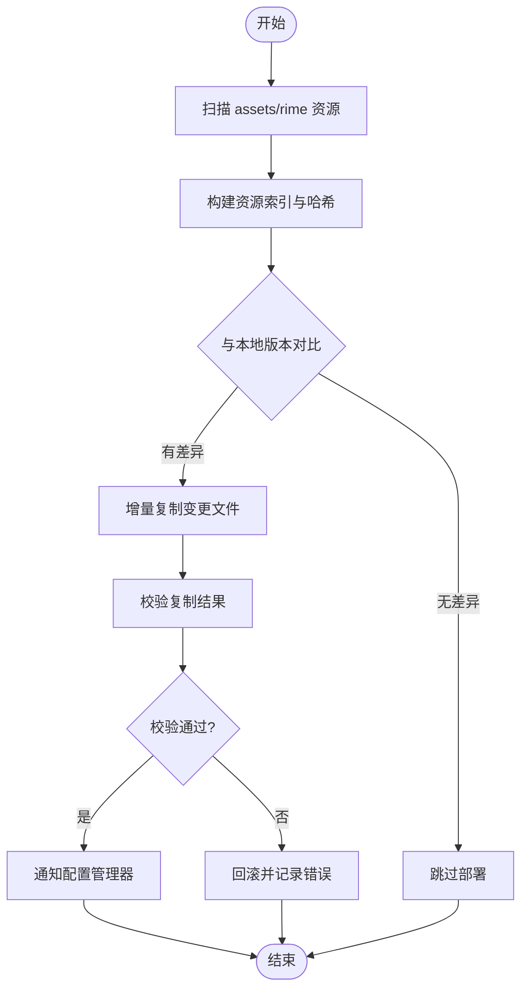
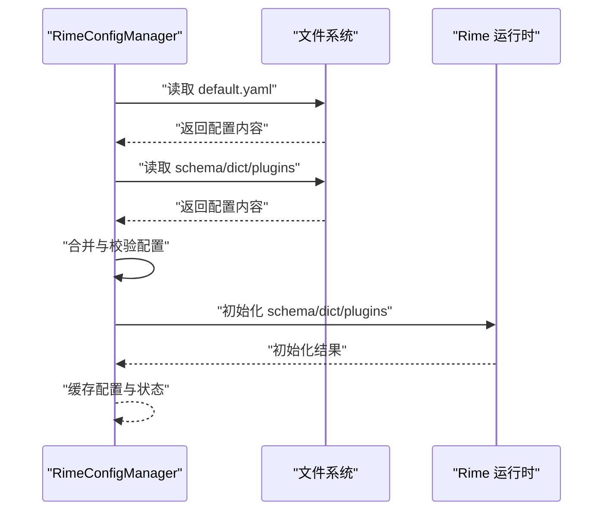
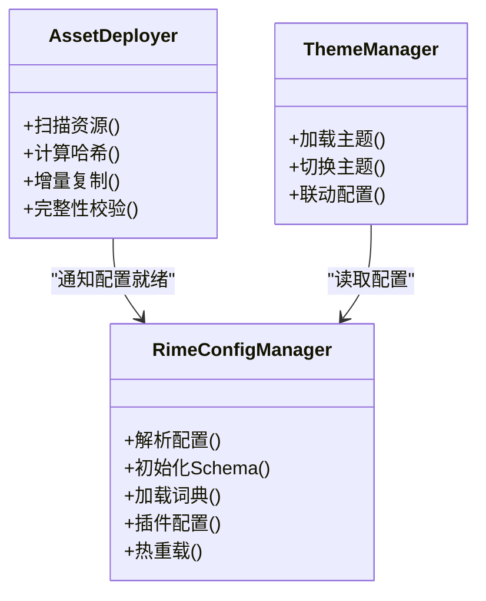

# 资源部署器

<cite>
**本文引用的文件**   
- [AssetDeployer.kt](file://app/src/main/java/com/ziyou/ime/config/AssetDeployer.kt)
- [RimeConfigManager.kt](file://app/src/main/java/com/ziyou/ime/config/RimeConfigManager.kt)
- [ThemeManager.kt](file://app/src/main/java/com/ziyou/ime/config/ThemeManager.kt)
- [default.yaml](file://app/src/main/assets/rime/default.yaml)
- [cangjie5.schema.yaml](file://app/src/main/assets/rime/cangjie5.schema.yaml)
- [luna_pinyin.schema.yaml](file://app/src/main/assets/rime/luna_pinyin.schema.yaml)
- [t9.schema.yaml](file://app/src/main/assets/rime/t9.schema.yaml)
- [cangjie5.dict.yaml](file://app/src/main/assets/rime/cangjie5.dict.yaml)
- [luna_pinyin.dict.yaml](file://app/src/main/assets/rime/luna_pinyin.dict.yaml)
- [symbols.yaml](file://app/src/main/assets/rime/symbols.yaml)
</cite>

## 目录
1. [简介](#简介)
2. [项目结构](#项目结构)
3. [核心组件](#核心组件)
4. [架构总览](#架构总览)
5. [详细组件分析](#详细组件分析)
6. [依赖关系分析](#依赖关系分析)
7. [性能考量](#性能考量)
8. [故障排除指南](#故障排除指南)
9. [结论](#结论)
10. [附录](#附录)

## 简介
本技术文档围绕 AssetDeployer（资源部署器）展开，系统阐述资源文件的部署机制与 Rime 配置自动部署流程。内容涵盖 assets 目录扫描、文件复制与版本管理；schema、词典与插件配置的初始化；资源校验与完整性检查（哈希验证、格式检查、依赖关系验证）；增量部署与差异更新；权限管理与安全策略；以及常见错误的排查与恢复策略。目标是帮助开发者快速理解并高效维护输入法资源部署体系。

## 项目结构
本项目将 Rime 相关资源以 YAML 配置文件形式置于 app/src/main/assets/rime 目录下，包括默认配置、各输入方案 schema、词典与符号表等。Android 应用侧通过 Kotlin 模块负责资源的扫描、校验、复制与部署，并与 Rime 运行时进行集成。

图表来源
- [AssetDeployer.kt](file://app/src/main/java/com/ziyou/ime/config/AssetDeployer.kt)
- [RimeConfigManager.kt](file://app/src/main/java/com/ziyou/ime/config/RimeConfigManager.kt)
- [ThemeManager.kt](file://app/src/main/java/com/ziyou/ime/config/ThemeManager.kt)

章节来源
- [AssetDeployer.kt](file://app/src/main/java/com/ziyou/ime/config/AssetDeployer.kt)
- [RimeConfigManager.kt](file://app/src/main/java/com/ziyou/ime/config/RimeConfigManager.kt)
- [ThemeManager.kt](file://app/src/main/java/com/ziyou/ime/config/ThemeManager.kt)

## 核心组件
- AssetDeployer：负责从 assets 扫描资源、计算校验值、比较版本与差异、执行增量复制与部署，并对部署结果进行一致性校验。
- RimeConfigManager：负责解析与合并 Rime 配置（default.yaml、schema、dict、plugins），完成初始化与热重载。
- ThemeManager：管理主题资源与样式配置，确保 UI 与输入体验一致。

章节来源
- [AssetDeployer.kt](file://app/src/main/java/com/ziyou/ime/config/AssetDeployer.kt)
- [RimeConfigManager.kt](file://app/src/main/java/com/ziyou/ime/config/RimeConfigManager.kt)
- [ThemeManager.kt](file://app/src/main/java/com/ziyou/ime/config/ThemeManager.kt)

## 架构总览
资源部署的整体流程如下：应用启动时触发部署任务，AssetDeployer 扫描 assets/rime 下的所有 YAML 文件，生成资源清单与校验信息；与本地已部署版本进行对比，仅对变更文件执行增量复制；随后由 RimeConfigManager 加载并初始化 schema、词典与插件配置；最终由 Rime 运行时生效。

图表来源
- [AssetDeployer.kt](file://app/src/main/java/com/ziyou/ime/config/AssetDeployer.kt)
- [RimeConfigManager.kt](file://app/src/main/java/com/ziyou/ime/config/RimeConfigManager.kt)

## 详细组件分析

### AssetDeployer：资源部署器
职责与行为
- 资源扫描：遍历 assets/rime 目录，收集所有 YAML 文件路径与元数据。
- 版本与差异：基于文件哈希或时间戳构建版本索引，识别新增、修改、删除的文件。
- 增量复制：仅复制差异文件至目标目录，减少 I/O 开销。
- 完整性校验：对复制后的文件进行二次校验，确保与源一致。
- 错误处理：记录异常、回滚失败操作，保证部署原子性。

关键流程（流程图）

图表来源
- [AssetDeployer.kt](file://app/src/main/java/com/ziyou/ime/config/AssetDeployer.kt)

章节来源
- [AssetDeployer.kt](file://app/src/main/java/com/ziyou/ime/config/AssetDeployer.kt)

### RimeConfigManager：Rime 配置管理器
职责与行为
- 配置解析：读取 default.yaml、schema.yaml、dict.yaml、symbols.yaml 等，并进行合并与校验。
- Schema 初始化：注册输入方案（如仓颉五笔、 luna_pinyin、T9），建立候选词映射。
- 词典加载：加载内置词典与扩展词典，支持增量更新。
- 插件配置：根据配置启用/禁用插件，完成插件生命周期管理。
- 热重载：在资源变更后重新加载配置，无需重启应用。

关键流程（序列图）

图表来源
- [RimeConfigManager.kt](file://app/src/main/java/com/ziyou/ime/config/RimeConfigManager.kt)
- [default.yaml](file://app/src/main/assets/rime/default.yaml)
- [cangjie5.schema.yaml](file://app/src/main/assets/rime/cangjie5.schema.yaml)
- [luna_pinyin.schema.yaml](file://app/src/main/assets/rime/luna_pinyin.schema.yaml)
- [t9.schema.yaml](file://app/src/main/assets/rime/t9.schema.yaml)
- [cangjie5.dict.yaml](file://app/src/main/assets/rime/cangjie5.dict.yaml)
- [luna_pinyin.dict.yaml](file://app/src/main/assets/rime/luna_pinyin.dict.yaml)
- [symbols.yaml](file://app/src/main/assets/rime/symbols.yaml)

章节来源
- [RimeConfigManager.kt](file://app/src/main/java/com/ziyou/ime/config/RimeConfigManager.kt)
- [default.yaml](file://app/src/main/assets/rime/default.yaml)
- [cangjie5.schema.yaml](file://app/src/main/assets/rime/cangjie5.schema.yaml)
- [luna_pinyin.schema.yaml](file://app/src/main/assets/rime/luna_pinyin.schema.yaml)
- [t9.schema.yaml](file://app/src/main/assets/rime/t9.schema.yaml)
- [cangjie5.dict.yaml](file://app/src/main/assets/rime/cangjie5.dict.yaml)
- [luna_pinyin.dict.yaml](file://app/src/main/assets/rime/luna_pinyin.dict.yaml)
- [symbols.yaml](file://app/src/main/assets/rime/symbols.yaml)

### ThemeManager：主题管理器
职责与行为
- 主题资源管理：统一加载与应用主题资源，确保界面风格一致。
- 配置联动：与 RimeConfigManager 协作，根据输入方案切换主题。
- 动态切换：支持运行时切换主题，避免应用重启。

章节来源
- [ThemeManager.kt](file://app/src/main/java/com/ziyou/ime/config/ThemeManager.kt)

## 依赖关系分析
组件间依赖关系如下：
- AssetDeployer 依赖文件系统与资源清单，输出部署结果给 RimeConfigManager。
- RimeConfigManager 依赖 YAML 配置文件与 Rime 运行时，提供配置初始化能力。
- ThemeManager 依赖 UI 资源与配置，确保视觉一致性。

图表来源
- [AssetDeployer.kt](file://app/src/main/java/com/ziyou/ime/config/AssetDeployer.kt)
- [RimeConfigManager.kt](file://app/src/main/java/com/ziyou/ime/config/RimeConfigManager.kt)
- [ThemeManager.kt](file://app/src/main/java/com/ziyou/ime/config/ThemeManager.kt)

章节来源
- [AssetDeployer.kt](file://app/src/main/java/com/ziyou/ime/config/AssetDeployer.kt)
- [RimeConfigManager.kt](file://app/src/main/java/com/ziyou/ime/config/RimeConfigManager.kt)
- [ThemeManager.kt](file://app/src/main/java/com/ziyou/ime/config/ThemeManager.kt)

## 性能考量
- 增量部署：仅复制变更文件，降低 I/O 与 CPU 消耗。
- 并行处理：对大文件或批量资源可考虑并行校验与复制。
- 缓存策略：对哈希与版本索引进行持久化缓存，避免重复计算。
- 内存优化：流式读取与写入，避免一次性加载大文件到内存。

## 故障排除指南
常见问题与处理建议
- 资源扫描失败：检查 assets/rime 目录权限与路径是否正确。
- 哈希校验失败：确认文件未被篡改或损坏，必要时重新部署。
- 配置解析错误：检查 YAML 语法与依赖引用，确保 schema/dict/plugins 正确。
- 增量复制中断：启用事务性复制与回滚，保证部署一致性。
- 权限不足：为应用授予读写外部存储的权限，确保目标目录可写。

章节来源
- [AssetDeployer.kt](file://app/src/main/java/com/ziyou/ime/config/AssetDeployer.kt)
- [RimeConfigManager.kt](file://app/src/main/java/com/ziyou/ime/config/RimeConfigManager.kt)

## 结论
AssetDeployer 作为资源部署的核心组件，结合 RimeConfigManager 的配置管理能力，实现了高效、可靠且安全的资源部署与初始化流程。通过增量更新、完整性校验与权限控制，系统在保持用户体验的同时提升了部署效率与稳定性。未来可进一步引入更细粒度的差异算法与分布式同步能力，以满足更大规模资源管理的需要。

## 附录
- 资源文件清单：assets/rime 下的 YAML 文件均为 Rime 配置与词典资源，需确保其完整性与正确性。
- 部署命令参考：可通过命令行工具触发部署任务，便于自动化测试与发布流程。