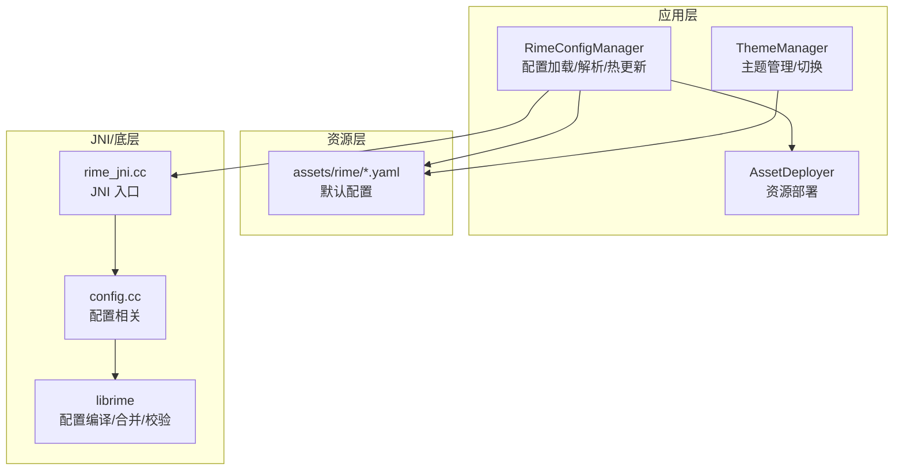
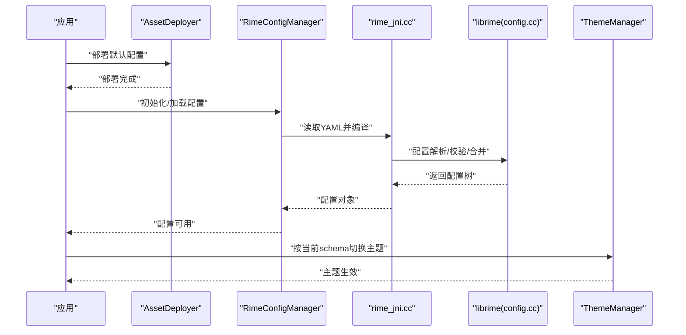
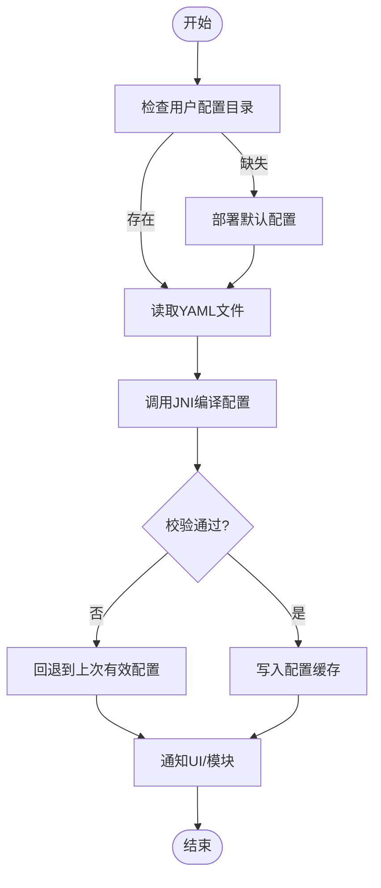
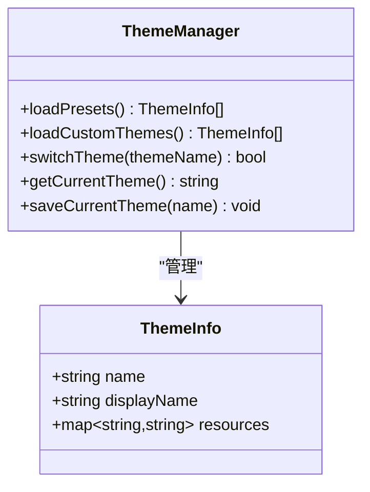
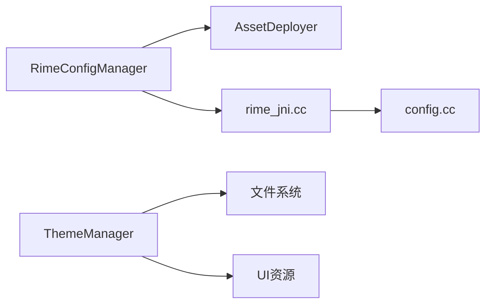

# 配置管理

<cite>
**本文引用的文件**   
- [RimeConfigManager.kt](file://app/src/main/java/com/ziyou/ime/config/RimeConfigManager.kt)
- [ThemeManager.kt](file://app/src/main/java/com/ziyou/ime/config/ThemeManager.kt)
- [AssetDeployer.kt](file://app/src/main/java/com/ziyou/ime/config/AssetDeployer.kt)
- [default.yaml](file://app/src/main/assets/rime/default.yaml)
- [cangjie5.schema.yaml](file://app/src/main/assets/rime/cangjie5.schema.yaml)
- [luna_pinyin.schema.yaml](file://app/src/main/assets/rime/luna_pinyin.schema.yaml)
- [t9.schema.yaml](file://app/src/main/assets/rime/t9.schema.yaml)
- [symbols.yaml](file://app/src/main/assets/rime/symbols.yaml)
- [rime_jni.cc](file://app/src/main/jni/librime_jni/rime_jni.cc)
- [config.cc](file://app/src/main/jni/librime_jni/config.cc)
</cite>

## 目录
1. [简介](#简介)
2. [项目结构](#项目结构)
3. [核心组件](#核心组件)
4. [架构总览](#架构总览)
5. [详细组件分析](#详细组件分析)
6. [依赖关系分析](#依赖关系分析)
7. [性能考量](#性能考量)
8. [故障排查指南](#故障排查指南)
9. [结论](#结论)
10. [附录](#附录)

## 简介
本技术文档围绕输入法的配置管理系统展开，重点解释 RimeConfigManager 的配置加载、解析与热更新机制；阐述 ThemeManager 的主题管理能力（预设主题、自定义主题与动态切换）；说明 YAML 配置文件结构与语法规范（schema、词典设置、插件参数）；明确配置优先级与覆盖规则；给出配置验证与错误处理策略；并提供新增配置项、扩展配置格式的方法，以及配置备份、恢复与迁移的实现思路。最后总结配置优化最佳实践与常见问题解决方案。

## 项目结构
本项目采用分层组织：Android 应用层负责资源部署与配置管理，JNI 层桥接底层 librime，assets 中存放默认 YAML 配置。关键路径如下：
- app/src/main/java/com/ziyou/ime/config：配置与主题管理
- app/src/main/assets/rime：默认 YAML 配置集
- app/src/main/jni/librime_jni：JNI 接口与配置相关实现

图表来源
- [RimeConfigManager.kt](file://app/src/main/java/com/ziyou/ime/config/RimeConfigManager.kt)
- [ThemeManager.kt](file://app/src/main/java/com/ziyou/ime/config/ThemeManager.kt)
- [AssetDeployer.kt](file://app/src/main/java/com/ziyou/ime/config/AssetDeployer.kt)
- [default.yaml](file://app/src/main/assets/rime/default.yaml)
- [rime_jni.cc](file://app/src/main/jni/librime_jni/rime_jni.cc)
- [config.cc](file://app/src/main/jni/librime_jni/config.cc)

章节来源
- [RimeConfigManager.kt](file://app/src/main/java/com/ziyou/ime/config/RimeConfigManager.kt)
- [ThemeManager.kt](file://app/src/main/java/com/ziyou/ime/config/ThemeManager.kt)
- [AssetDeployer.kt](file://app/src/main/java/com/ziyou/ime/config/AssetDeployer.kt)
- [default.yaml](file://app/src/main/assets/rime/default.yaml)

## 核心组件
- RimeConfigManager：负责从 assets 部署默认配置到用户数据目录，读取并解析 YAML，提供热更新能力，维护配置缓存与变更通知。
- ThemeManager：管理主题集合（预设与自定义），支持动态切换与持久化，渲染时按当前主题生效。
- AssetDeployer：将 assets 中的默认 YAML 安全地部署到可写目录，确保首次启动或版本升级时的正确初始化。

章节来源
- [RimeConfigManager.kt](file://app/src/main/java/com/ziyou/ime/config/RimeConfigManager.kt)
- [ThemeManager.kt](file://app/src/main/java/com/ziyou/ime/config/ThemeManager.kt)
- [AssetDeployer.kt](file://app/src/main/java/com/ziyou/ime/config/AssetDeployer.kt)

## 架构总览
整体流程：应用启动时由 AssetDeployer 部署默认 YAML；RimeConfigManager 读取并解析 YAML，通过 JNI 调用底层 librime 完成配置编译与校验；ThemeManager 基于当前 schema 与主题名加载主题资源并在 UI 层生效。

图表来源
- [AssetDeployer.kt](file://app/src/main/java/com/ziyou/ime/config/AssetDeployer.kt)
- [RimeConfigManager.kt](file://app/src/main/java/com/ziyou/ime/config/RimeConfigManager.kt)
- [rime_jni.cc](file://app/src/main/jni/librime_jni/rime_jni.cc)
- [config.cc](file://app/src/main/jni/librime_jni/config.cc)

## 详细组件分析

### RimeConfigManager：配置加载、解析与热更新
- 职责
  - 从用户数据目录加载 YAML 配置，必要时回退至 assets 默认配置。
  - 通过 JNI 调用 librime 进行配置编译、合并与校验。
  - 维护内存中的配置缓存，支持增量热更新与事件通知。
- 关键流程
  - 初始化阶段：检查用户目录是否存在必要文件，不存在则触发部署。
  - 加载阶段：读取 YAML -> 调用 JNI -> 构建配置对象 -> 缓存。
  - 热更新阶段：监听文件变更或主动触发重载，重新编译并替换缓存。
- 数据结构与复杂度
  - 配置以树形结构表示，常见操作为查找与遍历，时间复杂度 O(n)。
  - 热更新避免全量重建，仅对变更片段进行增量编译，降低开销。
- 错误处理
  - YAML 语法错误：捕获并记录日志，回退到上次有效配置。
  - 依赖缺失或循环引用：上报错误并阻止热更新，提示修复。
- 扩展点
  - 新增配置项：在对应 schema 中添加字段，保持向后兼容的默认值。
  - 自定义校验器：在 JNI 层或上层增加校验逻辑，失败时阻断更新。

图表来源
- [RimeConfigManager.kt](file://app/src/main/java/com/ziyou/ime/config/RimeConfigManager.kt)
- [rime_jni.cc](file://app/src/main/jni/librime_jni/rime_jni.cc)
- [config.cc](file://app/src/main/jni/librime_jni/config.cc)

章节来源
- [RimeConfigManager.kt](file://app/src/main/java/com/ziyou/ime/config/RimeConfigManager.kt)
- [rime_jni.cc](file://app/src/main/jni/librime_jni/rime_jni.cc)
- [config.cc](file://app/src/main/jni/librime_jni/config.cc)

### ThemeManager：主题管理与动态切换
- 职责
  - 管理预设主题与自定义主题，提供查询、加载与切换接口。
  - 根据当前 schema 与主题名组合，定位主题资源并应用到 UI。
- 关键流程
  - 初始化：扫描预设主题目录，加载元信息。
  - 切换：校验主题有效性，加载样式资源，刷新界面。
  - 持久化：保存当前主题名，重启后恢复。
- 数据结构与复杂度
  - 主题集合使用映射表，查找复杂度 O(1)，切换过程主要受 IO 影响。
- 错误处理
  - 主题缺失或损坏：跳过该主题并记录日志，回退到默认主题。
  - 切换失败：保留原主题并提示错误。
- 扩展点
  - 新增主题：在主题目录添加资源与元数据，无需修改代码。
  - 动态主题：运行时生成主题资源并注册到管理器。

图表来源
- [ThemeManager.kt](file://app/src/main/java/com/ziyou/ime/config/ThemeManager.kt)

章节来源
- [ThemeManager.kt](file://app/src/main/java/com/ziyou/ime/config/ThemeManager.kt)

### AssetDeployer：资源部署
- 职责
  - 将 assets 中的默认 YAML 复制到用户数据目录，确保首次启动或版本升级后的正确性。
  - 处理冲突与权限问题，保证部署原子性与一致性。
- 关键流程
  - 检测目标目录与文件版本，必要时执行增量更新。
  - 复制完成后校验完整性，失败则重试或回滚。
- 错误处理
  - 权限不足：提示用户授予存储权限。
  - 磁盘空间不足：提示清理空间并重试。

章节来源
- [AssetDeployer.kt](file://app/src/main/java/com/ziyou/ime/config/AssetDeployer.kt)

### YAML 配置结构与语法规范
- default.yaml：全局默认配置，包含键盘布局、候选词显示、快捷键等。
- *.schema.yaml：各输入法方案定义，包括键位映射、转写规则、过滤器等。
- symbols.yaml：符号表与快捷标点配置。
- 语法要点
  - 使用缩进表示层级，键值对用冒号分隔。
  - 支持注释、数组、映射与引用。
  - 可通过 include/extend 机制合并多个配置。
- 示例文件参考
  - [default.yaml](file://app/src/main/assets/rime/default.yaml)
  - [cangjie5.schema.yaml](file://app/src/main/assets/rime/cangjie5.schema.yaml)
  - [luna_pinyin.schema.yaml](file://app/src/main/assets/rime/luna_pinyin.schema.yaml)
  - [t9.schema.yaml](file://app/src/main/assets/rime/t9.schema.yaml)
  - [symbols.yaml](file://app/src/main/assets/rime/symbols.yaml)

章节来源
- [default.yaml](file://app/src/main/assets/rime/default.yaml)
- [cangjie5.schema.yaml](file://app/src/main/assets/rime/cangjie5.schema.yaml)
- [luna_pinyin.schema.yaml](file://app/src/main/assets/rime/luna_pinyin.schema.yaml)
- [t9.schema.yaml](file://app/src/main/assets/rime/t9.schema.yaml)
- [symbols.yaml](file://app/src/main/assets/rime/symbols.yaml)

## 依赖关系分析
- 组件耦合
  - RimeConfigManager 依赖 AssetDeployer 完成初始部署，依赖 JNI 层进行配置编译。
  - ThemeManager 依赖文件系统与 UI 资源，与 RimeConfigManager 解耦但共享 schema 信息。
- 外部依赖
  - librime 提供配置编译、合并与校验能力。
  - Android 存储 API 用于读写用户数据目录。
- 潜在循环依赖
  - 通过接口隔离避免循环，如配置加载与主题切换独立。

图表来源
- [RimeConfigManager.kt](file://app/src/main/java/com/ziyou/ime/config/RimeConfigManager.kt)
- [AssetDeployer.kt](file://app/src/main/java/com/ziyou/ime/config/AssetDeployer.kt)
- [rime_jni.cc](file://app/src/main/jni/librime_jni/rime_jni.cc)
- [config.cc](file://app/src/main/jni/librime_jni/config.cc)
- [ThemeManager.kt](file://app/src/main/java/com/ziyou/ime/config/ThemeManager.kt)

章节来源
- [RimeConfigManager.kt](file://app/src/main/java/com/ziyou/ime/config/RimeConfigManager.kt)
- [ThemeManager.kt](file://app/src/main/java/com/ziyou/ime/config/ThemeManager.kt)
- [AssetDeployer.kt](file://app/src/main/java/com/ziyou/ime/config/AssetDeployer.kt)
- [rime_jni.cc](file://app/src/main/jni/librime_jni/rime_jni.cc)
- [config.cc](file://app/src/main/jni/librime_jni/config.cc)

## 性能考量
- 配置加载
  - 首次启动可能耗时较长，建议异步加载并展示进度。
  - 使用缓存减少重复解析，仅在文件变更时重新编译。
- 热更新
  - 增量更新优于全量重建，避免 UI 卡顿。
  - 批量操作合并多次写入，降低 I/O 压力。
- 主题切换
  - 预加载常用主题资源，切换时直接应用。
  - 避免在主线程执行重 IO，使用后台线程加载。

## 故障排查指南
- 常见问题
  - YAML 语法错误：检查缩进与键值格式，使用校验工具验证。
  - 配置未生效：确认用户目录文件是否被覆盖，检查权限。
  - 主题切换失败：核对主题名称与资源完整性，查看日志。
- 调试步骤
  - 启用详细日志，观察配置编译与校验过程。
  - 对比 assets 默认配置与用户目录差异，定位异常。
  - 逐步禁用插件或过滤器，缩小问题范围。

章节来源
- [RimeConfigManager.kt](file://app/src/main/java/com/ziyou/ime/config/RimeConfigManager.kt)
- [ThemeManager.kt](file://app/src/main/java/com/ziyou/ime/config/ThemeManager.kt)
- [AssetDeployer.kt](file://app/src/main/java/com/ziyou/ime/config/AssetDeployer.kt)

## 结论
本配置管理系统通过清晰的组件划分与 JNI 桥接，实现了高效的配置加载、解析与热更新。ThemeManager 提供了灵活的主题管理能力。遵循 YAML 规范与优先级规则，结合完善的错误处理与性能优化，确保了系统的稳定性与可扩展性。

## 附录
- 新增配置项步骤
  - 在对应 schema 中添加字段与默认值。
  - 在 RimeConfigManager 中增加校验与解析逻辑。
  - 更新文档与测试用例。
- 配置备份与恢复
  - 定期备份用户目录 YAML 文件。
  - 恢复时先校验完整性，再替换现有配置。
- 配置迁移
  - 版本号控制，升级时执行迁移脚本。
  - 保持向后兼容，废弃字段标记为可选。