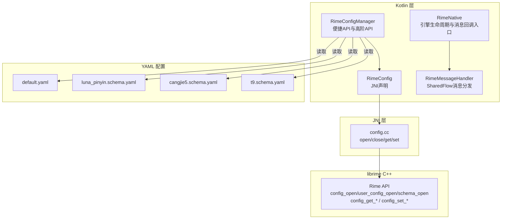
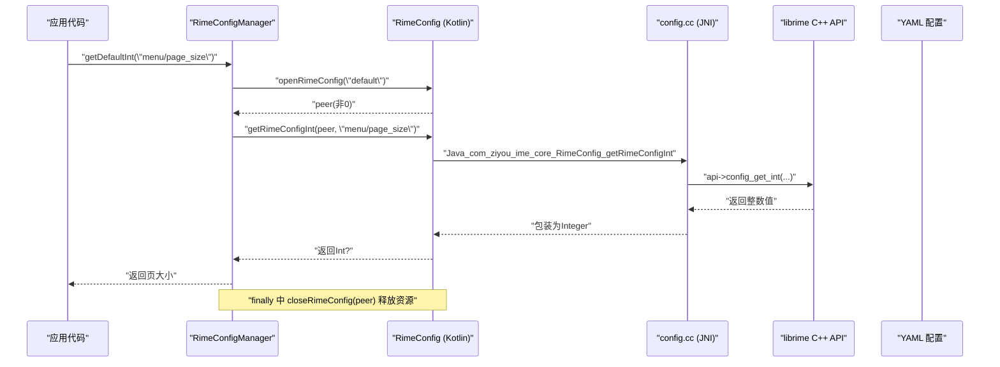
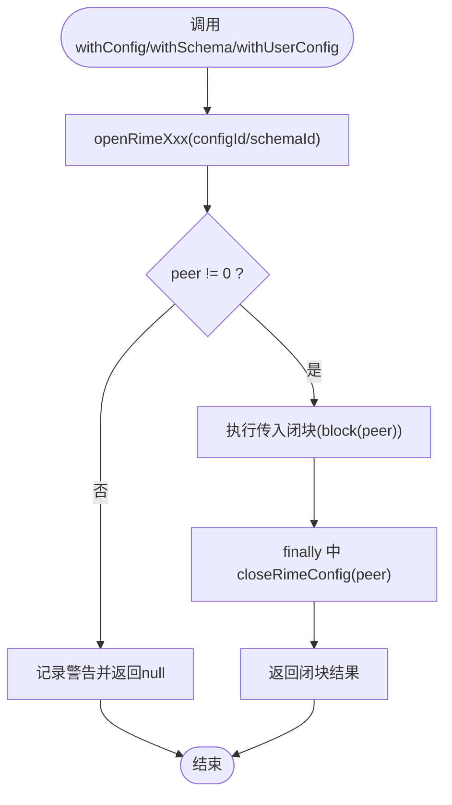
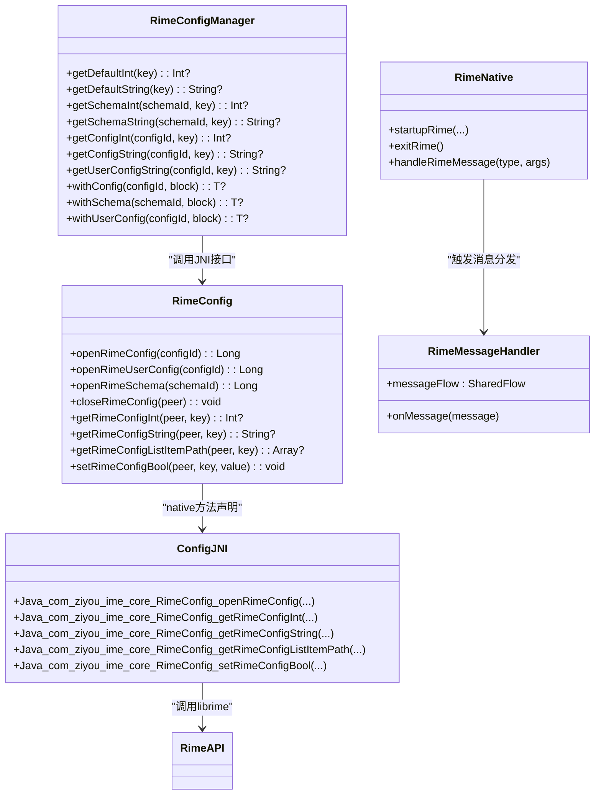

# Rime 配置管理

<cite>
**本文引用的文件**   
- [RimeConfigManager.kt](file://app/src/main/java/com/ziyou/ime/config/RimeConfigManager.kt)
- [RimeConfig.kt](file://app/src/main/java/com/ziyou/ime/core/RimeConfig.kt)
- [config.cc](file://app/src/main/jni/librime_jni/config.cc)
- [default.yaml](file://app/src/main/assets/rime/default.yaml)
- [luna_pinyin.schema.yaml](file://app/src/main/assets/rime/luna_pinyin.schema.yaml)
- [cangjie5.schema.yaml](file://app/src/main/assets/rime/cangjie5.schema.yaml)
- [t9.schema.yaml](file://app/src/main/assets/rime/t9.schema.yaml)
- [RimeNative.kt](file://app/src/main/java/com/ziyou/ime/core/RimeNative.kt)
- [RimeMessage.kt](file://app/src/main/java/com/ziyou/ime/core/RimeMessage.kt)
</cite>

## 目录
1. [简介](#简介)
2. [项目结构](#项目结构)
3. [核心组件](#核心组件)
4. [架构总览](#架构总览)
5. [详细组件分析](#详细组件分析)
6. [依赖关系分析](#依赖关系分析)
7. [性能考量](#性能考量)
8. [故障排查指南](#故障排查指南)
9. [结论](#结论)
10. [附录：常用配置项与扩展指南](#附录常用配置项与扩展指南)

## 简介
本技术文档围绕 Rime 配置管理系统，系统性解析 RimeConfigManager 的设计模式与实现原理，涵盖默认配置(default.yaml)与方案配置(schema)的读取机制、配置项路径解析、数据类型转换（Int/String/Boolean）、错误处理与资源管理。同时说明 withConfig、withSchema、withUserConfig 等高阶 API 的使用模式，以及基于消息通知的配置变更传播机制。文末提供常见配置项读取示例与扩展新配置类型的实践建议。

## 项目结构
- Kotlin 层封装 JNI 接口，提供安全易用的配置读写 API
- JNI 层桥接 librime C++ API，完成配置打开、读取、写入与资源释放
- YAML 配置文件位于 assets/rime，包含默认配置与各输入方案的 schema 定义
- 消息系统通过 SharedFlow 将引擎状态变化（如方案切换、选项变更）广播给 UI

图表来源 
- [RimeConfigManager.kt:1-200](file://app/src/main/java/com/ziyou/ime/config/RimeConfigManager.kt#L1-L200)
- [RimeConfig.kt:1-104](file://app/src/main/java/com/ziyou/ime/core/RimeConfig.kt#L1-L104)
- [config.cc:1-111](file://app/src/main/jni/librime_jni/config.cc#L1-L111)
- [default.yaml:1-144](file://app/src/main/assets/rime/default.yaml#L1-L144)
- [luna_pinyin.schema.yaml:1-158](file://app/src/main/assets/rime/luna_pinyin.schema.yaml#L1-L158)
- [cangjie5.schema.yaml:1-111](file://app/src/main/assets/rime/cangjie5.schema.yaml#L1-L111)
- [t9.schema.yaml:1-126](file://app/src/main/assets/rime/t9.schema.yaml#L1-L126)

章节来源
- [RimeConfigManager.kt:1-200](file://app/src/main/java/com/ziyou/ime/config/RimeConfigManager.kt#L1-L200)
- [RimeConfig.kt:1-104](file://app/src/main/java/com/ziyou/ime/core/RimeConfig.kt#L1-L104)
- [config.cc:1-111](file://app/src/main/jni/librime_jni/config.cc#L1-L111)
- [default.yaml:1-144](file://app/src/main/assets/rime/default.yaml#L1-L144)
- [luna_pinyin.schema.yaml:1-158](file://app/src/main/assets/rime/luna_pinyin.schema.yaml#L1-L158)
- [cangjie5.schema.yaml:1-111](file://app/src/main/assets/rime/cangjie5.schema.yaml#L1-L111)
- [t9.schema.yaml:1-126](file://app/src/main/assets/rime/t9.schema.yaml#L1-L126)

## 核心组件
- RimeConfigManager：对外暴露统一配置访问 API，封装 open/close 生命周期，提供便捷方法与高阶 with* 方法
- RimeConfig：JNI 接口声明，定义 open/close 及 get/set 方法签名
- config.cc：JNI 实现，调用 librime 的 config_open/user_config_open/schema_open 与 get/set 系列函数
- default.yaml 与各 schema.yaml：定义菜单分页大小、方案名称、开关等配置项
- RimeNative + RimeMessage：引擎启动、消息回调与 SharedFlow 分发，用于通知 UI 层配置或状态变更

章节来源
- [RimeConfigManager.kt:1-200](file://app/src/main/java/com/ziyou/ime/config/RimeConfigManager.kt#L1-L200)
- [RimeConfig.kt:1-104](file://app/src/main/java/com/ziyou/ime/core/RimeConfig.kt#L1-L104)
- [config.cc:1-111](file://app/src/main/jni/librime_jni/config.cc#L1-L111)
- [RimeNative.kt:1-170](file://app/src/main/java/com/ziyou/ime/core/RimeNative.kt#L1-L170)
- [RimeMessage.kt:1-42](file://app/src/main/java/com/ziyou/ime/core/RimeMessage.kt#L1-L42)

## 架构总览
下图展示从 Kotlin 到 JNI 再到 librime 的完整调用链，以及 YAML 配置如何被加载与读取。

图表来源 
- [RimeConfigManager.kt:34-100](file://app/src/main/java/com/ziyou/ime/config/RimeConfigManager.kt#L34-L100)
- [RimeConfig.kt:36-73](file://app/src/main/java/com/ziyou/ime/core/RimeConfig.kt#L36-L73)
- [config.cc:59-71](file://app/src/main/jni/librime_jni/config.cc#L59-L71)
- [default.yaml:26-28](file://app/src/main/assets/rime/default.yaml#L26-L28)

## 详细组件分析

### RimeConfigManager：配置访问门面与高阶 API
- 设计要点
  - 统一入口：提供 getDefaultXxx、getSchemaXxx、getConfigXxx、getUserConfigXxx 等便捷方法
  - 资源管理：所有 open 操作均在 try/finally 中确保 close，避免内存泄漏
  - 错误处理：open 失败时记录警告并返回空值，保证上层调用稳定
  - 高阶 API：withConfig/withSchema/withUserConfig 以闭包形式传入 peer，简化生命周期管理
- 关键流程
  - 读取默认配置：openRimeConfig("default") -> getRimeConfigInt/String -> close
  - 读取方案配置：openRimeSchema(schemaId) -> getRimeConfigInt/String -> close
  - 用户配置读取：openRimeUserConfig(configId) -> getRimeConfigString -> close
  - 列表路径枚举：getRimeConfigListItemPath 返回子路径数组，便于遍历 schema_list 等
  - 布尔写入：setRimeConfigBool 支持运行时修改布尔配置项

图表来源 
- [RimeConfigManager.kt:161-198](file://app/src/main/java/com/ziyou/ime/config/RimeConfigManager.kt#L161-L198)
- [RimeConfig.kt:36-62](file://app/src/main/java/com/ziyou/ime/core/RimeConfig.kt#L36-L62)
- [config.cc:11-57](file://app/src/main/jni/librime_jni/config.cc#L11-L57)

章节来源
- [RimeConfigManager.kt:1-200](file://app/src/main/java/com/ziyou/ime/config/RimeConfigManager.kt#L1-L200)

### RimeConfig：JNI 接口声明
- 职责
  - 声明 open/close 与 get/set 外部方法
  - 明确 peer 指针的生命周期与类型约束
  - 提供 Int?/String?/Array<String>? 等返回值语义
- 关键点
  - 库加载：init 块尝试加载 rime_jni，兼容已加载场景
  - 线程安全：由上层调度器保证单线程调用（参见 RimeNative 注释）

章节来源
- [RimeConfig.kt:1-104](file://app/src/main/java/com/ziyou/ime/core/RimeConfig.kt#L1-L104)

### config.cc：JNI 实现与 librime 集成
- 职责
  - 映射 Kotlin 外部方法到 C++ 函数
  - 使用 rime_get_api() 获取 librime 接口
  - 完成配置对象创建、查询与销毁
- 关键点
  - openRimeConfig/openRimeUserConfig/openRimeSchema：分别调用对应 api->xxx_open
  - getRimeConfigInt：调用 api->config_get_int，返回 Integer 或 null
  - getRimeConfigString：调用 api->config_get_cstring，返回字符串或 null
  - getRimeConfigListItemPath：遍历列表项，返回子路径数组
  - setRimeConfigBool：调用 api->config_set_bool 写入布尔值

章节来源
- [config.cc:1-111](file://app/src/main/jni/librime_jni/config.cc#L1-L111)

### YAML 配置结构与读取路径
- default.yaml
  - menu.page_size：菜单分页大小
  - switcher.save_options：保存的开关集合
  - key_binder.bindings：按键绑定规则
- luna_pinyin.schema.yaml
  - schema.name：方案显示名称
  - engine.processors/segmentors/translators/filters：引擎管线配置
  - predictor.*：预测候选数量与迭代次数
- cangjie5.schema.yaml / t9.schema.yaml
  - 各自定义输入法特性与 speller.algebra 派生规则

章节来源
- [default.yaml:1-144](file://app/src/main/assets/rime/default.yaml#L1-L144)
- [luna_pinyin.schema.yaml:1-158](file://app/src/main/assets/rime/luna_pinyin.schema.yaml#L1-L158)
- [cangjie5.schema.yaml:1-111](file://app/src/main/assets/rime/cangjie5.schema.yaml#L1-L111)
- [t9.schema.yaml:1-126](file://app/src/main/assets/rime/t9.schema.yaml#L1-L126)

## 依赖关系分析
- Kotlin 层依赖
  - RimeConfigManager 依赖 RimeConfig（JNI 声明）
  - RimeNative 负责引擎生命周期与消息回调入口
  - RimeMessageHandler 通过 SharedFlow 分发消息
- JNI 层依赖
  - config.cc 依赖 librime 的 rime_api.h 提供的配置与数据访问接口
- 配置依赖
  - default.yaml 与 schema.yaml 提供键值对与列表结构，供上层按路径读取

图表来源 
- [RimeConfigManager.kt:1-200](file://app/src/main/java/com/ziyou/ime/config/RimeConfigManager.kt#L1-L200)
- [RimeConfig.kt:1-104](file://app/src/main/java/com/ziyou/ime/core/RimeConfig.kt#L1-L104)
- [config.cc:1-111](file://app/src/main/jni/librime_jni/config.cc#L1-L111)
- [RimeNative.kt:1-170](file://app/src/main/java/com/ziyou/ime/core/RimeNative.kt#L1-L170)
- [RimeMessage.kt:1-42](file://app/src/main/java/com/ziyou/ime/core/RimeMessage.kt#L1-L42)

章节来源
- [RimeConfigManager.kt:1-200](file://app/src/main/java/com/ziyou/ime/config/RimeConfigManager.kt#L1-L200)
- [RimeConfig.kt:1-104](file://app/src/main/java/com/ziyou/ime/core/RimeConfig.kt#L1-L104)
- [config.cc:1-111](file://app/src/main/jni/librime_jni/config.cc#L1-L111)
- [RimeNative.kt:1-170](file://app/src/main/java/com/ziyou/ime/core/RimeNative.kt#L1-L170)
- [RimeMessage.kt:1-42](file://app/src/main/java/com/ziyou/ime/core/RimeMessage.kt#L1-L42)

## 性能考量
- 频繁 open/close 开销：建议在批量读取时使用 withConfig/withSchema 复用 peer，减少 JNI 跨界与对象分配
- 列表遍历成本：getRimeConfigListItemPath 会遍历子节点，应仅在需要时调用
- 内存释放：finally 中 close 确保及时释放 native 资源；必要时可调用 trimNativeHeap 归还空闲页
- 线程模型：JNI 方法非线程安全，需通过调度器串行调用，避免竞争条件

[本节为通用指导，不直接分析具体文件]

## 故障排查指南
- 常见问题
  - 无法打开配置：检查 configId/schemaId 是否正确，确认 assets/rime 下存在对应 YAML
  - 读取为空：确认键路径是否存在且类型匹配（Int/String/Boolean）
  - 崩溃或异常：检查是否忘记 close peer，或 ABI 不匹配导致库加载失败
- 定位手段
  - 查看日志输出：RimeConfigManager 在 open 失败时记录警告
  - 验证库加载：RimeNative.isLoaded 标志位与 init 块日志
  - 消息订阅：通过 RimeMessageHandler.messageFlow 观察 schema/option/deploy 事件

章节来源
- [RimeConfigManager.kt:55-113](file://app/src/main/java/com/ziyou/ime/config/RimeConfigManager.kt#L55-L113)
- [RimeNative.kt:18-40](file://app/src/main/java/com/ziyou/ime/core/RimeNative.kt#L18-L40)
- [RimeMessage.kt:29-42](file://app/src/main/java/com/ziyou/ime/core/RimeMessage.kt#L29-L42)

## 结论
RimeConfigManager 以简洁安全的 Kotlin API 封装了 JNI 与 librime 的配置能力，结合 with* 高阶 API 有效管理资源生命周期。配合 YAML 配置与消息通知机制，实现了灵活可扩展的配置管理与状态同步。遵循本文的最佳实践与排障建议，可在复杂场景中稳定高效地读取与更新 Rime 配置。

[本节为总结性内容，不直接分析具体文件]

## 附录：常用配置项与扩展指南

### 常用配置项读取示例
- 读取菜单分页大小（默认配置）
  - 路径：menu/page_size
  - 方法：RimeConfigManager.getDefaultInt("menu/page_size")
  - 参考：[RimeConfigManager.kt:34-36](file://app/src/main/java/com/ziyou/ime/config/RimeConfigManager.kt#L34-L36), [default.yaml:26-28](file://app/src/main/assets/rime/default.yaml#L26-L28)
- 读取方案名称（方案配置）
  - 路径：schema/name
  - 方法：RimeConfigManager.getSchemaString("luna_pinyin", "schema/name")
  - 参考：[RimeConfigManager.kt:74-85](file://app/src/main/java/com/ziyou/ime/config/RimeConfigManager.kt#L74-L85), [luna_pinyin.schema.yaml:4-7](file://app/src/main/assets/rime/luna_pinyin.schema.yaml#L4-L7)
- 枚举 schema_list 子路径
  - 路径：schema_list
  - 方法：RimeConfigManager.getConfigListPaths("default", "schema_list")
  - 参考：[RimeConfigManager.kt:115-126](file://app/src/main/java/com/ziyou/ime/config/RimeConfigManager.kt#L115-L126)

### 配置变更的通知机制
- 消息类型
  - SchemaMessage：方案切换
  - OptionMessage：选项变更（如 ascii_mode/simplification）
  - DeployMessage：部署状态
- 订阅方式
  - 通过 RimeMessageHandler.messageFlow 订阅 SharedFlow
  - 在 handleRimeMessage 中将 JNI 回调转换为消息并分发
- 参考
  - [RimeMessage.kt:11-42](file://app/src/main/java/com/ziyou/ime/core/RimeMessage.kt#L11-L42)
  - [RimeNative.kt:158-169](file://app/src/main/java/com/ziyou/ime/core/RimeNative.kt#L158-L169)

### 扩展新配置类型支持
- 新增读取类型（例如 Float/Long）
  - 在 RimeConfig.kt 中添加外部方法声明
  - 在 config.cc 中实现 JNI 函数，调用对应的 librime 接口或进行类型转换
  - 在 RimeConfigManager.kt 中提供便捷方法，封装 open/close 与错误处理
- 新增写入类型（例如 String/Int）
  - 在 RimeConfig.kt 中添加 setRimeConfigXxx 外部方法
  - 在 config.cc 中实现 set 逻辑，确保类型安全与边界校验
- 注意事项
  - 保持 finally 中 close 的健壮性
  - 对缺失键或类型不匹配返回空值，避免上层崩溃
  - 在日志中记录关键错误信息，便于定位问题

章节来源
- [RimeConfigManager.kt:34-198](file://app/src/main/java/com/ziyou/ime/config/RimeConfigManager.kt#L34-L198)
- [RimeConfig.kt:64-103](file://app/src/main/java/com/ziyou/ime/core/RimeConfig.kt#L64-L103)
- [config.cc:59-111](file://app/src/main/jni/librime_jni/config.cc#L59-L111)
- [RimeMessage.kt:11-42](file://app/src/main/java/com/ziyou/ime/core/RimeMessage.kt#L11-L42)
- [RimeNative.kt:158-169](file://app/src/main/java/com/ziyou/ime/core/RimeNative.kt#L158-L169)