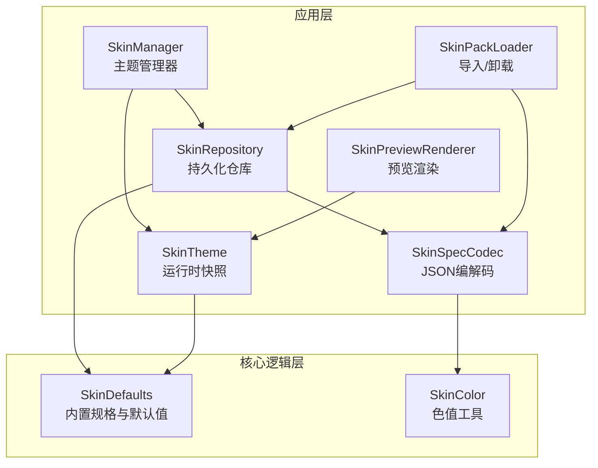
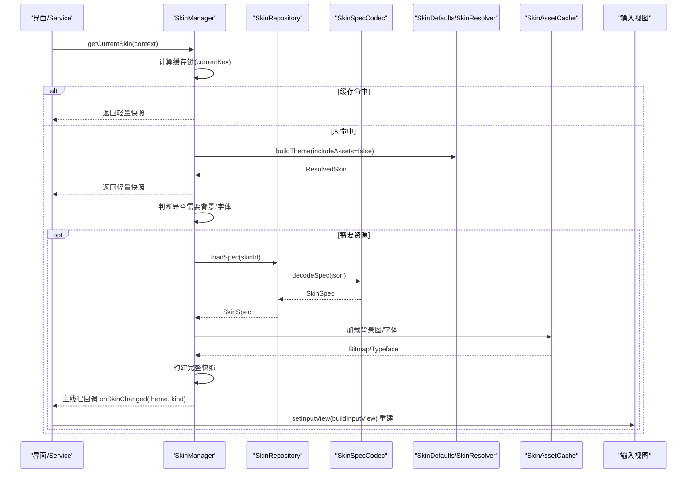
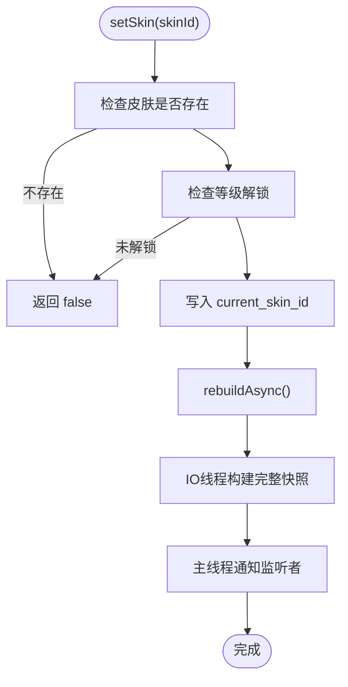
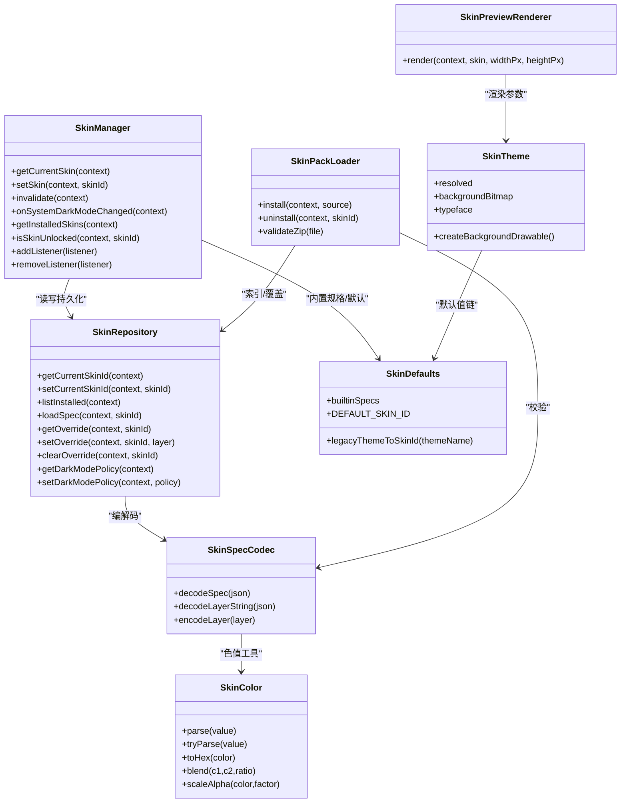

# 主题系统

<cite>
**本文引用的文件**   
- [SkinManager.kt](file://app/src/main/java/com/ziyou/ime/skin/SkinManager.kt)
- [SkinTheme.kt](file://app/src/main/java/com/ziyou/ime/skin/SkinTheme.kt)
- [SkinRepository.kt](file://app/src/main/java/com/ziyou/ime/skin/SkinRepository.kt)
- [SkinSpecCodec.kt](file://app/src/main/java/com/ziyou/ime/skin/SkinSpecCodec.kt)
- [SkinPackLoader.kt](file://app/src/main/java/com/ziyou/ime/skin/SkinPackLoader.kt)
- [SkinPreviewRenderer.kt](file://app/src/main/java/com/ziyou/ime/skin/SkinPreviewRenderer.kt)
- [SkinColor.kt](file://core-logic/src/main/java/com/ziyou/ime/core/skin/SkinColor.kt)
- [SkinDefaults.kt](file://core-logic/src/main/java/com/ziyou/ime/core/skin/SkinDefaults.kt)
- [ZiYouInputMethodService.kt](file://app/src/main/java/com/ziyou/ime/ime/ZiYouInputMethodService.kt)
</cite>

## 目录
1. [简介](#简介)
2. [项目结构](#项目结构)
3. [核心组件](#核心组件)
4. [架构总览](#架构总览)
5. [详细组件分析](#详细组件分析)
6. [依赖关系分析](#依赖关系分析)
7. [性能考量](#性能考量)
8. [故障排查指南](#故障排查指南)
9. [结论](#结论)
10. [附录：扩展与示例](#附录扩展与示例)

## 简介
本技术文档围绕输入法“主题系统”展开，系统性说明 SkinManager 的主题管理机制、内置皮肤（悬浮立体、云雾拟态、Material）的加载与切换流程、SkinSpec 皮肤规范定义（颜色、背景图、字体等）、SharedPreferences 持久化机制（当前主题保存、等级解锁规则验证、用户偏好同步）、皮肤预览渲染与热切换效果，以及性能优化策略。同时提供添加新皮肤、自定义颜色方案与实现动态主题切换的实践指引。

## 项目结构
主题系统由应用层 skin 包与 core-logic 层的皮肤数据模型共同组成：
- app 层负责运行时管理、持久化、资源加载、预览渲染与安装卸载
- core-logic 层提供纯 Kotlin 的皮肤数据结构、默认值与工具函数

图表来源
- [SkinManager.kt:1-239](file://app/src/main/java/com/ziyou/ime/skin/SkinManager.kt#L1-L239)
- [SkinRepository.kt:1-275](file://app/src/main/java/com/ziyou/ime/skin/SkinRepository.kt#L1-L275)
- [SkinSpecCodec.kt:1-273](file://app/src/main/java/com/ziyou/ime/skin/SkinSpecCodec.kt#L1-L273)
- [SkinPackLoader.kt:1-248](file://app/src/main/java/com/ziyou/ime/skin/SkinPackLoader.kt#L1-L248)
- [SkinPreviewRenderer.kt:1-139](file://app/src/main/java/com/ziyou/ime/skin/SkinPreviewRenderer.kt#L1-L139)
- [SkinTheme.kt:1-126](file://app/src/main/java/com/ziyou/ime/skin/SkinTheme.kt#L1-L126)
- [SkinDefaults.kt:1-262](file://core-logic/src/main/java/com/ziyou/ime/core/skin/SkinDefaults.kt#L1-L262)
- [SkinColor.kt:1-62](file://core-logic/src/main/java/com/ziyou/ime/core/skin/SkinColor.kt#L1-L62)

章节来源
- [SkinManager.kt:1-239](file://app/src/main/java/com/ziyou/ime/skin/SkinManager.kt#L1-L239)
- [SkinRepository.kt:1-275](file://app/src/main/java/com/ziyou/ime/skin/SkinRepository.kt#L1-L275)
- [SkinDefaults.kt:1-262](file://core-logic/src/main/java/com/ziyou/ime/core/skin/SkinDefaults.kt#L1-L262)

## 核心组件
- SkinManager：门面式主题管理器，维护不可变快照、变更监听、异步重建与切换判定（FULL/STYLE_ONLY）。读路径 O(1) 命中缓存；写路径 IO 线程解析 + 主线程通知。
- SkinTheme：运行时快照，聚合已解析的颜色、尺寸、字体、阴影、背景图等，供视图消费。
- SkinRepository：持久化仓库，管理当前皮肤 id、深浅色策略、已安装索引、用户覆盖层与旧版迁移。
- SkinSpecCodec：skin.json 与用户覆盖 JSON 的编解码器，含色值字符串到 ARGB Int 转换与校验。
- SkinPackLoader：.zyskin 皮肤包的导入与卸载，包含包体校验、解压就位、原子替换与回滚。
- SkinPreviewRenderer：离屏绘制迷你键盘缩略图，用于设置页网格与编辑器实时预览。
- SkinDefaults：内置三套皮肤（悬浮立体、云雾拟态、Material）的规格与默认值链。
- SkinColor：纯 Kotlin 色值工具，支持解析、编码、混合与 Alpha 缩放。

章节来源
- [SkinManager.kt:1-239](file://app/src/main/java/com/ziyou/ime/skin/SkinManager.kt#L1-L239)
- [SkinTheme.kt:1-126](file://app/src/main/java/com/ziyou/ime/skin/SkinTheme.kt#L1-L126)
- [SkinRepository.kt:1-275](file://app/src/main/java/com/ziyou/ime/skin/SkinRepository.kt#L1-L275)
- [SkinSpecCodec.kt:1-273](file://app/src/main/java/com/ziyou/ime/skin/SkinSpecCodec.kt#L1-L273)
- [SkinPackLoader.kt:1-248](file://app/src/main/java/com/ziyou/ime/skin/SkinPackLoader.kt#L1-L248)
- [SkinPreviewRenderer.kt:1-139](file://app/src/main/java/com/ziyou/ime/skin/SkinPreviewRenderer.kt#L1-L139)
- [SkinDefaults.kt:1-262](file://core-logic/src/main/java/com/ziyou/ime/core/skin/SkinDefaults.kt#L1-L262)
- [SkinColor.kt:1-62](file://core-logic/src/main/java/com/ziyou/ime/core/skin/SkinColor.kt#L1-L62)

## 架构总览
主题系统的控制流以 SkinManager 为中心，结合 Repository 的持久化与 SpecCodec 的解析，形成“读取快照—后台补齐资源—主线程通知—视图重建”的闭环。

图表来源
- [SkinManager.kt:66-122](file://app/src/main/java/com/ziyou/ime/skin/SkinManager.kt#L66-L122)
- [SkinRepository.kt:103-116](file://app/src/main/java/com/ziyou/ime/skin/SkinRepository.kt#L103-L116)
- [SkinSpecCodec.kt:34-65](file://app/src/main/java/com/ziyou/ime/skin/SkinSpecCodec.kt#L34-L65)
- [SkinDefaults.kt:159-246](file://core-logic/src/main/java/com/ziyou/ime/core/skin/SkinDefaults.kt#L159-L246)

## 详细组件分析

### SkinManager：主题管理与切换
- 职责
  - 维护 volatile 快照（theme + key），读路径 O(1) 命中
  - 写路径 setSkin/invalidate/onSystemDarkModeChanged 触发后台重建
  - 变更类型判定 changeKind：仅样式变化走 STYLE_ONLY，否则 FULL
  - 列表与解锁：getInstalledSkins/getUnlockedSkinIds/isSkinUnlocked
- 关键流程
  - getCurrentSkin：先尝试命中缓存，未命中则构建轻量快照并异步补齐资源
  - setSkin：校验存在性与等级解锁，写入 current_skin_id，触发 rebuildAsync
  - rebuildAsync：IO 线程构建完整快照，主线程更新缓存并通知监听者
  - changeKind：比较 id、背景图/字体引用、背景节点与布局类尺寸，决定 FULL 或 STYLE_ONLY

图表来源
- [SkinManager.kt:91-111](file://app/src/main/java/com/ziyou/ime/skin/SkinManager.kt#L91-L111)
- [SkinManager.kt:192-212](file://app/src/main/java/com/ziyou/ime/skin/SkinManager.kt#L192-L212)
- [SkinManager.kt:220-237](file://app/src/main/java/com/ziyou/ime/skin/SkinManager.kt#L220-L237)

章节来源
- [SkinManager.kt:31-137](file://app/src/main/java/com/ziyou/ime/skin/SkinManager.kt#L31-L137)
- [SkinManager.kt:151-189](file://app/src/main/java/com/ziyou/ime/skin/SkinManager.kt#L151-L189)
- [SkinManager.kt:192-237](file://app/src/main/java/com/ziyou/ime/skin/SkinManager.kt#L192-L237)

### SkinTheme：运行时快照
- 字段组织：颜色、尺寸、字体、阴影、透明度、工具栏参数等均在解析期落定
- 便捷属性：keyTypeface/textTypeface/toolbarTypeface 自动处理粗体合成
- 背景 Drawable：createBackgroundDrawable 将背景图与压暗遮罩组合为 Drawable

章节来源
- [SkinTheme.kt:21-110](file://app/src/main/java/com/ziyou/ime/skin/SkinTheme.kt#L21-L110)

### SkinRepository：持久化与索引
- SharedPreferences 存储
  - current_skin_id：当前皮肤 id
  - installed_index：已安装皮肤索引（JSON 数组）
  - override.<skinId>：用户覆盖层（稀疏 JSON）
  - dark_mode_policy：深浅色策略（followSystem/forceLight/forceDark）
- 内置与导入
  - 内置皮肤：内存规格，不落盘、不进索引、不可卸载
  - 导入皮肤：安装目录 skins/<skinId>/，包含 skin.json、images/、fonts/、preview.png
- 迁移与自愈
  - 旧版 ziyou_theme → 新版 ziyou_skin 一次性迁移
  - 内置皮肤 id 改名迁移（如 builtin.dark → yunwu）
  - 索引损坏时从磁盘扫描重建

章节来源
- [SkinRepository.kt:25-82](file://app/src/main/java/com/ziyou/ime/skin/SkinRepository.kt#L25-L82)
- [SkinRepository.kt:95-116](file://app/src/main/java/com/ziyou/ime/skin/SkinRepository.kt#L95-L116)
- [SkinRepository.kt:121-157](file://app/src/main/java/com/ziyou/ime/skin/SkinRepository.kt#L121-L157)
- [SkinRepository.kt:162-184](file://app/src/main/java/com/ziyou/ime/skin/SkinRepository.kt#L162-L184)
- [SkinRepository.kt:188-200](file://app/src/main/java/com/ziyou/ime/skin/SkinRepository.kt#L188-L200)
- [SkinRepository.kt:211-270](file://app/src/main/java/com/ziyou/ime/skin/SkinRepository.kt#L211-L270)

### SkinSpecCodec：皮肤规范编解码
- 解析 skin.json：meta（id/name/version/darkMode）、layer（colors/dimens/typography/effects/background/toolbar）
- 用户覆盖：稀疏层 JSON，仅非空字段写入
- 色值处理：#RRGGBB/#AARRGGBB 字符串 ↔ ARGB Int，非法抛异常
- 校验：调用 SkinSpecValidator（core-logic）统一校验

章节来源
- [SkinSpecCodec.kt:28-65](file://app/src/main/java/com/ziyou/ime/skin/SkinSpecCodec.kt#L28-L65)
- [SkinSpecCodec.kt:68-144](file://app/src/main/java/com/ziyou/ime/skin/SkinSpecCodec.kt#L68-L144)
- [SkinSpecCodec.kt:148-212](file://app/src/main/java/com/ziyou/ime/skin/SkinSpecCodec.kt#L148-L212)
- [SkinSpecCodec.kt:214-273](file://app/src/main/java/com/ziyou/ime/skin/SkinSpecCodec.kt#L214-L273)

### SkinPackLoader：导入与卸载
- 导入流程
  - 拷贝到临时文件（边拷边卡体积上限）
  - zip 全量校验（条目数/Zip Slip/扩展名白名单/skin.json 解析/引用资源存在性）
  - 解压 staging → 备份-替换原子就位 → 登记索引 → 清理缓存
  - 若重装的是当前皮肤，触发 SkinManager.invalidate
- 卸载流程
  - 删除目录、移除索引、清除覆盖、驱逐缓存
  - 若卸载的是当前皮肤，回退默认皮肤并失效快照

章节来源
- [SkinPackLoader.kt:39-87](file://app/src/main/java/com/ziyou/ime/skin/SkinPackLoader.kt#L39-L87)
- [SkinPackLoader.kt:93-109](file://app/src/main/java/com/ziyou/ime/skin/SkinPackLoader.kt#L93-L109)
- [SkinPackLoader.kt:122-175](file://app/src/main/java/com/ziyou/ime/skin/SkinPackLoader.kt#L122-L175)
- [SkinPackLoader.kt:181-244](file://app/src/main/java/com/ziyou/ime/skin/SkinPackLoader.kt#L181-L244)

### SkinPreviewRenderer：预览渲染
- 离屏绘制迷你键盘（候选栏 + 三行 QWERTY），不实例化真实视图
- 背景图优先，无图则使用键盘底色；按键阴影与边框按风格绘制
- 适用于设置页网格缩略图与自定义编辑器实时预览

章节来源
- [SkinPreviewRenderer.kt:19-128](file://app/src/main/java/com/ziyou/ime/skin/SkinPreviewRenderer.kt#L19-L128)

### SkinDefaults：内置皮肤与默认值
- 内置皮肤 id：ID_FLOAT3D（默认）、ID_YUNWU、ID_MATERIAL
- 配色与规格：云雾拟态（浅/深双套）、悬浮立体（浅/深双套）、Material（浅色）
- 默认值链：尺寸/字体/效果默认值与迁移前视图层常量一一对应

章节来源
- [SkinDefaults.kt:10-65](file://core-logic/src/main/java/com/ziyou/ime/core/skin/SkinDefaults.kt#L10-L65)
- [SkinDefaults.kt:66-154](file://core-logic/src/main/java/com/ziyou/ime/core/skin/SkinDefaults.kt#L66-L154)
- [SkinDefaults.kt:159-246](file://core-logic/src/main/java/com/ziyou/ime/core/skin/SkinDefaults.kt#L159-L246)

### SkinColor：色值工具
- 解析 #RRGGBB/#AARRGGBB 为 ARGB Int，宽容解析 tryParse
- 编码 ARGB Int 为 #AARRGGBB
- 混合 blend（功能键底色派生）、Alpha 缩放 scaleAlpha

章节来源
- [SkinColor.kt:9-62](file://core-logic/src/main/java/com/ziyou/ime/core/skin/SkinColor.kt#L9-L62)

## 依赖关系分析
- SkinManager 依赖 SkinRepository（持久化）、SkinDefaults（内置规格）、LevelEngine（解锁判定）
- SkinRepository 依赖 SkinSpecCodec（JSON 编解码）、SkinDefaults（内置与迁移）
- SkinPackLoader 依赖 SkinRepository（索引/覆盖）、SkinSpecCodec（校验）、SkinAssetCache（缓存驱逐）
- SkinPreviewRenderer 依赖 SkinTheme（渲染参数）
- ZiYouInputMethodService 通过 SkinChangeListener 接收主题变更并重建输入视图

图表来源
- [SkinManager.kt:31-137](file://app/src/main/java/com/ziyou/ime/skin/SkinManager.kt#L31-L137)
- [SkinRepository.kt:25-116](file://app/src/main/java/com/ziyou/ime/skin/SkinRepository.kt#L25-L116)
- [SkinSpecCodec.kt:28-144](file://app/src/main/java/com/ziyou/ime/skin/SkinSpecCodec.kt#L28-L144)
- [SkinPackLoader.kt:39-109](file://app/src/main/java/com/ziyou/ime/skin/SkinPackLoader.kt#L39-L109)
- [SkinPreviewRenderer.kt:19-128](file://app/src/main/java/com/ziyou/ime/skin/SkinPreviewRenderer.kt#L19-L128)
- [SkinTheme.kt:21-110](file://app/src/main/java/com/ziyou/ime/skin/SkinTheme.kt#L21-L110)
- [SkinDefaults.kt:10-65](file://core-logic/src/main/java/com/ziyou/ime/core/skin/SkinDefaults.kt#L10-L65)
- [SkinColor.kt:9-62](file://core-logic/src/main/java/com/ziyou/ime/core/skin/SkinColor.kt#L9-L62)

章节来源
- [ZiYouInputMethodService.kt:1364-1364](file://app/src/main/java/com/ziyou/ime/ime/ZiYouInputMethodService.kt#L1364-L1364)

## 性能考量
- 读路径优化
  - volatile 快照命中即返回，O(1) 无 IO
  - 轻量快照不含背景图/字体解码，失败回退内置默认
- 写路径优化
  - IO 线程解析 + 解码，主线程仅 post 通知与重建
  - 变更类型判定避免不必要的视图重建（STYLE_ONLY）
- 缓存策略
  - 进程级 spec 缓存（ConcurrentHashMap）
  - 资源缓存（SkinAssetCache）复用 Bitmap/Typeface
  - 安装/卸载后定向失效（evictSpec/evict）
- 预览渲染
  - 离屏绘制，纯 CPU，不触碰真实键盘与磁盘
- 建议
  - 大背景图按需加载与压缩
  - 字体文件预加载与复用
  - 批量操作合并刷新，减少多次 invalidate

[本节为通用指导，不直接分析具体文件]

## 故障排查指南
- 皮肤加载失败
  - 现象：日志输出“皮肤加载失败，回退默认”
  - 原因：skin.json 非法或损坏
  - 处理：检查 skin.json 结构与色值格式，必要时重新安装
- 索引损坏
  - 现象：日志输出“皮肤索引损坏，尝试从磁盘扫描重建”
  - 原因：installed_index JSON 损坏
  - 处理：自动从磁盘重建，确保每个目录含合法 skin.json
- 导入失败
  - 现象：Result.Invalid/Failure
  - 原因：包体超限、Zip Slip、缺少 skin.json、引用资源不存在
  - 处理：根据错误明细修复包内容或环境空间
- 切换无效
  - 现象：setSkin 返回 false
  - 原因：皮肤不存在或未解锁
  - 处理：确认皮肤已安装且等级满足解锁要求

章节来源
- [SkinManager.kt:169-189](file://app/src/main/java/com/ziyou/ime/skin/SkinManager.kt#L169-L189)
- [SkinRepository.kt:211-257](file://app/src/main/java/com/ziyou/ime/skin/SkinRepository.kt#L211-L257)
- [SkinPackLoader.kt:122-175](file://app/src/main/java/com/ziyou/ime/skin/SkinPackLoader.kt#L122-L175)

## 结论
主题系统以 SkinManager 为核心，结合 Repository 的持久化与 SpecCodec 的解析，实现了高性能、可恢复、可扩展的皮肤管理机制。内置三套皮肤覆盖主流视觉风格，导入/卸载流程具备强校验与原子回滚能力。通过变更类型判定与缓存策略，系统在保持流畅体验的同时降低了重建成本。未来可进一步扩展更多皮肤与自定义覆盖能力，提升用户体验与可定制性。

[本节为总结，不直接分析具体文件]

## 附录：扩展与示例

### 如何添加新皮肤（导入 .zyskin）
- 准备 skin.json（meta + layer），包含 colors、dimens、typography、effects、background、toolbar 等
- 打包 images/fonts/preview.png 等资源，生成 .zyskin
- 调用 SkinPackLoader.install(context, inputStream) 进行导入
- 成功后可通过 SkinRepository.listInstalled(context) 查看，并通过 SkinManager.setSkin(context, skinId) 切换

章节来源
- [SkinPackLoader.kt:39-87](file://app/src/main/java/com/ziyou/ime/skin/SkinPackLoader.kt#L39-L87)
- [SkinRepository.kt:121-157](file://app/src/main/java/com/ziyou/ime/skin/SkinRepository.kt#L121-L157)
- [SkinSpecCodec.kt:34-65](file://app/src/main/java/com/ziyou/ime/skin/SkinSpecCodec.kt#L34-L65)

### 自定义颜色方案（用户覆盖）
- 构造 SkinLayer（colors/dimens/typography/effects/background/toolbar 的稀疏层）
- 调用 SkinRepository.setOverride(context, skinId, layer) 保存覆盖
- 下次加载该皮肤时，覆盖层将与基础规格合并，实现个性化配色

章节来源
- [SkinRepository.kt:162-184](file://app/src/main/java/com/ziyou/ime/skin/SkinRepository.kt#L162-L184)
- [SkinSpecCodec.kt:68-144](file://app/src/main/java/com/ziyou/ime/skin/SkinSpecCodec.kt#L68-L144)

### 实现动态主题切换
- 在 Service 中注册 SkinManager.SkinChangeListener
- 收到 onSkinChanged(theme, kind) 后：
  - 若 kind == FULL：重建输入视图（setInputView(buildInputView)）
  - 若 kind == STYLE_ONLY：对现有视图 applySkin 原地更新
- 系统深浅色变化时调用 SkinManager.onSystemDarkModeChanged(context)

章节来源
- [ZiYouInputMethodService.kt:1364-1364](file://app/src/main/java/com/ziyou/ime/ime/ZiYouInputMethodService.kt#L1364-L1364)
- [SkinManager.kt:117-122](file://app/src/main/java/com/ziyou/ime/skin/SkinManager.kt#L117-L122)
- [SkinManager.kt:220-237](file://app/src/main/java/com/ziyou/ime/skin/SkinManager.kt#L220-L237)

### 等级解锁规则验证
- isSkinUnlocked(context, skinId) 基于 LevelRepository.load(context).level 与 LevelEngine.isThemeUnlocked(info.name, level) 判定
- 内置皮肤按展示名查解锁表，导入皮肤不在表中则默认 Lv.1 解锁

章节来源
- [SkinManager.kt:132-137](file://app/src/main/java/com/ziyou/ime/skin/SkinManager.kt#L132-L137)