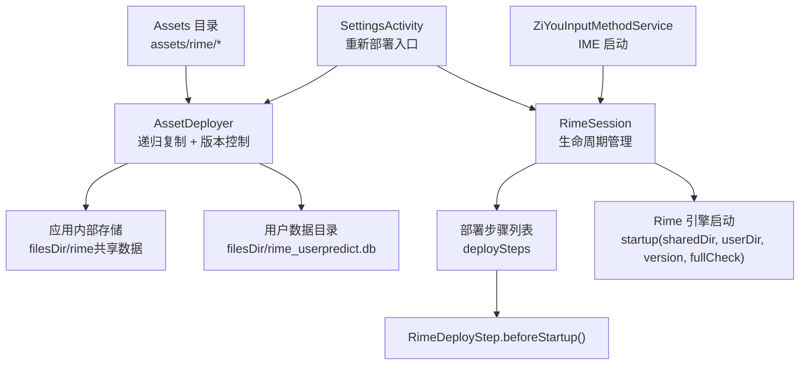
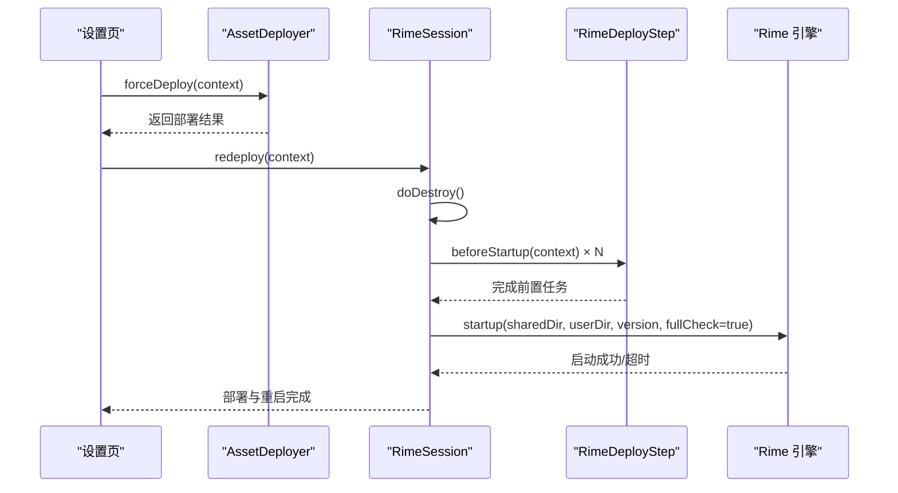
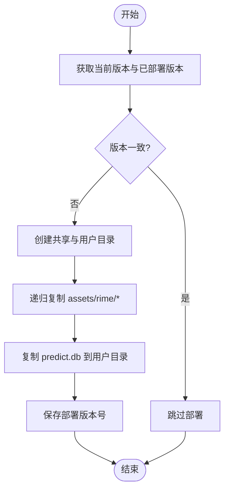
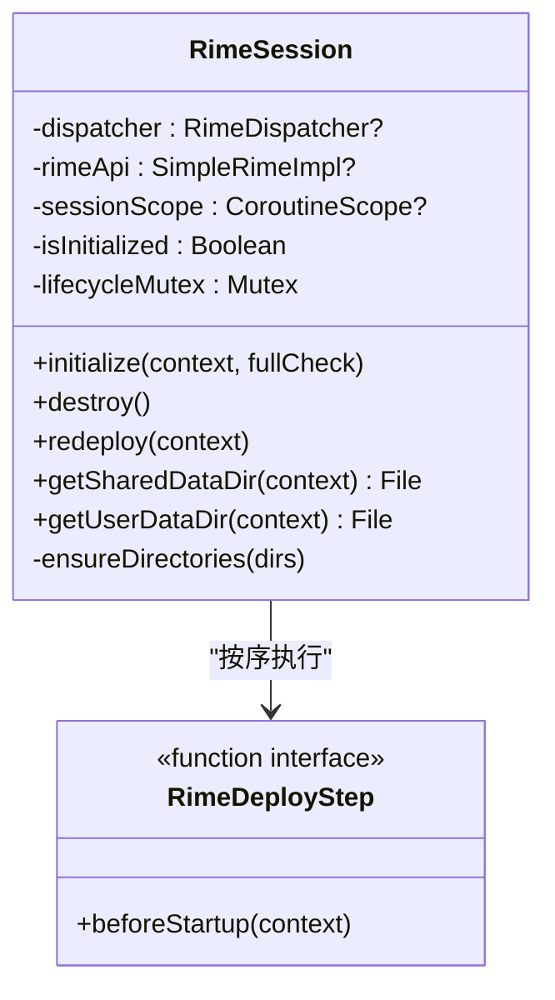
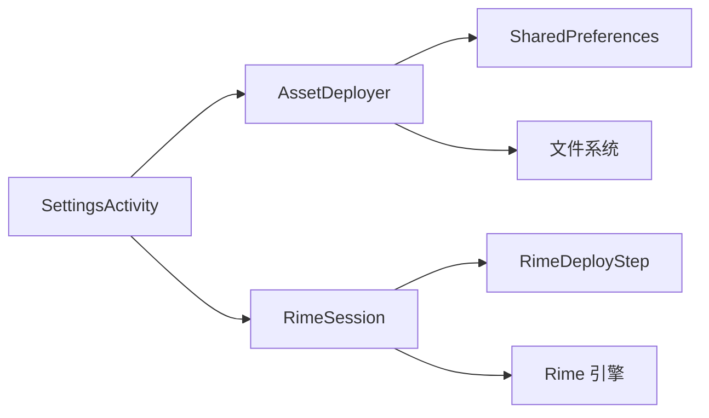

# 资源部署

<cite>
**本文引用的文件**   
- [AssetDeployer.kt](file://app/src/main/java/com/ziyou/ime/config/AssetDeployer.kt)
- [RimeSession.kt](file://app/src/main/java/com/ziyou/ime/daemon/RimeSession.kt)
- [RimeDeployStep.kt](file://app/src/main/java/com/ziyou/ime/daemon/RimeDeployStep.kt)
- [SettingsActivity.kt](file://app/src/main/java/com/ziyou/ime/ui/SettingsActivity.kt)
- [ZiYouInputMethodService.kt](file://app/src/main/java/com/ziyou/ime/ime/ZiYouInputMethodService.kt)
- [RimeSessionLifecycleTest.kt](file://app/src/test/java/com/ziyou/ime/daemon/RimeSessionLifecycleTest.kt)
</cite>

## 目录
1. [简介](#简介)
2. [项目结构](#项目结构)
3. [核心组件](#核心组件)
4. [架构总览](#架构总览)
5. [详细组件分析](#详细组件分析)
6. [依赖关系分析](#依赖关系分析)
7. [性能考量](#性能考量)
8. [故障排查指南](#故障排查指南)
9. [结论](#结论)
10. [附录：扩展与示例](#附录扩展与示例)

## 简介
本技术文档聚焦于输入法项目的资源部署系统，重点解析 AssetDeployer 的资源复制机制、首次启动初始化流程、版本升级处理逻辑、冲突解决策略、文件权限与存储路径管理、磁盘空间优化、部署状态监控、错误恢复机制与日志记录策略。同时提供可操作的扩展指南，帮助开发者添加新的资源目录、自定义部署规则并实现增量更新能力。

## 项目结构
资源部署相关代码主要分布在以下模块与文件：
- 配置层：AssetDeployer 负责 assets/rime 递归复制、版本对比与持久化部署状态
- 守护进程层：RimeSession 管理引擎生命周期，编排部署步骤（deploySteps）并在 startup 前执行
- 部署步骤抽象：RimeDeployStep 定义 beforeStartup 钩子，便于注入词库注入等扩展逻辑
- 用户界面：SettingsActivity 提供“重新部署”入口，触发强制部署与引擎热重启
- IME 服务：ZiYouInputMethodService 在输入法启动时判断是否需要完整检查并驱动初始化

图表来源 
- [AssetDeployer.kt:25-91](file://app/src/main/java/com/ziyou/ime/config/AssetDeployer.kt#L25-L91)
- [RimeSession.kt:88-153](file://app/src/main/java/com/ziyou/ime/daemon/RimeSession.kt#L88-L153)
- [RimeDeployStep.kt:15-19](file://app/src/main/java/com/ziyou/ime/daemon/RimeDeployStep.kt#L15-L19)
- [SettingsActivity.kt:871-902](file://app/src/main/java/com/ziyou/ime/ui/SettingsActivity.kt#L871-L902)
- [ZiYouInputMethodService.kt:378](file://app/src/main/java/com/ziyou/ime/ime/ZiYouInputMethodService.kt#L378)

章节来源
- [AssetDeployer.kt:25-91](file://app/src/main/java/com/ziyou/ime/config/AssetDeployer.kt#L25-L91)
- [RimeSession.kt:88-153](file://app/src/main/java/com/ziyou/ime/daemon/RimeSession.kt#L88-L153)
- [RimeDeployStep.kt:15-19](file://app/src/main/java/com/ziyou/ime/daemon/RimeDeployStep.kt#L15-L19)
- [SettingsActivity.kt:871-902](file://app/src/main/java/com/ziyou/ime/ui/SettingsActivity.kt#L871-L902)
- [ZiYouInputMethodService.kt:378](file://app/src/main/java/com/ziyou/ime/ime/ZiYouInputMethodService.kt#L378)

## 核心组件
- AssetDeployer：资源部署器
  - 功能要点：比较应用版本与已部署版本；递归复制 assets/rime/* 到 filesDir/rime；将 predict.db 复制到 rime_user；持久化部署版本号；IO 异常捕获与日志记录
  - 关键方法：deployIfNeeded、forceDeploy、needsDeploy、getSharedDataDir、getUserDataDir、performDeploy、copyAssetsRecursive、copyAssetFile
- RimeSession：Rime 会话管理器
  - 功能要点：串行化生命周期操作（Mutex）；按顺序执行 deploySteps；确保共享与用户目录存在；带超时保护的引擎启动；redeploy 支持热重启
  - 关键方法：initialize、destroy、redeploy、ensureDirectories
- RimeDeployStep：部署步骤抽象
  - 功能要点：beforeStartup(context) 在 IO 线程执行，用于资源部署、词库注入等前置任务

章节来源
- [AssetDeployer.kt:25-91](file://app/src/main/java/com/ziyou/ime/config/AssetDeployer.kt#L25-L91)
- [AssetDeployer.kt:93-131](file://app/src/main/java/com/ziyou/ime/config/AssetDeployer.kt#L93-L131)
- [RimeSession.kt:88-153](file://app/src/main/java/com/ziyou/ime/daemon/RimeSession.kt#L88-L153)
- [RimeSession.kt:189-198](file://app/src/main/java/com/ziyou/ime/daemon/RimeSession.kt#L189-L198)
- [RimeDeployStep.kt:15-19](file://app/src/main/java/com/ziyou/ime/daemon/RimeDeployStep.kt#L15-L19)

## 架构总览
资源部署的整体流程如下：
- 首次启动或版本变化时，AssetDeployer 检测版本差异并执行部署
- RimeSession 在执行引擎 startup 之前，依次调用 deploySteps.beforeStartup，完成资源部署与扩展词库注入
- 部署完成后，RimeSession 以 fullCheck=true 模式启动引擎，确保新方案编译生效
- SettingsActivity 提供“重新部署”入口，强制刷新 assets 并热重启引擎，避免覆盖主词库后丢失扩展词库

图表来源 
- [SettingsActivity.kt:871-902](file://app/src/main/java/com/ziyou/ime/ui/SettingsActivity.kt#L871-L902)
- [AssetDeployer.kt:38-42](file://app/src/main/java/com/ziyou/ime/config/AssetDeployer.kt#L38-L42)
- [RimeSession.kt:189-198](file://app/src/main/java/com/ziyou/ime/daemon/RimeSession.kt#L189-L198)
- [RimeSession.kt:88-153](file://app/src/main/java/com/ziyou/ime/daemon/RimeSession.kt#L88-L153)

## 详细组件分析

### AssetDeployer 资源复制与版本控制
- 版本对比与决策
  - deployIfNeeded：比较当前应用版本与已部署版本，若一致则跳过部署；否则进入 performDeploy
  - needsDeploy：供调用方判断是否需要 fullCheck（首次安装或版本升级）
  - forceDeploy：强制执行部署，忽略版本一致性检查
- 递归复制策略
  - copyAssetsRecursive：遍历 assets/rime/*，区分目录与文件；目录创建后递归复制，文件直接拷贝至目标目录
  - copyAssetFile：使用 InputStream/OutputStream 流式复制，记录日志与异常
- 存储路径管理
  - getSharedDataDir：filesDir/rime（共享数据，schema/dict 等）
  - getUserDataDir：filesDir/rime_user（用户数据，predict.db）
- 版本持久化
  - SharedPreferences 中保存 deployed_version，作为是否重复部署的依据
- 错误处理与日志
  - IO 异常捕获并记录错误堆栈；复制失败抛出异常，由上层统一处理

图表来源 
- [AssetDeployer.kt:25-42](file://app/src/main/java/com/ziyou/ime/config/AssetDeployer.kt#L25-L42)
- [AssetDeployer.kt:65-91](file://app/src/main/java/com/ziyou/ime/config/AssetDeployer.kt#L65-L91)
- [AssetDeployer.kt:93-131](file://app/src/main/java/com/ziyou/ime/config/AssetDeployer.kt#L93-L131)

章节来源
- [AssetDeployer.kt:25-91](file://app/src/main/java/com/ziyou/ime/config/AssetDeployer.kt#L25-L91)
- [AssetDeployer.kt:93-131](file://app/src/main/java/com/ziyou/ime/config/AssetDeployer.kt#L93-L131)

### RimeSession 生命周期与部署编排
- 生命周期互斥锁：lifecycleMutex 保证 initialize/destroy/redeploy 串行执行，避免并发导致的线程泄漏与双重初始化
- 部署步骤编排：initialize 在 IO 线程执行 deploySteps，确保 beforeStartup 的 IO 操作不阻塞主线程
- 目录准备：ensureDirectories 确保共享与用户目录存在
- 引擎启动：startup 带超时保护（120s），即使超时也标记为已初始化，允许后续操作
- 重新部署：redeploy 关闭当前引擎并重新执行部署步骤，以 fullCheck 模式重启

图表来源 
- [RimeSession.kt:88-153](file://app/src/main/java/com/ziyou/ime/daemon/RimeSession.kt#L88-L153)
- [RimeSession.kt:189-198](file://app/src/main/java/com/ziyou/ime/daemon/RimeSession.kt#L189-L198)
- [RimeDeployStep.kt:15-19](file://app/src/main/java/com/ziyou/ime/daemon/RimeDeployStep.kt#L15-L19)

章节来源
- [RimeSession.kt:88-153](file://app/src/main/java/com/ziyou/ime/daemon/RimeSession.kt#L88-L153)
- [RimeSession.kt:189-198](file://app/src/main/java/com/ziyou/ime/daemon/RimeSession.kt#L189-L198)
- [RimeSessionLifecycleTest.kt:89-113](file://app/src/test/java/com/ziyou/ime/daemon/RimeSessionLifecycleTest.kt#L89-L113)

### 首次启动与版本升级处理
- 首次启动
  - ZiYouInputMethodService 在输入法启动时通过 AssetDeployer.needsDeploy 判断是否需要 fullCheck
  - RimeSession.initialize(fullCheck=true) 确保新方案编译生效
- 版本升级
  - AssetDeployer.deployIfNeeded 检测到版本变化后执行部署
  - RimeSession.redeploy 以 fullCheck 模式重启，保证增量变更生效

章节来源
- [ZiYouInputMethodService.kt:378](file://app/src/main/java/com/ziyou/ime/ime/ZiYouInputMethodService.kt#L378)
- [AssetDeployer.kt:25-36](file://app/src/main/java/com/ziyou/ime/config/AssetDeployer.kt#L25-L36)
- [RimeSession.kt:88-153](file://app/src/main/java/com/ziyou/ime/daemon/RimeSession.kt#L88-L153)

### 冲突解决机制
- 文件覆盖策略
  - 当前实现采用全量覆盖：每次部署都会重写目标目录中的文件，不存在基于内容哈希的增量对比
  - 风险：可能覆盖用户自定义配置（如用户词典），需通过用户目录隔离与备份策略规避
- 建议改进
  - 引入文件校验（如 MD5/SHA256）与增量更新，仅复制变更文件
  - 对敏感文件（用户词典）进行备份与冲突提示

章节来源
- [AssetDeployer.kt:93-131](file://app/src/main/java/com/ziyou/ime/config/AssetDeployer.kt#L93-L131)

### 文件权限与存储路径管理
- 存储路径
  - 共享数据目录：filesDir/rime（schema、dict、symbols 等）
  - 用户数据目录：filesDir/rime_user（predict.db、用户词典等）
- 权限设置
  - 当前实现未显式设置文件权限，依赖 Android 默认权限模型
  - 建议：对敏感文件设置更严格的权限（如 MODE_PRIVATE），并确保跨进程访问安全

章节来源
- [AssetDeployer.kt:44-50](file://app/src/main/java/com/ziyou/ime/config/AssetDeployer.kt#L44-L50)
- [RimeSession.kt:203-212](file://app/src/main/java/com/ziyou/ime/daemon/RimeSession.kt#L203-L212)

### 磁盘空间优化
- 当前策略
  - 全量复制可能导致重复写入大文件（如词典），增加 I/O 压力
- 优化建议
  - 增量更新：仅复制变更文件，减少 I/O 与时间开销
  - 压缩传输：对大型资源包进行压缩，降低网络与存储占用
  - 清理旧版本：定期清理历史部署残留文件

[本节为通用指导，无需引用具体文件]

### 部署状态监控与日志记录
- 状态监控
  - isDeployed：根据部署版本号判断是否已部署
  - needsDeploy：供上层决定是否执行 fullCheck
- 日志记录
  - 部署过程记录关键节点（创建目录、复制文件、保存版本）
  - 异常捕获并记录堆栈，便于问题定位

章节来源
- [AssetDeployer.kt:52-63](file://app/src/main/java/com/ziyou/ime/config/AssetDeployer.kt#L52-L63)
- [AssetDeployer.kt:65-91](file://app/src/main/java/com/ziyou/ime/config/AssetDeployer.kt#L65-L91)

### 错误恢复机制
- 异常处理
  - copyAssetFile 捕获 IO 异常并抛出，由上层统一处理
  - RimeSession.initialize 带超时保护，避免长时间阻塞
- 恢复策略
  - redeploy 支持重新执行部署步骤，恢复因临时故障导致的失败
  - 建议在 UI 层提供重试与反馈机制

章节来源
- [AssetDeployer.kt:119-131](file://app/src/main/java/com/ziyou/ime/config/AssetDeployer.kt#L119-L131)
- [RimeSession.kt:135-152](file://app/src/main/java/com/ziyou/ime/daemon/RimeSession.kt#L135-L152)

## 依赖关系分析
- 组件耦合
  - RimeSession 通过 deploySteps 解耦业务模块（config/dict），保持单向依赖
  - AssetDeployer 依赖 Android Context 与 SharedPreferences，无外部框架依赖
- 外部集成点
  - Rime 引擎 startup：接收 sharedDir、userDir、version、fullCheck 参数
  - SettingsActivity：触发 forceDeploy 与 redeploy

图表来源 
- [AssetDeployer.kt:148-160](file://app/src/main/java/com/ziyou/ime/config/AssetDeployer.kt#L148-L160)
- [RimeSession.kt:106-113](file://app/src/main/java/com/ziyou/ime/daemon/RimeSession.kt#L106-L113)
- [SettingsActivity.kt:871-902](file://app/src/main/java/com/ziyou/ime/ui/SettingsActivity.kt#L871-L902)

章节来源
- [AssetDeployer.kt:148-160](file://app/src/main/java/com/ziyou/ime/config/AssetDeployer.kt#L148-L160)
- [RimeSession.kt:106-113](file://app/src/main/java/com/ziyou/ime/daemon/RimeSession.kt#L106-L113)
- [SettingsActivity.kt:871-902](file://app/src/main/java/com/ziyou/ime/ui/SettingsActivity.kt#L871-L902)

## 性能考量
- I/O 优化
  - 使用流式复制（InputStream/OutputStream）避免内存溢出
  - 在 IO 线程执行部署，防止主线程 ANR
- 启动优化
  - 超时保护避免长时间阻塞
  - 按需 fullCheck，减少不必要的编译开销
- 存储优化
  - 增量更新可减少重复写入
  - 压缩与缓存策略提升加载速度

[本节为通用指导，无需引用具体文件]

## 故障排查指南
- 常见问题
  - 部署失败：检查 IO 异常日志，确认目标目录权限与存储空间
  - 引擎启动超时：检查词典文件大小与 fullCheck 设置
  - 用户配置丢失：确认用户目录隔离策略，避免覆盖敏感文件
- 调试技巧
  - 启用详细日志（Log.d/Log.e）跟踪部署过程
  - 使用测试用例验证部署步骤执行顺序与异常路径

章节来源
- [AssetDeployer.kt:119-131](file://app/src/main/java/com/ziyou/ime/config/AssetDeployer.kt#L119-L131)
- [RimeSession.kt:135-152](file://app/src/main/java/com/ziyou/ime/daemon/RimeSession.kt#L135-L152)
- [RimeSessionLifecycleTest.kt:75-85](file://app/src/test/java/com/ziyou/ime/daemon/RimeSessionLifecycleTest.kt#L75-L85)

## 结论
AssetDeployer 提供了基础的资源部署能力，结合 RimeSession 的生命周期管理与部署步骤抽象，实现了可扩展、可维护的资源部署系统。当前实现采用全量覆盖策略，建议在后续迭代中引入增量更新与冲突解决机制，以提升性能与用户体验。

[本节为总结性内容，无需引用具体文件]

## 附录：扩展与示例
- 添加新的资源目录
  - 在 AssetDeployer 中新增常量与复制逻辑，或在 deploySteps 中注册新的部署步骤
  - 示例路径参考：[AssetDeployer.kt:20-24](file://app/src/main/java/com/ziyou/ime/config/AssetDeployer.kt#L20-L24)
- 自定义部署规则
  - 实现 RimeDeployStep 接口，在 beforeStartup 中定义自定义逻辑
  - 示例路径参考：[RimeDeployStep.kt:15-19](file://app/src/main/java/com/ziyou/ime/daemon/RimeDeployStep.kt#L15-L19)
- 实现增量更新
  - 引入文件校验（MD5/SHA256）与差异对比算法，仅复制变更文件
  - 示例路径参考：[AssetDeployer.kt:93-131](file://app/src/main/java/com/ziyou/ime/config/AssetDeployer.kt#L93-L131)

章节来源
- [AssetDeployer.kt:20-24](file://app/src/main/java/com/ziyou/ime/config/AssetDeployer.kt#L20-L24)
- [RimeDeployStep.kt:15-19](file://app/src/main/java/com/ziyou/ime/daemon/RimeDeployStep.kt#L15-L19)
- [AssetDeployer.kt:93-131](file://app/src/main/java/com/ziyou/ime/config/AssetDeployer.kt#L93-L131)