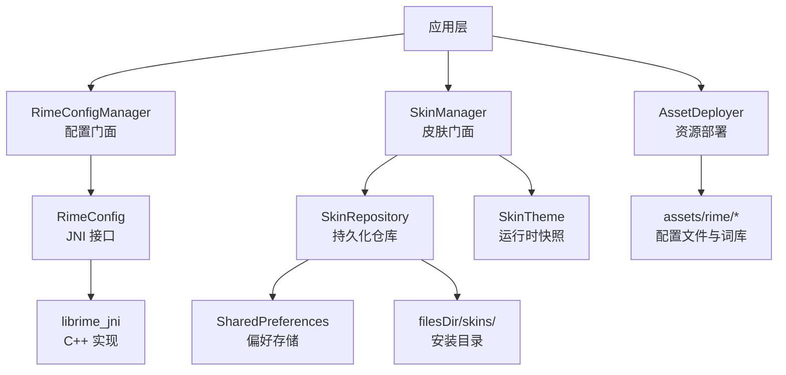
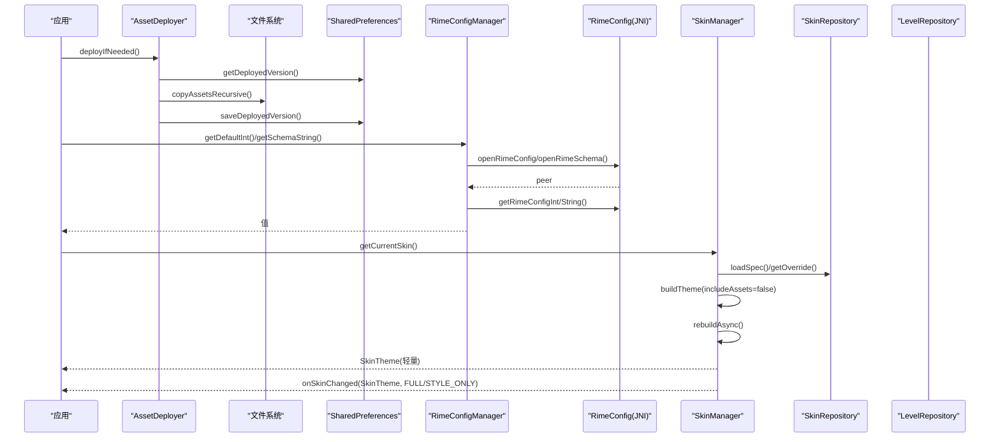
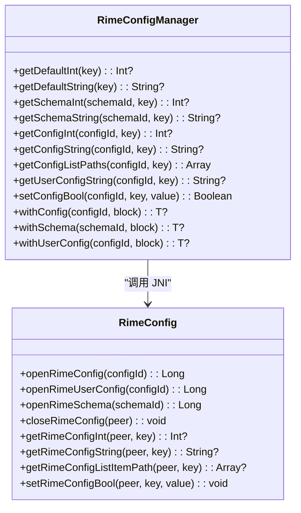
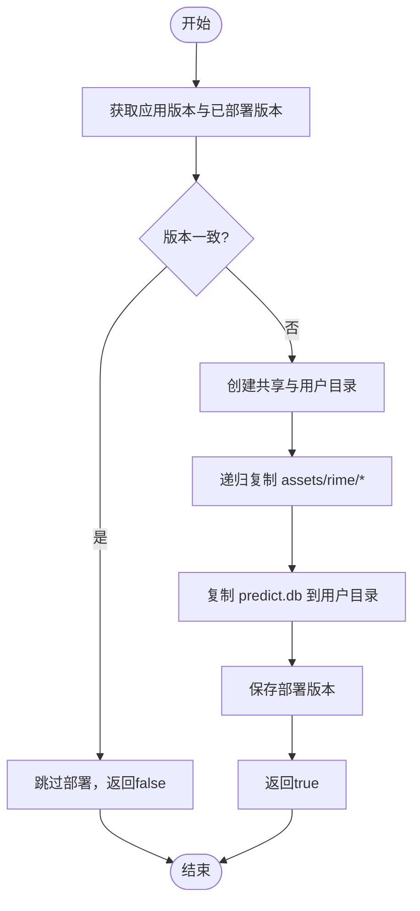
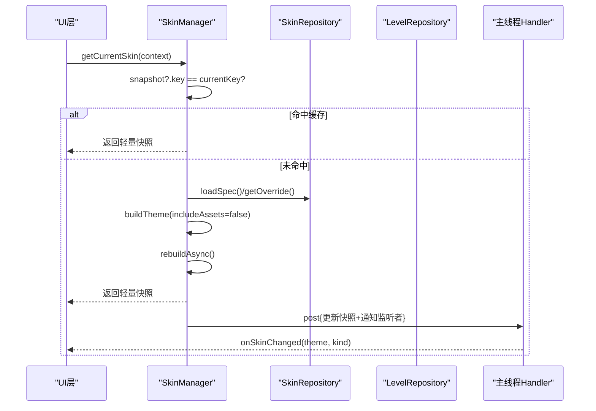
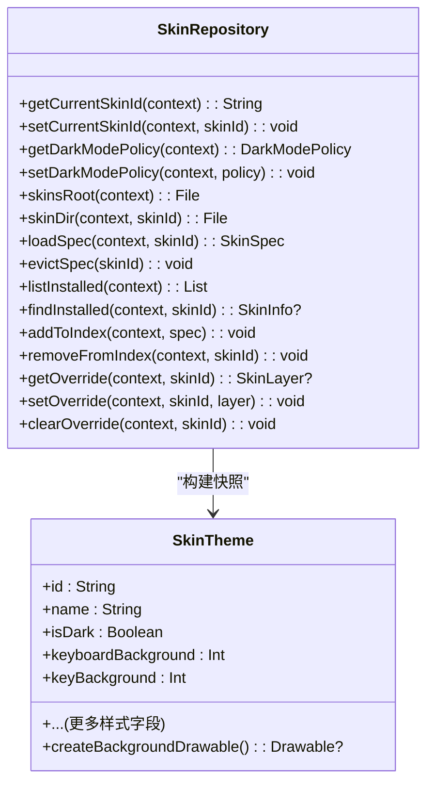
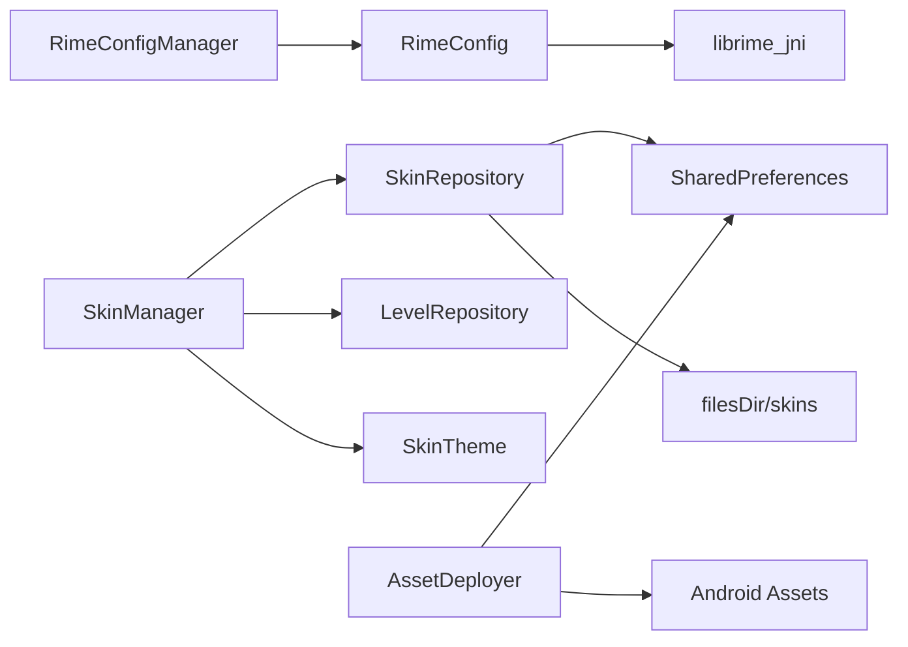

# 配置管理系统

<cite>
**本文引用的文件**   
- [RimeConfigManager.kt](file://app/src/main/java/com/ziyou/ime/config/RimeConfigManager.kt)
- [RimeConfig.kt](file://app/src/main/java/com/ziyou/ime/core/RimeConfig.kt)
- [AssetDeployer.kt](file://app/src/main/java/com/ziyou/ime/config/AssetDeployer.kt)
- [SkinManager.kt](file://app/src/main/java/com/ziyou/ime/skin/SkinManager.kt)
- [SkinRepository.kt](file://app/src/main/java/com/ziyou/ime/skin/SkinRepository.kt)
- [SkinTheme.kt](file://app/src/main/java/com/ziyou/ime/skin/SkinTheme.kt)
- [default.yaml](file://app/src/main/assets/rime/default.yaml)
- [luna_pinyin.schema.yaml](file://app/src/main/assets/rime/luna_pinyin.schema.yaml)
</cite>

## 目录
1. [简介](#简介)
2. [项目结构](#项目结构)
3. [核心组件](#核心组件)
4. [架构总览](#架构总览)
5. [详细组件分析](#详细组件分析)
6. [依赖关系分析](#依赖关系分析)
7. [性能考量](#性能考量)
8. [故障排查指南](#故障排查指南)
9. [结论](#结论)
10. [附录：扩展示例](#附录扩展示例)

## 简介
本技术文档围绕输入法的配置管理系统展开，重点说明以下能力：
- RimeConfigManager 对 default.yaml 与 schema 配置的读取、修改与持久化机制（通过 JNI 封装）。
- ThemeManager 主题系统实现（以 SkinManager/SkinRepository/SkinTheme 为核心），包括内置皮肤管理、自定义皮肤导入、等级解锁规则与 SharedPreferences 持久化。
- AssetDeployer 的资源部署机制，覆盖 assets/rime/* 的递归复制、版本号对比避免重复复制、首次启动与版本升级处理。
- 配置变更监听与通知机制（基于 Kotlin 协程与回调），支持 UI 实时更新。
- 提供具体代码路径示例，指导如何添加新的配置项与主题皮肤。

## 项目结构
与配置管理相关的核心目录与文件如下：
- app/src/main/java/com/ziyou/ime/config
  - RimeConfigManager.kt：Rime 配置读写门面
  - AssetDeployer.kt：资源部署器
  - DisplayModeManager.kt：悬浮键盘显示模式（与主题正交）
- app/src/main/java/com/ziyou/ime/core
  - RimeConfig.kt：JNI 接口声明（open/close/get/set）
- app/src/main/java/com/ziyou/ime/skin
  - SkinManager.kt：皮肤管理器（门面）
  - SkinRepository.kt：皮肤持久化仓库（SharedPreferences + 文件系统索引）
  - SkinTheme.kt：运行时皮肤快照（不可变）
- app/src/main/assets/rime
  - default.yaml：默认配置
  - luna_pinyin.schema.yaml：拼音方案配置

图表来源
- [RimeConfigManager.kt:1-200](file://app/src/main/java/com/ziyou/ime/config/RimeConfigManager.kt#L1-L200)
- [RimeConfig.kt:1-104](file://app/src/main/java/com/ziyou/ime/core/RimeConfig.kt#L1-L104)
- [AssetDeployer.kt:1-162](file://app/src/main/java/com/ziyou/ime/config/AssetDeployer.kt#L1-L162)
- [SkinManager.kt:1-239](file://app/src/main/java/com/ziyou/ime/skin/SkinManager.kt#L1-L239)
- [SkinRepository.kt:1-275](file://app/src/main/java/com/ziyou/ime/skin/SkinRepository.kt#L1-L275)

章节来源
- [RimeConfigManager.kt:1-200](file://app/src/main/java/com/ziyou/ime/config/RimeConfigManager.kt#L1-L200)
- [RimeConfig.kt:1-104](file://app/src/main/java/com/ziyou/ime/core/RimeConfig.kt#L1-L104)
- [AssetDeployer.kt:1-162](file://app/src/main/java/com/ziyou/ime/config/AssetDeployer.kt#L1-L162)
- [SkinManager.kt:1-239](file://app/src/main/java/com/ziyou/ime/skin/SkinManager.kt#L1-L239)
- [SkinRepository.kt:1-275](file://app/src/main/java/com/ziyou/ime/skin/SkinRepository.kt#L1-L275)

## 核心组件
- RimeConfigManager：封装 JNI 层的配置操作，提供便捷 API 读取 default.yaml 与 schema 配置，并支持用户配置与通用配置读写。
- AssetDeployer：负责将 assets/rime/* 递归复制到内部存储，并通过 SharedPreferences 记录已部署版本，避免重复部署。
- SkinManager：皮肤门面，提供当前皮肤获取、切换、失效重建、深浅色变化处理、列表与解锁判定、监听注册等。
- SkinRepository：皮肤持久化仓库，维护当前皮肤 id、已安装索引、用户覆盖层、深浅色策略，以及 skins/ 目录下的安装数据。
- SkinTheme：不可变的运行时快照，包含颜色、尺寸、字体、背景图等解析后的结果，供视图层消费。

章节来源
- [RimeConfigManager.kt:1-200](file://app/src/main/java/com/ziyou/ime/config/RimeConfigManager.kt#L1-L200)
- [AssetDeployer.kt:1-162](file://app/src/main/java/com/ziyou/ime/config/AssetDeployer.kt#L1-L162)
- [SkinManager.kt:1-239](file://app/src/main/java/com/ziyou/ime/skin/SkinManager.kt#L1-L239)
- [SkinRepository.kt:1-275](file://app/src/main/java/com/ziyou/ime/skin/SkinRepository.kt#L1-L275)
- [SkinTheme.kt:1-126](file://app/src/main/java/com/ziyou/ime/skin/SkinTheme.kt#L1-L126)

## 架构总览
配置管理与主题系统的整体交互如下：
- 应用启动时，AssetDeployer 检测版本差异，必要时执行资源部署。
- RimeConfigManager 通过 RimeConfig JNI 接口访问 default.yaml 与 schema 配置，供引擎与 UI 使用。
- SkinManager 从 SkinRepository 加载当前皮肤规格与覆盖层，构建 SkinTheme 快照；当需要背景图或字体时异步补齐并通知监听者。
- 等级体系（LevelEngine/LevelRepository）决定内置皮肤的解锁状态，导入皮肤默认 Lv.1 解锁。

图表来源
- [AssetDeployer.kt:25-91](file://app/src/main/java/com/ziyou/ime/config/AssetDeployer.kt#L25-L91)
- [RimeConfigManager.kt:27-113](file://app/src/main/java/com/ziyou/ime/config/RimeConfigManager.kt#L27-L113)
- [RimeConfig.kt:29-103](file://app/src/main/java/com/ziyou/ime/core/RimeConfig.kt#L29-L103)
- [SkinManager.kt:65-111](file://app/src/main/java/com/ziyou/ime/skin/SkinManager.kt#L65-L111)
- [SkinRepository.kt:103-116](file://app/src/main/java/com/ziyou/ime/skin/SkinRepository.kt#L103-L116)

## 详细组件分析

### RimeConfigManager：Rime 配置门面
- 功能要点
  - 便捷方法：getDefaultInt/getDefaultString 直接读取 default.yaml。
  - 方案读取：getSchemaInt/getSchemaString 打开指定 schema 配置并读取键值。
  - 通用读取：getConfigInt/getConfigString/getConfigListPaths 打开系统配置并读取。
  - 用户配置：getUserConfigString 打开用户配置读取字符串。
  - 写入：setConfigBool 设置布尔类型配置项。
  - 高阶 API：withConfig/withSchema/withUserConfig 提供带自动关闭的生命周期管理。
- 错误处理
  - 打开失败返回 null 或空数组，并输出警告日志。
  - finally 块确保 closeRimeConfig 被调用，防止资源泄漏。
- 复杂度与性能
  - 每次读取均打开/关闭配置对象，适合低频调用；高频场景可复用 withXxx 块内多次读取。
  - JNI 调用开销较低，但应避免在热路径频繁创建/销毁。

图表来源
- [RimeConfigManager.kt:27-199](file://app/src/main/java/com/ziyou/ime/config/RimeConfigManager.kt#L27-L199)
- [RimeConfig.kt:29-103](file://app/src/main/java/com/ziyou/ime/core/RimeConfig.kt#L29-L103)

章节来源
- [RimeConfigManager.kt:27-199](file://app/src/main/java/com/ziyou/ime/config/RimeConfigManager.kt#L27-L199)
- [RimeConfig.kt:29-103](file://app/src/main/java/com/ziyou/ime/core/RimeConfig.kt#L29-L103)

### AssetDeployer：资源部署器
- 功能要点
  - deployIfNeeded：比较当前应用版本与已部署版本，不一致则触发部署。
  - forceDeploy：强制重新部署。
  - getSharedDataDir/getUserDataDir：返回共享数据目录与用户数据目录。
  - isDeployed/needsDeploy：判断是否已部署或是否需要部署。
  - performDeploy：创建目标目录，递归复制 assets/rime/*，并将 predict.db 复制到用户目录，保存部署版本。
  - copyAssetsRecursive：递归遍历 assets 目录，区分文件与子目录进行复制。
  - copyAssetFile：按流方式复制单个文件。
  - getAppVersionCode：兼容不同 Android 版本的版本码读取。
  - getDeployedVersion/saveDeployedVersion：通过 SharedPreferences 持久化部署版本。
- 错误处理
  - IO 异常捕获并记录错误日志，返回 false。
  - 版本号获取失败回退为默认值。
- 复杂度与性能
  - 首次部署或版本升级时进行全量复制；后续启动若版本一致则跳过，避免重复 IO。

图表来源
- [AssetDeployer.kt:25-91](file://app/src/main/java/com/ziyou/ime/config/AssetDeployer.kt#L25-L91)
- [AssetDeployer.kt:93-131](file://app/src/main/java/com/ziyou/ime/config/AssetDeployer.kt#L93-L131)
- [AssetDeployer.kt:133-160](file://app/src/main/java/com/ziyou/ime/config/AssetDeployer.kt#L133-L160)

章节来源
- [AssetDeployer.kt:25-160](file://app/src/main/java/com/ziyou/ime/config/AssetDeployer.kt#L25-L160)

### SkinManager：皮肤门面与生命周期
- 功能要点
  - getCurrentSkin：优先命中 volatile 快照；未命中时同步构建轻量快照（不含背景图/字体），后台异步补齐资源后通过监听者通知。
  - setSkin：校验存在性与解锁状态，成功后持久化并异步重建快照。
  - invalidate：使快照失效并异步重建（用于自定义保存/重置等场景）。
  - onSystemDarkModeChanged：系统深浅色变化入口，按需重建。
  - getInstalledSkins/getUnlockedSkinIds：列出已安装皮肤与解锁集合。
  - isSkinUnlocked：按展示名查等级解锁表（内置皮肤），导入皮肤默认 Lv.1 解锁。
  - addListener/removeListener：注册/移除皮肤变更监听。
  - changeKind：新旧快照变更类型判定（FULL 或 STYLE_ONLY）。
- 线程模型
  - 读热路径 O(1) 无 IO；写路径 IO 线程解析 + 主线程通知监听者。
- 错误处理
  - 规格损坏时回退内置默认皮肤并复位当前 id（单次降级）。
  - 重建失败记录错误日志。

图表来源
- [SkinManager.kt:65-111](file://app/src/main/java/com/ziyou/ime/skin/SkinManager.kt#L65-L111)
- [SkinManager.kt:191-212](file://app/src/main/java/com/ziyou/ime/skin/SkinManager.kt#L191-L212)

章节来源
- [SkinManager.kt:65-239](file://app/src/main/java/com/ziyou/ime/skin/SkinManager.kt#L65-L239)

### SkinRepository：皮肤持久化仓库
- 功能要点
  - 当前皮肤 id：getCurrentSkinId/setCurrentSkinId，含旧版迁移逻辑。
  - 深浅色策略：getDarkModePolicy/setDarkModePolicy。
  - 皮肤目录：skinsRoot/skinDir，导入皮肤安装目录位于 filesDir/skins/<skinId>。
  - 规格加载：loadSpec 优先命中进程级缓存，否则解码 skin.json。
  - 已安装索引：listInstalled/findInstalled/addToIndex/removeFromIndex，支持索引损坏自愈。
  - 用户覆盖：getOverride/setOverride/clearOverride，按 skinId 维度存储覆盖层。
  - 旧版偏好迁移：一次性迁移 ziyou_theme → ziyou_skin。
- 错误处理
  - 索引损坏时尝试从磁盘重建；单个目录解析失败跳过。
  - 用户覆盖损坏忽略并记录警告。
- 复杂度与性能
  - 进程级 specCache 避免重复解码；读写偏好采用 apply 异步持久化。

图表来源
- [SkinRepository.kt:59-116](file://app/src/main/java/com/ziyou/ime/skin/SkinRepository.kt#L59-L116)
- [SkinRepository.kt:121-157](file://app/src/main/java/com/ziyou/ime/skin/SkinRepository.kt#L121-L157)
- [SkinRepository.kt:162-184](file://app/src/main/java/com/ziyou/ime/skin/SkinRepository.kt#L162-L184)
- [SkinTheme.kt:21-110](file://app/src/main/java/com/ziyou/ime/skin/SkinTheme.kt#L21-L110)

章节来源
- [SkinRepository.kt:59-275](file://app/src/main/java/com/ziyou/ime/skin/SkinRepository.kt#L59-L275)
- [SkinTheme.kt:21-110](file://app/src/main/java/com/ziyou/ime/skin/SkinTheme.kt#L21-L110)

### 配置与 Schema 文件
- default.yaml：定义菜单页大小、标点映射、按键绑定、ASCII 组合器等全局配置。
- luna_pinyin.schema.yaml：定义方案元信息、处理器/分词器/翻译器/过滤器链、预测器配置、拼写代数、反向查找等。

章节来源
- [default.yaml:1-144](file://app/src/main/assets/rime/default.yaml#L1-L144)
- [luna_pinyin.schema.yaml:1-158](file://app/src/main/assets/rime/luna_pinyin.schema.yaml#L1-L158)

## 依赖关系分析
- RimeConfigManager 依赖 RimeConfig（JNI），后者依赖 librime_jni（C++）。
- SkinManager 依赖 SkinRepository（持久化）、LevelRepository（等级解锁）、SkinTheme（快照）。
- AssetDeployer 依赖 SharedPreferences（版本持久化）与 Android Assets（资源读取）。
- SkinRepository 依赖 SharedPreferences（偏好存储）与文件系统（安装目录）。

图表来源
- [RimeConfigManager.kt:27-199](file://app/src/main/java/com/ziyou/ime/config/RimeConfigManager.kt#L27-L199)
- [RimeConfig.kt:29-103](file://app/src/main/java/com/ziyou/ime/core/RimeConfig.kt#L29-L103)
- [SkinManager.kt:65-111](file://app/src/main/java/com/ziyou/ime/skin/SkinManager.kt#L65-L111)
- [SkinRepository.kt:103-116](file://app/src/main/java/com/ziyou/ime/skin/SkinRepository.kt#L103-L116)
- [AssetDeployer.kt:25-91](file://app/src/main/java/com/ziyou/ime/config/AssetDeployer.kt#L25-L91)

章节来源
- [RimeConfigManager.kt:27-199](file://app/src/main/java/com/ziyou/ime/config/RimeConfigManager.kt#L27-L199)
- [RimeConfig.kt:29-103](file://app/src/main/java/com/ziyou/ime/core/RimeConfig.kt#L29-L103)
- [SkinManager.kt:65-111](file://app/src/main/java/com/ziyou/ime/skin/SkinManager.kt#L65-L111)
- [SkinRepository.kt:103-116](file://app/src/main/java/com/ziyou/ime/skin/SkinRepository.kt#L103-L116)
- [AssetDeployer.kt:25-91](file://app/src/main/java/com/ziyou/ime/config/AssetDeployer.kt#L25-L91)

## 性能考量
- RimeConfigManager
  - 建议在高并发读取场景中使用 withConfig/withSchema 块内多次读取，减少 JNI 打开/关闭开销。
  - 列表路径读取 getConfigListPaths 返回空数组而非异常，便于快速分支。
- AssetDeployer
  - 版本对比避免重复复制，仅在首次安装或版本升级时执行全量 IO。
  - 使用流式复制，内存占用低，适合大文件。
- SkinManager
  - 轻量快照构建（不含背景图/字体）保证热路径 O(1)；背景图/字体异步补齐，避免阻塞 UI。
  - 进程级 specCache 避免重复解码 skin.json。
  - 变更类型判定（STYLE_ONLY vs FULL）允许原地 applySkin，减少重建成本。
- SkinRepository
  - SharedPreferences 使用 apply 异步持久化，避免阻塞主线程。
  - 索引损坏自愈，降低崩溃风险。

[本节为通用性能讨论，不直接分析具体文件]

## 故障排查指南
- Rime 配置读取失败
  - 检查 configId/schemaId 是否正确，确认 openRimeConfig/openRimeSchema 返回值非 0。
  - 查看日志中“无法打开系统配置/方案配置”的警告。
- 资源部署失败
  - 检查 assets/rime/* 是否存在，IO 异常会记录错误日志。
  - 确认 SharedPreferences 权限与存储空间可用。
- 皮肤加载失败
  - 检查 skin.json 是否合法，规格损坏会回退默认皮肤。
  - 查看皮肤索引是否损坏，必要时触发重建。
- 皮肤未解锁
  - 确认等级体系（LevelEngine/LevelRepository）中对应展示名的解锁规则。
  - 导入皮肤默认 Lv.1 解锁，内置皮肤需满足等级要求。

章节来源
- [RimeConfigManager.kt:55-85](file://app/src/main/java/com/ziyou/ime/config/RimeConfigManager.kt#L55-L85)
- [AssetDeployer.kt:87-91](file://app/src/main/java/com/ziyou/ime/config/AssetDeployer.kt#L87-L91)
- [SkinManager.kt:169-189](file://app/src/main/java/com/ziyou/ime/skin/SkinManager.kt#L169-L189)
- [SkinRepository.kt:237-257](file://app/src/main/java/com/ziyou/ime/skin/SkinRepository.kt#L237-L257)

## 结论
本配置管理系统通过清晰的职责划分与稳健的错误处理，实现了：
- 安全的 Rime 配置读写（JNI 封装与生命周期管理）。
- 高效的资源部署（版本对比与递归复制）。
- 高性能的皮肤系统（轻量快照、异步补齐、变更类型判定）。
- 可靠的持久化（SharedPreferences + 文件系统索引与自愈）。
- 可扩展的监听机制（回调通知 UI 实时更新）。

[本节为总结性内容，不直接分析具体文件]

## 附录：扩展示例
- 添加新的配置项（default.yaml）
  - 在 default.yaml 中添加新键值（如 menu/new_key: true）。
  - 使用 RimeConfigManager.getDefaultString("menu/new_key") 或 getDefaultInt(...) 读取。
  - 如需写入，使用 setConfigBool("default", "menu/new_key", true)。
  - 参考路径：
    - [default.yaml:26-28](file://app/src/main/assets/rime/default.yaml#L26-L28)
    - [RimeConfigManager.kt:34-45](file://app/src/main/java/com/ziyou/ime/config/RimeConfigManager.kt#L34-L45)
    - [RimeConfigManager.kt:145-157](file://app/src/main/java/com/ziyou/ime/config/RimeConfigManager.kt#L145-L157)

- 添加新的 schema 配置（luna_pinyin.schema.yaml）
  - 在 schema 文件中新增处理器/分词器/翻译器或开关项。
  - 使用 RimeConfigManager.getSchemaString("luna_pinyin", "engine/processors/@0") 读取。
  - 参考路径：
    - [luna_pinyin.schema.yaml:33-64](file://app/src/main/assets/rime/luna_pinyin.schema.yaml#L33-L64)
    - [RimeConfigManager.kt:55-85](file://app/src/main/java/com/ziyou/ime/config/RimeConfigManager.kt#L55-L85)

- 添加新的主题皮肤（内置或导入）
  - 内置皮肤：在 SkinDefaults 中新增 builtinSpec，并在 SkinRepository.builtinSpecs 中暴露。
  - 导入皮肤：准备 skin.json（含 meta、layers、assets），安装到 filesDir/skins/<skinId>，调用 addToIndex。
  - 切换皮肤：SkinManager.setSkin(context, skinId)，校验解锁后异步重建快照并通知监听者。
  - 参考路径：
    - [SkinManager.kt:91-105](file://app/src/main/java/com/ziyou/ime/skin/SkinManager.kt#L91-L105)
    - [SkinRepository.kt:149-157](file://app/src/main/java/com/ziyou/ime/skin/SkinRepository.kt#L149-L157)
    - [SkinTheme.kt:21-110](file://app/src/main/java/com/ziyou/ime/skin/SkinTheme.kt#L21-L110)

章节来源
- [default.yaml:26-28](file://app/src/main/assets/rime/default.yaml#L26-L28)
- [luna_pinyin.schema.yaml:33-64](file://app/src/main/assets/rime/luna_pinyin.schema.yaml#L33-L64)
- [RimeConfigManager.kt:34-85](file://app/src/main/java/com/ziyou/ime/config/RimeConfigManager.kt#L34-L85)
- [RimeConfigManager.kt:145-157](file://app/src/main/java/com/ziyou/ime/config/RimeConfigManager.kt#L145-L157)
- [SkinManager.kt:91-105](file://app/src/main/java/com/ziyou/ime/skin/SkinManager.kt#L91-L105)
- [SkinRepository.kt:149-157](file://app/src/main/java/com/ziyou/ime/skin/SkinRepository.kt#L149-L157)
- [SkinTheme.kt:21-110](file://app/src/main/java/com/ziyou/ime/skin/SkinTheme.kt#L21-L110)