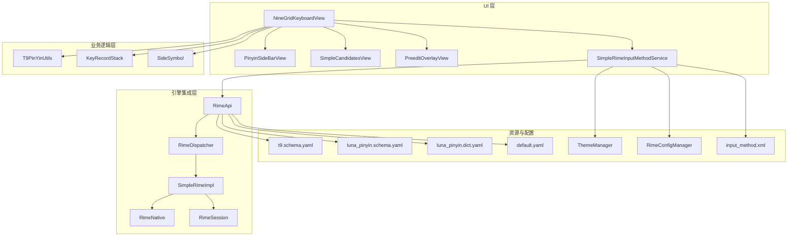
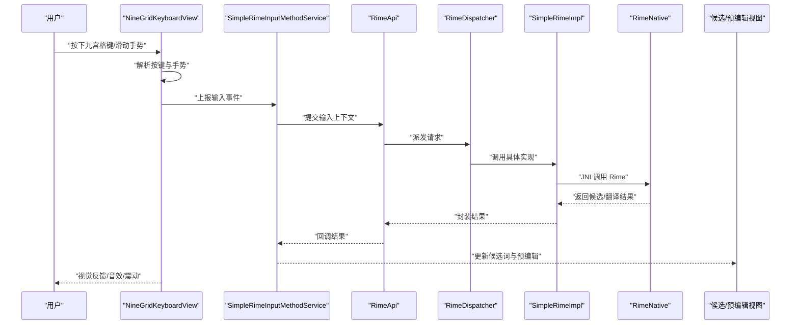
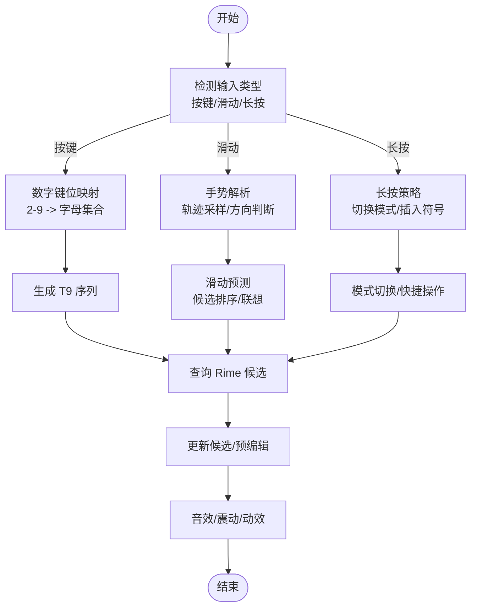
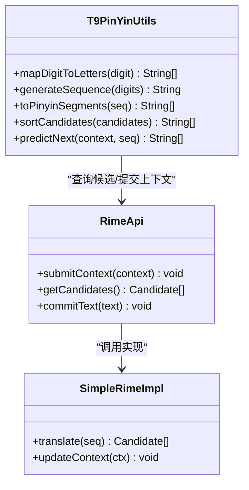
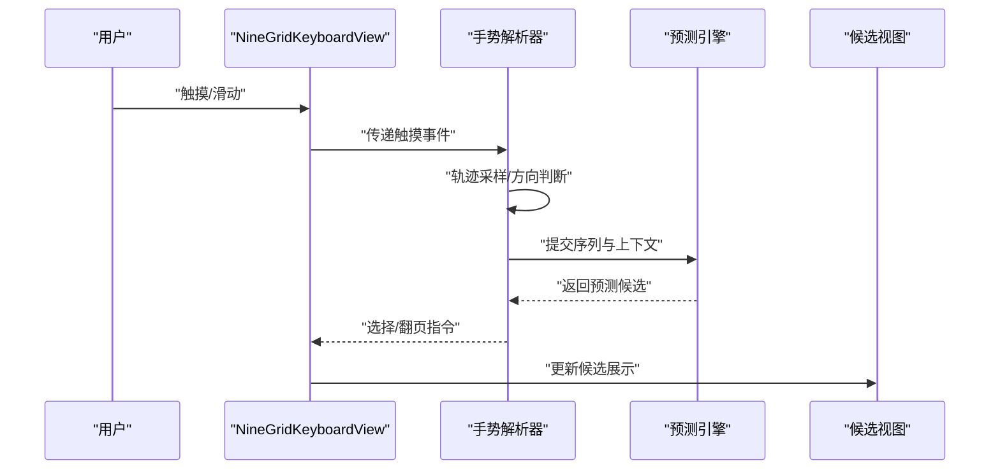
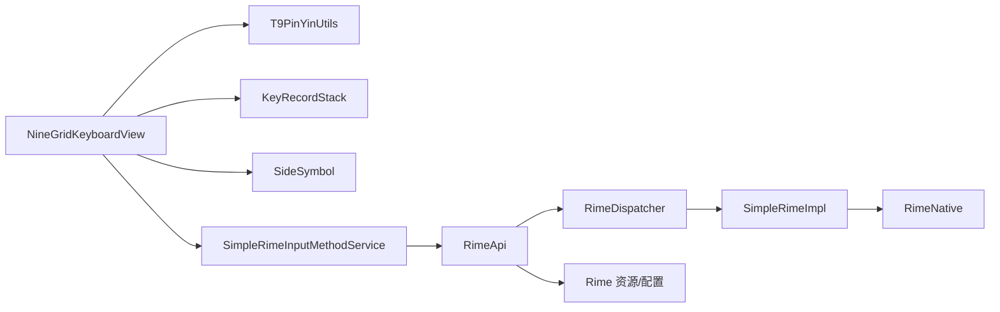

# 九宫格键盘

<cite>
**本文引用的文件**   
- [NineGridKeyboardView.kt](file://app/src/main/java/com/ziyou/ime/ime/NineGridKeyboardView.kt)
- [BaseKeyboardView.kt](file://app/src/main/java/com/ziyou/ime/ime/BaseKeyboardView.kt)
- [SimpleRimeInputMethodService.kt](file://app/src/main/java/com/ziyou/ime/ime/SimpleRimeInputMethodService.kt)
- [T9PinYinUtils.kt](file://app/src/main/java/com/ziyou/ime/util/T9PinYinUtils.kt)
- [t9.schema.yaml](file://app/src/main/assets/rime/t9.schema.yaml)
- [luna_pinyin.schema.yaml](file://app/src/main/assets/rime/luna_pinyin.schema.yaml)
- [luna_pinyin.dict.yaml](file://app/src/main/assets/rime/luna_pinyin.dict.yaml)
- [default.yaml](file://app/src/main/assets/rime/default.yaml)
- [RimeConfigManager.kt](file://app/src/main/java/com/ziyou/ime/config/RimeConfigManager.kt)
- [ThemeManager.kt](file://app/src/main/java/com/ziyou/ime/config/ThemeManager.kt)
- [KeyRecordStack.kt](file://app/src/main/java/com/ziyou/ime/data/KeyRecordStack.kt)
- [SideSymbol.kt](file://app/src/main/java/com/ziyou/ime/data/SideSymbol.kt)
- [PinyinSideBarView.kt](file://app/src/main/java/com/ziyou/ime/ime/PinyinSideBarView.kt)
- [PreeditOverlayView.kt](file://app/src/main/java/com/ziyou/ime/ime/PreeditOverlayView.kt)
- [SimpleCandidatesView.kt](file://app/src/main/java/com/ziyou/ime/ime/SimpleCandidatesView.kt)
- [RimeApi.kt](file://app/src/main/java/com/ziyou/ime/core/RimeApi.kt)
- [RimeDispatcher.kt](file://app/src/main/java/com/ziyou/ime/core/RimeDispatcher.kt)
- [SimpleRimeImpl.kt](file://app/src/main/java/com/ziyou/ime/core/SimpleRimeImpl.kt)
- [RimeNative.kt](file://app/src/main/java/com/ziyou/ime/core/RimeNative.kt)
- [RimeSession.kt](file://app/src/main/java/com/ziyou/ime/daemon/RimeSession.kt)
- [input_method.xml](file://app/src/main/res/xml/input_method.xml)
</cite>

## 目录
1. [简介](#简介)
2. [项目结构](#项目结构)
3. [核心组件](#核心组件)
4. [架构总览](#架构总览)
5. [详细组件分析](#详细组件分析)
6. [依赖关系分析](#依赖关系分析)
7. [性能考虑](#性能考虑)
8. [故障排查指南](#故障排查指南)
9. [结论](#结论)
10. [附录](#附录)

## 简介
本技术文档围绕“九宫格键盘”的实现展开，重点覆盖以下方面：
- NineGridKeyboardView 的九宫格布局算法：数字键位映射、字符分配策略与动态调整机制。
- T9 拼音输入的核心算法：字母到汉字的转换逻辑、候选词排序与智能联想。
- 手势识别系统：滑动预测、多点触控处理与手势冲突解决。
- 按键音效、震动反馈与视觉动效实现细节。
- 配置选项、主题定制与性能调优指南。
- 常见问题排查与调试技巧。

## 项目结构
本项目采用分层组织方式：
- UI 层：键盘视图（九宫格、侧边栏、候选词、预编辑区）与输入法服务入口。
- 业务逻辑层：T9 工具类、按键记录栈、侧边符号等。
- 引擎集成层：Rime 封装（API、调度、会话）、JNI 桥接。
- 资源与配置：Rime 模式与词典、输入法 XML、主题与颜色。

图表来源
- [NineGridKeyboardView.kt:1-200](file://app/src/main/java/com/ziyou/ime/ime/NineGridKeyboardView.kt#L1-L200)
- [T9PinYinUtils.kt:1-200](file://app/src/main/java/com/ziyou/ime/util/T9PinYinUtils.kt#L1-L200)
- [SimpleRimeInputMethodService.kt:1-200](file://app/src/main/java/com/ziyou/ime/ime/SimpleRimeInputMethodService.kt#L1-L200)
- [RimeApi.kt:1-200](file://app/src/main/java/com/ziyou/ime/core/RimeApi.kt#L1-L200)
- [RimeDispatcher.kt:1-200](file://app/src/main/java/com/ziyou/ime/core/RimeDispatcher.kt#L1-L200)
- [SimpleRimeImpl.kt:1-200](file://app/src/main/java/com/ziyou/ime/core/SimpleRimeImpl.kt#L1-L200)
- [RimeNative.kt:1-200](file://app/src/main/java/com/ziyou/ime/core/RimeNative.kt#L1-L200)
- [RimeSession.kt:1-200](file://app/src/main/java/com/ziyou/ime/daemon/RimeSession.kt#L1-L200)
- [t9.schema.yaml:1-200](file://app/src/main/assets/rime/t9.schema.yaml#L1-L200)
- [luna_pinyin.schema.yaml:1-200](file://app/src/main/assets/rime/luna_pinyin.schema.yaml#L1-L200)
- [luna_pinyin.dict.yaml:1-200](file://app/src/main/assets/rime/luna_pinyin.dict.yaml#L1-L200)
- [default.yaml:1-200](file://app/src/main/assets/rime/default.yaml#L1-L200)
- [input_method.xml:1-200](file://app/src/main/res/xml/input_method.xml#L1-L200)

章节来源
- [NineGridKeyboardView.kt:1-200](file://app/src/main/java/com/ziyou/ime/ime/NineGridKeyboardView.kt#L1-L200)
- [SimpleRimeInputMethodService.kt:1-200](file://app/src/main/java/com/ziyou/ime/ime/SimpleRimeInputMethodService.kt#L1-L200)
- [RimeApi.kt:1-200](file://app/src/main/java/com/ziyou/ime/core/RimeApi.kt#L1-L200)
- [t9.schema.yaml:1-200](file://app/src/main/assets/rime/t9.schema.yaml#L1-L200)
- [luna_pinyin.schema.yaml:1-200](file://app/src/main/assets/rime/luna_pinyin.schema.yaml#L1-L200)
- [luna_pinyin.dict.yaml:1-200](file://app/src/main/assets/rime/luna_pinyin.dict.yaml#L1-L200)
- [default.yaml:1-200](file://app/src/main/assets/rime/default.yaml#L1-L200)
- [input_method.xml:1-200](file://app/src/main/res/xml/input_method.xml#L1-L200)

## 核心组件
- NineGridKeyboardView：负责九宫格布局绘制、按键事件分发、手势识别、音效与震动反馈、候选词与预编辑显示联动。
- T9PinYinUtils：提供 T9 字母到拼音序列的映射、候选词生成与排序辅助。
- SimpleRimeInputMethodService：输入法服务入口，协调键盘视图与 Rime 引擎，管理会话与状态。
- RimeApi/RimeDispatcher/SimpleRimeImpl/RimeNative/RimeSession：Rime 引擎的 Kotlin 封装、消息调度、原生调用与会话管理。
- 资源与配置：t9.schema.yaml、luna_pinyin.*、default.yaml 定义 T9 模式、拼音模式与默认行为；ThemeManager 与 RimeConfigManager 管理主题与配置。

章节来源
- [NineGridKeyboardView.kt:1-200](file://app/src/main/java/com/ziyou/ime/ime/NineGridKeyboardView.kt#L1-L200)
- [T9PinYinUtils.kt:1-200](file://app/src/main/java/com/ziyou/ime/util/T9PinYinUtils.kt#L1-L200)
- [SimpleRimeInputMethodService.kt:1-200](file://app/src/main/java/com/ziyou/ime/ime/SimpleRimeInputMethodService.kt#L1-L200)
- [RimeApi.kt:1-200](file://app/src/main/java/com/ziyou/ime/core/RimeApi.kt#L1-L200)
- [RimeDispatcher.kt:1-200](file://app/src/main/java/com/ziyou/ime/core/RimeDispatcher.kt#L1-L200)
- [SimpleRimeImpl.kt:1-200](file://app/src/main/java/com/ziyou/ime/core/SimpleRimeImpl.kt#L1-L200)
- [RimeNative.kt:1-200](file://app/src/main/java/com/ziyou/ime/core/RimeNative.kt#L1-L200)
- [RimeSession.kt:1-200](file://app/src/main/java/com/ziyou/ime/daemon/RimeSession.kt#L1-L200)
- [t9.schema.yaml:1-200](file://app/src/main/assets/rime/t9.schema.yaml#L1-L200)
- [luna_pinyin.schema.yaml:1-200](file://app/src/main/assets/rime/luna_pinyin.schema.yaml#L1-L200)
- [luna_pinyin.dict.yaml:1-200](file://app/src/main/assets/rime/luna_pinyin.dict.yaml#L1-L200)
- [default.yaml:1-200](file://app/src/main/assets/rime/default.yaml#L1-L200)

## 架构总览
整体架构遵循“UI—业务—引擎—资源”的分层设计：
- UI 层通过 NineGridKeyboardView 接收用户输入与手势，驱动候选词与预编辑更新。
- 业务层使用 T9PinYinUtils 进行 T9 到拼音序列的转换，并结合 KeyRecordStack 维护输入历史。
- 引擎层通过 RimeApi 及其调度器与实现类，将输入上下文传递给 Rime，获取候选词与翻译结果。
- 资源层由 t9.schema.yaml 与 luna_pinyin.* 等配置文件驱动，决定输入模式与词典加载。

图表来源
- [NineGridKeyboardView.kt:1-200](file://app/src/main/java/com/ziyou/ime/ime/NineGridKeyboardView.kt#L1-L200)
- [SimpleRimeInputMethodService.kt:1-200](file://app/src/main/java/com/ziyou/ime/ime/SimpleRimeInputMethodService.kt#L1-L200)
- [RimeApi.kt:1-200](file://app/src/main/java/com/ziyou/ime/core/RimeApi.kt#L1-L200)
- [RimeDispatcher.kt:1-200](file://app/src/main/java/com/ziyou/ime/core/RimeDispatcher.kt#L1-L200)
- [SimpleRimeImpl.kt:1-200](file://app/src/main/java/com/ziyou/ime/core/SimpleRimeImpl.kt#L1-L200)
- [RimeNative.kt:1-200](file://app/src/main/java/com/ziyou/ime/core/RimeNative.kt#L1-L200)

## 详细组件分析

### NineGridKeyboardView 九宫格布局算法
- 数字键位映射：将 2–9 键映射到对应字母集合，结合 T9 规则生成候选序列。
- 字符分配策略：根据当前模式（T9/全拼/符号）动态分配键面字符，支持长按切换与快捷符号。
- 动态调整机制：依据屏幕尺寸与方向计算网格行列、键宽与间距，确保在不同设备上保持一致的交互体验。
- 手势识别：支持滑动预测（按字母轨迹选择候选）、多点触控处理（避免误触）、手势冲突解决（优先级判定）。
- 反馈系统：按键音效播放、震动反馈触发、视觉动效（高亮、涟漪、过渡动画）。

图表来源
- [NineGridKeyboardView.kt:1-200](file://app/src/main/java/com/ziyou/ime/ime/NineGridKeyboardView.kt#L1-L200)
- [T9PinYinUtils.kt:1-200](file://app/src/main/java/com/ziyou/ime/util/T9PinYinUtils.kt#L1-L200)

章节来源
- [NineGridKeyboardView.kt:1-200](file://app/src/main/java/com/ziyou/ime/ime/NineGridKeyboardView.kt#L1-L200)
- [T9PinYinUtils.kt:1-200](file://app/src/main/java/com/ziyou/ime/util/T9PinYinUtils.kt#L1-L200)

### T9 拼音输入核心算法
- 字母到汉字转换：基于 T9 序列与 Rime 的 t9.schema.yaml 配置，将数字序列转换为拼音片段，再经 Rime 引擎匹配词典得到候选词。
- 候选词排序：结合频率统计、上下文联想与用户习惯，对候选词进行重排序。
- 智能联想：利用 Rime 的预测插件与用户词典，提升常用词命中率。

图表来源
- [T9PinYinUtils.kt:1-200](file://app/src/main/java/com/ziyou/ime/util/T9PinYinUtils.kt#L1-L200)
- [RimeApi.kt:1-200](file://app/src/main/java/com/ziyou/ime/core/RimeApi.kt#L1-L200)
- [SimpleRimeImpl.kt:1-200](file://app/src/main/java/com/ziyou/ime/core/SimpleRimeImpl.kt#L1-L200)

章节来源
- [T9PinYinUtils.kt:1-200](file://app/src/main/java/com/ziyou/ime/util/T9PinYinUtils.kt#L1-L200)
- [RimeApi.kt:1-200](file://app/src/main/java/com/ziyou/ime/core/RimeApi.kt#L1-L200)
- [SimpleRimeImpl.kt:1-200](file://app/src/main/java/com/ziyou/ime/core/SimpleRimeImpl.kt#L1-L200)
- [t9.schema.yaml:1-200](file://app/src/main/assets/rime/t9.schema.yaml#L1-L200)

### 手势识别系统
- 滑动预测：采集触摸轨迹，计算方向与速度，映射到候选词选择或翻页。
- 多点触控处理：区分主手指与辅助手指，避免误触与冲突。
- 手势冲突解决：定义优先级（如长按优先于滑动），并在边界情况下回退到默认行为。

图表来源
- [NineGridKeyboardView.kt:1-200](file://app/src/main/java/com/ziyou/ime/ime/NineGridKeyboardView.kt#L1-L200)
- [PinyinSideBarView.kt:1-200](file://app/src/main/java/com/ziyou/ime/ime/PinyinSideBarView.kt#L1-L200)

章节来源
- [NineGridKeyboardView.kt:1-200](file://app/src/main/java/com/ziyou/ime/ime/NineGridKeyboardView.kt#L1-L200)
- [PinyinSideBarView.kt:1-200](file://app/src/main/java/com/ziyou/ime/ime/PinyinSideBarView.kt#L1-L200)

### 按键音效、震动反馈与视觉动效
- 音效：在按键按下与释放时播放短促提示音，支持静音模式。
- 震动：根据按键类型与强度设置震动时长与幅度。
- 视觉动效：按键高亮、涟漪扩散、候选词切换动画，提升交互感知。

章节来源
- [NineGridKeyboardView.kt:1-200](file://app/src/main/java/com/ziyou/ime/ime/NineGridKeyboardView.kt#L1-L200)

### 配置选项、主题定制与性能调优
- 配置选项：通过 RimeConfigManager 管理输入模式、候选数量、联想开关等。
- 主题定制：ThemeManager 提供颜色、字体、图标等主题资源，支持动态切换。
- 性能调优：减少不必要的 JNI 调用、缓存候选结果、优化绘制路径与动画帧率。

章节来源
- [RimeConfigManager.kt:1-200](file://app/src/main/java/com/ziyou/ime/config/RimeConfigManager.kt#L1-200)
- [ThemeManager.kt:1-200](file://app/src/main/java/com/ziyou/ime/config/ThemeManager.kt#L1-200)
- [NineGridKeyboardView.kt:1-200](file://app/src/main/java/com/ziyou/ime/ime/NineGridKeyboardView.kt#L1-200)

## 依赖关系分析
- UI 层依赖业务层（T9 工具、按键栈、侧边符号）与引擎层（Rime API）。
- 引擎层依赖资源层（schema 与词典）与 JNI 实现。
- 输入法服务作为协调者，统一管理生命周期与状态。

图表来源
- [NineGridKeyboardView.kt:1-200](file://app/src/main/java/com/ziyou/ime/ime/NineGridKeyboardView.kt#L1-L200)
- [T9PinYinUtils.kt:1-200](file://app/src/main/java/com/ziyou/ime/util/T9PinYinUtils.kt#L1-L200)
- [KeyRecordStack.kt:1-200](file://app/src/main/java/com/ziyou/ime/data/KeyRecordStack.kt#L1-200)
- [SideSymbol.kt:1-200](file://app/src/main/java/com/ziyou/ime/data/SideSymbol.kt#L1-200)
- [SimpleRimeInputMethodService.kt:1-200](file://app/src/main/java/com/ziyou/ime/ime/SimpleRimeInputMethodService.kt#L1-200)
- [RimeApi.kt:1-200](file://app/src/main/java/com/ziyou/ime/core/RimeApi.kt#L1-L200)
- [RimeDispatcher.kt:1-200](file://app/src/main/java/com/ziyou/ime/core/RimeDispatcher.kt#L1-L200)
- [SimpleRimeImpl.kt:1-200](file://app/src/main/java/com/ziyou/ime/core/SimpleRimeImpl.kt#L1-L200)
- [RimeNative.kt:1-200](file://app/src/main/java/com/ziyou/ime/core/RimeNative.kt#L1-L200)

章节来源
- [NineGridKeyboardView.kt:1-200](file://app/src/main/java/com/ziyou/ime/ime/NineGridKeyboardView.kt#L1-L200)
- [SimpleRimeInputMethodService.kt:1-200](file://app/src/main/java/com/ziyou/ime/ime/SimpleRimeInputMethodService.kt#L1-L200)
- [RimeApi.kt:1-200](file://app/src/main/java/com/ziyou/ime/core/RimeApi.kt#L1-L200)

## 性能考虑
- 减少 JNI 调用频率：批量提交输入上下文，合并多次查询。
- 候选结果缓存：对常见序列与上下文组合进行缓存，降低重复计算。
- 绘制优化：按需重绘，避免全屏刷新；使用硬件加速与离屏渲染。
- 动画帧率控制：限制每秒帧数，避免卡顿与功耗过高。
- 内存管理：及时释放不再使用的对象，避免内存泄漏。

[本节为通用指导，不直接分析具体文件]

## 故障排查指南
- 候选词为空或不准确：检查 t9.schema.yaml 与 luna_pinyin.* 配置是否正确加载；确认 Rime 会话初始化成功。
- 手势冲突导致误操作：调整手势优先级与阈值；增加多点触控过滤。
- 音效与震动无响应：检查权限与设备设置；确认回调链路是否被中断。
- 性能卡顿：启用性能监控，定位 JNI 调用热点与绘制瓶颈；优化候选查询与渲染路径。

章节来源
- [t9.schema.yaml:1-200](file://app/src/main/assets/rime/t9.schema.yaml#L1-L200)
- [luna_pinyin.schema.yaml:1-200](file://app/src/main/assets/rime/luna_pinyin.schema.yaml#L1-L200)
- [luna_pinyin.dict.yaml:1-200](file://app/src/main/assets/rime/luna_pinyin.dict.yaml#L1-L200)
- [RimeSession.kt:1-200](file://app/src/main/java/com/ziyou/ime/daemon/RimeSession.kt#L1-200)
- [NineGridKeyboardView.kt:1-200](file://app/src/main/java/com/ziyou/ime/ime/NineGridKeyboardView.kt#L1-L200)

## 结论
本项目通过清晰的层次结构与模块化设计，实现了功能完备的九宫格键盘。NineGridKeyboardView 负责布局与交互，T9PinYinUtils 提供核心转换逻辑，Rime 引擎保障强大的候选与联想能力。配合完善的配置与主题系统，以及性能优化与故障排查手段，能够满足多场景下的输入需求。

[本节为总结性内容，不直接分析具体文件]

## 附录
- 输入法入口配置：input_method.xml 定义了输入法元数据与能力声明。
- 默认配置：default.yaml 提供全局默认行为与插件开关。

章节来源
- [input_method.xml:1-200](file://app/src/main/res/xml/input_method.xml#L1-L200)
- [default.yaml:1-200](file://app/src/main/assets/rime/default.yaml#L1-L200)