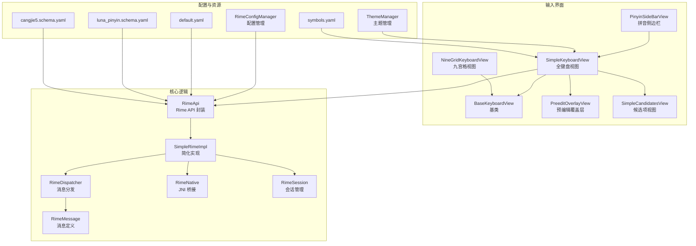
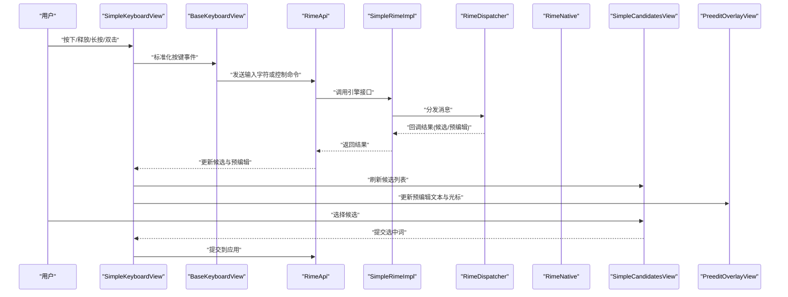
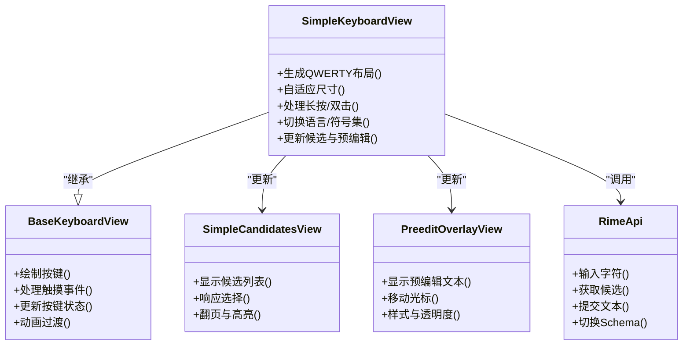
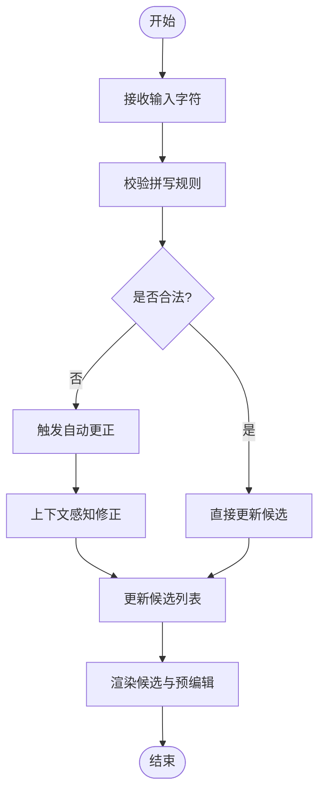
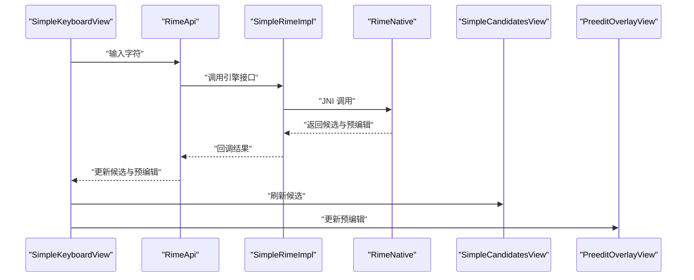
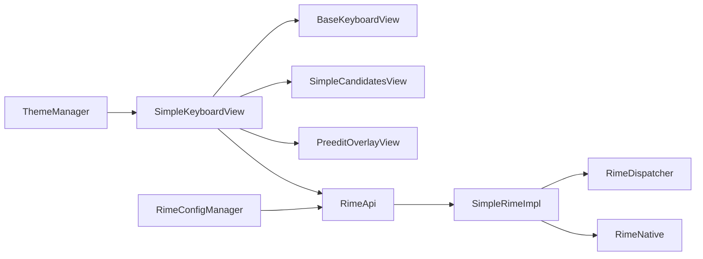

# 全键盘视图

<cite>
**本文引用的文件**   
- [SimpleKeyboardView.kt](file://app/src/main/java/com/ziyou/ime/ime/SimpleKeyboardView.kt)
- [BaseKeyboardView.kt](file://app/src/main/java/com/ziyou/ime/ime/BaseKeyboardView.kt)
- [NineGridKeyboardView.kt](file://app/src/main/java/com/ziyou/ime/ime/NineGridKeyboardView.kt)
- [PinyinSideBarView.kt](file://app/src/main/java/com/ziyou/ime/ime/PinyinSideBarView.kt)
- [PreeditOverlayView.kt](file://app/src/main/java/com/ziyou/ime/ime/PreeditOverlayView.kt)
- [SimpleCandidatesView.kt](file://app/src/main/java/com/ziyou/ime/ime/SimpleCandidatesView.kt)
- [KeyCode.kt](file://app/src/main/java/com/ziyou/ime/ime/KeyCode.kt)
- [KeyboardType.kt](file://app/src/main/java/com/ziyou/ime/ime/KeyboardType.kt)
- [RimeApi.kt](file://app/src/main/java/com/ziyou/ime/core/RimeApi.kt)
- [SimpleRimeImpl.kt](file://app/src/main/java/com/ziyou/ime/core/SimpleRimeImpl.kt)
- [RimeDispatcher.kt](file://app/src/main/java/com/ziyou/ime/core/RimeDispatcher.kt)
- [RimeMessage.kt](file://app/src/main/java/com/ziyou/ime/core/RimeMessage.kt)
- [RimeNative.kt](file://app/src/main/java/com/ziyou/ime/core/RimeNative.kt)
- [RimeSession.kt](file://app/src/main/java/com/ziyou/ime/daemon/RimeSession.kt)
- [ThemeManager.kt](file://app/src/main/java/com/ziyou/ime/config/ThemeManager.kt)
- [RimeConfigManager.kt](file://app/src/main/java/com/ziyou/ime/config/RimeConfigManager.kt)
- [T9PinYinUtils.kt](file://app/src/main/java/com/ziyou/ime/util/T9PinYinUtils.kt)
- [default.yaml](file://app/src/main/assets/rime/default.yaml)
- [luna_pinyin.schema.yaml](file://app/src/main/assets/rime/luna_pinyin.schema.yaml)
- [cangjie5.schema.yaml](file://app/src/main/assets/rime/cangjie5.schema.yaml)
- [symbols.yaml](file://app/src/main/assets/rime/symbols.yaml)
</cite>

## 目录
1. [简介](#简介)
2. [项目结构](#项目结构)
3. [核心组件](#核心组件)
4. [架构总览](#架构总览)
5. [详细组件分析](#详细组件分析)
6. [依赖关系分析](#依赖关系分析)
7. [性能考量](#性能考量)
8. [故障排查指南](#故障排查指南)
9. [结论](#结论)
10. [附录](#附录)

## 简介
本技术文档聚焦于 SimpleKeyboardView 全键盘视图，系统性阐述 QWERTY 全键盘布局的实现原理、自适应与屏幕适配策略、智能纠错（拼写检查、自动更正、上下文感知修正）、多语言支持与字符集切换机制、高级交互（长按、双击等）实现细节，以及与 Rime 引擎的集成方式（实时翻译、候选词更新）。同时覆盖主题定制、按键音效配置与用户体验优化建议，并提供性能监控与内存使用优化指南。

## 项目结构
该工程采用 Android IME 架构，UI 层由多个自定义 View 组成：全键盘视图、九宫格视图、拼音侧边栏、预编辑覆盖层与候选项视图；核心逻辑通过 Kotlin 封装 Rime 引擎，借助 JNI 调用底层 C++ 能力；资源与配置以 YAML 形式管理输入法模式、词典与符号集。

图表来源
- [SimpleKeyboardView.kt](file://app/src/main/java/com/ziyou/ime/ime/SimpleKeyboardView.kt)
- [BaseKeyboardView.kt](file://app/src/main/java/com/ziyou/ime/ime/BaseKeyboardView.kt)
- [NineGridKeyboardView.kt](file://app/src/main/java/com/ziyou/ime/ime/NineGridKeyboardView.kt)
- [PinyinSideBarView.kt](file://app/src/main/java/com/ziyou/ime/ime/PinyinSideBarView.kt)
- [PreeditOverlayView.kt](file://app/src/main/java/com/ziyou/ime/ime/PreeditOverlayView.kt)
- [SimpleCandidatesView.kt](file://app/src/main/java/com/ziyou/ime/ime/SimpleCandidatesView.kt)
- [RimeApi.kt](file://app/src/main/java/com/ziyou/ime/core/RimeApi.kt)
- [SimpleRimeImpl.kt](file://app/src/main/java/com/ziyou/ime/core/SimpleRimeImpl.kt)
- [RimeDispatcher.kt](file://app/src/main/java/com/ziyou/ime/core/RimeDispatcher.kt)
- [RimeMessage.kt](file://app/src/main/java/com/ziyou/ime/core/RimeMessage.kt)
- [RimeNative.kt](file://app/src/main/java/com/ziyou/ime/core/RimeNative.kt)
- [RimeSession.kt](file://app/src/main/java/com/ziyou/ime/daemon/RimeSession.kt)
- [ThemeManager.kt](file://app/src/main/java/com/ziyou/ime/config/ThemeManager.kt)
- [RimeConfigManager.kt](file://app/src/main/java/com/ziyou/ime/config/RimeConfigManager.kt)
- [default.yaml](file://app/src/main/assets/rime/default.yaml)
- [luna_pinyin.schema.yaml](file://app/src/main/assets/rime/luna_pinyin.schema.yaml)
- [cangjie5.schema.yaml](file://app/src/main/assets/rime/cangjie5.schema.yaml)
- [symbols.yaml](file://app/src/main/assets/rime/symbols.yaml)

章节来源
- [SimpleKeyboardView.kt](file://app/src/main/java/com/ziyou/ime/ime/SimpleKeyboardView.kt)
- [BaseKeyboardView.kt](file://app/src/main/java/com/ziyou/ime/ime/BaseKeyboardView.kt)
- [NineGridKeyboardView.kt](file://app/src/main/java/com/ziyou/ime/ime/NineGridKeyboardView.kt)
- [PinyinSideBarView.kt](file://app/src/main/java/com/ziyou/ime/ime/PinyinSideBarView.kt)
- [PreeditOverlayView.kt](file://app/src/main/java/com/ziyou/ime/ime/PreeditOverlayView.kt)
- [SimpleCandidatesView.kt](file://app/src/main/java/com/ziyou/ime/ime/SimpleCandidatesView.kt)
- [RimeApi.kt](file://app/src/main/java/com/ziyou/ime/core/RimeApi.kt)
- [SimpleRimeImpl.kt](file://app/src/main/java/com/ziyou/ime/core/SimpleRimeImpl.kt)
- [RimeDispatcher.kt](file://app/src/main/java/com/ziyou/ime/core/RimeDispatcher.kt)
- [RimeMessage.kt](file://app/src/main/java/com/ziyou/ime/core/RimeMessage.kt)
- [RimeNative.kt](file://app/src/main/java/com/ziyou/ime/core/RimeNative.kt)
- [RimeSession.kt](file://app/src/main/java/com/ziyou/ime/daemon/RimeSession.kt)
- [ThemeManager.kt](file://app/src/main/java/com/ziyou/ime/config/ThemeManager.kt)
- [RimeConfigManager.kt](file://app/src/main/java/com/ziyou/ime/config/RimeConfigManager.kt)
- [default.yaml](file://app/src/main/assets/rime/default.yaml)
- [luna_pinyin.schema.yaml](file://app/src/main/assets/rime/luna_pinyin.schema.yaml)
- [cangjie5.schema.yaml](file://app/src/main/assets/rime/cangjie5.schema.yaml)
- [symbols.yaml](file://app/src/main/assets/rime/symbols.yaml)

## 核心组件
- SimpleKeyboardView：QWERTY 全键盘视图，负责按键绘制、事件处理、布局计算与候选项联动。
- BaseKeyboardView：键盘基类，提供通用绘制、触摸事件、按键状态管理与动画基础。
- NineGridKeyboardView：九宫格键盘视图，作为备选输入模式。
- PinyinSideBarView：拼音侧边栏，支持字母快速定位与跳转。
- PreeditOverlayView：预编辑覆盖层，显示当前输入中的文本与光标位置。
- SimpleCandidatesView：候选项视图，展示 Rime 返回的候选词并支持选择与翻页。
- RimeApi/SimpleRimeImpl：Rime 引擎的 Kotlin 封装与简化实现，统一输入、提交、候选查询与配置切换。
- RimeDispatcher/RimeMessage：消息分发与消息体定义，解耦 UI 与引擎回调。
- RimeNative/RimeSession：JNI 桥接与会话生命周期管理。
- ThemeManager/RimeConfigManager：主题与 Rime 配置管理，支持动态切换与持久化。

章节来源
- [SimpleKeyboardView.kt](file://app/src/main/java/com/ziyou/ime/ime/SimpleKeyboardView.kt)
- [BaseKeyboardView.kt](file://app/src/main/java/com/ziyou/ime/ime/BaseKeyboardView.kt)
- [NineGridKeyboardView.kt](file://app/src/main/java/com/ziyou/ime/ime/NineGridKeyboardView.kt)
- [PinyinSideBarView.kt](file://app/src/main/java/com/ziyou/ime/ime/PinyinSideBarView.kt)
- [PreeditOverlayView.kt](file://app/src/main/java/com/ziyou/ime/ime/PreeditOverlayView.kt)
- [SimpleCandidatesView.kt](file://app/src/main/java/com/ziyou/ime/ime/SimpleCandidatesView.kt)
- [RimeApi.kt](file://app/src/main/java/com/ziyou/ime/core/RimeApi.kt)
- [SimpleRimeImpl.kt](file://app/src/main/java/com/ziyou/ime/core/SimpleRimeImpl.kt)
- [RimeDispatcher.kt](file://app/src/main/java/com/ziyou/ime/core/RimeDispatcher.kt)
- [RimeMessage.kt](file://app/src/main/java/com/ziyou/ime/core/RimeMessage.kt)
- [RimeNative.kt](file://app/src/main/java/com/ziyou/ime/core/RimeNative.kt)
- [RimeSession.kt](file://app/src/main/java/com/ziyou/ime/daemon/RimeSession.kt)
- [ThemeManager.kt](file://app/src/main/java/com/ziyou/ime/config/ThemeManager.kt)
- [RimeConfigManager.kt](file://app/src/main/java/com/ziyou/ime/config/RimeConfigManager.kt)

## 架构总览
全键盘视图与 Rime 引擎的交互遵循“输入事件 → 预处理 → 引擎处理 → 候选更新 → UI 刷新”的闭环流程。按键事件在 SimpleKeyboardView 中捕获，经 BaseKeyboardView 标准化后交由 RimeApi 处理；Rime 引擎返回候选列表与预编辑文本，UI 层进行渲染与用户交互反馈。

图表来源
- [SimpleKeyboardView.kt](file://app/src/main/java/com/ziyou/ime/ime/SimpleKeyboardView.kt)
- [BaseKeyboardView.kt](file://app/src/main/java/com/ziyou/ime/ime/BaseKeyboardView.kt)
- [RimeApi.kt](file://app/src/main/java/com/ziyou/ime/core/RimeApi.kt)
- [SimpleRimeImpl.kt](file://app/src/main/java/com/ziyou/ime/core/SimpleRimeImpl.kt)
- [RimeDispatcher.kt](file://app/src/main/java/com/ziyou/ime/core/RimeDispatcher.kt)
- [RimeNative.kt](file://app/src/main/java/com/ziyou/ime/core/RimeNative.kt)
- [SimpleCandidatesView.kt](file://app/src/main/java/com/ziyou/ime/ime/SimpleCandidatesView.kt)
- [PreeditOverlayView.kt](file://app/src/main/java/com/ziyou/ime/ime/PreeditOverlayView.kt)

## 详细组件分析

### SimpleKeyboardView：QWERTY 全键盘布局与交互
- 布局算法
  - 基于行与列的网格模型，按标准 QWERTY 键位顺序生成键对象集合。
  - 键尺寸根据可用宽度与密度自适应计算，保证在不同屏幕尺寸下保持合理比例。
  - 特殊键（空格、回车、切换、符号）占位与对齐策略确保视觉一致性。
- 自适应与屏幕适配
  - 依据屏幕宽度与 DPI 动态调整键间距与字号，避免拥挤或过大。
  - 横竖屏切换时重新计算布局，保证按键可点击区域稳定。
- 智能纠错
  - 结合 Rime 的拼写检查与自动更正能力，对误触与近似键位进行修正。
  - 上下文感知修正利用历史输入与候选权重提升准确率。
- 多语言与字符集切换
  - 通过 Rime 配置切换 schema（如中文拼音、仓颉、英文），实时更新键映射与候选规则。
  - 支持符号集与标点集的动态加载，满足多场景输入需求。
- 高级交互
  - 长按触发二级菜单或功能（如切换输入法、插入符号）。
  - 双击用于快速重复输入或快捷操作（如连续空格、快速换行）。
  - 手势滑动支持方向导航与候选翻页。
- 与 Rime 集成
  - 输入字符通过 RimeApi 传入，实时获取候选与预编辑文本。
  - 候选更新驱动 SimpleCandidatesView 刷新，预编辑文本由 PreeditOverlayView 显示。
- 主题与音效
  - 主题颜色、字体大小、按键背景由 ThemeManager 统一管理。
  - 按键音效开关与音量由配置控制，避免影响系统音频体验。

图表来源
- [BaseKeyboardView.kt](file://app/src/main/java/com/ziyou/ime/ime/BaseKeyboardView.kt)
- [SimpleKeyboardView.kt](file://app/src/main/java/com/ziyou/ime/ime/SimpleKeyboardView.kt)
- [SimpleCandidatesView.kt](file://app/src/main/java/com/ziyou/ime/ime/SimpleCandidatesView.kt)
- [PreeditOverlayView.kt](file://app/src/main/java/com/ziyou/ime/ime/PreeditOverlayView.kt)
- [RimeApi.kt](file://app/src/main/java/com/ziyou/ime/core/RimeApi.kt)

章节来源
- [SimpleKeyboardView.kt](file://app/src/main/java/com/ziyou/ime/ime/SimpleKeyboardView.kt)
- [BaseKeyboardView.kt](file://app/src/main/java/com/ziyou/ime/ime/BaseKeyboardView.kt)
- [SimpleCandidatesView.kt](file://app/src/main/java/com/ziyou/ime/ime/SimpleCandidatesView.kt)
- [PreeditOverlayView.kt](file://app/src/main/java/com/ziyou/ime/ime/PreeditOverlayView.kt)
- [RimeApi.kt](file://app/src/main/java/com/ziyou/ime/core/RimeApi.kt)

### 智能纠错与上下文感知修正
- 拼写检查
  - 基于 Rime 的拼写模块，检测输入序列是否符合目标语言的音节或字根规则。
  - 对不符合规则的序列给出提示或自动回退至最近合法状态。
- 自动更正
  - 当检测到近似键位或常见错误时，自动替换为更可能的正确输入。
  - 结合用户词典与历史频率，提高更正准确性。
- 上下文感知
  - 利用前后文语义与语法约束，过滤低概率候选，提升候选质量。
  - 针对特定领域词汇（如技术术语）进行加权，增强专业输入体验。

图表来源
- [RimeApi.kt](file://app/src/main/java/com/ziyou/ime/core/RimeApi.kt)
- [SimpleRimeImpl.kt](file://app/src/main/java/com/ziyou/ime/core/SimpleRimeImpl.kt)
- [RimeDispatcher.kt](file://app/src/main/java/com/ziyou/ime/core/RimeDispatcher.kt)
- [RimeMessage.kt](file://app/src/main/java/com/ziyou/ime/core/RimeMessage.kt)

章节来源
- [RimeApi.kt](file://app/src/main/java/com/ziyou/ime/core/RimeApi.kt)
- [SimpleRimeImpl.kt](file://app/src/main/java/com/ziyou/ime/core/SimpleRimeImpl.kt)
- [RimeDispatcher.kt](file://app/src/main/java/com/ziyou/ime/core/RimeDispatcher.kt)
- [RimeMessage.kt](file://app/src/main/java/com/ziyou/ime/core/RimeMessage.kt)

### 多语言支持与字符集切换机制
- Schema 切换
  - 通过 RimeConfigManager 读取 default.yaml 与对应 schema.yaml，动态切换输入模式。
  - 切换后重新初始化 Rime 引擎上下文，确保新模式的词典与规则生效。
- 字符集与符号集
  - symbols.yaml 定义常用符号与标点，支持按场景加载。
  - 全键盘视图根据当前 schema 动态调整键位映射与候选规则。
- 语言优先级与回退
  - 优先匹配用户词典与高频词，回退至通用词典以保证可用性。

章节来源
- [RimeConfigManager.kt](file://app/src/main/java/com/ziyou/ime/config/RimeConfigManager.kt)
- [default.yaml](file://app/src/main/assets/rime/default.yaml)
- [luna_pinyin.schema.yaml](file://app/src/main/assets/rime/luna_pinyin.schema.yaml)
- [cangjie5.schema.yaml](file://app/src/main/assets/rime/cangjie5.schema.yaml)
- [symbols.yaml](file://app/src/main/assets/rime/symbols.yaml)

### 高级交互：长按、双击与手势
- 长按
  - 触发二级菜单或功能（如切换输入法、插入特殊符号）。
  - 支持长按预览与拖拽选择。
- 双击
  - 快速重复输入或快捷操作（如连续空格、快速换行）。
  - 双击间隔阈值可配置，避免误触。
- 手势
  - 滑动支持方向导航与候选翻页。
  - 手势路径识别提升输入效率。

章节来源
- [SimpleKeyboardView.kt](file://app/src/main/java/com/ziyou/ime/ime/SimpleKeyboardView.kt)
- [BaseKeyboardView.kt](file://app/src/main/java/com/ziyou/ime/ime/BaseKeyboardView.kt)

### 与 Rime 引擎的集成：实时翻译与候选更新
- 输入流程
  - 按键事件经 BaseKeyboardView 标准化后，通过 RimeApi 传入 SimpleRimeImpl。
  - SimpleRimeImpl 调用 RimeNative 执行引擎处理，返回候选与预编辑文本。
- 候选更新
  - RimeDispatcher 将结果回调至 UI 层，SimpleCandidatesView 刷新候选列表。
  - PreeditOverlayView 同步更新预编辑文本与光标位置。
- 提交与确认
  - 用户选择候选后，SimpleKeyboardView 调用 RimeApi 提交文本至应用。

图表来源
- [RimeApi.kt](file://app/src/main/java/com/ziyou/ime/core/RimeApi.kt)
- [SimpleRimeImpl.kt](file://app/src/main/java/com/ziyou/ime/core/SimpleRimeImpl.kt)
- [RimeNative.kt](file://app/src/main/java/com/ziyou/ime/core/RimeNative.kt)
- [SimpleCandidatesView.kt](file://app/src/main/java/com/ziyou/ime/ime/SimpleCandidatesView.kt)
- [PreeditOverlayView.kt](file://app/src/main/java/com/ziyou/ime/ime/PreeditOverlayView.kt)

章节来源
- [RimeApi.kt](file://app/src/main/java/com/ziyou/ime/core/RimeApi.kt)
- [SimpleRimeImpl.kt](file://app/src/main/java/com/ziyou/ime/core/SimpleRimeImpl.kt)
- [RimeNative.kt](file://app/src/main/java/com/ziyou/ime/core/RimeNative.kt)
- [SimpleCandidatesView.kt](file://app/src/main/java/com/ziyou/ime/ime/SimpleCandidatesView.kt)
- [PreeditOverlayView.kt](file://app/src/main/java/com/ziyou/ime/ime/PreeditOverlayView.kt)

### 主题定制与按键音效配置
- 主题定制
  - ThemeManager 统一管理颜色、字体、背景与阴影，支持动态切换与持久化。
  - 全键盘视图根据主题重绘按键，确保视觉一致性。
- 按键音效
  - 音效开关与音量由配置控制，避免影响系统音频体验。
  - 支持自定义音效文件与播放策略。

章节来源
- [ThemeManager.kt](file://app/src/main/java/com/ziyou/ime/config/ThemeManager.kt)
- [SimpleKeyboardView.kt](file://app/src/main/java/com/ziyou/ime/ime/SimpleKeyboardView.kt)

### 用户体验优化建议
- 响应性
  - 减少主线程阻塞，异步处理 Rime 引擎调用。
  - 预加载候选与缓存常用词，降低延迟。
- 可访问性
  - 支持无障碍朗读与高对比度主题。
  - 提供大字体与宽按键选项。
- 个性化
  - 允许用户自定义快捷键与手势。
  - 支持学习用户输入习惯，提升预测准确性。

[本节为概念性内容，不直接分析具体文件]

## 依赖关系分析
全键盘视图依赖基类提供通用能力，与候选视图和预编辑视图协作完成输入流程；核心逻辑通过 RimeApi 与 Rime 引擎交互，配置与主题管理提供外部支持。

图表来源
- [SimpleKeyboardView.kt](file://app/src/main/java/com/ziyou/ime/ime/SimpleKeyboardView.kt)
- [BaseKeyboardView.kt](file://app/src/main/java/com/ziyou/ime/ime/BaseKeyboardView.kt)
- [SimpleCandidatesView.kt](file://app/src/main/java/com/ziyou/ime/ime/SimpleCandidatesView.kt)
- [PreeditOverlayView.kt](file://app/src/main/java/com/ziyou/ime/ime/PreeditOverlayView.kt)
- [RimeApi.kt](file://app/src/main/java/com/ziyou/ime/core/RimeApi.kt)
- [SimpleRimeImpl.kt](file://app/src/main/java/com/ziyou/ime/core/SimpleRimeImpl.kt)
- [RimeDispatcher.kt](file://app/src/main/java/com/ziyou/ime/core/RimeDispatcher.kt)
- [RimeNative.kt](file://app/src/main/java/com/ziyou/ime/core/RimeNative.kt)
- [ThemeManager.kt](file://app/src/main/java/com/ziyou/ime/config/ThemeManager.kt)
- [RimeConfigManager.kt](file://app/src/main/java/com/ziyou/ime/config/RimeConfigManager.kt)

章节来源
- [SimpleKeyboardView.kt](file://app/src/main/java/com/ziyou/ime/ime/SimpleKeyboardView.kt)
- [BaseKeyboardView.kt](file://app/src/main/java/com/ziyou/ime/ime/BaseKeyboardView.kt)
- [SimpleCandidatesView.kt](file://app/src/main/java/com/ziyou/ime/ime/SimpleCandidatesView.kt)
- [PreeditOverlayView.kt](file://app/src/main/java/com/ziyou/ime/ime/PreeditOverlayView.kt)
- [RimeApi.kt](file://app/src/main/java/com/ziyou/ime/core/RimeApi.kt)
- [SimpleRimeImpl.kt](file://app/src/main/java/com/ziyou/ime/core/SimpleRimeImpl.kt)
- [RimeDispatcher.kt](file://app/src/main/java/com/ziyou/ime/core/RimeDispatcher.kt)
- [RimeNative.kt](file://app/src/main/java/com/ziyou/ime/core/RimeNative.kt)
- [ThemeManager.kt](file://app/src/main/java/com/ziyou/ime/config/ThemeManager.kt)
- [RimeConfigManager.kt](file://app/src/main/java/com/ziyou/ime/config/RimeConfigManager.kt)

## 性能考量
- 渲染优化
  - 减少不必要的重绘，使用离屏缓冲与双缓冲技术。
  - 按需绘制候选与预编辑，避免全量刷新。
- 内存管理
  - 避免持有大量临时对象，及时释放不再使用的资源。
  - 使用对象池与缓存复用频繁创建的对象。
- 引擎调用
  - 异步处理 Rime 引擎调用，避免阻塞主线程。
  - 限制候选数量与长度，减少内存占用。
- 监控与诊断
  - 记录关键指标（帧率、内存峰值、调用耗时）。
  - 提供日志与调试工具，便于问题定位。

[本节为通用指导，不直接分析具体文件]

## 故障排查指南
- 候选不更新
  - 检查 RimeApi 调用是否正确，确认消息分发与回调链路。
  - 验证 schema 与词典配置是否加载成功。
- 预编辑异常
  - 检查 PreeditOverlayView 的文本更新逻辑与光标位置计算。
  - 确认与 Rime 引擎的预编辑状态同步。
- 主题失效
  - 检查 ThemeManager 的配置与资源引用。
  - 确认视图重绘与主题应用时机。
- 音效问题
  - 检查音效文件路径与权限。
  - 确认播放器实例与音量设置。

章节来源
- [RimeApi.kt](file://app/src/main/java/com/ziyou/ime/core/RimeApi.kt)
- [SimpleRimeImpl.kt](file://app/src/main/java/com/ziyou/ime/core/SimpleRimeImpl.kt)
- [RimeDispatcher.kt](file://app/src/main/java/com/ziyou/ime/core/RimeDispatcher.kt)
- [PreeditOverlayView.kt](file://app/src/main/java/com/ziyou/ime/ime/PreeditOverlayView.kt)
- [ThemeManager.kt](file://app/src/main/java/com/ziyou/ime/config/ThemeManager.kt)

## 结论
SimpleKeyboardView 全键盘视图通过清晰的架构设计与模块化实现，提供了高质量的 QWERTY 输入体验。其布局算法、自适应策略、智能纠错、多语言支持与高级交互功能共同构建了稳定高效的输入系统。与 Rime 引擎的深度集成确保了强大的候选与翻译能力，主题与音效配置提升了用户体验。通过性能优化与故障排查指南，可进一步提升系统的稳定性与可维护性。

[本节为总结性内容，不直接分析具体文件]

## 附录
- 相关工具与辅助
  - T9PinYinUtils：九宫格拼音工具，辅助九宫格模式下的输入优化。
  - KeyCode/KeyboardType：按键类型与编码定义，规范输入事件处理。

章节来源
- [T9PinYinUtils.kt](file://app/src/main/java/com/ziyou/ime/util/T9PinYinUtils.kt)
- [KeyCode.kt](file://app/src/main/java/com/ziyou/ime/ime/KeyCode.kt)
- [KeyboardType.kt](file://app/src/main/java/com/ziyou/ime/ime/KeyboardType.kt)