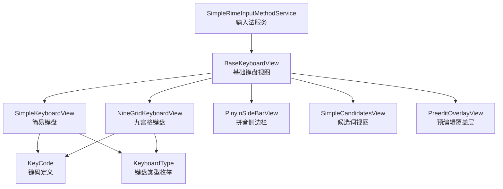
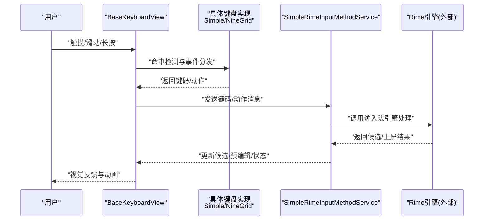
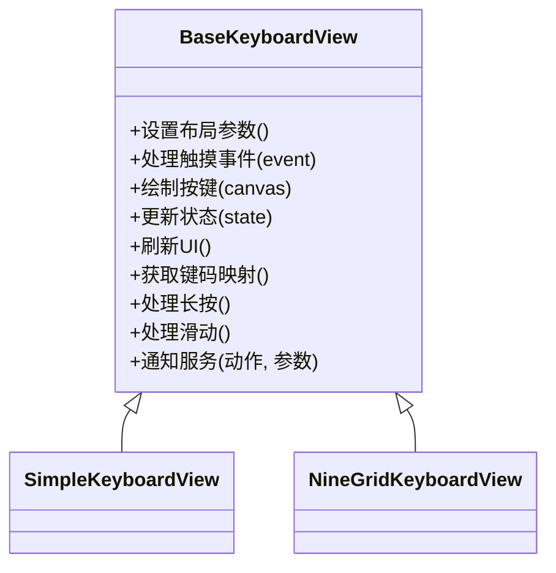
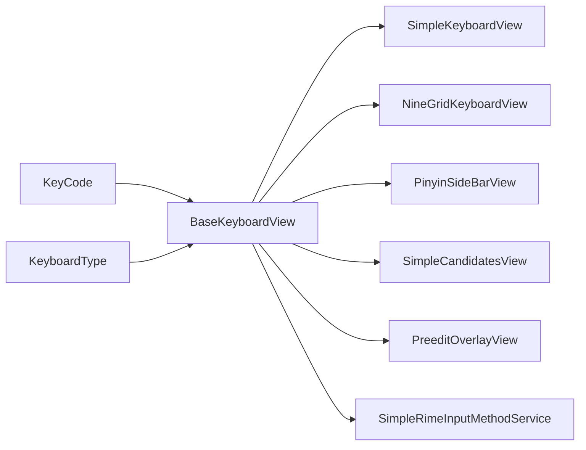

# 基础键盘视图

<cite>
**本文引用的文件**   
- [BaseKeyboardView.kt](file://app/src/main/java/com/ziyou/ime/ime/BaseKeyboardView.kt)
- [SimpleKeyboardView.kt](file://app/src/main/java/com/ziyou/ime/ime/SimpleKeyboardView.kt)
- [NineGridKeyboardView.kt](file://app/src/main/java/com/ziyou/ime/ime/NineGridKeyboardView.kt)
- [KeyCode.kt](file://app/src/main/java/com/ziyou/ime/ime/KeyCode.kt)
- [KeyboardType.kt](file://app/src/main/java/com/ziyou/ime/ime/KeyboardType.kt)
- [SimpleRimeInputMethodService.kt](file://app/src/main/java/com/ziyou/ime/ime/SimpleRimeInputMethodService.kt)
- [PinyinSideBarView.kt](file://app/src/main/java/com/ziyou/ime/ime/PinyinSideBarView.kt)
- [PreeditOverlayView.kt](file://app/src/main/java/com/ziyou/ime/ime/PreeditOverlayView.kt)
- [SimpleCandidatesView.kt](file://app/src/main/java/com/ziyou/ime/ime/SimpleCandidatesView.kt)
</cite>

## 目录
1. [简介](#简介)
2. [项目结构](#项目结构)
3. [核心组件](#核心组件)
4. [架构总览](#架构总览)
5. [详细组件分析](#详细组件分析)
6. [依赖关系分析](#依赖关系分析)
7. [性能考量](#性能考量)
8. [故障排查指南](#故障排查指南)
9. [结论](#结论)
10. [附录：扩展与自定义指南](#附录扩展与自定义指南)

## 简介
本技术文档聚焦于 BaseKeyboardView，作为所有键盘类型的基类，它统一了按键布局管理、触摸事件处理、视觉反馈机制与状态管理。本文从系统架构、数据流、绘制与动画、与输入法服务的集成、以及扩展开发等方面进行全面解析，并提供性能优化与内存管理建议，帮助开发者基于该基类快速构建稳定高效的自定义键盘类型。

## 项目结构
与 BaseKeyboardView 相关的代码主要位于 app/src/main/java/com/ziyou/ime/ime 包下，包含基础键盘视图、具体键盘实现、侧边栏、候选词与预编辑覆盖层等。下图展示了这些组件在输入流程中的角色与交互关系。

图表来源
- [BaseKeyboardView.kt](file://app/src/main/java/com/ziyou/ime/ime/BaseKeyboardView.kt)
- [SimpleKeyboardView.kt](file://app/src/main/java/com/ziyou/ime/ime/SimpleKeyboardView.kt)
- [NineGridKeyboardView.kt](file://app/src/main/java/com/ziyou/ime/ime/NineGridKeyboardView.kt)
- [PinyinSideBarView.kt](file://app/src/main/java/com/ziyou/ime/ime/PinyinSideBarView.kt)
- [SimpleCandidatesView.kt](file://app/src/main/java/com/ziyou/ime/ime/SimpleCandidatesView.kt)
- [PreeditOverlayView.kt](file://app/src/main/java/com/ziyou/ime/ime/PreeditOverlayView.kt)
- [KeyCode.kt](file://app/src/main/java/com/ziyou/ime/ime/KeyCode.kt)
- [KeyboardType.kt](file://app/src/main/java/com/ziyou/ime/ime/KeyboardType.kt)

章节来源
- [BaseKeyboardView.kt](file://app/src/main/java/com/ziyou/ime/ime/BaseKeyboardView.kt)
- [SimpleKeyboardView.kt](file://app/src/main/java/com/ziyou/ime/ime/SimpleKeyboardView.kt)
- [NineGridKeyboardView.kt](file://app/src/main/java/com/ziyou/ime/ime/NineGridKeyboardView.kt)
- [PinyinSideBarView.kt](file://app/src/main/java/com/ziyou/ime/ime/PinyinSideBarView.kt)
- [SimpleCandidatesView.kt](file://app/src/main/java/com/ziyou/ime/ime/SimpleCandidatesView.kt)
- [PreeditOverlayView.kt](file://app/src/main/java/com/ziyou/ime/ime/PreeditOverlayView.kt)
- [KeyCode.kt](file://app/src/main/java/com/ziyou/ime/ime/KeyCode.kt)
- [KeyboardType.kt](file://app/src/main/java/com/ziyou/ime/ime/KeyboardType.kt)

## 核心组件
- BaseKeyboardView：抽象的键盘视图基类，负责统一的布局测量、按键绘制、触摸事件分发、按压态与高亮反馈、动画过渡、以及与服务层的消息桥接。
- SimpleKeyboardView：基于 BaseKeyboardView 的通用 QWERTY 风格键盘实现。
- NineGridKeyboardView：基于 BaseKeyboardView 的九宫格拼音键盘实现。
- PinyinSideBarView：拼音首字母或索引侧边栏，用于快速定位候选。
- SimpleCandidatesView：候选词列表展示与选择。
- PreeditOverlayView：预编辑文本覆盖层，显示当前正在输入的中间结果。
- KeyCode：键码常量与映射，统一按键标识。
- KeyboardType：键盘类型枚举，区分不同键盘模式（如全键盘、九宫格、符号等）。

章节来源
- [BaseKeyboardView.kt](file://app/src/main/java/com/ziyou/ime/ime/BaseKeyboardView.kt)
- [SimpleKeyboardView.kt](file://app/src/main/java/com/ziyou/ime/ime/SimpleKeyboardView.kt)
- [NineGridKeyboardView.kt](file://app/src/main/java/com/ziyou/ime/ime/NineGridKeyboardView.kt)
- [PinyinSideBarView.kt](file://app/src/main/java/com/ziyou/ime/ime/PinyinSideBarView.kt)
- [SimpleCandidatesView.kt](file://app/src/main/java/com/ziyou/ime/ime/SimpleCandidatesView.kt)
- [PreeditOverlayView.kt](file://app/src/main/java/com/ziyou/ime/ime/PreeditOverlayView.kt)
- [KeyCode.kt](file://app/src/main/java/com/ziyou/ime/ime/KeyCode.kt)
- [KeyboardType.kt](file://app/src/main/java/com/ziyou/ime/ime/KeyboardType.kt)

## 架构总览
BaseKeyboardView 作为输入法的 UI 核心，向上对接输入法服务（SimpleRimeInputMethodService），向下驱动具体键盘实现与辅助视图（候选词、侧边栏、预编辑层）。其职责边界清晰：
- 输入事件采集：触摸坐标到按键命中检测、长按与滑动识别。
- 状态管理：按键按下态、高亮态、禁用态、切换态（如大小写、数字/符号切换）。
- 绘制与动画：按键背景、文字、图标、按压反馈、选中态过渡。
- 消息传递：将用户操作转换为键码或动作，上报给输入法服务进行后续处理（如拼写、选词、上屏）。

图表来源
- [BaseKeyboardView.kt](file://app/src/main/java/com/ziyou/ime/ime/BaseKeyboardView.kt)
- [SimpleKeyboardView.kt](file://app/src/main/java/com/ziyou/ime/ime/SimpleKeyboardView.kt)
- [NineGridKeyboardView.kt](file://app/src/main/java/com/ziyou/ime/ime/NineGridKeyboardView.kt)
- [SimpleRimeInputMethodService.kt](file://app/src/main/java/com/ziyou/ime/ime/SimpleRimeInputMethodService.kt)

## 详细组件分析

### BaseKeyboardView 基类分析
BaseKeyboardView 承担以下关键职责：
- 布局与测量：根据屏幕尺寸与配置动态计算按键网格、间距、字号与图标尺寸。
- 触摸事件处理：onTouchEvent 中完成命中检测、长按判定、滑动识别、手势拦截与转发。
- 视觉反馈：按下态、高亮态、禁用态的颜色与形状变化；可选的缩放或阴影动画。
- 状态机：维护当前键盘类型、是否大写锁定、是否处于数字/符号模式、是否显示候选等。
- 绘制系统：自定义 onDraw 流程，分层绘制背景、按键、文字、图标、覆盖层。
- 动画效果：使用插值器与帧动画实现平滑过渡，避免频繁重绘。
- 抽象方法：定义子类必须实现的按键布局生成、键码映射、特殊行为处理等。

图表来源
- [BaseKeyboardView.kt](file://app/src/main/java/com/ziyou/ime/ime/BaseKeyboardView.kt)
- [SimpleKeyboardView.kt](file://app/src/main/java/com/ziyou/ime/ime/SimpleKeyboardView.kt)
- [NineGridKeyboardView.kt](file://app/src/main/java/com/ziyou/ime/ime/NineGridKeyboardView.kt)

章节来源
- [BaseKeyboardView.kt](file://app/src/main/java/com/ziyou/ime/ime/BaseKeyboardView.kt)

### SimpleKeyboardView 简易键盘
- 布局策略：按行组织按键，支持多行自适应与换行逻辑。
- 键码映射：将物理按键映射为 KeyCode，并处理修饰键（Shift、空格、回车等）。
- 特殊行为：大小写切换、中英文切换、符号面板切换。
- 与 BaseKeyboardView 协作：复用触摸与绘制逻辑，仅实现布局与映射差异。

章节来源
- [SimpleKeyboardView.kt](file://app/src/main/java/com/ziyou/ime/ime/SimpleKeyboardView.kt)
- [KeyCode.kt](file://app/src/main/java/com/ziyou/ime/ime/KeyCode.kt)

### NineGridKeyboardView 九宫格键盘
- 布局策略：3x4 网格布局，每个键对应多个字符，支持长按与滑动选择。
- 键码映射：数字键到字符集合的映射，结合拼音规则生成候选。
- 特殊行为：长按触发候选预览、滑动选择候选、快速输入模式。
- 与 BaseKeyboardView 协作：复用触摸与绘制逻辑，重点实现网格命中与字符集映射。

章节来源
- [NineGridKeyboardView.kt](file://app/src/main/java/com/ziyou/ime/ime/NineGridKeyboardView.kt)
- [KeyCode.kt](file://app/src/main/java/com/ziyou/ime/ime/KeyCode.kt)

### PinyinSideBarView 拼音侧边栏
- 功能：提供首字母或索引条，快速滚动至目标候选。
- 交互：触摸滑动更新高亮区域，实时反馈当前位置。
- 与 BaseKeyboardView 协作：通过回调通知主键盘更新候选列表。

章节来源
- [PinyinSideBarView.kt](file://app/src/main/java/com/ziyou/ime/ime/PinyinSideBarView.kt)

### SimpleCandidatesView 候选词视图
- 功能：展示候选词列表，支持点击选择与翻页。
- 交互：点击选中、滑动翻页、长按复制。
- 与 BaseKeyboardView 协作：接收来自键盘的输入信号，渲染候选并回传选择结果。

章节来源
- [SimpleCandidatesView.kt](file://app/src/main/java/com/ziyou/ime/ime/SimpleCandidatesView.kt)

### PreeditOverlayView 预编辑覆盖层
- 功能：显示当前正在输入的中间结果（如拼音串），支持删除与修正。
- 交互：覆盖在主键盘上方，透明背景，跟随光标位置。
- 与 BaseKeyboardView 协作：监听键盘输入，实时更新预编辑内容。

章节来源
- [PreeditOverlayView.kt](file://app/src/main/java/com/ziyou/ime/ime/PreeditOverlayView.kt)

### KeyCode 与 KeyboardType
- KeyCode：统一定义所有键码常量，确保跨键盘一致性与可维护性。
- KeyboardType：枚举键盘类型，控制布局与行为差异（如全键盘、九宫格、符号）。

章节来源
- [KeyCode.kt](file://app/src/main/java/com/ziyou/ime/ime/KeyCode.kt)
- [KeyboardType.kt](file://app/src/main/java/com/ziyou/ime/ime/KeyboardType.kt)

## 依赖关系分析
BaseKeyboardView 与输入法服务及子视图之间存在清晰的依赖关系：
- BaseKeyboardView 依赖 KeyCode 与 KeyboardType 以统一键码与类型。
- 具体键盘实现（Simple/NineGrid）继承 BaseKeyboardView，复用通用逻辑。
- 辅助视图（候选词、侧边栏、预编辑层）通过回调或服务接口与 BaseKeyboardView 通信。
- 输入法服务作为中枢，协调键盘输入与 Rime 引擎的处理结果。

图表来源
- [BaseKeyboardView.kt](file://app/src/main/java/com/ziyou/ime/ime/BaseKeyboardView.kt)
- [KeyCode.kt](file://app/src/main/java/com/ziyou/ime/ime/KeyCode.kt)
- [KeyboardType.kt](file://app/src/main/java/com/ziyou/ime/ime/KeyboardType.kt)
- [SimpleKeyboardView.kt](file://app/src/main/java/com/ziyou/ime/ime/SimpleKeyboardView.kt)
- [NineGridKeyboardView.kt](file://app/src/main/java/com/ziyou/ime/ime/NineGridKeyboardView.kt)
- [PinyinSideBarView.kt](file://app/src/main/java/com/ziyou/ime/ime/PinyinSideBarView.kt)
- [SimpleCandidatesView.kt](file://app/src/main/java/com/ziyou/ime/ime/SimpleCandidatesView.kt)
- [PreeditOverlayView.kt](file://app/src/main/java/com/ziyou/ime/ime/PreeditOverlayView.kt)
- [SimpleRimeInputMethodService.kt](file://app/src/main/java/com/ziyou/ime/ime/SimpleRimeInputMethodService.kt)

章节来源
- [BaseKeyboardView.kt](file://app/src/main/java/com/ziyou/ime/ime/BaseKeyboardView.kt)
- [SimpleRimeInputMethodService.kt](file://app/src/main/java/com/ziyou/ime/ime/SimpleRimeInputMethodService.kt)

## 性能考量
- 绘制优化：
  - 使用离屏缓存减少重复绘制开销。
  - 批量绘制按键，避免频繁创建 Paint/Path 对象。
  - 按需重绘，仅在状态变化时触发 invalidate。
- 触摸处理：
  - 命中检测使用几何近似算法，降低计算复杂度。
  - 防抖与节流长按与滑动事件，避免误触。
- 内存管理：
  - 重用 Drawable 与 Bitmap，避免频繁 GC。
  - 及时释放大对象引用，防止内存泄漏。
- 动画性能：
  - 使用硬件加速与插值器，减少掉帧。
  - 限制同时运行的动画数量，避免资源竞争。

[本节为通用指导，不直接分析具体文件]

## 故障排查指南
- 触摸无响应：
  - 检查 onTouchEvent 的事件分发链是否正确。
  - 确认命中检测逻辑与坐标转换无误。
- 按键显示异常：
  - 验证布局测量与绘制顺序。
  - 检查颜色与字体资源加载是否正常。
- 候选词不更新：
  - 确认与服务端的回调与消息传递路径。
  - 检查候选数据源与渲染逻辑。
- 动画卡顿：
  - 分析动画帧率与 CPU/GPU 占用。
  - 简化复杂动画或改用静态反馈。

章节来源
- [BaseKeyboardView.kt](file://app/src/main/java/com/ziyou/ime/ime/BaseKeyboardView.kt)
- [SimpleRimeInputMethodService.kt](file://app/src/main/java/com/ziyou/ime/ime/SimpleRimeInputMethodService.kt)

## 结论
BaseKeyboardView 作为输入法键盘的核心基类，提供了统一的布局、事件、绘制与状态管理能力。通过清晰的抽象设计与良好的扩展点，开发者可以高效地实现各类键盘类型，并与输入法服务无缝集成。遵循本文的性能优化与内存管理建议，可进一步提升用户体验与系统稳定性。

[本节为总结性内容，不直接分析具体文件]

## 附录：扩展与自定义指南
- 继承 BaseKeyboardView：
  - 实现布局生成与键码映射方法。
  - 重写特殊行为处理（如长按、滑动）。
- 自定义样式：
  - 通过主题与资源替换颜色、字体与图标。
  - 使用自定义 Drawable 增强视觉效果。
- 与输入法服务集成：
  - 通过回调或接口将键码与动作上报服务。
  - 监听服务返回的候选与状态更新。
- 测试与调试：
  - 使用单元测试验证键码映射与状态机。
  - 通过日志与可视化调试触摸与绘制流程。

章节来源
- [BaseKeyboardView.kt](file://app/src/main/java/com/ziyou/ime/ime/BaseKeyboardView.kt)
- [SimpleRimeInputMethodService.kt](file://app/src/main/java/com/ziyou/ime/ime/SimpleRimeInputMethodService.kt)