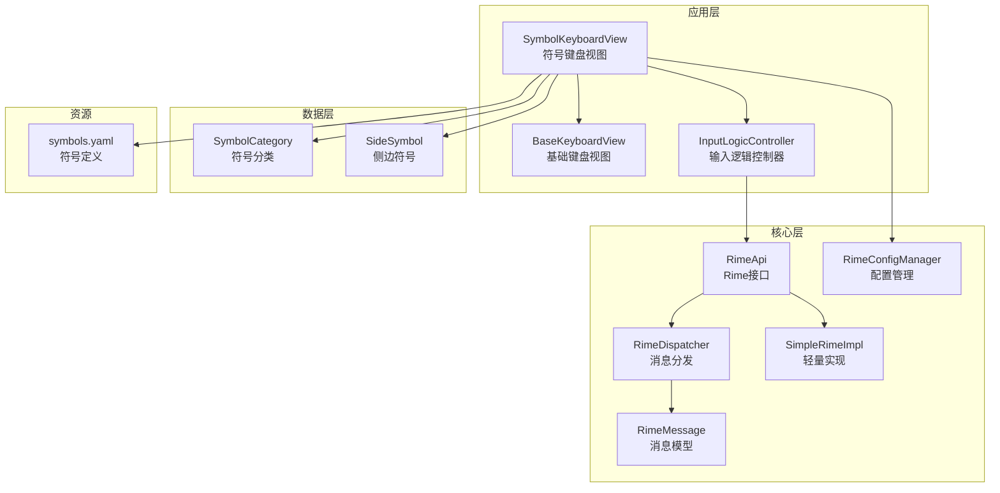
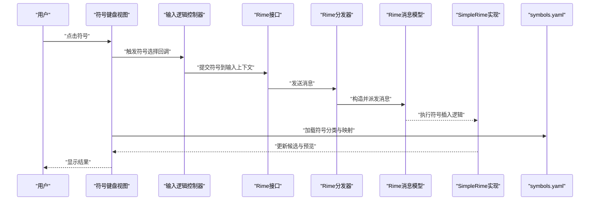
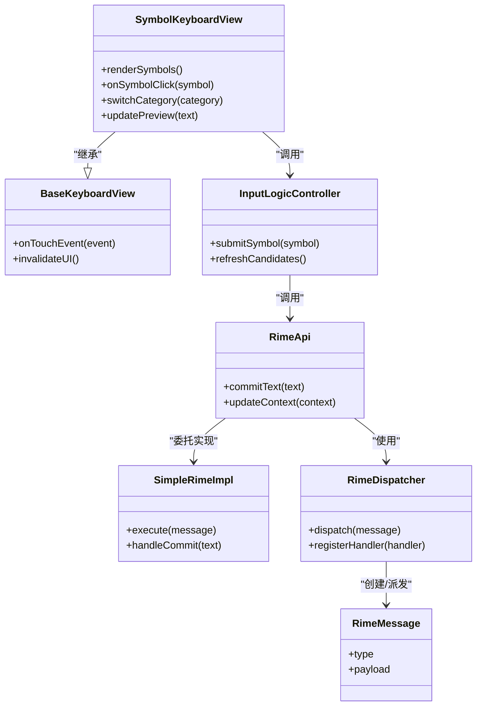
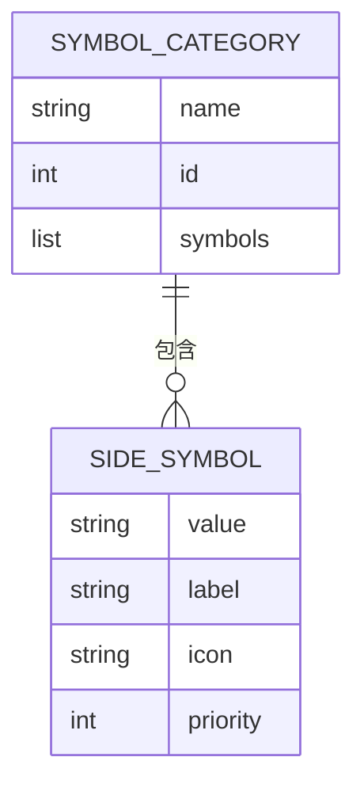
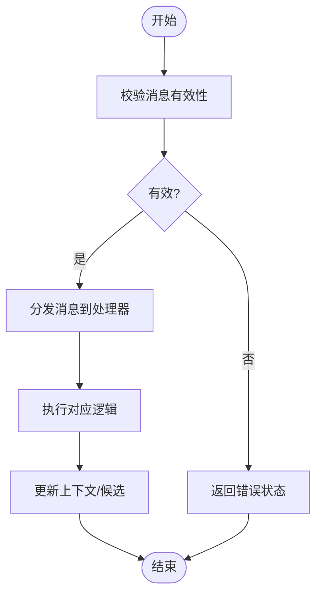
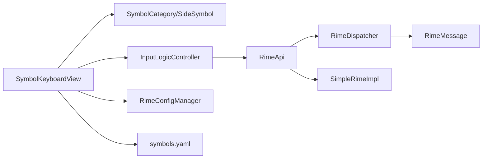

# 符号键盘系统

<cite>
**本文档引用的文件**   
- [app/src/main/java/com/ziyou/ime/ime/SymbolKeyboardView.kt](file://app/src/main/java/com/ziyou/ime/ime/SymbolKeyboardView.kt)
- [app/src/main/java/com/ziyou/ime/data/SideSymbol.kt](file://app/src/main/java/com/ziyou/ime/data/SideSymbol.kt)
- [app/src/main/java/com/ziyou/ime/data/SymbolCategory.kt](file://app/src/main/java/com/ziyou/ime/data/SymbolCategory.kt)
- [app/src/main/java/com/ziyou/ime/core/RimeApi.kt](file://app/src/main/java/com/ziyou/ime/core/RimeApi.kt)
- [app/src/main/java/com/ziyou/ime/core/RimeDispatcher.kt](file://app/src/main/java/com/ziyou/ime/core/RimeDispatcher.kt)
- [app/src/main/java/com/ziyou/ime/core/RimeMessage.kt](file://app/src/main/java/com/ziyou/ime/core/RimeMessage.kt)
- [app/src/main/java/com/ziyou/ime/core/SimpleRimeImpl.kt](file://app/src/main/java/com/ziyou/ime/core/SimpleRimeImpl.kt)
- [app/src/main/java/com/ziyou/ime/ime/InputLogicController.kt](file://app/src/main/java/com/ziyou/ime/ime/InputLogicController.kt)
- [app/src/main/java/com/ziyou/ime/ime/BaseKeyboardView.kt](file://app/src/main/java/com/ziyou/ime/ime/BaseKeyboardView.kt)
- [app/src/main/java/com/ziyou/ime/config/RimeConfigManager.kt](file://app/src/main/java/com/ziyou/ime/config/RimeConfigManager.kt)
- [app/src/main/assets/rime/symbols.yaml](file://app/src/main/assets/rime/symbols.yaml)
- [core-logic/src/main/java/com/ziyou/ime/core/t9/T9PinYinUtils.kt](file://core-logic/src/main/java/com/ziyou/ime/core/t9/T9PinYinUtils.kt)
</cite>

## 目录
1. [简介](#简介)
2. [项目结构](#项目结构)
3. [核心组件](#核心组件)
4. [架构总览](#架构总览)
5. [详细组件分析](#详细组件分析)
6. [依赖关系分析](#依赖关系分析)
7. [性能考虑](#性能考虑)
8. [故障排查指南](#故障排查指南)
9. [结论](#结论)
10. [附录](#附录)

## 简介
本文件围绕“符号键盘系统”进行系统化文档化，聚焦于符号输入面板的交互、数据组织、与输入法引擎（Rime）集成以及配置管理。该子系统在 Android 输入法应用中提供符号快速输入能力，支持分类展示、侧边栏导航、候选项选择与提交，并与 Rime 的配置和会话机制协同工作，确保符号输入与中文输入模式之间的平滑切换。

## 项目结构
符号键盘系统主要位于 app 模块的 ime 与 data 包中，同时依赖 core 层的 Rime 抽象与配置管理。关键资源包括 assets/rime/symbols.yaml，用于定义符号分类与映射。

图表来源
- [app/src/main/java/com/ziyou/ime/ime/SymbolKeyboardView.kt](file://app/src/main/java/com/ziyou/ime/ime/SymbolKeyboardView.kt)
- [app/src/main/java/com/ziyou/ime/ime/BaseKeyboardView.kt](file://app/src/main/java/com/ziyou/ime/ime/BaseKeyboardView.kt)
- [app/src/main/java/com/ziyou/ime/ime/InputLogicController.kt](file://app/src/main/java/com/ziyou/ime/ime/InputLogicController.kt)
- [app/src/main/java/com/ziyou/ime/data/SymbolCategory.kt](file://app/src/main/java/com/ziyou/ime/data/SymbolCategory.kt)
- [app/src/main/java/com/ziyou/ime/data/SideSymbol.kt](file://app/src/main/java/com/ziyou/ime/data/SideSymbol.kt)
- [app/src/main/java/com/ziyou/ime/core/RimeApi.kt](file://app/src/main/java/com/ziyou/ime/core/RimeApi.kt)
- [app/src/main/java/com/ziyou/ime/core/RimeDispatcher.kt](file://app/src/main/java/com/ziyou/ime/core/RimeDispatcher.kt)
- [app/src/main/java/com/ziyou/ime/core/RimeMessage.kt](file://app/src/main/java/com/ziyou/ime/core/RimeMessage.kt)
- [app/src/main/java/com/ziyou/ime/core/SimpleRimeImpl.kt](file://app/src/main/java/com/ziyou/ime/core/SimpleRimeImpl.kt)
- [app/src/main/java/com/ziyou/ime/config/RimeConfigManager.kt](file://app/src/main/java/com/ziyou/ime/config/RimeConfigManager.kt)
- [app/src/main/assets/rime/symbols.yaml](file://app/src/main/assets/rime/symbols.yaml)

章节来源
- [app/src/main/java/com/ziyou/ime/ime/SymbolKeyboardView.kt](file://app/src/main/java/com/ziyou/ime/ime/SymbolKeyboardView.kt)
- [app/src/main/java/com/ziyou/ime/data/SymbolCategory.kt](file://app/src/main/java/com/ziyou/ime/data/SymbolCategory.kt)
- [app/src/main/java/com/ziyou/ime/data/SideSymbol.kt](file://app/src/main/java/com/ziyou/ime/data/SideSymbol.kt)
- [app/src/main/java/com/ziyou/ime/core/RimeApi.kt](file://app/src/main/java/com/ziyou/ime/core/RimeApi.kt)
- [app/src/main/java/com/ziyou/ime/core/RimeDispatcher.kt](file://app/src/main/java/com/ziyou/ime/core/RimeDispatcher.kt)
- [app/src/main/java/com/ziyou/ime/core/RimeMessage.kt](file://app/src/main/java/com/ziyou/ime/core/RimeMessage.kt)
- [app/src/main/java/com/ziyou/ime/core/SimpleRimeImpl.kt](file://app/src/main/java/com/ziyou/ime/core/SimpleRimeImpl.kt)
- [app/src/main/java/com/ziyou/ime/config/RimeConfigManager.kt](file://app/src/main/java/com/ziyou/ime/config/RimeConfigManager.kt)
- [app/src/main/assets/rime/symbols.yaml](file://app/src/main/assets/rime/symbols.yaml)

## 核心组件
- 符号键盘视图：负责符号面板的渲染、用户交互与候选项选择，驱动符号输入流程。
- 符号分类与侧边符号：以数据结构形式组织符号类别与具体符号条目，支撑 UI 展示与点击事件处理。
- Rime 接口与分发：封装对底层 Rime 引擎的调用，通过消息模型进行异步通信与状态同步。
- 输入逻辑控制器：协调键盘视图与 Rime 引擎之间的输入逻辑，处理符号提交与上下文切换。
- 配置管理：读取与更新 Rime 相关配置，影响符号面板行为与显示模式。

章节来源
- [app/src/main/java/com/ziyou/ime/ime/SymbolKeyboardView.kt](file://app/src/main/java/com/ziyou/ime/ime/SymbolKeyboardView.kt)
- [app/src/main/java/com/ziyou/ime/data/SymbolCategory.kt](file://app/src/main/java/com/ziyou/ime/data/SymbolCategory.kt)
- [app/src/main/java/com/ziyou/ime/data/SideSymbol.kt](file://app/src/main/java/com/ziyou/ime/data/SideSymbol.kt)
- [app/src/main/java/com/ziyou/ime/core/RimeApi.kt](file://app/src/main/java/com/ziyou/ime/core/RimeApi.kt)
- [app/src/main/java/com/ziyou/ime/core/RimeDispatcher.kt](file://app/src/main/java/com/ziyou/ime/core/RimeDispatcher.kt)
- [app/src/main/java/com/ziyou/ime/core/RimeMessage.kt](file://app/src/main/java/com/ziyou/ime/core/RimeMessage.kt)
- [app/src/main/java/com/ziyou/ime/core/SimpleRimeImpl.kt](file://app/src/main/java/com/ziyou/ime/core/SimpleRimeImpl.kt)
- [app/src/main/java/com/ziyou/ime/ime/InputLogicController.kt](file://app/src/main/java/com/ziyou/ime/ime/InputLogicController.kt)
- [app/src/main/java/com/ziyou/ime/config/RimeConfigManager.kt](file://app/src/main/java/com/ziyou/ime/config/RimeConfigManager.kt)

## 架构总览
符号键盘系统的整体架构遵循“视图—逻辑—核心—资源”的分层设计。视图层负责交互与展示；逻辑层协调输入流程；核心层封装 Rime 引擎调用；资源层提供符号定义与配置。

图表来源
- [app/src/main/java/com/ziyou/ime/ime/SymbolKeyboardView.kt](file://app/src/main/java/com/ziyou/ime/ime/SymbolKeyboardView.kt)
- [app/src/main/java/com/ziyou/ime/ime/InputLogicController.kt](file://app/src/main/java/com/ziyou/ime/ime/InputLogicController.kt)
- [app/src/main/java/com/ziyou/ime/core/RimeApi.kt](file://app/src/main/java/com/ziyou/ime/core/RimeApi.kt)
- [app/src/main/java/com/ziyou/ime/core/RimeDispatcher.kt](file://app/src/main/java/com/ziyou/ime/core/RimeDispatcher.kt)
- [app/src/main/java/com/ziyou/ime/core/RimeMessage.kt](file://app/src/main/java/com/ziyou/ime/core/RimeMessage.kt)
- [app/src/main/java/com/ziyou/ime/core/SimpleRimeImpl.kt](file://app/src/main/java/com/ziyou/ime/core/SimpleRimeImpl.kt)
- [app/src/main/assets/rime/symbols.yaml](file://app/src/main/assets/rime/symbols.yaml)

## 详细组件分析

### 符号键盘视图（SymbolKeyboardView）
- 职责：渲染符号面板、响应点击事件、维护当前选中符号与分类切换。
- 交互流程：用户点击符号后，通知输入逻辑控制器进行提交；必要时刷新候选区与预览区。
- 数据绑定：从 SymbolCategory 与 SideSymbol 获取分类与符号列表，动态构建 UI。
- 与 Rime 集成：通过 RimeApi 提交符号，确保与输入法上下文的同步。

图表来源
- [app/src/main/java/com/ziyou/ime/ime/SymbolKeyboardView.kt](file://app/src/main/java/com/ziyou/ime/ime/SymbolKeyboardView.kt)
- [app/src/main/java/com/ziyou/ime/ime/BaseKeyboardView.kt](file://app/src/main/java/com/ziyou/ime/ime/BaseKeyboardView.kt)
- [app/src/main/java/com/ziyou/ime/ime/InputLogicController.kt](file://app/src/main/java/com/ziyou/ime/ime/InputLogicController.kt)
- [app/src/main/java/com/ziyou/ime/core/RimeApi.kt](file://app/src/main/java/com/ziyou/ime/core/RimeApi.kt)
- [app/src/main/java/com/ziyou/ime/core/RimeDispatcher.kt](file://app/src/main/java/com/ziyou/ime/core/RimeDispatcher.kt)
- [app/src/main/java/com/ziyou/ime/core/RimeMessage.kt](file://app/src/main/java/com/ziyou/ime/core/RimeMessage.kt)
- [app/src/main/java/com/ziyou/ime/core/SimpleRimeImpl.kt](file://app/src/main/java/com/ziyou/ime/core/SimpleRimeImpl.kt)

章节来源
- [app/src/main/java/com/ziyou/ime/ime/SymbolKeyboardView.kt](file://app/src/main/java/com/ziyou/ime/ime/SymbolKeyboardView.kt)
- [app/src/main/java/com/ziyou/ime/ime/BaseKeyboardView.kt](file://app/src/main/java/com/ziyou/ime/ime/BaseKeyboardView.kt)
- [app/src/main/java/com/ziyou/ime/ime/InputLogicController.kt](file://app/src/main/java/com/ziyou/ime/ime/InputLogicController.kt)

### 符号分类与侧边符号（SymbolCategory, SideSymbol）
- 职责：定义符号的分类结构与具体符号条目，包含名称、值、图标等元数据。
- 数据结构：SymbolCategory 表示一个分类，内含多个 SideSymbol；SideSymbol 表示单个符号及其属性。
- 使用场景：供符号键盘视图渲染分类列表与符号网格，支持按分类筛选与搜索。

图表来源
- [app/src/main/java/com/ziyou/ime/data/SymbolCategory.kt](file://app/src/main/java/com/ziyou/ime/data/SymbolCategory.kt)
- [app/src/main/java/com/ziyou/ime/data/SideSymbol.kt](file://app/src/main/java/com/ziyou/ime/data/SideSymbol.kt)

章节来源
- [app/src/main/java/com/ziyou/ime/data/SymbolCategory.kt](file://app/src/main/java/com/ziyou/ime/data/SymbolCategory.kt)
- [app/src/main/java/com/ziyou/ime/data/SideSymbol.kt](file://app/src/main/java/com/ziyou/ime/data/SideSymbol.kt)

### Rime 接口与分发（RimeApi, RimeDispatcher, RimeMessage, SimpleRimeImpl）
- 职责：统一对外暴露 Rime 引擎能力，通过消息模型进行解耦与异步处理。
- 关键点：RimeApi 定义提交文本、更新上下文等方法；RimeDispatcher 负责消息路由；RimeMessage 承载操作类型与参数；SimpleRimeImpl 提供轻量实现。
- 错误处理：对无效消息或空上下文进行校验，返回明确的状态码或异常信息。

图表来源
- [app/src/main/java/com/ziyou/ime/core/RimeApi.kt](file://app/src/main/java/com/ziyou/ime/core/RimeApi.kt)
- [app/src/main/java/com/ziyou/ime/core/RimeDispatcher.kt](file://app/src/main/java/com/ziyou/ime/core/RimeDispatcher.kt)
- [app/src/main/java/com/ziyou/ime/core/RimeMessage.kt](file://app/src/main/java/com/ziyou/ime/core/RimeMessage.kt)
- [app/src/main/java/com/ziyou/ime/core/SimpleRimeImpl.kt](file://app/src/main/java/com/ziyou/ime/core/SimpleRimeImpl.kt)

章节来源
- [app/src/main/java/com/ziyou/ime/core/RimeApi.kt](file://app/src/main/java/com/ziyou/ime/core/RimeApi.kt)
- [app/src/main/java/com/ziyou/ime/core/RimeDispatcher.kt](file://app/src/main/java/com/ziyou/ime/core/RimeDispatcher.kt)
- [app/src/main/java/com/ziyou/ime/core/RimeMessage.kt](file://app/src/main/java/com/ziyou/ime/core/RimeMessage.kt)
- [app/src/main/java/com/ziyou/ime/core/SimpleRimeImpl.kt](file://app/src/main/java/com/ziyou/ime/core/SimpleRimeImpl.kt)

### 配置管理（RimeConfigManager）
- 职责：读取与更新 Rime 相关配置，如主题、显示模式、符号面板布局等。
- 集成点：与符号键盘视图联动，根据配置动态调整 UI 行为。
- 持久化：将用户偏好保存到本地存储，确保重启后保持一致体验。

章节来源
- [app/src/main/java/com/ziyou/ime/config/RimeConfigManager.kt](file://app/src/main/java/com/ziyou/ime/config/RimeConfigManager.kt)

### 符号资源（symbols.yaml）
- 职责：定义符号分类与映射表，供符号键盘视图加载与渲染。
- 结构：包含分类名称、符号键值、显示标签等字段，便于扩展与维护。
- 使用方式：在应用启动时解析 YAML，生成内存中的分类与符号列表。

章节来源
- [app/src/main/assets/rime/symbols.yaml](file://app/src/main/assets/rime/symbols.yaml)

## 依赖关系分析
符号键盘系统内部依赖清晰，视图层依赖数据模型与逻辑控制器，逻辑控制器依赖 Rime 接口，Rime 接口依赖分发器与消息模型，最终由 SimpleRimeImpl 执行具体逻辑。配置管理与资源文件为系统提供外部支持。

图表来源
- [app/src/main/java/com/ziyou/ime/ime/SymbolKeyboardView.kt](file://app/src/main/java/com/ziyou/ime/ime/SymbolKeyboardView.kt)
- [app/src/main/java/com/ziyou/ime/data/SymbolCategory.kt](file://app/src/main/java/com/ziyou/ime/data/SymbolCategory.kt)
- [app/src/main/java/com/ziyou/ime/data/SideSymbol.kt](file://app/src/main/java/com/ziyou/ime/data/SideSymbol.kt)
- [app/src/main/java/com/ziyou/ime/ime/InputLogicController.kt](file://app/src/main/java/com/ziyou/ime/ime/InputLogicController.kt)
- [app/src/main/java/com/ziyou/ime/core/RimeApi.kt](file://app/src/main/java/com/ziyou/ime/core/RimeApi.kt)
- [app/src/main/java/com/ziyou/ime/core/RimeDispatcher.kt](file://app/src/main/java/com/ziyou/ime/core/RimeDispatcher.kt)
- [app/src/main/java/com/ziyou/ime/core/RimeMessage.kt](file://app/src/main/java/com/ziyou/ime/core/RimeMessage.kt)
- [app/src/main/java/com/ziyou/ime/core/SimpleRimeImpl.kt](file://app/src/main/java/com/ziyou/ime/core/SimpleRimeImpl.kt)
- [app/src/main/java/com/ziyou/ime/config/RimeConfigManager.kt](file://app/src/main/java/com/ziyou/ime/config/RimeConfigManager.kt)
- [app/src/main/assets/rime/symbols.yaml](file://app/src/main/assets/rime/symbols.yaml)

章节来源
- [app/src/main/java/com/ziyou/ime/ime/SymbolKeyboardView.kt](file://app/src/main/java/com/ziyou/ime/ime/SymbolKeyboardView.kt)
- [app/src/main/java/com/ziyou/ime/core/RimeApi.kt](file://app/src/main/java/com/ziyou/ime/core/RimeApi.kt)
- [app/src/main/java/com/ziyou/ime/config/RimeConfigManager.kt](file://app/src/main/java/com/ziyou/ime/config/RimeConfigManager.kt)
- [app/src/main/assets/rime/symbols.yaml](file://app/src/main/assets/rime/symbols.yaml)

## 性能考虑
- 符号列表缓存：避免重复解析 YAML，首次加载后缓存至内存，减少 IO 开销。
- 视图渲染优化：按需刷新候选区与预览区，避免全量重绘。
- 消息分发批处理：合并频繁的消息请求，降低线程切换与锁竞争。
- 配置懒加载：仅在需要时读取配置，缩短启动时间。

[本节为通用指导，不直接分析具体文件]

## 故障排查指南
- 符号无法提交：检查 RimeApi 的 commitText 调用是否成功，确认上下文状态正常。
- 分类显示异常：验证 symbols.yaml 格式是否正确，确保分类 ID 唯一且无冲突。
- 配置未生效：确认 RimeConfigManager 的读写路径正确，权限设置无误。
- 候选区不更新：检查 RimeDispatcher 的消息路由是否注册了对应处理器。

章节来源
- [app/src/main/java/com/ziyou/ime/core/RimeApi.kt](file://app/src/main/java/com/ziyou/ime/core/RimeApi.kt)
- [app/src/main/java/com/ziyou/ime/core/RimeDispatcher.kt](file://app/src/main/java/com/ziyou/ime/core/RimeDispatcher.kt)
- [app/src/main/java/com/ziyou/ime/config/RimeConfigManager.kt](file://app/src/main/java/com/ziyou/ime/config/RimeConfigManager.kt)
- [app/src/main/assets/rime/symbols.yaml](file://app/src/main/assets/rime/symbols.yaml)

## 结论
符号键盘系统通过清晰的层次结构与模块化设计，实现了高效的符号输入能力。视图层与数据层解耦，核心层封装引擎细节，配置与资源集中管理，整体具备良好的可维护性与扩展性。未来可进一步优化性能与用户体验，例如增加搜索过滤、自定义分类与快捷键支持。

[本节为总结性内容，不直接分析具体文件]

## 附录
- T9 拼音工具：core-logic 模块提供 T9 拼音辅助功能，可与符号键盘结合提升输入效率。

章节来源
- [core-logic/src/main/java/com/ziyou/ime/core/t9/T9PinYinUtils.kt](file://core-logic/src/main/java/com/ziyou/ime/core/t9/T9PinYinUtils.kt)