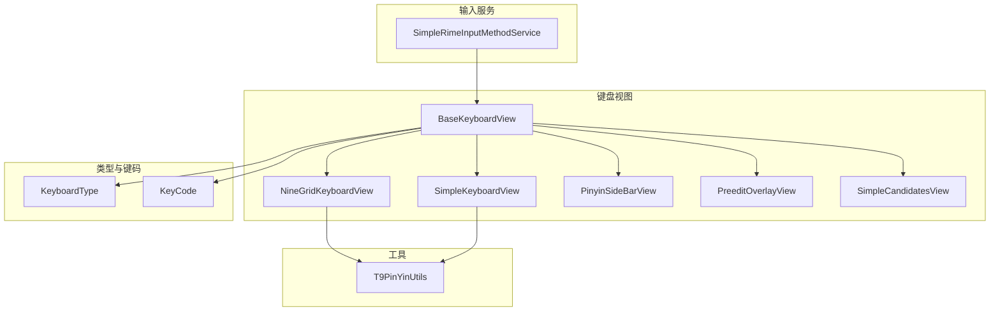
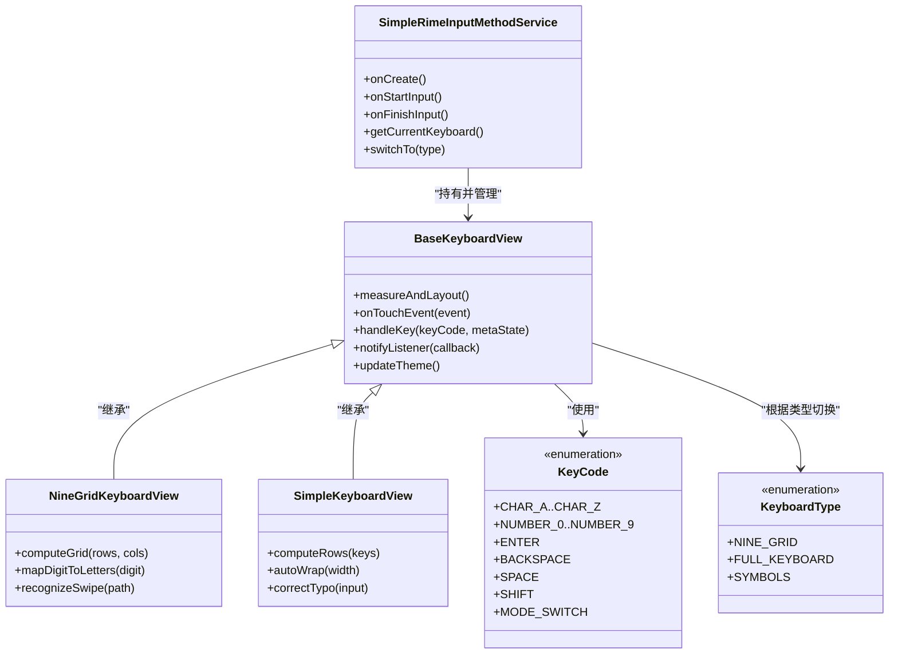
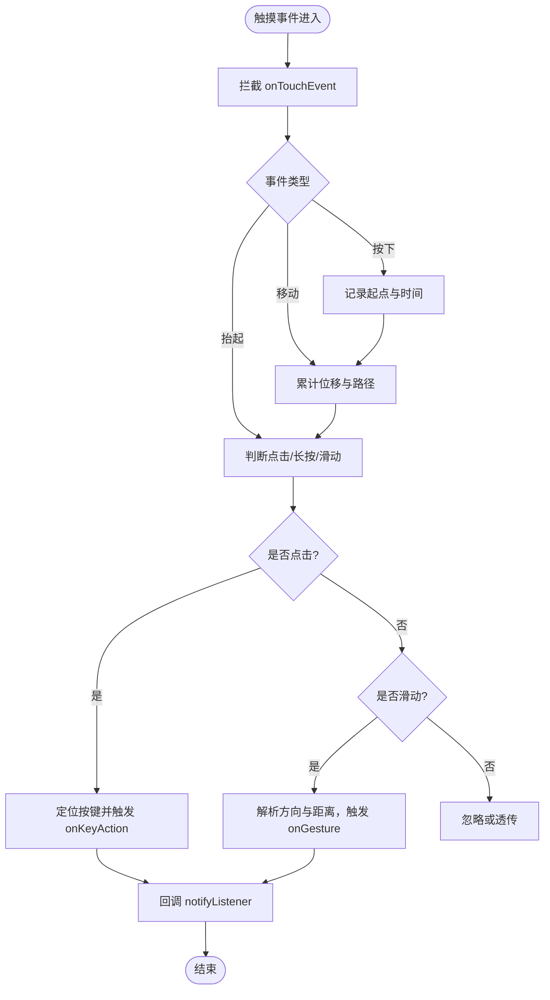
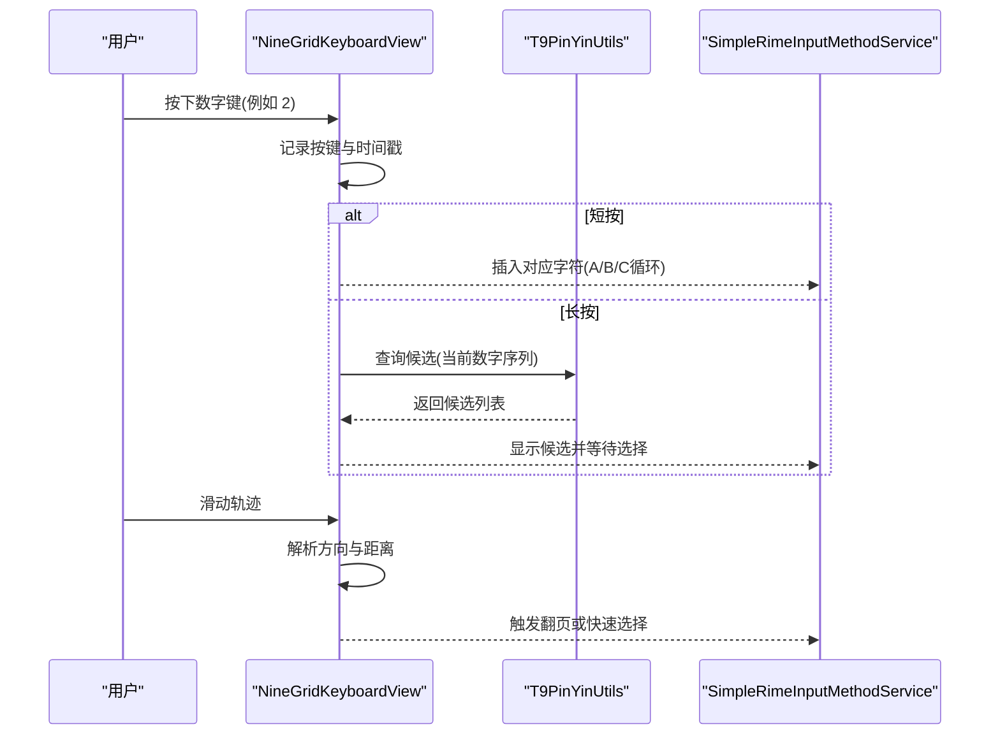
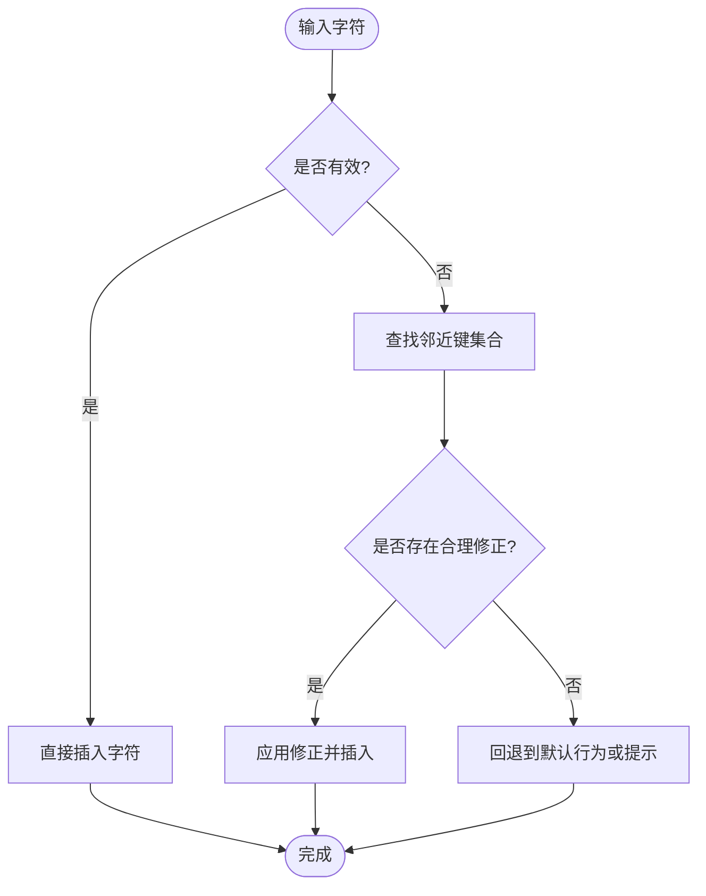
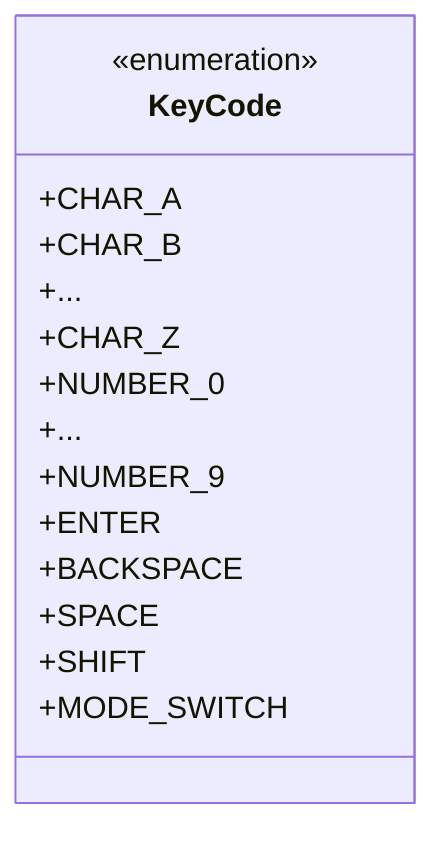
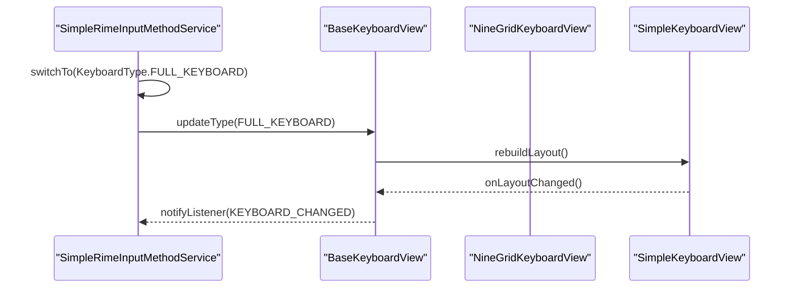
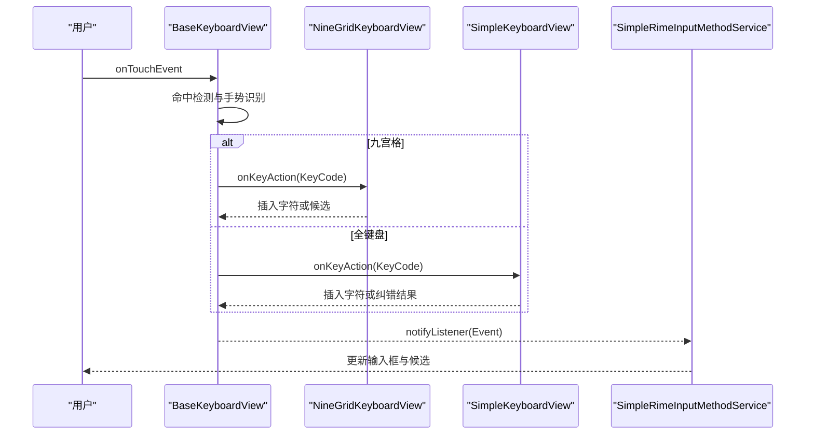
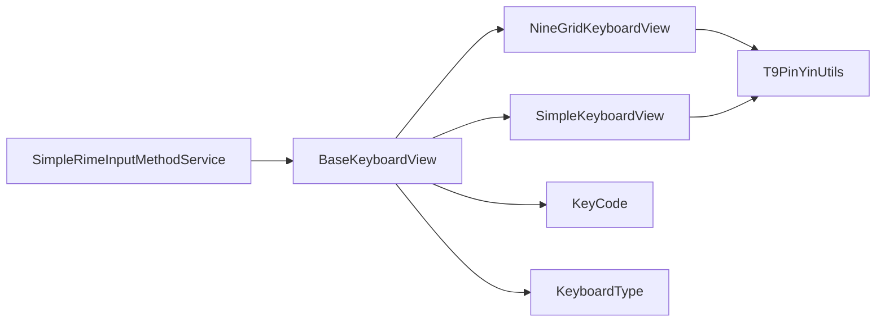

# 键盘实现

<cite>
**本文引用的文件**   
- [BaseKeyboardView.kt](file://app/src/main/java/com/ziyou/ime/ime/BaseKeyboardView.kt)
- [NineGridKeyboardView.kt](file://app/src/main/java/com/ziyou/ime/ime/NineGridKeyboardView.kt)
- [SimpleKeyboardView.kt](file://app/src/main/java/com/ziyou/ime/ime/SimpleKeyboardView.kt)
- [KeyCode.kt](file://app/src/main/java/com/ziyou/ime/ime/KeyCode.kt)
- [KeyboardType.kt](file://app/src/main/java/com/ziyou/ime/ime/KeyboardType.kt)
- [SimpleRimeInputMethodService.kt](file://app/src/main/java/com/ziyou/ime/ime/SimpleRimeInputMethodService.kt)
- [PinyinSideBarView.kt](file://app/src/main/java/com/ziyou/ime/ime/PinyinSideBarView.kt)
- [PreeditOverlayView.kt](file://app/src/main/java/com/ziyou/ime/ime/PreeditOverlayView.kt)
- [SimpleCandidatesView.kt](file://app/src/main/java/com/ziyou/ime/ime/SimpleCandidatesView.kt)
- [T9PinYinUtils.kt](file://app/src/main/java/com/ziyou/ime/util/T9PinYinUtils.kt)
</cite>

## 目录
1. [简介](#简介)
2. [项目结构](#项目结构)
3. [核心组件](#核心组件)
4. [架构总览](#架构总览)
5. [详细组件分析](#详细组件分析)
6. [依赖关系分析](#依赖关系分析)
7. [性能考量](#性能考量)
8. [故障排查指南](#故障排查指南)
9. [结论](#结论)
10. [附录](#附录)

## 简介
本技术文档聚焦于输入法项目的键盘实现，系统性阐述 BaseKeyboardView 的基础能力与扩展机制、NineGridKeyboardView 的九宫格布局算法与按键映射、SimpleKeyboardView 的全键盘布局与智能纠错、KeyCode 枚举体系与各键处理逻辑、KeyboardType 的类型切换与动态布局更新，以及按键事件的捕获、处理与分发流程。同时提供自定义键盘布局的开发指南、最佳实践、性能优化技巧与用户体验改进建议。

## 项目结构
键盘相关代码集中在 ime 包中，围绕 View 层（键盘视图）、事件层（KeyCode）、类型层（KeyboardType）与服务层（IME Service）组织。辅助视图包括候选词、预编辑区、拼音侧边栏等；工具类包含 T9 拼音转换等。

**图表来源** 
- [SimpleRimeInputMethodService.kt](file://app/src/main/java/com/ziyou/ime/ime/SimpleRimeInputMethodService.kt)
- [BaseKeyboardView.kt](file://app/src/main/java/com/ziyou/ime/ime/BaseKeyboardView.kt)
- [NineGridKeyboardView.kt](file://app/src/main/java/com/ziyou/ime/ime/NineGridKeyboardView.kt)
- [SimpleKeyboardView.kt](file://app/src/main/java/com/ziyou/ime/ime/SimpleKeyboardView.kt)
- [PinyinSideBarView.kt](file://app/src/main/java/com/ziyou/ime/ime/PinyinSideBarView.kt)
- [PreeditOverlayView.kt](file://app/src/main/java/com/ziyou/ime/ime/PreeditOverlayView.kt)
- [SimpleCandidatesView.kt](file://app/src/main/java/com/ziyou/ime/ime/SimpleCandidatesView.kt)
- [KeyboardType.kt](file://app/src/main/java/com/ziyou/ime/ime/KeyboardType.kt)
- [KeyCode.kt](file://app/src/main/java/com/ziyou/ime/ime/KeyCode.kt)
- [T9PinYinUtils.kt](file://app/src/main/java/com/ziyou/ime/util/T9PinYinUtils.kt)

**章节来源**
- [BaseKeyboardView.kt](file://app/src/main/java/com/ziyou/ime/ime/BaseKeyboardView.kt)
- [NineGridKeyboardView.kt](file://app/src/main/java/com/ziyou/ime/ime/NineGridKeyboardView.kt)
- [SimpleKeyboardView.kt](file://app/src/main/java/com/ziyou/ime/ime/SimpleKeyboardView.kt)
- [KeyboardType.kt](file://app/src/main/java/com/ziyou/ime/ime/KeyboardType.kt)
- [KeyCode.kt](file://app/src/main/java/com/ziyou/ime/ime/KeyCode.kt)
- [SimpleRimeInputMethodService.kt](file://app/src/main/java/com/ziyou/ime/ime/SimpleRimeInputMethodService.kt)
- [PinyinSideBarView.kt](file://app/src/main/java/com/ziyou/ime/ime/PinyinSideBarView.kt)
- [PreeditOverlayView.kt](file://app/src/main/java/com/ziyou/ime/ime/PreeditOverlayView.kt)
- [SimpleCandidatesView.kt](file://app/src/main/java/com/ziyou/ime/ime/SimpleCandidatesView.kt)
- [T9PinYinUtils.kt](file://app/src/main/java/com/ziyou/ime/util/T9PinYinUtils.kt)

## 核心组件
- BaseKeyboardView：键盘视图基类，负责通用绘制、触摸事件拦截、手势识别、按键布局测量与重绘、状态同步与回调分发。
- NineGridKeyboardView：九宫格键盘实现，基于网格布局算法计算按键位置与尺寸，支持数字/字母映射、长按与滑动手势、T9 联想。
- SimpleKeyboardView：全键盘布局实现，支持 QWERTY 排列、自动换行、智能纠错（邻近键修正、常见错拼回退）。
- KeyCode：按键事件统一编码，区分字符键、功能键、组合键与系统控制键。
- KeyboardType：键盘类型枚举与切换器，驱动布局重建与数据源切换。
- SimpleRimeInputMethodService：输入法服务入口，持有并管理键盘视图实例，协调候选词、预编辑与提交。

**章节来源**
- [BaseKeyboardView.kt](file://app/src/main/java/com/ziyou/ime/ime/BaseKeyboardView.kt)
- [NineGridKeyboardView.kt](file://app/src/main/java/com/ziyou/ime/ime/NineGridKeyboardView.kt)
- [SimpleKeyboardView.kt](file://app/src/main/java/com/ziyou/ime/ime/SimpleKeyboardView.kt)
- [KeyCode.kt](file://app/src/main/java/com/ziyou/ime/ime/KeyCode.kt)
- [KeyboardType.kt](file://app/src/main/java/com/ziyou/ime/ime/KeyboardType.kt)
- [SimpleRimeInputMethodService.kt](file://app/src/main/java/com/ziyou/ime/ime/SimpleRimeInputMethodService.kt)

## 架构总览
键盘子系统采用“服务 + 视图 + 类型/键码”的分层设计。服务层负责生命周期与上下文，视图层负责交互与渲染，类型与键码提供统一的配置与事件模型。

**图表来源** 
- [SimpleRimeInputMethodService.kt](file://app/src/main/java/com/ziyou/ime/ime/SimpleRimeInputMethodService.kt)
- [BaseKeyboardView.kt](file://app/src/main/java/com/ziyou/ime/ime/BaseKeyboardView.kt)
- [NineGridKeyboardView.kt](file://app/src/main/java/com/ziyou/ime/ime/NineGridKeyboardView.kt)
- [SimpleKeyboardView.kt](file://app/src/main/java/com/ziyou/ime/ime/SimpleKeyboardView.kt)
- [KeyCode.kt](file://app/src/main/java/com/ziyou/ime/ime/KeyCode.kt)
- [KeyboardType.kt](file://app/src/main/java/com/ziyou/ime/ime/KeyboardType.kt)

## 详细组件分析

### BaseKeyboardView：基础功能与扩展机制
- 触摸与手势
  - 统一拦截 onTouchEvent，区分点击、长按、滑动，维护按下态与动画帧。
  - 通过路径采样与阈值判定识别滑动手势方向与长度，避免误触。
- 布局与测量
  - 提供 measureAndLayout 钩子，子类可重写以定制行列、间距、字号与图标尺寸。
  - 支持动态主题切换与字体缩放，保证多设备适配。
- 按键处理
  - handleKey 将 KeyCode 与元信息转换为具体动作，如插入字符、执行功能、触发候选或切换模式。
  - 提供 notifyListener 回调接口，供上层服务订阅按键事件。
- 扩展点
  - onKeyAction(keyCode, event)：按键动作回调，便于注入业务逻辑（如 T9 联想、纠错）。
  - onGesture(direction, path)：手势回调，用于翻页、快速选择候选等。
  - onLayoutChanged()：布局变化通知，便于联动候选区与预编辑区。

**图表来源** 
- [BaseKeyboardView.kt](file://app/src/main/java/com/ziyou/ime/ime/BaseKeyboardView.kt)

**章节来源**
- [BaseKeyboardView.kt](file://app/src/main/java/com/ziyou/ime/ime/BaseKeyboardView.kt)

### NineGridKeyboardView：九宫格布局算法、按键映射与手势识别
- 布局算法
  - 基于固定行数与列数（通常为 4x3），计算每个按键的矩形区域，考虑内边距、行高与列宽。
  - 支持自适应屏幕密度与 DPI，确保在不同设备上视觉一致。
- 按键映射
  - 数字到字母映射：2->ABC, 3->DEF, 4->GHI, 5->JKL, 6->MNO, 7->PQRS, 8->TUV, 9->WXYZ。
  - 长按切换符号/数字面板，支持 Shift 锁定与大小写切换。
- 手势识别
  - 滑动预测：根据滑动轨迹在相邻键间插值，提升输入速度。
  - 长按联想：结合 T9 拼音工具进行候选生成与展示。
- 与 T9 集成
  - 调用 T9PinYinUtils 将数字序列转换为拼音候选，支持模糊匹配与频率排序。

**图表来源** 
- [NineGridKeyboardView.kt](file://app/src/main/java/com/ziyou/ime/ime/NineGridKeyboardView.kt)
- [T9PinYinUtils.kt](file://app/src/main/java/com/ziyou/ime/util/T9PinYinUtils.kt)
- [SimpleRimeInputMethodService.kt](file://app/src/main/java/com/ziyou/ime/ime/SimpleRimeInputMethodService.kt)

**章节来源**
- [NineGridKeyboardView.kt](file://app/src/main/java/com/ziyou/ime/ime/NineGridKeyboardView.kt)
- [T9PinYinUtils.kt](file://app/src/main/java/com/ziyou/ime/util/T9PinYinUtils.kt)

### SimpleKeyboardView：全键盘布局与智能纠错
- 布局策略
  - 按行分配键位，支持自动换行与行间距调整，适应不同屏幕宽度。
  - 特殊键（空格、回车、退格、切换）占位与对齐策略，保证视觉平衡。
- 智能纠错
  - 邻近键修正：当检测到异常输入时，尝试替换为物理邻近键（如 Q/W/E 附近）。
  - 常见错拼回退：对高频错误组合进行回退或提示，减少用户纠正成本。
  - 上下文感知：结合候选与历史输入，提高纠错准确率。
- 交互增强
  - 支持长按弹出备选字符（如带声调的字母或标点）。
  - 滑动输入：在字母键之间滑动，快速输入连续字符。

**图表来源** 
- [SimpleKeyboardView.kt](file://app/src/main/java/com/ziyou/ime/ime/SimpleKeyboardView.kt)

**章节来源**
- [SimpleKeyboardView.kt](file://app/src/main/java/com/ziyou/ime/ime/SimpleKeyboardView.kt)

### KeyCode 枚举系统：设计与处理逻辑
- 设计目标
  - 统一所有按键事件编码，屏蔽底层差异，便于跨视图复用。
  - 区分字符键、功能键、组合键与系统控制键，简化分支逻辑。
- 分类与用途
  - 字符键：A-Z、0-9、常用标点。
  - 功能键：Enter、Backspace、Space、Shift、ModeSwitch。
  - 系统控制：音量、电源等（由服务层拦截）。
- 处理逻辑
  - BaseKeyboardView.handleKey 根据 KeyCode 分派到对应动作处理器。
  - 支持修饰键组合（如 Shift+字母）改变输出。

**图表来源** 
- [KeyCode.kt](file://app/src/main/java/com/ziyou/ime/ime/KeyCode.kt)

**章节来源**
- [KeyCode.kt](file://app/src/main/java/com/ziyou/ime/ime/KeyCode.kt)

### KeyboardType：键盘类型切换与动态布局更新
- 类型定义
  - NINE_GRID：九宫格模式，适合数字与拼音输入。
  - FULL_KEYBOARD：全键盘模式，适合英文与符号输入。
  - SYMBOLS：符号面板，提供常用标点与数学符号。
- 切换机制
  - 服务层根据用户设置或上下文切换类型。
  - 视图层收到类型变更通知后，重建布局与数据源，刷新 UI。
- 动态更新
  - 支持运行时修改键位映射、主题颜色与字体大小。
  - 保持候选区与预编辑区的同步更新。

**图表来源** 
- [KeyboardType.kt](file://app/src/main/java/com/ziyou/ime/ime/KeyboardType.kt)
- [BaseKeyboardView.kt](file://app/src/main/java/com/ziyou/ime/ime/BaseKeyboardView.kt)
- [SimpleRimeInputMethodService.kt](file://app/src/main/java/com/ziyou/ime/ime/SimpleRimeInputMethodService.kt)

**章节来源**
- [KeyboardType.kt](file://app/src/main/java/com/ziyou/ime/ime/KeyboardType.kt)

### 按键事件捕获、处理与分发流程
- 捕获
  - BaseKeyboardView 拦截触摸事件，区分点击、长按、滑动。
- 处理
  - 根据命中区域确定 KeyCode，结合修饰键与上下文生成动作。
  - 九宫格模式下，长按触发候选；全键盘模式下，纠错与邻近键修正生效。
- 分发
  - 通过 notifyListener 回调至 SimpleRimeInputMethodService，由其决定插入、提交或切换模式。
  - 联动候选区与预编辑区，实时更新显示。

**图表来源** 
- [BaseKeyboardView.kt](file://app/src/main/java/com/ziyou/ime/ime/BaseKeyboardView.kt)
- [NineGridKeyboardView.kt](file://app/src/main/java/com/ziyou/ime/ime/NineGridKeyboardView.kt)
- [SimpleKeyboardView.kt](file://app/src/main/java/com/ziyou/ime/ime/SimpleKeyboardView.kt)
- [SimpleRimeInputMethodService.kt](file://app/src/main/java/com/ziyou/ime/ime/SimpleRimeInputMethodService.kt)

**章节来源**
- [BaseKeyboardView.kt](file://app/src/main/java/com/ziyou/ime/ime/BaseKeyboardView.kt)
- [NineGridKeyboardView.kt](file://app/src/main/java/com/ziyou/ime/ime/NineGridKeyboardView.kt)
- [SimpleKeyboardView.kt](file://app/src/main/java/com/ziyou/ime/ime/SimpleKeyboardView.kt)
- [SimpleRimeInputMethodService.kt](file://app/src/main/java/com/ziyou/ime/ime/SimpleRimeInputMethodService.kt)

### 辅助视图与工具
- PinyinSideBarView：拼音侧边栏，提供快速跳转与索引。
- PreeditOverlayView：预编辑区，显示当前输入片段与纠错提示。
- SimpleCandidatesView：候选词列表，支持分页与选中反馈。
- T9PinYinUtils：T9 拼音转换工具，提供数字到拼音的映射与候选生成。

**章节来源**
- [PinyinSideBarView.kt](file://app/src/main/java/com/ziyou/ime/ime/PinyinSideBarView.kt)
- [PreeditOverlayView.kt](file://app/src/main/java/com/ziyou/ime/ime/PreeditOverlayView.kt)
- [SimpleCandidatesView.kt](file://app/src/main/java/com/ziyou/ime/ime/SimpleCandidatesView.kt)
- [T9PinYinUtils.kt](file://app/src/main/java/com/ziyou/ime/util/T9PinYinUtils.kt)

## 依赖关系分析
- 视图层依赖类型与键码，服务层依赖视图层。
- 九宫格与全键盘均依赖 BaseKeyboardView 提供的通用能力。
- T9 工具被九宫格与全键盘共同使用，形成横向依赖。

**图表来源** 
- [SimpleRimeInputMethodService.kt](file://app/src/main/java/com/ziyou/ime/ime/SimpleRimeInputMethodService.kt)
- [BaseKeyboardView.kt](file://app/src/main/java/com/ziyou/ime/ime/BaseKeyboardView.kt)
- [NineGridKeyboardView.kt](file://app/src/main/java/com/ziyou/ime/ime/NineGridKeyboardView.kt)
- [SimpleKeyboardView.kt](file://app/src/main/java/com/ziyou/ime/ime/SimpleKeyboardView.kt)
- [KeyCode.kt](file://app/src/main/java/com/ziyou/ime/ime/KeyCode.kt)
- [KeyboardType.kt](file://app/src/main/java/com/ziyou/ime/ime/KeyboardType.kt)
- [T9PinYinUtils.kt](file://app/src/main/java/com/ziyou/ime/util/T9PinYinUtils.kt)

**章节来源**
- [SimpleRimeInputMethodService.kt](file://app/src/main/java/com/ziyou/ime/ime/SimpleRimeInputMethodService.kt)
- [BaseKeyboardView.kt](file://app/src/main/java/com/ziyou/ime/ime/BaseKeyboardView.kt)
- [NineGridKeyboardView.kt](file://app/src/main/java/com/ziyou/ime/ime/NineGridKeyboardView.kt)
- [SimpleKeyboardView.kt](file://app/src/main/java/com/ziyou/ime/ime/SimpleKeyboardView.kt)
- [KeyCode.kt](file://app/src/main/java/com/ziyou/ime/ime/KeyCode.kt)
- [KeyboardType.kt](file://app/src/main/java/com/ziyou/ime/ime/KeyboardType.kt)
- [T9PinYinUtils.kt](file://app/src/main/java/com/ziyou/ime/util/T9PinYinUtils.kt)

## 性能考量
- 布局测量与重绘
  - 缓存按键矩形与文本度量，避免重复计算。
  - 批量更新候选区与预编辑区，减少多次 invalidate。
- 手势识别
  - 降低采样频率与路径复杂度，使用阈值过滤抖动。
- 候选生成
  - 异步加载候选，主线程仅做展示；对频繁候选进行本地缓存。
- 内存与资源
  - 重用画笔与字体对象，避免频繁创建。
  - 按需加载主题资源，减少初始加载开销。

[本节为通用指导，不直接分析具体文件]

## 故障排查指南
- 触摸无响应
  - 检查 onTouchEvent 拦截逻辑与命中区域计算。
  - 确认手势阈值与滑动方向判定是否正确。
- 按键映射错误
  - 核对 KeyCode 与映射表一致性。
  - 验证九宫格数字到字母映射规则。
- 候选不更新
  - 检查 T9 工具调用与候选刷新时机。
  - 确认服务层回调与视图更新链路。
- 布局错位
  - 重新测量与布局，检查行高、列宽与间距参数。
  - 适配不同屏幕密度与方向变化。

**章节来源**
- [BaseKeyboardView.kt](file://app/src/main/java/com/ziyou/ime/ime/BaseKeyboardView.kt)
- [NineGridKeyboardView.kt](file://app/src/main/java/com/ziyou/ime/ime/NineGridKeyboardView.kt)
- [SimpleKeyboardView.kt](file://app/src/main/java/com/ziyou/ime/ime/SimpleKeyboardView.kt)
- [T9PinYinUtils.kt](file://app/src/main/java/com/ziyou/ime/util/T9PinYinUtils.kt)

## 结论
本键盘实现以 BaseKeyboardView 为核心，通过 NineGridKeyboardView 与 SimpleKeyboardView 分别覆盖九宫格与全键盘场景，配合 KeyCode 与 KeyboardType 提供统一的键码与类型管理能力。服务层协调视图与候选、预编辑区，形成完整的输入闭环。通过合理的布局算法、手势识别与纠错机制，兼顾效率与体验。后续可扩展更多键盘类型与交互方式，进一步提升输入质量与用户满意度。

[本节为总结性内容，不直接分析具体文件]

## 附录
- 自定义键盘布局开发指南
  - 继承 BaseKeyboardView，重写 measureAndLayout 与 onKeyAction。
  - 定义新的 KeyCode 与 KeyboardType，并在服务层注册切换逻辑。
  - 使用 T9 工具或自定义词典生成候选，优化输入体验。
- 最佳实践
  - 保持布局简洁，减少按键数量以提升命中率。
  - 合理使用手势与长按，避免过度交互导致误操作。
  - 提供清晰的视觉反馈与错误提示，帮助用户快速纠正。
- 性能优化技巧
  - 缓存与复用资源，减少 GC 压力。
  - 异步处理耗时任务，保证主线程流畅。
  - 针对热点路径进行 profiling，定位瓶颈并优化。
- 用户体验改进建议
  - 支持个性化主题与字体大小调节。
  - 提供学习用户习惯的预测与纠错。
  - 在多语言与符号场景中提供快捷切换与搜索。

[本节为通用指导，不直接分析具体文件]