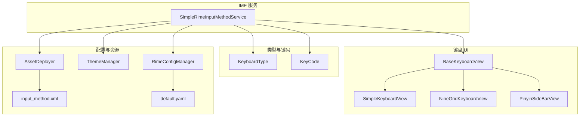
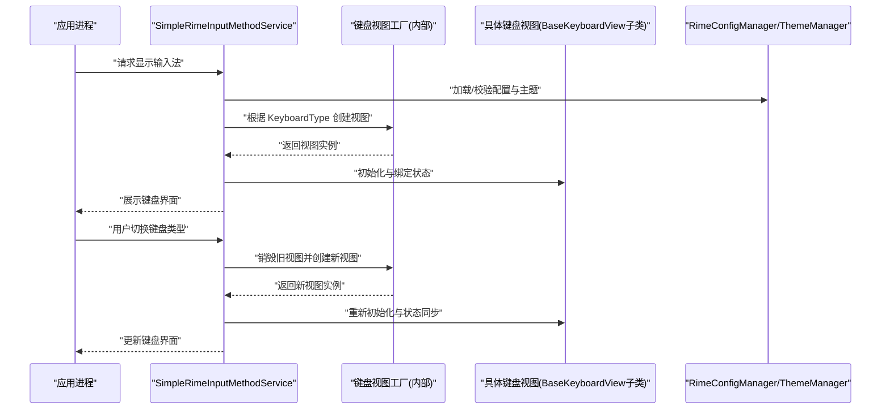
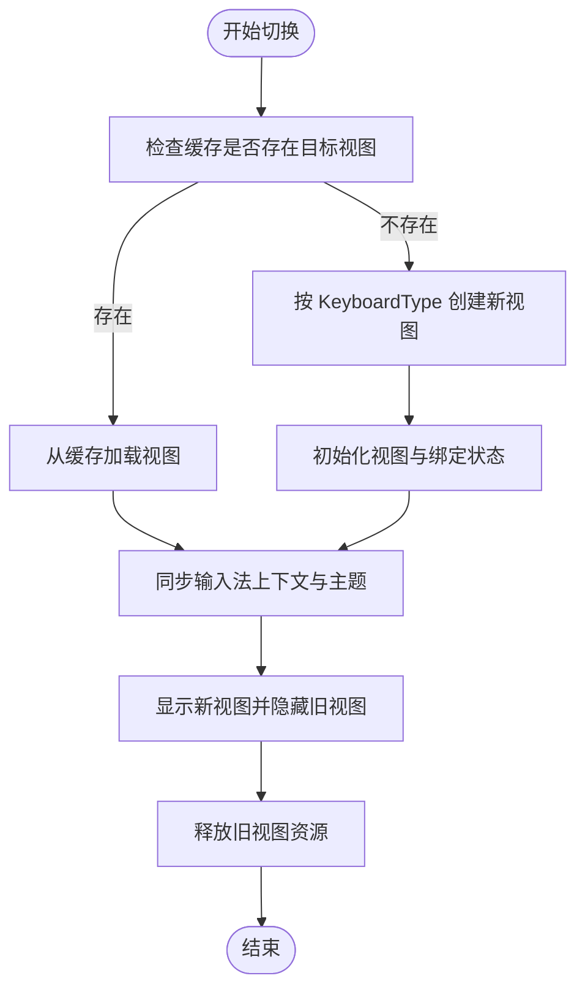
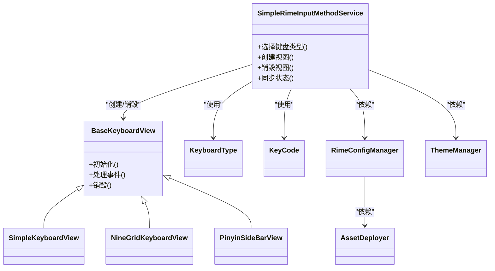

# 键盘类型系统

<cite>
**本文引用的文件**   
- [KeyboardType.kt](file://app/src/main/java/com/ziyou/ime/ime/KeyboardType.kt)
- [KeyCode.kt](file://app/src/main/java/com/ziyou/ime/ime/KeyCode.kt)
- [BaseKeyboardView.kt](file://app/src/main/java/com/ziyou/ime/ime/BaseKeyboardView.kt)
- [SimpleKeyboardView.kt](file://app/src/main/java/com/ziyou/ime/ime/SimpleKeyboardView.kt)
- [NineGridKeyboardView.kt](file://app/src/main/java/com/ziyou/ime/ime/NineGridKeyboardView.kt)
- [PinyinSideBarView.kt](file://app/src/main/java/com/ziyou/ime/ime/PinyinSideBarView.kt)
- [SimpleRimeInputMethodService.kt](file://app/src/main/java/com/ziyou/ime/ime/SimpleRimeInputMethodService.kt)
- [RimeConfigManager.kt](file://app/src/main/java/com/ziyou/ime/config/RimeConfigManager.kt)
- [ThemeManager.kt](file://app/src/main/java/com/ziyou/ime/config/ThemeManager.kt)
- [AssetDeployer.kt](file://app/src/main/java/com/ziyou/ime/config/AssetDeployer.kt)
- [input_method.xml](file://app/src/main/res/xml/input_method.xml)
- [default.yaml](file://app/src/main/assets/rime/default.yaml)
</cite>

## 目录
1. [简介](#简介)
2. [项目结构](#项目结构)
3. [核心组件](#核心组件)
4. [架构总览](#架构总览)
5. [详细组件分析](#详细组件分析)
6. [依赖关系分析](#依赖关系分析)
7. [性能考量](#性能考量)
8. [故障排查指南](#故障排查指南)
9. [结论](#结论)
10. [附录](#附录)

## 简介
本技术文档围绕输入法项目的“键盘类型系统”展开，系统性阐述 KeyboardType 枚举的设计与适用场景、KeyCode 编码规则与扩展机制、键盘类型切换的动态加载与缓存管理、键盘类型与布局文件的映射关系及配置格式、生命周期管理与资源清理，以及自定义键盘类型的开发与注册流程。同时提供键盘类型选择的最佳实践与用户偏好设置管理建议，帮助开发者快速理解并高效扩展该系统。

## 项目结构
本项目采用分层组织方式：输入服务层负责 IME 生命周期与事件分发；UI 层包含多种键盘视图（基础抽象、通用键盘、九宫格、拼音侧边栏等）；配置层负责 Rime 引擎配置、主题与资源部署；数据与工具层提供按键栈、符号与辅助算法。键盘类型系统的核心位于 ime 包中，通过枚举与视图类协同工作，由输入服务统一调度。

图表来源
- [SimpleRimeInputMethodService.kt](file://app/src/main/java/com/ziyou/ime/ime/SimpleRimeInputMethodService.kt)
- [BaseKeyboardView.kt](file://app/src/main/java/com/ziyou/ime/ime/BaseKeyboardView.kt)
- [SimpleKeyboardView.kt](file://app/src/main/java/com/ziyou/ime/ime/SimpleKeyboardView.kt)
- [NineGridKeyboardView.kt](file://app/src/main/java/com/ziyou/ime/ime/NineGridKeyboardView.kt)
- [PinyinSideBarView.kt](file://app/src/main/java/com/ziyou/ime/ime/PinyinSideBarView.kt)
- [KeyboardType.kt](file://app/src/main/java/com/ziyou/ime/ime/KeyboardType.kt)
- [KeyCode.kt](file://app/src/main/java/com/ziyou/ime/ime/KeyCode.kt)
- [RimeConfigManager.kt](file://app/src/main/java/com/ziyou/ime/config/RimeConfigManager.kt)
- [ThemeManager.kt](file://app/src/main/java/com/ziyou/ime/config/ThemeManager.kt)
- [AssetDeployer.kt](file://app/src/main/java/com/ziyou/ime/config/AssetDeployer.kt)
- [input_method.xml](file://app/src/main/res/xml/input_method.xml)
- [default.yaml](file://app/src/main/assets/rime/default.yaml)

章节来源
- [SimpleRimeInputMethodService.kt](file://app/src/main/java/com/ziyou/ime/ime/SimpleRimeInputMethodService.kt)
- [BaseKeyboardView.kt](file://app/src/main/java/com/ziyou/ime/ime/BaseKeyboardView.kt)
- [KeyboardType.kt](file://app/src/main/java/com/ziyou/ime/ime/KeyboardType.kt)
- [KeyCode.kt](file://app/src/main/java/com/ziyou/ime/ime/KeyCode.kt)
- [RimeConfigManager.kt](file://app/src/main/java/com/ziyou/ime/config/RimeConfigManager.kt)
- [ThemeManager.kt](file://app/src/main/java/com/ziyou/ime/config/ThemeManager.kt)
- [AssetDeployer.kt](file://app/src/main/java/com/ziyou/ime/config/AssetDeployer.kt)
- [input_method.xml](file://app/src/main/res/xml/input_method.xml)
- [default.yaml](file://app/src/main/assets/rime/default.yaml)

## 核心组件
- KeyboardType 枚举：定义系统中支持的键盘类型（如标准英文、中文拼音、九宫格、符号等），作为类型切换与渲染的统一标识。
- KeyCode 枚举：定义按键编码体系，涵盖字母数字、功能键、修饰键与特殊键，支持扩展位或命名空间以容纳新键。
- BaseKeyboardView 抽象视图：封装键盘绘制、触摸事件处理、状态同步与生命周期钩子，为具体键盘类型提供基类能力。
- SimpleKeyboardView、NineGridKeyboardView、PinyinSideBarView：分别实现标准键盘、九宫格与拼音侧边栏的布局与交互逻辑。
- SimpleRimeInputMethodService：IME 服务入口，负责键盘类型选择、视图创建与销毁、事件分发与状态同步。
- 配置与资源管理器：RimeConfigManager 管理 Rime 引擎配置；ThemeManager 管理主题；AssetDeployer 负责资源部署与校验。

章节来源
- [KeyboardType.kt](file://app/src/main/java/com/ziyou/ime/ime/KeyboardType.kt)
- [KeyCode.kt](file://app/src/main/java/com/ziyou/ime/ime/KeyCode.kt)
- [BaseKeyboardView.kt](file://app/src/main/java/com/ziyou/ime/ime/BaseKeyboardView.kt)
- [SimpleKeyboardView.kt](file://app/src/main/java/com/ziyou/ime/ime/SimpleKeyboardView.kt)
- [NineGridKeyboardView.kt](file://app/src/main/java/com/ziyou/ime/ime/NineGridKeyboardView.kt)
- [PinyinSideBarView.kt](file://app/src/main/java/com/ziyou/ime/ime/PinyinSideBarView.kt)
- [SimpleRimeInputMethodService.kt](file://app/src/main/java/com/ziyou/ime/ime/SimpleRimeInputMethodService.kt)
- [RimeConfigManager.kt](file://app/src/main/java/com/ziyou/ime/config/RimeConfigManager.kt)
- [ThemeManager.kt](file://app/src/main/java/com/ziyou/ime/config/ThemeManager.kt)
- [AssetDeployer.kt](file://app/src/main/java/com/ziyou/ime/config/AssetDeployer.kt)

## 架构总览
键盘类型系统以“枚举驱动 + 视图工厂 + 配置中心”的模式运行。输入服务根据当前上下文与用户偏好确定 KeyboardType，并通过工厂或映射表动态创建对应视图实例。视图继承自 BaseKeyboardView，复用绘制与事件处理逻辑。配置层确保 Rime 引擎与主题资源就绪，保障键盘渲染与输入行为一致。

图表来源
- [SimpleRimeInputMethodService.kt](file://app/src/main/java/com/ziyou/ime/ime/SimpleRimeInputMethodService.kt)
- [BaseKeyboardView.kt](file://app/src/main/java/com/ziyou/ime/ime/BaseKeyboardView.kt)
- [RimeConfigManager.kt](file://app/src/main/java/com/ziyou/ime/config/RimeConfigManager.kt)
- [ThemeManager.kt](file://app/src/main/java/com/ziyou/ime/config/ThemeManager.kt)

## 详细组件分析

### KeyboardType 枚举设计与适用场景
- 设计理念：以强类型枚举表达键盘类型，避免魔法字符串与硬编码分支；便于扩展新类型并保持向后兼容。
- 典型类型与场景：
  - 标准英文键盘：适用于代码编辑、搜索框等需要频繁输入字母与符号的场景。
  - 中文拼音键盘：面向中文输入，结合候选词与联想提升效率。
  - 九宫格键盘：移动端常用，提高数字与字母输入速度。
  - 符号/表情键盘：用于补充标点、数学符号与表情输入。
- 扩展机制：新增类型时仅需在枚举中添加成员，并在视图工厂与映射表中注册对应视图类与布局资源。

章节来源
- [KeyboardType.kt](file://app/src/main/java/com/ziyou/ime/ime/KeyboardType.kt)

### KeyCode 枚举系统与编码规则
- 设计原则：
  - 唯一性与稳定性：每个键有稳定编码，避免运行时歧义。
  - 分类清晰：字母数字、功能键、修饰键、导航键、媒体键等分组明确。
  - 可扩展性：预留扩展位或使用命名空间前缀，支持第三方键值接入。
- 特殊键处理：对组合键、长按、重复触发等行为进行统一封装，保证跨视图一致性。
- 与布局映射：KeyCode 与布局文件中键位一一对应，便于解析与渲染。

章节来源
- [KeyCode.kt](file://app/src/main/java/com/ziyou/ime/ime/KeyCode.kt)

### 键盘类型切换机制：动态加载、缓存与状态同步
- 动态加载：根据 KeyboardType 按需创建视图实例，避免一次性加载所有类型导致内存压力。
- 缓存管理：对已创建的视图进行弱引用或池化缓存，减少重复构造开销；在内存紧张时释放非活跃视图。
- 状态同步：切换时同步输入法上下文、候选词状态、主题与语言设置，确保用户体验连贯。
- 生命周期：遵循 Android 视图生命周期，正确调用 onAttachedToWindow、onDetachedFromWindow 等钩子。

图表来源
- [SimpleRimeInputMethodService.kt](file://app/src/main/java/com/ziyou/ime/ime/SimpleRimeInputMethodService.kt)
- [BaseKeyboardView.kt](file://app/src/main/java/com/ziyou/ime/ime/BaseKeyboardView.kt)

### 键盘类型与布局文件的映射关系与配置格式
- 映射关系：每个 KeyboardType 对应一个布局资源 ID 或 JSON/YAML 描述，定义键位分布、标签与动作。
- 配置格式：
  - XML 布局：Android 原生布局文件，适合静态结构与简单交互。
  - YAML/JSON：适合复杂布局与动态生成，便于版本化管理与热更新。
- 资源部署：AssetDeployer 负责将资源复制到可访问路径并进行完整性校验。

章节来源
- [input_method.xml](file://app/src/main/res/xml/input_method.xml)
- [AssetDeployer.kt](file://app/src/main/java/com/ziyou/ime/config/AssetDeployer.kt)

### 生命周期管理：初始化、销毁与资源清理
- 初始化阶段：
  - 输入服务创建视图并注入配置（主题、语言、候选策略）。
  - 视图解析布局与键位映射，建立事件回调。
- 运行阶段：
  - 处理按键事件，更新候选与预编辑区。
  - 与 Rime 引擎交互，获取翻译结果。
- 销毁阶段：
  - 释放视图资源、取消监听器、清空缓存引用。
  - 通知配置管理器释放引擎相关资源。

章节来源
- [BaseKeyboardView.kt](file://app/src/main/java/com/ziyou/ime/ime/BaseKeyboardView.kt)
- [SimpleRimeInputMethodService.kt](file://app/src/main/java/com/ziyou/ime/ime/SimpleRimeInputMethodService.kt)
- [RimeConfigManager.kt](file://app/src/main/java/com/ziyou/ime/config/RimeConfigManager.kt)

### 自定义键盘类型的开发指南
- 步骤概览：
  1. 定义新的 KeyboardType 枚举成员。
  2. 新建键盘视图类，继承 BaseKeyboardView，实现布局解析与事件处理。
  3. 在视图工厂或映射表中注册新类型与布局资源。
  4. 编写布局文件或配置描述，定义键位与动作。
  5. 在输入服务中处理新类型的初始化与切换逻辑。
  6. 添加单元测试与集成测试，验证事件与状态同步。
- 注意事项：
  - 保持与现有 KeyCode 体系的兼容性。
  - 合理管理内存与资源，避免泄漏。
  - 提供清晰的错误日志与回退策略。

章节来源
- [KeyboardType.kt](file://app/src/main/java/com/ziyou/ime/ime/KeyboardType.kt)
- [BaseKeyboardView.kt](file://app/src/main/java/com/ziyou/ime/ime/BaseKeyboardView.kt)
- [SimpleRimeInputMethodService.kt](file://app/src/main/java/com/ziyou/ime/ime/SimpleRimeInputMethodService.kt)

### 键盘类型选择的最佳实践与用户偏好设置管理
- 选择策略：
  - 基于上下文自动选择（如输入框类型检测）。
  - 基于历史使用频率推荐。
  - 允许用户手动固定默认类型。
- 偏好管理：
  - 持久化存储用户选择（SharedPreferences 或数据库）。
  - 支持多账户与设备间同步。
  - 提供重置与恢复默认选项。

章节来源
- [SimpleRimeInputMethodService.kt](file://app/src/main/java/com/ziyou/ime/ime/SimpleRimeInputMethodService.kt)
- [ThemeManager.kt](file://app/src/main/java/com/ziyou/ime/config/ThemeManager.kt)

## 依赖关系分析
键盘类型系统依赖以下模块：
- 输入服务依赖视图抽象与具体实现。
- 视图依赖配置管理器与主题管理器。
- 配置管理器依赖资源部署器与 Rime 引擎配置。
- 布局与资源通过 XML 与 YAML 描述，确保可维护性。

图表来源
- [SimpleRimeInputMethodService.kt](file://app/src/main/java/com/ziyou/ime/ime/SimpleRimeInputMethodService.kt)
- [BaseKeyboardView.kt](file://app/src/main/java/com/ziyou/ime/ime/BaseKeyboardView.kt)
- [SimpleKeyboardView.kt](file://app/src/main/java/com/ziyou/ime/ime/SimpleKeyboardView.kt)
- [NineGridKeyboardView.kt](file://app/src/main/java/com/ziyou/ime/ime/NineGridKeyboardView.kt)
- [PinyinSideBarView.kt](file://app/src/main/java/com/ziyou/ime/ime/PinyinSideBarView.kt)
- [KeyboardType.kt](file://app/src/main/java/com/ziyou/ime/ime/KeyboardType.kt)
- [KeyCode.kt](file://app/src/main/java/com/ziyou/ime/ime/KeyCode.kt)
- [RimeConfigManager.kt](file://app/src/main/java/com/ziyou/ime/config/RimeConfigManager.kt)
- [ThemeManager.kt](file://app/src/main/java/com/ziyou/ime/config/ThemeManager.kt)
- [AssetDeployer.kt](file://app/src/main/java/com/ziyou/ime/config/AssetDeployer.kt)

章节来源
- [SimpleRimeInputMethodService.kt](file://app/src/main/java/com/ziyou/ime/ime/SimpleRimeInputMethodService.kt)
- [BaseKeyboardView.kt](file://app/src/main/java/com/ziyou/ime/ime/BaseKeyboardView.kt)
- [KeyboardType.kt](file://app/src/main/java/com/ziyou/ime/ime/KeyboardType.kt)
- [KeyCode.kt](file://app/src/main/java/com/ziyou/ime/ime/KeyCode.kt)
- [RimeConfigManager.kt](file://app/src/main/java/com/ziyou/ime/config/RimeConfigManager.kt)
- [ThemeManager.kt](file://app/src/main/java/com/ziyou/ime/config/ThemeManager.kt)
- [AssetDeployer.kt](file://app/src/main/java/com/ziyou/ime/config/AssetDeployer.kt)

## 性能考量
- 视图懒加载与缓存：避免一次性构建所有键盘视图，降低内存占用。
- 事件处理优化：合并高频事件，减少主线程阻塞。
- 资源预热：对常用布局与主题进行预加载，缩短切换延迟。
- 内存回收：及时释放不再使用的视图与中间对象，防止泄漏。

[本节为通用指导，不直接分析具体文件]

## 故障排查指南
- 常见问题：
  - 键盘类型切换后布局错乱：检查布局资源是否完整、映射是否正确。
  - 按键无响应：确认事件分发链与 KeyCode 映射是否一致。
  - 内存溢出：检查视图缓存策略与资源释放逻辑。
  - 配置加载失败：验证 YAML/XML 格式与路径权限。
- 调试建议：
  - 启用详细日志，记录切换与事件流。
  - 使用内存分析工具定位泄漏点。
  - 对关键路径编写自动化测试用例。

章节来源
- [SimpleRimeInputMethodService.kt](file://app/src/main/java/com/ziyou/ime/ime/SimpleRimeInputMethodService.kt)
- [BaseKeyboardView.kt](file://app/src/main/java/com/ziyou/ime/ime/BaseKeyboardView.kt)
- [RimeConfigManager.kt](file://app/src/main/java/com/ziyou/ime/config/RimeConfigManager.kt)

## 结论
键盘类型系统通过枚举与视图抽象实现了高内聚、低耦合的架构设计，支持动态加载、缓存管理与状态同步，具备良好的扩展性与可维护性。配合配置与资源管理机制，能够快速适配不同输入场景与用户需求。遵循本文档的最佳实践与开发指南，可有效提升系统稳定性与用户体验。

[本节为总结性内容，不直接分析具体文件]

## 附录
- 术语表：
  - KeyboardType：键盘类型枚举，标识不同键盘模式。
  - KeyCode：按键编码枚举，定义键位与动作。
  - BaseKeyboardView：键盘视图抽象基类。
  - SimpleRimeInputMethodService：输入法服务入口。
  - RimeConfigManager：Rime 引擎配置管理器。
  - ThemeManager：主题管理器。
  - AssetDeployer：资源部署器。
- 参考文件：
  - [input_method.xml](file://app/src/main/res/xml/input_method.xml)
  - [default.yaml](file://app/src/main/assets/rime/default.yaml)

[本节为附录信息，不直接分析具体文件]