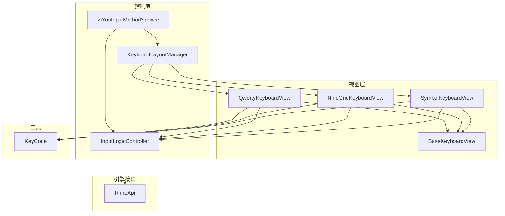
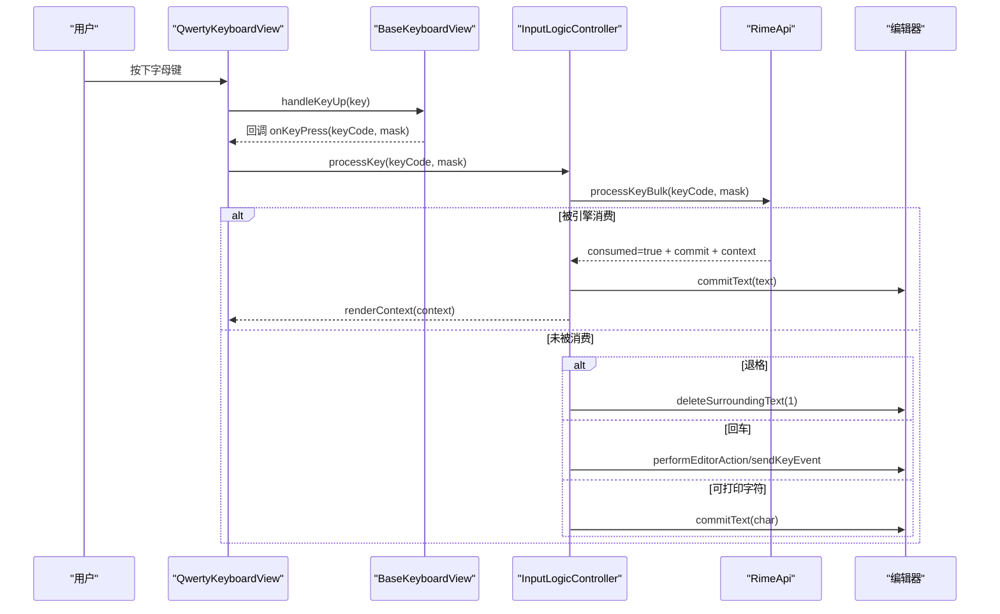
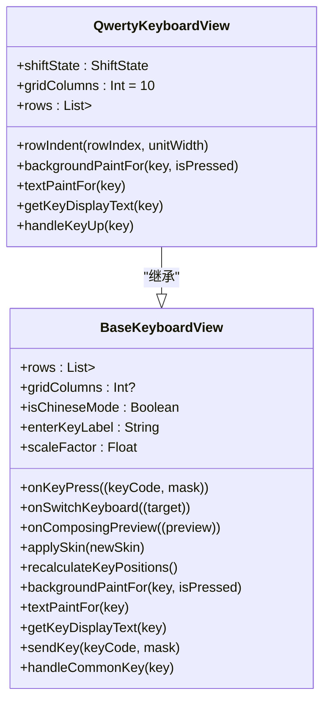
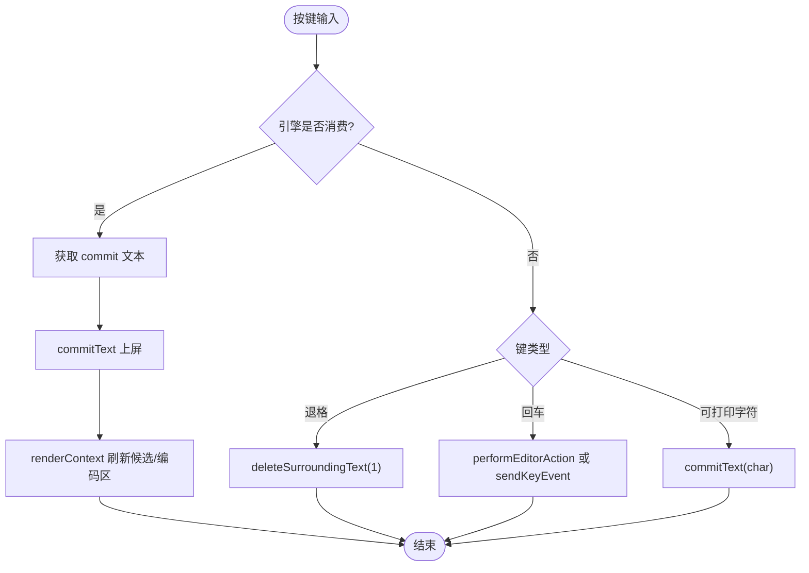
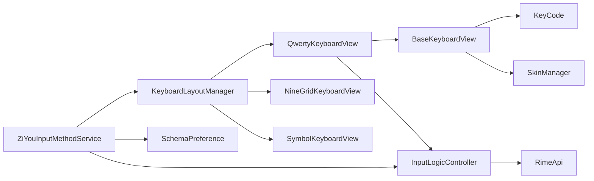

# QWERTY 全键盘

<cite>
**本文引用的文件**   
- [QwertyKeyboardView.kt](file://app/src/main/java/com/ziyou/ime/ime/QwertyKeyboardView.kt)
- [BaseKeyboardView.kt](file://app/src/main/java/com/ziyou/ime/ime/BaseKeyboardView.kt)
- [KeyboardType.kt](file://app/src/main/java/com/ziyou/ime/ime/KeyboardType.kt)
- [InputLogicController.kt](file://app/src/main/java/com/ziyou/ime/ime/InputLogicController.kt)
- [RimeApi.kt](file://app/src/main/java/com/ziyou/ime/core/RimeApi.kt)
- [KeyCode.kt](file://app/src/main/java/com/ziyou/ime/ime/KeyCode.kt)
- [SymbolKeyboardView.kt](file://app/src/main/java/com/ziyou/ime/ime/SymbolKeyboardView.kt)
- [NineGridKeyboardView.kt](file://app/src/main/java/com/ziyou/ime/ime/NineGridKeyboardView.kt)
- [ZiYouInputMethodService.kt](file://app/src/main/java/com/ziyou/ime/ime/ZiYouInputMethodService.kt)
- [KeyboardLayoutManager.kt](file://app/src/main/java/com/ziyou/ime/ime/KeyboardLayoutManager.kt)
</cite>

## 目录
1. [简介](#简介)
2. [项目结构](#项目结构)
3. [核心组件](#核心组件)
4. [架构总览](#架构总览)
5. [详细组件分析](#详细组件分析)
6. [依赖关系分析](#依赖关系分析)
7. [性能考量](#性能考量)
8. [故障排查指南](#故障排查指南)
9. [结论](#结论)
10. [附录：扩展与配置示例](#附录扩展与配置示例)

## 简介
本技术文档聚焦于 QWERTY 全键盘的实现，围绕 QwertyKeyboardView 的布局、Shift 三态切换、键盘类型转换机制以及与 Rime 输入引擎的集成进行系统化说明。同时覆盖字母键与编码区处理、候选词生成与上屏流程、特殊按键（空格、退格、回车、符号切换）行为，以及布局自适应、多语言支持与国际化配置要点。文末提供扩展自定义按键与修改布局配置的实践指引。

## 项目结构
- 视图层
  - BaseKeyboardView：抽象键盘基类，统一绘制、触摸、皮肤、缩放、回调等能力
  - QwertyKeyboardView：QWERTY 全键盘实现，定义标准 4 行布局与 Shift 逻辑
  - NineGridKeyboardView / SymbolKeyboardView：九宫格与符号键盘（用于对比与联动）
- 控制层
  - InputLogicController：输入逻辑控制器，负责按键到 Rime 的批量处理、候选选择、上屏与 UI 刷新
  - KeyboardLayoutManager：键盘视图装载器，按类型创建并组装视图
  - ZiYouInputMethodService：输入法服务主类，管理生命周期、键盘切换、方案同步与状态同步
- 引擎接口
  - RimeApi：Rime 引擎 API 抽象，含 processKeyBulk、selectCandidate、getContext 等
- 工具与常量
  - KeyCode：Android KeyEvent 与 Rime keysym 映射、修饰掩码构建

图表来源
- [BaseKeyboardView.kt:43-147](file://app/src/main/java/com/ziyou/ime/ime/BaseKeyboardView.kt#L43-L147)
- [QwertyKeyboardView.kt:25-72](file://app/src/main/java/com/ziyou/ime/ime/QwertyKeyboardView.kt#L25-L72)
- [NineGridKeyboardView.kt:37-109](file://app/src/main/java/com/ziyou/ime/ime/NineGridKeyboardView.kt#L37-L109)
- [SymbolKeyboardView.kt:47-92](file://app/src/main/java/com/ziyou/ime/ime/SymbolKeyboardView.kt#L47-L92)
- [InputLogicController.kt:43-125](file://app/src/main/java/com/ziyou/ime/ime/InputLogicController.kt#L43-L125)
- [KeyboardLayoutManager.kt:42-82](file://app/src/main/java/com/ziyou/ime/ime/KeyboardLayoutManager.kt#L42-L82)
- [ZiYouInputMethodService.kt:603-646](file://app/src/main/java/com/ziyou/ime/ime/ZiYouInputMethodService.kt#L603-L646)
- [RimeApi.kt:28-40](file://app/src/main/java/com/ziyou/ime/core/RimeApi.kt#L28-L40)
- [KeyCode.kt:13-78](file://app/src/main/java/com/ziyou/ime/ime/KeyCode.kt#L13-L78)

章节来源
- [BaseKeyboardView.kt:43-147](file://app/src/main/java/com/ziyou/ime/ime/BaseKeyboardView.kt#L43-L147)
- [QwertyKeyboardView.kt:25-72](file://app/src/main/java/com/ziyou/ime/ime/QwertyKeyboardView.kt#L25-L72)
- [KeyboardType.kt:27-54](file://app/src/main/java/com/ziyou/ime/ime/KeyboardType.kt#L27-L54)
- [InputLogicController.kt:43-125](file://app/src/main/java/com/ziyou/ime/ime/InputLogicController.kt#L43-L125)
- [RimeApi.kt:28-40](file://app/src/main/java/com/ziyou/ime/core/RimeApi.kt#L28-L40)
- [KeyCode.kt:13-78](file://app/src/main/java/com/ziyou/ime/ime/KeyCode.kt#L13-L78)
- [KeyboardLayoutManager.kt:42-82](file://app/src/main/java/com/ziyou/ime/ime/KeyboardLayoutManager.kt#L42-L82)
- [ZiYouInputMethodService.kt:603-646](file://app/src/main/java/com/ziyou/ime/ime/ZiYouInputMethodService.kt#L603-L646)

## 核心组件
- QwertyKeyboardView：定义标准 QWERTY 四行布局，基于 10 列网格严格对齐；实现 Shift 三态（OFF/ONCE/LOCKED）、中英文切换键文案、逗号全角/半角显示、字母大小写输出与 ONCE 自动复位。
- BaseKeyboardView：提供统一的键盘绘制、触摸高亮、长按连续触发（如退格）、皮肤主题、缩放因子、回调桥接（onKeyPress/onSwitchKeyboard/onComposingPreview）与通用功能键处理（中英文切换、符号面板）。
- InputLogicController：将按键通过 RimeApi.processKeyBulk 批量处理，消费时取 commit 上屏并刷新 UI；未消费时按语义处理退格、回车或直接上屏可打印字符；支持选词、翻页、侧栏拼音替换、智能退格与重打。
- KeyboardType：枚举键盘布局类型，声明强制绑定方案（如 t9）、是否允许自选方案、是否进入持久化选择面板。
- KeyboardLayoutManager：按类型创建并安装键盘视图，绑定回调、皮肤与缩放；停靠形态下为九宫格挂载左侧拼音侧栏并对齐几何。
- ZiYouInputMethodService：维护当前键盘类型、切换布局、同步 Rime 方案与 ascii_mode、更新候选与编码区预览、持久化用户偏好。
- RimeApi：封装 Rime 引擎操作，processKeyBulk 热路径合并 processKey/getCommit/getContext，减少线程往返与 JNI 跨界。
- KeyCode：Android KeyEvent 与 Rime keysym 映射、修饰掩码构建，供键盘视图发送按键。

章节来源
- [QwertyKeyboardView.kt:25-139](file://app/src/main/java/com/ziyou/ime/ime/QwertyKeyboardView.kt#L25-L139)
- [BaseKeyboardView.kt:43-147](file://app/src/main/java/com/ziyou/ime/ime/BaseKeyboardView.kt#L43-L147)
- [InputLogicController.kt:126-185](file://app/src/main/java/com/ziyou/ime/ime/InputLogicController.kt#L126-L185)
- [KeyboardType.kt:27-54](file://app/src/main/java/com/ziyou/ime/ime/KeyboardType.kt#L27-L54)
- [KeyboardLayoutManager.kt:42-82](file://app/src/main/java/com/ziyou/ime/ime/KeyboardLayoutManager.kt#L42-L82)
- [ZiYouInputMethodService.kt:709-777](file://app/src/main/java/com/ziyou/ime/ime/ZiYouInputMethodService.kt#L709-L777)
- [RimeApi.kt:28-40](file://app/src/main/java/com/ziyou/ime/core/RimeApi.kt#L28-L40)
- [KeyCode.kt:13-78](file://app/src/main/java/com/ziyou/ime/ime/KeyCode.kt#L13-L78)

## 架构总览
QWERTY 全键盘从视图到引擎的调用链如下：
- 用户在 QwertyKeyboardView 上点击按键 → BaseKeyboardView 分发 handleKeyUp → QwertyKeyboardView 根据 Shift 状态与键码决定输出 → sendKey 回调 onKeyPress → InputLogicController.processKey → RimeApi.processKeyBulk → 若被消费则提交 commit 文本并刷新 UI；否则按语义处理退格/回车或直上屏。

图表来源
- [QwertyKeyboardView.kt:104-137](file://app/src/main/java/com/ziyou/ime/ime/QwertyKeyboardView.kt#L104-L137)
- [BaseKeyboardView.kt:566-583](file://app/src/main/java/com/ziyou/ime/ime/BaseKeyboardView.kt#L566-L583)
- [InputLogicController.kt:126-185](file://app/src/main/java/com/ziyou/ime/ime/InputLogicController.kt#L126-L185)
- [RimeApi.kt:28-40](file://app/src/main/java/com/ziyou/ime/core/RimeApi.kt#L28-L40)

## 详细组件分析

### QwertyKeyboardView 组件分析
- 布局模型
  - 采用 10 列网格 gridColumns=10，每行以 Key.width 跨列数精确对齐，第二行右移半列居中，第三行两侧功能键各跨 1.5 列并通过 insetGapStart/end 拉大分隔。
  - 底行包含数字键盘、逗号、空格、中英文切换、换行，宽度比例适配双汉字显示。
- Shift 三态切换
  - shiftState 在 OFF/ONCE/LOCKED 循环切换；ONCE 在一次字母输入后自动复位；LOCKED 保持大写直到再次切换。
  - Shift 键背景与文字颜色随状态高亮。
- 显示文本
  - Shift 键文案“⇧”或“⇪”，中英文切换键文案“中/英”，逗号随模式展示全角/半角，字母键按 Shift 状态输出大小写。
- 按键处理
  - Shift：状态循环切换并刷新
  - 数字键盘：发送 KEYCODE_NUMBER_KEYBOARD 由 Service 切换临时面板
  - 通用功能键：handleCommonKey 处理中英文切换与符号面板
  - 普通字母：根据 Shift 计算实际 keycode 并 sendKey；ONCE 状态在字母输入后复位

图表来源
- [BaseKeyboardView.kt:43-147](file://app/src/main/java/com/ziyou/ime/ime/BaseKeyboardView.kt#L43-L147)
- [QwertyKeyboardView.kt:25-139](file://app/src/main/java/com/ziyou/ime/ime/QwertyKeyboardView.kt#L25-L139)

章节来源
- [QwertyKeyboardView.kt:25-139](file://app/src/main/java/com/ziyou/ime/ime/QwertyKeyboardView.kt#L25-L139)
- [BaseKeyboardView.kt:43-147](file://app/src/main/java/com/ziyou/ime/ime/BaseKeyboardView.kt#L43-L147)

### 字母键与 Rime 集成（编码区、候选词、上屏）
- 按键路径
  - QwertyKeyboardView.handleKeyUp → BaseKeyboardView.sendKey → InputLogicController.processKey → RimeApi.processKeyBulk
- 编码区处理
  - 若被引擎消费：commit 文本上屏，context 刷新候选与编码区；超长编码保护（MAX_INPUT_LENGTH）丢弃新增编码键
  - 若未消费：退格直接删字、回车按编辑器语义落地、可打印字符直接上屏
- 候选词生成与选择
  - selectCandidate(index) 调用 selectCandidate + getCommit，分段确认时同步九宫格状态机（全键盘栈为空跳过），随后 updateUI 刷新候选
- 上屏提交流程
  - commitAndCount 统一出口：技能面板目标优先，否则宿主编辑器；回调等级计分监听（仅计数）

图表来源
- [InputLogicController.kt:126-185](file://app/src/main/java/com/ziyou/ime/ime/InputLogicController.kt#L126-L185)
- [InputLogicController.kt:195-227](file://app/src/main/java/com/ziyou/ime/ime/InputLogicController.kt#L195-L227)
- [InputLogicController.kt:493-504](file://app/src/main/java/com/ziyou/ime/ime/InputLogicController.kt#L493-L504)

章节来源
- [InputLogicController.kt:126-185](file://app/src/main/java/com/ziyou/ime/ime/InputLogicController.kt#L126-L185)
- [InputLogicController.kt:195-227](file://app/src/main/java/com/ziyou/ime/ime/InputLogicController.kt#L195-L227)
- [InputLogicController.kt:493-504](file://app/src/main/java/com/ziyou/ime/ime/InputLogicController.kt#L493-L504)
- [RimeApi.kt:28-40](file://app/src/main/java/com/ziyou/ime/core/RimeApi.kt#L28-L40)

### 特殊按键功能
- 空格键
  - XK_space 经 sendKey 发送到 Rime；在 T9 模式下可能触发首候选选择（由 schema 决定）
- 退格键
  - BaseKeyboardView 支持长按连续删除（REPEAT_START_DELAY_MS/REPEAT_INTERVAL_MS）；InputLogicController 在未消费时走 deleteSurroundingText
- 回车键
  - 若 commitTarget 非空（技能面板）路由至面板 onEnter；否则按 EnterKeyBehavior 解析动作（搜索/发送/前往），无动作则补发 ENTER 物理事件
- 符号切换键
  - handleCommonKey(KEYCODE_SYMBOL) 触发 onKeyPress，由 Service 打开符号面板；符号面板点击通过 onSideSymbolInput 统一上屏

章节来源
- [BaseKeyboardView.kt:173-201](file://app/src/main/java/com/ziyou/ime/ime/BaseKeyboardView.kt#L173-201)
- [InputLogicController.kt:383-421](file://app/src/main/java/com/ziyou/ime/ime/InputLogicController.kt#L383-L421)
- [BaseKeyboardView.kt:566-578](file://app/src/main/java/com/ziyou/ime/ime/BaseKeyboardView.kt#L566-L578)
- [SymbolKeyboardView.kt:496-517](file://app/src/main/java/com/ziyou/ime/ime/SymbolKeyboardView.kt#L496-L517)

### 键盘布局自适应与多语言支持
- 布局自适应
  - BaseKeyboardView 支持 scaleFactor 悬浮缩放，dp/sp 换算自动叠加缩放因子；gridColumns 启用列网格保证跨行严格对齐；rowIndent/rowUnitWidth 定制行缩进与单元宽
- 多语言与国际化
  - 中英文切换键文案动态变化（“中/英”）；逗号全角/半角随 isChineseMode 变化；换行键文案由 EnterKeyBehavior 根据编辑器信息同步
- 键盘类型转换机制
  - KeyboardType 声明布局与方案映射（如 NINE_GRID→t9）；ZiYouInputMethodService.applyEngineForKeyboard 按类型切换方案与 ascii_mode；KeyboardLayoutManager.install 创建并装配视图

章节来源
- [BaseKeyboardView.kt:248-276](file://app/src/main/java/com/ziyou/ime/ime/BaseKeyboardView.kt#L248-276)
- [QwertyKeyboardView.kt:89-101](file://app/src/main/java/com/ziyou/ime/ime/QwertyKeyboardView.kt#L89-L101)
- [KeyboardType.kt:27-54](file://app/src/main/java/com/ziyou/ime/ime/KeyboardType.kt#L27-L54)
- [ZiYouInputMethodService.kt:709-777](file://app/src/main/java/com/ziyou/ime/ime/ZiYouInputMethodService.kt#L709-L777)
- [KeyboardLayoutManager.kt:59-103](file://app/src/main/java/com/ziyou/ime/ime/KeyboardLayoutManager.kt#L59-L103)

## 依赖关系分析
- QwertyKeyboardView 依赖 BaseKeyboardView 的布局/绘制/触摸能力与回调桥接
- BaseKeyboardView 依赖 SkinManager 主题、KeyCode 键码映射
- InputLogicController 依赖 RimeApi 与 EditorInfo 上下文，协调候选选择与上屏
- KeyboardLayoutManager 依赖各键盘视图工厂方法与回调接口
- ZiYouInputMethodService 依赖 KeyboardLayoutManager、InputLogicController、SchemaPreference 与 RimeEngine

图表来源
- [QwertyKeyboardView.kt:25-139](file://app/src/main/java/com/ziyou/ime/ime/QwertyKeyboardView.kt#L25-L139)
- [BaseKeyboardView.kt:43-147](file://app/src/main/java/com/ziyou/ime/ime/BaseKeyboardView.kt#L43-L147)
- [InputLogicController.kt:43-125](file://app/src/main/java/com/ziyou/ime/ime/InputLogicController.kt#L43-L125)
- [KeyboardLayoutManager.kt:42-82](file://app/src/main/java/com/ziyou/ime/ime/KeyboardLayoutManager.kt#L42-L82)
- [ZiYouInputMethodService.kt:603-646](file://app/src/main/java/com/ziyou/ime/ime/ZiYouInputMethodService.kt#L603-L646)

章节来源
- [QwertyKeyboardView.kt:25-139](file://app/src/main/java/com/ziyou/ime/ime/QwertyKeyboardView.kt#L25-L139)
- [BaseKeyboardView.kt:43-147](file://app/src/main/java/com/ziyou/ime/ime/BaseKeyboardView.kt#L43-L147)
- [InputLogicController.kt:43-125](file://app/src/main/java/com/ziyou/ime/ime/InputLogicController.kt#L43-L125)
- [KeyboardLayoutManager.kt:42-82](file://app/src/main/java/com/ziyou/ime/ime/KeyboardLayoutManager.kt#L42-L82)
- [ZiYouInputMethodService.kt:603-646](file://app/src/main/java/com/ziyou/ime/ime/ZiYouInputMethodService.kt#L603-L646)

## 性能考量
- 热路径优化
  - InputLogicController.processKey 使用 Mutex 串行化输入事务，避免快速连击导致 commit/context 错配
  - RimeApi.processKeyBulk 合并 processKey/getCommit/getContext，减少线程往返与 JNI 跨界
- 慢按键告警
  - SLOW_KEY_WARN_MS 阈值记录耗时异常，便于定位退化
- 编码长度上限
  - MAX_INPUT_LENGTH 限制编码串长度，防止组合爆炸导致的组句搜索耗时增长
- 渲染与布局
  - BaseKeyboardView 缓存 keyRects，按需重算位置；皮肤尺寸变更时集中重建画笔与布局

章节来源
- [InputLogicController.kt:126-185](file://app/src/main/java/com/ziyou/ime/ime/InputLogicController.kt#L126-L185)
- [BaseKeyboardView.kt:337-384](file://app/src/main/java/com/ziyou/ime/ime/BaseKeyboardView.kt#L337-L384)
- [BaseKeyboardView.kt:292-313](file://app/src/main/java/com/ziyou/ime/ime/BaseKeyboardView.kt#L292-L313)

## 故障排查指南
- 按键无响应
  - 检查 onKeyPress 回调是否绑定；确认 InputLogicController.processKey 是否被调用
- 候选词错乱
  - 查看 selectCandidate 与 updateUI 调用顺序；确认分段确认后状态机同步（九宫格场景）
- 编码过长卡顿
  - 关注 MAX_INPUT_LENGTH 日志；必要时清理编码或优化 schema
- 布局错位
  - 检查 gridColumns/rowIndent/rowUnitWidth 设置；确认 recalculateKeyPositions 是否被触发
- 主题不生效
  - 确认 applySkin 已调用；检查皮肤参数（keyHeightScale/keyGapDp/keyCornerRadiusDp）

章节来源
- [InputLogicController.kt:195-227](file://app/src/main/java/com/ziyou/ime/ime/InputLogicController.kt#L195-L227)
- [BaseKeyboardView.kt:283-290](file://app/src/main/java/com/ziyou/ime/ime/BaseKeyboardView.kt#L283-L290)
- [BaseKeyboardView.kt:337-384](file://app/src/main/java/com/ziyou/ime/ime/BaseKeyboardView.kt#L337-L384)

## 结论
QWERTY 全键盘通过 BaseKeyboardView 的统一能力与 QwertyKeyboardView 的精细实现，提供了标准布局、三态 Shift、中英文切换与符号面板联动。InputLogicController 与 RimeApi 的高效协作确保编码区与候选词的正确生成与上屏。整体架构清晰、可扩展性强，适合进一步定制与国际化。

## 附录：扩展与配置示例
- 添加自定义按键
  - 在 QwertyKeyboardView.rows 中添加 Key（指定 label/code/width/isFunctional）
  - 在 handleKeyUp 中增加分支处理自定义逻辑
  - 如需新布局，扩展 KeyboardType 并在 KeyboardLayoutManager.createKeyboardView 登记
- 修改布局配置
  - 调整 gridColumns/rowIndent/rowUnitWidth 改变对齐与间距
  - 使用 BaseKeyboardView.scaleFactor 实现悬浮缩放
- 切换键盘类型
  - 通过 KeyboardLayoutManager.install(type, floating, scale) 安装新布局
  - 由 ZiYouInputMethodService.switchKeyboard(type) 完成切换与方案同步
- 集成 Rime 选项
  - 使用 RimeApi.setOption/getOption 控制 ascii_mode/prediction 等运行时选项

章节来源
- [QwertyKeyboardView.kt:35-72](file://app/src/main/java/com/ziyou/ime/ime/QwertyKeyboardView.kt#L35-L72)
- [QwertyKeyboardView.kt:104-137](file://app/src/main/java/com/ziyou/ime/ime/QwertyKeyboardView.kt#L104-L137)
- [KeyboardType.kt:27-54](file://app/src/main/java/com/ziyou/ime/ime/KeyboardType.kt#L27-L54)
- [KeyboardLayoutManager.kt:42-82](file://app/src/main/java/com/ziyou/ime/ime/KeyboardLayoutManager.kt#L42-L82)
- [ZiYouInputMethodService.kt:638-646](file://app/src/main/java/com/ziyou/ime/ime/ZiYouInputMethodService.kt#L638-L646)
- [RimeApi.kt:88-93](file://app/src/main/java/com/ziyou/ime/core/RimeApi.kt#L88-L93)