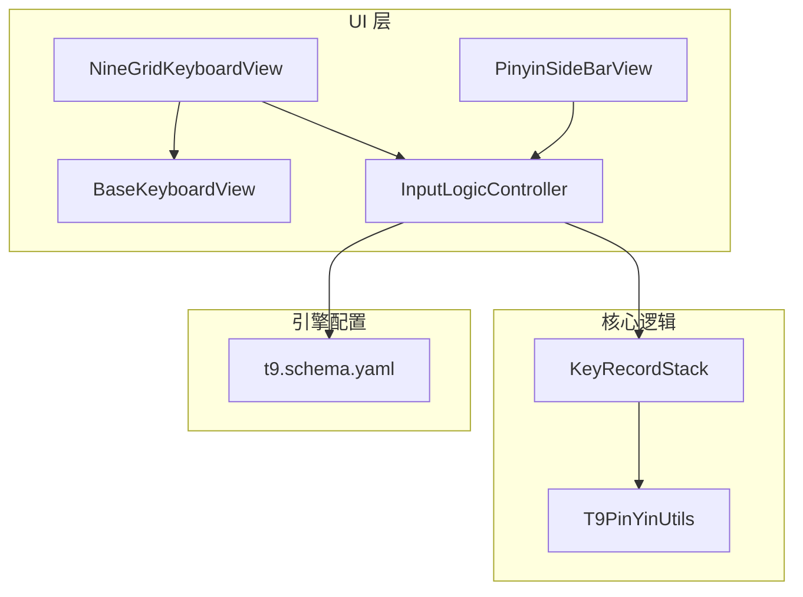
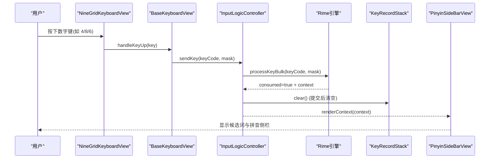
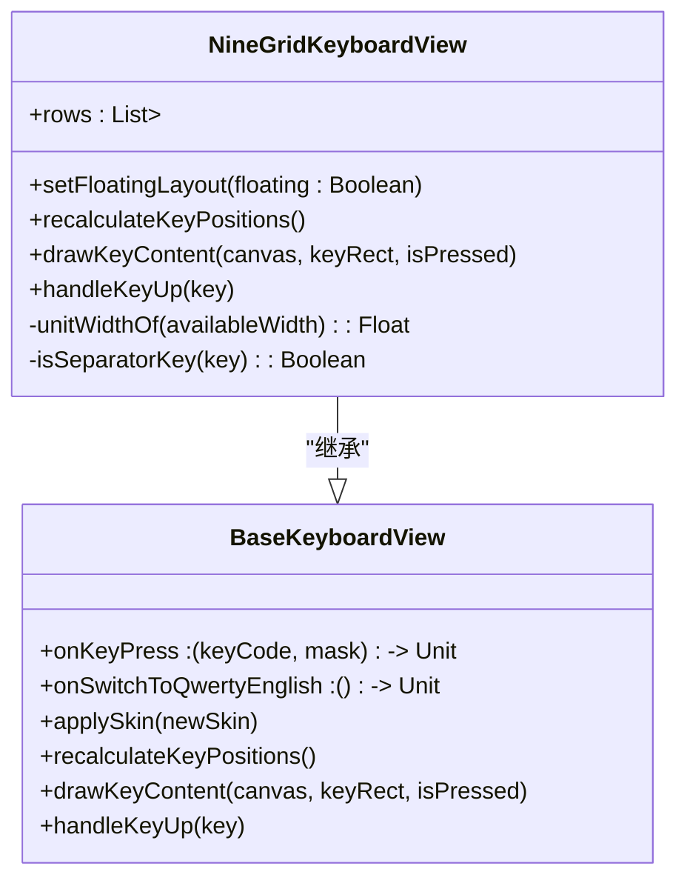
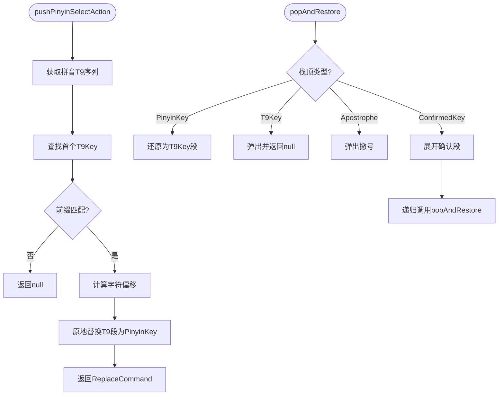
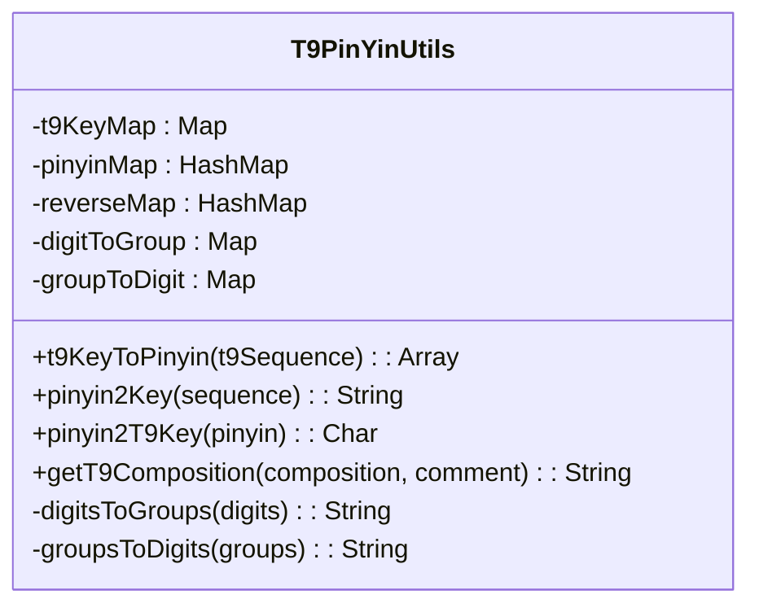
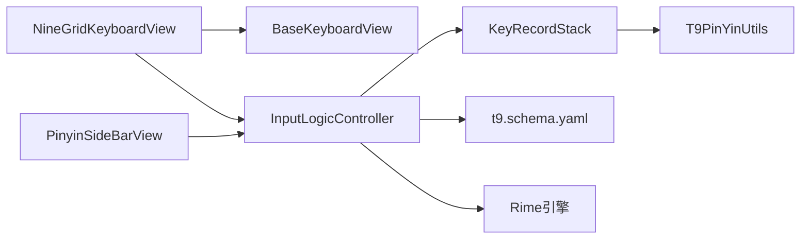

# 九宫格键盘

<cite>
**本文引用的文件**   
- [NineGridKeyboardView.kt](file://app/src/main/java/com/ziyou/ime/ime/NineGridKeyboardView.kt)
- [BaseKeyboardView.kt](file://app/src/main/java/com/ziyou/ime/ime/BaseKeyboardView.kt)
- [InputLogicController.kt](file://app/src/main/java/com/ziyou/ime/ime/InputLogicController.kt)
- [KeyRecordStack.kt](file://core-logic/src/main/java/com/ziyou/ime/core/t9/KeyRecordStack.kt)
- [T9PinYinUtils.kt](file://core-logic/src/main/java/com/ziyou/ime/util/T9PinYinUtils.kt)
- [PinyinSideBarView.kt](file://app/src/main/java/com/ziyou/ime/ime/PinyinSideBarView.kt)
- [KeyCode.kt](file://app/src/main/java/com/ziyou/ime/ime/KeyCode.kt)
- [t9.schema.yaml](file://app/src/main/assets/rime/t9.schema.yaml)
- [KeyRecordStackTest.kt](file://core-logic/src/test/java/com/ziyou/ime/core/t9/KeyRecordStackTest.kt)
</cite>

## 目录
1. [简介](#简介)
2. [项目结构](#项目结构)
3. [核心组件](#核心组件)
4. [架构总览](#架构总览)
5. [详细组件分析](#详细组件分析)
6. [依赖关系分析](#依赖关系分析)
7. [性能考量](#性能考量)
8. [故障排查指南](#故障排查指南)
9. [结论](#结论)
10. [附录：自定义与优化示例](#附录自定义与优化示例)

## 简介
本技术文档围绕“九宫格（T9）键盘”的实现进行深入解析，覆盖以下关键主题：
- NineGridKeyboardView 的布局与交互设计（数字键网格、右侧功能列、底行切换逻辑）
- T9 输入算法的核心逻辑（KeyRecordStack 按键记录栈、消歧处理、候选排序策略）
- 数字键与字母键切换、标点快速输入与智能联想
- 性能优化（按键缓存、预加载、内存管理）
- 自定义与扩展（布局定制、映射规则修改、输入算法优化）

## 项目结构
本项目采用分层组织方式：
- app 模块：Android UI 层（输入法服务、键盘视图、候选区、侧栏等）
- core-logic 模块：纯 Kotlin 核心逻辑（T9 状态机、拼音工具类）
- assets/rime：Rime 引擎配置（t9.schema.yaml 定义 T9 方案）
- librime-prebuilt：Rime 引擎原生库与插件

**图表来源** 
- [NineGridKeyboardView.kt:1-288](file://app/src/main/java/com/ziyou/ime/ime/NineGridKeyboardView.kt#L1-L288)
- [BaseKeyboardView.kt:1-619](file://app/src/main/java/com/ziyou/ime/ime/BaseKeyboardView.kt#L1-L619)
- [PinyinSideBarView.kt:1-397](file://app/src/main/java/com/ziyou/ime/ime/PinyinSideBarView.kt#L1-L397)
- [InputLogicController.kt:1-531](file://app/src/main/java/com/ziyou/ime/ime/InputLogicController.kt#L1-L531)
- [KeyRecordStack.kt:1-310](file://core-logic/src/main/java/com/ziyou/ime/core/t9/KeyRecordStack.kt#L1-L310)
- [T9PinYinUtils.kt:1-375](file://core-logic/src/main/java/com/ziyou/ime/util/T9PinYinUtils.kt#L1-L375)
- [t9.schema.yaml:1-126](file://app/src/main/assets/rime/t9.schema.yaml#L1-L126)

**章节来源**
- [NineGridKeyboardView.kt:1-288](file://app/src/main/java/com/ziyou/ime/ime/NineGridKeyboardView.kt#L1-L288)
- [BaseKeyboardView.kt:1-619](file://app/src/main/java/com/ziyou/ime/ime/BaseKeyboardView.kt#L1-L619)
- [t9.schema.yaml:1-126](file://app/src/main/assets/rime/t9.schema.yaml#L1-L126)

## 核心组件
- NineGridKeyboardView：九宫格键盘视图，负责布局、绘制与按键事件分发
- BaseKeyboardView：键盘基类，提供通用布局、触摸、皮肤与绘制能力
- InputLogicController：输入逻辑控制器，串联 Rime 引擎、候选词与状态机
- KeyRecordStack：T9 输入状态机，维护按键记录、拼音锁定与退格还原
- T9PinYinUtils：T9 数字键与拼音的双向映射工具
- PinyinSideBarView：左侧拼音/符号侧栏，支持点击选择与滚动
- t9.schema.yaml：Rime T9 方案配置，定义 speller/algebra 映射与处理器链

**章节来源**
- [NineGridKeyboardView.kt:1-288](file://app/src/main/java/com/ziyou/ime/ime/NineGridKeyboardView.kt#L1-L288)
- [BaseKeyboardView.kt:1-619](file://app/src/main/java/com/ziyou/ime/ime/BaseKeyboardView.kt#L1-L619)
- [InputLogicController.kt:1-531](file://app/src/main/java/com/ziyou/ime/ime/InputLogicController.kt#L1-L531)
- [KeyRecordStack.kt:1-310](file://core-logic/src/main/java/com/ziyou/ime/core/t9/KeyRecordStack.kt#L1-L310)
- [T9PinYinUtils.kt:1-375](file://core-logic/src/main/java/com/ziyou/ime/util/T9PinYinUtils.kt#L1-L375)
- [PinyinSideBarView.kt:1-397](file://app/src/main/java/com/ziyou/ime/ime/PinyinSideBarView.kt#L1-L397)
- [t9.schema.yaml:1-126](file://app/src/main/assets/rime/t9.schema.yaml#L1-L126)

## 架构总览
整体流程从用户按键到候选词展示的关键路径如下：

**图表来源** 
- [NineGridKeyboardView.kt:253-280](file://app/src/main/java/com/ziyou/ime/ime/NineGridKeyboardView.kt#L253-L280)
- [BaseKeyboardView.kt:580-583](file://app/src/main/java/com/ziyou/ime/ime/BaseKeyboardView.kt#L580-L583)
- [InputLogicController.kt:126-185](file://app/src/main/java/com/ziyou/ime/ime/InputLogicController.kt#L126-L185)
- [PinyinSideBarView.kt:215-227](file://app/src/main/java/com/ziyou/ime/ime/PinyinSideBarView.kt#L215-L227)

## 详细组件分析

### NineGridKeyboardView：九宫格键盘视图
- 布局模型：标准 4 行结构（3×3 字母键网格 + 右侧功能列 + 底行），底行在停靠形态下仅占左侧三列宽度，悬浮形态增加「符号」入口
- 按键渲染：字母键显示大写字母序列（ABC / PQRS），分词键居中绘制，底行使用较小字号
- 按键处理：字母键直接发送对应数字键给 Rime；功能键包括重输（Escape）、换行（Return）、中英文切换、数字模式切换等
- 布局计算：基于权重与间距动态计算单元宽度，确保底行与上方网格严格对齐

**图表来源** 
- [NineGridKeyboardView.kt:37-120](file://app/src/main/java/com/ziyou/ime/ime/NineGridKeyboardView.kt#L37-L120)
- [BaseKeyboardView.kt:43-147](file://app/src/main/java/com/ziyou/ime/ime/BaseKeyboardView.kt#L43-L147)

**章节来源**
- [NineGridKeyboardView.kt:62-120](file://app/src/main/java/com/ziyou/ime/ime/NineGridKeyboardView.kt#L62-L120)
- [NineGridKeyboardView.kt:214-280](file://app/src/main/java/com/ziyou/ime/ime/NineGridKeyboardView.kt#L214-L280)

### KeyRecordStack：T9 输入状态机
- 数据结构：ArrayList<InputKey>，维护 T9Key、Apostrophe、PinyinKey、ConfirmedKey 四种记录类型
- 核心操作：
  - pushT9Key：追加数字键
  - pushPinyinSelectAction：锁定首个未确定音节对应的 T9 段，返回替换指令
  - confirmLeading：分段确认后合并栈头为确认段
  - popAndRestore：智能退格，解锁已锁定拼音或弹出普通键
  - unconfirmAll：展开全部确认段回合并前记录
- 偏移计算：charOffsetBefore 按记录类型计算字符宽度，确保替换位置准确

**图表来源** 
- [KeyRecordStack.kt:57-83](file://core-logic/src/main/java/com/ziyou/ime/core/t9/KeyRecordStack.kt#L57-L83)
- [KeyRecordStack.kt:196-230](file://core-logic/src/main/java/com/ziyou/ime/core/t9/KeyRecordStack.kt#L196-L230)

**章节来源**
- [KeyRecordStack.kt:20-310](file://core-logic/src/main/java/com/ziyou/ime/core/t9/KeyRecordStack.kt#L20-L310)
- [KeyRecordStackTest.kt:18-185](file://core-logic/src/test/java/com/ziyou/ime/core/t9/KeyRecordStackTest.kt#L18-L185)

### T9PinYinUtils：T9 与拼音映射工具
- 双向映射：t9KeyToPinyin（数字→拼音）、pinyin2Key（拼音→数字）
- 内部结构：
  - t9KeyMap：单字符拼音到组代表字母映射
  - pinyinMap：组代表字母序列到拼音列表映射
  - reverseMap：拼音到组代表字母的反向索引
- 性能优化：O(1) 查找、LinkedHashSet 去重保序、长度限制避免组合爆炸

**图表来源** 
- [T9PinYinUtils.kt:12-375](file://core-logic/src/main/java/com/ziyou/ime/util/T9PinYinUtils.kt#L12-L375)

**章节来源**
- [T9PinYinUtils.kt:305-375](file://core-logic/src/main/java/com/ziyou/ime/util/T9PinYinUtils.kt#L305-L375)

### PinyinSideBarView：拼音侧栏
- 双模式：拼音模式（显示候选拼音）和符号模式（显示自定义符号）
- 交互：点击选择、竖向滚动、底部固定「符号」键
- 布局：与九宫格网格几何对齐，支持圆角裁剪和阴影效果

**章节来源**
- [PinyinSideBarView.kt:215-227](file://app/src/main/java/com/ziyou/ime/ime/PinyinSideBarView.kt#L215-L227)
- [PinyinSideBarView.kt:287-299](file://app/src/main/java/com/ziyou/ime/ime/PinyinSideBarView.kt#L287-L299)

### InputLogicController：输入逻辑控制器
- 核心职责：按键处理、候选词选择、状态机同步、UI 刷新
- 线程模型：协程 + Mutex 串行化输入事务，避免竞态条件
- 性能监控：慢按键告警、编码长度上限防护

**章节来源**
- [InputLogicController.kt:126-185](file://app/src/main/java/com/ziyou/ime/ime/InputLogicController.kt#L126-L185)
- [InputLogicController.kt:195-227](file://app/src/main/java/com/ziyou/ime/ime/InputLogicController.kt#L195-L227)

### t9.schema.yaml：T9 方案配置
- speller.algebra：定义数字键与字母的派生规则（abc→2, def→3 等）
- 处理器链：ascii_composer → recognizer → predictor → key_binder → speller → punctuator → selector → navigator → express_editor
- 预测器：librime-predict 配置，支持上屏后预测候选

**章节来源**
- [t9.schema.yaml:71-97](file://app/src/main/assets/rime/t9.schema.yaml#L71-L97)
- [t9.schema.yaml:38-62](file://app/src/main/assets/rime/t9.schema.yaml#L38-L62)

## 依赖关系分析

**图表来源** 
- [NineGridKeyboardView.kt:253-280](file://app/src/main/java/com/ziyou/ime/ime/NineGridKeyboardView.kt#L253-L280)
- [InputLogicController.kt:126-185](file://app/src/main/java/com/ziyou/ime/ime/InputLogicController.kt#L126-L185)
- [KeyRecordStack.kt:57-83](file://core-logic/src/main/java/com/ziyou/ime/core/t9/KeyRecordStack.kt#L57-L83)

**章节来源**
- [BaseKeyboardView.kt:87-104](file://app/src/main/java/com/ziyou/ime/ime/BaseKeyboardView.kt#L87-L104)
- [InputLogicController.kt:43-49](file://app/src/main/java/com/ziyou/ime/ime/InputLogicController.kt#L43-L49)

## 性能考量
- 按键缓存：BaseKeyboardView 缓存按键矩形位置（keyRects），避免重复计算
- 预加载机制：T9PinYinUtils 预构建反向索引表，实现 O(1) 查找
- 内存管理：KeyRecordStack 使用 ArrayList 存储记录，最大容量 20，避免过度分配
- 线程优化：InputLogicController 使用 Mutex 串行化输入事务，减少 JNI 跨界次数
- 编码长度防护：MAX_INPUT_LENGTH = 30，防止长编码导致的组合爆炸

**章节来源**
- [BaseKeyboardView.kt:166-168](file://app/src/main/java/com/ziyou/ime/ime/BaseKeyboardView.kt#L166-L168)
- [T9PinYinUtils.kt:43-46](file://core-logic/src/main/java/com/ziyou/ime/util/T9PinYinUtils.kt#L43-L46)
- [KeyRecordStack.kt:22](file://core-logic/src/main/java/com/ziyou/ime/core/t9/KeyRecordStack.kt#L22)
- [InputLogicController.kt:54-64](file://app/src/main/java/com/ziyou/ime/ime/InputLogicController.kt#L54-L64)

## 故障排查指南
- 候选词错乱：检查 KeyRecordStack 的 confirmLeading 是否成功同步，失败时会自动清栈降级
- 退格异常：确认 popAndRestore 是否正确处理已确认段的展开逻辑
- 慢按键问题：关注 InputLogicController 的慢按键告警日志，检查编码长度是否超限
- 布局错位：验证 recalculateKeyPositions 是否正确计算 gridUnitWidth 和 rowUnitWidth

**章节来源**
- [InputLogicController.kt:233-245](file://app/src/main/java/com/ziyou/ime/ime/InputLogicController.kt#L233-L245)
- [KeyRecordStack.kt:196-230](file://core-logic/src/main/java/com/ziyou/ime/core/t9/KeyRecordStack.kt#L196-L230)
- [InputLogicController.kt:143-146](file://app/src/main/java/com/ziyou/ime/ime/InputLogicController.kt#L143-L146)

## 结论
九宫格键盘通过清晰的组件分工和高效的算法实现，提供了流畅的 T9 输入体验。KeyRecordStack 的状态机设计确保了多音节输入的准确性，而 T9PinYinUtils 的映射工具则为候选词匹配提供了高性能支持。整体架构具有良好的可扩展性，便于后续功能增强和性能优化。

## 附录：自定义与优化示例

### 自定义九宫格布局
- 修改 rows 定义以调整按键排列
- 覆写 rowUnitWidth 实现特殊行的宽度控制
- 自定义 drawKeyContent 实现个性化按键样式

**参考路径**
- [NineGridKeyboardView.kt:66-106](file://app/src/main/java/com/ziyou/ime/ime/NineGridKeyboardView.kt#L66-L106)
- [NineGridKeyboardView.kt:158-166](file://app/src/main/java/com/ziyou/ime/ime/NineGridKeyboardView.kt#L158-L166)
- [NineGridKeyboardView.kt:228-249](file://app/src/main/java/com/ziyou/ime/ime/NineGridKeyboardView.kt#L228-L249)

### 修改按键映射规则
- 扩展 T9PinYinUtils 的 pinyinMap 添加新拼音映射
- 修改 t9.schema.yaml 的 speller.algebra 定义新的派生规则
- 更新 KeyCode 常量以支持新的按键码

**参考路径**
- [T9PinYinUtils.kt:63-297](file://core-logic/src/main/java/com/ziyou/ime/util/T9PinYinUtils.kt#L63-L297)
- [t9.schema.yaml:75-96](file://app/src/main/assets/rime/t9.schema.yaml#L75-L96)
- [KeyCode.kt:81-113](file://app/src/main/java/com/ziyou/ime/ime/KeyCode.kt#L81-L113)

### 优化输入算法
- 实现更高效的候选词排序策略
- 优化 KeyRecordStack 的内存分配策略
- 添加按键预加载机制减少延迟

**参考路径**
- [InputLogicController.kt:126-185](file://app/src/main/java/com/ziyou/ime/ime/InputLogicController.kt#L126-L185)
- [KeyRecordStack.kt:22-34](file://core-logic/src/main/java/com/ziyou/ime/core/t9/KeyRecordStack.kt#L22-L34)
- [T9PinYinUtils.kt:305-318](file://core-logic/src/main/java/com/ziyou/ime/util/T9PinYinUtils.kt#L305-L318)